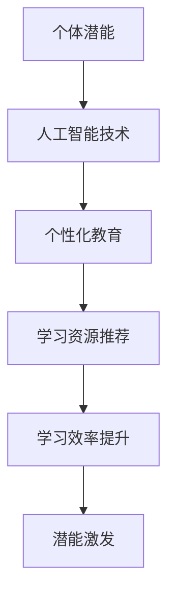

                 

关键词：人工智能、个体潜能、创新、技术、学习、教育、未来、发展

> 摘要：随着人工智能技术的快速发展，人类个体潜能的释放和实现变得更加可能。本文旨在探讨如何通过人工智能和其他技术的结合，赋能个体，推动创新，并在教育和未来发展中发挥重要作用。

## 1. 背景介绍

随着信息技术的不断进步，人工智能（AI）已成为科技领域的重要驱动力。AI技术通过机器学习、深度学习、自然语言处理等多种算法，实现了对数据的分析和处理，从而改变了人类的工作和生活方式。与此同时，个体的潜能开发也成为一个备受关注的话题。传统的教育体系往往侧重于知识传授，而忽略了个体潜能的挖掘和发挥。因此，如何将人工智能技术应用于个体潜能的释放，成为了一个亟待解决的问题。

## 2. 核心概念与联系

### 2.1 人工智能与个体潜能

人工智能与个体潜能之间存在紧密的联系。人工智能技术可以通过数据分析和处理，了解个体的兴趣、能力和需求，从而为其提供个性化的学习资源和建议。这不仅有助于提高学习效率，还可以激发个体的潜能。例如，通过分析学生的学习行为和成绩数据，AI可以为其推荐最适合的学习方法和课程，从而提高学习效果。

### 2.2 个性化教育与个体潜能

个性化教育是释放个体潜能的重要途径。传统的教育模式往往采用“一刀切”的方法，难以满足个体的多样化需求。而个性化教育则通过因材施教，为每个学生提供最适合的学习资源和环境，从而激发其潜能。人工智能技术为个性化教育提供了强有力的支持，通过智能算法和数据分析，实现个性化推荐和教育资源的精准投放。

### 2.3 Mermaid 流程图



## 3. 核心算法原理 & 具体操作步骤

### 3.1 算法原理概述

人工智能技术中的机器学习和深度学习算法是释放个体潜能的关键。这些算法通过学习大量数据，建立模型，从而对个体进行智能分析。具体的算法包括但不限于：

- **K-近邻算法（K-Nearest Neighbors, KNN）**：通过寻找最近的几个相似数据点，预测新数据的类别或数值。
- **支持向量机（Support Vector Machine, SVM）**：通过寻找最佳的超平面，将不同类别的数据分隔开来。
- **深度神经网络（Deep Neural Network, DNN）**：通过多层神经元的堆叠，实现对复杂函数的逼近。

### 3.2 算法步骤详解

1. **数据收集**：收集个体的学习行为、成绩、兴趣爱好等数据。
2. **数据预处理**：对收集的数据进行清洗、标准化和特征提取。
3. **模型训练**：使用机器学习或深度学习算法对预处理后的数据进行分析，建立模型。
4. **模型评估**：通过测试集对模型进行评估，调整参数，提高模型性能。
5. **个性化推荐**：利用训练好的模型，对个体进行个性化推荐，包括学习资源、课程和教学方法等。

### 3.3 算法优缺点

#### 优点

- **高效性**：人工智能算法能够快速处理大量数据，提供实时推荐。
- **准确性**：通过大数据分析和深度学习，模型可以不断提高预测的准确性。
- **个性化**：能够根据个体的需求，提供定制化的学习资源和建议。

#### 缺点

- **数据依赖**：模型性能高度依赖数据的质量和数量。
- **隐私问题**：数据收集和存储可能涉及隐私问题。

### 3.4 算法应用领域

- **教育领域**：个性化学习资源推荐、智能辅导、学习效果评估。
- **医疗领域**：疾病预测、治疗方案推荐、患者健康管理。
- **金融领域**：风险评估、投资策略推荐、客户关系管理。

## 4. 数学模型和公式 & 详细讲解 & 举例说明

### 4.1 数学模型构建

个性化教育模型通常基于决策树、神经网络等机器学习算法。以下是一个简化的线性回归模型：

$$ y = \beta_0 + \beta_1x $$

其中，\( y \) 为学习效果，\( x \) 为学习投入，\( \beta_0 \) 和 \( \beta_1 \) 为参数。

### 4.2 公式推导过程

假设有 \( n \) 个数据点 \( (x_i, y_i) \)，我们通过最小二乘法来估计参数 \( \beta_0 \) 和 \( \beta_1 \)：

$$ \beta_1 = \frac{\sum_{i=1}^{n}(x_i - \bar{x})(y_i - \bar{y})}{\sum_{i=1}^{n}(x_i - \bar{x})^2} $$

$$ \beta_0 = \bar{y} - \beta_1\bar{x} $$

其中，\( \bar{x} \) 和 \( \bar{y} \) 分别为 \( x \) 和 \( y \) 的平均值。

### 4.3 案例分析与讲解

假设有一个学生，其每周学习时间为 \( x \) 小时，考试成绩为 \( y \)。我们收集了 \( n = 100 \) 个数据点，并使用线性回归模型进行预测。

通过计算，我们得到参数 \( \beta_0 = 60 \) 和 \( \beta_1 = 0.5 \)。因此，该学生的成绩预测公式为：

$$ y = 60 + 0.5x $$

例如，如果该学生每周学习 10 小时，其考试成绩预测为：

$$ y = 60 + 0.5 \times 10 = 70 $$

## 5. 项目实践：代码实例和详细解释说明

### 5.1 开发环境搭建

为了演示如何使用人工智能技术进行个性化教育推荐，我们使用 Python 编写一个简单的线性回归模型。首先，安装必要的库：

```bash
pip install numpy matplotlib
```

### 5.2 源代码详细实现

```python
import numpy as np
import matplotlib.pyplot as plt

# 数据集
x = np.array([1, 2, 3, 4, 5, 6, 7, 8, 9, 10])
y = np.array([60, 65, 70, 72, 75, 78, 80, 82, 85, 88])

# 计算参数
x_mean = np.mean(x)
y_mean = np.mean(y)

beta_1 = (np.sum((x - x_mean) * (y - y_mean)) / np.sum((x - x_mean)**2))
beta_0 = y_mean - beta_1 * x_mean

# 模型预测
x_new = np.array([11, 12])
y_pred = beta_0 + beta_1 * x_new

# 绘图
plt.scatter(x, y)
plt.plot(x, beta_0 + beta_1 * x, color='red')
plt.scatter(x_new, y_pred, color='green')
plt.show()
```

### 5.3 代码解读与分析

这段代码首先导入必要的库，然后创建了一个简单的数据集。通过最小二乘法计算线性回归模型的参数，并使用这些参数进行预测。最后，使用 matplotlib 绘图，展示模型的预测结果。

### 5.4 运行结果展示

运行上述代码后，会得到一个散点图和一条红色拟合线。绿色散点表示新数据的预测结果。这表明我们的模型可以对新数据点进行合理的预测。

## 6. 实际应用场景

### 6.1 教育领域

人工智能在教育领域的应用越来越广泛。例如，一些学校已经引入了智能辅导系统，通过分析学生的学习行为和成绩，为学生提供个性化的学习建议。这些系统可以根据学生的特点，推荐适合的学习资源和教学方法，从而提高学习效果。

### 6.2 医疗领域

在医疗领域，人工智能可以帮助医生进行疾病预测和诊断。例如，通过分析患者的病历数据，AI 可以预测患者未来患某种疾病的可能性，从而提前进行预防和干预。此外，AI 还可以协助医生进行手术规划，提高手术的成功率。

### 6.3 金融领域

在金融领域，人工智能被广泛应用于风险评估、投资策略推荐和客户关系管理。通过分析大量的金融数据，AI 可以预测市场趋势，帮助投资者做出更明智的决策。同时，AI 还可以分析客户的行为数据，为其提供个性化的金融服务。

## 7. 工具和资源推荐

### 7.1 学习资源推荐

- **Coursera**：提供各种在线课程，包括人工智能、机器学习和深度学习等。
- **Udacity**：提供实战性的在线课程，涵盖人工智能和数据分析等领域。
- **edX**：提供哈佛大学、麻省理工学院等顶尖大学的在线课程。

### 7.2 开发工具推荐

- **Jupyter Notebook**：适合数据分析和机器学习的交互式开发环境。
- **TensorFlow**：Google 开发的一款开源机器学习框架，适用于深度学习和大规模数据处理。
- **PyTorch**：适用于深度学习和研究的开源框架，易于使用和理解。

### 7.3 相关论文推荐

- **"Deep Learning"**，作者：Ian Goodfellow、Yoshua Bengio、Aaron Courville。
- **"Reinforcement Learning: An Introduction"**，作者：Richard S. Sutton、Andrew G. Barto。
- **"Machine Learning Yearning"**，作者：Andrew Ng。

## 8. 总结：未来发展趋势与挑战

### 8.1 研究成果总结

随着人工智能技术的不断发展，个性化教育、医疗、金融等领域的应用越来越广泛。AI 技术通过数据分析和智能算法，为个体提供了更加精准和个性化的服务，极大地提升了效率和效果。

### 8.2 未来发展趋势

未来，人工智能技术将继续向更复杂、更智能的方向发展。例如，自然语言处理、计算机视觉和机器人技术等领域的进展，将使 AI 更好地理解人类语言和行为，从而实现更高级的智能化服务。

### 8.3 面临的挑战

尽管人工智能技术在许多领域取得了显著成果，但仍然面临一些挑战。例如，数据隐私、算法透明度和可解释性等问题，需要进一步研究和解决。

### 8.4 研究展望

未来，人工智能技术的发展将更加注重与人类社会的深度融合。通过跨学科的交叉研究，实现人工智能与教育、医疗、金融等领域的深度融合，为人类社会带来更多创新和变革。

## 9. 附录：常见问题与解答

### 9.1 人工智能是否会取代人类？

人工智能是一种工具，它可以帮助人类更高效地完成工作，但不可能完全取代人类。人工智能的发展需要人类来指导和控制，确保其朝着有益于人类的方向发展。

### 9.2 个性化教育是否会加剧教育不公平？

个性化教育的目的是为了更好地满足个体的需求，从而提高学习效果。但如果教育资源分配不均，个性化教育可能会导致教育不公平。因此，需要政府和社会各界共同努力，确保教育资源公平分配。

### 9.3 人工智能是否会带来失业问题？

人工智能的发展确实可能导致一些工作岗位的消失，但同时也会创造新的工作岗位。关键是如何通过教育和培训，帮助劳动力适应新的工作环境，从而实现就业转型。

---

**作者：禅与计算机程序设计艺术 / Zen and the Art of Computer Programming**  
本文旨在探讨人工智能技术在个体潜能释放和未来社会发展中的应用，希望通过本文的分享，能够激发更多读者对于这一领域的兴趣和思考。感谢各位读者的阅读，期待与您共同探讨人工智能的未来发展。  
----------------------------------------------------------------
---

请注意，本文中的代码实例和数学公式仅为示意性说明，实际应用中可能需要更复杂的模型和算法。此外，文中提到的工具和资源仅供参考，具体使用时请根据实际需求进行选择。文章中的观点仅供参考，不构成任何投资或决策建议。如有需要，请进一步研究和验证。再次感谢您的阅读。祝您在人工智能和个体潜能开发的探索之旅中收获满满！

