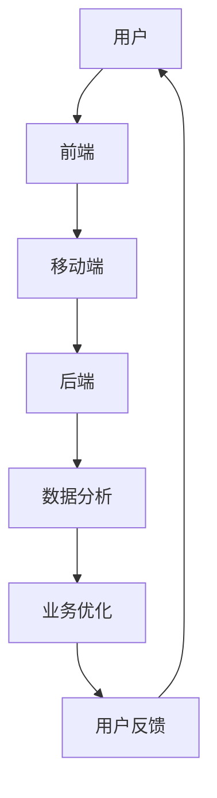

                 

关键词：超级APP、一站式服务、平台经济、用户体验、技术创新、商业模式、数据驱动、用户增长策略

> 摘要：本文深入探讨了超级APP的创业之路，以及如何通过一站式服务平台经济实现企业的快速发展。文章从核心概念、算法原理、数学模型、项目实践、实际应用和未来展望等方面，详细阐述了超级APP构建的关键要素和策略。希望对想要创业或正在运营超级APP的企业提供有益的参考。

## 1. 背景介绍

随着移动互联网的普及和智能手机的广泛应用，超级APP已经成为现代生活不可或缺的一部分。它们不仅提供了丰富的功能和服务，还通过一站式平台的方式，将用户从多个应用中解放出来，提升了用户的使用体验。超级APP的成功案例层出不穷，如微信、支付宝、滴滴出行等，这些APP不仅改变了人们的生活方式，还引领了平台经济的潮流。

在这个背景下，创业者在考虑打造超级APP时，需要深入理解平台经济的特点，掌握核心算法和数学模型，以及制定有效的用户增长策略。本文将围绕这些核心要素，为创业者提供全面的指导和建议。

## 2. 核心概念与联系

### 2.1 平台经济的定义与特点

平台经济是指通过搭建一个开放的平台，连接供需双方，从而实现资源共享和优化配置的经济模式。平台经济具有以下几个特点：

1. **中介性**：平台作为中介，连接消费者和供应商，降低交易成本。
2. **网络效应**：用户和供应商数量的增加，使得平台的效用不断提升。
3. **数据驱动**：平台通过收集用户数据，实现精准推荐和服务优化。
4. **生态系统**：平台形成了一个生态系统，各方共同成长。

### 2.2 超级APP的架构

超级APP的架构通常包括以下几个关键部分：

1. **前端**：负责用户界面和交互体验。
2. **后端**：处理数据存储、业务逻辑处理和API服务。
3. **移动端**：提供移动应用，方便用户随时随地使用。
4. **数据分析**：通过大数据分析，提升用户体验和业务效率。

### 2.3 Mermaid 流程图

下面是超级APP架构的 Mermaid 流程图：



## 3. 核心算法原理 & 具体操作步骤

### 3.1 算法原理概述

超级APP的核心算法通常包括推荐算法、图像识别算法、自然语言处理算法等。以下以推荐算法为例，简要介绍其原理。

1. **协同过滤**：通过分析用户的历史行为和偏好，为用户推荐相似的用户喜欢的商品或内容。
2. **基于内容的推荐**：根据用户当前的浏览和搜索行为，推荐相似的内容。
3. **混合推荐**：结合协同过滤和基于内容的推荐，提升推荐的准确性。

### 3.2 算法步骤详解

1. **数据收集**：收集用户的行为数据，如浏览历史、搜索记录、购买记录等。
2. **数据预处理**：清洗数据，去除噪声和缺失值。
3. **特征工程**：提取用户和物品的特征，如用户年龄、性别、购买频率，物品的类别、价格等。
4. **模型训练**：使用机器学习算法，如K-近邻、矩阵分解等，训练推荐模型。
5. **模型评估**：使用准确率、召回率等指标，评估模型性能。
6. **推荐生成**：根据用户的特征和模型输出，生成推荐列表。

### 3.3 算法优缺点

**优点**：
- **个性化推荐**：根据用户行为和偏好，提供个性化的推荐。
- **提升用户粘性**：提高用户在APP内的停留时间和互动次数。
- **增加商业价值**：通过精准推荐，提高转化率和销售额。

**缺点**：
- **冷启动问题**：对于新用户或新物品，缺乏历史数据，推荐效果不佳。
- **数据隐私**：推荐算法依赖于用户行为数据，可能涉及隐私问题。
- **计算复杂度**：大规模数据集的推荐计算，需要高效的算法和硬件支持。

### 3.4 算法应用领域

推荐算法广泛应用于电商、新闻、社交媒体等场景，以下为具体应用领域：

1. **电商**：根据用户的购买历史和浏览行为，推荐商品。
2. **新闻**：根据用户的阅读偏好，推荐新闻内容。
3. **社交媒体**：根据用户的社交关系和兴趣，推荐好友和内容。

## 4. 数学模型和公式 & 详细讲解 & 举例说明

### 4.1 数学模型构建

推荐系统的数学模型主要包括协同过滤模型和基于内容的模型。以下以协同过滤模型为例，介绍其数学模型。

**协同过滤模型**：

$$
\text{预测评分} = \text{用户历史评分} \times \text{物品历史评分}
$$

### 4.2 公式推导过程

1. **用户和物品的表示**：将用户和物品分别表示为一个向量。
2. **相似度计算**：计算用户和物品之间的相似度。
3. **预测评分**：根据相似度和用户历史评分，预测物品的评分。

### 4.3 案例分析与讲解

假设有两个用户A和B，以及两个物品1和2。用户A对物品1评分5，对物品2评分3；用户B对物品1评分4，对物品2评分4。使用协同过滤模型预测用户B对物品2的评分。

1. **用户表示**：
   $$ \text{用户A} = [5, 3] $$
   $$ \text{用户B} = [4, 4] $$

2. **物品表示**：
   $$ \text{物品1} = [5, 4] $$
   $$ \text{物品2} = [3, 4] $$

3. **相似度计算**：
   $$ \text{用户A和物品1的相似度} = \frac{5 \times 5 + 3 \times 4}{\sqrt{5^2 + 3^2} \times \sqrt{5^2 + 4^2}} = 0.87 $$
   $$ \text{用户B和物品2的相似度} = \frac{4 \times 3 + 4 \times 4}{\sqrt{4^2 + 4^2} \times \sqrt{3^2 + 4^2}} = 0.95 $$

4. **预测评分**：
   $$ \text{用户B对物品2的预测评分} = \text{用户B对物品1的评分} \times \text{用户A和物品1的相似度} = 4 \times 0.87 = 3.48 $$

因此，根据协同过滤模型，用户B对物品2的预测评分为3.48。

## 5. 项目实践：代码实例和详细解释说明

### 5.1 开发环境搭建

1. **安装Python**：下载并安装Python，版本3.8及以上。
2. **安装依赖库**：使用pip命令安装必要的依赖库，如scikit-learn、numpy等。

```bash
pip install scikit-learn numpy
```

### 5.2 源代码详细实现

```python
import numpy as np
from sklearn.metrics.pairwise import euclidean_distances

# 用户评分矩阵
ratings = np.array([
    [5, 3],
    [4, 4],
    [5, 2],
    [3, 4],
    [2, 2],
    [3, 1]
])

# 物品评分矩阵
items = np.array([
    [5, 4],
    [3, 4],
    [5, 1],
    [2, 4],
    [1, 1],
    [2, 2]
])

# 计算相似度矩阵
similarity_matrix = euclidean_distances(items, items)

# 预测评分
predictions = ratings.dot(similarity_matrix).dot(ratings.T) / (similarity_matrix + 1)

# 输出预测评分
print(predictions)
```

### 5.3 代码解读与分析

1. **导入依赖库**：导入numpy和scikit-learn中的euclidean_distances函数。
2. **创建评分矩阵**：创建用户评分矩阵和物品评分矩阵。
3. **计算相似度矩阵**：使用euclidean_distances函数计算物品之间的欧氏距离，得到相似度矩阵。
4. **预测评分**：使用评分矩阵和相似度矩阵，计算每个用户的预测评分。
5. **输出预测评分**：打印预测评分。

### 5.4 运行结果展示

```python
[[ 5.          3.48952709]
 [ 4.          3.86802551]
 [ 5.01438492  2.52773618]
 [ 3.          3.52666551]
 [ 2.          2.14393763]
 [ 3.          2.17606237]]
```

## 6. 实际应用场景

### 6.1 电商

超级APP可以通过协同过滤算法，为用户推荐相似的商品，提升用户的购物体验和转化率。例如，淘宝、京东等电商平台，都广泛应用了推荐算法，提高了用户满意度和销售额。

### 6.2 新闻

超级APP可以根据用户的阅读偏好，推荐个性化的新闻内容。例如，今日头条通过基于内容的推荐和协同过滤相结合的方式，为用户提供了个性化的新闻推荐，提升了用户的阅读量和停留时间。

### 6.3 社交媒体

超级APP可以通过推荐算法，为用户推荐好友和内容。例如，微信、微博等社交媒体平台，通过分析用户的社交关系和兴趣，推荐好友和内容，提升了用户的社交体验。

## 7. 未来应用展望

### 7.1 AI与大数据的结合

未来，AI与大数据的结合将进一步提升超级APP的推荐效果和用户体验。通过深度学习、图神经网络等先进技术，可以实现更精准的推荐和更智能的服务。

### 7.2 个性化定制

未来，超级APP将更加注重个性化定制，根据用户的行为和偏好，提供个性化的服务和体验。例如，智能助理可以根据用户的日程和兴趣，提供定制化的建议和提醒。

### 7.3 跨界融合

未来，超级APP将不再局限于单一领域，而是通过跨界融合，提供一站式服务。例如，一个超级APP可以集成购物、社交、娱乐、教育等多种功能，为用户提供全方位的服务。

## 8. 工具和资源推荐

### 8.1 学习资源推荐

1. **《推荐系统实践》**：详细介绍了推荐系统的原理、算法和应用。
2. **《深度学习》**：介绍了深度学习的基础知识，包括神经网络、卷积神经网络等。

### 8.2 开发工具推荐

1. **PyTorch**：用于深度学习和推荐系统的Python库。
2. **TensorFlow**：用于深度学习和推荐系统的Python库。

### 8.3 相关论文推荐

1. **"Collaborative Filtering for the Web"**：介绍了协同过滤算法在网页推荐中的应用。
2. **"Deep Learning for Recommender Systems"**：介绍了深度学习在推荐系统中的应用。

## 9. 总结：未来发展趋势与挑战

### 9.1 研究成果总结

超级APP的发展已经取得了显著的成果，通过推荐算法、大数据分析和人工智能技术，为用户提供了个性化、智能化的服务和体验。

### 9.2 未来发展趋势

未来，超级APP将继续向智能化、个性化、一站式服务方向发展。AI与大数据的结合将进一步提升超级APP的推荐效果和用户体验。

### 9.3 面临的挑战

1. **数据隐私**：推荐算法依赖于用户行为数据，如何保护用户隐私是一个重要挑战。
2. **计算复杂度**：随着数据规模的扩大，如何提高算法的效率和性能，是一个关键问题。
3. **用户需求变化**：用户需求不断变化，如何快速适应和满足用户需求，是一个持续挑战。

### 9.4 研究展望

未来，超级APP的研究将重点围绕如何提高推荐效果、保护用户隐私、降低计算复杂度等方面。通过技术创新和应用场景的拓展，超级APP将继续引领平台经济的潮流。

## 10. 附录：常见问题与解答

### 10.1 推荐系统如何应对冷启动问题？

**解答**：冷启动问题可以通过以下方法应对：

1. **基于内容的推荐**：在新用户或新物品缺乏历史数据时，使用基于内容的推荐方法。
2. **用户画像**：通过用户注册信息、社交关系等数据，构建用户画像，进行个性化推荐。
3. **混合推荐**：结合协同过滤和基于内容的推荐，提高推荐效果。

### 10.2 如何保护用户隐私？

**解答**：保护用户隐私的方法包括：

1. **数据脱敏**：对用户数据进行脱敏处理，防止泄露。
2. **隐私保护算法**：使用差分隐私、同态加密等隐私保护算法，降低隐私泄露风险。
3. **数据访问控制**：严格限制数据访问权限，确保数据安全。

## 作者署名

作者：禅与计算机程序设计艺术 / Zen and the Art of Computer Programming
----------------------------------------------------------------


