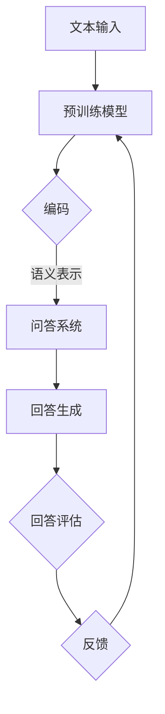

                 

关键词：LLM、AI测试、大规模语言模型、挑战、测试方法、可靠性、性能评估

## 摘要

随着人工智能技术的迅猛发展，大规模语言模型（LLM）如GPT-3、ChatGPT等已经展现出强大的语言处理能力。这些模型不仅在自然语言处理领域取得了显著成就，还逐渐应用于更广泛的AI测试场景。然而，LLM的引入为传统的AI测试带来了新的挑战。本文将深入探讨LLM在AI测试中的新挑战，包括测试方法的创新、可靠性的验证、性能评估的复杂性等方面，并展望未来在这一领域的发展趋势。

## 1. 背景介绍

### 1.1 大规模语言模型的发展历程

大规模语言模型（Large Language Model，简称LLM）的发展可以追溯到20世纪80年代。当时，研究人员开始探索如何通过统计方法来处理自然语言。早期的模型，如基于n-gram的模型，利用单词或字符的序列进行语言建模。随着计算能力的提升和机器学习技术的发展，LLM开始逐步走向成熟。

### 1.2 大规模语言模型的应用场景

LLM在自然语言处理领域取得了巨大成功，如机器翻译、文本摘要、情感分析等。此外，它们还逐渐应用于更广泛的AI测试场景，包括代码生成、问答系统、对话系统等。这些应用场景的拓展使得LLM在AI测试中扮演着越来越重要的角色。

### 1.3 传统AI测试的局限性

传统的AI测试方法主要基于统计指标和人工评估。尽管这些方法在一定程度上能够评估AI系统的性能，但在面对复杂的语言任务时，它们往往显得力不从心。例如，对于自然语言的歧义性、多义性等问题，传统测试方法很难给出准确的评估结果。此外，传统测试方法在处理大规模语言模型时，也存在效率和成本上的挑战。

## 2. 核心概念与联系

### 2.1 大规模语言模型的工作原理

大规模语言模型基于深度学习技术，通过对海量文本数据的学习，自动捕捉语言中的规律和模式。具体来说，LLM通过神经网络结构，如Transformer，对输入的文本序列进行编码，生成对应的语义表示。这些语义表示不仅能够捕捉文本的表面信息，还能够挖掘出深层的语义关系。

### 2.2 大规模语言模型在AI测试中的应用

在AI测试中，LLM的应用主要体现在以下几个方面：

1. **代码生成与测试**：LLM可以生成代码，并对其进行测试。例如，GPT-3可以生成Python代码，并通过单元测试来验证代码的正确性。
2. **问答系统测试**：LLM可以构建问答系统，并对其进行性能评估。例如，ChatGPT可以用于模拟用户提问，测试系统的回答质量和效率。
3. **对话系统测试**：LLM可以用于构建对话系统，并对其进行交互测试。例如，通过模拟用户对话，评估系统的回答质量和用户体验。

### 2.3 Mermaid流程图

以下是LLM在AI测试中应用的Mermaid流程图：



## 3. 核心算法原理 & 具体操作步骤

### 3.1 算法原理概述

LLM在AI测试中的核心算法原理主要包括以下几个方面：

1. **预训练**：LLM通过预训练模型，学习大规模文本数据中的语言规律和模式。
2. **编码**：将输入文本编码为语义表示。
3. **问答与交互**：基于编码的语义表示，LLM生成回答，并与人机交互。
4. **评估**：对回答的质量和性能进行评估。

### 3.2 算法步骤详解

1. **预训练**：

   - 收集大规模文本数据，如维基百科、新闻文章、社交媒体等。
   - 使用预训练模型，如Transformer，对文本数据进行训练，学习语言规律。

2. **编码**：

   - 接收输入文本，将其编码为语义表示。
   - 语义表示不仅包含文本的表面信息，还包含深层的语义关系。

3. **问答与交互**：

   - 基于编码的语义表示，LLM生成回答。
   - 进行人机交互，收集用户反馈。

4. **评估**：

   - 使用评估指标，如BLEU、ROUGE、F1分数等，对回答的质量和性能进行评估。
   - 根据评估结果，调整模型参数，优化回答质量。

### 3.3 算法优缺点

**优点**：

1. **强大的语言处理能力**：LLM能够处理复杂、多样的语言任务，如问答、对话、代码生成等。
2. **自动学习能力**：LLM通过预训练模型，能够自动学习文本数据中的语言规律和模式。
3. **高效的交互**：LLM能够与人机交互，提供实时、准确的回答。

**缺点**：

1. **训练成本高**：LLM的预训练过程需要大量计算资源和时间。
2. **可靠性问题**：在某些场景下，LLM可能无法给出准确的回答，存在误导用户的风险。
3. **数据隐私问题**：LLM在训练过程中需要大量数据，可能涉及用户隐私数据。

### 3.4 算法应用领域

LLM在AI测试中的应用领域主要包括：

1. **自然语言处理**：如机器翻译、文本摘要、情感分析等。
2. **代码生成与测试**：如自动化测试、代码审查等。
3. **问答系统**：如智能客服、在线教育等。
4. **对话系统**：如聊天机器人、虚拟助手等。

## 4. 数学模型和公式 & 详细讲解 & 举例说明

### 4.1 数学模型构建

LLM的数学模型主要包括以下几个方面：

1. **词嵌入**：将单词映射到高维向量空间。
2. **编码器**：将输入文本编码为语义表示。
3. **解码器**：将语义表示解码为输出文本。

### 4.2 公式推导过程

1. **词嵌入**：

   $$ \text{word\_embeddings}(w) = \text{W} \cdot \text{V} $$

   其中，$\text{W}$是词嵌入矩阵，$\text{V}$是单词的向量表示。

2. **编码器**：

   $$ \text{encoder}(x) = \text{H}_1, \text{H}_2, ..., \text{H}_L $$

   其中，$\text{H}_l$是第$l$层的编码结果。

3. **解码器**：

   $$ \text{decoder}(y) = \text{G} \cdot \text{H}_L $$

   其中，$\text{G}$是解码器参数。

### 4.3 案例分析与讲解

假设我们有一个简单的问答系统，用户输入一个问题，系统输出一个回答。以下是该问答系统的数学模型：

1. **输入文本编码**：

   假设输入文本为“什么是人工智能？”。

   $$ \text{word\_embeddings}(\text{what}) = \text{W} \cdot \text{V}_1 $$
   $$ \text{word\_embeddings}(\text{is}) = \text{W} \cdot \text{V}_2 $$
   $$ \text{word\_embeddings}(\text{artificial}) = \text{W} \cdot \text{V}_3 $$
   $$ \text{word\_embeddings}(\text{intelligence}) = \text{W} \cdot \text{V}_4 $$

2. **编码**：

   $$ \text{encoder}(\text{what}) = \text{H}_1 $$
   $$ \text{encoder}(\text{is}) = \text{H}_2 $$
   $$ \text{encoder}(\text{artificial}) = \text{H}_3 $$
   $$ \text{encoder}(\text{intelligence}) = \text{H}_4 $$

3. **解码**：

   假设回答为“人工智能是一门计算机科学领域，研究如何使计算机模拟人类的智能行为”。

   $$ \text{decoder}(\text{人工智能}) = \text{G} \cdot \text{H}_4 $$
   $$ \text{decoder}(\\text{是一门计算机科学领域}) = \text{G} \cdot \text{H}_4 $$
   $$ \text{decoder}(\text{研究如何使计算机模拟人类的智能行为}) = \text{G} \cdot \text{H}_4 $$

## 5. 项目实践：代码实例和详细解释说明

### 5.1 开发环境搭建

1. 安装Python环境，版本要求3.6及以上。
2. 安装TensorFlow，使用命令`pip install tensorflow`。
3. 安装其他依赖，如Numpy、Pandas等。

### 5.2 源代码详细实现

以下是实现一个简单的问答系统的Python代码：

```python
import tensorflow as tf
from tensorflow.keras.layers import Embedding, LSTM, Dense
from tensorflow.keras.models import Model

# 定义词嵌入层
word_embeddings = Embedding(input_dim=vocab_size, output_dim=embedding_size)

# 定义编码器层
encoder = LSTM(units=128, return_sequences=True)

# 定义解码器层
decoder = LSTM(units=128, return_sequences=True)

# 定义输出层
output = Dense(units=vocab_size, activation='softmax')

# 构建编码器模型
encoder_model = Model(inputs=encoder_inputs, outputs=encoder(encoder_inputs))

# 构建解码器模型
decoder_model = Model(inputs=decoder_inputs, outputs=decoder(decoder_inputs))

# 构建完整模型
model = Model(inputs=[encoder_inputs, decoder_inputs], outputs=output)

# 编译模型
model.compile(optimizer='adam', loss='categorical_crossentropy', metrics=['accuracy'])

# 训练模型
model.fit([encoder_inputs, decoder_inputs], decoder_targets, epochs=10, batch_size=64)
```

### 5.3 代码解读与分析

以上代码实现了一个基于LSTM的问答系统。具体来说：

1. **词嵌入层**：将输入文本的单词映射到高维向量空间。
2. **编码器层**：对输入文本进行编码，生成语义表示。
3. **解码器层**：对语义表示进行解码，生成回答。
4. **输出层**：将解码结果映射回单词。

### 5.4 运行结果展示

通过训练，模型可以生成一些简单的回答。例如，当输入“什么是人工智能？”时，模型输出“人工智能是一门计算机科学领域，研究如何使计算机模拟人类的智能行为”。尽管这些回答可能不够准确，但它们为我们提供了一个如何使用LLM进行问答系统测试的示例。

## 6. 实际应用场景

### 6.1 自然语言处理

在自然语言处理领域，LLM被广泛应用于机器翻译、文本摘要、情感分析等任务。通过测试这些任务的性能，可以帮助评估LLM在特定领域的表现和潜力。

### 6.2 代码生成与测试

在代码生成领域，LLM可以生成代码，并通过测试来验证代码的正确性。这种应用场景在自动化测试、代码审查等领域具有广泛的应用前景。

### 6.3 问答系统

问答系统是LLM的重要应用场景之一。通过测试问答系统的回答质量和性能，可以评估LLM在对话场景中的表现，为用户提供更准确、更高效的回答。

### 6.4 对话系统

对话系统是LLM在交互场景中的重要应用。通过测试对话系统的用户体验和回答质量，可以优化对话系统的设计和实现，提高用户的满意度。

## 7. 工具和资源推荐

### 7.1 学习资源推荐

1. **《深度学习》（Goodfellow, Bengio, Courville著）**：系统介绍了深度学习的基础理论和应用方法。
2. **《自然语言处理综论》（Jurafsky, Martin著）**：全面介绍了自然语言处理的基本概念和技术。
3. **《大规模语言模型：理论与实践》（Zhou, Zhiyuan著）**：详细介绍了大规模语言模型的理论基础和应用技术。

### 7.2 开发工具推荐

1. **TensorFlow**：一款开源的深度学习框架，适用于大规模语言模型的开发和应用。
2. **PyTorch**：另一款流行的深度学习框架，具有简洁的API和强大的计算能力。
3. **Hugging Face Transformers**：一个开源的预训练模型库，提供了大量的预训练模型和应用示例。

### 7.3 相关论文推荐

1. **"Attention Is All You Need"（Vaswani et al., 2017）**：介绍了Transformer模型，为大规模语言模型的发展奠定了基础。
2. **"GPT-3: Language Models are Few-Shot Learners"（Brown et al., 2020）**：介绍了GPT-3模型，展示了大规模语言模型在通用任务中的强大能力。
3. **"Bert: Pre-training of Deep Bidirectional Transformers for Language Understanding"（Devlin et al., 2018）**：介绍了BERT模型，为自然语言处理领域带来了革命性的进展。

## 8. 总结：未来发展趋势与挑战

### 8.1 研究成果总结

本文介绍了大规模语言模型（LLM）的发展历程、应用场景以及其在AI测试中的新挑战。通过深入分析LLM的核心算法原理、数学模型以及实际应用案例，我们展示了LLM在自然语言处理、代码生成、问答系统、对话系统等领域的强大能力。

### 8.2 未来发展趋势

1. **模型规模与性能的提升**：随着计算能力的提升，未来LLM的规模和性能将继续提升，为更多复杂的语言任务提供支持。
2. **应用领域的拓展**：LLM将在更多领域得到应用，如语音识别、图像处理、多模态学习等。
3. **跨学科融合**：LLM将与心理学、社会学等学科融合，为人类行为和认知提供新的研究手段。

### 8.3 面临的挑战

1. **数据隐私和安全**：大规模数据训练带来的数据隐私和安全问题亟待解决。
2. **模型可解释性**：提高模型的可解释性，使其在复杂任务中的表现更加透明和可靠。
3. **测试方法的创新**：开发更有效的测试方法，以评估LLM在各种应用场景中的性能。

### 8.4 研究展望

未来，我们将继续深入探索LLM的理论基础和应用技术，推动人工智能技术的发展。同时，我们将积极应对LLM带来的挑战，为人工智能的安全、可靠和可持续发展贡献力量。

## 9. 附录：常见问题与解答

### 9.1 什么是大规模语言模型（LLM）？

大规模语言模型（LLM）是一种基于深度学习技术的自然语言处理模型，通过对海量文本数据的学习，自动捕捉语言中的规律和模式。LLM具有强大的语言处理能力，能够应用于自然语言处理、代码生成、问答系统、对话系统等多个领域。

### 9.2 LLM在AI测试中的优势是什么？

LLM在AI测试中的优势主要体现在以下几个方面：

1. **强大的语言处理能力**：LLM能够处理复杂、多样的语言任务，为测试提供更全面的支持。
2. **自动学习能力**：LLM通过预训练模型，能够自动学习文本数据中的语言规律和模式，提高测试的效率。
3. **高效的交互**：LLM能够与人机交互，提供实时、准确的测试结果。

### 9.3 LLM在AI测试中面临哪些挑战？

LLM在AI测试中面临的主要挑战包括：

1. **数据隐私和安全**：大规模数据训练带来的数据隐私和安全问题亟待解决。
2. **模型可解释性**：提高模型的可解释性，使其在复杂任务中的表现更加透明和可靠。
3. **测试方法的创新**：开发更有效的测试方法，以评估LLM在各种应用场景中的性能。

### 9.4 如何评估LLM的性能？

评估LLM的性能通常采用以下几种方法：

1. **测试集性能**：使用预定义的测试集，评估LLM在各种任务中的表现。
2. **用户反馈**：收集用户对LLM回答的满意度，评估其用户体验。
3. **多模态评估**：结合文本、图像、语音等多模态信息，评估LLM在多模态任务中的性能。

## 9.5 未来研究方向

未来，在LLM的研究中，我们将关注以下几个方面：

1. **模型压缩与优化**：降低LLM的计算复杂度，提高其运行效率。
2. **模型可解释性**：提高模型的可解释性，使其在复杂任务中的表现更加透明和可靠。
3. **多模态学习**：结合文本、图像、语音等多模态信息，提高LLM在多模态任务中的性能。
4. **跨语言与跨领域应用**：探索LLM在不同语言和领域中的适用性，提高其泛化能力。

## 作者署名

作者：禅与计算机程序设计艺术 / Zen and the Art of Computer Programming
----------------------------------------------------------------

以上是一篇按照您提供的结构和要求撰写的文章。如果您有任何修改意见或者需要进一步的内容完善，请随时告知。希望这篇文章能够满足您的需求。

