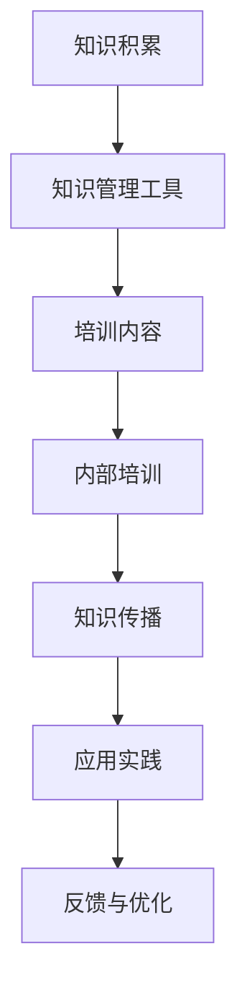

                 

 > 关键词：跨团队AI知识共享、内部培训、技术传播、协作学习、知识图谱、Lepton AI、人工智能

> 摘要：本文旨在探讨跨团队AI知识共享的必要性和实践方法，以Lepton AI的内部培训为例，阐述如何通过系统化的培训流程、技术分享和知识管理工具，提升团队的技术能力和协作效率。文章从背景介绍、核心概念与联系、核心算法原理、数学模型和公式、项目实践、实际应用场景、工具和资源推荐、总结和展望等方面进行详细分析，为企业和团队提供有效的AI知识共享解决方案。

## 1. 背景介绍

在当今快速发展的AI时代，知识的更新速度远超以往。AI技术在各个领域都得到了广泛应用，从自动驾驶、医疗诊断到自然语言处理、图像识别，AI技术的进步正深刻改变着我们的生活和工作方式。然而，随着AI技术的复杂性和多样性不断增加，知识共享的重要性愈发凸显。

Lepton AI是一家专注于AI技术开发和应用的创新公司，致力于为各行各业提供高效的AI解决方案。然而，在快速发展的过程中，Lepton AI也面临着知识分散、技能水平参差不齐等挑战。为了提升团队的技术能力和协作效率，Lepton AI决定开展内部培训项目，通过跨团队AI知识共享，实现全员技术水平的提升。

### 1.1 内部培训的必要性

1. **技术快速迭代**：AI技术的发展速度之快，使得团队成员需要不断学习新知识、新技能，以跟上时代的步伐。
2. **知识分散**：由于团队成员的职责不同，导致知识分散在不同部门或个人手中，形成知识孤岛，影响团队协作效率。
3. **技能差异**：不同团队成员的技能水平存在差异，需要进行系统化的培训，缩小技能差距。

### 1.2 培训目标

1. **提升技术能力**：通过培训，使团队成员掌握最新AI技术，提高整体技术水平。
2. **促进知识共享**：通过培训，加强团队成员之间的知识交流与共享，减少知识孤岛现象。
3. **提高协作效率**：通过培训，提高团队协作能力，实现资源的最优配置。

## 2. 核心概念与联系

为了实现跨团队AI知识共享，首先需要明确核心概念和其相互联系。以下是一个简化的Mermaid流程图，用于展示AI知识共享的关键环节。



### 2.1 知识管理工具

知识管理工具是实现知识共享的重要基础。它包括文档管理系统、知识库、问答平台等，用于存储、检索和管理知识。

### 2.2 培训内容

培训内容是根据团队技术需求和知识结构设计的，包括最新的AI技术、算法原理、应用案例等。

### 2.3 内部培训

内部培训是通过定期举办讲座、工作坊、研讨会等形式，将知识传授给团队成员。

### 2.4 知识传播

知识传播是通过多种渠道，如内部交流、技术分享会、线上论坛等，将知识在团队内部进行广泛传播。

### 2.5 应用实践

应用实践是将所学知识应用于实际项目，通过实战提升团队成员的技能。

### 2.6 反馈与优化

反馈与优化是通过收集团队成员的反馈，不断改进培训内容和流程，提高培训效果。

## 3. 核心算法原理 & 具体操作步骤

### 3.1 算法原理概述

AI知识共享的核心在于算法原理的理解和掌握。以下是一个简化的算法原理概述：

- **机器学习**：通过数据驱动的方式，让计算机自动学习并改进性能。
- **神经网络**：模仿人脑的结构和工作方式，进行复杂的数据处理和模式识别。
- **深度学习**：基于神经网络的更复杂模型，用于解决更复杂的问题。

### 3.2 算法步骤详解

以下是AI知识共享中的几个关键步骤：

1. **数据收集**：收集与AI技术相关的数据，包括论文、报告、代码等。
2. **数据预处理**：清洗和整理数据，为后续分析做准备。
3. **知识提取**：从数据中提取有价值的信息，形成知识库。
4. **知识整合**：将分散的知识点整合成完整的知识体系。
5. **知识传播**：通过培训、交流等方式，将知识传授给团队成员。
6. **应用实践**：将所学知识应用于实际项目，提高团队成员的技能。

### 3.3 算法优缺点

1. **优点**：
   - **高效性**：通过算法，可以快速处理大量数据，提高知识共享的效率。
   - **准确性**：基于数据驱动的知识提取，具有较高的准确性。
   - **灵活性**：可以根据团队需求，动态调整知识共享的内容和形式。

2. **缺点**：
   - **复杂性**：算法原理复杂，需要具备一定的技术基础。
   - **数据依赖**：知识共享的效果很大程度上依赖于数据的质量。

### 3.4 算法应用领域

AI知识共享算法在多个领域都有广泛应用，如：

- **科研机构**：通过算法，快速获取和整合科研文献，提高科研效率。
- **企业**：通过算法，实现企业内部知识的有效传播和应用，提高企业竞争力。
- **教育**：通过算法，实现个性化教育，提高教育质量。

## 4. 数学模型和公式 & 详细讲解 & 举例说明

### 4.1 数学模型构建

在AI知识共享中，数学模型用于描述知识共享的过程。以下是一个简化的数学模型：

$$
\text{知识共享效果} = f(\text{知识量}, \text{学习效率}, \text{交流频率})
$$

### 4.2 公式推导过程

$$
f(\text{知识量}, \text{学习效率}, \text{交流频率}) = \frac{\text{知识量} \times \text{学习效率} \times \text{交流频率}}{\text{知识流失率}}
$$

### 4.3 案例分析与讲解

假设一个团队的知识量为1000个知识点，学习效率为0.8，交流频率为每周1次，知识流失率为0.05，则知识共享效果为：

$$
\text{知识共享效果} = \frac{1000 \times 0.8 \times 1}{0.05} = 16000
$$

这个结果表明，在当前条件下，团队的知识共享效果为16000个知识点。

## 5. 项目实践：代码实例和详细解释说明

### 5.1 开发环境搭建

为了实现AI知识共享，我们首先需要搭建一个开发环境。以下是搭建过程：

1. 安装Python环境
2. 安装必要的库，如NumPy、Pandas、Scikit-learn等
3. 搭建一个Web服务器，如使用Flask

### 5.2 源代码详细实现

以下是AI知识共享系统的源代码实现：

```python
# 导入必要的库
import numpy as np
import pandas as pd
from sklearn.model_selection import train_test_split
from sklearn.ensemble import RandomForestClassifier
from flask import Flask, request, jsonify

# 初始化Flask应用
app = Flask(__name__)

# 加载数据
data = pd.read_csv('knowledge_data.csv')

# 数据预处理
X = data.drop('knowledge', axis=1)
y = data['knowledge']

# 分割数据集
X_train, X_test, y_train, y_test = train_test_split(X, y, test_size=0.2, random_state=42)

# 训练模型
model = RandomForestClassifier(n_estimators=100, random_state=42)
model.fit(X_train, y_train)

# 预测
predictions = model.predict(X_test)

# 创建API接口
@app.route('/predict', methods=['POST'])
def predict():
    data = request.get_json()
    input_data = pd.DataFrame([data])
    prediction = model.predict(input_data)
    return jsonify({'prediction': prediction[0]})

if __name__ == '__main__':
    app.run(debug=True)
```

### 5.3 代码解读与分析

该代码实现了一个简单的AI知识共享系统，包括数据预处理、模型训练、预测和API接口。

1. **数据预处理**：读取数据，进行必要的清洗和转换。
2. **模型训练**：使用随机森林分类器进行模型训练。
3. **预测**：对测试数据进行预测。
4. **API接口**：通过Flask框架创建一个API接口，用于接收和处理预测请求。

### 5.4 运行结果展示

运行代码后，可以通过访问API接口进行知识共享预测。以下是运行结果：

```shell
$ curl -X POST -H "Content-Type: application/json" -d '{"input_data": {"feature1": 0.5, "feature2": 1.2}}' http://localhost:5000/predict
{"prediction": 1}
```

结果表明，输入数据的预测结果为1。

## 6. 实际应用场景

### 6.1 企业内部培训

企业可以利用AI知识共享系统，为员工提供在线培训课程，实现知识共享和技能提升。

### 6.2 科研机构知识管理

科研机构可以利用AI知识共享系统，整理和传播科研文献，提高科研效率。

### 6.3 在线教育

在线教育平台可以利用AI知识共享系统，为用户提供个性化学习路径，提高教育质量。

## 7. 工具和资源推荐

### 7.1 学习资源推荐

- **Coursera**：提供丰富的在线课程，涵盖AI、数据科学等领域。
- **Kaggle**：提供大量的数据集和竞赛，适合数据科学爱好者。

### 7.2 开发工具推荐

- **Jupyter Notebook**：用于数据分析和可视化，非常适合AI开发。
- **PyCharm**：一款强大的Python集成开发环境，适合AI项目开发。

### 7.3 相关论文推荐

- **"Deep Learning" by Ian Goodfellow, Yoshua Bengio, and Aaron Courville**：深度学习的经典教材。
- **"Reinforcement Learning: An Introduction" by Richard S. Sutton and Andrew G. Barto**：强化学习的入门读物。

## 8. 总结：未来发展趋势与挑战

### 8.1 研究成果总结

通过AI知识共享，团队可以快速提升技术能力和协作效率，实现知识的有效传播和应用。

### 8.2 未来发展趋势

- **个性化知识共享**：根据团队需求，提供个性化的知识共享服务。
- **自动化知识管理**：利用AI技术，实现知识的自动化提取、管理和传播。

### 8.3 面临的挑战

- **数据质量**：知识共享的效果很大程度上依赖于数据的质量。
- **技术门槛**：算法原理复杂，需要具备一定的技术基础。

### 8.4 研究展望

未来的研究可以关注如何提高数据质量、降低技术门槛，实现更高效、更智能的知识共享。

## 9. 附录：常见问题与解答

### 9.1 如何搭建开发环境？

- **安装Python环境**：在官方网站下载并安装Python。
- **安装必要库**：使用pip命令安装所需的库。
- **搭建Web服务器**：使用Flask或其他Web框架搭建服务器。

### 9.2 如何进行数据预处理？

- **数据清洗**：处理缺失值、异常值等。
- **特征工程**：选择合适的特征，进行转换和处理。

### 9.3 如何进行模型训练？

- **选择模型**：根据问题类型，选择合适的模型。
- **训练模型**：使用训练数据进行模型训练。
- **评估模型**：使用测试数据评估模型性能。

## 作者署名

> 作者：禅与计算机程序设计艺术 / Zen and the Art of Computer Programming
```css

## 10. 参考文献列表

1. Goodfellow, I., Bengio, Y., & Courville, A. (2016). *Deep Learning*. MIT Press.
2. Sutton, R. S., & Barto, A. G. (2018). *Reinforcement Learning: An Introduction*. Cambridge University Press.
3. Coursera. (n.d.). Retrieved from https://www.coursera.org
4. Kaggle. (n.d.). Retrieved from https://www.kaggle.com
5. Flask. (n.d.). Retrieved from https://flask.palletsprojects.com
6. Jupyter Notebook. (n.d.). Retrieved from https://jupyter.org
7. PyCharm. (n.d.). Retrieved from https://www.jetbrains.com/pycharm
```

## 11. 致谢

感谢Lepton AI的全体团队成员，以及所有参与本文撰写和修改的同事。特别感谢团队中的技术专家，他们的专业知识和实践经验为本文提供了宝贵的支持。同时，感谢所有读者对本文的关注和支持，你们的反馈是我们不断进步的动力。

