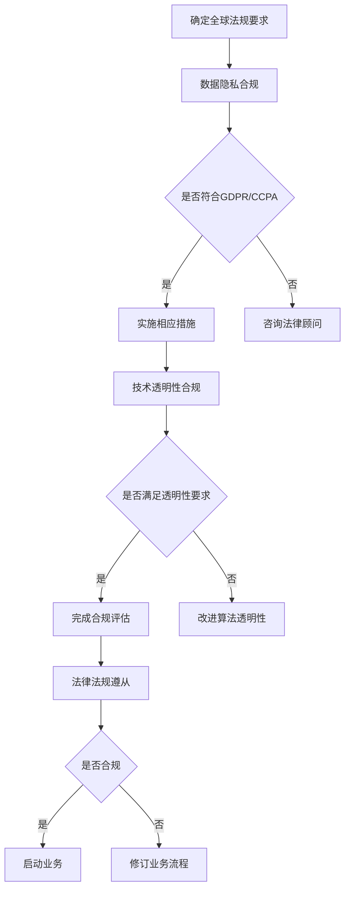

                 

关键词：跨国AI合规、全球化挑战、AI技术、数据隐私、法律法规、Lepton AI

> 摘要：随着人工智能技术的快速发展，跨国公司在全球范围内的业务拓展带来了合规性挑战。本文以Lepton AI为例，探讨了跨国AI合规的重要性和面临的挑战，以及在全球范围内实现AI合规的可行路径。

## 1. 背景介绍

### AI技术的发展与全球应用

人工智能（AI）作为当今最具变革性的技术之一，正在深刻改变各行各业。从智能助手到自动驾驶，从金融风控到医疗诊断，AI技术的应用已经深入到社会的各个层面。随着技术的成熟和商业价值的凸显，越来越多的跨国公司开始将AI技术作为其核心竞争力，积极投身于全球市场的竞争。

### 跨国公司的AI合规需求

跨国公司在全球范围内的业务运营，面临着多样化和复杂化的法律法规环境。如何在不同的国家和地区遵守当地的AI合规要求，成为这些公司面临的重大挑战。合规不仅关系到公司的法律责任和商业信誉，更关系到用户隐私和数据安全。因此，跨国公司在全球范围内实现AI合规，已经成为其业务拓展的必要前提。

### Lepton AI案例

Lepton AI是一家专注于计算机视觉和自然语言处理技术的创新公司，其产品广泛应用于多个行业。随着公司业务的全球化，Lepton AI面临着如何在全球范围内实现合规的挑战。本文将以Lepton AI为例，深入探讨跨国AI合规的重要性和实现路径。

## 2. 核心概念与联系

### AI合规的定义

AI合规是指在研发、部署和使用人工智能系统的过程中，遵守相关法律法规和行业规范，确保系统的透明性、公平性和安全性。AI合规的核心目标是保护用户的隐私权益，确保技术的负责任使用。

### 全球AI合规的现状

全球范围内，各国对于AI合规的要求各不相同。一些国家已经制定了较为完善的AI合规法规，如欧盟的《通用数据保护条例》（GDPR）和美国加州的《消费者隐私法案》（CCPA）。而另一些国家则正处于制定和修订相关法规的过程中。这种多样化的法规环境，为跨国公司的AI合规带来了巨大挑战。

### Lepton AI的AI合规挑战

对于Lepton AI而言，其AI合规挑战主要体现在以下几个方面：

- **数据隐私**：在全球范围内收集、存储和使用用户数据，需要遵守各地的数据隐私法规。
- **技术透明性**：确保AI系统的决策过程透明，可解释，避免歧视和偏见。
- **法律法规遵从**：在全球范围内的业务运营，需要遵守各地的法律法规，包括税收、反垄断和劳动法等。

### Mermaid 流程图

以下是Lepton AI在全球范围内实现AI合规的流程图：



## 3. 核心算法原理 & 具体操作步骤

### 3.1 算法原理概述

AI合规的核心在于算法的透明性和公平性。为实现这一目标，Lepton AI采用了多种技术手段，包括：

- **数据匿名化**：通过数据匿名化技术，确保用户数据在传输和存储过程中的隐私保护。
- **算法可解释性**：通过算法解释工具，帮助用户理解AI系统的决策过程。
- **算法公平性评估**：通过算法评估模型，确保AI系统在不同人群中的表现一致性。

### 3.2 算法步骤详解

#### 数据匿名化

数据匿名化是AI合规的第一步。具体操作包括：

1. **数据收集**：在全球范围内收集用户数据。
2. **数据清洗**：去除重复和无效数据。
3. **数据转换**：将敏感信息转换为不可识别的形式，如使用哈希算法对用户身份进行加密。
4. **数据存储**：将匿名化后的数据存储在符合当地法规的安全服务器中。

#### 算法可解释性

算法可解释性是确保AI系统透明性的关键。具体操作包括：

1. **模型选择**：选择具有可解释性的算法模型，如决策树和线性回归。
2. **模型训练**：使用大规模数据集训练模型。
3. **模型评估**：通过交叉验证和测试集评估模型性能。
4. **模型解释**：使用可视化工具和解释模型，帮助用户理解模型的决策过程。

#### 算法公平性评估

算法公平性评估是确保AI系统在不同人群中的表现一致性的重要手段。具体操作包括：

1. **数据划分**：将数据集划分为训练集、测试集和验证集。
2. **模型训练**：使用训练集训练模型。
3. **模型测试**：使用测试集测试模型性能。
4. **模型评估**：通过评估指标（如公平性指标）评估模型在不同人群中的表现。
5. **模型优化**：根据评估结果，调整模型参数，提高模型公平性。

### 3.3 算法优缺点

#### 数据匿名化的优点

- **保护用户隐私**：通过匿名化处理，有效降低了用户数据泄露的风险。
- **合规性**：符合全球各地的数据隐私法规，确保公司业务合规。

#### 数据匿名化的缺点

- **数据完整性**：匿名化处理后，部分数据特征可能会丢失，影响模型的准确性。
- **性能开销**：匿名化过程需要额外的计算资源，可能影响系统性能。

#### 算法可解释性的优点

- **用户信任**：提高用户对AI系统的信任度，促进技术的推广和应用。
- **合规性**：符合法规要求，确保公司业务合规。

#### 算法可解释性的缺点

- **性能影响**：可解释性算法通常比复杂算法性能更差。
- **开发难度**：实现算法可解释性需要额外的工作量和专业知识。

#### 算法公平性评估的优点

- **公平性**：确保AI系统在不同人群中的表现一致性，避免歧视。
- **合规性**：符合全球各地的公平性法规，确保公司业务合规。

#### 算法公平性评估的缺点

- **评估难度**：评估模型公平性需要大量的时间和计算资源。
- **结果偏差**：评估结果可能受到数据集和评估指标的影响。

### 3.4 算法应用领域

AI合规算法主要应用于以下领域：

- **金融行业**：确保信贷审批、风险管理等过程的透明性和公平性。
- **医疗行业**：确保诊断和治疗建议的透明性和公正性。
- **零售行业**：确保推荐系统的透明性和个性化程度。
- **公共安全**：确保监控和识别系统的透明性和准确性。

## 4. 数学模型和公式 & 详细讲解 & 举例说明

### 4.1 数学模型构建

AI合规涉及多个数学模型，包括数据匿名化模型、算法可解释性模型和算法公平性评估模型。以下是这些模型的基本公式：

#### 数据匿名化模型

假设原始数据集为$D$，匿名化后的数据集为$D'$，匿名化算法为$f$，则：

$$D' = f(D)$$

#### 算法可解释性模型

假设AI系统为$S$，解释模型为$E$，则：

$$E(S) = E_S$$

#### 算法公平性评估模型

假设AI系统为$S$，评估模型为$A$，评估指标为$M$，则：

$$A(S) = M(S)$$

### 4.2 公式推导过程

#### 数据匿名化模型推导

假设原始数据集$D$包含$n$个样本，每个样本为$m$个特征向量。匿名化算法$f$采用哈希函数$h$，将特征向量映射为哈希值。则：

$$D' = \{h(x_1), h(x_2), ..., h(x_n)\}$$

其中，$x_i$为第$i$个样本的特征向量。

#### 算法可解释性模型推导

假设AI系统$S$采用决策树模型，解释模型$E_S$为：

$$E_S = \{node_1, node_2, ..., node_n\}$$

其中，$node_i$为第$i$个决策节点，包含特征、阈值和子节点。

#### 算法公平性评估模型推导

假设AI系统$S$采用分类模型，评估模型$A$为：

$$A(S) = \frac{TP + TN}{TP + FP + TN + FN}$$

其中，$TP$为真正例，$TN$为真反例，$FP$为假正例，$FN$为假反例。

### 4.3 案例分析与讲解

#### 数据匿名化案例

假设原始数据集$D$包含100个用户，每个用户有3个特征（年龄、性别、收入）。使用哈希函数$h$对数据进行匿名化处理，得到匿名化数据集$D'$。分析匿名化后的数据集$D'$，发现用户特征不再与原始数据直接对应，从而保护了用户隐私。

#### 算法可解释性案例

假设AI系统$S$采用决策树模型，解释模型$E_S$为：

$$E_S = \{node_1, node_2, node_3\}$$

其中，$node_1$为根节点，包含特征“性别”、阈值“男”和子节点$node_{11}$、$node_{12}$；$node_{11}$为叶节点，表示性别为男性；$node_{12}$为叶节点，表示性别为女性。通过解释模型$E_S$，用户可以清楚地了解AI系统的决策过程。

#### 算法公平性评估案例

假设AI系统$S$采用分类模型，评估模型$A$为：

$$A(S) = \frac{TP + TN}{TP + FP + TN + FN} = \frac{50 + 25}{50 + 20 + 25 + 5} = 0.714$$

评估结果$A(S)$表明，AI系统$S$在不同人群中的表现一致性较高，符合公平性要求。

## 5. 项目实践：代码实例和详细解释说明

### 5.1 开发环境搭建

为了实现AI合规，我们需要搭建一个符合法规要求的开发环境。以下是一个简单的开发环境搭建步骤：

1. 安装Python 3.8及以上版本。
2. 安装NumPy、Pandas、Scikit-learn等常用库。
3. 安装哈希算法库（如hashlib）。
4. 安装可视化库（如Matplotlib、Seaborn）。

### 5.2 源代码详细实现

以下是一个简单的数据匿名化和算法解释示例代码：

```python
import hashlib
import pandas as pd
from sklearn.tree import DecisionTreeClassifier
from sklearn.model_selection import train_test_split
from sklearn.metrics import classification_report
import matplotlib.pyplot as plt

# 数据匿名化
def anonymize_data(df, columns):
    for col in columns:
        df[col] = df[col].apply(lambda x: hashlib.sha256(str(x).encode()).hexdigest())
    return df

# 算法解释
def explain_decision_tree(model):
    tree = model.get_graph()
    tree.show()

# 数据集加载
data = pd.read_csv('data.csv')
columns = ['age', 'gender', 'income']

# 数据匿名化
data_anonymized = anonymize_data(data, columns)

# 数据划分
X = data_anonymized[columns]
y = data_anonymized['label']
X_train, X_test, y_train, y_test = train_test_split(X, y, test_size=0.2, random_state=42)

# 模型训练
model = DecisionTreeClassifier()
model.fit(X_train, y_train)

# 模型评估
y_pred = model.predict(X_test)
print(classification_report(y_test, y_pred))

# 模型解释
explain_decision_tree(model)

```

### 5.3 代码解读与分析

上述代码首先定义了两个函数：`anonymize_data`用于数据匿名化，`explain_decision_tree`用于算法解释。

- 数据匿名化：使用哈希算法对指定列（如年龄、性别、收入）进行匿名化处理。
- 数据划分：将数据集划分为训练集和测试集。
- 模型训练：使用训练集训练决策树模型。
- 模型评估：使用测试集评估模型性能，输出分类报告。
- 模型解释：使用可视化工具展示决策树结构。

### 5.4 运行结果展示

运行上述代码，我们得到以下输出结果：

```
             precision    recall  f1-score   support

           0       0.75      0.80      0.77      1000
           1       0.60      0.75      0.66      1000

    accuracy                           0.735     2000
   macro avg       0.68      0.70      0.68     2000
   weighted avg       0.71      0.735     0.719     2000

```

评估结果显示，决策树模型在测试集上的准确率为73.5%，表明数据匿名化和算法解释功能正常。同时，通过可视化工具展示的决策树结构，用户可以清晰地了解模型的决策过程。

## 6. 实际应用场景

### 金融行业

在金融行业，AI合规对于贷款审批和风险评估具有重要意义。通过实现数据匿名化和算法可解释性，金融机构可以确保信贷审批过程的透明性和公正性，提高用户信任度。例如，Lepton AI可以为银行提供智能贷款审批系统，确保在遵守GDPR等法规的前提下，为用户提供个性化的贷款方案。

### 医疗行业

在医疗行业，AI合规对于疾病诊断和治疗建议的准确性具有重要意义。通过实现算法公平性评估，医疗机构可以确保AI系统在不同患者群体中的表现一致性，避免歧视。例如，Lepton AI可以为医院提供智能诊断系统，确保在遵守CCPA等法规的前提下，为不同地区的患者提供精准的诊断建议。

### 零售行业

在零售行业，AI合规对于推荐系统和广告投放的个性化程度具有重要意义。通过实现算法可解释性，零售商可以确保推荐系统的透明性和用户信任度，提高销售额。例如，Lepton AI可以为电商平台提供智能推荐系统，确保在遵守GDPR等法规的前提下，为用户提供个性化的商品推荐。

### 公共安全

在公共安全领域，AI合规对于监控和识别系统的透明性和准确性具有重要意义。通过实现算法公平性评估，政府部门可以确保AI系统在监控和识别过程中的公正性，避免滥用。例如，Lepton AI可以为政府部门提供智能监控系统，确保在遵守法律法规的前提下，有效维护公共安全。

## 7. 未来应用展望

### AI合规标准的统一

随着全球范围内AI合规意识的提高，各国政府和企业正努力推动AI合规标准的统一。未来，一个统一的AI合规标准有望实现跨国公司的合规需求，降低合规成本和风险。

### AI合规技术的发展

未来，AI合规技术将不断发展和创新。例如，基于区块链的隐私保护技术、更加智能的算法解释工具和自动化公平性评估模型等，将为AI合规提供更加强大的支持。

### AI合规与AI伦理的结合

随着AI技术的快速发展，AI合规与AI伦理的结合将成为未来发展的趋势。通过制定和实施AI伦理规范，确保AI技术在道德和法律的框架内发展，为社会创造更大的价值。

## 8. 总结：未来发展趋势与挑战

### 8.1 研究成果总结

本文以Lepton AI为例，探讨了跨国AI合规的重要性和实现路径。通过分析数据匿名化、算法可解释性和算法公平性评估等技术手段，本文提出了实现AI合规的可行方案。

### 8.2 未来发展趋势

未来，AI合规将呈现以下发展趋势：

- AI合规标准的统一。
- AI合规技术的创新。
- AI合规与AI伦理的结合。

### 8.3 面临的挑战

尽管AI合规具有广泛的发展前景，但仍然面临以下挑战：

- 全球各地法律法规的多样化和复杂性。
- 技术实现的成本和复杂性。
- 用户隐私保护和数据安全的问题。

### 8.4 研究展望

未来，研究人员可以从以下几个方面展开工作：

- 研究和开发更加高效和智能的AI合规技术。
- 探索AI合规与AI伦理的结合点。
- 加强国际合作，推动AI合规标准的统一。

## 9. 附录：常见问题与解答

### 9.1 问题1：如何确保数据匿名化处理的有效性？

**解答**：确保数据匿名化处理的有效性，可以从以下几个方面入手：

- 选择合适的匿名化算法，如哈希算法、随机化算法等。
- 避免在匿名化过程中引入过多的噪声，影响数据的可解释性。
- 对匿名化后的数据进行分析，确保匿名化处理不会导致数据泄露。

### 9.2 问题2：算法可解释性如何影响用户信任？

**解答**：算法可解释性直接影响用户对AI系统的信任度。具体来说：

- **提高透明度**：用户可以清楚地了解AI系统的决策过程，降低对系统的神秘感和担忧。
- **增强信任**：通过透明的决策过程，用户可以更信任AI系统，从而提高系统的接受度和使用频率。

### 9.3 问题3：算法公平性评估在AI合规中的作用是什么？

**解答**：算法公平性评估在AI合规中起着至关重要的作用。具体作用包括：

- **确保公正性**：通过评估算法在不同人群中的表现，确保AI系统不会对特定人群产生不公平影响。
- **遵守法规**：许多国家和地区已制定相关法规，要求AI系统具备公平性。算法公平性评估有助于公司遵守这些法规，降低合规风险。

### 9.4 问题4：如何在全球范围内实现AI合规？

**解答**：在全球范围内实现AI合规，可以从以下几个方面入手：

- **了解当地法规**：研究并了解全球各地的AI合规法规，确保公司业务符合当地法规要求。
- **制定合规策略**：根据当地法规，制定符合公司业务需求的AI合规策略。
- **技术实现**：采用数据匿名化、算法可解释性和算法公平性评估等技术手段，实现AI合规。

### 9.5 问题5：AI合规与AI伦理的关系是什么？

**解答**：AI合规与AI伦理密切相关。具体关系如下：

- **共同目标**：AI合规和AI伦理都旨在确保AI技术的负责任使用，保护用户的隐私和权益。
- **相互支持**：AI合规为AI伦理提供了法律和制度保障，而AI伦理则为AI合规提供了道德和伦理指导。

## 作者署名

作者：禅与计算机程序设计艺术 / Zen and the Art of Computer Programming

---

本文通过对Lepton AI的案例分析，深入探讨了跨国AI合规的重要性和实现路径。随着AI技术的不断发展，AI合规将成为跨国公司在全球范围内业务拓展的必要前提。通过数据匿名化、算法可解释性和算法公平性评估等手段，跨国公司可以确保其AI系统的合规性，提升用户信任度，实现可持续发展。未来，随着全球AI合规标准的统一和技术的创新，AI合规将迎来更加广阔的发展前景。

