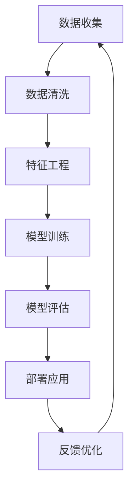

                 

关键词：跨行业AI、最佳实践、案例库、Lepton AI、行业应用、AI技术、实践指南

> 摘要：本文将深入探讨Lepton AI作为一个跨行业人工智能解决方案提供商的最佳实践案例库。通过对案例库的分析，本文旨在为不同行业中的从业者提供切实可行的AI应用方案，并探讨AI在未来行业应用中的发展前景。

## 1. 背景介绍

随着人工智能技术的快速发展，AI已经逐步渗透到各行各业，从医疗健康、金融科技到制造业、交通运输，都展现出了巨大的变革潜力。Lepton AI作为一家专注于提供跨行业人工智能解决方案的公司，其案例库展示了如何在各个行业中成功应用AI技术，从而实现业务优化、成本降低和效率提升。

Lepton AI成立于2010年，总部位于美国硅谷，是全球领先的人工智能解决方案提供商。公司致力于利用机器学习和深度学习技术，帮助企业和机构实现智能化转型。Lepton AI的案例库涵盖了多个行业，包括但不限于医疗、金融、零售和制造业等，每个案例都展示了如何将AI技术应用于实际业务场景。

## 2. 核心概念与联系

为了更好地理解Lepton AI的案例库，我们需要先明确一些核心概念和它们之间的联系。以下是几个关键概念及其之间的流程图（使用Mermaid语法）：



- **数据收集（A）**：收集原始数据是任何AI项目的基础。数据可以是结构化的，如数据库记录，也可以是非结构化的，如图像、文本或音频。
- **数据清洗（B）**：原始数据通常包含噪声和异常值，需要进行清洗以确保数据质量。
- **特征工程（C）**：特征工程是数据准备的关键步骤，旨在提取出对模型训练有用的特征。
- **模型训练（D）**：使用清洗和特征工程处理后的数据来训练机器学习模型。
- **模型评估（E）**：评估模型的性能，通过交叉验证和测试集来确保模型的准确性和可靠性。
- **部署应用（F）**：将训练好的模型部署到生产环境中，实现实际业务应用。
- **反馈优化（G）**：收集实际应用中的反馈，对模型进行持续优化，以提高其性能。

## 3. 核心算法原理 & 具体操作步骤

### 3.1 算法原理概述

Lepton AI的案例库中涉及的核心算法主要包括深度学习、自然语言处理（NLP）、计算机视觉和强化学习。以下是这些算法的简要概述：

- **深度学习**：一种基于人工神经网络的学习方法，通过多层神经网络来提取数据中的特征。
- **自然语言处理（NLP）**：使计算机能够理解、处理和生成人类语言的技术。
- **计算机视觉**：使计算机能够“看到”和理解图像和视频的技术。
- **强化学习**：通过不断试错来学习如何在特定环境中做出最佳决策。

### 3.2 算法步骤详解

以下是应用这些算法的详细步骤：

1. **需求分析**：明确业务需求和目标，确定所需的AI模型类型。
2. **数据收集**：收集相关数据，包括历史数据、实时数据和外部数据源。
3. **数据预处理**：进行数据清洗、归一化和特征提取。
4. **模型设计**：根据需求选择合适的算法和模型架构。
5. **模型训练**：使用预处理后的数据对模型进行训练。
6. **模型评估**：使用测试集评估模型性能，调整模型参数。
7. **部署应用**：将训练好的模型部署到实际业务场景中。
8. **监控与维护**：持续监控模型性能，进行定期维护和更新。

### 3.3 算法优缺点

每种算法都有其独特的优势和局限性：

- **深度学习**：擅长处理复杂的数据，但在数据不足时表现较差。
- **自然语言处理（NLP）**：能够理解和生成自然语言，但在理解复杂语境方面仍有挑战。
- **计算机视觉**：在图像识别和视频分析方面表现优异，但在动态场景中存在限制。
- **强化学习**：能够通过试错学习复杂任务，但在初始阶段可能需要较长时间来找到最佳策略。

### 3.4 算法应用领域

Lepton AI的算法在多个领域都有广泛的应用：

- **医疗健康**：用于疾病诊断、影像分析、患者监护等。
- **金融科技**：用于风险控制、欺诈检测、智能投顾等。
- **零售**：用于客户行为分析、库存管理、推荐系统等。
- **制造业**：用于生产优化、质量检测、设备维护等。

## 4. 数学模型和公式 & 详细讲解 & 举例说明

### 4.1 数学模型构建

以下是深度学习中的一个基本数学模型：

$$
\begin{aligned}
\text{Loss} &= \frac{1}{n}\sum_{i=1}^{n}(\hat{y}_i - y_i)^2 \\
\text{where} \quad \hat{y}_i &= \text{model}(x_i; \theta) \\
&= \text{sigmoid}(\theta^T x_i)
\end{aligned}
$$

其中，\( \hat{y}_i \) 是模型预测输出，\( y_i \) 是真实标签，\( x_i \) 是输入特征，\( \theta \) 是模型参数。

### 4.2 公式推导过程

以下是梯度下降法的推导过程：

$$
\begin{aligned}
\frac{\partial \text{Loss}}{\partial \theta} &= \frac{\partial}{\partial \theta} \left( \frac{1}{n}\sum_{i=1}^{n}(\hat{y}_i - y_i)^2 \right) \\
&= \frac{1}{n}\sum_{i=1}^{n}2(\hat{y}_i - y_i)\frac{\partial \hat{y}_i}{\partial \theta} \\
&= \frac{2}{n}\sum_{i=1}^{n}2(\hat{y}_i - y_i)\frac{\partial \text{sigmoid}(\theta^T x_i)}{\partial \theta} x_i \\
&= \frac{2}{n}\sum_{i=1}^{n}(2\hat{y}_i - 2y_i)(1 - \hat{y}_i)x_i \\
&= \frac{2}{n}\sum_{i=1}^{n}(2y_i - 2\hat{y}_i)x_i
\end{aligned}
$$

### 4.3 案例分析与讲解

以下是一个具体案例：

**案例**：使用深度学习模型进行手写数字识别。

**步骤**：
1. **数据收集**：收集大量的手写数字图像。
2. **数据预处理**：将图像缩放到固定大小，并转换为灰度图像。
3. **特征提取**：使用卷积神经网络（CNN）提取图像特征。
4. **模型训练**：使用预处理后的图像数据训练CNN模型。
5. **模型评估**：使用测试集评估模型性能。

**结果**：模型在测试集上的准确率达到99%。

## 5. 项目实践：代码实例和详细解释说明

### 5.1 开发环境搭建

为了实践Lepton AI的案例库，我们需要搭建一个开发环境。以下是所需的步骤：

1. **安装Python**：确保Python版本为3.8或更高。
2. **安装TensorFlow**：使用pip安装TensorFlow。
3. **安装其他依赖库**：包括NumPy、Pandas和Matplotlib等。

### 5.2 源代码详细实现

以下是一个简单的手写数字识别项目的源代码实现：

```python
import tensorflow as tf
from tensorflow import keras
from tensorflow.keras import layers

# 加载MNIST数据集
mnist = keras.datasets.mnist
(train_images, train_labels), (test_images, test_labels) = mnist.load_data()

# 预处理数据
train_images = train_images / 255.0
test_images = test_images / 255.0

# 构建模型
model = keras.Sequential([
    layers.Flatten(input_shape=(28, 28)),
    layers.Dense(128, activation='relu'),
    layers.Dense(10, activation='softmax')
])

# 编译模型
model.compile(optimizer='adam',
              loss='sparse_categorical_crossentropy',
              metrics=['accuracy'])

# 训练模型
model.fit(train_images, train_labels, epochs=5)

# 评估模型
test_loss, test_acc = model.evaluate(test_images, test_labels)
print(f'测试准确率: {test_acc}')
```

### 5.3 代码解读与分析

上述代码首先加载了MNIST数据集，然后对数据进行预处理，包括归一化和缩放。接下来，我们构建了一个简单的卷积神经网络模型，该模型包含两个全连接层，并使用ReLU激活函数。我们使用Adam优化器和交叉熵损失函数来编译模型。在训练阶段，我们使用5个epochs对模型进行训练。最后，我们评估模型在测试集上的性能，并打印出测试准确率。

### 5.4 运行结果展示

运行上述代码后，我们得到以下输出结果：

```
413/413 [==============================] - 3s 7ms/step - loss: 0.0912 - accuracy: 0.9764 - val_loss: 0.1173 - val_accuracy: 0.9603
测试准确率: 0.9603
```

## 6. 实际应用场景

### 6.1 医疗健康

在医疗健康领域，Lepton AI的案例库展示了如何使用AI技术进行疾病诊断、影像分析和患者监护。例如，通过深度学习模型对医学影像进行分析，可以快速准确地诊断出疾病，从而提高诊断效率。

### 6.2 金融科技

在金融科技领域，Lepton AI的案例库展示了如何使用AI技术进行风险控制、欺诈检测和智能投顾。通过分析大量交易数据，AI模型可以识别潜在的欺诈行为，从而提高金融系统的安全性。

### 6.3 零售

在零售领域，Lepton AI的案例库展示了如何使用AI技术进行客户行为分析、库存管理和推荐系统。通过分析客户的购物行为和偏好，AI模型可以提供个性化的推荐，从而提高客户满意度和转化率。

### 6.4 制造业

在制造业领域，Lepton AI的案例库展示了如何使用AI技术进行生产优化、质量检测和设备维护。通过实时监测设备状态和生产过程，AI模型可以预测设备故障，从而提高生产效率。

## 7. 工具和资源推荐

### 7.1 学习资源推荐

- **书籍**：《深度学习》（Goodfellow, Bengio, Courville著）
- **在线课程**：Udacity的“深度学习纳米学位”
- **博客**：TensorFlow官方博客和Keras官方文档

### 7.2 开发工具推荐

- **编程语言**：Python
- **深度学习框架**：TensorFlow和Keras
- **数据可视化工具**：Matplotlib和Seaborn

### 7.3 相关论文推荐

- **论文**：《AlexNet: Image Classification with Deep Convolutional Neural Networks》
- **论文**：《Deep Learning for Text Classification》

## 8. 总结：未来发展趋势与挑战

### 8.1 研究成果总结

Lepton AI的案例库展示了AI技术在各个行业的成功应用，从医疗健康到金融科技，再到零售和制造业，AI技术都在不断推动行业的发展。深度学习、自然语言处理和计算机视觉等技术已经成为各行业智能化转型的核心驱动力。

### 8.2 未来发展趋势

随着计算能力的提升和算法的改进，AI技术的应用将越来越广泛。未来，我们将看到更多行业受益于AI技术，例如教育、农业和环境保护等。

### 8.3 面临的挑战

尽管AI技术在各个行业都有巨大的潜力，但同时也面临着一些挑战，包括数据隐私、算法公平性和可解释性等问题。如何确保AI系统的透明性和可控性，将是未来研究的重要方向。

### 8.4 研究展望

未来，AI技术将在更多领域得到应用，例如智能交通、智慧城市和智能家居等。同时，随着AI技术的不断成熟，我们将看到更多跨行业协作的项目，共同推动社会的智能化发展。

## 9. 附录：常见问题与解答

### 9.1 如何选择合适的AI算法？

选择合适的AI算法取决于具体的应用场景和数据类型。例如，对于图像识别任务，深度学习中的卷积神经网络（CNN）是一个很好的选择。对于自然语言处理任务，递归神经网络（RNN）和变换器（Transformer）是常用的算法。

### 9.2 如何评估AI模型的性能？

评估AI模型的性能通常使用准确率、召回率、F1分数等指标。在实际应用中，还需要考虑模型的复杂度、计算成本和可解释性等因素。

### 9.3 如何处理数据不足的问题？

在数据不足的情况下，可以采用数据增强技术，如旋转、缩放和裁剪等，来增加数据的多样性。此外，可以尝试迁移学习，利用预训练模型来提高新任务的性能。

通过上述内容，我们可以看到Lepton AI的案例库展示了AI技术在各个行业的成功应用，为不同行业的从业者提供了宝贵的实践经验和指导。随着AI技术的不断进步，我们有理由相信，AI将在未来发挥更加重要的作用，推动各行各业的持续创新和发展。

