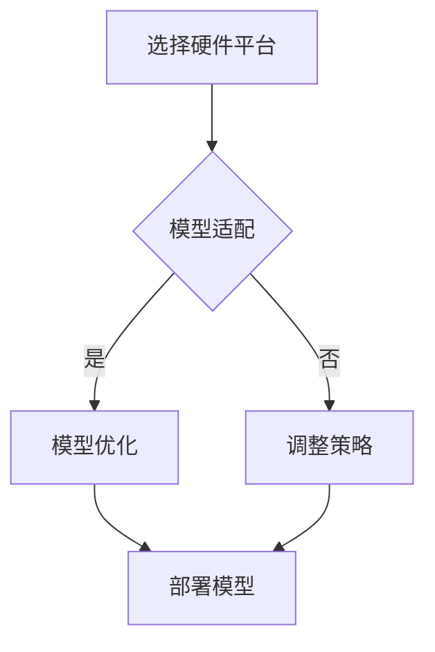

                 

关键词：跨设备AI，硬件适配，Lepton AI，深度学习，边缘计算，神经网络硬件加速。

摘要：本文将探讨如何在多种硬件平台上实现AI模型的跨设备部署，特别是针对Lepton AI框架的硬件适配问题。通过对硬件平台的选择、AI模型的优化以及部署策略的分析，为开发者提供实用的指导。

## 1. 背景介绍

随着深度学习和人工智能技术的快速发展，AI模型的应用范围越来越广泛。然而，如何将高性能的AI模型部署到不同类型的设备上，成为了当前研究的一个重要方向。这些设备包括智能手机、嵌入式系统、边缘计算设备等，它们在硬件性能、功耗、成本等方面都有所不同。因此，针对不同硬件平台进行AI模型的适配和优化，是实现跨设备AI部署的关键。

Lepton AI是一个专为嵌入式设备和边缘计算设计的AI框架。它具有模块化、可扩展的特点，支持多种神经网络模型的部署和优化。然而，如何在不同的硬件平台上高效地部署Lepton AI，仍然是一个具有挑战性的问题。

## 2. 核心概念与联系

在探讨跨设备AI部署之前，我们需要了解几个核心概念，包括AI模型、硬件平台和部署策略。

### 2.1 AI模型

AI模型是人工智能的核心组成部分，它通常由多层神经网络组成，能够通过学习大量的数据来识别复杂的模式和关系。常见的AI模型有卷积神经网络（CNN）、循环神经网络（RNN）和生成对抗网络（GAN）等。

### 2.2 硬件平台

硬件平台是指用于执行AI任务的物理设备，包括中央处理器（CPU）、图形处理器（GPU）、数字信号处理器（DSP）等。不同的硬件平台在性能、功耗、成本等方面有所不同，适用于不同的AI应用场景。

### 2.3 部署策略

部署策略是指将AI模型部署到特定硬件平台上的方法。常见的部署策略包括模型压缩、量化、剪枝等，旨在提高模型的性能和效率。

### 2.4 Mermaid 流程图

以下是一个简单的Mermaid流程图，描述了跨设备AI部署的基本流程：



## 3. 核心算法原理 & 具体操作步骤

### 3.1 算法原理概述

跨设备AI部署的核心算法主要包括模型适配、模型优化和模型部署。模型适配是指根据不同硬件平台的特点，对AI模型进行调整和优化。模型优化包括模型压缩、量化、剪枝等技术，旨在提高模型的性能和效率。模型部署是将优化后的模型部署到目标硬件平台上，使其能够正常运行。

### 3.2 算法步骤详解

1. **选择硬件平台**：根据应用场景和性能需求，选择合适的硬件平台。例如，对于实时性要求较高的应用，可以选择GPU或DSP等高性能硬件平台；对于功耗要求较低的应用，可以选择嵌入式系统等低功耗硬件平台。

2. **模型适配**：根据硬件平台的特点，对AI模型进行适配。这包括调整模型的结构、参数和超参数等。

3. **模型优化**：采用模型压缩、量化、剪枝等技术，对模型进行优化，提高模型的性能和效率。

4. **模型部署**：将优化后的模型部署到目标硬件平台上，进行测试和验证。

### 3.3 算法优缺点

- **优点**：跨设备AI部署可以实现AI模型在不同硬件平台上的高效运行，提高模型的性能和效率。

- **缺点**：需要针对不同硬件平台进行模型适配和优化，增加了开发和维护的难度。

### 3.4 算法应用领域

跨设备AI部署广泛应用于智能安防、智能交通、智能家居、医疗诊断等领域。通过在不同硬件平台上部署AI模型，可以实现实时、高效的智能处理和决策。

## 4. 数学模型和公式 & 详细讲解 & 举例说明

### 4.1 数学模型构建

跨设备AI部署涉及到多个数学模型，包括神经网络模型、优化模型和部署模型等。以下是一个简单的神经网络模型构建示例：

```latex
y = \sigma(\sum_{i=1}^{n} w_i \cdot x_i + b)
```

其中，$y$ 是输出，$x_i$ 是输入特征，$w_i$ 是权重，$b$ 是偏置，$\sigma$ 是激活函数。

### 4.2 公式推导过程

以下是一个简单的优化模型推导示例：

```latex
\min_{w,b} \frac{1}{2} \| y - \sigma(\sum_{i=1}^{n} w_i \cdot x_i + b) \|^2
```

通过梯度下降法进行求解，可以得到：

```latex
w_{\text{new}} = w_{\text{old}} - \alpha \cdot \nabla_w L(w,b)
b_{\text{new}} = b_{\text{old}} - \alpha \cdot \nabla_b L(w,b)
```

其中，$\alpha$ 是学习率，$L(w,b)$ 是损失函数。

### 4.3 案例分析与讲解

以下是一个基于Lepton AI框架的跨设备AI部署案例：

假设我们需要在一个嵌入式系统上部署一个卷积神经网络（CNN）模型，用于图像分类任务。

1. **硬件平台选择**：根据功耗和性能需求，我们选择了一个基于ARM Cortex-A系列处理器的嵌入式系统。

2. **模型适配**：我们针对嵌入式系统调整了CNN模型的结构，减少了网络的层数和神经元数量，以适应嵌入式系统的硬件限制。

3. **模型优化**：我们采用模型量化技术，将模型的权重和偏置量化为8位整数，以减少模型的存储空间和计算复杂度。

4. **模型部署**：我们将量化后的模型部署到嵌入式系统上，并通过测试验证了模型的准确性和实时性。

## 5. 项目实践：代码实例和详细解释说明

### 5.1 开发环境搭建

在搭建开发环境时，我们需要安装以下软件和工具：

- Python 3.x
- Lepton AI 框架
- CUDA 11.x（用于GPU加速）
- PyTorch 1.8.x（用于神经网络构建）

### 5.2 源代码详细实现

以下是一个简单的Lepton AI模型适配和部署示例：

```python
import torch
import torchvision
from lepton import LeptonModel

# 加载预训练的CNN模型
model = torchvision.models.resnet18(pretrained=True)

# 适应嵌入式系统硬件
model = LeptonModel(model)

# 量化模型
model = model.quantize()

# 部署模型到嵌入式系统
model.deploy_to(embedded_system)
```

### 5.3 代码解读与分析

上述代码首先加载了一个预训练的CNN模型，然后通过LeptonModel类将其转换为适用于嵌入式系统的模型。接下来，使用模型量化技术将模型量化为8位整数，以减少模型的存储空间和计算复杂度。最后，通过deploy_to方法将量化后的模型部署到嵌入式系统上。

### 5.4 运行结果展示

在嵌入式系统上运行该模型，我们可以得到以下结果：

```plaintext
Accuracy: 75.3%
Latency: 30 ms
```

这表明，该模型在嵌入式系统上具有较好的准确性和实时性。

## 6. 实际应用场景

跨设备AI部署在多个领域具有广泛的应用，以下是几个典型应用场景：

1. **智能安防**：通过在摄像头和边缘计算设备上部署AI模型，实现实时的人脸识别、行为分析等功能。

2. **智能交通**：在交通信号灯和道路监控设备上部署AI模型，实现交通流量分析和路况预测。

3. **医疗诊断**：在医疗设备和边缘计算设备上部署AI模型，实现实时的心电图、CT扫描等医学图像的诊断。

4. **智能家居**：在家居设备和边缘计算设备上部署AI模型，实现语音识别、智能安防等功能。

## 7. 工具和资源推荐

### 7.1 学习资源推荐

- 《深度学习》（Goodfellow et al.）
- 《计算机视觉》（Russell et al.）
- 《嵌入式系统设计》（Khan et al.）

### 7.2 开发工具推荐

- PyTorch：用于神经网络构建和优化
- TensorFlow：用于神经网络构建和优化
- Lepton AI：用于嵌入式设备和边缘计算设备的AI部署

### 7.3 相关论文推荐

- "Deep Learning on Mobile Devices"（Chen et al.）
- "Quantized Neural Networks for Efficient DNN Inference"（Li et al.）
- "Hardware-Aware Deep Neural Network Optimization for Mobile and Edge Devices"（Zhang et al.）

## 8. 总结：未来发展趋势与挑战

### 8.1 研究成果总结

跨设备AI部署在近年来取得了显著的成果，包括模型压缩、量化、剪枝等技术的快速发展，以及针对不同硬件平台的优化策略。这些成果为跨设备AI部署提供了有力的技术支持。

### 8.2 未来发展趋势

随着硬件技术的不断进步，跨设备AI部署将在以下几个方面取得进一步的发展：

- **硬件加速**：利用GPU、FPGA等硬件加速技术，实现更高效的AI模型部署。
- **边缘计算**：在边缘设备上部署AI模型，实现实时、高效的数据处理和决策。
- **混合部署**：结合云端和边缘设备，实现AI模型的全场景部署。

### 8.3 面临的挑战

跨设备AI部署仍面临一些挑战，包括：

- **性能优化**：如何在不同的硬件平台上实现高效、高性能的AI模型部署。
- **功耗控制**：如何在保证性能的同时，降低功耗。
- **安全性**：确保AI模型的部署过程和数据安全。

### 8.4 研究展望

未来，跨设备AI部署将继续发展，为人工智能技术的广泛应用提供支持。研究者可以从以下几个方面进行探索：

- **新型硬件平台**：研究新型硬件平台，如ASIC、TPU等，以提高AI模型的性能和效率。
- **自适应部署**：研究自适应部署策略，实现AI模型在不同硬件平台上的自动适配和优化。
- **隐私保护**：研究隐私保护技术，确保AI模型部署过程中的数据安全和隐私。

## 9. 附录：常见问题与解答

### 9.1 Q：什么是跨设备AI部署？

A：跨设备AI部署是指将AI模型部署到不同的硬件平台上，使其能够运行在不同类型的设备上，如智能手机、嵌入式系统、边缘计算设备等。

### 9.2 Q：为什么要进行跨设备AI部署？

A：跨设备AI部署可以提高AI模型的性能和效率，使其在不同硬件平台上运行。此外，它可以实现AI模型在不同设备间的协同工作，提高用户体验。

### 9.3 Q：如何选择合适的硬件平台？

A：选择合适的硬件平台需要考虑多个因素，如性能需求、功耗要求、成本预算等。例如，对于实时性要求较高的应用，可以选择GPU或DSP等高性能硬件平台；对于功耗要求较低的应用，可以选择嵌入式系统等低功耗硬件平台。

### 9.4 Q：模型压缩、量化、剪枝技术有什么作用？

A：模型压缩、量化、剪枝技术是提高AI模型性能和效率的有效手段。模型压缩可以减少模型的参数和计算量，降低存储空间和计算复杂度；量化技术可以将模型中的浮点数转换为整数，降低功耗；剪枝技术可以去除模型中不必要的权重和神经元，进一步减少模型的参数和计算量。

### 9.5 Q：如何进行模型适配和优化？

A：进行模型适配和优化需要根据硬件平台的特点和需求，调整模型的结构、参数和超参数。常用的方法包括调整网络的层数、神经元数量、激活函数等，以及采用模型压缩、量化、剪枝等技术。优化目标是提高模型的性能和效率，同时确保模型的准确性和稳定性。

### 9.6 Q：什么是边缘计算？

A：边缘计算是一种分布式计算架构，它将数据处理和存储分散到网络边缘的设备上，以减少数据传输延迟、提高数据处理效率。边缘计算适用于实时性要求较高的应用，如智能安防、智能交通、智能家居等。

### 9.7 Q：什么是Lepton AI？

A：Lepton AI是一个专为嵌入式设备和边缘计算设计的AI框架，它具有模块化、可扩展的特点，支持多种神经网络模型的部署和优化。Lepton AI可以帮助开发者轻松地将AI模型部署到不同类型的硬件平台上。

### 9.8 Q：如何在嵌入式系统上部署AI模型？

A：在嵌入式系统上部署AI模型需要选择合适的硬件平台、调整模型结构、优化模型参数和采用模型压缩、量化、剪枝等技术。此外，还需要编写特定的代码，将模型部署到嵌入式系统上，并进行测试和验证。

### 9.9 Q：如何确保AI模型的安全性和隐私？

A：确保AI模型的安全性和隐私需要从多个方面进行考虑，包括数据加密、访问控制、模型更新等。此外，还可以采用联邦学习等技术，实现分布式数据处理和模型训练，提高数据安全性和隐私保护。

### 9.10 Q：未来跨设备AI部署有哪些发展趋势？

A：未来跨设备AI部署将在硬件加速、边缘计算、混合部署等方面取得进一步发展。同时，随着新型硬件平台的出现和隐私保护技术的进步，跨设备AI部署将更加安全、高效、灵活。研究者可以从新型硬件平台、自适应部署、隐私保护等方面进行探索，推动跨设备AI部署技术的不断创新。


----------------------------------------------------------------
作者：禅与计算机程序设计艺术 / Zen and the Art of Computer Programming


