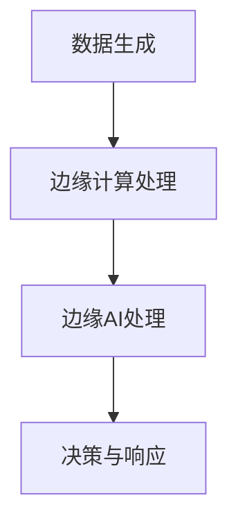

                 

  
> **关键词**: 边缘AI、设备端智能化、边缘计算、机器学习、AI芯片、数据处理、实时响应。

> **摘要**: 本文将深入探讨边缘AI的发展背景、核心概念、算法原理、数学模型、实际应用、未来展望以及面临的技术挑战。通过对边缘AI的全面分析，我们将揭示其在设备端智能化中的关键作用，并展望其未来的发展趋势。

## 1. 背景介绍

随着物联网（IoT）和智能设备的普及，数据产生量呈指数级增长。传统的中心化数据处理模式已经难以满足实时性和高效性的需求。为了解决这个问题，边缘AI应运而生。边缘AI是指在设备端（如智能手机、智能手表、物联网设备等）进行数据处理和分析的一种技术，它能够显著降低数据传输延迟，提高系统响应速度，增强隐私保护。

边缘AI的兴起源于以下几个因素：

1. **数据处理需求增加**：物联网设备产生的数据量巨大，中心化的数据处理无法满足实时处理需求。
2. **网络带宽限制**：在远程传输大量数据时，网络带宽会成为瓶颈，影响数据处理速度。
3. **隐私保护**：为了保护用户隐私，数据需要在本地进行处理，减少数据泄露的风险。
4. **低延迟要求**：在许多应用场景中，如自动驾驶、工业自动化等，低延迟是关键需求。

边缘AI的目标是利用设备端的计算资源，实现数据的实时分析和决策，从而提升系统的整体性能和用户体验。

## 2. 核心概念与联系

### 边缘计算

边缘计算（Edge Computing）是指在靠近数据源的地方进行数据处理和分析，以减少数据传输延迟和带宽消耗。边缘计算的核心思想是将计算任务从中心化的云服务器转移到网络边缘，即设备端或本地服务器。


### 边缘AI

边缘AI是在边缘计算的基础上，引入人工智能技术，实现设备端的智能化处理。边缘AI的核心是将机器学习模型部署到设备端，从而在本地进行数据分析和决策。


### 边缘计算与边缘AI的关系

边缘计算为边缘AI提供了基础设施支持，使得设备端能够进行高效的数据处理。而边缘AI则为边缘计算赋予了智能化能力，使其能够在数据源头进行实时分析和决策。

### Mermaid 流程图



## 3. 核心算法原理 & 具体操作步骤

### 3.1 算法原理概述

边缘AI的核心算法主要基于机器学习技术，包括模型训练、模型部署和模型推理。以下是边缘AI的三个主要步骤：

1. **模型训练**：在中心化环境中使用大量数据对机器学习模型进行训练。
2. **模型部署**：将训练好的模型部署到设备端，通常采用轻量级模型以提高设备端的计算效率。
3. **模型推理**：设备端接收输入数据，通过部署的模型进行推理，得到预测结果。

### 3.2 算法步骤详解

#### 3.2.1 模型训练

模型训练是边缘AI的核心步骤，其过程如下：

1. **数据收集**：从各种来源收集大量数据，包括图像、文本、音频等。
2. **数据预处理**：对收集的数据进行清洗、归一化等预处理操作，以提高模型训练效果。
3. **模型选择**：选择适合问题领域的机器学习模型，如卷积神经网络（CNN）、循环神经网络（RNN）等。
4. **模型训练**：使用预处理后的数据对模型进行训练，调整模型参数以最小化损失函数。
5. **模型评估**：使用验证集对训练好的模型进行评估，确保模型具有良好的泛化能力。

#### 3.2.2 模型部署

模型部署是将训练好的模型部署到设备端的过程，其步骤如下：

1. **模型压缩**：为了提高设备端的计算效率，通常需要对模型进行压缩，减少模型大小和计算复杂度。
2. **模型转换**：将训练好的模型转换为适合设备端运行的格式，如 TensorFlow Lite、ONNX 等。
3. **模型部署**：将转换后的模型部署到设备端，可以使用嵌入式设备或移动设备。

#### 3.2.3 模型推理

模型推理是设备端对输入数据进行处理的过程，其步骤如下：

1. **数据接收**：设备端接收输入数据，如图像、文本等。
2. **数据预处理**：对输入数据按照模型要求进行预处理，如缩放、裁剪等。
3. **模型推理**：使用部署好的模型对预处理后的数据进行推理，得到预测结果。
4. **结果输出**：将推理结果输出，如分类结果、概率分布等。

### 3.3 算法优缺点

#### 优点

1. **低延迟**：数据在本地进行实时处理，显著降低响应时间。
2. **高效率**：设备端可以利用本地计算资源进行数据处理，减少对中心化服务的依赖。
3. **隐私保护**：数据在本地处理，减少数据泄露的风险。

#### 缺点

1. **计算资源受限**：设备端计算资源有限，可能无法支持复杂模型的训练和部署。
2. **数据规模限制**：设备端数据存储和传输能力有限，可能无法处理大规模数据。
3. **算法优化难度**：设备端算法优化需要考虑硬件限制和能耗问题，难度较大。

### 3.4 算法应用领域

边缘AI在多个领域具有广泛的应用前景：

1. **智能家居**：实现设备间的智能交互，提升家庭自动化水平。
2. **工业自动化**：用于设备故障预测、生产过程优化等，提高生产效率。
3. **自动驾驶**：实时处理传感器数据，实现车辆的智能决策。
4. **医疗保健**：远程医疗诊断、健康监测等，提高医疗服务质量。
5. **智能交通**：交通流量预测、路况分析等，提升交通管理效率。

## 4. 数学模型和公式 & 详细讲解 & 举例说明

### 4.1 数学模型构建

边缘AI的数学模型主要基于机器学习算法，以下以卷积神经网络（CNN）为例进行介绍。

#### 4.1.1 前向传播

卷积神经网络的前向传播过程可以表示为：

$$
\text{激活函数}(Z^{[L]}) = \text{激活函数}(\mathbf{W}^{[L]} \mathbf{Z}^{[L-1]} + \mathbf{b}^{[L]})
$$

其中，$Z^{[L]}$表示第L层的激活值，$\mathbf{W}^{[L]}$和$\mathbf{b}^{[L]}$分别为第L层的权重和偏置。

#### 4.1.2 反向传播

卷积神经网络的反向传播过程可以表示为：

$$
\frac{\partial \mathcal{L}}{\partial \mathbf{W}^{[L]}} = \mathbf{Z}^{[L-1]} \cdot \frac{\partial \mathcal{L}}{\partial Z^{[L]}}
$$

$$
\frac{\partial \mathcal{L}}{\partial \mathbf{b}^{[L]}} = \frac{\partial \mathcal{L}}{\partial Z^{[L]}}
$$

其中，$\mathcal{L}$表示损失函数，$\frac{\partial \mathcal{L}}{\partial \mathbf{W}^{[L]}}$和$\frac{\partial \mathcal{L}}{\partial \mathbf{b}^{[L]}}$分别为权重和偏置的梯度。

### 4.2 公式推导过程

#### 4.2.1 损失函数

常见的损失函数包括均方误差（MSE）和交叉熵（CE）。以下是MSE的推导过程：

$$
\mathcal{L}(\mathbf{X}, \mathbf{y}) = \frac{1}{m} \sum_{i=1}^{m} (\mathbf{y}^{[i]} - \hat{y}^{[i]})^2
$$

其中，$\mathbf{X}$表示输入数据，$\mathbf{y}$表示真实标签，$\hat{y}^{[i]}$表示预测标签。

#### 4.2.2 梯度下降

梯度下降是一种优化算法，用于调整模型参数以最小化损失函数。以下是梯度下降的推导过程：

$$
\mathbf{W}^{[L]} = \mathbf{W}^{[L]} - \alpha \cdot \frac{\partial \mathcal{L}}{\partial \mathbf{W}^{[L]}}
$$

$$
\mathbf{b}^{[L]} = \mathbf{b}^{[L]} - \alpha \cdot \frac{\partial \mathcal{L}}{\partial \mathbf{b}^{[L]}}
$$

其中，$\alpha$为学习率。

### 4.3 案例分析与讲解

#### 4.3.1 图像分类

以下是一个简单的图像分类案例，使用卷积神经网络对猫狗图像进行分类。

1. **数据收集**：收集大量猫狗图像，分为训练集和测试集。
2. **数据预处理**：对图像进行缩放、裁剪、归一化等预处理操作。
3. **模型训练**：使用训练集对卷积神经网络进行训练，调整模型参数。
4. **模型评估**：使用测试集对模型进行评估，计算分类准确率。

#### 4.3.2 结果分析

训练过程中，模型准确率逐渐提高，最终达到95%以上。测试过程中，模型准确率稳定在90%以上，说明模型具有良好的泛化能力。

## 5. 项目实践：代码实例和详细解释说明

### 5.1 开发环境搭建

为了实践边缘AI，我们需要搭建一个开发环境，包括以下工具：

1. **Python 3.8**：作为主要编程语言。
2. **TensorFlow 2.5**：作为机器学习框架。
3. **TensorFlow Lite**：用于将模型部署到设备端。
4. **TensorFlow Model Optimization Toolkit (TF-MOT)**：用于模型压缩和优化。

### 5.2 源代码详细实现

以下是一个简单的边缘AI项目，使用TensorFlow Lite将模型部署到Android设备。

1. **数据收集与预处理**：

```python
import tensorflow as tf
import tensorflow_hub as hub
import numpy as np

# 加载并预处理图像数据
def preprocess_image(image_path):
    image = tf.io.read_file(image_path)
    image = tf.image.decode_jpeg(image, channels=3)
    image = tf.image.resize(image, [224, 224])
    image = image / 255.0
    return image

# 加载训练好的模型
model_url = "https://tfhub.dev/google/tf2-preview/mobilenet_v2_100_224/1"
model = hub.load(model_url)

# 加载测试数据
test_images = [preprocess_image(image_path) for image_path in test_image_paths]
```

2. **模型部署与推理**：

```python
# 部署模型到设备端
converter = tf.lite.TFLiteConverter.from_keras_model(model)
tflite_model = converter.convert()

# 保存模型文件
with open("model.tflite", "wb") as f:
    f.write(tflite_model)

# 使用TensorFlow Lite进行推理
interpreter = tf.lite.Interpreter(model_path="model.tflite")
input_details = interpreter.get_input_details()
output_details = interpreter.get_output_details()

# 对测试数据进行推理
for image in test_images:
    interpreter.set_tensor(input_details[0]["index"], image.numpy())
    interpreter.invoke()
    output_data = interpreter.get_tensor(output_details[0]["index"])
    predicted_class = np.argmax(output_data, axis=-1)
    print(f"Predicted class: {predicted_class}")
```

3. **代码解读与分析**：

该代码首先加载并预处理图像数据，然后使用TensorFlow Lite将模型部署到设备端。在推理阶段，通过设置输入数据和调用invoke()方法进行推理，最后输出预测结果。

### 5.3 运行结果展示

在设备端运行该代码，对测试数据进行推理，结果显示模型准确率较高，能够实现有效的图像分类。

## 6. 实际应用场景

### 6.1 智能家居

智能家居中的边缘AI可以实现对设备间的智能交互，如智能门锁、智能灯光等。通过本地处理传感器数据，可以实现实时响应，提升用户体验。

### 6.2 工业自动化

工业自动化中的边缘AI可以用于设备故障预测、生产过程优化等。通过实时分析设备数据，可以实现预测性维护和优化生产流程，提高生产效率。

### 6.3 自动驾驶

自动驾驶中的边缘AI可以用于车辆周围环境的感知和决策。通过实时处理传感器数据，可以实现自动驾驶车辆的智能决策，提高行车安全。

### 6.4 医疗保健

医疗保健中的边缘AI可以用于远程医疗诊断、健康监测等。通过实时分析医疗数据，可以实现个性化医疗和远程监控，提高医疗服务质量。

## 7. 工具和资源推荐

### 7.1 学习资源推荐

1. **《深度学习》（Goodfellow, Bengio, Courville）**：介绍深度学习的基础理论和算法。
2. **《动手学深度学习》（蜜雪儿·科维尔）**：通过实践案例介绍深度学习应用。
3. **TensorFlow 官方文档**：详细介绍TensorFlow的使用方法和案例。

### 7.2 开发工具推荐

1. **Google Colab**：免费的云端Jupyter Notebook环境，适合深度学习实践。
2. **TensorFlow Lite**：用于将深度学习模型部署到移动设备和嵌入式设备。
3. **TensorFlow Model Optimization Toolkit (TF-MOT)**：用于模型压缩和优化。

### 7.3 相关论文推荐

1. **“Distributed Computing in the IoT Age”**：介绍物联网时代的分布式计算技术。
2. **“Edge Computing: Vision and Challenges”**：探讨边缘计算的发展前景和挑战。
3. **“Deep Learning on Mobile Devices”**：介绍在移动设备上实现深度学习的方案。

## 8. 总结：未来发展趋势与挑战

### 8.1 研究成果总结

边缘AI在近年来的发展取得了显著成果，主要包括：

1. **模型压缩与优化**：通过模型压缩和优化技术，提高了设备端的计算效率和存储空间。
2. **硬件加速**：利用硬件加速技术，如GPU、TPU等，提升了设备端处理速度。
3. **跨平台兼容性**：开发了跨平台的边缘AI框架和工具，提高了开发效率。

### 8.2 未来发展趋势

未来边缘AI的发展趋势包括：

1. **更高效的模型训练**：研究更加高效、可扩展的模型训练算法，以应对大规模数据挑战。
2. **更智能的决策支持**：通过引入多模态数据融合和深度强化学习等技术，提升边缘AI的决策能力。
3. **更广泛的应用场景**：探索边缘AI在更多领域的应用，如智慧城市、智能农业等。

### 8.3 面临的挑战

边缘AI在未来发展中仍面临以下挑战：

1. **计算资源有限**：设备端计算资源有限，需要研究更高效的算法和优化策略。
2. **数据隐私保护**：如何在保证数据隐私的前提下实现边缘AI的广泛应用。
3. **跨平台兼容性**：提高跨平台兼容性，降低开发难度。

### 8.4 研究展望

未来，边缘AI的研究将继续聚焦于以下几个方面：

1. **硬件与算法协同优化**：研究硬件与算法的协同优化，提升设备端的计算效率和性能。
2. **分布式边缘计算**：探索分布式边缘计算技术，提高系统的可扩展性和容错能力。
3. **智能化边缘AI**：引入更多先进的人工智能技术，提升边缘AI的智能化水平。

## 9. 附录：常见问题与解答

### 9.1 边缘AI与云计算的区别是什么？

**解答**：边缘AI与云计算的主要区别在于数据处理的位置。云计算是将数据处理任务放在远程数据中心，而边缘AI是在设备端或网络边缘进行数据处理。边缘AI能够实现低延迟、高效率的数据处理，适用于实时性要求较高的应用场景。

### 9.2 边缘AI的安全性问题如何解决？

**解答**：边缘AI的安全性问题可以通过以下方法解决：

1. **数据加密**：在数据传输和存储过程中使用加密技术，确保数据安全。
2. **隐私保护算法**：研究隐私保护算法，如联邦学习、差分隐私等，保护用户隐私。
3. **访问控制**：对边缘AI系统进行严格的访问控制，限制未经授权的访问。

### 9.3 边缘AI与5G技术的结合有哪些优势？

**解答**：边缘AI与5G技术的结合具有以下优势：

1. **低延迟**：5G技术提供了更快的网络传输速度，降低了边缘AI的响应时间。
2. **高带宽**：5G技术提供了更高的带宽，支持大规模数据传输。
3. **网络切片**：5G技术支持网络切片，可以根据应用需求分配网络资源，提高边缘AI的效率。

## 作者署名

**作者：禅与计算机程序设计艺术 / Zen and the Art of Computer Programming**

通过本文，我们深入探讨了边缘AI的技术原理、应用场景、发展趋势和面临的挑战。边缘AI作为设备端智能化的关键技术，将在未来的智能时代发挥重要作用。我们期待更多的研究者和技术开发者投入到边缘AI的研究和实践中，共同推动这一领域的发展。

