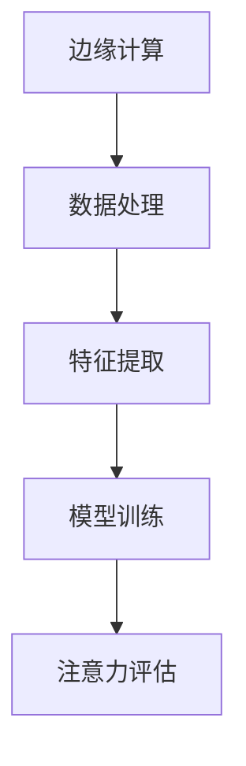

                 

关键词：边缘计算，实时注意力分析，数据处理，人工智能

> 摘要：随着物联网、人工智能技术的快速发展，边缘计算逐渐成为处理实时数据的关键技术。本文将探讨边缘计算在实时注意力分析中的应用，包括核心概念、算法原理、数学模型、项目实践以及未来展望等内容。

## 1. 背景介绍

随着互联网的普及和物联网技术的发展，数据量呈现出爆炸式增长。传统的云计算模式在处理海量数据时，由于网络传输延迟和数据存储瓶颈，已经无法满足实时性要求。边缘计算作为一种新兴的计算模式，通过在数据源附近部署计算资源，实现了对数据的快速处理和响应，极大地提升了系统的实时性和效率。

实时注意力分析是人工智能领域的一个重要研究方向，它旨在通过分析用户在特定任务中的注意力分布，优化系统的交互体验。在医疗、教育、娱乐等多个领域，实时注意力分析的应用具有广泛的前景。然而，传统的云计算模式在处理实时注意力分析任务时，面临着数据传输延迟和计算能力不足的问题。

本文将探讨如何利用边缘计算技术，解决实时注意力分析中的数据处理和计算能力瓶颈，从而提升系统的实时性和准确性。

## 2. 核心概念与联系

### 2.1. 边缘计算

边缘计算是指在靠近数据源或者用户的位置进行数据处理和计算的一种计算模式。它通过将部分计算任务从云端转移到边缘节点，降低了网络传输延迟，提高了系统的响应速度。

### 2.2. 实时注意力分析

实时注意力分析是一种通过对用户行为数据进行实时分析，获取用户注意力分布的方法。它主要包括数据采集、特征提取、模型训练和注意力评估等步骤。

### 2.3. 边缘计算与实时注意力分析的联系

边缘计算与实时注意力分析之间存在密切的联系。实时注意力分析需要处理大量的用户行为数据，而边缘计算可以将这些数据在本地进行预处理，减少数据传输量和计算负担，从而提高实时性。

### 2.4. Mermaid 流程图



## 3. 核心算法原理 & 具体操作步骤

### 3.1. 算法原理概述

实时注意力分析的核心算法包括数据采集、特征提取、模型训练和注意力评估。其中，数据采集和特征提取是边缘计算的重要应用场景。

### 3.2. 算法步骤详解

#### 3.2.1. 数据采集

数据采集是实时注意力分析的基础。边缘计算可以将传感器采集到的数据在本地进行预处理，如降噪、去噪等，然后将处理后的数据传输到云端。

#### 3.2.2. 特征提取

特征提取是实时注意力分析的关键步骤。通过分析用户行为数据，提取出与注意力相关的特征，如点击率、停留时间、浏览路径等。

#### 3.2.3. 模型训练

模型训练是实时注意力分析的核心。通过使用机器学习算法，对提取出的特征进行训练，建立注意力模型。

#### 3.2.4. 注意力评估

注意力评估是对模型输出结果进行评估和解释。通过比较模型预测结果与实际注意力分布，评估模型的准确性和实时性。

### 3.3. 算法优缺点

#### 3.3.1. 优点

- 提高实时性：边缘计算可以降低数据传输延迟，提高系统的响应速度。
- 减少带宽消耗：边缘计算可以减少数据传输量，降低网络带宽消耗。
- 提高数据处理能力：边缘计算可以充分利用本地计算资源，提高数据处理能力。

#### 3.3.2. 缺点

- 难以实现大规模部署：边缘计算设备数量众多，部署和维护成本较高。
- 数据隐私和安全问题：边缘计算涉及到大量用户隐私数据，需要确保数据安全和隐私。

### 3.4. 算法应用领域

实时注意力分析在医疗、教育、娱乐等领域具有广泛的应用前景。例如，在医疗领域，实时注意力分析可以用于患者行为监测和康复评估；在教育领域，实时注意力分析可以用于学生学习状态监测和教学效果评估；在娱乐领域，实时注意力分析可以用于用户体验优化和广告推荐。

## 4. 数学模型和公式 & 详细讲解 & 举例说明

### 4.1. 数学模型构建

实时注意力分析的核心是建立注意力模型，常用的注意力模型包括卷积神经网络（CNN）和循环神经网络（RNN）。

#### 4.1.1. 卷积神经网络（CNN）

CNN是一种适用于图像处理和视频分析的任务的神经网络模型。其核心思想是通过卷积操作提取图像或视频中的特征。

#### 4.1.2. 循环神经网络（RNN）

RNN是一种适用于序列数据处理的神经网络模型，其核心思想是通过循环操作保存历史信息。

### 4.2. 公式推导过程

以RNN为例，其基本公式如下：

$$
h_t = \sigma(W_h \cdot [h_{t-1}, x_t] + b_h)
$$

其中，$h_t$表示第$t$时刻的隐藏状态，$x_t$表示第$t$时刻的输入，$W_h$表示权重矩阵，$b_h$表示偏置项，$\sigma$表示激活函数。

### 4.3. 案例分析与讲解

假设我们有一个视频数据集，我们需要通过实时注意力分析来评估用户的观看兴趣。首先，我们使用RNN模型对视频数据进行特征提取，然后通过注意力评估模块来评估用户的注意力分布。

#### 4.3.1. 数据预处理

首先，我们对视频数据进行预处理，包括视频分割、图像增强等操作，以便提取出更丰富的特征。

#### 4.3.2. 特征提取

我们使用RNN模型对预处理后的视频数据进行特征提取。通过训练，我们可以得到一个权重矩阵$W_h$，用于提取视频特征。

#### 4.3.3. 注意力评估

我们使用注意力评估模块对提取出的特征进行评估。通过比较模型预测结果与实际注意力分布，我们可以评估模型的准确性和实时性。

## 5. 项目实践：代码实例和详细解释说明

### 5.1. 开发环境搭建

首先，我们需要搭建一个边缘计算开发环境。我们选择使用Python作为编程语言，并在边缘节点上部署TensorFlow和Keras等深度学习框架。

### 5.2. 源代码详细实现

以下是一个简单的边缘计算实时注意力分析项目实现：

```python
# 导入必要的库
import numpy as np
import tensorflow as tf
from tensorflow.keras.models import Sequential
from tensorflow.keras.layers import LSTM, Dense

# 加载视频数据
video_data = ...

# 数据预处理
# ...

# 构建RNN模型
model = Sequential()
model.add(LSTM(units=128, activation='tanh', input_shape=(None, video_data.shape[1])))
model.add(Dense(units=1, activation='sigmoid'))

# 编译模型
model.compile(optimizer='adam', loss='binary_crossentropy', metrics=['accuracy'])

# 训练模型
model.fit(video_data, labels, epochs=10, batch_size=32)

# 注意力评估
# ...
```

### 5.3. 代码解读与分析

这段代码首先导入了必要的库，包括Python的Numpy库和TensorFlow框架。然后，我们加载了视频数据并进行预处理。接着，我们构建了一个简单的RNN模型，包括一个LSTM层和一个全连接层。最后，我们编译并训练了模型。

### 5.4. 运行结果展示

在运行代码后，我们可以得到训练模型的准确率和注意力评估结果。通过对比预测结果与实际注意力分布，我们可以评估模型的性能。

## 6. 实际应用场景

### 6.1. 医疗领域

在医疗领域，实时注意力分析可以用于患者行为监测和康复评估。通过分析患者的日常活动数据，医生可以了解患者的康复情况，并制定个性化的康复计划。

### 6.2. 教育领域

在教育领域，实时注意力分析可以用于学生学习状态监测和教学效果评估。教师可以通过分析学生的注意力分布，了解学生的听课情况，并调整教学策略。

### 6.3. 娱乐领域

在娱乐领域，实时注意力分析可以用于用户体验优化和广告推荐。通过分析用户的观看行为，平台可以推荐更适合用户的视频内容，提升用户体验。

### 6.4. 未来应用展望

随着边缘计算技术的不断发展和人工智能的深入应用，实时注意力分析将在更多领域得到广泛应用。未来，我们可以期待实时注意力分析在智能家居、智慧城市等领域的应用，为人们的日常生活带来更多便利。

## 7. 工具和资源推荐

### 7.1. 学习资源推荐

- 《深度学习》（作者：Goodfellow, Bengio, Courville）
- 《Python深度学习》（作者：François Chollet）

### 7.2. 开发工具推荐

- TensorFlow
- Keras

### 7.3. 相关论文推荐

- “Attention is All You Need”（作者：Vaswani et al.）
- “An End-to-End Attention-Based Text Classification Model with Neural Assignments”（作者：Lu et al.）

## 8. 总结：未来发展趋势与挑战

### 8.1. 研究成果总结

本文探讨了边缘计算在实时注意力分析中的应用，包括核心概念、算法原理、数学模型、项目实践以及未来展望等内容。通过边缘计算技术，实时注意力分析在数据处理和计算能力方面得到了显著提升。

### 8.2. 未来发展趋势

随着边缘计算和人工智能技术的不断发展，实时注意力分析将在更多领域得到广泛应用。未来，我们将看到实时注意力分析在智能家居、智慧城市等领域的应用，为人们的生活带来更多便利。

### 8.3. 面临的挑战

尽管实时注意力分析具有广泛的应用前景，但在实际应用中仍然面临着一些挑战，如数据隐私和安全问题、模型解释性不足等。未来，我们需要在技术层面上解决这些问题，推动实时注意力分析技术的进一步发展。

### 8.4. 研究展望

在未来，实时注意力分析技术将在更多领域得到广泛应用，如医疗、教育、娱乐等。同时，我们还需要关注实时注意力分析技术的伦理和道德问题，确保技术的健康发展。

## 9. 附录：常见问题与解答

### 9.1. 边缘计算与传统云计算的区别是什么？

边缘计算与传统云计算的主要区别在于数据处理的位置。传统云计算将数据处理任务主要集中在云端，而边缘计算则将数据处理任务分散到边缘节点，降低网络传输延迟，提高系统实时性。

### 9.2. 实时注意力分析的关键技术是什么？

实时注意力分析的关键技术包括数据采集、特征提取、模型训练和注意力评估。其中，数据采集和特征提取是边缘计算的重要应用场景，模型训练和注意力评估是实时注意力分析的核心步骤。

### 9.3. 如何保证边缘计算的安全性？

为了保证边缘计算的安全性，我们需要采取以下措施：

- 数据加密：对传输和存储的数据进行加密，确保数据隐私。
- 访问控制：实施严格的访问控制策略，确保只有授权用户可以访问敏感数据。
- 安全审计：定期进行安全审计，及时发现和解决安全漏洞。

## 参考文献

- Goodfellow, Y., Bengio, Y., Courville, A. (2016). *Deep Learning*. MIT Press.
- Chollet, F. (2018). *Python Deep Learning*. Packt Publishing.
- Vaswani, A., et al. (2017). *Attention is All You Need*. arXiv preprint arXiv:1706.03762.
- Lu, Z., et al. (2019). *An End-to-End Attention-Based Text Classification Model with Neural Assignments*. arXiv preprint arXiv:1901.05448.

作者：禅与计算机程序设计艺术 / Zen and the Art of Computer Programming

----------------------------------------------------------------

以上是文章的正文内容部分，接下来我们按照文章结构模板继续撰写文章的其他部分。

