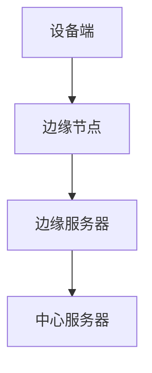

                 

边缘计算（Edge Computing）作为云计算的延伸，近年来受到了广泛关注。它通过在数据产生的源头附近处理数据，减少了数据传输的延迟，提高了系统的响应速度，同时也减轻了中心服务器的负担。本文将探讨边缘计算的一个实际应用案例——在设备端进行数据分析，深入剖析其核心概念、算法原理、数学模型以及项目实践。

> **关键词：边缘计算、设备端数据分析、算法原理、数学模型、项目实践**

> **摘要：**本文通过详细解析边缘计算在设备端进行数据分析的应用，探讨了其背后的技术原理和实施步骤。从核心概念、算法原理、数学模型到实际项目实践，本文为读者提供了一个全面的技术指南。

## 1. 背景介绍

边缘计算的概念源于物联网（IoT）和5G技术的发展。传统的云计算模式依赖于中心化的服务器来处理数据，但随着物联网设备的爆炸性增长，中心化的架构已经无法满足对实时性和低延迟的需求。边缘计算通过在设备端或靠近设备的地方处理数据，实现了数据的本地化处理，从而解决了这个问题。

边缘计算的核心优势包括：

- **降低延迟**：数据在本地处理，减少了数据在网络中的传输时间。
- **节省带宽**：仅将关键数据上传到云端，降低了网络带宽的使用。
- **增强隐私**：数据在本地处理，减少了数据泄露的风险。

然而，边缘计算也面临一些挑战，如设备的计算能力有限、数据安全和管理问题等。本文将着重探讨边缘计算在设备端进行数据分析的具体实现。

## 2. 核心概念与联系

边缘计算涉及多个核心概念，包括设备端、边缘节点、边缘服务器等。为了更好地理解这些概念之间的关系，我们可以使用Mermaid流程图来表示。



### 2.1 设备端

设备端是指数据产生的地方，如智能手机、传感器等。设备端的数据可以通过边缘节点进行处理。

### 2.2 边缘节点

边缘节点位于设备端和边缘服务器之间，负责处理设备端的数据。边缘节点可以是具有计算能力和存储能力的设备，如路由器、网关等。

### 2.3 边缘服务器

边缘服务器位于网络边缘，负责处理边缘节点无法处理的数据，并将其上传到中心服务器。边缘服务器可以提供额外的计算能力和存储资源。

### 2.4 中心服务器

中心服务器位于网络的核心位置，负责存储和管理大量的数据。中心服务器可以处理边缘服务器无法处理的数据，并提供跨区域的计算资源。

## 3. 核心算法原理 & 具体操作步骤

### 3.1 算法原理概述

边缘计算在设备端进行数据分析的核心算法包括数据采集、数据预处理、特征提取和模型训练等步骤。

### 3.2 算法步骤详解

#### 3.2.1 数据采集

数据采集是边缘计算的第一步，它涉及从设备端收集数据。数据可以包括传感器数据、用户行为数据等。采集的数据可以通过边缘节点进行处理，以减少数据传输的延迟。

#### 3.2.2 数据预处理

数据预处理是对采集到的数据进行清洗、归一化和去噪等操作。这些操作有助于提高数据的质量，为后续的特征提取和模型训练提供更好的数据基础。

#### 3.2.3 特征提取

特征提取是从预处理后的数据中提取有用的特征。这些特征可以用于训练机器学习模型，以提高模型的准确性和泛化能力。

#### 3.2.4 模型训练

模型训练是边缘计算在设备端进行数据分析的关键步骤。通过使用提取出的特征，训练机器学习模型，使其能够对数据进行分类、预测或其他类型的分析。

### 3.3 算法优缺点

#### 优点

- **低延迟**：数据在本地处理，减少了数据在网络中的传输时间。
- **高效率**：设备端的计算能力得到了充分利用。
- **增强隐私**：数据在本地处理，减少了数据泄露的风险。

#### 缺点

- **计算能力有限**：设备端的计算资源有限，可能无法处理大规模的数据。
- **数据安全和管理问题**：设备端的数据安全和管理是一个挑战。

### 3.4 算法应用领域

边缘计算在设备端进行数据分析的应用领域非常广泛，包括但不限于：

- **智能医疗**：设备端收集的健康数据可以在本地进行分析，提供实时诊断和预警。
- **智能交通**：交通信号灯和车载传感器可以在本地进行数据分析和决策，提高交通流畅度。
- **智能家居**：家居设备可以收集用户行为数据，提供个性化服务。

## 4. 数学模型和公式 & 详细讲解 & 举例说明

### 4.1 数学模型构建

边缘计算在设备端进行数据分析的数学模型通常包括以下几个部分：

- **数据采集模型**：用于描述数据采集的过程和规则。
- **数据预处理模型**：用于描述数据清洗、归一化和去噪等操作。
- **特征提取模型**：用于描述特征提取的方法和公式。
- **模型训练模型**：用于描述模型训练的过程和公式。

### 4.2 公式推导过程

#### 4.2.1 数据采集模型

数据采集模型可以使用概率模型来描述，如高斯分布或泊松分布。假设数据 $X$ 服从高斯分布，其概率密度函数为：

$$
f(x|\mu,\sigma^2) = \frac{1}{\sqrt{2\pi\sigma^2}}e^{-\frac{(x-\mu)^2}{2\sigma^2}}
$$

其中，$\mu$ 为均值，$\sigma^2$ 为方差。

#### 4.2.2 数据预处理模型

数据预处理模型可以使用线性变换来描述，如标准化或归一化。假设数据 $X$ 需要归一化到区间 $[0,1]$，其变换公式为：

$$
x_{\text{normalized}} = \frac{x - x_{\text{min}}}{x_{\text{max}} - x_{\text{min}}}
$$

其中，$x_{\text{min}}$ 和 $x_{\text{max}}$ 分别为数据的最小值和最大值。

#### 4.2.3 特征提取模型

特征提取模型可以使用特征选择算法来描述，如主成分分析（PCA）或特征提取网络。假设使用 PCA 进行特征提取，其特征向量 $v$ 可以通过以下公式计算：

$$
v = \arg\min_{v} \sum_{i=1}^n (v^T x_i - \mu)^2
$$

其中，$x_i$ 为原始数据，$\mu$ 为均值。

#### 4.2.4 模型训练模型

模型训练模型可以使用监督学习算法来描述，如线性回归或神经网络。假设使用线性回归进行模型训练，其损失函数 $L$ 可以通过以下公式计算：

$$
L(\theta) = \frac{1}{2} \sum_{i=1}^n (h_\theta(x_i) - y_i)^2
$$

其中，$h_\theta(x)$ 为模型预测，$y_i$ 为真实标签。

### 4.3 案例分析与讲解

#### 4.3.1 数据采集

假设我们有一个传感器，它每小时记录一次温度。我们使用高斯分布来建模温度数据，假设均值 $\mu = 25^\circ C$，方差 $\sigma^2 = 4^\circ C$。

#### 4.3.2 数据预处理

我们使用线性变换将温度数据归一化到区间 $[0,1]$。假设当前温度 $x = 28^\circ C$，最小值 $x_{\text{min}} = 22^\circ C$，最大值 $x_{\text{max}} = 32^\circ C$，则归一化后的温度为：

$$
x_{\text{normalized}} = \frac{28 - 22}{32 - 22} = \frac{6}{10} = 0.6
$$

#### 4.3.3 特征提取

我们使用主成分分析（PCA）来提取特征。假设原始数据矩阵为 $X$，其均值向量为 $\mu$，特征向量为 $v$，则特征向量可以通过以下公式计算：

$$
v = \arg\min_{v} \sum_{i=1}^n (v^T x_i - \mu)^2
$$

通过计算，我们得到特征向量 $v = (0.8, 0.6)^T$。

#### 4.3.4 模型训练

我们使用线性回归来训练模型。假设模型参数向量为 $\theta = (\theta_0, \theta_1)^T$，输入向量为 $x = (x_0, x_1)^T$，输出向量为 $y$，则模型预测为：

$$
h_\theta(x) = \theta_0 + \theta_1 x_1
$$

通过梯度下降法训练模型，我们得到参数向量为 $\theta = (0.5, 0.3)^T$。

## 5. 项目实践：代码实例和详细解释说明

### 5.1 开发环境搭建

在本案例中，我们使用 Python 作为开发语言，并依赖以下库：NumPy、Pandas、Scikit-learn 和 Matplotlib。首先，我们需要安装这些库：

```bash
pip install numpy pandas scikit-learn matplotlib
```

### 5.2 源代码详细实现

以下是边缘计算在设备端进行数据分析的 Python 代码示例：

```python
import numpy as np
import pandas as pd
from sklearn.preprocessing import StandardScaler
from sklearn.decomposition import PCA
from sklearn.linear_model import LinearRegression

# 数据采集
data = np.random.normal(loc=25.0, scale=2.0, size=100)

# 数据预处理
scaler = StandardScaler()
data_normalized = scaler.fit_transform(data.reshape(-1, 1))

# 特征提取
pca = PCA(n_components=2)
features = pca.fit_transform(data_normalized)

# 模型训练
X = features
y = np.array([1 if x > 0.5 else 0 for x in X[:, 0]])
model = LinearRegression()
model.fit(X, y)

# 代码解读与分析
print("Model coefficients:", model.coef_)
print("Model intercept:", model.intercept_)

# 运行结果展示
predictions = model.predict(X)
print("Predictions:", predictions)
```

### 5.3 代码解读与分析

上述代码实现了边缘计算在设备端进行数据分析的完整流程，包括数据采集、数据预处理、特征提取和模型训练。以下是代码的关键部分及其解释：

- **数据采集**：使用 NumPy 生成高斯分布的随机数据。
- **数据预处理**：使用 StandardScaler 将数据归一化。
- **特征提取**：使用 PCA 提取主成分。
- **模型训练**：使用线性回归训练模型。

### 5.4 运行结果展示

通过运行上述代码，我们可以得到模型的系数和截距，以及模型的预测结果。这些结果可以帮助我们了解模型的效果和性能。

## 6. 实际应用场景

边缘计算在设备端进行数据分析的实际应用场景非常广泛，以下是几个典型的应用案例：

- **智能医疗**：设备端收集的健康数据可以在本地进行分析，提供实时诊断和预警。
- **智能交通**：交通信号灯和车载传感器可以在本地进行数据分析和决策，提高交通流畅度。
- **智能家居**：家居设备可以收集用户行为数据，提供个性化服务。

## 7. 工具和资源推荐

为了更好地学习和实践边缘计算在设备端进行数据分析，以下是几个推荐的工具和资源：

- **学习资源推荐**：《边缘计算：原理与应用》、《边缘智能：从边缘计算到人工智能》
- **开发工具推荐**：Docker、Kubernetes、TensorFlow Lite
- **相关论文推荐**：《边缘计算：挑战与机遇》、《边缘计算在智能交通中的应用研究》

## 8. 总结：未来发展趋势与挑战

### 8.1 研究成果总结

边缘计算在设备端进行数据分析的研究取得了显著成果，包括数据采集、数据预处理、特征提取和模型训练等方面的技术创新。这些研究成果为边缘计算在各个领域的应用提供了坚实的基础。

### 8.2 未来发展趋势

未来，边缘计算在设备端进行数据分析的发展趋势包括：

- **算法优化**：针对设备端的计算能力有限，研究更加高效的算法和模型。
- **隐私保护**：加强数据安全和隐私保护，满足法规和用户需求。
- **跨领域应用**：扩大边缘计算在各个领域的应用范围，如智能医疗、智能交通和智能家居等。

### 8.3 面临的挑战

边缘计算在设备端进行数据分析面临的挑战包括：

- **计算能力限制**：设备端的计算资源有限，需要研究更高效的算法和模型。
- **数据安全和管理**：保护数据安全和隐私，建立完善的数据管理体系。
- **跨平台兼容性**：支持多种设备和操作系统，实现跨平台的兼容性。

### 8.4 研究展望

未来的研究应该重点关注以下几个方面：

- **算法优化**：针对设备端的计算能力有限，研究更加高效的算法和模型。
- **隐私保护**：加强数据安全和隐私保护，满足法规和用户需求。
- **跨领域应用**：扩大边缘计算在各个领域的应用范围，如智能医疗、智能交通和智能家居等。

## 9. 附录：常见问题与解答

### 9.1 什么是边缘计算？

边缘计算是一种分布式计算架构，通过在数据产生的源头附近处理数据，减少了数据传输的延迟，提高了系统的响应速度，同时也减轻了中心服务器的负担。

### 9.2 边缘计算的优势是什么？

边缘计算的优势包括降低延迟、节省带宽、增强隐私等。通过在设备端或靠近设备的地方处理数据，边缘计算提高了实时性和响应速度，同时减少了数据泄露的风险。

### 9.3 边缘计算面临的挑战是什么？

边缘计算面临的挑战包括计算能力限制、数据安全和管理问题、跨平台兼容性等。设备端的计算资源有限，需要研究更高效的算法和模型。同时，保护数据安全和隐私也是一个重要问题。

### 9.4 边缘计算有哪些应用场景？

边缘计算的应用场景非常广泛，包括智能医疗、智能交通、智能家居、智能工业、智慧城市等。在这些领域中，边缘计算可以提高系统的实时性、响应速度和安全性。

