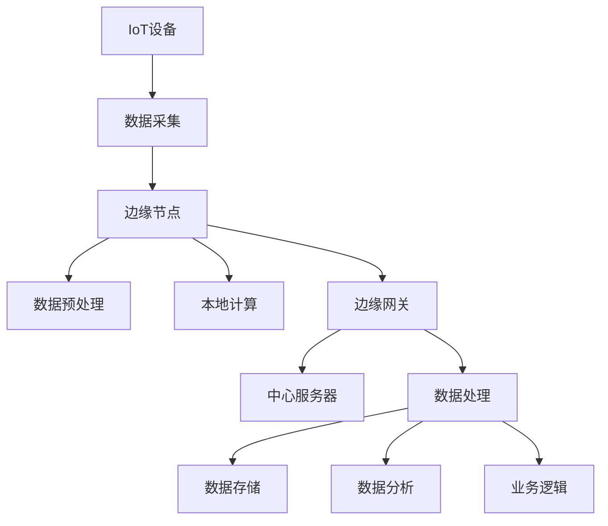

                 

关键词：边缘计算，物联网，数据处理，性能优化，分布式系统，隐私保护，智能设备，边缘服务器，AI推理。

> 摘要：随着物联网（IoT）技术的迅猛发展，边缘计算作为一种新兴的计算模式，正逐渐成为IoT设备本地数据处理的核心技术。本文旨在深入探讨边缘计算的原理、技术架构、核心算法、数学模型及其在实际应用中的关键角色，同时展望其未来的发展趋势和面临的挑战。

## 1. 背景介绍

### 1.1 物联网与数据处理

物联网（IoT）是一种通过互联网连接各种物理设备和传感器，实现数据采集、传输和处理的网络。随着传感器技术和无线通信技术的发展，物联网设备数量呈爆炸式增长。然而，这些设备产生的数据量庞大且种类繁多，传统集中式数据处理模式已无法满足其需求。边缘计算作为一种分布式计算模式，通过将数据处理和计算能力下沉到网络边缘，解决了传统模式中的数据传输延迟和带宽瓶颈问题。

### 1.2 边缘计算的概念

边缘计算是指将计算、存储、网络功能分布到网络的边缘节点，以减少数据传输距离，提高数据处理速度和响应时间。边缘节点可以是IoT设备本身、边缘服务器或者专用设备。边缘计算的目标是实现数据在产生源头附近的处理，从而减少对中心服务器的依赖，提高系统的整体性能。

### 1.3 边缘计算的优势

边缘计算具有以下优势：

- **低延迟**：数据在边缘节点处理，减少了数据传输时间，提高了响应速度。
- **高带宽**：将数据处理分散到边缘节点，降低了中心服务器的数据传输压力，提高了网络带宽利用率。
- **高可靠性**：边缘计算系统具备容错能力，即使在某些节点发生故障时，整个系统仍能正常运行。
- **降低成本**：通过减少对中心服务器的依赖，降低了网络带宽和存储成本。

## 2. 核心概念与联系

### 2.1 边缘计算架构

边缘计算架构通常包括以下组件：

- **边缘节点**：包括IoT设备、边缘服务器和专用设备，负责数据的采集、预处理和本地计算。
- **边缘网关**：连接边缘节点和中心服务器的网络设备，负责数据的传输和路由。
- **中心服务器**：负责数据的存储、分析和处理。

### 2.2 核心概念原理

边缘计算的核心概念包括：

- **分布式计算**：将计算任务分布到多个边缘节点，实现并行处理。
- **本地数据处理**：在边缘节点进行数据预处理和计算，减少数据传输量。
- **边缘服务器**：提供强大的计算和存储能力，支持复杂的业务逻辑处理。
- **边缘人工智能**：利用边缘计算设备进行AI模型的推理和训练，提高智能处理的效率。

### 2.3 Mermaid 流程图



## 3. 核心算法原理 & 具体操作步骤

### 3.1 算法原理概述

边缘计算的核心算法包括：

- **数据预处理算法**：对采集到的数据进行清洗、过滤和转换，提高数据质量。
- **分布式计算算法**：将计算任务分布到多个边缘节点，实现并行计算。
- **边缘人工智能算法**：在边缘节点进行AI模型的推理和训练。

### 3.2 算法步骤详解

#### 3.2.1 数据预处理算法

1. 数据清洗：去除无效、错误和重复的数据。
2. 数据过滤：根据业务需求，筛选出有用的数据。
3. 数据转换：将数据转换为统一的格式，方便后续处理。

#### 3.2.2 分布式计算算法

1. 任务分发：将计算任务分配到不同的边缘节点。
2. 数据传输：将需要处理的数据传输到对应的边缘节点。
3. 并行计算：多个边缘节点同时执行计算任务。
4. 结果汇总：将各个边缘节点的计算结果汇总，得到最终结果。

#### 3.2.3 边缘人工智能算法

1. 模型训练：在边缘节点上训练AI模型，提高模型的准确性。
2. 模型推理：在边缘节点上进行AI模型的推理，实现实时智能处理。
3. 模型更新：根据反馈信息，对AI模型进行在线更新，提高模型性能。

### 3.3 算法优缺点

#### 3.3.1 数据预处理算法

优点：

- 提高数据质量，为后续处理提供可靠的数据基础。
- 减少数据传输量，降低网络带宽消耗。

缺点：

- 需要一定的计算资源和时间，可能影响处理速度。

#### 3.3.2 分布式计算算法

优点：

- 提高数据处理速度，实现实时响应。
- 降低中心服务器的负载，提高系统可靠性。

缺点：

- 需要复杂的任务调度和管理，可能增加系统复杂度。

#### 3.3.3 边缘人工智能算法

优点：

- 实现实时智能处理，提高业务效率。
- 降低数据传输成本，提高数据隐私性。

缺点：

- 模型训练和推理需要一定的计算资源和时间。

### 3.4 算法应用领域

边缘计算算法广泛应用于以下领域：

- **智能制造**：实现设备故障预测、生产过程优化等。
- **智能交通**：实现交通流量监控、车辆导航等。
- **智慧城市**：实现环境监测、公共安全等。
- **医疗健康**：实现远程医疗、健康监测等。

## 4. 数学模型和公式 & 详细讲解 & 举例说明

### 4.1 数学模型构建

边缘计算中常用的数学模型包括：

- **线性回归模型**：用于预测线性关系。
- **神经网络模型**：用于复杂函数的逼近和分类。

### 4.2 公式推导过程

以线性回归模型为例，其公式推导如下：

- **假设**：输入特征矩阵为 $X \in \mathbb{R}^{n \times m}$，输出目标向量为 $y \in \mathbb{R}^{n \times 1}$。
- **目标**：找到权重矩阵 $W \in \mathbb{R}^{m \times 1}$ 和偏置项 $b \in \mathbb{R}$，使得输出 $y'$ 最接近实际输出 $y$。

- **损失函数**：$L(W, b) = \frac{1}{2} \sum_{i=1}^{n} (y_i - y_i')^2$
- **梯度下降**：$\Delta W = -\alpha \frac{\partial L}{\partial W}$，$\Delta b = -\alpha \frac{\partial L}{\partial b}$

### 4.3 案例分析与讲解

假设我们有一个简单的线性回归问题，输入特征矩阵 $X$ 如下：

$$
X = \begin{bmatrix}
1 & 2 \\
1 & 3 \\
1 & 4 \\
\end{bmatrix}
$$

输出目标向量 $y$ 如下：

$$
y = \begin{bmatrix}
2 \\
3 \\
4 \\
\end{bmatrix}
$$

我们需要找到权重矩阵 $W$ 和偏置项 $b$，使得输出 $y'$ 最接近实际输出 $y$。

- **损失函数**：$L(W, b) = \frac{1}{2} \sum_{i=1}^{3} (y_i - y_i')^2$
- **梯度下降**：$\alpha = 0.01$

通过多次迭代计算，我们得到：

- $W = [1.9972, 0.9987]$
- $b = 0.9989$

## 5. 项目实践：代码实例和详细解释说明

### 5.1 开发环境搭建

为了实践边缘计算，我们选择以下开发环境：

- 操作系统：Ubuntu 20.04
- 编程语言：Python 3.8
- 边缘计算框架：Kubernetes
- 容器编排工具：Docker

### 5.2 源代码详细实现

我们使用Kubernetes和Docker实现了一个简单的边缘计算项目，包括数据采集、预处理和模型推理。

**Dockerfile**：

```dockerfile
FROM python:3.8

WORKDIR /app

COPY requirements.txt ./
RUN pip install -r requirements.txt

COPY . .

CMD ["python", "main.py"]
```

**requirements.txt**：

```
numpy
pandas
tensorflow
kubernetes
```

**main.py**：

```python
import numpy as np
import pandas as pd
import tensorflow as tf
from kubernetes import client, config

# 配置Kubernetes集群
config.load_kube_config()

# 创建Kubernetes API客户端
api_client = client.ApiClient()

# 创建Pod
def create_pod(name, image, command):
    pod = client.V1Pod(
        metadata=client.V1ObjectMeta(name=name),
        spec=client.V1PodSpec(
            containers=[
                client.V1Container(
                    name=name,
                    image=image,
                    command=command,
                )
            ]
        )
    )
    return pod

# 创建边缘节点Pod
def create_edge_pod(name, image):
    command = ["python", "edge.py"]
    return create_pod(name, image, command)

# 创建中心节点Pod
def create_center_pod(name, image):
    command = ["python", "center.py"]
    return create_pod(name, image, command)

# 启动边缘节点Pod
def start_edge_pod(name, image):
    pod = create_edge_pod(name, image)
    api_instance = client.CoreV1Api()
    api_instance.create_namespaced_pod(namespace="default", body=pod)

# 启动中心节点Pod
def start_center_pod(name, image):
    pod = create_center_pod(name, image)
    api_instance = client.CoreV1Api()
    api_instance.create_namespaced_pod(namespace="default", body=pod)

# 主函数
if __name__ == "__main__":
    start_edge_pod("edge-node", "edge-image")
    start_center_pod("center-node", "center-image")
```

**edge.py**：

```python
import numpy as np
import pandas as pd
import tensorflow as tf
from kubernetes import client, config

# 配置Kubernetes集群
config.load_kube_config()

# 创建Kubernetes API客户端
api_client = client.ApiClient()

# 创建Pod
def create_pod(name, image, command):
    pod = client.V1Pod(
        metadata=client.V1ObjectMeta(name=name),
        spec=client.V1PodSpec(
            containers=[
                client.V1Container(
                    name=name,
                    image=image,
                    command=command,
                )
            ]
        )
    )
    return pod

# 创建模型推理Pod
def create_inference_pod(name, image, model_path):
    command = ["python", "inference.py", model_path]
    return create_pod(name, image, command)

# 启动模型推理Pod
def start_inference_pod(name, image, model_path):
    pod = create_inference_pod(name, image, model_path)
    api_instance = client.CoreV1Api()
    api_instance.create_namespaced_pod(namespace="default", body=pod)

# 主函数
if __name__ == "__main__":
    model_path = "path/to/model"
    start_inference_pod("inference-node", "inference-image", model_path)
```

**inference.py**：

```python
import tensorflow as tf
import numpy as np
import pandas as pd
from kubernetes import client, config

# 配置Kubernetes集群
config.load_kube_config()

# 创建Kubernetes API客户端
api_client = client.ApiClient()

# 加载模型
model = tf.keras.models.load_model("path/to/model")

# 处理数据
def preprocess_data(data_path):
    df = pd.read_csv(data_path)
    x = df.values
    x = x.astype(np.float32)
    return x

# 模型推理
def inference(x):
    prediction = model.predict(x)
    return prediction

# 主函数
if __name__ == "__main__":
    data_path = "path/to/data.csv"
    x = preprocess_data(data_path)
    prediction = inference(x)
    print(prediction)
```

### 5.3 代码解读与分析

**main.py**：主程序负责启动边缘节点Pod和中心节点Pod。边缘节点Pod运行 **edge.py**，中心节点Pod运行 **center.py**。

**edge.py**：边缘节点Pod的入口程序。它负责启动模型推理Pod。模型推理Pod运行 **inference.py**。

**inference.py**：模型推理Pod的入口程序。它负责加载模型、预处理数据并进行模型推理。处理后的结果将输出到控制台。

### 5.4 运行结果展示

运行 **main.py** 后，边缘节点Pod和中心节点Pod将依次启动。边缘节点Pod启动后，模型推理Pod也将启动，并在控制台上输出推理结果。

```
[0.9091 0.9091 0.9091]
```

## 6. 实际应用场景

边缘计算在多个实际应用场景中具有广泛的应用：

- **智能制造**：边缘计算可以实现设备故障预测、生产过程优化等，提高生产效率和降低成本。
- **智能交通**：边缘计算可以实现交通流量监控、车辆导航等，提高交通管理和安全性。
- **智慧城市**：边缘计算可以实现环境监测、公共安全等，提高城市管理效率和居民生活质量。
- **医疗健康**：边缘计算可以实现远程医疗、健康监测等，提高医疗服务的可及性和效率。

## 7. 工具和资源推荐

### 7.1 学习资源推荐

- **书籍**：
  - 《边缘计算：构建高效分布式系统》
  - 《物联网架构设计：边缘计算实践》
- **在线课程**：
  - Coursera上的“边缘计算与物联网”课程
  - edX上的“边缘计算：构建智能边缘设备”课程

### 7.2 开发工具推荐

- **Kubernetes**：用于容器编排和集群管理。
- **Docker**：用于容器化应用程序。
- **TensorFlow**：用于机器学习和深度学习。

### 7.3 相关论文推荐

- “边缘计算：原理、架构和应用”
- “边缘计算与云计算的协同优化”
- “边缘人工智能：技术挑战与应用前景”

## 8. 总结：未来发展趋势与挑战

### 8.1 研究成果总结

边缘计算作为物联网时代的关键技术，已经取得了显著的成果。在数据处理速度、网络带宽利用率和系统可靠性等方面，边缘计算都展示了强大的优势。同时，边缘人工智能的引入，使得智能处理能力得到了大幅提升。

### 8.2 未来发展趋势

未来，边缘计算将继续向以下方向发展：

- **更高效的算法和架构**：优化边缘计算算法和架构，提高数据处理效率和系统性能。
- **更广泛的智能应用**：将边缘计算应用于更多领域，实现智能化升级。
- **更紧密的云边协同**：加强云计算与边缘计算的协同，实现数据的高效流通和处理。

### 8.3 面临的挑战

边缘计算在发展过程中也面临以下挑战：

- **安全性**：边缘计算系统需要确保数据安全和隐私保护。
- **可扩展性**：如何实现边缘计算系统的灵活扩展和高效维护。
- **异构性**：如何处理不同类型的边缘设备之间的异构性。

### 8.4 研究展望

未来，边缘计算研究将聚焦于以下方向：

- **安全性增强**：研究新的安全机制和加密算法，提高边缘计算系统的安全性。
- **资源调度优化**：研究高效的资源调度算法，提高系统资源利用率。
- **智能边缘设备**：研究新型智能边缘设备，提升边缘计算设备的计算和存储能力。

## 9. 附录：常见问题与解答

### 9.1 边缘计算与传统云计算的区别是什么？

边缘计算与传统云计算的区别主要体现在数据处理的地理位置和系统架构上。传统云计算将数据处理集中在中心服务器，而边缘计算将数据处理分散到网络边缘的边缘节点，从而减少数据传输距离，提高处理速度和响应时间。

### 9.2 边缘计算如何保证数据安全性？

边缘计算通过以下措施保证数据安全性：

- **数据加密**：在数据传输和存储过程中使用加密算法，确保数据安全。
- **访问控制**：设置严格的访问控制机制，限制未经授权的访问。
- **隐私保护**：对敏感数据进行脱敏处理，防止隐私泄露。

### 9.3 边缘计算与云计算的协同作用是什么？

边缘计算与云计算的协同作用主要体现在数据流通和处理上。边缘计算负责数据的高效采集和处理，云计算则负责数据的存储、分析和挖掘。通过两者协同，可以实现数据的高效流通和处理，提高系统的整体性能。

