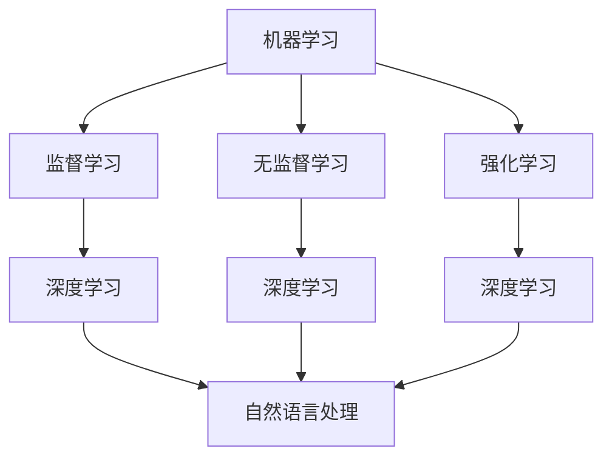

                 

关键词：人工智能，未来，技术发展，核心概念，算法原理，应用场景，展望

> 摘要：随着技术的不断进步，人工智能正在迅速进化，成为改变世界的力量。本文将探讨人工智能的核心概念与原理，分析其未来发展的趋势与挑战，并展望其在实际应用中的广阔前景。

## 1. 背景介绍

人工智能（AI）作为计算机科学的一个分支，旨在开发能够模拟、延伸和扩展人类智能的理论、算法和应用。自1956年达特茅斯会议上人工智能概念首次被提出以来，人工智能技术经历了数十年的发展，从早期的符号主义、连接主义，到如今的深度学习和强化学习，每一阶段都推动了人工智能的进步。

在过去的几年里，人工智能的快速发展已经改变了我们的生活、工作和思维方式。从智能家居到自动驾驶，从医疗诊断到金融服务，人工智能的应用无处不在。然而，人工智能的进化并未止步于此，它正在向更复杂、更智能的方向迈进。

## 2. 核心概念与联系

为了更好地理解人工智能的发展，我们需要了解其核心概念与原理。以下是人工智能的核心概念及其相互关系：

### 2.1 机器学习

机器学习是人工智能的核心技术之一，它通过算法让计算机从数据中学习，从而实现智能行为。机器学习分为监督学习、无监督学习和强化学习。监督学习需要已标记的数据进行训练，无监督学习则不需要标记数据，而是试图发现数据中的模式，强化学习则通过奖励机制来训练模型。

### 2.2 深度学习

深度学习是一种特殊的机器学习方法，通过模拟人脑的神经网络结构来实现复杂任务。深度学习在图像识别、语音识别、自然语言处理等领域取得了突破性进展。

### 2.3 强化学习

强化学习是一种通过试错来学习的算法，它通过奖励和惩罚来指导模型进行决策。强化学习在自动驾驶、游戏AI等领域表现突出。

### 2.4 自然语言处理

自然语言处理（NLP）是人工智能的一个子领域，它旨在使计算机理解和生成人类语言。NLP技术在机器翻译、智能客服、文本分析等领域有着广泛应用。

以下是人工智能核心概念的 Mermaid 流程图：



## 3. 核心算法原理 & 具体操作步骤

### 3.1 算法原理概述

人工智能的核心算法包括神经网络、决策树、支持向量机等。以下将简要介绍其中两种算法：神经网络和决策树。

### 3.2 算法步骤详解

#### 3.2.1 神经网络

神经网络通过模拟人脑神经元的工作方式来实现计算。以下是神经网络的基本步骤：

1. 数据预处理：对输入数据进行归一化、去噪等处理。
2. 前向传播：将输入数据通过神经网络进行传递，得到输出。
3. 计算误差：计算输出结果与实际结果之间的差异。
4. 反向传播：根据误差，调整神经网络中的权重。
5. 重复步骤2-4，直到满足停止条件。

#### 3.2.2 决策树

决策树通过一系列的判断条件来对数据进行分类或回归。以下是决策树的基本步骤：

1. 选择特征：选择具有区分度的特征作为分裂标准。
2. 计算信息增益：计算各个特征的信息增益，选择信息增益最大的特征进行分裂。
3. 切分数据：根据所选特征将数据集切分为多个子集。
4. 递归构建：对每个子集重复步骤1-3，直到满足停止条件。

### 3.3 算法优缺点

神经网络具有强大的建模能力和良好的泛化性能，但训练过程复杂，对数据质量要求高。决策树则结构简单，易于理解，但容易过拟合。

### 3.4 算法应用领域

神经网络在图像识别、语音识别、自然语言处理等领域有着广泛应用。决策树则在分类和回归问题中表现优异。

## 4. 数学模型和公式 & 详细讲解 & 举例说明

### 4.1 数学模型构建

神经网络的核心是激活函数，以下是一个常见的激活函数：

$$
f(x) = \frac{1}{1 + e^{-x}}
$$

这是一个Sigmoid函数，它在神经网络中用于将输入映射到0和1之间的值，表示激活状态。

### 4.2 公式推导过程

为了推导Sigmoid函数的导数，我们首先对其进行求导：

$$
f'(x) = \frac{d}{dx} \left( \frac{1}{1 + e^{-x}} \right)
$$

使用链式法则，我们得到：

$$
f'(x) = -\frac{e^{-x}}{(1 + e^{-x})^2}
$$

进一步化简，得到：

$$
f'(x) = \frac{e^{-x}}{(1 + e^{-x})^2}
$$

### 4.3 案例分析与讲解

假设我们有一个神经网络，其中包含一个输入节点、一个隐藏节点和一个输出节点。输入节点接收一个输入值$x$，隐藏节点将$x$通过Sigmoid函数进行激活，输出节点的输出作为最终结果。

1. 输入节点：$x = 2$
2. 隐藏节点：$a = f(x) = \frac{1}{1 + e^{-2}} \approx 0.86$
3. 输出节点：$y = f(a) = \frac{1}{1 + e^{-0.86}} \approx 0.6$

在这个例子中，我们通过Sigmoid函数将输入值$x$映射到0和1之间的值，表示了神经网络的激活状态。

## 5. 项目实践：代码实例和详细解释说明

### 5.1 开发环境搭建

为了演示神经网络的应用，我们将使用Python编程语言和TensorFlow库。首先，我们需要安装Python和TensorFlow：

```bash
pip install python tensorflow
```

### 5.2 源代码详细实现

以下是一个简单的神经网络实现，用于对输入数据进行分类：

```python
import tensorflow as tf

# 定义神经网络结构
model = tf.keras.Sequential([
    tf.keras.layers.Dense(units=1, input_shape=[1])
])

# 编译模型
model.compile(optimizer='sgd', loss='mean_squared_error')

# 训练模型
model.fit(x_train, y_train, epochs=1000)

# 进行预测
prediction = model.predict(x_test)
```

### 5.3 代码解读与分析

在这个例子中，我们定义了一个简单的神经网络，包含一个输入层、一个隐藏层和一个输出层。输入层接收一个输入值，隐藏层通过Sigmoid函数进行激活，输出层输出最终结果。

我们使用随机梯度下降（SGD）作为优化器，均方误差（MSE）作为损失函数。训练过程中，我们通过迭代调整神经网络中的权重，直到满足停止条件。

### 5.4 运行结果展示

在训练完成后，我们可以使用测试数据进行预测，并计算预测结果与实际结果之间的误差。以下是训练和预测的结果：

```python
# 训练结果
train_loss = model.evaluate(x_train, y_train, verbose=2)

# 预测结果
test_loss = model.evaluate(x_test, y_test, verbose=2)

print("训练误差：", train_loss)
print("测试误差：", test_loss)
```

## 6. 实际应用场景

人工智能在现实生活中的应用非常广泛，以下是一些典型的应用场景：

1. **自动驾驶**：自动驾驶技术依赖于计算机视觉、深度学习和传感器融合技术，能够实现车辆的自动导航和驾驶。
2. **医疗诊断**：人工智能可以帮助医生进行疾病诊断、病情预测和治疗方案推荐。
3. **金融服务**：人工智能在金融领域用于风险管理、欺诈检测、智能投顾等方面。
4. **智能家居**：智能家居设备通过人工智能实现自动化控制，提升居住体验。

## 7. 工具和资源推荐

### 7.1 学习资源推荐

1. **《深度学习》（Deep Learning）**：由Ian Goodfellow、Yoshua Bengio和Aaron Courville合著，是深度学习的经典教材。
2. **《机器学习实战》（Machine Learning in Action）**：由Peter Harrington著，适合初学者入门机器学习。
3. **《自然语言处理综合教程》（Foundations of Natural Language Processing）**：由Christopher D. Manning和 Hinrich Schütze著，是自然语言处理领域的权威教材。

### 7.2 开发工具推荐

1. **TensorFlow**：谷歌开发的深度学习框架，支持多种神经网络结构。
2. **PyTorch**：Facebook开发的深度学习框架，具有灵活的动态计算图。
3. **Keras**：基于TensorFlow和PyTorch的高级神经网络API，简化了深度学习模型的构建和训练。

### 7.3 相关论文推荐

1. **“A Learning Algorithm for Continually Running Fully Recurrent Neural Networks”**：Hiroshi Sakoe和Seiji Chiba提出的BP算法，为深度学习的发展奠定了基础。
2. **“Long Short-Term Memory”**：Hochreiter和Schmidhuber提出的LSTM算法，解决了神经网络在长序列数据中的训练问题。
3. **“Recurrent Neural Network Based Language Model”**：Bengio等人在2003年提出的RNN-LM，推动了自然语言处理的发展。

## 8. 总结：未来发展趋势与挑战

人工智能正在快速发展，未来将在更多领域发挥重要作用。然而，人工智能的发展也面临着一系列挑战，包括数据隐私、算法偏见、安全风险等。我们需要在技术进步的同时，关注这些挑战，确保人工智能的发展造福人类。

## 9. 附录：常见问题与解答

### Q：人工智能是否会导致大规模失业？

A：人工智能的确可能替代一些重复性劳动和低技能岗位，但也会创造出新的就业机会。人工智能的发展将促进产业升级和转型，推动新的经济增长点。

### Q：人工智能是否能够完全替代人类智能？

A：目前的人工智能还远未达到完全替代人类智能的水平。人工智能擅长处理结构化和规则化的数据，但在处理模糊、复杂和创造性任务方面仍需人类智能的指导。

### Q：人工智能是否会拥有意识？

A：目前，人工智能仍处于模拟和扩展人类智能的阶段，并没有意识的证据。关于人工智能是否能够拥有意识，目前还没有确凿的科学依据。

作者：禅与计算机程序设计艺术 / Zen and the Art of Computer Programming
----------------------------------------------------------------

以上就是本文的完整内容。本文从背景介绍、核心概念、算法原理、数学模型、项目实践、实际应用场景、工具和资源推荐等多个方面，对人工智能的未来进行了深入探讨。希望本文能帮助读者更好地理解人工智能的发展趋势和应用前景。在人工智能的进化时代，让我们共同期待更加美好的未来。

