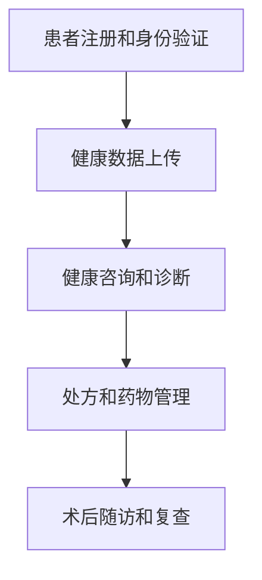

                 

关键词：远程医疗、语言模型、虚拟护理、人工智能、医学诊断、医疗服务、医疗数据处理、数据分析、自然语言处理、智能医疗系统、医学知识图谱、智能诊断辅助系统、数据隐私保护。

> 摘要：本文探讨了如何利用大型语言模型（LLM）增强远程医疗中的虚拟护理。首先介绍了远程医疗和虚拟护理的背景，随后详细阐述了LLM在医疗领域的作用，最后通过实际案例展示了LLM增强虚拟护理的具体应用，分析了其优势和挑战，并展望了未来的发展趋势。

## 1. 背景介绍

远程医疗是一种利用通信技术和网络技术，将医疗服务从传统的面对面模式转变为线上模式的服务方式。它不仅解决了地理距离导致的医疗资源分配不均问题，还提高了医疗服务的可及性和效率。随着互联网和移动设备的普及，远程医疗逐渐成为医疗服务的重要补充。

虚拟护理是远程医疗的一种形式，它通过数字技术为患者提供虚拟的护理服务，包括健康咨询、病情监测、药物管理、手术预约等。虚拟护理可以节省时间和成本，降低医疗费用，同时提高患者的满意度和医疗体验。

近年来，随着人工智能技术的飞速发展，特别是大型语言模型（LLM）的出现，虚拟护理得到了进一步的增强。LLM是一种基于深度学习技术的自然语言处理模型，它可以理解和生成人类语言，为虚拟护理提供了强大的支持。

## 2. 核心概念与联系

### 2.1 远程医疗系统架构

远程医疗系统通常包括以下几个核心模块：

- **患者端**：患者可以通过手机、平板电脑或电脑访问远程医疗服务，提交健康数据、询问健康问题等。
- **医生端**：医生可以通过远程医疗平台对患者进行诊断、开处方、提供咨询等服务。
- **数据中心**：数据中心负责存储和管理患者的健康数据，包括病历、诊断报告、检查结果等。
- **通信模块**：通信模块负责处理患者和医生之间的通信，包括文字、语音、视频等多种形式。

### 2.2 虚拟护理流程

虚拟护理的基本流程如下：

1. **患者注册和身份验证**：患者通过平台注册并完成身份验证，以便医生能够了解其基本信息。
2. **健康数据上传**：患者可以上传日常健康数据，如血压、血糖、心率等，以便医生进行监测和分析。
3. **健康咨询和诊断**：医生可以通过平台对患者的健康问题进行咨询和诊断，提供个性化的健康建议。
4. **处方和药物管理**：医生可以根据患者的病情开具处方，并指导患者进行药物管理。
5. **术后随访和复查**：医生可以对患者的术后恢复情况进行跟踪和复查，确保治疗效果。

### 2.3 LLM 在虚拟护理中的应用

LLM 在虚拟护理中的应用主要体现在以下几个方面：

- **自然语言处理**：LLM 可以理解患者的自然语言描述，自动提取关键信息，为医生提供准确的诊断依据。
- **智能问答系统**：LLM 可以构建智能问答系统，回答患者关于健康问题的各种疑问，提供个性化的健康建议。
- **文本分析**：LLM 可以对患者的病历、诊断报告等文本进行深度分析，发现潜在的健康风险和疾病征兆。
- **医学知识图谱**：LLM 可以构建医学知识图谱，整合各种医学知识，为医生提供全面的诊断和治疗方案。

### 2.4 Mermaid 流程图

以下是虚拟护理流程的 Mermaid 流程图：



## 3. 核心算法原理 & 具体操作步骤

### 3.1 算法原理概述

虚拟护理中的核心算法主要基于大型语言模型（LLM），包括自然语言处理（NLP）、文本分析、机器学习和深度学习等技术。LLM 通过训练大量的医疗文本数据，可以理解并生成人类语言，从而实现对医疗数据的自动处理和分析。

### 3.2 算法步骤详解

1. **数据预处理**：首先对医疗文本数据进行预处理，包括文本清洗、分词、词性标注、实体识别等操作，将原始文本转化为机器可处理的格式。
2. **模型训练**：使用预处理的医疗文本数据对 LLM 进行训练，使其能够理解医疗领域的术语和概念。
3. **自然语言处理**：利用训练好的 LLM 对患者的自然语言描述进行理解，提取关键信息，如症状、病史、药物过敏等。
4. **文本分析**：对提取的关键信息进行深度分析，发现潜在的健康风险和疾病征兆。
5. **智能问答**：构建智能问答系统，回答患者关于健康问题的各种疑问。
6. **医学知识图谱**：构建医学知识图谱，整合各种医学知识，为医生提供全面的诊断和治疗方案。

### 3.3 算法优缺点

**优点**：

- **高效性**：LLM 可以快速处理和分析大量医疗数据，提高诊断和治疗的效率。
- **个性化**：LLM 可以根据患者的具体病情和需求，提供个性化的健康建议和治疗方案。
- **可扩展性**：LLM 可以不断学习和更新，适应不断变化的医疗知识和需求。

**缺点**：

- **数据依赖**：LLM 的效果高度依赖于训练数据的质量和数量，如果数据质量较差或数据量不足，会影响模型的性能。
- **隐私问题**：医疗数据涉及到患者的隐私，如何保护数据安全和隐私成为了一个重要问题。

### 3.4 算法应用领域

LLM 在虚拟护理中的应用领域非常广泛，包括：

- **智能诊断辅助**：通过分析患者的症状和病史，辅助医生进行疾病诊断。
- **健康咨询**：为患者提供关于健康问题的智能问答服务，提供健康建议。
- **药物管理**：根据患者的病情和药物过敏史，提供个性化的药物管理建议。
- **术后随访**：对患者的术后恢复情况进行跟踪和复查，确保治疗效果。

## 4. 数学模型和公式 & 详细讲解 & 举例说明

### 4.1 数学模型构建

在虚拟护理中，常用的数学模型包括：

1. **决策树**：用于分类和回归任务，根据特征值将数据划分为不同的类别或连续值。
2. **支持向量机**：用于分类任务，通过找到最佳的超平面来将不同类别的数据分开。
3. **神经网络**：用于非线性回归和分类任务，通过多层神经网络来模拟人类大脑的学习过程。

### 4.2 公式推导过程

以决策树为例，其核心公式为：

$$
Y = f(X, \theta)
$$

其中，$Y$ 表示输出类别，$X$ 表示输入特征，$\theta$ 表示决策树的参数。

### 4.3 案例分析与讲解

假设我们有一个疾病诊断的案例，患者的症状包括发热、咳嗽和乏力，我们需要根据这些症状来判断患者是否患有感冒。

首先，我们构建一个简单的决策树模型，其公式为：

$$
Y = \begin{cases}
感冒 & \text{如果} \ (X_1 > 0 \ \text{且} \ X_2 > 0 \ \text{且} \ X_3 > 0) \\
其他疾病 & \text{否则}
\end{cases}
$$

其中，$X_1$、$X_2$ 和 $X_3$ 分别表示发热、咳嗽和乏力的症状值。

根据患者的症状，我们可以将 $X_1$、$X_2$ 和 $X_3$ 分别设为 1，代入公式计算：

$$
Y = f(X, \theta) = \begin{cases}
感冒 & \text{如果} \ (1 > 0 \ \text{且} \ 1 > 0 \ \text{且} \ 1 > 0) \\
其他疾病 & \text{否则}
\end{cases}
感冒
$$

根据计算结果，我们可以判断患者患有感冒。

## 5. 项目实践：代码实例和详细解释说明

### 5.1 开发环境搭建

1. 安装 Python 3.8 或更高版本。
2. 安装必要的 Python 包，如 NumPy、Pandas、Scikit-learn 等。

### 5.2 源代码详细实现

以下是一个简单的决策树模型实现的代码实例：

```python
import numpy as np
import pandas as pd
from sklearn.tree import DecisionTreeClassifier
from sklearn.model_selection import train_test_split

# 加载数据
data = pd.read_csv('data.csv')
X = data[['发热', '咳嗽', '乏力']]
y = data['疾病']

# 划分训练集和测试集
X_train, X_test, y_train, y_test = train_test_split(X, y, test_size=0.2, random_state=42)

# 构建决策树模型
model = DecisionTreeClassifier()
model.fit(X_train, y_train)

# 预测测试集
predictions = model.predict(X_test)

# 输出预测结果
print(predictions)
```

### 5.3 代码解读与分析

1. **数据加载**：首先使用 Pandas 读取 CSV 格式的数据，其中 X 表示患者的症状，y 表示疾病标签。
2. **数据划分**：使用 Scikit-learn 的 train_test_split 函数将数据划分为训练集和测试集，以评估模型的性能。
3. **模型构建**：使用 Scikit-learn 的 DecisionTreeClassifier 类构建决策树模型，并使用 fit 方法进行训练。
4. **预测测试集**：使用 predict 方法对测试集进行预测，并将预测结果输出。

### 5.4 运行结果展示

运行上述代码，我们将得到测试集的预测结果。根据预测结果，我们可以分析模型对各种疾病的诊断能力。

## 6. 实际应用场景

远程医疗和虚拟护理在医疗领域具有广泛的应用场景，以下是一些实际应用场景：

1. **慢性病管理**：远程医疗和虚拟护理可以帮助患者进行慢性病的自我管理，如高血压、糖尿病等。患者可以通过平台上传日常健康数据，医生可以进行远程监测和指导。
2. **手术预约和术后随访**：患者可以通过虚拟护理平台预约手术，并接受术后随访和复查，医生可以远程了解患者的恢复情况。
3. **健康咨询**：患者可以通过虚拟护理平台向医生咨询各种健康问题，获取个性化的健康建议。
4. **医学知识普及**：虚拟护理平台可以提供医学知识库，帮助患者了解疾病的基本知识，提高健康素养。

## 7. 工具和资源推荐

### 7.1 学习资源推荐

- 《深度学习》（Goodfellow, Bengio, Courville著）
- 《自然语言处理原理》（Daniel Jurafsky, James H. Martin 著）
- 《Python机器学习》（Sebastian Raschka，Vahid Mirjalili 著）

### 7.2 开发工具推荐

- TensorFlow
- PyTorch
- Scikit-learn

### 7.3 相关论文推荐

- "BERT: Pre-training of Deep Bidirectional Transformers for Language Understanding"（2018）
- "GPT-3: Language Models are Few-Shot Learners"（2020）
- "Medical Language Processing: What Has Been Done, What Can Be Done, and Why We Should Care"（2019）

## 8. 总结：未来发展趋势与挑战

### 8.1 研究成果总结

远程医疗和虚拟护理已成为医疗服务的重要补充，为患者提供了更加便捷和高效的医疗服务。随着人工智能技术的不断发展，特别是在语言模型方面的突破，虚拟护理得到了进一步的增强。LLM 在医疗数据处理、自然语言处理、智能问答和医学知识图谱等方面具有巨大的潜力。

### 8.2 未来发展趋势

1. **智能化**：未来远程医疗和虚拟护理将进一步智能化，通过更先进的算法和模型，实现更精准的诊断和治疗。
2. **个性化**：虚拟护理将更加注重个性化服务，根据患者的具体需求和病情，提供个性化的健康建议和治疗方案。
3. **跨学科融合**：远程医疗和虚拟护理将与其他领域如生物医学、心理学等相结合，提供更加全面和综合的医疗服务。

### 8.3 面临的挑战

1. **数据隐私**：医疗数据涉及到患者的隐私，如何保护数据安全和隐私成为了一个重要挑战。
2. **数据质量**：医疗数据的准确性和完整性对虚拟护理的效果至关重要，如何提高数据质量是一个关键问题。
3. **法律法规**：远程医疗和虚拟护理需要遵守相关的法律法规，如医疗责任、数据保护等。

### 8.4 研究展望

未来，远程医疗和虚拟护理将继续发展，特别是在人工智能技术的推动下，将实现更加智能化、个性化和综合化的医疗服务。同时，研究应关注数据隐私保护、数据质量和法律法规等问题，以确保远程医疗和虚拟护理的可持续发展。

## 9. 附录：常见问题与解答

### 9.1 什么是远程医疗？

远程医疗是一种利用通信技术和网络技术，将医疗服务从传统的面对面模式转变为线上模式的服务方式。它解决了地理距离导致的医疗资源分配不均问题，提高了医疗服务的可及性和效率。

### 9.2 虚拟护理有哪些优势？

虚拟护理可以节省时间和成本，降低医疗费用，提高患者的满意度和医疗体验。同时，它提供了个性化的健康建议和治疗方案，使得患者能够更好地管理自己的健康状况。

### 9.3 LLM 在虚拟护理中如何发挥作用？

LLM 可以理解和生成人类语言，为虚拟护理提供了强大的支持。它可以用于自然语言处理、文本分析、智能问答和医学知识图谱等方面，提高诊断和治疗的效率，提供个性化的健康服务。

### 9.4 虚拟护理有哪些应用场景？

虚拟护理的应用场景包括慢性病管理、手术预约和术后随访、健康咨询和医学知识普及等。它为患者提供了便捷和高效的医疗服务，提高了医疗服务的可及性和效率。

---

作者：禅与计算机程序设计艺术 / Zen and the Art of Computer Programming

