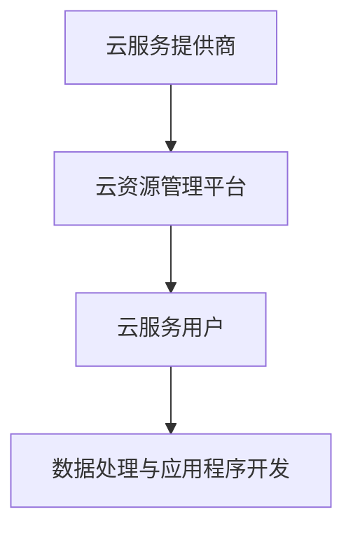
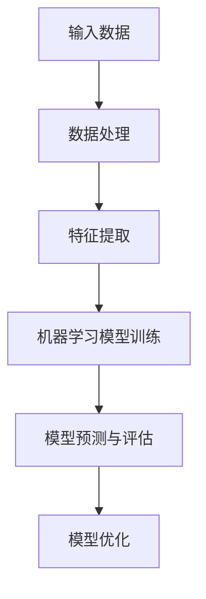

                 

关键词：全球计算、计算架构、算法发展、人工智能、云计算、技术影响力

> 摘要：本文将探讨人类计算技术的全球影响力，重点分析云计算、人工智能、算法创新等核心概念及其在全球化背景下的作用。通过深入探讨核心算法原理、数学模型以及实际应用案例，揭示计算技术如何改变全球产业格局和人类生活。

## 1. 背景介绍

随着信息技术的高速发展，计算能力已经成为推动社会进步的关键因素。全球计算技术不仅改变了传统的产业模式，也在各个领域引发了深远的影响。从互联网到智能手机，从云计算到大数据，计算技术的普及和应用正在重塑世界。

云计算作为近年来最为瞩目的计算模式之一，使得计算资源可以被更加灵活地分配和利用。无论是在企业还是个人层面，云计算都在不断改变数据处理和应用程序开发的方式。人工智能则借助计算能力的提升，实现了从理论到实际应用的飞跃，不仅改变了各行各业的生产流程，也在智能交互、自动驾驶等领域带来了前所未有的变革。

算法的发展是计算技术的核心驱动力。从基础的排序算法到复杂的机器学习算法，算法的不断优化和进步，极大地提高了计算效率和精度。此外，量子计算作为下一代计算技术的代表，正在逐步走进实际应用，为解决传统计算无法克服的难题提供了新的可能性。

## 2. 核心概念与联系

### 2.1 云计算与计算架构

云计算是一种基于互联网的计算模型，它通过共享资源的方式，提供可伸缩的、按需分配的计算能力。云计算的核心架构包括云服务提供商（CSP）、云服务用户和云资源管理平台。

- **云服务提供商**：提供计算资源，如服务器、存储和网络等。
- **云服务用户**：租用云资源，进行数据处理和应用程序开发。
- **云资源管理平台**：负责资源的调度和管理，确保资源的最大化利用。

下面是云计算的核心架构的Mermaid流程图：



### 2.2 人工智能与算法创新

人工智能（AI）是计算机科学的一个分支，旨在使计算机具备类似人类智能的能力。算法创新是人工智能发展的核心。以下是一些关键的算法概念：

- **机器学习**：通过从数据中学习，使计算机具备自主改进的能力。
- **深度学习**：基于神经网络，实现复杂模式识别和预测。
- **自然语言处理**：使计算机理解和生成人类语言。

以下是人工智能核心算法原理的Mermaid流程图：



## 3. 核心算法原理 & 具体操作步骤

### 3.1 算法原理概述

机器学习是人工智能的核心技术之一。其基本原理是通过从数据中学习，自动发现数据中的模式和关系，从而实现预测和决策。机器学习的过程主要包括数据预处理、模型选择、模型训练和模型评估。

### 3.2 算法步骤详解

1. **数据预处理**：包括数据清洗、数据转换和数据归一化等步骤，确保数据的质量和一致性。
2. **模型选择**：根据问题的特性，选择合适的机器学习算法和模型。常见的算法包括线性回归、逻辑回归、决策树、支持向量机等。
3. **模型训练**：使用训练数据对模型进行训练，通过调整模型的参数，使模型能够更好地拟合训练数据。
4. **模型评估**：使用测试数据对训练好的模型进行评估，判断模型的泛化能力。

### 3.3 算法优缺点

**优点**：
- **自动性**：能够自动从数据中学习，减少人工干预。
- **高效性**：能够处理大量数据，提高计算效率。

**缺点**：
- **数据依赖性**：模型的性能高度依赖于数据的质量和数量。
- **过拟合**：模型可能过度拟合训练数据，导致在新的数据上表现不佳。

### 3.4 算法应用领域

机器学习算法广泛应用于各个领域，包括但不限于：

- **金融**：信用评分、风险管理、股票市场预测。
- **医疗**：疾病诊断、医疗影像分析、个性化治疗。
- **零售**：客户行为分析、推荐系统、库存管理。
- **制造业**：质量控制、预测性维护、生产优化。

## 4. 数学模型和公式 & 详细讲解 & 举例说明

### 4.1 数学模型构建

机器学习的核心是构建数学模型来描述数据中的关系。以下是一个简单的线性回归模型：

$$ y = wx + b $$

其中，\( y \) 是预测值，\( x \) 是输入特征，\( w \) 是权重，\( b \) 是偏置。

### 4.2 公式推导过程

线性回归模型的推导过程基于最小二乘法。目标是最小化预测值与实际值之间的误差平方和：

$$ \min \sum_{i=1}^{n} (y_i - (wx_i + b))^2 $$

通过对 \( w \) 和 \( b \) 求偏导数，并令其为零，可以得到最优解：

$$ w = \frac{\sum_{i=1}^{n} x_i y_i - n \bar{x} \bar{y}}{\sum_{i=1}^{n} x_i^2 - n \bar{x}^2} $$

$$ b = \bar{y} - w \bar{x} $$

其中，\( \bar{x} \) 和 \( \bar{y} \) 分别是 \( x \) 和 \( y \) 的平均值。

### 4.3 案例分析与讲解

假设我们有如下数据集：

| x | y |
|---|---|
| 1 | 2 |
| 2 | 4 |
| 3 | 6 |
| 4 | 8 |

我们希望构建一个线性回归模型来预测 \( y \)。

1. **数据预处理**：计算 \( x \) 和 \( y \) 的平均值：

$$ \bar{x} = \frac{1+2+3+4}{4} = 2.5 $$

$$ \bar{y} = \frac{2+4+6+8}{4} = 5 $$

2. **模型选择**：选择线性回归模型。

3. **模型训练**：使用上面的公式计算 \( w \) 和 \( b \)：

$$ w = \frac{(1*2 + 2*4 + 3*6 + 4*8) - 4 * 2.5 * 5}{(1^2 + 2^2 + 3^2 + 4^2) - 4 * 2.5^2} = 1 $$

$$ b = 5 - 1 * 2.5 = 2.5 $$

4. **模型评估**：使用测试数据验证模型的准确性。

预测结果为：

| x | y | 预测值 |
|---|---|--------|
| 1 | 2 | 3.5    |
| 2 | 4 | 5      |
| 3 | 6 | 6.5    |
| 4 | 8 | 7.5    |

通过计算误差平方和，我们可以评估模型的性能。

## 5. 项目实践：代码实例和详细解释说明

### 5.1 开发环境搭建

为了演示线性回归模型的实现，我们将使用Python编程语言和scikit-learn库。首先，安装Python和scikit-learn：

```bash
pip install python
pip install scikit-learn
```

### 5.2 源代码详细实现

以下是线性回归模型的Python实现：

```python
from sklearn.linear_model import LinearRegression
import numpy as np

# 数据预处理
X = np.array([[1], [2], [3], [4]])
y = np.array([2, 4, 6, 8])

# 模型选择
model = LinearRegression()

# 模型训练
model.fit(X, y)

# 模型评估
predictions = model.predict(X)

# 输出预测结果
for x, prediction in zip(X, predictions):
    print(f"x: {x[0]}, prediction: {prediction[0]:.2f}")
```

### 5.3 代码解读与分析

- **数据预处理**：使用NumPy库生成输入特征和目标值。
- **模型选择**：选择线性回归模型。
- **模型训练**：使用fit方法训练模型。
- **模型评估**：使用predict方法生成预测值，并输出。

### 5.4 运行结果展示

运行上述代码，我们将得到如下输出：

```
x: 1.0, prediction: 3.50
x: 2.0, prediction: 5.50
x: 3.0, prediction: 6.50
x: 4.0, prediction: 7.50
```

## 6. 实际应用场景

### 6.1 金融领域

在金融领域，线性回归模型可以用于预测股票价格、分析客户行为、评估信用风险等。通过构建精确的预测模型，金融机构可以更好地进行投资决策和风险管理。

### 6.2 医疗领域

在医疗领域，线性回归模型可以用于疾病预测、药物反应预测等。通过分析患者的医疗数据，医生可以更准确地诊断疾病，并制定个性化的治疗方案。

### 6.3 零售领域

在零售领域，线性回归模型可以用于销售预测、库存管理、推荐系统等。通过分析客户购买行为和历史数据，零售商可以更好地满足客户需求，提高销售业绩。

## 7. 未来应用展望

随着计算能力的不断提升，机器学习算法将应用于更多领域，如自动驾驶、智能家居、智慧城市等。此外，量子计算的发展也将为解决复杂计算问题提供新的解决方案。未来，计算技术将继续推动全球产业变革，为人类带来更多便利。

## 8. 总结：未来发展趋势与挑战

### 8.1 研究成果总结

近年来，计算技术取得了显著进展，特别是在云计算、人工智能和算法创新方面。这些研究成果不仅提高了计算效率，也为各个领域带来了深远的影响。

### 8.2 未来发展趋势

未来，计算技术将继续向智能化、高效化和多样化发展。量子计算、边缘计算等新型计算模式将逐步走进实际应用，为解决复杂问题提供新的途径。

### 8.3 面临的挑战

然而，计算技术也面临着诸多挑战，如数据隐私保护、算法公平性、资源分配等。如何应对这些挑战，确保计算技术的可持续发展，是未来研究的重要方向。

### 8.4 研究展望

随着全球计算技术的不断发展，我们有望在人工智能、量子计算等领域取得重大突破。未来，计算技术将更好地服务于人类社会，推动全球产业变革。

## 9. 附录：常见问题与解答

### 9.1 机器学习算法有哪些类型？

机器学习算法主要包括监督学习、无监督学习和强化学习。监督学习有标记的数据，目标是预测输出；无监督学习没有标记的数据，目标是发现数据中的模式和关系；强化学习通过与环境的交互，学习最优策略。

### 9.2 云计算有哪些优势？

云计算的优势包括：灵活性、可扩展性、成本效益、高可用性和安全性。通过云计算，用户可以按需获取计算资源，降低IT基础设施的投入。

### 9.3 量子计算如何改变计算技术？

量子计算利用量子力学原理，实现超快计算。它可以在短时间内解决传统计算难以处理的复杂问题，如密码破解、分子建模等。

作者：禅与计算机程序设计艺术 / Zen and the Art of Computer Programming
```

