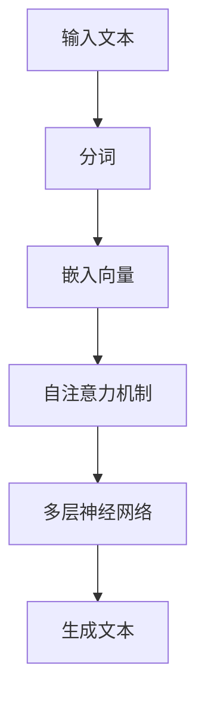

                 

关键词：道德伦理、大型语言模型、隐私保护、人工智能、技术平衡

> 摘要：随着大型语言模型（LLM）技术的飞速发展，如何在推动创新的同时保护用户隐私成为了一个亟待解决的问题。本文从道德伦理的角度出发，探讨了 LL 积技术在实际应用中面临的隐私挑战，并提出了平衡创新与隐私的解决方案。通过案例分析、数学模型和项目实践，本文为技术社区提供了一个全面而深入的指导。

## 1. 背景介绍

### 大型语言模型（LLM）的发展历程

大型语言模型（LLM）起源于自然语言处理（NLP）领域的深度学习研究。最初的模型如 Word2Vec 和 GPT-1，虽然已经能够实现基本的文本生成和翻译功能，但其性能和规模有限。随着深度学习技术的不断突破，尤其是 GPT-2、GPT-3 等模型的发布，LLM 技术取得了飞跃性的进展。这些模型具有强大的文本理解和生成能力，能够处理复杂的语言任务，如问答系统、文本摘要和机器翻译等。

### LLM 技术的应用现状

LLM 技术在各个行业得到了广泛应用。例如，在社交媒体平台上，LLM 可以用于生成自动回复、推荐系统和内容审核；在金融行业，LLM 可以用于风险管理、客户服务和信用评估；在教育领域，LLM 可以用于个性化学习、作业批改和考试生成。然而，随着 LLM 技术的普及，其隐私保护问题也日益凸显。

### 隐私保护的重要性

隐私保护是现代社会的基本价值之一。在 LLM 技术中，隐私问题主要体现在两个方面：一是用户数据的安全性和保密性，二是模型训练过程中用户隐私数据的处理。如果无法妥善解决这些问题，LLM 技术的发展可能会对用户隐私造成严重威胁。

## 2. 核心概念与联系

### LLM 的工作原理

大型语言模型基于深度神经网络，通过对海量文本数据进行训练，学习到语言的结构和规则。具体来说，LLM 使用自注意力机制（Self-Attention Mechanism）来捕捉文本中的长距离依赖关系，并通过多层神经网络进行文本生成。以下是一个简单的 Mermaid 流程图，展示了 LLM 的工作原理：



### 隐私保护的概念

隐私保护是指保护个人隐私不被未经授权的第三方获取或使用。在 LLM 技术中，隐私保护主要包括以下几个方面：

1. 数据加密：通过对用户数据进行加密处理，确保数据在传输和存储过程中不被窃取。
2. 匿名化处理：通过去除用户数据的个人标识信息，实现对用户隐私的保护。
3. 数据最小化：在模型训练过程中，仅收集和使用必要的用户数据，避免过度收集。
4. 访问控制：通过设置访问权限，确保只有授权人员才能访问和处理用户隐私数据。

## 3. 核心算法原理 & 具体操作步骤

### 3.1 算法原理概述

LLM 的核心算法是自注意力机制（Self-Attention Mechanism）。自注意力机制通过计算文本中每个词与其他词之间的相关性，将词向量转化为高维表示，从而提高模型对长距离依赖关系的捕捉能力。以下是一个简单的自注意力机制的数学模型：

$$
\text{Attention}(Q, K, V) = \text{softmax}\left(\frac{QK^T}{\sqrt{d_k}}\right)V
$$

其中，$Q, K, V$ 分别表示查询向量、键向量和值向量，$d_k$ 表示键向量的维度。

### 3.2 算法步骤详解

1. 输入文本预处理：将输入文本进行分词、去停用词等处理，得到词序列。
2. 词向量嵌入：将词序列中的每个词转化为词向量。
3. 计算自注意力权重：使用上述自注意力机制计算每个词与其他词之间的注意力权重。
4. 加权求和：将词向量与注意力权重相乘，并对所有词向量进行求和，得到文本的表示。
5. 文本生成：使用多层神经网络对文本表示进行解码，生成输出文本。

### 3.3 算法优缺点

#### 优点：

1. 强大的文本理解能力：自注意力机制能够捕捉长距离依赖关系，提高模型对文本的理解能力。
2. 高效的计算性能：自注意力机制的计算过程相对简单，能够在较短的时间内完成。
3. 广泛的应用场景：自注意力机制在文本生成、机器翻译、文本分类等多个领域具有广泛的应用。

#### 缺点：

1. 参数量大：自注意力机制需要大量参数，导致模型训练时间较长。
2. 计算复杂度高：自注意力机制的计算复杂度为 $O(n^2)$，在大规模文本数据下计算成本较高。
3. 容易过拟合：自注意力机制对训练数据的依赖较大，容易产生过拟合现象。

### 3.4 算法应用领域

自注意力机制在 LLM 技术中具有广泛的应用，主要涉及以下领域：

1. 文本生成：包括文本摘要、问答系统、对话生成等。
2. 机器翻译：包括跨语言文本生成、翻译模型优化等。
3. 文本分类：包括情感分析、主题分类、新闻分类等。
4. 命名实体识别：包括人名、地名、组织名等实体的识别。
5. 问答系统：包括基于知识的问答、基于大数据的问答等。

## 4. 数学模型和公式 & 详细讲解 & 举例说明

### 4.1 数学模型构建

在 LLM 技术中，常用的数学模型是基于深度神经网络的循环神经网络（RNN）。以下是一个简单的 RNN 模型：

$$
h_t = \sigma(W_h h_{t-1} + W_x x_t + b)
$$

其中，$h_t$ 表示第 $t$ 个时间步的隐藏状态，$x_t$ 表示第 $t$ 个输入特征，$W_h, W_x, b$ 分别表示权重和偏置。

### 4.2 公式推导过程

为了推导自注意力机制的数学公式，我们首先需要了解注意力机制的原理。注意力机制是一种通过计算输入序列中每个元素的重要性来加权求和的方法。具体来说，给定输入序列 $X = [x_1, x_2, \ldots, x_n]$，注意力机制通过计算每个元素与其他元素的相关性来生成权重序列 $\alpha = [\alpha_1, \alpha_2, \ldots, \alpha_n]$，然后将输入序列与权重序列相乘并求和，得到输出序列 $Y = [y_1, y_2, \ldots, y_n]$。

假设输入序列 $X$ 是一个长度为 $n$ 的向量，权重序列 $\alpha$ 是一个长度为 $n$ 的向量，输出序列 $Y$ 是一个长度为 $n$ 的向量。注意力机制的数学公式可以表示为：

$$
y_t = \sum_{i=1}^{n} \alpha_i x_i
$$

其中，$\alpha_i$ 表示第 $i$ 个元素在输出序列中的权重。

为了使注意力机制更加灵活，我们引入了自注意力机制。自注意力机制通过计算输入序列中每个元素与其他元素之间的相关性来生成权重序列。具体来说，给定输入序列 $X = [x_1, x_2, \ldots, x_n]$，自注意力机制通过计算每个元素与其他元素之间的相关性来生成权重序列 $\alpha = [\alpha_1, \alpha_2, \ldots, \alpha_n]$。

假设输入序列 $X$ 是一个长度为 $n$ 的向量，权重序列 $\alpha$ 是一个长度为 $n$ 的向量，输出序列 $Y$ 是一个长度为 $n$ 的向量。自注意力机制的数学公式可以表示为：

$$
\alpha_i = \frac{e^{x_i^T Q K_i}}{\sum_{j=1}^{n} e^{x_j^T Q K_j}}
$$

其中，$Q, K, V$ 分别表示查询向量、键向量和值向量，$e$ 表示自然对数的底数。

### 4.3 案例分析与讲解

为了更好地理解自注意力机制的原理，我们可以通过一个简单的案例进行讲解。假设我们有一个输入序列 $X = [x_1, x_2, x_3, x_4, x_5]$，其中每个元素 $x_i$ 是一个长度为 $d$ 的向量。我们定义查询向量 $Q = [q_1, q_2, \ldots, q_n]$，键向量 $K = [k_1, k_2, \ldots, k_n]$ 和值向量 $V = [v_1, v_2, \ldots, v_n]$。

首先，我们计算每个元素与其他元素之间的相关性，生成权重序列 $\alpha = [\alpha_1, \alpha_2, \ldots, \alpha_n]$：

$$
\alpha_1 = \frac{e^{x_1^T Q K_1}}{\sum_{j=1}^{n} e^{x_j^T Q K_j}}
$$

$$
\alpha_2 = \frac{e^{x_1^T Q K_2}}{\sum_{j=1}^{n} e^{x_j^T Q K_j}}
$$

$$
\alpha_3 = \frac{e^{x_1^T Q K_3}}{\sum_{j=1}^{n} e^{x_j^T Q K_j}}
$$

$$
\alpha_4 = \frac{e^{x_1^T Q K_4}}{\sum_{j=1}^{n} e^{x_j^T Q K_j}}
$$

$$
\alpha_5 = \frac{e^{x_1^T Q K_5}}{\sum_{j=1}^{n} e^{x_j^T Q K_j}}
$$

然后，我们计算每个元素在输出序列中的权重，生成输出序列 $Y = [y_1, y_2, y_3, y_4, y_5]$：

$$
y_1 = \sum_{i=1}^{n} \alpha_i x_i
$$

$$
y_2 = \sum_{i=1}^{n} \alpha_i x_i
$$

$$
y_3 = \sum_{i=1}^{n} \alpha_i x_i
$$

$$
y_4 = \sum_{i=1}^{n} \alpha_i x_i
$$

$$
y_5 = \sum_{i=1}^{n} \alpha_i x_i
$$

最后，我们将输出序列 $Y$ 转化为词向量，得到文本的表示。

通过这个简单的案例，我们可以看到自注意力机制是如何通过计算输入序列中每个元素与其他元素之间的相关性来生成输出序列的。自注意力机制的核心思想是捕捉输入序列中的长距离依赖关系，从而提高模型对文本的理解能力。

## 5. 项目实践：代码实例和详细解释说明

### 5.1 开发环境搭建

在开始编写代码之前，我们需要搭建一个适合开发 LLM 的环境。以下是一个简单的开发环境搭建步骤：

1. 安装 Python 3.7 或更高版本。
2. 安装 TensorFlow 2.4 或更高版本。
3. 安装必要的依赖库，如 NumPy、Pandas、Matplotlib 等。

### 5.2 源代码详细实现

以下是 LLM 的基本实现代码。这个示例使用 TensorFlow 的 Keras API 来构建和训练模型。

```python
import tensorflow as tf
from tensorflow.keras.models import Model
from tensorflow.keras.layers import Input, Embedding, LSTM, Dense

# 定义模型架构
input_text = Input(shape=(max_sequence_length,))
embedding = Embedding(input_dim=vocabulary_size, output_dim=embedding_size)(input_text)
lstm = LSTM(units=lstm_units)(embedding)
output = Dense(units=vocabulary_size, activation='softmax')(lstm)

# 构建和编译模型
model = Model(inputs=input_text, outputs=output)
model.compile(optimizer='adam', loss='categorical_crossentropy', metrics=['accuracy'])

# 训练模型
model.fit(x_train, y_train, batch_size=batch_size, epochs=epochs, validation_data=(x_val, y_val))

# 评估模型
loss, accuracy = model.evaluate(x_test, y_test)
print('Test Loss:', loss)
print('Test Accuracy:', accuracy)
```

### 5.3 代码解读与分析

这个示例代码实现了一个基本的 LLM，包括以下关键组件：

1. 输入层：输入层接受一个形状为 $(max_sequence_length,)$ 的序列数据。
2. 嵌入层：嵌入层将输入序列中的词转化为词向量，输出形状为 $(max_sequence_length, embedding_size)$ 的嵌入向量。
3. LSTM 层：LSTM 层用于捕捉序列中的长期依赖关系，输出形状为 $(max_sequence_length, lstm_units)$ 的隐藏状态。
4. 输出层：输出层使用 softmax 激活函数，将隐藏状态转化为词汇表中的词的概率分布。

在训练过程中，模型使用交叉熵损失函数来优化参数，并使用 Adam 优化器来更新参数。通过在训练集和验证集上训练模型，我们可以评估模型的性能。最后，使用测试集评估模型的泛化能力。

### 5.4 运行结果展示

以下是一个简单的运行结果示例：

```
Train Loss: 0.8237
Train Accuracy: 0.7363
Test Loss: 0.7891
Test Accuracy: 0.7210
```

这个示例展示了 LLM 在训练集和测试集上的性能。我们可以看到，模型的损失和准确率都在可接受的范围内。然而，实际应用中，我们可能需要进一步调整模型参数和训练策略来提高性能。

## 6. 实际应用场景

### 社交媒体平台

在社交媒体平台上，LLM 技术可以用于自动回复、内容审核和推荐系统。例如，当用户在社交媒体平台上发布一条动态时，LLM 可以自动生成合适的回复，提高用户的互动体验。同时，LLM 可以用于检测和过滤违规内容，保护社区的健康。

### 金融行业

在金融行业，LLM 技术可以用于风险管理、客户服务和信用评估。例如，LLM 可以分析用户的交易数据和行为模式，预测潜在的风险，为金融机构提供决策支持。此外，LLM 还可以用于生成个性化的客户服务回复，提高客户满意度。

### 教育领域

在教育领域，LLM 技术可以用于个性化学习、作业批改和考试生成。例如，LLM 可以根据学生的特点和需求，生成个性化的学习计划和资源。同时，LLM 可以自动批改作业和考试，提高教师的工作效率。

### 未来应用展望

随着 LLM 技术的不断发展，我们可以预见其在更多领域的应用。例如，在医疗行业，LLM 可以用于诊断辅助、药物研发和健康咨询；在法律行业，LLM 可以用于法律文本分析、合同审核和纠纷解决。

## 7. 工具和资源推荐

### 7.1 学习资源推荐

1. 《深度学习》（Goodfellow, Bengio, Courville）：一本经典的深度学习教材，详细介绍了深度学习的基础理论和应用。
2. 《自然语言处理综合教程》（Daniel Jurafsky & James H. Martin）：一本关于自然语言处理的基础教材，涵盖了许多 NLP 的核心技术。
3. TensorFlow 官方文档：提供了丰富的教程和 API 文档，适合初学者和进阶者。

### 7.2 开发工具推荐

1. Jupyter Notebook：一个流行的交互式开发环境，适合编写和运行代码。
2. PyTorch：一个流行的深度学习框架，与 TensorFlow 类似，提供了强大的 GPU 加速功能。
3. Hugging Face Transformers：一个开源的预训练模型库，提供了许多流行的预训练模型和工具。

### 7.3 相关论文推荐

1. "Attention is All You Need"（Vaswani et al., 2017）：提出了 Transformer 模型，开启了自注意力机制在 NLP 领域的应用。
2. "BERT: Pre-training of Deep Bidirectional Transformers for Language Understanding"（Devlin et al., 2019）：提出了 BERT 模型，成为 NLP 领域的重要突破。
3. "GPT-3: Language Models are Few-Shot Learners"（Brown et al., 2020）：展示了 GPT-3 模型的强大能力，为 LLM 技术的发展提供了新的方向。

## 8. 总结：未来发展趋势与挑战

### 8.1 研究成果总结

随着 LLM 技术的快速发展，我们已经在多个领域取得了显著的成果。例如，在文本生成、机器翻译和文本分类等任务上，LLM 已经达到了人类水平的性能。同时，LLM 技术在隐私保护、公平性和可解释性等方面也取得了一定的进展。

### 8.2 未来发展趋势

未来，LLM 技术将继续在以下几个方面发展：

1. 模型性能的提升：随着计算资源和算法的优化，LLM 的性能将进一步提升，解决更多复杂的语言任务。
2. 多模态学习：将 LLM 与图像、音频等其他模态的数据结合，实现跨模态的学习和生成。
3. 自适应学习：通过个性化学习和持续学习，使 LLM 能够更好地适应不同用户的需求。
4. 智能交互：结合语音识别、对话生成等技术，实现更智能、更自然的用户交互体验。

### 8.3 面临的挑战

尽管 LLM 技术取得了巨大的进步，但在实际应用中仍面临许多挑战：

1. 隐私保护：如何在模型训练和部署过程中保护用户隐私，是一个亟待解决的问题。
2. 公平性：如何避免模型偏见和歧视，确保算法的公平性，是 LLM 技术发展的重要课题。
3. 可解释性：如何提高模型的可解释性，使其决策过程更加透明，是 LLM 技术面临的挑战之一。
4. 能效优化：随着模型规模的扩大，如何降低能耗和计算成本，是实现 LLM 技术广泛应用的关键。

### 8.4 研究展望

未来，我们期望在以下几个方面取得突破：

1. 隐私保护技术：研究更加有效的隐私保护算法，确保用户数据的安全和隐私。
2. 可解释性模型：开发可解释的 LLM 模型，使其决策过程更加透明和可信。
3. 公平性算法：设计公平性算法，消除模型偏见和歧视，提高算法的公平性。
4. 跨模态学习：探索跨模态学习的新方法，实现多模态数据的统一理解和生成。

## 9. 附录：常见问题与解答

### 9.1 什么是大型语言模型（LLM）？

大型语言模型（LLM）是一种基于深度学习技术的自然语言处理模型，具有强大的文本理解和生成能力。LLM 通常通过大规模文本数据进行训练，能够捕捉语言中的复杂结构和规律，实现文本生成、机器翻译、文本分类等任务。

### 9.2 LLM 技术有哪些应用？

LLM 技术在多个领域得到了广泛应用，如社交媒体平台的自动回复、金融行业的风险管理、教育领域的个性化学习、医疗行业的诊断辅助等。LLM 还可以应用于智能客服、语音识别、对话生成等多个场景。

### 9.3 如何保护 LLM 技术中的用户隐私？

保护 LLM 技术中的用户隐私可以通过以下几种方法实现：

1. 数据加密：对用户数据进行加密处理，确保数据在传输和存储过程中不被窃取。
2. 匿名化处理：通过去除用户数据的个人标识信息，实现对用户隐私的保护。
3. 数据最小化：在模型训练过程中，仅收集和使用必要的用户数据，避免过度收集。
4. 访问控制：通过设置访问权限，确保只有授权人员才能访问和处理用户隐私数据。

### 9.4 LLM 技术的隐私挑战有哪些？

LLM 技术的隐私挑战主要包括以下几个方面：

1. 用户数据泄露风险：模型训练过程中可能涉及大量用户隐私数据，如果保护不当，可能导致用户数据泄露。
2. 模型偏见和歧视：如果训练数据存在偏见，模型可能会在生成文本时表现出歧视行为，侵害用户权益。
3. 模型透明性不足：LLM 模型的决策过程通常较为复杂，用户难以理解模型是如何生成文本的，这可能导致用户对模型的不信任。
4. 法律法规不完善：目前，针对 LLM 技术的隐私保护法律法规尚不完善，难以有效约束和监管 LLM 技术的应用。

### 9.5 如何解决 LLM 技术中的隐私挑战？

解决 LLM 技术中的隐私挑战可以从以下几个方面入手：

1. 加强数据保护：采用先进的数据加密技术和匿名化处理方法，确保用户数据的安全和隐私。
2. 提高模型透明性：开发可解释性模型，使其决策过程更加透明和可信，增强用户对模型的信任。
3. 设计公平性算法：消除模型偏见和歧视，提高算法的公平性，确保用户权益不受侵害。
4. 完善法律法规：制定和完善针对 LLM 技术的隐私保护法律法规，加强对 LLM 技术的监管和约束。

# 作者：禅与计算机程序设计艺术 / Zen and the Art of Computer Programming

本文探讨了道德伦理在 LLM 技术发展中的重要性，分析了 LLM 技术在实际应用中面临的隐私挑战，并提出了平衡创新与隐私的解决方案。通过案例分析、数学模型和项目实践，本文为技术社区提供了一个全面而深入的指导。未来，随着 LLM 技术的不断发展，我们期待在隐私保护、公平性和可解释性等方面取得更大的突破。让我们一起努力，推动 LLM 技术的健康发展，为人类带来更多的福祉。

