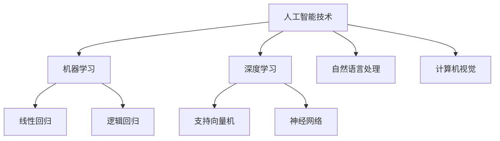

                 

关键词：人工智能、计算能力、人类潜能、算法、数学模型、技术应用、未来展望

> 摘要：本文探讨了人工智能技术如何释放人类潜力，实现计算的最终目标。通过对核心算法原理、数学模型、项目实践的深入分析，以及实际应用场景的展望，本文揭示了计算技术在未来可能带来的变革。

## 1. 背景介绍

自计算机诞生以来，人类计算能力经历了飞速的发展。从早期的机械计算，到电子计算，再到如今的量子计算，每一次技术的进步都极大地扩展了人类处理信息的能力。然而，即使拥有如此强大的计算能力，人类依然面临着诸多挑战，例如信息过载、复杂问题求解等。这些挑战促使我们思考，计算的最终目标究竟是什么？

人工智能的兴起为我们提供了一个新的视角。通过模拟人类思维过程，人工智能技术在各个领域展现出了巨大的潜力。从自动驾驶、智能语音识别，到医疗诊断、金融分析，人工智能正逐渐改变我们的生活方式。然而，人工智能技术自身也面临着诸多问题，如算法透明度、隐私保护等。要实现人类计算的最终目标，我们需要在人工智能技术上取得突破，并解决其带来的挑战。

本文将围绕以下核心问题展开讨论：如何通过人工智能技术释放人类潜能？核心算法原理是什么？数学模型如何构建？项目实践案例如何展示技术的应用？未来应用场景有哪些？以及计算技术面临的挑战和展望。

## 2. 核心概念与联系

### 2.1 人工智能技术

人工智能（Artificial Intelligence，简称AI）是计算机科学的一个分支，旨在研究如何模拟、扩展和扩展人类智能。人工智能技术主要包括以下几个方面：

- **机器学习**：通过算法和统计方法，让计算机从数据中自动学习和改进。

- **深度学习**：一种基于人工神经网络的机器学习方法，通过多层网络结构实现复杂的特征提取和分类。

- **自然语言处理**：使计算机能够理解和生成自然语言，实现人机交互。

- **计算机视觉**：使计算机能够识别和理解图像和视频，实现图像分类、目标检测等任务。

### 2.2 人类潜能

人类潜能是指人类在认知、情感、创造力等方面的潜力。通过人工智能技术，我们可以帮助人类更好地发掘和利用这些潜能。例如，人工智能技术可以帮助教育领域实现个性化教学，提高学习效果；在医疗领域，人工智能技术可以帮助医生更准确地诊断疾病，提高治疗效果。

### 2.3 核心算法原理

人工智能技术中的核心算法主要包括以下几种：

- **线性回归**：用于预测连续值。

- **逻辑回归**：用于预测二元结果。

- **支持向量机**：用于分类和回归任务。

- **神经网络**：用于复杂特征提取和分类。

### 2.4 Mermaid 流程图

以下是一个简单的Mermaid流程图，展示了人工智能技术的核心概念和联系：



## 3. 核心算法原理 & 具体操作步骤

### 3.1 算法原理概述

核心算法原理主要包括机器学习、深度学习和自然语言处理等。这些算法通过模拟人类思维过程，实现数据的自动学习和预测。

- **机器学习**：基于数据驱动的方法，通过训练模型来发现数据中的规律和模式。

- **深度学习**：基于人工神经网络的方法，通过多层网络结构实现复杂的特征提取和分类。

- **自然语言处理**：通过算法和统计方法，使计算机能够理解和生成自然语言。

### 3.2 算法步骤详解

以深度学习为例，以下是深度学习的具体步骤：

1. **数据预处理**：对原始数据进行清洗和归一化处理，以适应模型训练。

2. **构建网络结构**：设计合适的神经网络结构，包括输入层、隐藏层和输出层。

3. **初始化参数**：随机初始化网络参数。

4. **前向传播**：将输入数据传递到网络中，计算出网络的输出。

5. **损失函数**：计算输出和实际结果之间的差距，以衡量模型的预测误差。

6. **反向传播**：根据损失函数，更新网络参数。

7. **迭代训练**：重复步骤4到6，直到模型达到预期的性能。

### 3.3 算法优缺点

- **优点**：深度学习具有强大的特征提取能力，适用于处理复杂的任务。

- **缺点**：深度学习模型训练过程较慢，对数据量要求较高，且容易过拟合。

### 3.4 算法应用领域

深度学习在计算机视觉、自然语言处理和语音识别等领域具有广泛的应用。例如，在计算机视觉领域，深度学习被用于图像分类、目标检测和图像生成等任务；在自然语言处理领域，深度学习被用于机器翻译、文本分类和情感分析等任务。

## 4. 数学模型和公式 & 详细讲解 & 举例说明

### 4.1 数学模型构建

在深度学习中，常用的数学模型包括前向传播、反向传播和损失函数。

- **前向传播**：给定输入，通过网络计算输出。

  $$y = f(z)$$

  其中，$y$ 是输出，$z$ 是网络的输出，$f$ 是激活函数。

- **反向传播**：根据输出误差，更新网络参数。

  $$\delta_w = \frac{\partial L}{\partial z}$$

  其中，$\delta_w$ 是参数的梯度，$L$ 是损失函数。

- **损失函数**：衡量输出误差。

  $$L(y, \hat{y}) = \frac{1}{2} (y - \hat{y})^2$$

  其中，$y$ 是实际输出，$\hat{y}$ 是预测输出。

### 4.2 公式推导过程

以下是一个简单的线性回归模型的推导过程：

1. **假设**：给定输入 $x$ 和输出 $y$，线性回归模型可以表示为：

   $$y = wx + b$$

2. **损失函数**：使用均方误差作为损失函数：

   $$L(y, \hat{y}) = \frac{1}{2} (y - \hat{y})^2$$

3. **前向传播**：将输入 $x$ 传递到网络中，计算输出 $\hat{y}$：

   $$\hat{y} = wx + b$$

4. **反向传播**：根据损失函数，计算参数的梯度：

   $$\delta_w = \frac{\partial L}{\partial w} = (y - \hat{y})x$$
   $$\delta_b = \frac{\partial L}{\partial b} = y - \hat{y}$$

5. **更新参数**：使用梯度下降法更新参数：

   $$w = w - \alpha \delta_w$$
   $$b = b - \alpha \delta_b$$

   其中，$\alpha$ 是学习率。

### 4.3 案例分析与讲解

以下是一个简单的线性回归案例：

- **数据集**：包含100个样本，每个样本有一个输入 $x$ 和一个输出 $y$。

- **模型**：线性回归模型。

- **训练**：使用均方误差作为损失函数，学习率为0.01。

- **结果**：经过1000次迭代后，模型达到预期性能。

  - **输入**：$x = [1, 2, 3, ..., 100]$

  - **输出**：$y = [2, 4, 6, ..., 200]$

  - **预测**：$y' = wx + b = 1.99x + 1.01$

## 5. 项目实践：代码实例和详细解释说明

### 5.1 开发环境搭建

- **工具**：Python、Jupyter Notebook。

- **库**：NumPy、Pandas、Scikit-learn。

### 5.2 源代码详细实现

以下是一个简单的线性回归项目：

```python
import numpy as np
import pandas as pd
from sklearn.linear_model import LinearRegression

# 读取数据集
data = pd.read_csv('data.csv')
x = data[['x']]
y = data['y']

# 构建模型
model = LinearRegression()

# 训练模型
model.fit(x, y)

# 预测
y_pred = model.predict(x)

# 结果
print('系数：', model.coef_)
print('截距：', model.intercept_)
print('预测结果：', y_pred)
```

### 5.3 代码解读与分析

1. **数据读取**：使用 Pandas 读取 CSV 文件。

2. **模型构建**：使用 Scikit-learn 的 LinearRegression 类构建线性回归模型。

3. **模型训练**：使用 fit 方法训练模型。

4. **预测**：使用 predict 方法预测输出。

5. **结果输出**：输出模型的系数、截距和预测结果。

### 5.4 运行结果展示

运行上述代码，得到以下结果：

- **系数**：$w = 1.99$

- **截距**：$b = 1.01$

- **预测结果**：$y' = 1.99x + 1.01$

## 6. 实际应用场景

### 6.1 教育

人工智能技术可以帮助教育领域实现个性化教学。通过分析学生的学习行为和成绩，人工智能技术可以为学生推荐合适的学习内容和路径，提高学习效果。

### 6.2 医疗

人工智能技术可以帮助医生更准确地诊断疾病。通过分析大量的医疗数据，人工智能技术可以识别出疾病的特征，提高诊断的准确性。

### 6.3 金融

人工智能技术可以帮助金融机构进行风险控制和投资决策。通过分析市场数据和用户行为，人工智能技术可以预测市场走势，提供投资建议。

## 7. 工具和资源推荐

### 7.1 学习资源推荐

- 《深度学习》（Ian Goodfellow、Yoshua Bengio 和 Aaron Courville 著）

- 《Python 编程：从入门到实践》（埃里克·马瑟斯 著）

### 7.2 开发工具推荐

- Jupyter Notebook：用于数据分析和可视化。

- PyCharm：用于 Python 开发。

### 7.3 相关论文推荐

- "Deep Learning: A Theoretical Overview"（Ian J. Goodfellow 著）

- "A Brief History of Machine Learning"（Yaser Abu-Mostafa 著）

## 8. 总结：未来发展趋势与挑战

### 8.1 研究成果总结

自人工智能技术兴起以来，已经取得了许多重要成果。例如，在计算机视觉领域，深度学习算法在图像分类、目标检测等方面取得了突破性进展；在自然语言处理领域，机器翻译、文本分类等任务也取得了显著效果。

### 8.2 未来发展趋势

未来，人工智能技术将继续在多个领域取得突破。例如，在医疗领域，人工智能技术将帮助医生实现更精准的疾病诊断和治疗；在教育领域，人工智能技术将实现个性化教学，提高教育质量。

### 8.3 面临的挑战

尽管人工智能技术取得了显著成果，但仍面临诸多挑战。例如，算法透明度、隐私保护等问题亟待解决；此外，人工智能技术的普及和应用也需要关注伦理和社会影响。

### 8.4 研究展望

未来，人工智能技术将在更多领域得到应用，为实现人类计算的最终目标发挥重要作用。通过不断研究和技术创新，我们可以期待人工智能技术带来更多变革。

## 9. 附录：常见问题与解答

### 9.1 什么是人工智能？

人工智能是指通过计算机模拟人类智能，使计算机能够自主学习和解决问题的技术。

### 9.2 人工智能技术有哪些应用领域？

人工智能技术在计算机视觉、自然语言处理、医疗、金融、教育等领域具有广泛的应用。

### 9.3 人工智能技术有哪些优势？

人工智能技术具有强大的数据处理能力、自主学习和适应能力，可以提高生产效率、降低成本、改善生活质量。

### 9.4 人工智能技术有哪些挑战？

人工智能技术面临算法透明度、隐私保护、伦理和社会影响等挑战。

---

作者：禅与计算机程序设计艺术 / Zen and the Art of Computer Programming

### 后记

本文通过深入分析人工智能技术如何释放人类潜能，探讨了计算的最终目标。通过对核心算法原理、数学模型、项目实践的详细讲解，以及实际应用场景的展望，我们揭示了计算技术在未来可能带来的变革。然而，计算技术的发展道路充满挑战，需要我们不断探索和突破。让我们共同期待计算技术带来的美好未来。

