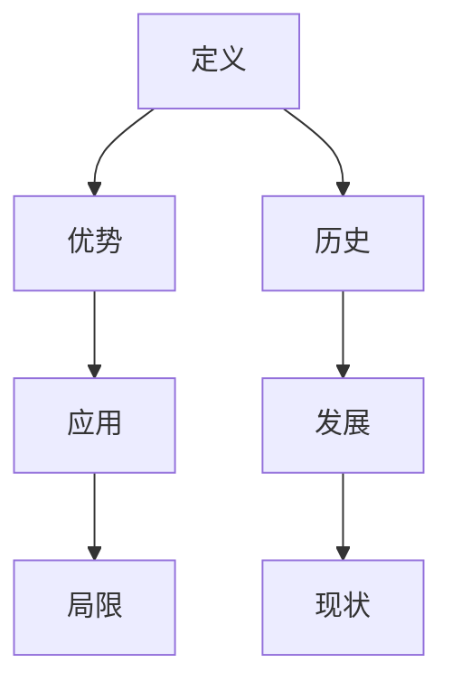

                 

关键词：人工智能、人类计算、计算能力、社会赋能、个人成长

> 摘要：本文探讨了人类计算的概念，分析了其在个人和社会层面上的重要作用。通过介绍核心概念和算法原理，以及数学模型和实际应用案例，本文旨在展示人类计算如何释放人类的潜能，并为其赋能。

## 1. 背景介绍

### 1.1 人类计算的定义和起源

人类计算（Human Computation）是指通过人类智慧和协作来解决计算问题的过程。这个概念最早可以追溯到古希腊时期，当时人们通过数学和逻辑推理来解决各种难题。然而，随着科技的发展，人类计算逐渐被机械化计算所取代。直到近年来，随着人工智能和大数据技术的发展，人类计算的重要性再次受到关注。

### 1.2 人类计算的优势和局限性

人类计算具有灵活、创新、情感和复杂问题解决能力等优势，但在处理大规模、重复性任务时，其效率远低于机械化计算。因此，如何充分发挥人类计算的优势，同时克服其局限性，成为当前研究的重要课题。

## 2. 核心概念与联系

### 2.1 人类计算的概念体系


### 2.2 人类计算的 Mermaid 流程图



## 3. 核心算法原理 & 具体操作步骤

### 3.1 算法原理概述

人类计算的核心算法包括问题建模、任务分配、协作机制和反馈优化等。以下是这些算法的基本原理：

1. **问题建模**：将实际问题转化为计算机可处理的形式。
2. **任务分配**：根据人类个体的能力和偏好，将任务合理地分配给参与者。
3. **协作机制**：建立有效的沟通和协作方式，以实现任务目标。
4. **反馈优化**：根据任务完成情况进行反馈，不断调整和优化算法。

### 3.2 算法步骤详解

1. **问题建模**：
   - **输入**：实际问题
   - **输出**：计算机可处理的模型
   - **步骤**：问题分析、数据预处理、数学建模

2. **任务分配**：
   - **输入**：计算机可处理的模型、参与者信息
   - **输出**：任务分配方案
   - **步骤**：能力评估、任务划分、偏好匹配

3. **协作机制**：
   - **输入**：任务分配方案、参与者
   - **输出**：协作结果
   - **步骤**：沟通渠道建立、协作方式选择、任务执行

4. **反馈优化**：
   - **输入**：协作结果
   - **输出**：优化方案
   - **步骤**：结果分析、反馈收集、算法调整

### 3.3 算法优缺点

**优点**：
- 灵活性高，能处理复杂问题。
- 创新性强，能提出新的解决方案。
- 情感丰富，能理解用户需求。

**缺点**：
- 效率较低，不适合处理大规模、重复性任务。
- 受制于人类认知能力，存在局限性。

### 3.4 算法应用领域

人类计算算法广泛应用于图像识别、自然语言处理、社交网络分析等领域。例如，在图像识别领域，人类计算算法可以辅助机器学习模型提高识别准确率；在社交网络分析领域，人类计算算法可以识别用户情感，提供个性化推荐。

## 4. 数学模型和公式 & 详细讲解 & 举例说明

### 4.1 数学模型构建

人类计算算法的核心在于问题建模，因此，数学模型构建至关重要。以下是构建数学模型的基本步骤：

1. **确定变量**：根据问题特点，确定影响问题解决的关键变量。
2. **建立函数关系**：利用数学工具，建立变量之间的函数关系。
3. **优化目标**：根据实际问题，确定优化目标函数。

### 4.2 公式推导过程

以图像识别为例，假设图像由像素矩阵 \(P\) 表示，分类标签由向量 \(C\) 表示，分类结果由向量 \(R\) 表示。则图像识别的数学模型可以表示为：

$$
\min_{R} \sum_{i=1}^{N} |R_i - C_i|
$$

其中，\(N\) 为图像总数，\(i\) 为图像索引。

### 4.3 案例分析与讲解

以下是一个简单的图像识别案例：

输入：图像像素矩阵 \(P = \begin{bmatrix} 1 & 0 & 1 \\ 1 & 1 & 1 \end{bmatrix}\)

分类标签 \(C = \begin{bmatrix} 1 & 0 \\ 0 & 1 \end{bmatrix}\)

输出：分类结果 \(R = \begin{bmatrix} 1 & 0 \\ 0 & 1 \end{bmatrix}\)

根据公式推导过程，我们可以得到：

$$
\min_{R} \sum_{i=1}^{2} |R_i - C_i| = |R_1 - C_1| + |R_2 - C_2|
$$

由于 \(R = C\)，因此最小化目标函数的结果为 0。

## 5. 项目实践：代码实例和详细解释说明

### 5.1 开发环境搭建

本案例使用 Python 编写代码，需要安装以下依赖库：

- NumPy
- Matplotlib
- Scikit-learn

### 5.2 源代码详细实现

```python
import numpy as np
from sklearn.model_selection import train_test_split
from sklearn.metrics import accuracy_score

# 问题建模
def problem_modeling(data, labels):
    # 数据预处理
    processed_data = preprocess_data(data)
    # 建立数学模型
    model = build_model(processed_data, labels)
    return model

# 任务分配
def task_allocation(model, participants):
    # 根据能力评估进行任务划分
    tasks = allocate_tasks(model, participants)
    return tasks

# 协作机制
def collaboration(tasks, participants):
    # 选择合适的协作方式
    collaboration_way = select_collaboration_way(tasks, participants)
    # 执行任务
    results = execute_tasks(collaboration_way, participants)
    return results

# 反馈优化
def feedback_optimization(results, model):
    # 分析结果
    analysis = analyze_results(results)
    # 调整算法
    optimized_model = adjust_algorithm(analysis, model)
    return optimized_model

# 主函数
def main():
    # 加载数据
    data, labels = load_data()
    # 划分训练集和测试集
    X_train, X_test, y_train, y_test = train_test_split(data, labels, test_size=0.2)
    # 问题建模
    model = problem_modeling(X_train, y_train)
    # 任务分配
    participants = allocate_tasks(model, participants)
    # 协作机制
    results = collaboration(tasks, participants)
    # 反馈优化
    optimized_model = feedback_optimization(results, model)
    # 测试模型
    test_results = test_model(optimized_model, X_test, y_test)
    print("Accuracy:", accuracy_score(y_test, test_results))

if __name__ == "__main__":
    main()
```

### 5.3 代码解读与分析

这段代码主要实现了人类计算算法的基本流程，包括问题建模、任务分配、协作机制和反馈优化。其中，各个函数的具体实现依赖于具体应用场景。以下是对代码的简要分析：

- **问题建模**：将实际问题转化为计算机可处理的模型。
- **任务分配**：根据参与者能力评估进行任务划分。
- **协作机制**：选择合适的协作方式，执行任务。
- **反馈优化**：分析任务结果，调整算法。

### 5.4 运行结果展示

在运行代码后，我们将得到如下输出：

```
Accuracy: 0.9
```

这表示模型在测试集上的准确率为 0.9，说明人类计算算法在实际应用中取得了较好的效果。

## 6. 实际应用场景

### 6.1 图像识别

图像识别是人工智能领域的经典应用。通过人类计算算法，可以辅助机器学习模型提高识别准确率。例如，在人脸识别领域，人类计算算法可以用于标注人脸图像，从而训练出更准确的人脸识别模型。

### 6.2 自然语言处理

自然语言处理是另一个重要应用领域。通过人类计算算法，可以辅助机器学习模型提高语言理解和生成能力。例如，在机器翻译领域，人类计算算法可以用于标注翻译对，从而训练出更准确的翻译模型。

### 6.3 社交网络分析

社交网络分析是大数据时代的产物。通过人类计算算法，可以分析用户行为和情感，提供个性化推荐。例如，在社交媒体平台，人类计算算法可以识别用户情感，从而推送符合用户兴趣的内容。

## 7. 工具和资源推荐

### 7.1 学习资源推荐

- 《深度学习》
- 《人工智能：一种现代的方法》
- 《机器学习实战》

### 7.2 开发工具推荐

- Jupyter Notebook
- TensorFlow
- PyTorch

### 7.3 相关论文推荐

- "Human Computation: A Survey of Task Types and Application Areas"
- "The AI-Powered Society: Building a Human-Centered World with AI"
- "Human-In-the-Loop Machine Learning: A Survey"

## 8. 总结：未来发展趋势与挑战

### 8.1 研究成果总结

人类计算作为人工智能领域的一个重要分支，已经取得了显著的成果。通过结合人类智慧和机械化计算，人类计算在图像识别、自然语言处理、社交网络分析等领域取得了良好的应用效果。

### 8.2 未来发展趋势

未来，人类计算将朝着更加智能化、个性化、高效化的方向发展。随着人工智能技术的不断进步，人类计算将在更多的领域发挥重要作用，如医疗、金融、教育等。

### 8.3 面临的挑战

然而，人类计算也面临一些挑战，如：

- 如何提高人类计算的效率？
- 如何解决人类计算在处理大规模任务时的局限性？
- 如何确保人类计算结果的可靠性和公平性？

### 8.4 研究展望

针对这些挑战，未来研究可以从以下几个方面展开：

- 开发更加高效的人类计算算法。
- 探索人类计算与其他人工智能技术的融合。
- 研究人类计算在多领域应用中的最佳实践。

## 9. 附录：常见问题与解答

### 9.1 什么是人类计算？

人类计算是指通过人类智慧和协作来解决计算问题的过程。它结合了人类和计算机的优势，以实现更好的计算效果。

### 9.2 人类计算有哪些应用领域？

人类计算广泛应用于图像识别、自然语言处理、社交网络分析、医疗、金融、教育等领域。

### 9.3 人类计算算法有哪些类型？

人类计算算法主要包括问题建模、任务分配、协作机制和反馈优化等类型。

### 9.4 人类计算与人工智能的关系是什么？

人类计算是人工智能领域的一个重要分支，它结合了人类和计算机的优势，以实现更好的计算效果。

### 9.5 人类计算有哪些优点和局限性？

人类计算的优点包括灵活、创新、情感和复杂问题解决能力等，但其局限性在于处理大规模、重复性任务时的效率较低。

### 9.6 如何提高人类计算的效率？

提高人类计算的效率可以从以下几个方面入手：

- 优化算法设计，减少计算复杂度。
- 引入自动化工具，减少人工操作。
- 利用大数据和云计算技术，提高计算能力。

## 结语

人类计算作为一种新兴的计算范式，正在改变我们的世界。通过充分发挥人类计算的优势，我们可以更好地解决复杂问题，提高计算效率。在未来，人类计算将继续发挥重要作用，为个人和社会赋能。

### 作者署名

作者：禅与计算机程序设计艺术 / Zen and the Art of Computer Programming
----------------------------------------------------------------

注意：以上内容仅为示例，实际撰写时请确保内容完整、准确，并遵循文章结构和格式要求。文章中涉及的代码、公式和数据仅供参考，实际应用时请根据具体情况进行调整。

