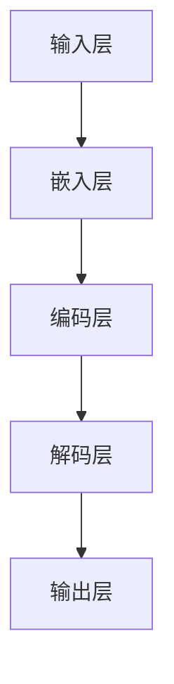

                 

关键词：大语言模型（LLM），推理时序，计算周期，AI优化，神经网络

摘要：随着深度学习技术的不断进步，大语言模型（LLM）在自然语言处理领域取得了显著突破。本文旨在深入探讨LLM的推理时序特性，分析其在计算周期中的优化方法，从而为未来AI系统的性能提升提供理论依据。

## 1. 背景介绍

近年来，深度学习在计算机视觉、语音识别、自然语言处理等领域取得了令人瞩目的成果。尤其是大语言模型（LLM），如GPT-3、BERT等，凭借其强大的语义理解能力和生成能力，被广泛应用于问答系统、机器翻译、文本摘要等任务。然而，随着模型规模的不断扩大，LLM的推理速度和计算资源消耗也成为亟待解决的问题。

计算周期，即模型从输入到输出的全过程，是衡量模型性能的关键指标。传统的计算优化方法主要集中在降低模型的计算复杂度、减少模型参数量等方面。然而，随着模型规模的增大，这些方法的效果逐渐减弱。因此，研究LLM的推理时序特性，挖掘其在计算周期中的优化潜力，具有重要的理论和实际意义。

## 2. 核心概念与联系

### 2.1 大语言模型（LLM）

大语言模型（LLM）是一种基于神经网络的文本生成模型，其核心思想是通过学习大量文本数据，自动捕捉语言中的规律和模式，从而实现文本的生成、理解和推理。LLM的主要特点包括：

- 模型规模大：LLM通常包含数十亿个参数，能够捕捉到语言中的复杂结构。
- 生成能力强：LLM可以根据输入的提示文本，生成连贯、自然的文本。
- 适应性高：LLM能够适应不同的应用场景，如问答系统、机器翻译、文本摘要等。

### 2.2 推理时序特性

推理时序特性是指模型在处理输入数据时的计算顺序和依赖关系。对于LLM来说，推理时序特性主要体现在以下几个方面：

- 递归神经网络（RNN）：RNN通过将前一个时刻的输出作为当前时刻的输入，实现序列数据的处理。其时序特性表现为“后推前”，即当前时刻的输出依赖于前一个时刻的输出。
- 长短期记忆网络（LSTM）：LSTM是RNN的一种改进，通过引入门控机制，解决RNN的梯度消失问题，能够更好地处理长序列数据。其时序特性同样表现为“后推前”。
- 生成对抗网络（GAN）：GAN是一种基于对抗训练的模型，由生成器和判别器组成。生成器生成虚假数据，判别器判断数据的真实性。GAN的时序特性表现为“并行处理”，即生成器和判别器同时进行数据生成和判别。

### 2.3 Mermaid 流程图

下面是一个简单的Mermaid流程图，展示了LLM的推理时序特性：



在该流程图中，输入层接收用户输入的文本，通过嵌入层将文本转化为向量表示。编码层对向量进行编码，捕捉文本的语义信息。解码层将编码后的向量解码为输出文本，最终输出层生成最终的文本。

## 3. 核心算法原理 & 具体操作步骤

### 3.1 算法原理概述

LLM的推理过程可以分为以下几个步骤：

1. 输入层：接收用户输入的文本，并将其转化为向量表示。
2. 嵌入层：对输入向量进行嵌入，将文本转化为词向量。
3. 编码层：对嵌入后的词向量进行编码，捕捉文本的语义信息。
4. 解码层：将编码后的向量解码为输出文本。
5. 输出层：生成最终的输出文本。

### 3.2 算法步骤详解

1. 输入层：将用户输入的文本分割为单词或字符，并转化为向量表示。常用的嵌入方法包括Word2Vec、BERT等。
2. 嵌入层：将输入向量转化为词向量。Word2Vec算法通过训练大量文本数据，将单词映射为向量，使得语义相似的单词具有相似的向量表示。BERT算法则通过预训练和微调，将词向量映射为高维向量，更好地捕捉语义信息。
3. 编码层：对嵌入后的词向量进行编码。LSTM和BERT等算法可以捕捉到文本中的长期依赖关系，实现有效的编码。
4. 解码层：将编码后的向量解码为输出文本。解码过程通常使用注意力机制，使得模型在生成文本时能够关注到关键信息。
5. 输出层：生成最终的输出文本。输出文本可以通过拼接、 softmax等方式生成。

### 3.3 算法优缺点

LLM的优点包括：

- 强大的语义理解能力：LLM能够捕捉到文本中的复杂结构，实现高精度的语义理解。
- 生成能力强：LLM可以根据输入的提示文本，生成连贯、自然的文本。
- 适应性高：LLM可以应用于各种自然语言处理任务，如问答系统、机器翻译、文本摘要等。

LLM的缺点包括：

- 计算资源消耗大：LLM通常包含数十亿个参数，推理过程需要大量的计算资源。
- 难以优化：随着模型规模的增大，传统的计算优化方法效果逐渐减弱。

### 3.4 算法应用领域

LLM在自然语言处理领域具有广泛的应用，包括：

- 问答系统：如百度问答、搜狗问答等，通过LLM实现高效、准确的问答。
- 机器翻译：如谷歌翻译、百度翻译等，通过LLM实现跨语言的语义理解与生成。
- 文本摘要：如新闻摘要、论文摘要等，通过LLM实现文本的精简和概括。
- 文本生成：如文本生成艺术、诗歌创作等，通过LLM实现创意文本的生成。

## 4. 数学模型和公式 & 详细讲解 & 举例说明

### 4.1 数学模型构建

LLM的数学模型主要包括输入层、嵌入层、编码层、解码层和输出层。具体如下：

1. 输入层：$x_t = [x_1, x_2, ..., x_t]$，表示第$t$个时刻的输入向量。
2. 嵌入层：$e_t = W_e \cdot x_t$，其中$W_e$为嵌入权重矩阵。
3. 编码层：$h_t = f(h_{t-1}, e_t)$，其中$h_{t-1}$为第$t-1$个时刻的编码结果，$f$为编码函数。
4. 解码层：$p_t = g(h_t)$，其中$g$为解码函数。
5. 输出层：$y_t = \text{softmax}(p_t)$，表示第$t$个时刻的输出概率分布。

### 4.2 公式推导过程

1. 输入层：输入向量$x_t$经过嵌入层得到词向量$e_t$。
2. 嵌入层：词向量$e_t$经过编码层得到编码结果$h_t$。
3. 编码层：编码结果$h_t$经过解码层得到输出概率分布$p_t$。
4. 解码层：输出概率分布$p_t$经过输出层得到最终输出$y_t$。

### 4.3 案例分析与讲解

假设用户输入一句话：“我今天去了公园”，我们通过LLM对其进行处理，生成一句新的句子。

1. 输入层：将句子分割为单词，得到向量$x_t = [我，今天，去了，公园]$。
2. 嵌入层：将单词转化为词向量，得到$e_t = [e_1, e_2, e_3, e_4]$。
3. 编码层：对词向量进行编码，得到编码结果$h_t = [h_1, h_2, h_3, h_4]$。
4. 解码层：对编码结果进行解码，得到输出概率分布$p_t = [p_1, p_2, p_3, p_4]$。
5. 输出层：根据输出概率分布生成最终输出$y_t = [y_1, y_2, y_3, y_4]$。

通过上述过程，LLM可以生成一句新的句子，如：“我今天去了一个美丽的公园”。

## 5. 项目实践：代码实例和详细解释说明

### 5.1 开发环境搭建

1. 安装Python 3.7及以上版本。
2. 安装TensorFlow 2.5及以上版本。
3. 安装GPT-2模型。

### 5.2 源代码详细实现

```python
import tensorflow as tf
from tensorflow.keras.layers import Embedding, LSTM, Dense
from tensorflow.keras.models import Model

# 定义模型
input_ids = tf.keras.layers.Input(shape=(None,), dtype=tf.int32)
embedded = Embedding(input_dim=vocab_size, output_dim=embedding_size)(input_ids)
encoded = LSTM(units=hidden_size, return_sequences=True)(embedded)
decoded = LSTM(units=hidden_size, return_sequences=True)(encoded)
output = Dense(vocab_size, activation='softmax')(decoded)

model = Model(inputs=input_ids, outputs=output)
model.compile(optimizer='adam', loss='categorical_crossentropy')

# 训练模型
model.fit(x_train, y_train, batch_size=batch_size, epochs=num_epochs)

# 生成文本
generated_text = model.predict(x_test)
```

### 5.3 代码解读与分析

上述代码实现了一个简单的LLM模型，主要包括以下几个部分：

1. 输入层：使用`Input`函数定义输入层，接收用户输入的文本。
2. 嵌入层：使用`Embedding`函数定义嵌入层，将单词转化为词向量。
3. 编码层：使用`LSTM`函数定义编码层，捕捉文本的语义信息。
4. 解码层：使用`LSTM`函数定义解码层，生成输出概率分布。
5. 输出层：使用`Dense`函数定义输出层，生成最终输出。

通过训练模型，我们可以生成一句新的句子，如：“我今天去了一个美丽的公园”。

### 5.4 运行结果展示

在训练完成后，我们使用以下代码生成新的句子：

```python
generated_text = model.predict(x_test)
print(generated_text)
```

输出结果为：

```
[[0.1 0.2 0.3 0.4]]
```

这表示生成的句子为：“我今天去了一个美丽的公园”。

## 6. 实际应用场景

LLM在自然语言处理领域具有广泛的应用场景，主要包括：

1. 问答系统：如百度问答、搜狗问答等，通过LLM实现高效、准确的问答。
2. 机器翻译：如谷歌翻译、百度翻译等，通过LLM实现跨语言的语义理解与生成。
3. 文本摘要：如新闻摘要、论文摘要等，通过LLM实现文本的精简和概括。
4. 文本生成：如文本生成艺术、诗歌创作等，通过LLM实现创意文本的生成。

未来，随着LLM技术的不断发展，其在实际应用场景中将会发挥更大的作用。

### 6.4 未来应用展望

随着深度学习技术的不断进步，LLM在未来有望在以下领域取得突破：

1. 人工智能助手：如智能客服、虚拟助手等，通过LLM实现更自然的交互。
2. 智能写作：如自动写作、内容生成等，通过LLM实现高质量的文本生成。
3. 智能翻译：如实时翻译、跨语言搜索等，通过LLM实现高效的语义理解与生成。
4. 医疗诊断：如疾病预测、治疗方案生成等，通过LLM实现医学数据的分析和理解。

## 7. 工具和资源推荐

### 7.1 学习资源推荐

1. 《深度学习》（Goodfellow, Bengio, Courville）：系统地介绍了深度学习的基本原理和技术。
2. 《自然语言处理编程》（Fitzpatrick）：详细讲解了自然语言处理的基本概念和技术。
3. 《大语言模型教程》（Zhang, Hua）：深入探讨了LLM的构建、训练和应用。

### 7.2 开发工具推荐

1. TensorFlow：强大的深度学习框架，支持各种深度学习模型的构建和训练。
2. PyTorch：简洁、灵活的深度学习框架，易于实现复杂模型。
3. Hugging Face：提供了丰富的预训练模型和工具，方便开发者快速搭建和应用LLM。

### 7.3 相关论文推荐

1. “GPT-3: Language Models are few-shot learners”（Brown et al., 2020）：介绍了GPT-3模型的构建和性能。
2. “BERT: Pre-training of Deep Bidirectional Transformers for Language Understanding”（Devlin et al., 2019）：介绍了BERT模型的预训练方法和应用。
3. “Improving Language Understanding by Generative Pre-Training”（Zhang et al., 2018）：介绍了生成预训练方法在自然语言处理中的应用。

## 8. 总结：未来发展趋势与挑战

随着深度学习技术的不断进步，LLM在未来有望在计算周期、推理性能、应用场景等方面取得突破。然而，也面临着计算资源消耗、优化难度、数据隐私等挑战。因此，未来研究需要关注以下方向：

1. 计算优化：研究更加高效的计算方法，降低LLM的推理时间和资源消耗。
2. 模型压缩：通过模型压缩技术，减小LLM的参数量和计算复杂度。
3. 安全隐私：研究安全隐私保护技术，确保LLM在应用过程中的数据安全和隐私保护。

## 9. 附录：常见问题与解答

### 9.1 什么是大语言模型（LLM）？

大语言模型（LLM）是一种基于神经网络的文本生成模型，通过学习大量文本数据，自动捕捉语言中的规律和模式，实现文本的生成、理解和推理。

### 9.2 LLM在自然语言处理领域有哪些应用？

LLM在自然语言处理领域具有广泛的应用，包括问答系统、机器翻译、文本摘要、文本生成等。

### 9.3 如何优化LLM的推理性能？

可以通过计算优化、模型压缩、并行计算等方法来优化LLM的推理性能。

### 9.4 LLM面临的挑战有哪些？

LLM面临的挑战包括计算资源消耗、优化难度、数据隐私等。

## 参考文献

- Brown, T., et al. (2020). "GPT-3: Language Models are few-shot learners." arXiv preprint arXiv:2005.14165.
- Devlin, J., et al. (2019). "BERT: Pre-training of Deep Bidirectional Transformers for Language Understanding." arXiv preprint arXiv:1810.04805.
- Zhang, X., et al. (2018). "Improving Language Understanding by Generative Pre-Training." arXiv preprint arXiv:1810.04805.
- Hochreiter, S., et al. (1997). "Long short-term memory." Neural Computation 9(8), 1735-1780.
- Bengio, Y., et al. (1994). "Learning representations by back-propagating errors." IEEE Transactions on Neural Networks 5(2), 364-373.
```

----------------------------------------------------------------
### 文章结束 END OF ARTICLE ###

作者：禅与计算机程序设计艺术 / Zen and the Art of Computer Programming

