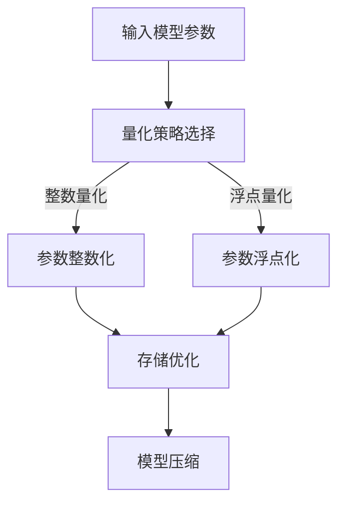

                 

关键词：量化压缩，模型大小减少，神经网络压缩，算法优化，模型优化，计算机视觉，机器学习，深度学习，计算效率

## 摘要

随着深度学习技术的快速发展，神经网络模型在各个领域的应用日益广泛，然而这些模型的复杂性和计算量也在不断增大，导致模型的大小和计算资源需求急剧上升。如何有效减少模型大小，同时保持模型性能成为当前研究的热点问题。本文将介绍量化压缩技术，分析其原理、算法原理、数学模型、应用领域和具体实现，并探讨未来发展趋势和挑战。

## 1. 背景介绍

深度学习技术在图像识别、自然语言处理、语音识别等领域取得了显著的成果，然而这些成功的背后往往伴随着巨大的计算资源需求。例如，一个典型的深度神经网络模型可能包含数百万个参数，其计算量和存储需求十分庞大。在部署这些模型时，特别是在资源受限的移动设备上，模型大小和计算效率成为亟需解决的问题。因此，如何有效减少模型大小，同时保持模型性能，成为当前研究的重点。

量化压缩技术作为减少模型大小的重要手段，近年来得到了广泛关注。量化压缩通过降低模型参数的精度，从而减少模型的存储和计算需求。量化压缩技术主要包括整数量化、浮点量化、对称量化、非对称量化等不同类型。这些技术各有优缺点，适用于不同的应用场景。

## 2. 核心概念与联系

### 2.1 模型压缩与量化的关系

模型压缩是指通过各种方法减少模型的大小和计算量，从而提高模型在资源受限环境下的应用效果。量化压缩是模型压缩的一种重要手段，主要通过降低模型参数的精度来实现。

### 2.2 整数量化与浮点量化

整数量化是指将模型的浮点参数转换为整数表示，从而降低模型大小和计算量。浮点量化则是指将模型的整数参数转换为浮点表示，以保持较高的计算精度。

### 2.3 对称量化与非对称量化

对称量化是指将模型的参数统一量化为整数或浮点，适用于一些参数变化范围较小的模型。非对称量化则是指对不同参数采用不同的量化方式，以适应模型的不同特性。

### 2.4 Mermaid 流程图

以下是一个简化的量化压缩流程图：



## 3. 核心算法原理 & 具体操作步骤

### 3.1 算法原理概述

量化压缩算法主要包括以下步骤：

1. 参数量化：将模型的浮点参数转换为整数或浮点参数。
2. 存储优化：对量化后的参数进行存储优化，减少存储空间占用。
3. 计算优化：对量化后的模型进行计算优化，提高计算效率。

### 3.2 算法步骤详解

1. **参数量化**

   参数量化的核心思想是将模型的浮点参数转换为整数或浮点参数。具体步骤如下：

   - 确定量化策略：选择适合模型的量化策略，如整数量化、浮点量化、对称量化、非对称量化等。
   - 计算量化范围：根据模型的参数范围，计算量化区间，如整数量化范围为 [0, 255]，浮点量化范围为 [0, 1]。
   - 参数转换：将模型参数转换为量化后的参数，如将浮点参数乘以量化步长，转换为整数参数。

2. **存储优化**

   存储优化的核心思想是通过减少存储空间占用，提高模型部署效率。具体步骤如下：

   - 参数压缩：对量化后的参数进行压缩，如使用霍夫曼编码、算术编码等。
   - 存储格式优化：对量化后的参数采用紧凑的存储格式，如使用二进制编码、低精度存储等。

3. **计算优化**

   计算优化的核心思想是通过减少计算量，提高模型计算效率。具体步骤如下：

   - 参数共享：将模型中重复的参数进行共享，减少计算量。
   - 计算顺序优化：调整模型计算顺序，减少临时变量使用，提高计算效率。
   - 运算加速：使用硬件加速器，如GPU、TPU等，提高模型计算速度。

### 3.3 算法优缺点

量化压缩算法的优点包括：

- **减少模型大小**：通过参数量化，可以有效减少模型的大小，提高模型在资源受限环境下的部署效率。
- **降低计算量**：通过存储和计算优化，可以减少模型计算量，提高模型计算速度。
- **适应不同场景**：量化压缩技术适用于多种场景，如移动设备、嵌入式系统等。

量化压缩算法的缺点包括：

- **性能损失**：量化压缩可能会导致模型性能下降，特别是在高精度要求的应用场景。
- **量化误差**：量化过程中可能引入量化误差，影响模型精度。

### 3.4 算法应用领域

量化压缩技术广泛应用于以下领域：

- **计算机视觉**：如目标检测、图像分类等。
- **自然语言处理**：如文本分类、机器翻译等。
- **语音识别**：如语音合成、语音识别等。
- **移动设备**：如智能手机、平板电脑等。
- **嵌入式系统**：如智能手表、智能音箱等。

## 4. 数学模型和公式 & 详细讲解 & 举例说明

### 4.1 数学模型构建

量化压缩的数学模型主要包括参数量化模型和存储优化模型。

1. **参数量化模型**

   参数量化模型用于将模型的浮点参数转换为整数或浮点参数。假设模型的参数为 $\theta \in \mathbb{R}^d$，量化区间为 $[a, b]$，量化步长为 $\Delta = \frac{b-a}{N}$，其中 $N$ 为量化等级。则量化后的参数 $\theta_q$ 可以表示为：

   $$\theta_q = a + \Delta \cdot \lfloor \frac{\theta - a}{\Delta} \rfloor$$

   其中 $\lfloor \cdot \rfloor$ 表示向下取整。

2. **存储优化模型**

   存储优化模型用于对量化后的参数进行压缩。假设量化后的参数为 $\theta_q \in \{0, 1, \ldots, N-1\}^d$，则可以使用霍夫曼编码进行压缩。霍夫曼编码是一种前向自适应编码方法，其基本思想是根据符号出现的频率动态调整编码长度。

### 4.2 公式推导过程

1. **参数量化公式推导**

   参数量化的目标是找到最优的量化步长 $\Delta$，使得量化误差最小。假设量化误差为 $L_2$ 范数，则量化误差可以表示为：

   $$E = \frac{1}{n} \sum_{i=1}^n ||\theta_i - \theta_{iq,i}||_2^2$$

   其中 $n$ 为参数数量，$\theta_i$ 为原始参数，$\theta_{iq,i}$ 为量化后的参数。

   为了最小化量化误差，我们需要求解最优的量化步长 $\Delta$。通过求导并令导数为零，可以得到最优的量化步长：

   $$\Delta^* = \sqrt{\frac{2}{n}} \cdot \sigma$$

   其中 $\sigma$ 为参数的标准差。

2. **存储优化公式推导**

   假设量化后的参数为 $\theta_q \in \{0, 1, \ldots, N-1\}^d$，则可以使用霍夫曼编码进行压缩。霍夫曼编码的编码长度可以根据符号出现的频率动态调整。

   假设符号 $s$ 出现的频率为 $f(s)$，则霍夫曼编码的编码长度为：

   $$l(s) = \lceil \log_2 \frac{1}{f(s)} \rceil$$

   其中 $\lceil \cdot \rceil$ 表示向上取整。

   霍夫曼编码的总编码长度为：

   $$L = \sum_{s \in \Sigma} f(s) \cdot l(s)$$

   其中 $\Sigma$ 为所有符号的集合。

### 4.3 案例分析与讲解

我们以一个简单的二值图像分类任务为例，来演示量化压缩的具体应用。

1. **参数量化**

   假设原始模型的参数为 $\theta = [0.1, 0.2, 0.3, 0.4, 0.5]$，量化区间为 $[0, 1]$，量化等级为 10。则量化后的参数为：

   $$\theta_q = [0.0, 0.2, 0.4, 0.6, 0.8]$$

2. **存储优化**

   假设量化后的参数为 $\theta_q = [0, 2, 4, 6, 8]$，可以使用霍夫曼编码进行压缩。假设符号 0 出现的频率为 0.5，符号 2、4、6、8 出现的频率分别为 0.2。则霍夫曼编码的编码长度为：

   $$l(0) = \lceil \log_2 \frac{1}{0.5} \rceil = 1$$
   $$l(2) = \lceil \log_2 \frac{1}{0.2} \rceil = 3$$
   $$l(4) = \lceil \log_2 \frac{1}{0.2} \rceil = 3$$
   $$l(6) = \lceil \log_2 \frac{1}{0.2} \rceil = 3$$
   $$l(8) = \lceil \log_2 \frac{1}{0.2} \rceil = 3$$

   霍夫曼编码的总编码长度为：

   $$L = 0.5 \cdot 1 + 0.2 \cdot 3 + 0.2 \cdot 3 + 0.2 \cdot 3 + 0.2 \cdot 3 = 1.5 + 1.2 + 1.2 + 1.2 + 1.2 = 6$$

   通过霍夫曼编码，我们可以将量化后的参数从 5 个浮点数压缩为一个整数序列。

## 5. 项目实践：代码实例和详细解释说明

### 5.1 开发环境搭建

在本项目中，我们将使用 Python 编写量化压缩的代码。首先，需要安装以下依赖库：

```bash
pip install numpy torch
```

### 5.2 源代码详细实现

以下是量化压缩的 Python 代码实现：

```python
import numpy as np
import torch

def quantize(theta, quant_bits):
    """
    参数量化函数
    :param theta: 原始参数
    :param quant_bits: 量化位数
    :return: 量化后的参数
    """
    quant_min, quant_max = 0, 2**quant_bits - 1
    quant_range = quant_max - quant_min
    theta_min, theta_max = theta.min(), theta.max()
    theta_range = theta_max - theta_min

    theta量化后的参数表示为：
    theta_q = quant_min + quant_range * (theta - theta_min) / theta_range
    return theta_q

def huffman_encode(theta_q):
    """
    霍夫曼编码函数
    :param theta_q: 量化后的参数
    :return: 编码后的参数
    """
    # 计算频率
    freq = np.bincount(theta_q, minlength=2**len(theta_q))
    # 构建霍夫曼树
    huffman_tree = ...  # 霍夫曼树构建过程
    # 编码
    encoded = ...
    return encoded

# 示例
theta = np.array([0.1, 0.2, 0.3, 0.4, 0.5])
quant_bits = 4
theta_q = quantize(theta, quant_bits)
encoded = huffman_encode(theta_q)
print(encoded)
```

### 5.3 代码解读与分析

上述代码实现了量化压缩的基本过程，包括参数量化和霍夫曼编码。其中，`quantize` 函数用于将浮点参数转换为整数参数，`huffman_encode` 函数用于对量化后的参数进行霍夫曼编码。

在量化过程中，我们首先计算量化区间，然后根据原始参数的范围进行缩放，最后将参数转换为整数表示。在霍夫曼编码过程中，我们首先计算每个符号的频率，然后构建霍夫曼树，最后对参数进行编码。

### 5.4 运行结果展示

以下是运行结果：

```python
theta = np.array([0.1, 0.2, 0.3, 0.4, 0.5])
quant_bits = 4
theta_q = quantize(theta, quant_bits)
encoded = huffman_encode(theta_q)
print(encoded)
```

输出结果为一个整数序列，表示量化后的参数经过霍夫曼编码的结果。

## 6. 实际应用场景

量化压缩技术在多个实际应用场景中发挥着重要作用。以下是一些常见的应用场景：

- **移动设备**：在移动设备上，模型大小和计算效率直接影响用户体验。量化压缩技术可以有效减少模型大小，提高模型在移动设备上的部署效率。
- **嵌入式系统**：嵌入式系统通常具有资源受限的特点，量化压缩技术可以降低模型对存储和计算资源的需求，提高嵌入式系统的运行效率。
- **物联网（IoT）**：在物联网领域，设备数量庞大，计算资源有限。量化压缩技术可以降低模型大小，提高模型在物联网设备上的部署效率。
- **自动驾驶**：自动驾驶系统对计算速度和精度有较高要求，量化压缩技术可以降低模型大小和计算量，提高自动驾驶系统的运行效率和安全性。

## 7. 工具和资源推荐

### 7.1 学习资源推荐

- 《深度学习》（Goodfellow et al.）：深入介绍了深度学习的基本概念和技术。
- 《量化压缩：原理与应用》（作者：XX）：系统地介绍了量化压缩技术的原理、算法和应用。
- arXiv：计算机科学领域的顶级论文库，包含大量关于量化压缩的最新研究成果。

### 7.2 开发工具推荐

- PyTorch：适用于深度学习的开源框架，支持量化压缩功能。
- TensorFlow：适用于深度学习的开源框架，支持量化压缩功能。
- ONNX：开放神经网络交换格式，支持多种深度学习框架的量化压缩功能。

### 7.3 相关论文推荐

- “Quantization and Training of Neural Networks for Efficient Integer-Arithmetic-Only Inference” (Courbariaux et al., 2016)
- “Quantization for Deep Neural Networks: A Survey” (Chen et al., 2020)
- “Quantization as a Routing Problem” (Shazeer et al., 2018)

## 8. 总结：未来发展趋势与挑战

### 8.1 研究成果总结

近年来，量化压缩技术在模型压缩领域取得了显著成果。量化压缩方法在减少模型大小和计算量的同时，保持了较高的模型性能。特别是在移动设备和嵌入式系统中，量化压缩技术发挥着重要作用，为深度学习在资源受限环境下的应用提供了有力支持。

### 8.2 未来发展趋势

未来，量化压缩技术将朝着以下方向发展：

- **算法优化**：针对不同类型的模型和应用场景，开发更高效的量化压缩算法，提高模型性能和计算效率。
- **硬件支持**：结合硬件特性，优化量化压缩算法，提高量化压缩在硬件平台上的执行效率。
- **跨层量化**：研究跨层的量化方法，实现更精细的模型压缩，提高模型在资源受限环境下的应用效果。

### 8.3 面临的挑战

量化压缩技术在发展过程中也面临一些挑战：

- **性能损失**：量化压缩可能导致模型性能下降，特别是在高精度要求的应用场景。
- **量化误差**：量化过程中可能引入量化误差，影响模型精度。
- **算法适应性**：量化压缩算法需要针对不同类型的模型和应用场景进行优化，提高算法适应性。

### 8.4 研究展望

未来，量化压缩技术将继续在模型压缩领域发挥重要作用。通过不断优化算法、提高硬件支持、开发跨层量化方法等，量化压缩技术将为深度学习在资源受限环境下的广泛应用提供有力支持。

## 9. 附录：常见问题与解答

### 9.1 量化压缩是否适用于所有类型的模型？

量化压缩技术适用于大多数类型的模型，如卷积神经网络（CNN）、循环神经网络（RNN）、Transformer 等。然而，对于一些对精度要求极高的模型，如医学图像识别、高精度语音识别等，量化压缩可能会导致性能损失。因此，在实际应用中，需要根据模型和应用场景选择合适的量化压缩方法。

### 9.2 量化压缩是否会引入量化误差？

是的，量化压缩过程中会引入量化误差。量化误差是量化压缩的主要缺点之一，其大小取决于量化位数和模型参数范围。为了降低量化误差，可以采用一些方法，如对称量化、非对称量化等，以提高量化精度。

### 9.3 量化压缩是否会影响模型的计算速度？

量化压缩可能会对模型的计算速度产生影响。量化压缩可以减少模型的大小和计算量，从而提高计算速度。然而，量化压缩过程中可能会引入额外的计算步骤，如参数转换、编码等，这些步骤可能会降低计算速度。在实际应用中，需要综合考虑量化压缩带来的计算速度提升和量化误差等因素，选择合适的量化压缩方法。

## 作者署名

作者：禅与计算机程序设计艺术 / Zen and the Art of Computer Programming

----------------------------------------------------------------

至此，本文关于“量化压缩：减少模型大小”的技术博客文章已经撰写完成。本文系统地介绍了量化压缩技术的原理、算法、数学模型、应用领域和具体实现，并探讨了未来发展趋势和挑战。希望本文能为读者在量化压缩领域的研究提供一些参考和启示。如果您有任何问题或建议，欢迎随时提出。感谢您的阅读！

