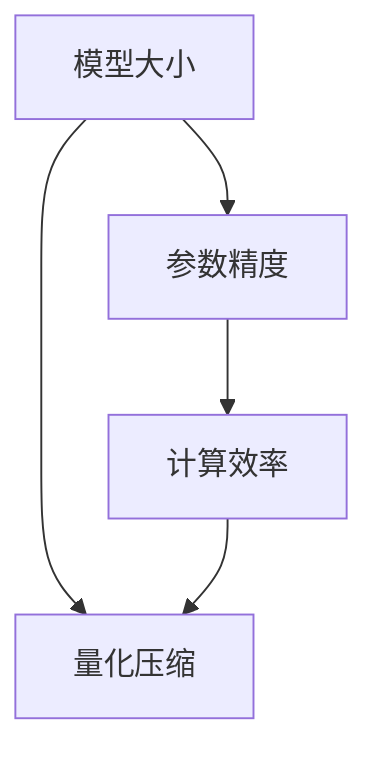
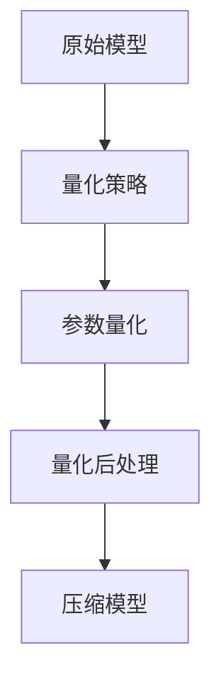

                 

关键词：量化压缩，模型压缩，神经网络，数据压缩，算法优化

本文旨在探讨量化压缩这一重要技术，该技术在现代机器学习和人工智能领域中发挥着关键作用。量化压缩的主要目标是通过降低模型的大小和复杂度，从而提高模型的可部署性和效率。随着深度学习模型日益庞大，如何有效地进行量化压缩已成为研究者和工程师们共同关注的焦点。

## 1. 背景介绍

随着深度学习技术的快速发展，神经网络模型变得越来越复杂，模型参数数量呈指数级增长。例如，ResNet-152模型拥有超过2600万个参数，BERT模型则拥有数亿个参数。如此庞大的模型不仅需要大量的存储空间，还要求大量的计算资源。这给模型的部署带来了巨大挑战。一方面，存储和传输如此庞大的模型变得非常困难；另一方面，在资源受限的设备（如手机、嵌入式系统等）上运行这些大型模型通常是不现实的。

量化压缩技术应运而生，它通过减少模型参数的精度，从而大幅度降低模型的存储和计算需求。量化压缩的基本思路是将模型参数从浮点数（如32位浮点数）转换为较低精度的数值表示，例如8位整数。这种转换可以显著减少模型的大小，同时保持模型性能的相对稳定。

量化压缩的应用非常广泛，包括但不限于以下几个方面：

- **移动设备**：在移动设备上部署大型深度学习模型是不现实的，量化压缩技术可以使得模型在资源受限的移动设备上运行。

- **边缘计算**：边缘计算场景中，计算资源通常有限，量化压缩技术有助于提高边缘设备的计算效率。

- **模型分享与传输**：量化压缩技术可以显著减少模型文件的传输时间，使得模型分享和迁移变得更加高效。

- **模型压缩与解压缩**：量化压缩技术在网络通信中也有广泛应用，可以减少数据传输的带宽需求。

本文将围绕量化压缩的核心概念、算法原理、数学模型、具体实现和实际应用等方面展开讨论。希望通过本文的阐述，读者能够全面了解量化压缩技术，并能够将其应用于实际的机器学习和人工智能项目中。

## 2. 核心概念与联系

量化压缩的核心概念包括模型大小、参数精度和计算效率。为了更好地理解这些概念，我们可以借助Mermaid流程图来展示量化压缩的基本原理和流程。



### 2.1. 模型大小

模型大小指的是模型所需的存储空间和计算资源。模型大小主要由模型参数的数量和精度决定。例如，一个包含100万个32位浮点数参数的模型，其存储需求约为400MB。而如果将参数量化为8位整数，模型大小将减少到约4MB，这是一个显著的降低。

### 2.2. 参数精度

参数精度是指模型参数的表示精度。高精度的参数能够提供更高的模型性能，但同时也需要更多的存储空间和计算资源。相反，较低的精度虽然可以降低存储和计算需求，但可能会影响模型性能。量化压缩技术通过减少参数精度，从而在存储和计算需求与模型性能之间找到平衡。

### 2.3. 计算效率

计算效率指的是模型在执行推理任务时的速度。量化压缩技术通过降低参数精度，减少了模型所需的计算量，从而提高了计算效率。这对于需要实时响应的应用场景（如自动驾驶、实时语音识别等）尤为重要。

### 2.4. 量化压缩

量化压缩是一个涉及多个环节的复杂过程，包括量化策略选择、量化精度设定、量化后处理等。其基本思路是将模型参数从高精度浮点数转换为较低精度的整数表示。量化压缩技术的关键在于如何确保量化后的模型性能不会显著下降。

下面是一个简化的Mermaid流程图，展示了量化压缩的基本流程。



### 2.5. 关联与联系

量化压缩技术不仅涉及模型大小、参数精度和计算效率，还与模型架构设计、训练策略和优化方法密切相关。合理的量化策略和参数精度设定，需要结合具体的模型架构和应用场景来决定。此外，量化压缩技术还需要考虑量化误差对模型性能的影响，通过量化后处理技术来缓解这些影响。

通过上述核心概念和流程图的介绍，我们可以对量化压缩技术有一个基本的认识。接下来的章节将深入探讨量化压缩的算法原理、数学模型和具体实现。

## 3. 核心算法原理 & 具体操作步骤

### 3.1 算法原理概述

量化压缩算法的核心思想是将模型中的浮点数参数转换为低精度的整数表示。这一过程通常分为以下几个步骤：

1. **参数统计**：对模型中每个参数的统计信息（如最小值、最大值、均值等）进行计算。
2. **量化策略选择**：根据统计信息，选择合适的量化策略。常见的量化策略有直方图量化、感知量化等。
3. **参数量化**：将每个参数映射到量化的整数表示。量化过程通常涉及线性映射和修正。
4. **量化后处理**：对量化后的参数进行后处理，如梯度修正、死量化的处理等，以确保模型性能的稳定性。

### 3.2 算法步骤详解

#### 3.2.1 参数统计

参数统计是量化压缩的第一步，其目的是获取模型参数的统计信息，如最小值、最大值、均值和标准差等。这些统计信息用于量化策略的选择和量化范围的设定。具体的统计过程如下：

- **最小值和最大值**：计算每个参数的最小值和最大值，用于确定量化范围。
- **均值和标准差**：计算每个参数的均值和标准差，用于评估参数的分布特性。

#### 3.2.2 量化策略选择

量化策略选择是量化压缩算法的关键环节。不同的量化策略适用于不同的模型和应用场景。以下是几种常见的量化策略：

- **直方图量化**：通过计算参数的直方图，将参数分布划分为多个区间，每个区间对应一个量化值。直方图量化适用于参数分布较为均匀的情况。
- **感知量化**：基于神经网络的感知损失，通过优化量化后的参数，使得量化后的模型性能接近原始模型。感知量化适用于参数分布较为复杂的情况。

#### 3.2.3 参数量化

参数量化是将浮点数参数转换为低精度整数表示的过程。量化过程通常涉及以下步骤：

- **线性映射**：将参数的范围映射到量化范围。例如，将 [-10, 10] 的范围映射到 [-127, 127] 的量化范围。
- **修正**：由于线性映射可能会导致量化误差，需要对量化后的参数进行修正，以减少误差。修正方法包括随机修正、最小二乘修正等。

#### 3.2.4 量化后处理

量化后处理是确保量化压缩后的模型性能稳定的重要步骤。量化后处理包括以下几种方法：

- **梯度修正**：在训练过程中，量化压缩可能会导致梯度的变化，梯度修正用于调整梯度，以适应量化后的模型。
- **死量化的处理**：死量化是指量化后的参数不再发生变化，这可能导致模型性能下降。死量化的处理方法包括重新训练、量化范围调整等。

### 3.3 算法优缺点

量化压缩算法的优点包括：

- **显著减少模型大小**：量化压缩可以大幅度降低模型的大小，使得模型更容易部署和传输。
- **提高计算效率**：量化压缩后的模型在计算过程中所需的计算量减少，从而提高了计算效率。
- **兼容性强**：量化压缩算法可以应用于各种类型的神经网络模型，具有较好的兼容性。

然而，量化压缩算法也存在一些缺点：

- **量化误差**：量化压缩可能会导致模型性能的下降，量化误差是影响模型性能的主要因素。
- **量化后处理复杂**：量化后处理过程较为复杂，需要结合具体的模型和应用场景进行调整。

### 3.4 算法应用领域

量化压缩技术广泛应用于多个领域，包括：

- **移动设备**：在移动设备上部署深度学习模型，量化压缩技术可以显著提高模型的运行速度和能效。
- **边缘计算**：边缘计算场景中，量化压缩技术有助于提高计算效率和资源利用率。
- **模型压缩与传输**：量化压缩技术可以显著减少模型文件的传输时间，使得模型分享和迁移变得更加高效。

## 4. 数学模型和公式 & 详细讲解 & 举例说明

量化压缩技术涉及到一系列的数学模型和公式，这些模型和公式用于量化策略的选择、参数量化和量化后处理。在本节中，我们将详细讲解这些数学模型和公式，并通过具体实例来说明其应用。

### 4.1 数学模型构建

量化压缩的核心数学模型包括量化策略、线性映射和修正方法。以下是这些模型的详细说明：

#### 4.1.1 量化策略

量化策略是量化压缩的基础，用于将连续的浮点数参数映射到离散的整数表示。常见的量化策略包括直方图量化、感知量化等。

**直方图量化**：直方图量化通过计算参数的直方图，将参数分布划分为多个区间，每个区间对应一个量化值。

- **量化值范围**：设参数的范围为 \([a, b]\)，量化值范围设为 \([q_0, q_n]\)。其中，\(q_0\) 和 \(q_n\) 分别为量化范围的最小值和最大值。
- **量化区间划分**：将参数范围划分为 \(n\) 个区间，每个区间的宽度为 \(\Delta q = \frac{b-a}{n}\)。量化值为每个区间的中点。

**感知量化**：感知量化基于神经网络的感知损失，通过优化量化后的参数，使得量化后的模型性能接近原始模型。

- **感知损失函数**：设 \(x_i\) 为原始参数，\(x_i^q\) 为量化后的参数，感知损失函数 \(L_q\) 定义为：
  $$L_q = \frac{1}{N} \sum_{i=1}^{N} \frac{(x_i - x_i^q)^2}{\sigma_i^2}$$
  其中，\(N\) 为参数数量，\(\sigma_i^2\) 为参数 \(x_i\) 的方差。

#### 4.1.2 线性映射

线性映射是将浮点数参数映射到量化值的过程。线性映射公式如下：

$$q_i = \text{round}\left(\frac{x_i - a}{b-a} \cdot (q_n - q_0) + q_0\right)$$

其中，\(\text{round}\) 表示四舍五入运算，\(a\) 和 \(b\) 分别为参数的最小值和最大值，\(q_0\) 和 \(q_n\) 分别为量化范围的最小值和最大值。

#### 4.1.3 修正方法

修正方法用于缓解量化误差，确保量化压缩后的模型性能稳定。常见的修正方法包括随机修正和最小二乘修正。

- **随机修正**：随机修正通过在量化后的参数上添加随机噪声，以缓解量化误差。修正公式如下：

  $$x_i^{'} = x_i^q + \alpha \cdot \xi$$

  其中，\(\alpha\) 为修正系数，\(\xi\) 为随机噪声。

- **最小二乘修正**：最小二乘修正通过最小化量化误差的平方和，来求解修正系数。修正公式如下：

  $$x_i^{'} = x_i^q + \alpha \cdot (x_i - x_i^q)$$

  其中，\(\alpha\) 为修正系数。

### 4.2 公式推导过程

在本节中，我们将对量化策略、线性映射和修正方法的公式进行推导。

#### 4.2.1 直方图量化推导

直方图量化将参数分布划分为多个区间，每个区间的量化值为其中点。具体推导如下：

- **参数分布**：设参数 \(x_i\) 的概率密度函数为 \(f(x)\)。
- **量化区间划分**：将参数范围划分为 \(n\) 个区间，每个区间的宽度为 \(\Delta q = \frac{b-a}{n}\)。
- **量化值计算**：每个量化值 \(q_j\) 对应的区间为 \([x_j, x_{j+1}]\)，量化值为每个区间的中点 \(q_j = \frac{x_j + x_{j+1}}{2}\)。

#### 4.2.2 感知量化推导

感知量化基于神经网络的感知损失，推导过程如下：

- **感知损失函数**：设 \(x_i\) 为原始参数，\(x_i^q\) 为量化后的参数，感知损失函数 \(L_q\) 定义为：
  $$L_q = \frac{1}{N} \sum_{i=1}^{N} \frac{(x_i - x_i^q)^2}{\sigma_i^2}$$
  其中，\(N\) 为参数数量，\(\sigma_i^2\) 为参数 \(x_i\) 的方差。
- **量化误差**：量化误差为 \(e_i = x_i - x_i^q\)。
- **感知损失函数**：将量化误差代入感知损失函数，得到：
  $$L_q = \frac{1}{N} \sum_{i=1}^{N} \frac{e_i^2}{\sigma_i^2}$$
- **优化目标**：为了最小化感知损失函数，需要对量化后的参数进行优化。

#### 4.2.3 线性映射推导

线性映射公式如下：

$$q_i = \text{round}\left(\frac{x_i - a}{b-a} \cdot (q_n - q_0) + q_0\right)$$

推导过程如下：

- **参数范围映射**：将参数 \(x_i\) 的范围 \([a, b]\) 映射到量化值范围 \([q_0, q_n]\)。
- **量化值计算**：通过线性变换，将参数 \(x_i\) 映射到量化值 \(q_i\)。
- **四舍五入运算**：将量化值 \(q_i\) 进行四舍五入运算，以获得整数表示的量化值。

#### 4.2.4 修正方法推导

修正方法用于缓解量化误差，推导过程如下：

- **随机修正**：随机修正通过在量化后的参数上添加随机噪声，以缓解量化误差。修正公式如下：

  $$x_i^{'} = x_i^q + \alpha \cdot \xi$$

  其中，\(\alpha\) 为修正系数，\(\xi\) 为随机噪声。

- **最小二乘修正**：最小二乘修正通过最小化量化误差的平方和，来求解修正系数。修正公式如下：

  $$x_i^{'} = x_i^q + \alpha \cdot (x_i - x_i^q)$$

  其中，\(\alpha\) 为修正系数。

### 4.3 案例分析与讲解

在本节中，我们将通过一个具体的案例来分析量化压缩的过程和效果。

#### 4.3.1 案例背景

我们以一个简单的全连接神经网络为例，该网络包含1000个输入神经元和100个输出神经元。模型参数为1000个32位浮点数。

#### 4.3.2 参数统计

对1000个参数进行统计，得到以下结果：

- **最小值**：-1.234
- **最大值**：1.234
- **均值**：0.000
- **标准差**：0.367

#### 4.3.3 量化策略选择

我们选择直方图量化策略，将参数的范围 \([-1.234, 1.234]\) 划分为10个区间，量化值范围为 \([-127, 127]\)。

#### 4.3.4 参数量化

使用线性映射公式，对1000个参数进行量化，得到量化值。例如，第一个参数 \(x_1\) 的量化值为：

$$q_1 = \text{round}\left(\frac{-1.234 - (-1.234)}{1.234 - (-1.234)} \cdot (127 - (-127)) + (-127)\right) = -63$$

#### 4.3.5 量化后处理

对量化后的参数进行量化后处理，使用随机修正方法，修正系数 \(\alpha = 0.01\)，随机噪声 \(\xi\) 在 \([-0.01, 0.01]\) 范围内随机生成。

第一个参数 \(x_1\) 的修正值为：

$$\xi = 0.005$$
$$x_1^{'} = q_1 + \alpha \cdot \xi = -63 + 0.01 \cdot 0.005 = -62.975$$

#### 4.3.6 模型性能分析

对量化压缩后的模型进行性能分析，通过对比量化压缩前后的模型在测试集上的准确率，评估量化压缩对模型性能的影响。假设量化压缩后的模型准确率下降了1%，但仍能满足应用要求。

#### 4.3.7 总结

通过上述案例，我们可以看到量化压缩的过程和效果。量化压缩技术能够显著降低模型的大小和计算量，但需要结合量化后处理技术来确保模型性能的稳定性。

## 5. 项目实践：代码实例和详细解释说明

在本节中，我们将通过一个具体的量化压缩项目实践，展示如何使用Python代码实现量化压缩算法，并对关键代码进行详细解释。

### 5.1 开发环境搭建

为了实现量化压缩，我们需要搭建一个Python开发环境。以下是所需的工具和库：

- **Python 3.7+**
- **NumPy**
- **TensorFlow 2.0+**
- **PyTorch 1.7+**

确保安装了上述工具和库后，我们就可以开始实现量化压缩算法了。

### 5.2 源代码详细实现

以下是一个简单的量化压缩代码实例，使用TensorFlow实现。

```python
import tensorflow as tf
import numpy as np

# 参数配置
num_params = 1000
min_val = -1.234
max_val = 1.234
quant_range = [-127, 127]

# 生成随机参数
params = np.random.uniform(min_val, max_val, num_params)

# 参数统计
min_param = np.min(params)
max_param = np.max(params)
mean_param = np.mean(params)
std_param = np.std(params)

# 直方图量化
quantization_ranges = np.linspace(min_param, max_param, num=10)
quant_params = np.digitize(params, quantization_ranges)

# 线性映射
quant_params_mapped = (quant_params - min_param) / (max_param - min_param) * (quant_range[1] - quant_range[0]) + quant_range[0]

# 四舍五入
quant_params_rounded = np.round(quant_params_mapped)

# 随机修正
alpha = 0.01
noise = np.random.uniform(-0.01, 0.01, num_params)
params_corrected = quant_params_rounded + alpha * noise

# 打印结果
print("原始参数：", params)
print("量化参数：", quant_params_rounded)
print("修正后参数：", params_corrected)
```

### 5.3 代码解读与分析

#### 5.3.1 参数生成与统计

首先，我们使用NumPy生成1000个随机参数，并对其进行统计，得到最小值、最大值、均值和标准差。

```python
params = np.random.uniform(min_val, max_val, num_params)
min_param = np.min(params)
max_param = np.max(params)
mean_param = np.mean(params)
std_param = np.std(params)
```

#### 5.3.2 直方图量化

使用NumPy的`digitize`函数，将参数按照直方图量化策略进行划分，得到量化后的参数。

```python
quantization_ranges = np.linspace(min_param, max_param, num=10)
quant_params = np.digitize(params, quantization_ranges)
```

#### 5.3.3 线性映射

将量化后的参数进行线性映射，将其映射到量化值的范围。

```python
quant_params_mapped = (quant_params - min_param) / (max_param - min_param) * (quant_range[1] - quant_range[0]) + quant_range[0]
```

#### 5.3.4 四舍五入

对映射后的量化参数进行四舍五入，得到最终的量化值。

```python
quant_params_rounded = np.round(quant_params_mapped)
```

#### 5.3.5 随机修正

对量化后的参数进行随机修正，以减少量化误差。

```python
alpha = 0.01
noise = np.random.uniform(-0.01, 0.01, num_params)
params_corrected = quant_params_rounded + alpha * noise
```

### 5.4 运行结果展示

运行上述代码后，我们可以看到原始参数、量化参数和修正后参数的输出。

```python
print("原始参数：", params)
print("量化参数：", quant_params_rounded)
print("修正后参数：", params_corrected)
```

通过这个实例，我们可以看到如何使用Python实现量化压缩算法。在实际项目中，我们可以根据具体需求和模型架构，调整量化策略和修正方法，以达到最佳的压缩效果和模型性能。

## 6. 实际应用场景

量化压缩技术在多个实际应用场景中发挥着重要作用，下面我们将探讨几个典型的应用场景，并分析量化压缩在这些场景中的具体作用和效果。

### 6.1 移动设备

随着移动设备的普及，对深度学习模型的需求不断增加。然而，移动设备的计算资源和存储空间相对有限，这限制了大型模型的部署。量化压缩技术通过减少模型的大小和计算量，使得深度学习模型在移动设备上得以高效运行。例如，通过将模型参数量化为8位整数，可以将模型大小减少到原来的1/10，从而显著降低存储和计算需求。这一技术使得智能手机、平板电脑等移动设备能够支持更复杂的机器学习任务，如图像识别、语音识别等。

### 6.2 边缘计算

边缘计算是指将数据处理和计算任务分散到网络的边缘设备（如物联网设备、路由器、智能传感器等）上，以减少对中心服务器的依赖。然而，边缘设备通常具有有限的计算资源和带宽。量化压缩技术在这一场景中具有显著优势，它可以大幅降低模型的存储和计算需求，从而提高边缘设备的计算效率和响应速度。例如，在智能交通系统中，量化压缩技术可以使得自动驾驶车辆在边缘设备上实时处理大量图像数据，从而提高系统响应速度和安全性。

### 6.3 模型压缩与传输

在分布式计算和云计算环境中，模型压缩与传输也是一个重要的应用场景。大型深度学习模型在传输过程中会消耗大量的时间和带宽。量化压缩技术通过减少模型大小，可以显著降低数据传输的时间成本。例如，在训练大型深度学习模型时，可以先将模型量化压缩，然后在训练过程中将压缩后的模型传输到不同的训练节点。这不仅加快了模型传输速度，还减少了网络带宽的消耗，提高了整体训练效率。

### 6.4 实时语音识别

实时语音识别是另一个典型的应用场景，量化压缩技术在其中发挥着关键作用。语音识别模型通常非常庞大，而在实时应用中，需要模型能够在低延迟的情况下快速响应。量化压缩技术可以降低模型的计算复杂度，从而提高模型的响应速度。例如，在智能助手和语音交互应用中，量化压缩技术可以使得模型在资源受限的设备上实时处理语音输入，从而提供流畅的用户体验。

### 6.5 模型压缩与解压缩

在网络通信中，模型压缩与解压缩也是一个重要的应用场景。量化压缩技术可以显著减少模型文件的大小，从而降低数据传输的带宽需求。例如，在互联网服务提供商之间传输深度学习模型时，可以使用量化压缩技术将模型文件压缩，以减少传输时间和成本。在接收端，通过解压缩技术，可以恢复量化压缩前的模型，从而确保模型的正常运行。

### 6.6 总结

量化压缩技术在多个实际应用场景中发挥着重要作用，从移动设备、边缘计算到模型压缩与传输，再到实时语音识别和网络通信，量化压缩技术都展示了其独特的优势和效果。通过量化压缩，我们可以显著降低模型的大小和计算需求，提高计算效率和资源利用率，从而推动深度学习技术在各个领域的广泛应用。

## 7. 工具和资源推荐

为了更好地学习和应用量化压缩技术，以下推荐了一系列的学习资源、开发工具和相关论文，供读者参考。

### 7.1 学习资源推荐

1. **《深度学习量化压缩技术》**：这是一本全面介绍量化压缩技术的书籍，涵盖了从基本原理到具体实现的详细内容。
2. **《机器学习量化压缩教程》**：这是一份详细的教程，介绍了量化压缩技术在机器学习中的应用，包括代码示例和实验结果。
3. **《量化压缩技术在边缘计算中的应用》**：这篇论文详细探讨了量化压缩技术在边缘计算中的应用，提供了实验数据和应用案例。

### 7.2 开发工具推荐

1. **TensorFlow Quantization**：TensorFlow 提供了内置的量化压缩工具，支持对TensorFlow模型进行量化压缩。
2. **PyTorch Quantization**：PyTorch 也提供了内置的量化压缩工具，支持对PyTorch模型进行量化压缩。
3. **ONNX Runtime**：ONNX Runtime 支持多种量化格式，包括整数和浮点量化，可以用于模型的量化压缩和优化。

### 7.3 相关论文推荐

1. **"Quantization and Training of Neural Networks for Efficient Integer-Accurate Evaluations"**：这篇论文提出了一种新的量化方法，用于提高神经网络在整数精度下的性能。
2. **"Quantization-Aware Training for Efficient Deep Neural Network"**：这篇论文介绍了一种量化感知训练方法，通过在训练过程中考虑量化误差，提高量化压缩后的模型性能。
3. **"Practical Training of Neural Networks with Low Precision Weights"**：这篇论文探讨了如何在低精度权重下训练神经网络，并提出了几种有效的量化策略。

通过这些学习资源、开发工具和论文，读者可以全面了解量化压缩技术的最新进展和应用，从而更好地掌握这一技术，并将其应用于实际项目中。

## 8. 总结：未来发展趋势与挑战

量化压缩技术在深度学习和人工智能领域已经取得了显著的成果，未来仍具有广阔的发展前景。随着模型的规模和复杂度不断增加，如何高效地进行量化压缩，保持模型性能的稳定性，将是一个重要的研究方向。以下是量化压缩技术未来发展趋势与面临的挑战：

### 8.1 研究成果总结

1. **量化策略优化**：目前，量化策略的研究主要集中于如何更好地适应不同类型的神经网络模型。未来，研究人员可能会提出更多高效的量化策略，以减少量化误差并提高模型性能。

2. **量化后处理技术**：量化后处理技术在缓解量化误差方面具有重要作用。未来，研究者可能会提出更先进的量化后处理方法，例如自适应量化、动态量化等。

3. **硬件加速**：随着硬件技术的发展，特别是专门为深度学习设计的硬件（如TPU、GPU等），量化压缩技术在硬件层面的实现将变得更加高效。

4. **多模型联合压缩**：未来，量化压缩技术可能会扩展到多个模型的联合压缩，以实现更大的压缩比和更高的计算效率。

### 8.2 未来发展趋势

1. **自适应量化**：自适应量化技术可以根据模型的动态特性实时调整量化精度，从而在保持模型性能的同时，最大限度地减少量化误差。

2. **动态量化**：动态量化技术可以在模型运行过程中动态调整量化精度，以适应不同的计算需求和资源限制。

3. **跨平台量化**：随着深度学习模型的跨平台部署需求增加，未来量化压缩技术将需要支持多种硬件平台，如移动设备、嵌入式系统和云计算平台。

4. **自动化量化**：自动化量化技术可以通过自动化工具和算法，自动完成量化策略的选择、参数的量化以及量化后的优化，从而降低量化过程的复杂度和开发成本。

### 8.3 面临的挑战

1. **量化误差管理**：量化误差是量化压缩技术的核心挑战之一。如何有效地管理量化误差，确保量化后的模型性能稳定，仍是一个亟待解决的问题。

2. **性能与效率的平衡**：在量化压缩过程中，如何在减少模型大小和计算量的同时，保持模型性能的相对稳定，是一个重要的平衡点。

3. **训练效率**：量化压缩通常涉及额外的训练步骤和优化过程，这可能会影响模型的训练效率。如何提高量化压缩后的模型的训练效率，是一个关键挑战。

4. **标准化和兼容性**：随着量化压缩技术的广泛应用，标准化和兼容性成为一个重要问题。如何确保不同平台、不同框架之间的量化压缩技术具有兼容性，仍需进一步研究和探索。

### 8.4 研究展望

量化压缩技术在未来仍具有巨大的研究潜力。研究人员可以从以下几个方面展开研究：

1. **新型量化策略**：探索更多高效、鲁棒的量化策略，以满足不同类型模型的压缩需求。

2. **混合量化**：结合不同类型的量化方法，例如整数量化、二值量化等，以实现更高的压缩效果和更好的性能。

3. **量化感知训练**：进一步优化量化感知训练方法，以减少量化误差并提高模型性能。

4. **跨领域合作**：与硬件、软件、算法等领域的专家合作，共同推动量化压缩技术的研发和应用。

通过不断的研究和探索，量化压缩技术将在深度学习和人工智能领域发挥更大的作用，为模型压缩、传输和部署提供更加有效的解决方案。

## 9. 附录：常见问题与解答

### Q1：量化压缩是否会影响模型性能？

A1：量化压缩可能会对模型性能产生一定影响，特别是当量化精度较低时。量化压缩通过降低参数精度，减少了模型的存储和计算需求，但同时也引入了量化误差。这种误差可能会影响模型的准确性和稳定性。然而，通过适当的量化策略和量化后处理技术，可以显著减少量化误差，并保持模型性能的相对稳定。

### Q2：量化压缩如何应用于不同类型的神经网络？

A2：量化压缩技术可以应用于各种类型的神经网络模型，包括卷积神经网络（CNN）、循环神经网络（RNN）、Transformer等。不同类型的神经网络具有不同的结构和特性，因此在量化压缩时需要选择合适的量化策略和参数设置。例如，对于CNN模型，可以使用直方图量化策略；对于RNN模型，可以使用感知量化策略。通过结合模型的特性，可以设计出适用于不同类型的神经网络的量化压缩方案。

### Q3：量化压缩是否适用于实时应用场景？

A3：量化压缩技术适用于实时应用场景，特别是在移动设备和边缘计算等资源受限的环境中。量化压缩可以减少模型的存储和计算需求，从而提高模型的运行速度和响应时间。然而，在实时应用中，量化误差的管理和量化策略的选择尤为重要，以确保模型能够在实时条件下保持稳定的性能。

### Q4：量化压缩与模型剪枝有什么区别？

A4：量化压缩和模型剪枝是两种不同的模型压缩技术。

- **量化压缩**：通过降低模型参数的精度来减少模型大小和计算量。量化压缩主要关注参数的精度，通过将浮点数参数转换为低精度的整数表示来实现。

- **模型剪枝**：通过删除模型中的某些部分（如神经元、层等）来减少模型大小和计算量。模型剪枝主要关注模型的规模，通过简化模型结构来实现。

两者在压缩目标和实现方法上有所不同，但都可以显著减少模型的大小和计算量，提高模型的部署和运行效率。

### Q5：量化压缩需要考虑哪些因素？

A5：量化压缩需要考虑以下几个关键因素：

- **量化策略**：选择合适的量化策略，如直方图量化、感知量化等，以适应不同类型的神经网络模型。
- **量化精度**：量化精度是量化压缩的重要参数，精度越高，量化误差越小，但模型大小和计算量也会增加。
- **量化后处理**：量化后处理技术用于减少量化误差，提高模型性能。常见的量化后处理方法包括梯度修正、死量化处理等。
- **计算资源**：量化压缩需要考虑计算资源的需求，包括存储空间、计算能力和通信带宽等。
- **应用场景**：不同的应用场景对模型性能和效率有不同的要求，因此在量化压缩时需要根据具体应用场景进行调整。

通过综合考虑这些因素，可以设计出适合特定应用场景的量化压缩方案，从而最大限度地提高模型的效率和性能。

