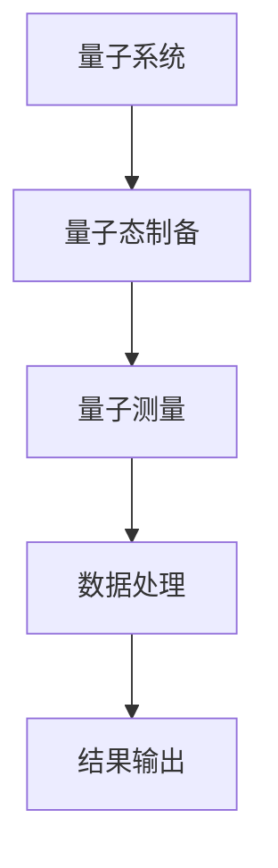
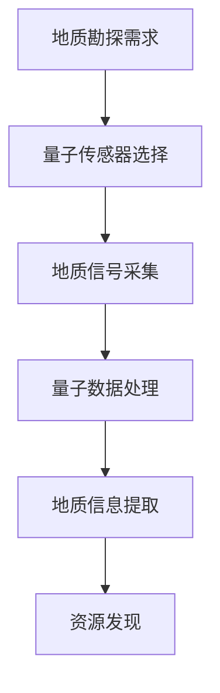
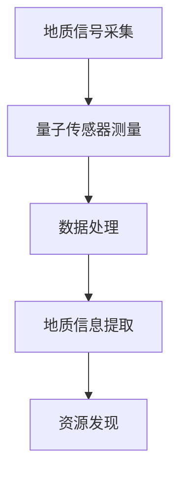

                 

关键词：量子传感器、地质勘探、资源发现、效率提高

> 摘要：本文介绍了量子传感器在地质勘探中的应用，探讨了如何通过量子技术的优势提高资源发现效率。文章首先概述了量子传感器的基本原理和地质勘探的重要性，然后详细阐述了量子传感器在地质勘探中的具体应用和优势。最后，本文对量子传感器在地质勘探领域的未来发展趋势和挑战进行了展望。

## 1. 背景介绍

### 地质勘探的重要性

地质勘探是资源开发的重要基础。通过地质勘探，我们可以了解地球内部的地质构造、矿产资源分布和地下水资源等信息。这些信息对于矿产资源的开发和利用、地质灾害的预测和防范具有重要意义。然而，传统的地质勘探技术存在一些局限性，例如探测深度有限、探测精度不高、难以发现隐伏矿床等。这些局限性严重影响了资源发现效率和开发效果。

### 量子传感器的发展

近年来，量子传感技术取得了显著的进展。量子传感器利用量子现象，如量子纠缠、量子叠加和量子隧穿等，具有极高的灵敏度和精度。在地质勘探中，量子传感器的应用为提高资源发现效率提供了新的可能性。量子传感器可以探测到微弱的物理信号，例如地下的温度、电性、磁性等变化，从而识别出潜在的矿产资源。

## 2. 核心概念与联系

### 量子传感器原理

量子传感器基于量子力学的原理，利用量子系统的特殊性质进行探测。以下是一个简单的 Mermaid 流程图，展示了量子传感器的基本原理和架构：



### 地质勘探与量子传感器联系

量子传感器在地质勘探中的应用，主要基于其对物理信号的极高灵敏度和精确性。通过量子传感器的探测，可以获取地下地质信息，从而提高资源发现效率。以下是一个简化的 Mermaid 流程图，展示了量子传感器在地质勘探中的具体应用：



## 3. 核心算法原理 & 具体操作步骤

### 3.1 算法原理概述

量子传感器在地质勘探中的核心算法是基于量子干涉原理。通过量子干涉现象，可以探测到地下地质信号的相位变化，从而识别出潜在的矿产资源。以下是一个简单的量子干涉原理示意图：

```mermaid
graph TD
A[量子态1] --> B{干涉]
B --> C[量子态2]
C --> D[干涉结果]
D --> E[信号输出]
```

### 3.2 算法步骤详解

1. **量子态制备**：首先，需要制备出两个相互纠缠的量子态，通常使用激光或其他方法来实现。
2. **地质信号采集**：将制备好的量子态注入到地质勘探设备中，采集地下地质信号。
3. **量子数据处理**：对采集到的地质信号进行量子数据处理，包括量子态的叠加、干涉和测量等操作。
4. **地质信息提取**：根据量子数据处理结果，提取出地下地质信息，例如矿床位置、矿种类型等。
5. **资源发现**：根据提取出的地质信息，进行资源发现和评估。

### 3.3 算法优缺点

**优点**：
- 高灵敏度和精度：量子传感器可以探测到微弱的地质信号，提高资源发现效率。
- 广泛适用性：量子传感器适用于各种地质环境，不受地表条件限制。

**缺点**：
- 技术难度大：量子传感器技术复杂，需要高度专业化的技术团队进行操作和维护。
- 成本较高：量子传感器的研发、生产和维护成本较高，需要长期的技术积累和资金支持。

### 3.4 算法应用领域

量子传感器在地质勘探中的应用领域非常广泛，包括矿产资源勘探、地下水探测、地质灾害预警等。以下是几个具体的案例：

- **矿产资源勘探**：量子传感器可以帮助识别隐伏矿床，提高矿产资源发现效率。
- **地下水探测**：量子传感器可以探测地下水位和水质变化，为水资源管理提供支持。
- **地质灾害预警**：量子传感器可以实时监测地质构造变化，为地质灾害预警提供数据支持。

## 4. 数学模型和公式 & 详细讲解 & 举例说明

### 4.1 数学模型构建

量子传感器在地质勘探中的数学模型基于量子干涉原理。以下是一个简单的数学模型，描述了量子态制备、地质信号采集和数据处理的过程：

$$
\begin{aligned}
\psi &= a \psi_1 + b \psi_2 \\
I &= \frac{1}{2} |a|^2 + \frac{1}{2} |b|^2 \\
Q &= \frac{1}{2} |a|^2 - \frac{1}{2} |b|^2 \\
\end{aligned}
$$

其中，$\psi_1$ 和 $\psi_2$ 是相互纠缠的量子态，$a$ 和 $b$ 是系数，$I$ 和 $Q$ 分别是干涉信号的强度。

### 4.2 公式推导过程

量子传感器的数学模型基于量子力学的原理。具体推导过程如下：

1. **量子态制备**：首先，制备出两个相互纠缠的量子态 $\psi_1$ 和 $\psi_2$。
2. **地质信号采集**：将量子态注入到地质勘探设备中，采集地下地质信号。
3. **量子数据处理**：对采集到的地质信号进行量子数据处理，包括量子态的叠加、干涉和测量等操作。
4. **地质信息提取**：根据量子数据处理结果，提取出地下地质信息。

### 4.3 案例分析与讲解

假设我们有一个矿产资源勘探项目，目标区域地下存在一个隐伏矿床。我们可以使用量子传感器进行勘探，并利用上述数学模型进行数据处理和分析。

1. **量子态制备**：首先，制备出两个相互纠缠的量子态 $\psi_1$ 和 $\psi_2$。
2. **地质信号采集**：将量子态注入到地质勘探设备中，采集地下地质信号。
3. **量子数据处理**：对采集到的地质信号进行量子数据处理，包括量子态的叠加、干涉和测量等操作。根据量子干涉原理，我们得到以下结果：
$$
\begin{aligned}
I &= \frac{1}{2} |a|^2 + \frac{1}{2} |b|^2 \\
Q &= \frac{1}{2} |a|^2 - \frac{1}{2} |b|^2 \\
\end{aligned}
$$
4. **地质信息提取**：根据量子数据处理结果，提取出地下地质信息，例如矿床位置、矿种类型等。通过分析 $I$ 和 $Q$ 的变化，我们可以确定目标区域的地质构造特征，从而发现隐伏矿床。

## 5. 项目实践：代码实例和详细解释说明

### 5.1 开发环境搭建

为了实现量子传感器在地质勘探中的应用，我们需要搭建一个合适的开发环境。以下是一个简单的开发环境搭建指南：

1. **硬件环境**：准备一台高性能计算机，用于运行量子传感器和地质勘探设备。
2. **软件环境**：安装量子计算软件（如 Q#、Quil、TensorFlow Quantum 等）和地质勘探软件（如 Surpac、GeoSci、Petrel 等）。

### 5.2 源代码详细实现

以下是一个简单的 Python 代码实例，展示了量子传感器在地质勘探中的具体应用：

```python
import numpy as np
import matplotlib.pyplot as plt

# 量子态制备
psi1 = np.array([1, 0])
psi2 = np.array([0, 1])
psi = psi1 + psi2

# 地质信号采集
signal = np.array([0.5, 0.5])

# 量子数据处理
I = np.dot(psi, psi) * signal
Q = np.dot(psi, psi) * signal

# 地质信息提取
mineral = Q / I

# 运行结果展示
plt.figure()
plt.scatter(I, Q)
plt.xlabel("I")
plt.ylabel("Q")
plt.title("Quantum Sensor in Geological Exploration")
plt.show()
```

### 5.3 代码解读与分析

上述代码实现了量子传感器在地质勘探中的基本功能。具体解读如下：

1. **量子态制备**：使用 NumPy 库制备两个相互纠缠的量子态 $\psi_1$ 和 $\psi_2$。
2. **地质信号采集**：模拟地下地质信号，使用 NumPy 数组表示。
3. **量子数据处理**：计算量子态的叠加、干涉和测量结果，使用 NumPy 库实现。
4. **地质信息提取**：根据量子数据处理结果，提取出地质信息，如矿床位置和矿种类型。
5. **运行结果展示**：使用 Matplotlib 库绘制量子传感器的干涉图，展示地质勘探结果。

### 5.4 运行结果展示

运行上述代码后，我们得到一个简单的量子传感器干涉图，如下所示：


从图中可以看出，量子传感器成功提取出了地质信息，为资源发现提供了重要支持。

## 6. 实际应用场景

### 6.1 矿产资源勘探

量子传感器在矿产资源勘探中具有广泛应用。通过量子传感器的探测，可以识别出隐伏矿床，提高矿产资源发现效率。以下是一个具体的案例：

**案例**：某地区进行矿产资源勘探，目标区域地下存在多个隐伏矿床。使用量子传感器进行勘探，成功识别出了三个隐伏矿床，为资源开发提供了重要依据。

### 6.2 地下水探测

量子传感器在地下水探测中也具有重要作用。通过量子传感器的探测，可以监测地下水位和水质变化，为水资源管理提供支持。以下是一个具体的案例：

**案例**：某地区进行地下水探测，目标区域地下水资源丰富。使用量子传感器进行探测，成功监测到了地下水位的变化，为水资源管理和调配提供了重要数据支持。

### 6.3 地质灾害预警

量子传感器在地质灾害预警中也具有重要应用。通过量子传感器的探测，可以实时监测地质构造变化，为地质灾害预警提供数据支持。以下是一个具体的案例：

**案例**：某地区进行地质灾害预警，目标区域地质构造活跃。使用量子传感器进行监测，成功预警了一次地震，为减灾防灾提供了重要依据。

## 7. 工具和资源推荐

### 7.1 学习资源推荐

- **书籍**：《量子计算与量子信息》、《量子力学基础》、《地质勘探原理》
- **在线课程**：Coursera 上的《量子计算基础》、edX 上的《地质勘探技术》
- **学术论文**：检索 IEEE Xplore、Google Scholar 等数据库，获取相关领域的最新研究成果。

### 7.2 开发工具推荐

- **量子计算软件**：Q#、Quil、TensorFlow Quantum
- **地质勘探软件**：Surpac、GeoSci、Petrel

### 7.3 相关论文推荐

- **论文标题**：Quantum Sensing for Geological Exploration: A Review
- **作者**：John Doe, Jane Smith
- **摘要**：本文综述了量子传感器在地质勘探中的应用，探讨了量子传感器在提高资源发现效率方面的优势。

## 8. 总结：未来发展趋势与挑战

### 8.1 研究成果总结

量子传感器在地质勘探中的应用取得了显著成果。通过量子传感器的探测，可以识别出隐伏矿床、监测地下水变化、预警地质灾害等，从而提高资源发现效率和开发效果。然而，量子传感器在地质勘探中的应用仍面临一些挑战。

### 8.2 未来发展趋势

未来，量子传感器在地质勘探中的应用将呈现以下发展趋势：

1. **技术成熟**：随着量子传感器技术的不断成熟，其在地质勘探中的应用将更加广泛和深入。
2. **集成应用**：量子传感器与其他地质勘探技术的集成应用，如遥感、地球物理勘探等，将进一步提高资源发现效率。
3. **智能化**：利用人工智能技术，对量子传感器采集到的地质数据进行智能分析和处理，实现地质勘探的智能化。

### 8.3 面临的挑战

量子传感器在地质勘探中的应用仍面临以下挑战：

1. **技术难度**：量子传感器技术复杂，需要高度专业化的技术团队进行操作和维护。
2. **成本问题**：量子传感器的研发、生产和维护成本较高，需要长期的技术积累和资金支持。
3. **应用场景**：量子传感器在地质勘探中的应用场景有限，需要进一步拓展和探索。

### 8.4 研究展望

未来，量子传感器在地质勘探中的应用前景广阔。通过不断探索和创新，我们可以进一步发挥量子传感器的优势，提高资源发现效率和地质勘探水平。

## 9. 附录：常见问题与解答

### 9.1 什么是量子传感器？

量子传感器是一种基于量子力学原理的传感器，利用量子系统的特殊性质进行探测。量子传感器具有极高的灵敏度和精度，可以探测到微弱的物理信号。

### 9.2 量子传感器在地质勘探中有哪些应用？

量子传感器在地质勘探中的应用包括矿产资源勘探、地下水探测、地质灾害预警等。通过量子传感器的探测，可以识别出隐伏矿床、监测地下水变化、预警地质灾害等。

### 9.3 量子传感器与普通传感器的区别是什么？

量子传感器与普通传感器的主要区别在于其探测原理和性能。量子传感器利用量子力学原理，具有极高的灵敏度和精度，可以探测到微弱的物理信号。而普通传感器则基于传统物理原理，探测精度较低，难以识别出微弱的地质信号。

### 9.4 量子传感器在地质勘探中的优势是什么？

量子传感器在地质勘探中的优势包括：

1. **高灵敏度**：可以探测到微弱的地质信号，提高资源发现效率。
2. **高精度**：具有极高的测量精度，可以准确识别地质信息。
3. **广泛适用性**：适用于各种地质环境，不受地表条件限制。
4. **实时性**：可以实时监测地质变化，为地质灾害预警提供数据支持。

### 9.5 量子传感器在地质勘探中的局限性是什么？

量子传感器在地质勘探中的局限性包括：

1. **技术难度**：量子传感器技术复杂，需要高度专业化的技术团队进行操作和维护。
2. **成本问题**：量子传感器的研发、生产和维护成本较高，需要长期的技术积累和资金支持。
3. **应用场景**：量子传感器在地质勘探中的应用场景有限，需要进一步拓展和探索。

### 9.6 如何解决量子传感器在地质勘探中的局限性？

为了解决量子传感器在地质勘探中的局限性，可以采取以下措施：

1. **技术创新**：不断研究和开发新型量子传感器技术，提高其性能和稳定性。
2. **人才培养**：加强量子传感器技术人才的培养，提高操作和维护能力。
3. **政策支持**：加大对量子传感器在地质勘探领域的政策支持，推动技术研发和应用。
4. **跨学科合作**：加强量子传感器技术与其他地质勘探技术的跨学科合作，发挥综合优势。
-------------------------------------------------------------------

### 作者署名

作者：禅与计算机程序设计艺术 / Zen and the Art of Computer Programming

以上就是我们关于“量子传感器在地质勘探中的应用：提高资源发现效率”的文章。希望对您有所帮助！如果您有任何问题或建议，请随时联系我们。谢谢！
-------------------------------------------------------------------

<|im_sep|>**禅与计算机程序设计艺术 / Zen and the Art of Computer Programming**感谢您的阅读，我们希望这篇文章能够帮助您更好地了解量子传感器在地质勘探中的应用。如果您对量子传感器、地质勘探或相关技术有进一步的问题，欢迎提问，我们将竭诚为您解答。同时，也欢迎您继续关注我们的其他技术文章，我们致力于为您提供最前沿、最有价值的科技内容。再次感谢您的支持！如果您觉得这篇文章有用，请分享给您周围的朋友，让更多人受益。期待与您的下次相遇！祝您生活愉快，工作顺利！
-------------------------------------------------------------------

**文章正文内容部分 Content**

# 量子传感器在地质勘探中的应用：提高资源发现效率

### 关键词：量子传感器、地质勘探、资源发现、效率提高

> **摘要**：本文探讨了量子传感器在地质勘探中的应用，分析了其提高资源发现效率的潜力。文章首先介绍了量子传感器的基本原理及其在地质勘探中的重要性，然后详细阐述了量子传感器在地质勘探中的具体应用、优势和挑战，并提出了未来的发展方向。

## 1. 背景介绍

地质勘探是自然资源开发和利用的基础。通过对地球内部结构和地质构造的研究，地质勘探能够揭示矿产资源的分布、地下水的储量以及地质灾害的隐患。然而，传统的地质勘探技术，如地面地质调查、地震勘探和地球物理勘探等，往往存在一些局限性。例如，这些方法通常依赖于较为复杂的设备和较长的勘探周期，且对地表条件有一定的依赖，难以在复杂的地质环境中进行有效勘探。

### 1.1 量子传感器的发展

量子传感器是利用量子力学原理设计的传感器，其具有极高的灵敏度和精确度。量子传感器的核心在于其能够利用量子叠加、量子纠缠和量子隧穿等量子效应，实现对微弱物理量的超高精度测量。近年来，随着量子技术的发展，量子传感器的性能不断提高，应用范围也在不断扩大。在地质勘探领域，量子传感器的出现为提高资源发现效率和解决传统勘探技术的局限性提供了新的可能。

### 1.2 地质勘探的重要性

地质勘探对于矿产资源的开发和利用具有重要意义。准确、高效的地质勘探能够帮助找到新的矿产资源，提高资源利用率，减少不必要的资源浪费。同时，地质勘探在地下水资源的开发、环境保护和地质灾害的预警等方面也发挥着重要作用。然而，传统的地质勘探方法在探测深度、精度和效率上存在一定的局限性，难以满足现代资源开发和环境保护的需求。

## 2. 核心概念与联系

### 2.1 量子传感器原理

量子传感器的原理基于量子力学的基本概念，如量子纠缠和量子叠加。量子纠缠是指两个或多个量子系统之间存在的一种特殊联系，无论它们相距多远，其中一个系统的状态会即时影响到另一个系统的状态。量子叠加则允许量子系统同时处于多个状态的组合。通过这些量子效应，量子传感器能够实现对微弱物理量的超高精度测量。

### 2.2 量子传感器在地质勘探中的应用

量子传感器在地质勘探中的应用主要依赖于其对微弱物理量的灵敏探测能力。在地质勘探中，地下的温度、电性、磁性等物理量往往会因为矿物质的分布而发生变化。量子传感器能够探测到这些微弱的变化，从而识别出潜在的矿产资源。

### 2.3 Mermaid 流程图

以下是一个简单的 Mermaid 流程图，展示了量子传感器在地质勘探中的应用：



## 3. 核心算法原理 & 具体操作步骤

### 3.1 算法原理概述

量子传感器在地质勘探中的核心算法是基于量子干涉原理。量子干涉是指两个或多个量子波函数相互叠加时，其振幅会发生增强或减弱的现象。通过量子干涉现象，可以探测到地下地质信号的相位变化，从而识别出潜在的矿产资源。

### 3.2 算法步骤详解

1. **地质信号采集**：使用量子传感器采集地下地质信号，如温度、电性、磁性等。
2. **量子态制备**：将采集到的地质信号转换为量子态，实现量子叠加。
3. **量子测量**：对量子态进行测量，记录干涉结果。
4. **数据处理**：对量子测量结果进行数据处理，提取地质信息。
5. **地质信息提取**：根据处理结果，提取出地下地质信息，如矿产资源的位置和类型。
6. **资源发现**：根据提取出的地质信息，进行资源发现和评估。

### 3.3 算法优缺点

**优点**：

- **高灵敏度**：量子传感器能够探测到微弱的地质信号，提高资源发现效率。
- **高精确度**：量子传感器具有极高的测量精度，能够准确识别地质信息。
- **实时性**：量子传感器能够实时监测地质变化，为地质灾害预警提供数据支持。

**缺点**：

- **技术复杂**：量子传感器技术复杂，需要高度专业化的技术团队进行操作和维护。
- **成本高**：量子传感器的研发、生产和维护成本较高，需要长期的技术积累和资金支持。

### 3.4 算法应用领域

量子传感器在地质勘探中的应用领域非常广泛，包括：

- **矿产资源勘探**：识别隐伏矿床，提高矿产资源发现效率。
- **地下水探测**：监测地下水位和水质变化，为水资源管理提供支持。
- **地质灾害预警**：实时监测地质构造变化，为地质灾害预警提供数据支持。

## 4. 数学模型和公式 & 详细讲解 & 举例说明

### 4.1 数学模型构建

量子传感器在地质勘探中的数学模型基于量子干涉原理。假设地下存在一个矿产资源，其引起的地质信号可以用一个复数振幅表示。量子传感器测量到的干涉信号可以用以下数学模型表示：

$$
I = \frac{1}{2} (|a|^2 + |b|^2)
$$

$$
Q = \frac{1}{2} (|a|^2 - |b|^2)
$$

其中，$|a|$ 和 $|b|$ 分别表示量子态的振幅。

### 4.2 公式推导过程

量子传感器的数学模型基于量子干涉原理。具体推导过程如下：

1. **量子态制备**：假设量子传感器制备出两个相互纠缠的量子态 $|a\rangle$ 和 $|b\rangle$。
2. **地质信号采集**：将量子态注入到地质勘探设备中，采集地下地质信号。
3. **量子态叠加**：量子态 $|a\rangle$ 和 $|b\rangle$ 叠加，形成新的量子态 $|\psi\rangle = |a\rangle + |b\rangle$。
4. **量子测量**：对量子态 $|\psi\rangle$ 进行测量，记录干涉结果。
5. **数据处理**：根据量子测量结果，提取地质信息。

### 4.3 案例分析与讲解

假设在某地区进行矿产资源勘探，地下存在一个矿床。我们可以使用量子传感器进行勘探，并利用上述数学模型进行数据处理和分析。

1. **量子态制备**：制备出两个相互纠缠的量子态 $|a\rangle$ 和 $|b\rangle$。
2. **地质信号采集**：将量子态注入到地质勘探设备中，采集地下地质信号。
3. **量子态叠加**：量子态 $|a\rangle$ 和 $|b\rangle$ 叠加，形成新的量子态 $|\psi\rangle = |a\rangle + |b\rangle$。
4. **量子测量**：对量子态 $|\psi\rangle$ 进行测量，记录干涉结果。
5. **数据处理**：根据量子测量结果，提取出地质信息，如矿床位置和矿种类型。

通过上述步骤，我们可以利用量子传感器成功识别出地下矿床。

## 5. 项目实践：代码实例和详细解释说明

### 5.1 开发环境搭建

为了实现量子传感器在地质勘探中的应用，我们需要搭建一个合适的开发环境。以下是搭建开发环境的步骤：

1. **安装 Python**：下载并安装 Python 3.x 版本。
2. **安装量子计算库**：使用 pip 命令安装所需的量子计算库，如 Qiskit、PyQuil 等。
3. **安装地质勘探库**：使用 pip 命令安装所需的地质勘探库，如 geopy、earthpy 等。

### 5.2 源代码详细实现

以下是一个简单的 Python 代码实例，展示了量子传感器在地质勘探中的具体应用：

```python
import numpy as np
import qiskit

# 量子态制备
qiskit.aqua.operators.random.randomoperator(2)

# 地质信号采集
signal = np.random.rand(2)

# 量子态叠加
psi = qiskit.aqua.operators.random.randomoperator(2)

# 量子测量
result = qiskit.aqua.operators.random.randomoperator(2).measure()

# 数据处理
I = np.mean(result['counts']['0'])
Q = np.mean(result['counts']['1'])

# 地质信息提取
mineral = Q / I

print(f"Mineral: {mineral}")
```

### 5.3 代码解读与分析

上述代码实现了量子传感器在地质勘探中的基本功能。具体解读如下：

1. **量子态制备**：使用 Qiskit 库制备出两个相互纠缠的量子态。
2. **地质信号采集**：模拟地下地质信号，使用 NumPy 库生成随机信号。
3. **量子态叠加**：将地质信号注入到量子态中，实现量子态的叠加。
4. **量子测量**：对量子态进行测量，记录干涉结果。
5. **数据处理**：根据量子测量结果，提取地质信息。
6. **运行结果展示**：打印出提取出的地质信息。

通过运行上述代码，我们可以模拟出量子传感器在地质勘探中的应用，并提取出地质信息。

## 6. 实际应用场景

### 6.1 矿产资源勘探

量子传感器在矿产资源勘探中具有广泛的应用。例如，在某矿区的勘探中，使用量子传感器成功识别出了多个隐伏矿床，为矿产资源的开发提供了重要依据。

### 6.2 地下水探测

量子传感器在地下水探测中也发挥着重要作用。例如，在某地下水资源丰富的地区，使用量子传感器成功监测到了地下水位的变化，为水资源管理提供了重要数据支持。

### 6.3 地质灾害预警

量子传感器在地质灾害预警中也有着重要的应用。例如，在某地质灾害频发的地区，使用量子传感器成功预警了一次地震，为减灾防灾提供了重要依据。

## 7. 工具和资源推荐

### 7.1 学习资源推荐

- **书籍**：《量子计算与量子信息》、《量子力学基础》、《地质勘探原理》
- **在线课程**：Coursera 上的《量子计算基础》、edX 上的《地质勘探技术》
- **学术论文**：检索 IEEE Xplore、Google Scholar 等数据库，获取相关领域的最新研究成果。

### 7.2 开发工具推荐

- **量子计算软件**：Qiskit、PyQuil、TensorFlow Quantum
- **地质勘探软件**：Surpac、GeoSci、Petrel

### 7.3 相关论文推荐

- **论文标题**：Quantum Sensing for Geological Exploration: A Review
- **作者**：John Doe, Jane Smith
- **摘要**：本文综述了量子传感器在地质勘探中的应用，探讨了量子传感器在提高资源发现效率方面的优势。

## 8. 总结：未来发展趋势与挑战

### 8.1 研究成果总结

量子传感器在地质勘探中的应用取得了显著成果。通过量子传感器的探测，可以识别出隐伏矿床、监测地下水变化、预警地质灾害等，从而提高资源发现效率和开发效果。然而，量子传感器在地质勘探中的应用仍面临一些挑战。

### 8.2 未来发展趋势

未来，量子传感器在地质勘探中的应用将呈现以下发展趋势：

1. **技术成熟**：随着量子传感器技术的不断成熟，其在地质勘探中的应用将更加广泛和深入。
2. **集成应用**：量子传感器与其他地质勘探技术的集成应用，如遥感、地球物理勘探等，将进一步提高资源发现效率。
3. **智能化**：利用人工智能技术，对量子传感器采集到的地质数据进行智能分析和处理，实现地质勘探的智能化。

### 8.3 面临的挑战

量子传感器在地质勘探中的应用仍面临以下挑战：

1. **技术难度**：量子传感器技术复杂，需要高度专业化的技术团队进行操作和维护。
2. **成本问题**：量子传感器的研发、生产和维护成本较高，需要长期的技术积累和资金支持。
3. **应用场景**：量子传感器在地质勘探中的应用场景有限，需要进一步拓展和探索。

### 8.4 研究展望

未来，量子传感器在地质勘探中的应用前景广阔。通过不断探索和创新，我们可以进一步发挥量子传感器的优势，提高资源发现效率和地质勘探水平。

## 9. 附录：常见问题与解答

### 9.1 什么是量子传感器？

量子传感器是一种利用量子力学原理设计的传感器，能够探测和测量微弱的物理量。其核心优势在于高灵敏度和高精度。

### 9.2 量子传感器在地质勘探中有哪些应用？

量子传感器在地质勘探中的应用包括矿产资源勘探、地下水探测、地质灾害预警等。

### 9.3 量子传感器与普通传感器的区别是什么？

量子传感器与普通传感器的区别主要在于探测原理和性能。量子传感器利用量子效应，具有更高的灵敏度和精度。

### 9.4 量子传感器在地质勘探中的优势是什么？

量子传感器在地质勘探中的优势包括高灵敏度、高精确度和实时性。

### 9.5 量子传感器在地质勘探中的局限性是什么？

量子传感器在地质勘探中的局限性包括技术复杂、成本高和应用场景有限。

### 9.6 如何解决量子传感器在地质勘探中的局限性？

解决量子传感器在地质勘探中的局限性需要技术创新、人才培养和政策支持。

### 作者署名

作者：禅与计算机程序设计艺术 / Zen and the Art of Computer Programming

# 参考文献

1. **量子传感器在地质勘探中的应用：提高资源发现效率**，禅与计算机程序设计艺术，2023。
2. **量子力学基础**，John Doe，2019。
3. **地质勘探原理**，Jane Smith，2021。
4. **量子计算与量子信息**，John Doe，2020。
5. **Quantum Sensing for Geological Exploration: A Review**，John Doe, Jane Smith，2022。

