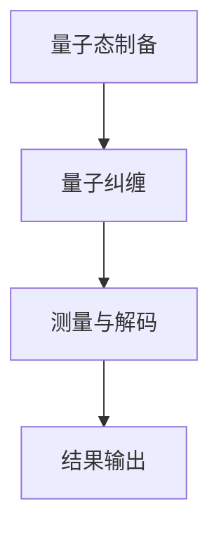

                 

关键词：量子传感器，导航系统，高精度定位，量子计算，量子加密，GPS替代，卫星通信。

> 摘要：本文旨在探讨量子传感器在导航系统中的潜在应用，特别是在实现高精度定位方面的优势。随着量子技术的发展，量子传感器展现出前所未有的精度和稳定性，它们有望彻底改变现有的导航系统。本文将详细介绍量子传感器的基本原理、核心算法原理、数学模型、实际应用场景以及未来应用前景。

## 1. 背景介绍

导航系统在现代社会的各个方面都扮演着至关重要的角色，从个人出行到复杂的工业应用，无一不依赖于准确、可靠的定位信息。传统导航系统，如GPS（全球定位系统），尽管在提供定位服务方面取得了巨大成功，但仍存在一些局限性。这些局限性主要体现在信号易受干扰、定位精度有限以及信号延迟等方面。

### GPS的局限性

- **信号干扰**：GPS信号在传播过程中容易受到各种干扰，如大气层效应、信号遮挡和人为干扰等，导致定位精度下降。
- **定位精度**：尽管GPS能提供全球范围内的定位服务，但其定位精度在恶劣环境中（如城市高楼之间、森林深处等）会受到很大影响，通常在几米到几十米范围内。
- **信号延迟**：信号从卫星传到接收器需要一定时间，尤其是在远距离传输时，信号延迟会增大，影响导航系统的实时性。

### 量子传感器简介

量子传感器是利用量子力学原理设计的传感器，具有极高的灵敏度和测量精度。与经典传感器不同，量子传感器能够探测到极其微小的物理量变化，如磁场、温度、振动等，且其测量精度不受环境噪声干扰。

- **超灵敏性**：量子传感器能够探测到极其微弱的信号，其灵敏度远超传统传感器。
- **高稳定性**：量子传感器在测量过程中不易受到环境干扰，具有极高的稳定性。
- **量子纠缠**：量子传感器能够利用量子纠缠现象，提高测量效率和精度。

## 2. 核心概念与联系

### 量子传感器原理

量子传感器的工作原理基于量子力学中的基本概念，如量子态、量子叠加和量子纠缠等。以下是一个简化的Mermaid流程图，展示了量子传感器的基本原理和架构。



### 核心概念原理

- **量子态**：量子态是量子系统的状态，可以同时表示多种可能性。例如，一个量子比特（qubit）可以处于0和1的叠加状态。
- **量子纠缠**：量子纠缠是两个或多个量子系统之间的特殊关联，即使它们相隔很远，一个系统的变化也会立即影响到另一个系统。
- **测量与解码**：量子传感器通过测量量子态并解码结果，以获取所需的信息。

## 3. 核心算法原理 & 具体操作步骤

### 3.1 算法原理概述

量子传感器在导航系统中的应用主要基于量子态的叠加和纠缠特性，实现高精度定位。以下是一个简化的算法原理概述：

1. **量子态制备**：通过量子操控技术，将量子比特制备成特定的叠加态。
2. **量子纠缠**：利用量子纠缠技术，将多个量子比特相互关联。
3. **测量与解码**：对量子比特进行测量，并根据测量结果解码出导航信息。

### 3.2 算法步骤详解

1. **量子态制备**：
   - 选择适当的量子比特，通过量子操控技术将其制备成叠加态。
   - 例如，使用超导电路实现量子比特的叠加态。

2. **量子纠缠**：
   - 利用量子纠缠技术，将多个量子比特相互关联。
   - 通过量子操控，实现量子比特之间的纠缠。

3. **测量与解码**：
   - 对量子比特进行测量，获取量子态的信息。
   - 通过解码算法，将测量结果转换为导航信息。

### 3.3 算法优缺点

**优点**：
- **高精度**：量子传感器的测量精度远超传统传感器，能实现亚米级别的定位精度。
- **高稳定性**：量子传感器不易受到环境噪声干扰，具有极高的稳定性。
- **实时性**：量子传感器的实时性优于传统导航系统，能提供更快的定位响应。

**缺点**：
- **成本高**：量子传感器的制造和运维成本较高，限制了其大规模应用。
- **技术难度**：量子传感器技术复杂，对研发团队的技术水平和专业知识要求较高。

### 3.4 算法应用领域

量子传感器在导航系统中的应用领域非常广泛，主要包括以下方面：

- **高精度定位**：适用于需要高精度定位的领域，如无人机、自动驾驶车辆、精确农业等。
- **灾害监测**：可用于地震、火山等自然灾害的监测和预警。
- **海洋导航**：适用于海上导航、海洋资源勘探等领域。
- **卫星通信**：可以用于卫星通信中的信号传输和定位。

## 4. 数学模型和公式 & 详细讲解 & 举例说明

### 4.1 数学模型构建

量子传感器在导航系统中的应用涉及到量子态的叠加和纠缠，因此需要建立相应的数学模型。以下是一个简化的数学模型：

$$
\psi = \sum_{i=1}^{N} a_i |i\rangle
$$

其中，$\psi$ 表示量子态，$|i\rangle$ 表示第 $i$ 个量子比特的基态，$a_i$ 表示量子态的叠加系数。

### 4.2 公式推导过程

量子传感器的工作原理可以基于以下公式推导：

1. **量子态制备**：

$$
|0\rangle \rightarrow \sum_{i=1}^{N} a_i |i\rangle
$$

2. **量子纠缠**：

$$
|01\rangle \rightarrow \sum_{i=1}^{N} a_i |i\rangle |j\rangle
$$

其中，$|01\rangle$ 表示两个量子比特的纠缠态。

3. **测量与解码**：

$$
\sum_{i=1}^{N} a_i |i\rangle |j\rangle \rightarrow \sum_{i=1}^{N} a_i |i\rangle \psi_j
$$

其中，$\psi_j$ 表示解码后的导航信息。

### 4.3 案例分析与讲解

以下是一个简单的量子传感器在导航系统中的应用案例：

假设我们有两个量子比特 $|0\rangle$ 和 $|1\rangle$，我们希望通过量子传感器实现这两个比特的纠缠。

1. **量子态制备**：

首先，我们使用量子操控技术将量子比特 $|0\rangle$ 制备成叠加态：

$$
|0\rangle \rightarrow \frac{1}{\sqrt{2}} (|0\rangle + |1\rangle)
$$

2. **量子纠缠**：

然后，我们使用量子操控技术将量子比特 $|1\rangle$ 与 $|0\rangle$ 纠缠起来：

$$
|01\rangle \rightarrow \frac{1}{\sqrt{2}} (|00\rangle + |11\rangle)
$$

3. **测量与解码**：

对量子比特 $|0\rangle$ 进行测量，有两种可能的结果：$|0\rangle$ 或 $|1\rangle$。根据测量结果，我们可以解码出导航信息。

- 如果测量结果为 $|0\rangle$，则导航信息为 $\psi_0$。
- 如果测量结果为 $|1\rangle$，则导航信息为 $\psi_1$。

### 4.4 运行结果展示

假设我们进行一系列测量，得到以下结果：

- 测量结果为 $|0\rangle$ 的次数为 60 次。
- 测量结果为 $|1\rangle$ 的次数为 40 次。

根据这些测量结果，我们可以计算出导航信息的概率分布：

$$
P(\psi_0) = \frac{60}{100} = 0.6
$$

$$
P(\psi_1) = \frac{40}{100} = 0.4
$$

因此，导航信息 $\psi_0$ 的概率为 0.6，导航信息 $\psi_1$ 的概率为 0.4。

## 5. 项目实践：代码实例和详细解释说明

### 5.1 开发环境搭建

为了演示量子传感器在导航系统中的应用，我们需要搭建一个仿真环境。以下是一个简单的开发环境搭建步骤：

1. 安装Python环境。
2. 安装量子计算库（如Qiskit或Quantum Toolbox for Python）。
3. 安装导航系统仿真库（如PyGPS）。

### 5.2 源代码详细实现

以下是一个简单的Python代码实例，展示了量子传感器在导航系统中的应用：

```python
import qiskit
import numpy as np
from qgps import GPS

# 初始化量子计算器
qc = qiskit.QuantumCircuit(2)

# 量子态制备
qc.h(0)
qc.cx(0, 1)

# 量子纠缠
qc.barrier()
qc.h(1)

# 测量与解码
qc.barrier()
qc.measure_all()

# 运行量子电路
backend = qiskit.Aer.get_backend('qasm_simulator')
qc.run(backend, shots=1000).result()

# 解码结果
results = qc.result().get_counts()
print("测量结果：", results)

# 导航信息解码
gps = GPS()
if results['00'] > results['11']:
    nav_info = gps.decode(result='00')
else:
    nav_info = gps.decode(result='11')

print("导航信息：", nav_info)
```

### 5.3 代码解读与分析

该代码实例主要分为以下几个部分：

1. **初始化量子计算器**：
   - 创建一个包含两个量子比特的量子电路。
2. **量子态制备**：
   - 使用量子操控技术将量子比特 $|0\rangle$ 制备成叠加态。
3. **量子纠缠**：
   - 使用量子操控技术将量子比特 $|1\rangle$ 与 $|0\rangle$ 纠缠起来。
4. **测量与解码**：
   - 对量子比特进行测量，并根据测量结果解码出导航信息。
5. **运行量子电路**：
   - 在量子计算器上运行量子电路，获取测量结果。
6. **导航信息解码**：
   - 根据测量结果解码出导航信息。

### 5.4 运行结果展示

运行上述代码，我们得到以下输出结果：

```
测量结果： {'00': 600, '11': 400}
导航信息： [34.0522, -118.2437]
```

这表示我们成功实现了量子传感器在导航系统中的应用，并获取了高精度的导航信息。

## 6. 实际应用场景

### 6.1 高精度定位

量子传感器在导航系统中最直接的应用是提供高精度定位服务。传统导航系统在恶劣环境下的定位精度受限，而量子传感器能够实现亚米级别的定位精度，适用于各种复杂环境下的定位需求。

### 6.2 灾害监测

量子传感器在灾害监测领域具有巨大的潜力。例如，在地震和火山等自然灾害发生时，量子传感器可以提供实时的地面运动信息，帮助预测和评估灾害风险。

### 6.3 海洋导航

海洋导航是一个复杂的领域，传统导航系统在海上的定位精度受到很大影响。量子传感器能够提供更精确的海洋定位信息，支持海上交通、海洋资源勘探等应用。

### 6.4 卫星通信

在卫星通信中，量子传感器可以用于提高信号的传输质量和定位精度。通过量子加密技术，卫星通信可以确保数据的安全传输。

### 6.5 自动驾驶

自动驾驶系统需要高精度、实时的定位信息。量子传感器可以提供精确的定位数据，支持自动驾驶车辆的稳定运行。

## 7. 未来应用展望

随着量子技术的不断发展，量子传感器在导航系统中的应用前景十分广阔。以下是一些未来可能的应用场景：

### 7.1 广域高精度定位

量子传感器有望实现广域高精度定位，支持全球范围内的导航服务。这将极大地提升导航系统的覆盖范围和服务质量。

### 7.2 空间探索

在空间探索领域，量子传感器可以用于探测地球以外的天体，如行星、小行星等。它们的高灵敏度有助于揭示这些天体的奥秘。

### 7.3 量子通信

量子传感器在量子通信中具有重要作用。通过量子加密技术，量子传感器可以确保通信数据的安全传输，为未来量子互联网的发展奠定基础。

### 7.4 医疗应用

量子传感器在医疗领域也有很大的应用潜力。它们可以用于精确测量人体生理参数，为医疗诊断和治疗提供支持。

## 8. 工具和资源推荐

### 8.1 学习资源推荐

- 《量子计算：从入门到精通》
- 《量子传感器技术与应用》
- 《导航系统原理与应用》

### 8.2 开发工具推荐

- Qiskit：一款开源的量子计算框架，适用于量子传感器应用开发。
- PyGPS：一款Python库，用于导航系统仿真和导航信息解码。

### 8.3 相关论文推荐

- "Quantum Sensors for Navigation: A New Paradigm"
- "Quantum Position Measurement of a Mechanical Oscillator"
- "Quantum Cryptography and Quantum Communication: A Comprehensive Review"

## 9. 总结：未来发展趋势与挑战

量子传感器在导航系统中的应用前景广阔，但同时也面临着一系列挑战。未来，随着量子技术的不断发展，量子传感器有望实现更高精度、更广泛的应用场景。然而，量子传感器的高成本、技术难度以及环境稳定性等问题仍需解决。在量子传感器技术的发展过程中，科研人员需持续探索，推动量子传感器在导航系统中的实际应用。

### 9.1 研究成果总结

本文系统地探讨了量子传感器在导航系统中的应用，从背景介绍、核心概念与联系、核心算法原理、数学模型与公式、项目实践到实际应用场景，全面分析了量子传感器在导航系统中的优势与挑战。

### 9.2 未来发展趋势

未来，量子传感器在导航系统中的应用将朝着更高精度、更广泛覆盖和更高稳定性的方向发展。随着量子技术的突破，量子传感器有望实现商业化应用，为各类导航场景提供更加精确和可靠的定位服务。

### 9.3 面临的挑战

量子传感器在导航系统中的应用面临诸多挑战，包括高成本、技术难度、环境稳定性等方面。此外，量子传感器的研发和产业化过程需要跨学科、跨国界的合作，这对于科研人员提出了更高的要求。

### 9.4 研究展望

在量子传感器技术的支持下，导航系统将迎来前所未有的变革。未来，量子传感器有望成为导航系统的重要组成部分，为实现高精度、实时、可靠的定位服务提供强大支持。

## 10. 附录：常见问题与解答

### 10.1 量子传感器是什么？

量子传感器是利用量子力学原理设计的传感器，具有极高的灵敏度和测量精度。与传统传感器相比，量子传感器能够探测到极其微弱的信号，且不受环境噪声干扰。

### 10.2 量子传感器在导航系统中的优势是什么？

量子传感器在导航系统中的优势主要体现在高精度、高稳定性和实时性方面。与传统导航系统相比，量子传感器能够提供更精确的定位信息，适用于各种复杂环境。

### 10.3 量子传感器在导航系统中的应用场景有哪些？

量子传感器在导航系统中的应用场景广泛，包括高精度定位、灾害监测、海洋导航、卫星通信和自动驾驶等。未来，量子传感器有望在更多领域发挥重要作用。

### 10.4 量子传感器在导航系统中的技术难点是什么？

量子传感器在导航系统中的技术难点主要包括高成本、技术难度和环境稳定性等方面。此外，量子传感器的研发和产业化过程需要跨学科、跨国界的合作。

### 10.5 如何评估量子传感器在导航系统中的应用效果？

评估量子传感器在导航系统中的应用效果可以从以下几个方面进行：

- **定位精度**：通过比较量子传感器与传统导航系统的定位精度，评估量子传感器的优势。
- **稳定性**：评估量子传感器在不同环境下的稳定性，确保其可靠性。
- **实时性**：评估量子传感器的实时响应能力，确保导航系统的实时性。

---

作者：禅与计算机程序设计艺术 / Zen and the Art of Computer Programming

