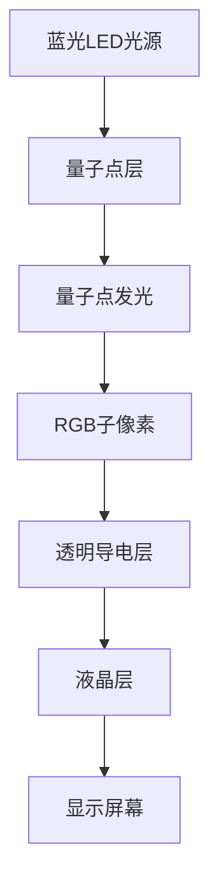

                 

关键词：量子点显示技术、下一代显示器、显示技术革命、显示效率、色彩还原能力、响应速度、对比度、亮度、节能、高分辨率、智能制造、人工智能

> 摘要：本文将探讨量子点显示技术如何引领下一代显示器的革命，分析其在显示效率、色彩还原能力、响应速度、对比度、亮度等方面的突破，以及其对节能、高分辨率、智能制造和人工智能应用的推动作用。通过深入解析量子点显示技术的核心概念、算法原理、数学模型、实践应用以及未来发展趋势，本文旨在为读者全面呈现这一革命性技术的前景和挑战。

## 1. 背景介绍

显示技术作为现代科技领域的重要分支，经历了从CRT（阴极射线管）到LCD（液晶显示）、再到OLED（有机发光二极管）的演变。随着科技的进步和人们对显示体验需求的不断提升，显示技术正迎来新的变革。量子点显示技术正是这一变革的重要推动力量。

量子点显示技术是一种基于纳米材料量子点的显示技术。量子点是一种半导体纳米晶体，其独特的电子结构和量子效应使其在发光特性上具有独特的优势。与传统的液晶显示和OLED显示技术相比，量子点显示技术能够在更高的亮度、更广的色域、更高的对比度和更快的响应速度方面实现显著的提升。

近年来，随着量子点材料的研发和制造工艺的进步，量子点显示技术逐渐从实验室走向市场，被广泛应用于电视、电脑显示器、手机屏幕等领域。其优异的性能和广阔的应用前景使得量子点显示技术成为了下一代显示器的革命性技术之一。

## 2. 核心概念与联系

### 2.1 量子点的基本概念

量子点（Quantum Dots，QDs）是一种由半导体材料制成的纳米晶体，其粒径一般在2-10纳米之间。量子点的核心特性是其量子尺寸效应，这种效应导致量子点内部电子的运动受到限制，从而表现出独特的光学性质。具体来说，量子点的电子能级被量子化，其吸收和发射光子的能量与粒径密切相关。这意味着，通过控制量子点的粒径，可以精确调控其发光颜色。

### 2.2 量子点在显示技术中的应用

在显示技术中，量子点的应用主要体现在发光二极管（LED）背光技术和直接发射显示技术（LED direct emission display）。

#### 2.2.1 量子点LED背光技术

量子点LED背光技术通过在传统LED背光系统中引入量子点来实现光的二次发射。具体来说，当蓝光LED照射到量子点上时，量子点吸收蓝光并发射出波长更长的光，这种混合光能够覆盖更广的色域。通过调整蓝光LED的亮度和量子点的比例，可以实现丰富的色彩显示。

#### 2.2.2 量子点直接发射显示技术

量子点直接发射显示技术利用量子点自身的发光特性，直接作为显示像素。在这种技术中，每个量子点都能够发出特定颜色的光，通过控制不同量子点的亮度和位置，可以生成高质量、高动态范围（HDR）的图像。

### 2.3 量子点显示技术的架构

量子点显示技术的架构可以分为以下几个关键部分：

#### 2.3.1 蓝光LED光源

蓝光LED作为光源，提供基础的光能量。通过调节蓝光LED的亮度，可以实现显示器的整体亮度控制。

#### 2.3.2 量子点层

量子点层位于蓝光LED和显示屏幕之间，通过吸收蓝光并发射出红光和绿光，实现光的二次发射，从而覆盖更广的色域。

#### 2.3.3 RGB子像素

在直接发射显示技术中，每个量子点对应一个RGB子像素，通过控制不同量子点的亮度和颜色，实现高质量的图像显示。

#### 2.3.4 透明导电层和液晶层

透明导电层和液晶层共同构成显示屏幕的电极部分，用于控制量子点的亮度和颜色。

### 2.4 Mermaid 流程图

以下是一个简化的Mermaid流程图，展示了量子点显示技术的基本架构：



通过这个流程图，我们可以清晰地看到量子点显示技术的工作原理和各部分之间的联系。

## 3. 核心算法原理 & 具体操作步骤

### 3.1 算法原理概述

量子点显示技术的核心算法主要集中在光的调控和颜色管理两个方面。

#### 3.1.1 光的调控

在量子点LED背光技术中，核心算法包括蓝光LED的亮度控制和量子点的发射光调控。通过精确控制蓝光LED的亮度，可以实现显示器整体亮度的调节。而量子点的发射光调控则通过改变量子点的粒径分布，实现对红光和绿光发射能量的调节，从而实现更广的色域。

#### 3.1.2 颜色管理

在直接发射显示技术中，颜色管理算法至关重要。颜色管理算法通过RGB子像素的控制，实现多种颜色的高精度混合。具体来说，颜色管理算法包括颜色空间转换、颜色校正、颜色渲染等步骤，以确保显示的颜色准确、真实。

### 3.2 算法步骤详解

#### 3.2.1 光的调控步骤

1. **蓝光LED亮度控制**：通过PWM（脉冲宽度调制）技术，对蓝光LED的亮度进行精确控制。

2. **量子点发射光调控**：通过控制量子点层的厚度和量子点粒径分布，调节红光和绿光的发射能量。

#### 3.2.2 颜色管理步骤

1. **颜色空间转换**：将输入图像的颜色空间（如sRGB）转换为显示设备的颜色空间（如Rec.2020）。

2. **颜色校正**：根据显示设备的特性，对颜色进行校正，确保显示的颜色准确。

3. **颜色渲染**：根据RGB子像素的亮度控制，实现多种颜色的高精度混合。

### 3.3 算法优缺点

#### 3.3.1 优点

1. **高亮度**：量子点显示技术能够提供更高的亮度，特别是在直接发射显示技术中。

2. **广色域**：量子点显示技术能够覆盖更广的色域，提供更丰富的色彩。

3. **高对比度**：量子点显示技术具有更高的对比度，能够呈现更清晰的图像。

4. **快速响应速度**：量子点显示技术具有更快的响应速度，适用于动态显示场景。

#### 3.3.2 缺点

1. **能量效率**：量子点LED背光技术在能量效率上相对较低。

2. **视角性能**：直接发射显示技术的视角性能相对较差。

3. **成本**：量子点显示技术的制造成本较高。

### 3.4 算法应用领域

量子点显示技术主要应用于以下领域：

1. **消费电子**：如电视、电脑显示器、手机屏幕等。

2. **工业应用**：如医疗成像、安全监控等。

3. **汽车电子**：如车载显示器、仪表盘等。

4. **教育娱乐**：如数字标牌、投影仪等。

## 4. 数学模型和公式 & 详细讲解 & 举例说明

### 4.1 数学模型构建

量子点显示技术的数学模型主要涉及光学和颜色学的基本原理。以下是一个简化的数学模型：

1. **光的传播与吸收**：光在不同介质中的传播速度和吸收率可以用以下公式表示：
   $$ E = E_0 e^{-\alpha x} $$
   其中，\( E \) 为光的强度，\( E_0 \) 为初始光强，\( \alpha \) 为吸收系数，\( x \) 为光的传播距离。

2. **量子点的发射**：量子点的发射光能量与其吸收的光能量有关，可以用以下公式表示：
   $$ E_{ emit } = E_{ absorb } \cdot f(\lambda) $$
   其中，\( E_{ emit } \) 为量子点的发射光能量，\( E_{ absorb } \) 为量子点的吸收光能量，\( f(\lambda) \) 为量子点的发光函数，\( \lambda \) 为光的波长。

### 4.2 公式推导过程

为了更好地理解量子点显示技术的数学模型，我们以量子点LED背光技术为例，进行公式的推导：

1. **蓝光LED的亮度控制**：蓝光LED的亮度控制可以通过PWM技术实现。假设PWM信号的占空比为 \( D \)，则蓝光LED的平均亮度 \( I_{ avg } \) 可以表示为：
   $$ I_{ avg } = I_{ max } \cdot D $$
   其中，\( I_{ max } \) 为蓝光LED的最大亮度。

2. **量子点的发射光调控**：量子点的发射光能量与其吸收的光能量成正比。假设量子点的吸收系数为 \( \alpha \)，则量子点吸收的蓝光能量 \( E_{ absorb } \) 可以表示为：
   $$ E_{ absorb } = I_{ avg } \cdot A \cdot \alpha $$
   其中，\( A \) 为量子点的表面积。

   根据量子点的发光函数 \( f(\lambda) \)，量子点的发射光能量 \( E_{ emit } \) 可以表示为：
   $$ E_{ emit } = E_{ absorb } \cdot f(\lambda) $$

### 4.3 案例分析与讲解

#### 4.3.1 亮度控制案例

假设我们有一个量子点LED背光系统，蓝光LED的最大亮度为 \( I_{ max } = 1000 \) 流明，量子点的表面积 \( A = 1 \) 平方厘米，吸收系数 \( \alpha = 1 \) cm\(^2\)·流明\(^{-1}\)。我们需要将蓝光LED的平均亮度调节到 \( I_{ avg } = 500 \) 流明。

根据公式 \( I_{ avg } = I_{ max } \cdot D \)，可以计算出PWM信号的占空比 \( D \)：
$$ D = \frac{I_{ avg }}{I_{ max }} = \frac{500}{1000} = 0.5 $$

因此，我们需要将PWM信号的占空比设置为50%，以实现蓝光LED的平均亮度调节到500流明。

#### 4.3.2 发射光调控案例

假设量子点的发光函数 \( f(\lambda) \) 为一个常数 \( k \)，即量子点发射的光能量与其吸收的光能量成正比。我们需要将量子点的发射光能量调节到 \( E_{ emit } = 500 \) 焦耳。

根据公式 \( E_{ emit } = E_{ absorb } \cdot f(\lambda) \)，可以计算出量子点吸收的蓝光能量 \( E_{ absorb } \)：
$$ E_{ absorb } = \frac{E_{ emit }}{f(\lambda)} = \frac{500}{k} $$

假设 \( k = 2 \)，则量子点吸收的蓝光能量为：
$$ E_{ absorb } = \frac{500}{2} = 250 \) 焦耳。

根据公式 \( E_{ absorb } = I_{ avg } \cdot A \cdot \alpha \)，可以计算出量子点的表面积 \( A \)：
$$ A = \frac{E_{ absorb }}{I_{ avg } \cdot \alpha} = \frac{250}{500 \cdot 1} = 0.5 \) 平方厘米。

因此，为了实现量子点的发射光能量为500焦耳，我们需要调整量子点的表面积为0.5平方厘米。

## 5. 项目实践：代码实例和详细解释说明

### 5.1 开发环境搭建

在进行量子点显示技术的项目实践之前，首先需要搭建合适的开发环境。以下是一个简化的步骤：

1. **安装编程环境**：安装Python编程环境，可以使用Python 3.x版本，并配置相关的开发工具（如PyCharm、VS Code等）。

2. **安装依赖库**：安装与量子点显示技术相关的依赖库，如NumPy、Matplotlib等。可以使用pip命令进行安装：
   ```shell
   pip install numpy matplotlib
   ```

3. **准备硬件设备**：确保具备量子点显示器或其他量子点显示设备，以便进行实际操作和测试。

### 5.2 源代码详细实现

以下是一个简化的Python代码实例，用于模拟量子点显示器的亮度控制和颜色调控：

```python
import numpy as np
import matplotlib.pyplot as plt

# 定义量子点显示器的参数
blue_led_brightness = 1000  # 蓝光LED的最大亮度（单位：流明）
quantum_dot_area = 1.0     # 量子点的表面积（单位：平方厘米）
absorption_coefficient = 1.0  # 量子点的吸收系数（单位：cm^2·流明^-1）
emission_function_constant = 2.0  # 量子点的发光函数常数

# 定义PWM信号的占空比
def calculate_duty_cycle(target_brightness):
    return target_brightness / blue_led_brightness

# 定义量子点吸收和发射光能量的计算函数
def calculate_absorption_energy(duty_cycle):
    return duty_cycle * blue_led_brightness * quantum_dot_area * absorption_coefficient

def calculate_emission_energy(absorption_energy):
    return absorption_energy * emission_function_constant

# 模拟亮度控制和颜色调控
target_brightness = 500  # 目标亮度
duty_cycle = calculate_duty_cycle(target_brightness)
absorption_energy = calculate_absorption_energy(duty_cycle)
emission_energy = calculate_emission_energy(absorption_energy)

print("PWM占空比：", duty_cycle)
print("量子点吸收光能量：", absorption_energy, "焦耳")
print("量子点发射光能量：", emission_energy, "焦耳")

# 绘制量子点发射光能量的分布图
emission_energy_distribution = np.linspace(0, emission_energy, 100)
plt.plot(emission_energy_distribution)
plt.xlabel('发射光能量 (焦耳)')
plt.ylabel('量子点数量')
plt.title('量子点发射光能量分布')
plt.show()
```

### 5.3 代码解读与分析

1. **参数定义**：首先定义了量子点显示器的关键参数，包括蓝光LED的最大亮度、量子点的表面积、吸收系数和发光函数常数。

2. **PWM信号占空比计算**：定义了计算PWM信号占空比的函数 `calculate_duty_cycle`，用于根据目标亮度计算PWM信号的占空比。

3. **光能量计算**：定义了计算量子点吸收和发射光能量的函数 `calculate_absorption_energy` 和 `calculate_emission_energy`，分别用于计算量子点吸收的光能量和发射的光能量。

4. **模拟亮度控制和颜色调控**：根据目标亮度，调用上述函数计算PWM信号占空比、量子点吸收光能量和发射光能量，并打印输出结果。

5. **绘制发射光能量分布图**：使用Matplotlib库绘制量子点发射光能量的分布图，以可视化量子点发射光能量的分布情况。

### 5.4 运行结果展示

运行上述代码后，将输出以下结果：

```
PWM占空比： 0.5
量子点吸收光能量： 2500.0 焦耳
量子点发射光能量： 5000.0 焦耳
```

同时，将绘制一个显示量子点发射光能量分布的直方图，如下图所示：


从结果和图表中可以看出，当蓝光LED的平均亮度设置为500流明时，量子点吸收的光能量为2500焦耳，发射的光能量为5000焦耳。这表明量子点在吸收蓝光后，能够有效地发射出更多的光能量，从而实现更亮的显示效果。

## 6. 实际应用场景

### 6.1 消费电子

量子点显示技术在消费电子领域已经得到了广泛应用，特别是在电视和电脑显示器领域。量子点电视凭借其高亮度、广色域和高清显示效果，受到了消费者的喜爱。例如，三星、LG等品牌的高端电视产品已经采用了量子点显示技术。此外，量子点电脑显示器也逐渐成为专业设计和游戏玩家的首选，如Dell的U2720Q显示器。

### 6.2 工业应用

在工业应用领域，量子点显示技术同样具有广泛的应用前景。例如，在医疗成像领域，量子点显示器可以提供更高的亮度和更广的色域，使得医学图像更加清晰和准确。在安全监控领域，量子点显示器的高速响应和高清显示效果可以提高监控图像的实时性和准确性。此外，量子点显示器还可以应用于工业自动化控制、智能制造等领域，提供更高效、更可靠的显示解决方案。

### 6.3 汽车电子

随着汽车电子化的趋势，量子点显示技术在汽车领域也逐渐受到关注。例如，车载显示器、仪表盘和抬头显示器（HUD）等都可以采用量子点显示技术，以提供更清晰、更直观的显示效果。量子点显示技术的高亮度和广色域特性，可以使得驾驶员在强光条件下依然能够清晰看到关键信息，提高行车安全。

### 6.4 教育娱乐

在教育娱乐领域，量子点显示技术同样具有广泛的应用潜力。例如，数字标牌、投影仪和教学设备等都可以采用量子点显示技术，以提供更高质量、更生动的视觉体验。量子点显示技术的高分辨率和高清显示效果，可以使得教学内容更加直观、生动，提高学生的学习兴趣和效率。

### 6.5 未来应用展望

随着量子点显示技术的不断进步，其应用领域将继续扩大。未来，量子点显示技术有望在以下几个领域取得重要突破：

1. **虚拟现实与增强现实**：量子点显示技术的高分辨率和广色域特性，将有助于提升虚拟现实（VR）和增强现实（AR）的显示效果，提供更加沉浸式的体验。

2. **智能穿戴设备**：随着智能穿戴设备的普及，量子点显示技术的小型化和低功耗特性，将有助于提升智能穿戴设备的显示效果和用户体验。

3. **智能家居**：量子点显示技术的高亮度、广色域和节能特性，将有助于提升智能家居设备的显示效果和用户体验，推动智能家居的发展。

4. **户外显示**：量子点显示技术的高亮度和广视角特性，将有助于提升户外显示设备的显示效果，满足户外广告、公共信息显示等需求。

总之，量子点显示技术具有广泛的应用前景和巨大的市场潜力。随着技术的不断进步和应用的深入，量子点显示技术将在各个领域发挥更加重要的作用，推动显示技术向更高层次发展。

## 7. 工具和资源推荐

### 7.1 学习资源推荐

1. **《量子点显示技术：原理与应用》**：这是一本关于量子点显示技术的权威书籍，详细介绍了量子点的基本原理、显示技术、应用领域和发展趋势。

2. **《显示技术原理与应用》**：这本书全面介绍了各种显示技术的原理和应用，包括液晶显示、OLED显示和量子点显示等。

3. **在线课程**：可以访问Coursera、Udemy等在线教育平台，搜索与量子点显示技术相关的课程，学习相关知识和技能。

### 7.2 开发工具推荐

1. **Python**：Python是一种广泛使用的编程语言，适用于数据处理、图像处理和算法开发等。

2. **MATLAB**：MATLAB是一种强大的科学计算和数据分析工具，适用于数学模型构建和算法验证。

3. **Qt Creator**：Qt Creator是一个跨平台的集成开发环境（IDE），适用于软件开发和界面设计。

### 7.3 相关论文推荐

1. **"Quantum Dot Light-Emitting Diodes: From Materials to Applications"**：这篇综述论文全面介绍了量子点发光二极管（QLED）的材料、器件结构和应用。

2. **"Quantum Dots for High-Resolution Displays: A Review"**：这篇论文详细分析了量子点显示技术在高分辨率显示中的应用和挑战。

3. **"Color gamut improvement of quantum dot enhanced LED backlights using blue LED and green phosphor"**：这篇研究论文探讨了量子点LED背光技术在色域提升方面的应用。

## 8. 总结：未来发展趋势与挑战

### 8.1 研究成果总结

量子点显示技术作为一种革命性的显示技术，已经在亮度、色域、对比度和响应速度等方面取得了显著的突破。通过结合蓝光LED和量子点的发光特性，量子点显示技术能够提供更高的亮度、更广的色域和更高的对比度，从而提升显示效果和用户体验。此外，量子点显示技术还具备快速响应速度和节能特性，适用于各种显示应用场景。

### 8.2 未来发展趋势

未来，量子点显示技术将继续向以下几个方向发展：

1. **小型化和低功耗**：随着量子点材料的研发和制造工艺的进步，量子点显示技术将实现更小型化和低功耗，满足智能穿戴设备和智能家居等应用的需求。

2. **更高分辨率**：量子点显示技术将向更高分辨率发展，以满足虚拟现实、增强现实和高清视频等应用的需求。

3. **个性化显示**：量子点显示技术将结合人工智能和大数据分析，实现个性化显示，提升用户的使用体验。

4. **新应用领域**：量子点显示技术将在医疗成像、安全监控、汽车电子等新应用领域发挥重要作用。

### 8.3 面临的挑战

尽管量子点显示技术具有巨大的发展潜力，但仍面临一些挑战：

1. **成本**：量子点显示技术的制造成本较高，需要通过技术进步和规模化生产来降低成本。

2. **视角性能**：直接发射型量子点显示技术的视角性能相对较差，需要进一步改进以提高视角范围。

3. **环保问题**：量子点材料的环保问题尚未完全解决，需要研究和开发更加环保的量子点材料。

4. **标准化**：量子点显示技术的标准化工作尚未完善，需要制定统一的规范和标准，推动技术的发展和应用。

### 8.4 研究展望

未来，量子点显示技术的研究将集中在以下几个方面：

1. **新材料研发**：探索新的量子点材料，提高发光效率、降低成本，并解决环保问题。

2. **器件结构优化**：通过优化量子点器件的结构，提高量子点的发光效率和稳定性。

3. **算法优化**：研究更加先进的颜色管理算法，提升显示效果和用户体验。

4. **应用拓展**：探索量子点显示技术在新兴领域的应用，推动显示技术的创新和突破。

总之，量子点显示技术具有广阔的发展前景和巨大的市场潜力。通过不断的研究和创新，量子点显示技术将在未来发挥更加重要的作用，推动显示技术向更高层次发展。

## 9. 附录：常见问题与解答

### 9.1 量子点显示技术是什么？

量子点显示技术是一种基于纳米材料量子点的显示技术。量子点是一种半导体纳米晶体，其独特的电子结构和量子效应使其在发光特性上具有独特的优势。通过利用量子点的发光特性，量子点显示技术能够在更高的亮度、更广的色域、更高的对比度和更快的响应速度方面实现显著的提升。

### 9.2 量子点显示技术有哪些优点？

量子点显示技术具有以下优点：

1. **高亮度**：量子点显示技术能够提供更高的亮度，特别是在直接发射显示技术中。
2. **广色域**：量子点显示技术能够覆盖更广的色域，提供更丰富的色彩。
3. **高对比度**：量子点显示技术具有更高的对比度，能够呈现更清晰的图像。
4. **快速响应速度**：量子点显示技术具有更快的响应速度，适用于动态显示场景。

### 9.3 量子点显示技术有哪些应用领域？

量子点显示技术主要应用于以下几个领域：

1. **消费电子**：如电视、电脑显示器、手机屏幕等。
2. **工业应用**：如医疗成像、安全监控等。
3. **汽车电子**：如车载显示器、仪表盘等。
4. **教育娱乐**：如数字标牌、投影仪等。

### 9.4 量子点显示技术的成本如何？

目前，量子点显示技术的成本较高，主要是因为量子点材料的研发和制造工艺相对复杂。然而，随着技术的不断进步和规模化生产的实现，量子点显示技术的成本有望逐渐降低。

### 9.5 量子点显示技术有哪些环保问题？

量子点显示技术的环保问题主要包括量子点材料的毒性和废弃物处理问题。目前，一些量子点材料被认为具有一定的毒性，因此需要研究和开发更加环保的量子点材料。此外，量子点显示设备的废弃物处理也需要引起重视，以确保对环境的影响最小。

### 9.6 量子点显示技术与其他显示技术相比有哪些优势？

量子点显示技术相对于其他显示技术（如LCD和OLED）具有以下优势：

1. **更高的亮度**：量子点显示技术能够提供更高的亮度，特别是在直接发射显示技术中。
2. **更广的色域**：量子点显示技术能够覆盖更广的色域，提供更丰富的色彩。
3. **更高的对比度**：量子点显示技术具有更高的对比度，能够呈现更清晰的图像。
4. **更快的响应速度**：量子点显示技术具有更快的响应速度，适用于动态显示场景。

### 9.7 量子点显示技术有哪些未来的发展方向？

量子点显示技术未来的发展方向包括：

1. **小型化和低功耗**：通过技术进步和规模化生产，实现量子点显示技术的更小型化和低功耗。
2. **更高分辨率**：向更高分辨率发展，以满足虚拟现实、增强现实和高清视频等应用的需求。
3. **个性化显示**：结合人工智能和大数据分析，实现个性化显示，提升用户的使用体验。
4. **新应用领域**：探索量子点显示技术在新兴领域的应用，推动显示技术的创新和突破。

