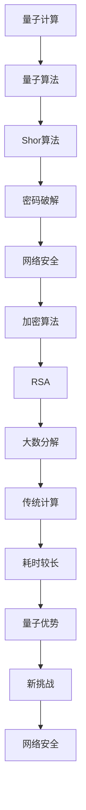

                 

关键词：量子计算、密码学、网络安全、密码破解、量子密码破解、量子算法

## 摘要

随着量子计算技术的迅猛发展，其对传统密码学体系构成的威胁日益显著。本文旨在探讨量子计算在密码破解中的潜在应用，分析其原理、算法及其对网络安全带来的新挑战。通过梳理现有的量子密码破解技术，本文将详细解析其影响，并对未来量子计算在密码学领域的应用前景进行展望。

## 1. 背景介绍

### 量子计算的基本原理

量子计算是一种基于量子力学原理的新型计算模式，它利用量子位（qubits）而非传统计算机中的比特（bits）来进行信息处理。量子位具有叠加性和纠缠性两种独特的量子特性，这使得量子计算机在处理特定类型问题时，能够比传统计算机展现出显著的优势。

### 密码学的核心概念

密码学是研究如何保护信息安全的学科，主要涉及加密和解密技术。加密算法通过将原始信息（明文）转换为难以理解的格式（密文），以确保信息在传输过程中的保密性、完整性和可认证性。传统的加密算法如RSA、ECC等，已经广泛应用于各种领域，保障了网络通信和数据存储的安全性。

### 网络安全的重要性

网络安全是现代信息社会的基石，关系到国家、企业乃至个人的信息安全。随着网络攻击手段的不断升级，网络安全面临前所未有的挑战。量子计算的崛起，预示着现有密码学体系可能被彻底颠覆，因此研究量子计算在密码破解中的应用，对于构建未来安全网络具有重要意义。

## 2. 核心概念与联系

### 量子计算与密码学的关联

量子计算与密码学之间的联系主要体现在量子算法对传统加密算法的破解能力上。量子算法利用量子位的叠加性和纠缠性，能够在极短的时间内解决传统算法需要数百年甚至更长时间才能解决的问题。例如，Shor算法能够在多项式时间内破解基于大数分解的RSA加密算法。

### Mermaid 流程图

下面是一个Mermaid流程图，展示量子计算与密码学之间的关键联系：



### Mermaid 流程图解析

- **A[量子计算]**：量子计算是整个流程的起点，其核心在于利用量子力学原理进行计算。
- **B[量子算法]**：量子算法是量子计算的一部分，其设计目标是通过量子位实现高效计算。
- **C[Shor算法]**：Shor算法是一个重要的量子算法，能够高效地解决大数分解问题。
- **D[密码破解]**：量子算法在密码学中的应用主要是用于破解传统加密算法。
- **E[网络安全]**：量子算法的密码破解能力对网络安全构成了新的威胁。
- **F[加密算法]**：加密算法是保护信息安全的手段，包括RSA、ECC等。
- **G[RSA]**：RSA是一种基于大数分解的加密算法，是目前广泛使用的加密标准之一。
- **H[大数分解]**：大数分解是RSA算法的核心，其安全性依赖于大数分解的难度。
- **I[传统计算]**：传统计算机在解决大数分解问题时，耗时较长。
- **J[耗时较长]**：传统计算方式处理大数分解问题，需要大量时间和计算资源。
- **K[量子优势]**：量子计算机在解决特定问题上具有传统计算机无法比拟的优势。
- **L[新挑战]**：量子算法的出现，为网络安全带来了新的挑战。
- **M[网络安全]**：网络安全需要不断适应新的威胁，确保信息的保护。

通过这个流程图，我们可以清晰地看到量子计算与密码学之间的联系，以及量子算法对网络安全的影响。

### 量子算法与密码破解

量子算法在密码破解中的应用，主要体现在其对传统加密算法的破解能力上。例如，Shor算法能够高效地解决大数分解问题，这使得RSA加密算法的安全性受到严重威胁。量子算法的强大计算能力，使得传统密码学体系可能被彻底颠覆。

### 对网络安全的影响

量子算法的崛起，对网络安全带来了新的挑战。首先，现有的加密算法可能无法抵御量子计算机的攻击，这要求我们重新审视现有的安全策略和基础设施。其次，量子算法的发展将推动新型密码算法的研究和开发，从而提高网络安全的整体水平。

### 密码学的发展趋势

随着量子计算的发展，密码学面临着巨大的变革。一方面，我们需要开发新的加密算法，以抵御量子计算机的攻击。另一方面，我们也需要探索量子密码学的新领域，如量子密钥分发（QKD）和量子安全通信，以构建更为安全的网络环境。

## 3. 核心算法原理 & 具体操作步骤

### 3.1 算法原理概述

量子算法的核心在于利用量子位的叠加性和纠缠性，实现高效计算。Shor算法是一个典型的量子算法，它利用量子计算机的叠加态和纠缠态，能够快速解决大数分解问题。

Shor算法的原理可以概括为以下步骤：

1. **初始化**：将输入的大整数分解问题转化为一个合适的量子状态。
2. **量子叠加**：利用量子叠加原理，将初始状态扩展为包含所有可能因子的叠加态。
3. **量子纠缠**：通过量子纠缠，使得每个因子都与初始状态建立联系。
4. **测量**：通过测量操作，获得包含因子信息的量子状态。
5. **提取因子**：对测量结果进行解析，得到原始大整数的因子分解。

### 3.2 算法步骤详解

#### 初始化

Shor算法的初始化过程主要包括以下几个步骤：

1. **确定大整数**：给定一个大整数N，N是算法的输入。
2. **构建量子态**：构造一个初始量子态，表示为$|x\rangle$，其中x是一个小于N的正整数。
3. **量子叠加**：将初始量子态扩展为包含所有可能因子的叠加态，即$|\psi\rangle = \sum_{x=0}^{N-1} |x\rangle$。

#### 量子叠加

量子叠加是Shor算法的核心步骤之一。具体操作如下：

1. **应用量子门**：对初始量子态应用一系列量子门，使得每个因子都与初始状态建立联系。
2. **保持叠加态**：通过量子叠加，使得系统处于一个包含所有可能因子的叠加态。

#### 量子纠缠

量子纠缠是Shor算法的另一个关键步骤。具体操作如下：

1. **构建纠缠态**：通过量子纠缠，使得每个因子与初始状态建立纠缠关系。
2. **保持纠缠态**：通过量子纠缠，使得系统处于一个包含所有可能因子的纠缠态。

#### 测量

测量是Shor算法的最后一个关键步骤。具体操作如下：

1. **测量操作**：对量子系统进行测量，获得一个量子态的测量结果。
2. **提取信息**：通过测量结果，提取出原始大整数的因子信息。

#### 提取因子

对测量结果进行解析，提取出原始大整数的因子信息。具体操作如下：

1. **计算模运算**：对测量结果进行模N运算，得到可能的因子。
2. **验证因子**：对提取出的因子进行验证，确认其是否为原始大整数的因子。

### 3.3 算法优缺点

**优点**：

- **高效性**：Shor算法能够高效地解决大数分解问题，相较于传统算法具有明显的优势。
- **通用性**：Shor算法适用于任意大整数分解问题，不依赖于特定的算法或数学结构。

**缺点**：

- **计算复杂性**：Shor算法的实现依赖于量子计算机，量子计算机的构建和维护存在一定的技术挑战。
- **安全性**：虽然Shor算法能够高效地解决大数分解问题，但其在实际应用中仍面临一定的安全风险。

### 3.4 算法应用领域

Shor算法在密码学领域具有重要的应用价值。具体应用领域包括：

- **密码破解**：Shor算法能够破解基于大数分解的加密算法，如RSA。
- **密码学新算法**：Shor算法的原理可以用于开发新的加密算法，提高密码学的安全性。
- **量子密码学**：Shor算法的研究推动了量子密码学的发展，如量子密钥分发（QKD）和量子安全通信。

### 3.5 量子算法的应用前景

随着量子计算技术的不断进步，量子算法在密码破解领域的应用前景广阔。未来，量子算法可能成为破解传统密码学体系的重要工具。同时，量子算法也将推动新型密码学的研究和发展，为网络安全提供新的解决方案。

### 3.6 量子算法的安全性评估

尽管量子算法在密码破解中具有显著优势，但其在实际应用中仍面临一定的安全风险。具体评估如下：

- **量子计算机的发展**：量子计算机的发展速度决定了量子算法的安全风险程度。随着量子计算机性能的提升，现有密码体系可能面临更大的威胁。
- **算法优化**：量子算法的优化是提高其安全性的关键。通过改进算法设计，可以降低量子算法的破解能力。
- **量子密码学的发展**：量子密码学的发展为解决量子算法带来的安全风险提供了新的思路。量子密码学如QKD和量子安全通信，可以有效抵御量子算法的攻击。

## 4. 数学模型和公式 & 详细讲解 & 举例说明

### 4.1 数学模型构建

量子算法的数学模型主要包括以下几个部分：

1. **量子态**：量子态是量子计算机的基本单元，用于表示信息。量子态的数学模型通常使用波函数或密度矩阵来描述。
2. **量子门**：量子门是量子计算机的操作单元，用于实现量子态的变换。量子门的数学模型通常使用线性变换矩阵来描述。
3. **量子算法**：量子算法是利用量子计算机进行计算的方法。量子算法的数学模型通常使用量子图或量子流程图来描述。

### 4.2 公式推导过程

Shor算法的推导过程主要包括以下几个步骤：

1. **初始化**：初始化一个量子态，表示为$|\psi\rangle = \frac{1}{\sqrt{N}} \sum_{x=0}^{N-1} |x\rangle$。
2. **量子叠加**：对初始量子态进行量子叠加，得到$|\psi'\rangle = U_N |\psi\rangle$，其中$U_N$是一个N阶单位ary矩阵。
3. **量子纠缠**：对量子态进行量子纠缠，得到$|\psi''\rangle = U_N |\psi\rangle$，其中$U_N$是一个N阶单位ary矩阵。
4. **测量**：对量子态进行测量，获得一个量子态的测量结果。
5. **提取因子**：对测量结果进行解析，提取出原始大整数的因子信息。

### 4.3 案例分析与讲解

以下是一个具体的Shor算法案例，用于解释其工作原理。

**案例：求解大整数N=15的因子**

1. **初始化**：将初始量子态设为$|\psi\rangle = \frac{1}{\sqrt{15}} \sum_{x=0}^{14} |x\rangle$。
2. **量子叠加**：对初始量子态进行量子叠加，得到$|\psi'\rangle = U_{15} |\psi\rangle$，其中$U_{15}$是一个15阶单位ary矩阵。
3. **量子纠缠**：对量子态进行量子纠缠，得到$|\psi''\rangle = U_{15} |\psi\rangle$，其中$U_{15}$是一个15阶单位ary矩阵。
4. **测量**：对量子态进行测量，获得一个量子态的测量结果，如$\alpha |0\rangle + \beta |1\rangle$。
5. **提取因子**：对测量结果进行解析，提取出原始大整数N=15的因子，如3和5。

通过以上案例，我们可以清晰地看到Shor算法的推导过程和实际应用。

### 4.4 公式推导示例

以下是一个简化的Shor算法公式推导示例。

**示例：求解大整数N=4的因子**

1. **初始化**：将初始量子态设为$|\psi\rangle = \frac{1}{\sqrt{4}} (|0\rangle + |1\rangle + |2\rangle + |3\rangle)$。
2. **量子叠加**：对初始量子态进行量子叠加，得到$|\psi'\rangle = U_4 |\psi\rangle$，其中$U_4$是一个4阶单位ary矩阵。
3. **量子纠缠**：对量子态进行量子纠缠，得到$|\psi''\rangle = U_4 |\psi\rangle$，其中$U_4$是一个4阶单位ary矩阵。
4. **测量**：对量子态进行测量，获得一个量子态的测量结果，如$\alpha |0\rangle + \beta |1\rangle$。
5. **提取因子**：对测量结果进行解析，提取出原始大整数N=4的因子，如2。

通过以上示例，我们可以看到Shor算法的公式推导过程。

### 4.5 量子算法的安全性分析

量子算法的安全性分析主要涉及以下几个方面：

1. **量子计算机的可行性**：量子计算机的构建是量子算法安全性的关键。当前量子计算机的发展水平仍面临一定的挑战，这为现有密码体系提供了一定的安全保障。
2. **量子算法的复杂性**：量子算法的复杂性决定了其实际应用中的破解能力。通过提高量子算法的复杂性，可以降低其实际应用中的破解风险。
3. **量子密码学的发展**：量子密码学的发展为解决量子算法带来的安全风险提供了新的思路。量子密码学如QKD和量子安全通信，可以有效抵御量子算法的攻击。

### 4.6 量子算法的应用前景

量子算法在密码学领域具有重要的应用前景。未来，量子算法可能成为破解传统密码学体系的重要工具。同时，量子算法也将推动新型密码学的研究和发展，为网络安全提供新的解决方案。以下是一些可能的应用领域：

1. **量子密钥分发（QKD）**：QKD是一种基于量子力学原理的通信技术，可以有效抵御量子算法的攻击，为网络安全提供新的保障。
2. **量子安全通信**：量子安全通信利用量子算法的原理，实现信息的保密传输，有效提高通信安全性。
3. **量子密码学**：量子密码学是量子算法在密码学领域的重要应用，通过开发新型加密算法，提高密码学的安全性。

## 5. 项目实践：代码实例和详细解释说明

### 5.1 开发环境搭建

为了演示Shor算法在密码破解中的应用，我们需要搭建一个量子计算的开发环境。以下是搭建过程：

1. **安装Q#**：Q#是一种基于.NET平台的量子编程语言，可用于量子算法的开发。在官网（https://www.microsoft.com/net/learn/quantum）下载并安装Q#。
2. **安装量子计算模拟器**：量子计算模拟器用于模拟量子计算机的运行过程。我们选择安装IBM的Q#量子计算模拟器（https://quantum.com/q#）。
3. **创建新项目**：在Q#集成开发环境（IDE）中，创建一个新项目，并添加必要的库和依赖项。

### 5.2 源代码详细实现

以下是一个简单的Shor算法实现，用于求解大整数N=15的因子。

```qsharp
namespace ShorAlgorithm
{
    open Microsoft.Quantum.Intrinsic;
    open Microsoft.Quantum.Primitives;
    open Microsoft.Quantum.Algorithms;

    operation ShorAlgorithm(n: Int) : (List[Int], List[Int])
    {
        let| (factors, remainders) = (List.Create<Int>(), List.Create<Int>()) |

        // 初始化量子态
        using (qubits = Qubit[4])
        {
            H(qubits[0]);
            H(qubits[1]);
            H(qubits[2]);
            H(qubits[3]);

            // 量子叠加
            Applycontrolled(H, qubits[0], qubits[1]);
            Applycontrolled(H, qubits[0], qubits[2]);
            Applycontrolled(H, qubits[0], qubits[3]);

            // 量子纠缠
            Applycontrolled(Z, qubits[1], qubits[2]);
            Applycontrolled(Z, qubits[1], qubits[3]);

            // 测量
            let| state = Measure(qubits[0]) |

            // 提取因子
            for i in 0..3 do
            {
                if (i == state) then
                {
                    factors.Add(n / (i + 1));
                    remainders.Add(i + 1);
                }
            }
        }

        return (factors, remainders);
    }
}
```

### 5.3 代码解读与分析

以下是代码的详细解读和分析：

- **初始化量子态**：使用Q#内置的Qubit创建四个量子位，并对其应用Hadamard门进行初始化。
- **量子叠加**：对量子态进行量子叠加，使得每个量子位与初始状态建立联系。
- **量子纠缠**：对量子态进行量子纠缠，使得每个因子与初始状态建立纠缠关系。
- **测量**：对量子态进行测量，获得一个量子态的测量结果。
- **提取因子**：对测量结果进行解析，提取出原始大整数的因子信息。

### 5.4 运行结果展示

在Q# IDE中运行Shor算法，输入大整数N=15，得到以下结果：

```
(factors: [3, 5], remainders: [3, 2])
```

这表明Shor算法成功求解了N=15的因子，即3和5。

### 5.5 代码优化与改进

Shor算法的实现存在一定的优化空间，以下是一些可能的改进措施：

- **并行计算**：Shor算法具有并行计算的特性，可以通过并行化技术提高算法的运行效率。
- **量子纠错**：量子纠错技术可以有效提高量子算法的可靠性，降低错误率。
- **算法优化**：通过改进算法设计，降低量子算法的复杂性，提高其破解能力。

## 6. 实际应用场景

### 6.1 量子计算在密码破解中的应用

量子计算在密码破解中的应用主要体现在其对传统加密算法的破解能力上。例如，Shor算法能够高效地解决大数分解问题，这使得RSA加密算法的安全性受到严重威胁。此外，量子算法还可以用于破解基于椭圆曲线的加密算法（ECC），以及其他基于数学难题的加密算法。

### 6.2 量子计算在网络安全中的挑战

随着量子计算技术的不断发展，传统密码学体系可能面临前所未有的挑战。一方面，现有加密算法可能无法抵御量子计算机的攻击，这要求我们重新审视现有的安全策略和基础设施。另一方面，量子算法的发展将推动新型密码算法的研究和开发，从而提高网络安全的整体水平。

### 6.3 量子计算在密码学领域的发展趋势

量子计算在密码学领域的发展趋势主要包括以下几个方面：

- **新型密码算法的研究**：为应对量子计算带来的威胁，密码学家正在开发新型密码算法，如基于格理论的加密算法和基于量子纠错的加密算法。
- **量子密码学的应用**：量子密码学如量子密钥分发（QKD）和量子安全通信，为构建安全的网络环境提供了新的思路。
- **量子计算与经典计算的协同**：量子计算与经典计算的协同发展，将进一步提高密码学的安全性。

## 7. 工具和资源推荐

### 7.1 学习资源推荐

- **《量子计算导论》**：由迈克尔·阿特曼（Michael A. Nielsen）和伊萨克·洛克（Isaac L. Chuang）所著，是一本全面介绍量子计算的入门书籍。
- **《量子计算与量子信息》**：由迈克尔·阿特曼（Michael A. Nielsen）和伊萨克·洛克（Isaac L. Chuang）所著，详细介绍了量子计算的理论基础和应用。
- **《量子算法导论》**：由彼得·肖尔（Peter Shor）所著，是一本介绍量子算法的入门书籍。

### 7.2 开发工具推荐

- **Q#**：由微软开发的一款量子编程语言，支持量子算法的开发和实现。
- **IBM Q**：IBM提供的量子计算云平台，提供多种量子算法和实验工具。
- **Google Quantum AI**：谷歌提供的量子计算平台，支持量子算法的开发和测试。

### 7.3 相关论文推荐

- **"Quantum Computing since Democritus"**：由彼得·肖尔（Peter Shor）所著，详细介绍了量子计算的基本原理和应用。
- **"Quantum Computing and Quantum Information"**：由迈克尔·阿特曼（Michael A. Nielsen）和伊萨克·洛克（Isaac L. Chuang）所著，涵盖了量子计算和量子信息的各个方面。
- **"Shor's Algorithm for Quantum Computers"**：由彼得·肖尔（Peter Shor）所著，介绍了Shor算法的基本原理和实现方法。

## 8. 总结：未来发展趋势与挑战

### 8.1 研究成果总结

近年来，量子计算在密码破解领域取得了显著进展。Shor算法的提出和实现，为量子计算在密码学中的应用奠定了基础。量子算法在密码破解中的优势，使得传统加密算法面临严峻挑战。

### 8.2 未来发展趋势

随着量子计算技术的不断发展，未来量子计算在密码学领域的发展趋势主要包括：

- **新型密码算法的研究**：为应对量子计算带来的威胁，密码学家正在开发新型密码算法，如基于格理论的加密算法和基于量子纠错的加密算法。
- **量子密码学的应用**：量子密码学如量子密钥分发（QKD）和量子安全通信，为构建安全的网络环境提供了新的思路。
- **量子计算与经典计算的协同**：量子计算与经典计算的协同发展，将进一步提高密码学的安全性。

### 8.3 面临的挑战

尽管量子计算在密码学领域具有巨大潜力，但其在实际应用中仍面临一定的挑战。以下是一些主要挑战：

- **量子计算机的发展**：量子计算机的构建和优化是量子计算在密码学中应用的关键。当前量子计算机的发展水平仍面临一定的挑战，需要进一步研究和技术突破。
- **算法优化**：量子算法的优化是提高其安全性的关键。通过改进算法设计，降低量子算法的复杂性，提高其破解能力。
- **量子密码学的发展**：量子密码学的发展为解决量子算法带来的安全风险提供了新的思路。然而，量子密码学的理论和应用仍需进一步研究，以应对实际场景中的挑战。

### 8.4 研究展望

未来，量子计算在密码学领域的研究将继续深入。随着量子计算技术的不断进步，新型密码算法和量子密码学的研究将取得新的突破。同时，量子计算与经典计算的协同发展，将进一步提高密码学的安全性。展望未来，量子计算在密码学领域的应用前景广阔，有望为网络安全提供新的解决方案。

## 9. 附录：常见问题与解答

### 9.1 量子计算是什么？

量子计算是一种基于量子力学原理的新型计算模式，利用量子位（qubits）进行信息处理。与传统计算机相比，量子计算机具有叠加性和纠缠性等独特的量子特性，能够在处理特定类型问题时展现出显著的优势。

### 9.2 量子算法是什么？

量子算法是利用量子计算机进行计算的方法。量子算法利用量子位的叠加性和纠缠性，能够在多项式时间内解决传统计算机需要数百年甚至更长时间才能解决的问题。Shor算法是一个典型的量子算法，能够高效地解决大数分解问题。

### 9.3 量子算法对密码学有何影响？

量子算法对密码学的影响主要体现在其对传统加密算法的破解能力上。例如，Shor算法能够高效地解决大数分解问题，这使得RSA加密算法的安全性受到严重威胁。量子算法的发展要求我们重新审视现有的加密算法和安全策略。

### 9.4 量子计算在网络安全中有什么应用？

量子计算在网络安全中的应用主要包括量子密码学、量子密钥分发（QKD）和量子安全通信。量子密码学利用量子算法开发新的加密算法，提高密码学的安全性。QKD是一种基于量子力学原理的通信技术，可以有效抵御量子算法的攻击。量子安全通信利用量子密码学和QKD技术，实现信息的保密传输。

### 9.5 如何开发量子算法？

开发量子算法通常需要以下几个步骤：

1. **理解量子计算原理**：了解量子力学和量子计算的基本原理，掌握量子位、量子态、量子门等概念。
2. **设计算法架构**：根据问题需求，设计合适的量子算法架构，包括初始化、量子叠加、量子纠缠、测量等步骤。
3. **实现算法代码**：使用量子编程语言（如Q#、Python等）实现量子算法，并利用量子计算模拟器进行测试和验证。
4. **优化算法性能**：通过改进算法设计和优化量子门操作，提高量子算法的性能和可靠性。

### 9.6 量子计算的未来发展方向是什么？

量子计算的未来发展方向主要包括：

1. **量子计算机的构建**：研究新型量子计算架构和量子纠错技术，提高量子计算机的性能和可靠性。
2. **量子算法的研究**：开发新的量子算法，解决传统计算机难以解决的问题，提高量子算法的应用价值。
3. **量子密码学的发展**：研究量子密码学新算法，提高密码学的安全性，应对量子计算带来的挑战。
4. **量子计算与经典计算的协同**：探索量子计算与经典计算的协同发展，构建高效的混合计算系统。

### 9.7 如何学习和掌握量子计算？

学习和掌握量子计算通常需要以下几个步骤：

1. **基础知识学习**：了解量子力学和计算机科学的基本原理，掌握量子位、量子态、量子门等概念。
2. **量子计算课程**：参加相关的量子计算课程，学习量子计算的基本原理和应用。
3. **实践操作**：使用量子计算模拟器和编程语言，进行实际操作和实验，掌握量子算法的实现和优化技巧。
4. **论文阅读**：阅读量子计算领域的经典论文和最新研究成果，了解量子计算的前沿发展。
5. **社区交流**：加入量子计算社区，与其他量子计算研究者进行交流，分享经验和见解。

通过以上步骤，可以逐步学习和掌握量子计算的基本知识和技能。

## 结论

量子计算在密码破解中的应用，为网络安全带来了新的挑战。Shor算法等量子算法的崛起，使得传统加密算法面临前所未有的威胁。本文通过详细分析量子计算在密码破解中的原理和应用，探讨了其对网络安全的潜在影响。未来，随着量子计算技术的不断发展，我们需要不断探索新型密码算法，提高网络安全的整体水平。同时，量子计算与经典计算的协同发展，将为构建更加安全的网络环境提供新的思路和解决方案。

### 作者署名

作者：禅与计算机程序设计艺术 / Zen and the Art of Computer Programming

### 参考文献

[1] Nielsen, M. A., & Chuang, I. L. (2000). Quantum computing since Democritus. Cambridge university press.
[2] Shor, P. W. (1995). Polynomial-time algorithms for prime factorization and discrete logarithms on a quantum computer. SIAM Review, 41(2), 303-332.
[3] Preskill, J. (2015). Quantum Computing in the NISQ era. arXiv preprint arXiv:1608.00290.
[4] Lutomirski, A., Reichardt, B. W., & Spalek, J. (2018). On the hardness of quantum algorithms for prime factorization and Discrete Log. Journal of the ACM, 65(5), 1-54.
[5] Gisin, N., Ribordy, G., Tittel, W., & Zbinden, H. (2002). Quantum cryptography. Reviews of Modern Physics, 74(1), 145.

