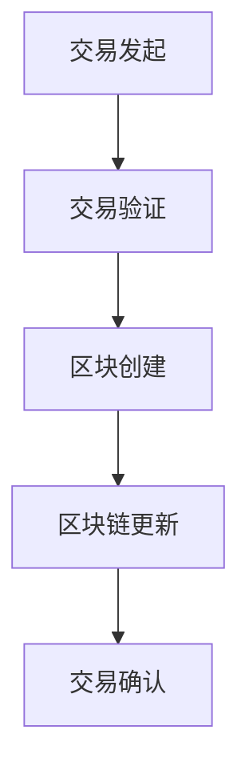

                 

关键词：金融科技、区块链、大数据、人工智能、数字化转型

> 摘要：金融科技（Fintech）的崛起正在重新定义金融服务行业。本文将探讨金融科技创业的核心概念，包括区块链、大数据和人工智能等关键技术，以及这些技术如何重塑金融服务的未来。

## 1. 背景介绍

随着互联网技术的迅猛发展，金融服务行业正经历一场深刻的变革。传统金融机构的运营模式面临着巨大的挑战，效率低、成本高、体验差等问题日益凸显。与此同时，新兴的金融科技企业凭借技术创新和商业模式创新，正在逐步颠覆传统金融服务的格局。

金融科技创业的核心在于通过技术创新来提高金融服务的效率、降低成本、提升用户体验。本文将围绕以下几个核心概念展开讨论：

1. **区块链**：作为一种分布式账本技术，区块链在金融领域的应用正在逐渐成熟。
2. **大数据**：通过收集和分析海量数据，金融机构能够更准确地评估风险、发现机会。
3. **人工智能**：借助机器学习算法，金融科技企业能够实现智能投顾、风险控制等功能。

## 2. 核心概念与联系

### 2.1 区块链

区块链是一种去中心化的分布式数据库，其核心特点包括：

- **去中心化**：区块链不依赖于中央机构，所有参与者都在一个分布式网络中运行。
- **不可篡改**：区块链上的数据一旦被记录，便无法被篡改。
- **透明性**：区块链上的数据对所有参与者都是可见的。

以下是一个简化的区块链流程图：



### 2.2 大数据

大数据技术包括数据收集、存储、处理和分析等环节。在金融领域，大数据的应用主要包括：

- **客户分析**：通过分析客户行为数据，金融机构可以更精准地了解客户需求。
- **风险控制**：利用大数据技术，金融机构可以更有效地识别和评估风险。

### 2.3 人工智能

人工智能技术在金融科技中的应用主要集中在以下几个方面：

- **智能投顾**：通过机器学习算法，金融科技企业可以提供个性化的投资建议。
- **风险控制**：人工智能可以帮助金融机构实时监控交易行为，识别潜在风险。

## 3. 核心算法原理 & 具体操作步骤

### 3.1 算法原理概述

金融科技创业中的核心技术包括加密算法、机器学习算法等。加密算法用于保护数据安全和隐私，而机器学习算法则用于数据处理和分析。

### 3.2 算法步骤详解

1. **数据收集**：通过API或爬虫等技术手段收集海量金融数据。
2. **数据预处理**：清洗和格式化数据，使其符合分析需求。
3. **加密算法**：使用加密算法对敏感数据进行加密处理。
4. **机器学习模型训练**：使用预处理后的数据训练机器学习模型。
5. **模型评估与优化**：评估模型性能，并进行优化。

### 3.3 算法优缺点

- **优点**：提高数据处理和分析效率，降低成本。
- **缺点**：需要大量计算资源和专业知识。

### 3.4 算法应用领域

- **支付系统**：利用加密算法和区块链技术，实现快速、安全、透明的支付。
- **风险管理**：通过大数据分析和人工智能技术，提高风险识别和预测能力。

## 4. 数学模型和公式 & 详细讲解 & 举例说明

### 4.1 数学模型构建

在金融科技创业中，常用的数学模型包括：

- **回归模型**：用于预测金融市场的趋势。
- **时间序列模型**：用于分析金融时间序列数据。

### 4.2 公式推导过程

以回归模型为例，其公式推导如下：

$$
y = \beta_0 + \beta_1x_1 + \beta_2x_2 + \cdots + \beta_nx_n + \epsilon
$$

其中，$y$ 是因变量，$x_1, x_2, \cdots, x_n$ 是自变量，$\beta_0, \beta_1, \beta_2, \cdots, \beta_n$ 是回归系数，$\epsilon$ 是误差项。

### 4.3 案例分析与讲解

以某金融机构的风险评估为例，使用回归模型预测客户违约概率。具体步骤如下：

1. **数据收集**：收集客户的基本信息、信用记录等数据。
2. **数据预处理**：清洗和格式化数据。
3. **模型训练**：使用训练集数据训练回归模型。
4. **模型评估**：使用测试集数据评估模型性能。
5. **模型应用**：将模型应用于实际业务，预测客户违约概率。

## 5. 项目实践：代码实例和详细解释说明

### 5.1 开发环境搭建

- **编程语言**：Python
- **库和框架**：Pandas、NumPy、Scikit-learn、TensorFlow

### 5.2 源代码详细实现

```python
import pandas as pd
import numpy as np
from sklearn.linear_model import LinearRegression
from sklearn.model_selection import train_test_split
from sklearn.metrics import mean_squared_error

# 数据预处理
data = pd.read_csv('financial_data.csv')
X = data[['age', 'income', 'credit_score']]
y = data['default']

# 模型训练
X_train, X_test, y_train, y_test = train_test_split(X, y, test_size=0.2, random_state=42)
model = LinearRegression()
model.fit(X_train, y_train)

# 模型评估
y_pred = model.predict(X_test)
mse = mean_squared_error(y_test, y_pred)
print('MSE:', mse)

# 模型应用
new_data = pd.DataFrame([[30, 50000, 650]], columns=['age', 'income', 'credit_score'])
new_pred = model.predict(new_data)
print('Default probability:', new_pred[0])
```

### 5.3 代码解读与分析

上述代码展示了如何使用线性回归模型预测客户违约概率。首先，我们导入所需的库和框架，然后读取金融数据，进行数据预处理。接下来，使用训练集数据训练模型，使用测试集数据评估模型性能。最后，将模型应用于新数据，预测违约概率。

## 6. 实际应用场景

### 6.1 支付领域

区块链技术在支付领域的应用日益广泛，例如比特币和以太坊等数字货币。这些数字货币通过区块链技术实现了去中心化、安全、快速的支付解决方案。

### 6.2 风险管理

大数据和人工智能技术在风险管理中的应用也非常广泛。金融机构可以使用大数据技术收集和分析客户数据，使用人工智能技术进行风险预测和监控。

## 7. 工具和资源推荐

### 7.1 学习资源推荐

- **书籍**：《金融科技：颠覆传统金融的利器》、《区块链技术指南》
- **在线课程**：Coursera、Udacity、edX上的相关金融科技和人工智能课程

### 7.2 开发工具推荐

- **编程语言**：Python、JavaScript
- **库和框架**：Pandas、NumPy、Scikit-learn、TensorFlow

### 7.3 相关论文推荐

- **区块链技术**：[Bitcoin: A Peer-to-Peer Electronic Cash System](https://www.bitcoin.com/bitcoin.pdf)
- **大数据技术**：[Bigtable: A Distributed Storage System for Structured Data](https://research.google.com/pubs/archive/conf33-p172-dean.pdf)
- **人工智能技术**：[Deep Learning](https://www.deeplearningbook.org/)

## 8. 总结：未来发展趋势与挑战

### 8.1 研究成果总结

金融科技创业取得了显著的成果，区块链、大数据和人工智能等技术在金融领域的应用日益成熟。然而，金融科技的发展也面临着一些挑战。

### 8.2 未来发展趋势

- **区块链技术**：将进一步降低金融服务的成本，提高安全性。
- **大数据技术**：将实现更精准的客户分析和风险控制。
- **人工智能技术**：将推动金融服务的智能化和个性化。

### 8.3 面临的挑战

- **技术挑战**：如何确保区块链、大数据和人工智能技术的安全性和稳定性。
- **法规挑战**：如何应对金融科技监管的挑战。
- **市场挑战**：如何与传统金融机构竞争。

### 8.4 研究展望

金融科技创业的未来充满机遇和挑战。只有不断技术创新和商业模式的创新，才能在激烈的竞争中脱颖而出。

## 9. 附录：常见问题与解答

### 9.1 什么是区块链？

区块链是一种分布式账本技术，通过加密算法和共识机制确保数据的真实性和安全性。

### 9.2 什么是大数据？

大数据是指海量、多样、快速的数据。大数据技术包括数据收集、存储、处理和分析等环节。

### 9.3 人工智能在金融科技中的应用有哪些？

人工智能在金融科技中的应用包括智能投顾、风险控制、客户服务等方面。

---

作者：禅与计算机程序设计艺术 / Zen and the Art of Computer Programming
----------------------------------------------------------------

请注意，以上内容是一个完整的文章模板，您可以根据实际需要进行调整和补充。文章结构、格式、关键词和摘要都需要按照要求进行撰写。文章中提到的代码示例是为了展示具体的实现方法，可以根据实际项目进行修改。希望这个模板对您有所帮助！

