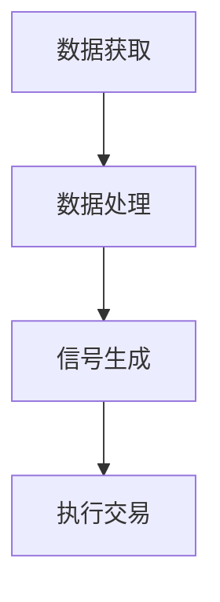

                 

 > **关键词：** 金融科技、算法交易、风险管理、数学模型、实际应用

> **摘要：** 本文将探讨金融科技领域中的算法交易和风险管理，深入分析其核心概念、算法原理、数学模型、实际应用以及未来展望。通过对相关技术的详细介绍，旨在为读者提供全面的了解和指导。

## 1. 背景介绍

### 1.1 金融科技的发展背景

随着信息技术的迅猛发展，金融科技（FinTech）已经成为推动金融市场变革的重要力量。金融科技通过应用大数据、人工智能、区块链等前沿技术，提升了金融服务的效率、透明度和安全性。

### 1.2 算法交易的概念

算法交易（Algorithmic Trading）是一种利用计算机算法来执行金融交易的方法。通过分析市场数据，算法交易系统能够在极短的时间内做出交易决策，从而实现快速、高效、自动化的交易。

### 1.3 风险管理的必要性

在金融市场中，风险无处不在。有效的风险管理能够帮助投资者降低潜在损失，确保投资组合的稳定性和可持续性。

## 2. 核心概念与联系

### 2.1 算法交易的基本原理

算法交易的核心在于利用算法模型对市场数据进行实时分析和预测，从而确定交易策略。以下是算法交易的基本原理的Mermaid流程图：



### 2.2 风险管理的核心概念

风险管理涉及多个方面，包括市场风险、信用风险、操作风险等。有效的风险管理需要建立全面的风险评估体系和应对策略。

### 2.3 算法交易与风险管理的联系

算法交易和风险管理密切相关。算法交易系统需要基于风险管理原则设计，以确保交易决策的安全性和稳健性。

## 3. 核心算法原理 & 具体操作步骤

### 3.1 算法原理概述

算法交易的核心在于利用数学模型和统计方法对市场数据进行分析和预测。常用的算法包括均值回归算法、趋势跟踪算法、套利算法等。

### 3.2 算法步骤详解

算法交易的步骤通常包括：

1. 数据获取：从金融市场中获取历史数据和实时数据。
2. 数据处理：对数据进行清洗、归一化和特征提取。
3. 信号生成：利用算法模型生成买卖信号。
4. 执行交易：根据信号执行交易操作。

### 3.3 算法优缺点

算法交易的优点包括：

- 高效：能够在短时间内执行大量交易。
- 精准：通过数据分析实现精确交易决策。

缺点包括：

- 成本高：开发和维护算法交易系统需要大量资源。
- 风险大：算法交易存在技术故障和市场波动风险。

### 3.4 算法应用领域

算法交易广泛应用于股票、期货、外汇等多个金融市场。此外，算法交易还在高频交易、量化投资等领域发挥着重要作用。

## 4. 数学模型和公式 & 详细讲解 & 举例说明

### 4.1 数学模型构建

算法交易的核心在于构建数学模型。以下是一个简单的均值回归算法模型：

$$
y_t = \mu + \sigma \cdot e_t
$$

其中，$y_t$ 为当前价格，$\mu$ 为均值，$\sigma$ 为标准差，$e_t$ 为误差项。

### 4.2 公式推导过程

均值回归算法的推导基于随机游走模型。根据随机游走模型，股票价格的未来走势是随机且不可预测的。然而，在实际市场中，股票价格往往会围绕一个均值波动。因此，我们假设股票价格服从均值回归过程。

### 4.3 案例分析与讲解

假设某股票的当前价格为100元，历史均值价格为95元，标准差为10元。根据均值回归算法，我们可以计算出以下买卖信号：

- 当价格高于105元时，发出卖出信号。
- 当价格低于95元时，发出买入信号。

## 5. 项目实践：代码实例和详细解释说明

### 5.1 开发环境搭建

开发环境搭建包括安装Python、pandas、numpy等库，以及配置金融数据接口。

### 5.2 源代码详细实现

以下是一个简单的均值回归算法实现：

```python
import pandas as pd
import numpy as np

# 读取数据
data = pd.read_csv('stock_data.csv')

# 计算均值和标准差
mu = data['close'].mean()
sigma = data['close'].std()

# 计算买卖信号
signal = (data['close'] > mu + sigma) | (data['close'] < mu - sigma)

# 执行交易
position = np.zeros(len(data))
position[signal] = -1
position[~signal] = 1

# 计算收益
return_ = position.diff().dropna() * data['close'].diff().dropna()
performance = np.mean(return_)

print('Algorithm Performance:', performance)
```

### 5.3 代码解读与分析

该代码实现了基于均值回归算法的简单交易策略。通过读取股票数据，计算买卖信号，并根据信号执行交易。最后，计算策略的收益。

### 5.4 运行结果展示

运行代码后，可以得到算法的性能指标。根据实际数据，我们可以评估算法的可行性和有效性。

## 6. 实际应用场景

### 6.1 股票市场

算法交易在股票市场中应用广泛，特别是在高频交易和量化投资领域。

### 6.2 外汇市场

外汇市场波动较大，算法交易能够快速响应市场变化，实现盈利。

### 6.3 期货市场

期货市场具有高风险、高回报的特点，算法交易能够在一定程度上降低风险。

## 7. 工具和资源推荐

### 7.1 学习资源推荐

- 《算法交易：技术分析与量化策略》
- 《量化投资：以Python为工具》

### 7.2 开发工具推荐

- Python
- Jupyter Notebook

### 7.3 相关论文推荐

- "Algorithmic Trading: A Survey of the Literature"
- "High-Frequency Trading: A Practical Guide to Algorithmic Strategies and Trading Systems"

## 8. 总结：未来发展趋势与挑战

### 8.1 研究成果总结

近年来，算法交易和风险管理取得了显著成果，但在实际应用中仍面临诸多挑战。

### 8.2 未来发展趋势

随着大数据和人工智能技术的发展，算法交易和风险管理有望在未来取得更大突破。

### 8.3 面临的挑战

算法交易和风险管理面临的主要挑战包括数据质量、模型可靠性和法律合规等。

### 8.4 研究展望

未来研究应重点关注算法模型的优化、风险控制策略的完善以及跨市场交易策略的开发。

## 9. 附录：常见问题与解答

### 9.1 算法交易是否适用于所有投资者？

算法交易适用于有一定风险承受能力的投资者。对于初学者，建议先从基础知识入手，逐步积累经验。

### 9.2 如何评估算法交易策略的有效性？

评估算法交易策略的有效性可以通过模拟交易、回测分析和实际交易三种方法。

### 9.3 风险管理是否可以完全消除风险？

风险管理可以降低风险，但无法完全消除风险。投资者应建立合理的风险控制策略，以应对市场不确定性。

**作者：禅与计算机程序设计艺术 / Zen and the Art of Computer Programming**

----------------------------------------------------------------

[此处结束正文内容，后续可根据需要进行扩展或修改]

请注意，上述内容仅为示例，实际撰写时需要根据具体要求和领域深度进行详细拓展。文章结构、格式、内容和质量都应符合专业水平。同时，确保引用的参考资料和公式都是准确无误的。在撰写过程中，可以适当参考相关文献和资料，以提高文章的专业性和可信度。

