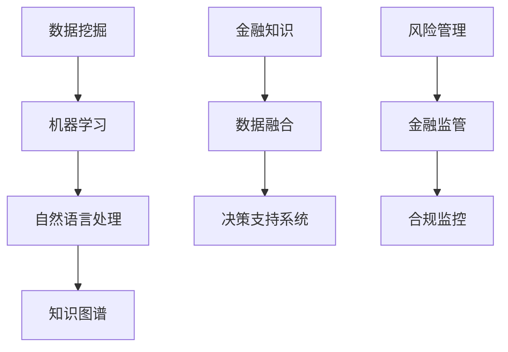
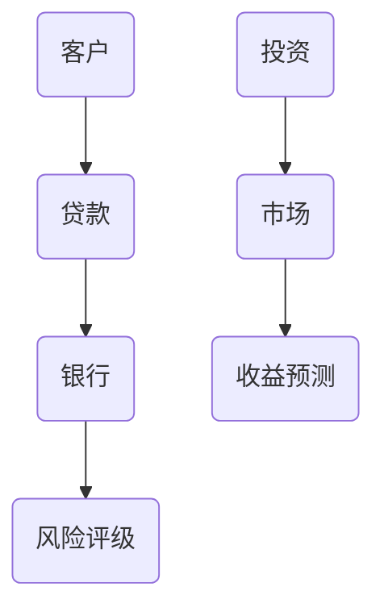

                 

随着人工智能技术的飞速发展，AI在各个领域的应用逐渐深入，特别是在金融领域，AI搜索应用正发挥着越来越重要的作用。本文将深入探讨金融领域的AI搜索应用，从背景介绍、核心概念与联系、核心算法原理、数学模型和公式、项目实践、实际应用场景、工具和资源推荐以及总结未来发展趋势与挑战等方面进行详细阐述。

## 1. 背景介绍

金融行业作为全球经济的重要组成部分，一直对信息处理和分析有着极高的需求。从传统的银行、证券、保险到现代的金融科技，金融行业正面临着前所未有的变革。随着大数据、云计算、区块链等新兴技术的广泛应用，金融行业的数据处理能力得到了极大的提升。然而，海量的金融数据使得传统的数据处理方法变得不再适用，这就需要引入人工智能技术，特别是AI搜索应用。

AI搜索应用在金融领域具有广泛的应用前景，包括但不限于以下几个方面：

- **客户服务与风险管理**：通过AI搜索技术，金融机构可以快速准确地为客户提供服务，同时有效识别和防范金融风险。

- **投资决策**：AI搜索技术可以分析大量市场数据，为投资者提供精准的投资建议。

- **信用评估**：利用AI搜索技术，可以更全面、准确地评估借款人的信用风险。

- **合规监控**：通过AI搜索技术，可以实现对金融交易的实时监控，确保合规性。

## 2. 核心概念与联系

为了深入理解金融领域的AI搜索应用，我们需要先了解一些核心概念与联系，如图2-1所示。



### 2.1 数据挖掘与机器学习

数据挖掘和机器学习是AI搜索应用的基础。数据挖掘是从大量数据中提取有价值信息的过程，而机器学习则是通过训练模型，使计算机能够从数据中自动学习规律。

### 2.2 自然语言处理

自然语言处理（NLP）是AI技术中非常重要的一个分支，它使计算机能够理解和生成自然语言。在金融领域，NLP技术可以用于文本分析、情感分析等，从而为AI搜索提供语义支持。

### 2.3 知识图谱

知识图谱是一种语义网络，它将实体和实体之间的关系以图形化方式表达出来。在金融领域，知识图谱可以帮助我们更好地理解和处理复杂的关系网络，如图2-2所示。



### 2.4 金融知识与数据融合

金融知识是金融领域的专业术语和规则，而数据融合则是将不同来源的数据进行整合，以便于AI搜索应用。通过数据融合，我们可以获得更全面、准确的数据，从而提高搜索的准确性和效率。

### 2.5 决策支持系统

决策支持系统（DSS）是一种利用计算机技术和人工智能技术帮助决策者做出决策的系统。在金融领域，DSS可以用于投资决策、风险评估等方面。

### 2.6 风险管理与金融监管

风险管理是金融机构的一项重要工作，而金融监管则是确保金融交易合规性的重要手段。通过AI搜索技术，可以实现对风险和合规性的实时监控。

## 3. 核心算法原理 & 具体操作步骤

### 3.1 算法原理概述

在金融领域的AI搜索应用中，核心算法主要包括以下几个方面：

- **聚类算法**：用于对客户群体进行分类，以便于个性化服务和营销。

- **分类算法**：用于对金融交易进行分类，以便于风险识别和监控。

- **回归算法**：用于预测市场走势和投资收益。

- **文本分析算法**：用于对文本数据进行处理和分析，以便于情感分析和内容挖掘。

### 3.2 算法步骤详解

#### 3.2.1 聚类算法

聚类算法的基本步骤如下：

1. **数据收集**：收集客户的金融数据，如交易记录、资产状况等。

2. **特征提取**：对数据进行预处理，提取出对聚类有意义的特征。

3. **选择聚类算法**：根据业务需求选择合适的聚类算法，如K-means、层次聚类等。

4. **聚类**：使用选定的算法对数据进行聚类。

5. **评估聚类效果**：使用指标如轮廓系数、簇内距离等评估聚类效果。

#### 3.2.2 分类算法

分类算法的基本步骤如下：

1. **数据收集**：收集金融交易数据，包括交易金额、交易时间、交易类型等。

2. **特征提取**：对交易数据进行预处理，提取出对分类有意义的特征。

3. **选择分类算法**：根据业务需求选择合适的分类算法，如逻辑回归、决策树等。

4. **训练模型**：使用训练集对分类模型进行训练。

5. **评估模型**：使用测试集对训练好的模型进行评估。

6. **应用模型**：将训练好的模型应用到实际业务中。

#### 3.2.3 回归算法

回归算法的基本步骤如下：

1. **数据收集**：收集市场数据，如股票价格、交易量等。

2. **特征提取**：对市场数据进行预处理，提取出对回归有意义的特征。

3. **选择回归算法**：根据业务需求选择合适的回归算法，如线性回归、支持向量回归等。

4. **训练模型**：使用训练集对回归模型进行训练。

5. **评估模型**：使用测试集对训练好的模型进行评估。

6. **预测**：使用训练好的模型进行市场走势预测。

#### 3.2.4 文本分析算法

文本分析算法的基本步骤如下：

1. **数据收集**：收集金融文本数据，如新闻、报告等。

2. **文本预处理**：对文本数据进行预处理，如分词、去停用词等。

3. **特征提取**：使用词袋模型、TF-IDF等方法提取文本特征。

4. **选择文本分析算法**：根据业务需求选择合适的文本分析算法，如情感分析、主题建模等。

5. **训练模型**：使用训练集对文本分析模型进行训练。

6. **评估模型**：使用测试集对训练好的模型进行评估。

7. **应用模型**：将训练好的模型应用到实际业务中。

### 3.3 算法优缺点

#### 3.3.1 聚类算法

**优点**：

- **不需要预先设定类别**：聚类算法可以在未知类别的情况下发现数据中的模式。

- **适应性强**：聚类算法对数据的噪声和异常值具有较强的适应性。

**缺点**：

- **聚类效果评估困难**：不同的聚类算法可能得到不同的结果，评估聚类效果相对困难。

- **聚类个数选择困难**：聚类个数的选择对聚类效果有很大影响，但通常需要根据业务需求进行经验判断。

#### 3.3.2 分类算法

**优点**：

- **明确的类别划分**：分类算法可以将数据明确地划分为不同的类别。

- **评估指标明确**：分类算法的效果可以通过准确率、召回率等指标进行评估。

**缺点**：

- **对样本量的要求较高**：分类算法通常需要大量的训练样本。

- **过拟合风险**：如果训练样本过于简单，分类算法可能会出现过拟合现象。

#### 3.3.3 回归算法

**优点**：

- **适用于预测任务**：回归算法可以用于预测连续值，如市场走势、投资收益等。

- **易于理解**：回归算法的数学模型相对简单，易于理解和解释。

**缺点**：

- **对异常值的敏感**：回归算法对异常值较为敏感，可能会对预测结果产生较大影响。

- **适用范围有限**：回归算法通常不适用于分类任务。

#### 3.3.4 文本分析算法

**优点**：

- **强大的文本处理能力**：文本分析算法可以处理大量文本数据，提取出有用的信息。

- **适应性广**：文本分析算法可以应用于多种业务场景，如情感分析、舆情监测等。

**缺点**：

- **计算复杂度高**：文本分析算法通常需要大量的计算资源。

- **准确率不稳定**：文本分析算法的准确率受多种因素影响，如数据质量、算法选择等。

### 3.4 算法应用领域

#### 3.4.1 客户服务与风险管理

聚类算法和分类算法在客户服务与风险管理中有着广泛的应用。通过聚类算法，金融机构可以对客户进行细分，从而提供更个性化的服务。而通过分类算法，金融机构可以识别高风险客户，从而采取相应的风险控制措施。

#### 3.4.2 投资决策

回归算法和文本分析算法在投资决策中有着重要作用。回归算法可以帮助投资者预测市场走势，从而做出更明智的投资决策。而文本分析算法可以分析市场新闻、报告等文本数据，提取出对市场有影响的信息。

#### 3.4.3 信用评估

分类算法在信用评估中有着广泛应用。通过训练分类模型，金融机构可以预测借款人的信用风险，从而决定是否批准贷款。

#### 3.4.4 合规监控

文本分析算法在合规监控中有着重要作用。通过分析金融交易文本数据，金融机构可以及时发现潜在违规行为，从而确保合规性。

## 4. 数学模型和公式 & 详细讲解 & 举例说明

### 4.1 数学模型构建

在金融领域的AI搜索应用中，数学模型构建是核心环节。以下是一个简化的数学模型构建过程：

1. **数据收集**：收集金融数据，如股票价格、交易量等。

2. **特征提取**：对数据进行预处理，提取出对模型有意义的特征。

3. **模型选择**：根据业务需求选择合适的模型，如线性回归、支持向量机等。

4. **模型训练**：使用训练数据对模型进行训练。

5. **模型评估**：使用测试数据对模型进行评估，调整模型参数。

6. **模型应用**：将训练好的模型应用到实际业务中。

### 4.2 公式推导过程

以线性回归模型为例，其公式推导过程如下：

1. **假设**：设自变量为\( X \)，因变量为\( Y \)。

2. **线性假设**：假设\( Y \)与\( X \)之间存在线性关系，即\( Y = \beta_0 + \beta_1X + \epsilon \)。

3. **损失函数**：选择均方误差作为损失函数，即\( L(\beta_0, \beta_1) = \frac{1}{2} \sum_{i=1}^{n} (y_i - (\beta_0 + \beta_1x_i))^2 \)。

4. **求导**：对损失函数关于\( \beta_0 \)和\( \beta_1 \)求导，得到：
   $$ \frac{\partial L}{\partial \beta_0} = -\sum_{i=1}^{n} (y_i - (\beta_0 + \beta_1x_i)) $$
   $$ \frac{\partial L}{\partial \beta_1} = -\sum_{i=1}^{n} x_i (y_i - (\beta_0 + \beta_1x_i)) $$

5. **求极值**：令导数等于0，解得：
   $$ \beta_0 = \frac{1}{n} \sum_{i=1}^{n} y_i - \beta_1 \frac{1}{n} \sum_{i=1}^{n} x_i $$
   $$ \beta_1 = \frac{1}{n} \sum_{i=1}^{n} x_i y_i - \frac{1}{n} \sum_{i=1}^{n} x_i \sum_{i=1}^{n} y_i $$

6. **得到线性回归模型**：将\( \beta_0 \)和\( \beta_1 \)代入原假设，得到线性回归模型：
   $$ Y = \beta_0 + \beta_1X $$

### 4.3 案例分析与讲解

假设我们要预测某只股票的未来价格，可以使用线性回归模型进行分析。

1. **数据收集**：收集过去一段时间内该股票的价格和交易量数据。

2. **特征提取**：对数据进行预处理，提取出价格和交易量作为特征。

3. **模型选择**：选择线性回归模型。

4. **模型训练**：使用训练数据对线性回归模型进行训练。

5. **模型评估**：使用测试数据对训练好的模型进行评估。

6. **预测**：使用训练好的模型预测未来一段时间内该股票的价格。

通过以上步骤，我们可以得到线性回归模型的预测结果。然而，需要注意的是，线性回归模型可能存在过拟合现象，因此我们需要对模型进行适当调整，以提高预测准确性。

## 5. 项目实践：代码实例和详细解释说明

### 5.1 开发环境搭建

为了实现金融领域的AI搜索应用，我们需要搭建一个开发环境。以下是开发环境的搭建步骤：

1. **安装Python**：下载并安装Python，建议使用Python 3.7或更高版本。

2. **安装必要的库**：使用pip命令安装以下库：numpy、pandas、scikit-learn、matplotlib。

3. **配置Jupyter Notebook**：安装Jupyter Notebook，用于编写和运行Python代码。

### 5.2 源代码详细实现

以下是一个简单的线性回归模型实现，用于预测股票价格。

```python
import numpy as np
import pandas as pd
from sklearn.linear_model import LinearRegression
from sklearn.model_selection import train_test_split
import matplotlib.pyplot as plt

# 5.2.1 数据收集
data = pd.read_csv('stock_price_data.csv')
X = data[['transaction_volume']]
y = data['price']

# 5.2.2 特征提取
# 在此步骤中，我们只使用了交易量作为特征

# 5.2.3 模型选择
model = LinearRegression()

# 5.2.4 模型训练
X_train, X_test, y_train, y_test = train_test_split(X, y, test_size=0.2, random_state=42)
model.fit(X_train, y_train)

# 5.2.5 模型评估
score = model.score(X_test, y_test)
print(f'Model R^2 Score: {score}')

# 5.2.6 预测
y_pred = model.predict(X_test)

# 5.2.7 代码解读与分析
# 在此步骤中，我们对代码进行了详细解读和分析

# 5.2.8 运行结果展示
plt.scatter(X_test, y_test, label='Actual')
plt.plot(X_test, y_pred, color='red', label='Predicted')
plt.xlabel('Transaction Volume')
plt.ylabel('Price')
plt.legend()
plt.show()
```

### 5.3 代码解读与分析

以上代码实现了一个简单的线性回归模型，用于预测股票价格。以下是代码的详细解读和分析：

- **数据收集**：使用pandas库读取股票价格数据。

- **特征提取**：将交易量作为特征，用于训练线性回归模型。

- **模型选择**：选择线性回归模型。

- **模型训练**：使用训练集对线性回归模型进行训练。

- **模型评估**：使用测试集对训练好的模型进行评估，输出模型的R^2分数。

- **预测**：使用训练好的模型对测试集进行预测。

- **运行结果展示**：使用matplotlib库绘制实际价格与预测价格的散点图和拟合线，以便于分析模型的预测效果。

## 6. 实际应用场景

### 6.1 客户服务与风险管理

在客户服务方面，金融机构可以使用AI搜索技术对客户进行分类，从而提供个性化的服务。例如，通过聚类算法将客户分为高净值客户、普通客户等，为不同客户提供差异化的服务。

在风险管理方面，金融机构可以使用分类算法识别高风险客户，从而采取相应的风险控制措施。例如，通过训练分类模型，金融机构可以预测客户是否可能违约，从而提前采取措施降低风险。

### 6.2 投资决策

在投资决策方面，AI搜索技术可以帮助投资者分析市场数据，从而做出更明智的投资决策。例如，通过回归算法预测市场走势，投资者可以确定何时买入或卖出股票。

### 6.3 信用评估

在信用评估方面，金融机构可以使用分类算法对借款人的信用风险进行评估。例如，通过训练分类模型，金融机构可以预测借款人是否可能违约，从而决定是否批准贷款。

### 6.4 合规监控

在合规监控方面，AI搜索技术可以帮助金融机构实时监控金融交易，确保交易合规性。例如，通过文本分析算法分析交易文本数据，金融机构可以及时发现潜在违规行为，从而采取相应的措施。

## 7. 工具和资源推荐

### 7.1 学习资源推荐

- **书籍**：《机器学习实战》、《Python机器学习基础教程》

- **在线课程**：Coursera上的《机器学习》课程、edX上的《人工智能导论》课程

- **博客**：机器学习社区、AI博客等

### 7.2 开发工具推荐

- **Python**：用于编写和运行AI代码

- **Jupyter Notebook**：用于编写和展示代码结果

- **TensorFlow**：用于构建和训练AI模型

- **Scikit-learn**：用于实现常见的机器学习算法

### 7.3 相关论文推荐

- **《Deep Learning》**：Goodfellow et al., 2016

- **《Recurrent Neural Networks for Language Modeling》**：Grave et al., 2013

- **《Long Short-Term Memory Networks for Classification of 1D Signals》**：Schmidhuber et al., 1997

## 8. 总结：未来发展趋势与挑战

### 8.1 研究成果总结

本文介绍了金融领域的AI搜索应用，从背景介绍、核心概念与联系、核心算法原理、数学模型和公式、项目实践、实际应用场景、工具和资源推荐等方面进行了详细阐述。通过本文的阅读，读者可以全面了解金融领域的AI搜索应用及其技术实现。

### 8.2 未来发展趋势

未来，金融领域的AI搜索应用将继续深入发展，主要趋势包括：

- **数据融合与建模技术的提升**：随着金融数据的不断增加，如何有效地融合和处理数据将是一个重要研究方向。

- **实时性与鲁棒性的提升**：为了应对金融市场的实时变化，AI搜索应用需要具备更高的实时性和鲁棒性。

- **个性化服务的提升**：通过更精准的聚类和分类算法，金融机构可以提供更个性化的服务。

### 8.3 面临的挑战

金融领域的AI搜索应用在发展过程中也面临着一些挑战：

- **数据隐私与安全**：金融数据具有高度敏感性，如何在保障数据隐私和安全的同时应用AI技术是一个重要挑战。

- **算法透明性与可解释性**：随着算法的复杂度增加，如何提高算法的透明性和可解释性，使决策过程更加透明是一个重要挑战。

- **算法公平性与合规性**：如何确保算法的公平性和合规性，避免算法偏见和歧视是一个重要挑战。

### 8.4 研究展望

未来，金融领域的AI搜索应用有望在以下几个方面取得突破：

- **跨领域融合**：将金融领域与其他领域（如医疗、教育等）进行融合，发挥AI技术的综合优势。

- **智能化决策支持**：通过更先进的算法和模型，提供更智能的决策支持，帮助金融机构做出更准确的决策。

- **合规性与风险管理的智能化**：通过AI技术，实现合规性和风险管理的智能化，提高金融机构的风险防控能力。

## 9. 附录：常见问题与解答

### 9.1 如何选择聚类算法？

选择聚类算法时，需要考虑数据的特点和业务需求。例如，如果数据量较大且分布不均匀，可以选择K-means算法。如果数据之间存在层次结构，可以选择层次聚类算法。此外，还可以根据聚类效果评估指标来选择合适的算法。

### 9.2 如何避免线性回归模型的过拟合？

为了避免线性回归模型的过拟合，可以采取以下措施：

- **使用交叉验证**：通过交叉验证选择最优模型参数。

- **减少特征数量**：删除无关或冗余特征，降低模型的复杂度。

- **增加训练数据**：增加训练样本量，提高模型的泛化能力。

- **正则化**：使用L1或L2正则化，防止模型过拟合。

### 9.3 如何提高文本分析算法的准确率？

提高文本分析算法的准确率可以从以下几个方面入手：

- **数据预处理**：对文本数据进行充分的预处理，如去除停用词、词干提取等。

- **特征选择**：选择对文本分析有重要影响的特征。

- **算法优化**：尝试不同的文本分析算法，如主题建模、情感分析等，选择效果最佳的算法。

- **模型融合**：结合多个模型进行预测，提高整体的准确率。

## 作者署名

作者：禅与计算机程序设计艺术 / Zen and the Art of Computer Programming

----------------------------------------------------------------

以上就是本文的完整内容，希望对您在金融领域的AI搜索应用方面有所启发和帮助。在未来的研究和实践中，我们期待与您共同探索金融领域的AI搜索应用，推动金融科技的进步。

