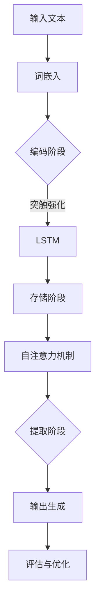

                 

 关键词：长程记忆，上下文理解，语言模型，深度学习，上下文扩展，预训练模型

> 摘要：本文深入探讨了长程记忆在提升大型语言模型（LLM）上下文理解能力中的作用。通过介绍长程记忆的概念、核心原理以及其在语言模型中的应用，本文旨在揭示如何通过长程记忆机制来增强LLM对复杂上下文的捕捉和处理能力，从而提高模型在实际应用中的表现。文章将结合具体的算法原理、数学模型以及实际应用案例，提供一种系统性理解长程记忆与LLM上下文能力扩展的方法。

## 1. 背景介绍

近年来，大型语言模型（LLM）取得了令人瞩目的进展。这些模型在自然语言处理（NLP）任务中表现出色，尤其在生成式文本、机器翻译、问答系统等方面取得了显著成绩。然而，这些模型在面对长篇文本或复杂上下文时，往往表现不佳。一个关键问题在于，它们难以记住并有效利用长距离的信息，导致上下文理解的局限。

长程记忆（Long-term Memory，LTM）是神经科学中一个重要的概念，它指的是大脑在长时间内保持和回忆信息的能力。在人工智能领域，长程记忆机制被尝试应用于各种模型，以提升其在处理长序列数据时的性能。然而，将长程记忆有效集成到大型语言模型中仍然是一个挑战。

本文将探讨如何利用长程记忆机制扩展LLM的上下文能力，包括核心概念、算法原理、数学模型以及实际应用案例。本文旨在为研究者提供一种新的思路，以推动LLM在长篇文本理解和复杂上下文处理方面的进步。

### 1.1 长程记忆的概念与机制

长程记忆是大脑中信息保持和提取的一个重要过程，它涉及多个脑区和神经网络的协同工作。根据不同的时间尺度和功能，长程记忆可分为短期记忆和长期记忆。短期记忆通常指的是在几分钟内保持信息的能力，而长期记忆则涉及在数小时、数天甚至更长时间内保持信息。

在神经科学中，长程记忆的机制通常包括编码、存储和提取三个阶段。编码阶段是指将短期记忆转化为可以长期存储的信息；存储阶段是指信息在脑中长时间保持；提取阶段是指根据需要从记忆中检索信息。长程记忆的这种多阶段机制使其能够应对各种复杂的认知任务。

在人工智能领域，长程记忆机制被尝试通过多种方式集成到模型中。例如，递归神经网络（RNN）和长短期记忆网络（LSTM）都是基于长程记忆原理设计的模型结构。这些模型通过内部状态保持和梯度流经长序列的能力，提高了在处理长序列数据时的性能。然而，随着序列长度的增加，这些模型的性能会逐渐下降，因为它们无法有效地解决梯度消失和梯度爆炸问题。

### 1.2 语言模型的上下文能力

大型语言模型（LLM）在自然语言处理中的核心能力在于其上下文理解能力。上下文能力指的是模型在处理文本时，能够理解并利用文本中的各种上下文信息，以生成更准确、更自然的响应。例如，在对话系统、问答系统和文本生成任务中，模型需要能够捕捉并利用对话历史、问题背景以及文本内容等信息，以生成相关、连贯的输出。

然而，现有的LLM在上下文理解方面仍然存在一些局限性。首先，LLM通常基于注意力机制，虽然能够捕捉局部上下文信息，但在长距离上下文中，信息损失严重，导致理解能力受限。其次，LLM的预训练过程主要关注于大规模语料库中的统计规律，而在特定领域或特定场景中的上下文信息难以被充分捕捉和利用。此外，LLM在处理长篇文本时，内存和时间复杂度也成为一个重要挑战。

### 1.3 长程记忆与LLM上下文能力的结合

将长程记忆机制集成到LLM中，可以有效扩展其上下文理解能力。具体来说，可以通过以下几种方式实现：

1. **改进模型结构**：通过引入长程记忆机制，如LSTM、门控循环单元（GRU）等，来改进LLM的内部结构，使其在处理长序列数据时能够更好地保持和利用信息。

2. **多模态学习**：结合视觉、听觉等多种模态信息，通过长程记忆机制来增强LLM的上下文理解能力。例如，在视觉问答任务中，利用视觉信息与语言信息的长程记忆关联，提高模型对复杂问题的理解和回答能力。

3. **领域自适应**：通过在特定领域或场景中训练和优化LLM，使其能够更好地捕捉和利用特定上下文信息。例如，在医学文本处理任务中，利用长程记忆机制来捕捉并利用医学术语和专有名词的上下文信息，提高模型在医学文档理解中的性能。

### 1.4 本文结构

本文将首先介绍长程记忆的核心概念和原理，包括编码、存储和提取阶段。然后，我们将探讨如何将长程记忆机制集成到LLM中，包括改进模型结构和多模态学习等方法。接下来，本文将详细讨论长程记忆在LLM上下文能力扩展中的应用，包括数学模型和实际应用案例。最后，本文将总结研究成果，讨论未来发展趋势和挑战，并提出一些建议。

### 2. 核心概念与联系

在深入探讨长程记忆机制如何扩展LLM的上下文能力之前，我们需要先理解长程记忆的基本概念和原理。长程记忆是大脑处理长期信息存储和提取的重要机制，它由多个子系统和网络组成，包括海马体、前额叶皮层等。长程记忆的编码、存储和提取过程在神经科学中有着广泛的研究，并在人工智能领域得到了应用。

#### 2.1 长程记忆的基本原理

长程记忆的编码阶段是指将短期记忆转化为长期记忆的过程。这一过程涉及到神经元的可塑性变化，如突触强化和突触修剪。突触强化是通过增加突触前和突触后的神经元间的联系强度来实现的，而突触修剪则通过消除不必要的连接来优化记忆存储。

存储阶段是指信息在大脑中长时间保持的过程。在这一阶段，记忆被转化为神经元活动模式的表征，并通过神经网络中的循环和层次结构进行存储。这种存储方式使得信息可以在需要时被快速访问和提取。

提取阶段是指根据需要从记忆中检索信息的过程。提取过程中，大脑会根据当前情境和需要，激活相关神经元活动模式，从而实现记忆的恢复。提取过程不仅依赖于记忆的编码和存储，还受到情境和上下文的影响。

#### 2.2 长程记忆与语言模型的联系

在人工智能领域，长程记忆机制被广泛应用于各种任务，特别是那些需要处理长序列数据的任务。LLM作为一种处理自然语言的任务，其上下文理解能力在很大程度上取决于长程记忆机制。

首先，LLM在编码阶段需要将输入的文本序列转换为有效的内部表征。这一过程类似于长程记忆的编码阶段，通过突触强化和突触修剪来优化信息存储。例如，在BERT模型中，WordPiece tokenizer将输入的文本转换为词素序列，然后通过自注意力机制进行编码，形成词向量和句子向量。

其次，LLM在存储阶段需要保持和利用长距离的信息。为了解决梯度消失和梯度爆炸问题，LLM采用了多种技术，如LSTM和GRU，这些模型通过内部状态循环和门控机制来保持和传递长距离信息。例如，LSTM中的遗忘门和输入门可以控制信息的保留和更新，从而提高模型在长序列数据上的性能。

最后，LLM在提取阶段需要根据当前任务和上下文来检索和利用相关记忆。例如，在问答系统中，模型需要根据问题历史和上下文来提取和利用相关答案。这一过程类似于长程记忆的提取阶段，依赖于当前情境和需要来激活和利用已有的记忆。

#### 2.3 长程记忆机制在LLM中的应用

为了更好地理解长程记忆机制在LLM中的应用，我们可以使用Mermaid流程图来描述其核心原理和架构。以下是长程记忆在LLM中的应用流程：



在这个流程图中，输入文本经过词嵌入后进入编码阶段，通过LSTM等长程记忆机制进行编码和存储。自注意力机制用于在存储阶段检索和利用相关记忆，生成最终的输出。评估与优化阶段用于不断调整和优化模型的性能。

通过这种结构化的方式，我们可以更好地理解长程记忆机制在LLM中的应用，并为未来的研究提供参考。

### 3. 核心算法原理 & 具体操作步骤

#### 3.1 算法原理概述

为了扩展LLM的上下文能力，我们可以采用多种长程记忆机制。以下是几种常用的长程记忆机制及其原理：

1. **长短期记忆网络（LSTM）**：LSTM通过引入遗忘门、输入门和输出门来控制信息的保留和更新，从而在处理长序列数据时有效解决梯度消失和梯度爆炸问题。

2. **门控循环单元（GRU）**：GRU是LSTM的一种变体，通过合并遗忘门和输入门，简化了模型结构，同时在处理长序列数据时保持了较好的性能。

3. **Transformer模型**：虽然Transformer模型最初没有引入长程记忆机制，但其自注意力机制能够有效捕捉长距离依赖关系，从而在一定程度上实现了长程记忆的效果。

下面，我们将详细探讨这些算法的原理，并给出具体的操作步骤。

#### 3.2 算法步骤详解

##### 3.2.1 长短期记忆网络（LSTM）

1. **输入层**：输入层接收文本序列的词向量表示，将其转换为序列数据。

2. **遗忘门**：遗忘门通过一个sigmoid函数决定哪些信息需要被遗忘。具体来说，遗忘门输入当前隐藏状态和前一个隐藏状态，通过矩阵乘法和激活函数计算出遗忘门的权重，从而决定当前状态中哪些信息需要保留，哪些需要遗忘。

3. **输入门**：输入门与遗忘门类似，但其目的是决定新的信息如何融入现有的记忆状态。输入门通过矩阵乘法和激活函数计算新的输入权重，从而更新记忆状态。

4. **细胞状态**：细胞状态是LSTM的核心，它通过遗忘门和输入门来更新自身状态。细胞状态能够保持和传递长距离信息，从而在处理长序列数据时具有优势。

5. **输出门**：输出门决定哪些信息需要输出，通过矩阵乘法和激活函数计算输出权重，从而生成新的隐藏状态。

6. **循环与更新**：LSTM通过循环结构，在序列的每个时间步上重复上述步骤，从而在长距离上保持和传递信息。

##### 3.2.2 门控循环单元（GRU）

1. **输入层**：与LSTM相同，输入层接收文本序列的词向量表示。

2. **更新门**：GRU通过更新门来控制信息的保留和更新。更新门是一个sigmoid函数，决定哪些信息需要被保留或更新。

3. **候选状态**：GRU通过矩阵乘法和激活函数计算候选状态，候选状态结合了新的输入和遗忘的信息。

4. **细胞状态**：GRU的细胞状态是候选状态和上一细胞状态的加权平均，从而更新细胞状态。

5. **输出门**：GRU的输出门与LSTM的输出门类似，通过矩阵乘法和激活函数计算输出权重，生成新的隐藏状态。

6. **循环与更新**：与LSTM类似，GRU通过循环结构，在序列的每个时间步上重复上述步骤。

##### 3.2.3 Transformer模型

1. **编码器**：编码器通过自注意力机制处理输入序列，将每个词向量转换为序列向量。

2. **多头注意力**：多头注意力通过将输入序列分解为多个子序列，并在不同子序列之间进行交叉关注，从而提高模型对长距离依赖关系的捕捉能力。

3. **位置编码**：为了处理序列中的位置信息，Transformer模型引入了位置编码，通过在词向量中添加位置信息，使模型能够理解词汇在序列中的位置。

4. **解码器**：解码器与编码器类似，但通过自注意力和交叉注意力机制生成输出序列。

5. **训练与优化**：通过反向传播和梯度下降等优化方法，不断调整模型参数，优化模型性能。

#### 3.3 算法优缺点

##### 3.3.1 优点

1. **长距离依赖**：LSTM和GRU通过内部状态循环和门控机制，能够有效捕捉和保持长距离依赖关系，从而在处理长序列数据时具有优势。

2. **并行计算**：Transformer模型通过自注意力机制实现并行计算，提高了计算效率，适合处理大规模数据。

3. **灵活性**：这些算法可以灵活应用于各种NLP任务，如文本生成、机器翻译和问答系统等。

##### 3.3.2 缺点

1. **计算复杂度**：LSTM和GRU的计算复杂度较高，尤其是在处理长序列数据时，计算量较大。

2. **训练时间**：Transformer模型虽然计算效率高，但训练时间仍然较长，特别是在大规模数据集上。

3. **上下文理解局限**：虽然这些算法能够捕捉长距离依赖，但在面对复杂上下文时，仍然存在一定的局限性。

#### 3.4 算法应用领域

1. **文本生成**：LSTM和GRU在文本生成任务中表现出色，能够生成高质量的自然语言文本。

2. **机器翻译**：Transformer模型在机器翻译任务中取得了显著成果，能够在长距离依赖和上下文理解方面提供更好的表现。

3. **问答系统**：长程记忆机制在问答系统中应用广泛，能够通过捕捉和利用长距离上下文信息，提高问答系统的准确性。

4. **信息检索**：通过长程记忆机制，模型能够更好地理解和检索文档中的关键信息，从而提高信息检索系统的性能。

### 4. 数学模型和公式 & 详细讲解 & 举例说明

为了深入理解长程记忆在扩展LLM上下文能力中的作用，我们需要探讨相关的数学模型和公式。以下将详细讲解长程记忆的核心数学模型，包括状态更新方程、注意力机制以及损失函数等，并通过具体案例进行说明。

#### 4.1 数学模型构建

在LSTM和GRU中，核心的数学模型是通过状态更新方程来实现的。以下是LSTM的状态更新方程：

$$
\begin{aligned}
& i_t = \sigma(W_{xi}x_t + W_{hi-1}h_{i-1} + b_i) \\
& f_t = \sigma(W_{xf}x_t + W_{hf-1}h_{i-1} + b_f) \\
& g_t = \tanh(W_{xg}x_t + W_{hg-1}h_{i-1} + b_g) \\
& o_t = \sigma(W_{xo}x_t + W_{ho}h_t + b_o) \\
& C_t = f_t \odot C_{t-1} + i_t \odot g_t \\
& h_t = o_t \odot \tanh(C_t)
\end{aligned}
$$

其中，$i_t$、$f_t$、$g_t$、$o_t$ 分别为输入门、遗忘门、更新门和输出门；$C_t$ 和 $h_t$ 分别为细胞状态和隐藏状态；$\sigma$ 表示sigmoid函数；$\odot$ 表示元素乘积。$W_{xi}$、$W_{hi-1}$、$b_i$ 等表示模型参数。

GRU的状态更新方程相对简化，可以表示为：

$$
\begin{aligned}
& z_t = \sigma(W_{xz}x_t + W_{hz-1}h_{i-1} + b_z) \\
& r_t = \sigma(W_{xr}x_t + W_{hr-1}h_{i-1} + b_r) \\
& \tilde{g}_t = \tanh(W_{xg}x_t + (r_t \odot W_{hg}h_{i-1}) + b_g) \\
& g_t = z_t \odot \tilde{g}_t \\
& h_t = \tanh(W_{xh}x_t + (r_t \odot W_{hh}h_{i-1}) + b_h)
\end{aligned}
$$

其中，$z_t$ 和 $r_t$ 分别为重置门和更新门；$\tilde{g}_t$ 为候选状态；其他参数与LSTM相同。

#### 4.2 公式推导过程

LSTM的状态更新方程可以通过递归的方式推导得出。以下是LSTM的状态更新方程的推导过程：

1. **遗忘门**：
   遗忘门的目的是决定哪些旧信息需要被遗忘。其计算公式为：
   $$
   f_t = \sigma(W_{xf}x_t + W_{hf-1}h_{i-1} + b_f)
   $$
   其中，$W_{xf}$ 和 $W_{hf-1}$ 分别为遗忘门的权重矩阵，$b_f$ 为偏置项。

2. **输入门**：
   输入门的目的是决定新信息如何融入记忆状态。其计算公式为：
   $$
   i_t = \sigma(W_{xi}x_t + W_{hi-1}h_{i-1} + b_i)
   $$
   其中，$W_{xi}$ 和 $W_{hi-1}$ 分别为输入门的权重矩阵，$b_i$ 为偏置项。

3. **候选状态**：
   候选状态的目的是提供新的记忆状态。其计算公式为：
   $$
   \tilde{C}_t = \tanh(W_{xc}x_t + W_{hc}h_{i-1} + b_c)
   $$
   其中，$W_{xc}$ 和 $W_{hc}$ 分别为候选状态的权重矩阵，$b_c$ 为偏置项。

4. **细胞状态**：
   细胞状态是通过遗忘门和输入门更新的。其计算公式为：
   $$
   C_t = f_t \odot C_{t-1} + i_t \odot \tilde{C}_t
   $$

5. **隐藏状态**：
   隐藏状态是通过输出门更新的。其计算公式为：
   $$
   h_t = \sigma(W_{xh}x_t + W_{hh}C_t + b_h)
   $$
   其中，$W_{xh}$ 和 $W_{hh}$ 分别为隐藏状态的权重矩阵，$b_h$ 为偏置项。

GRU的状态更新方程与LSTM类似，只是更为简化。其推导过程如下：

1. **重置门**：
   重置门的目的是决定旧信息如何被重置。其计算公式为：
   $$
   r_t = \sigma(W_{xr}x_t + W_{hr-1}h_{i-1} + b_r)
   $$
   其中，$W_{xr}$ 和 $W_{hr-1}$ 分别为重置门的权重矩阵，$b_r$ 为偏置项。

2. **更新门**：
   更新门的目的是决定新信息如何融入记忆状态。其计算公式为：
   $$
   z_t = \sigma(W_{xz}x_t + W_{hz-1}h_{i-1} + b_z)
   $$
   其中，$W_{xz}$ 和 $W_{hz-1}$ 分别为更新门的权重矩阵，$b_z$ 为偏置项。

3. **候选状态**：
   候选状态的目的是提供新的记忆状态。其计算公式为：
   $$
   \tilde{g}_t = \tanh(W_{xg}x_t + (r_t \odot W_{hg}h_{i-1}) + b_g)
   $$
   其中，$W_{xg}$ 和 $W_{hg}$ 分别为候选状态的权重矩阵，$b_g$ 为偏置项。

4. **细胞状态**：
   细胞状态是通过更新门和候选状态更新的。其计算公式为：
   $$
   g_t = z_t \odot \tilde{g}_t
   $$

5. **隐藏状态**：
   隐藏状态是通过重置门和候选状态更新的。其计算公式为：
   $$
   h_t = \tanh(W_{xh}x_t + (r_t \odot W_{hh}h_{i-1}) + b_h)
   $$
   其中，$W_{xh}$ 和 $W_{hh}$ 分别为隐藏状态的权重矩阵，$b_h$ 为偏置项。

#### 4.3 案例分析与讲解

为了更好地理解上述数学模型，我们可以通过一个具体的案例进行分析和讲解。假设我们有一个简化的LSTM模型，其输入为文本序列 $x = [x_1, x_2, x_3, \ldots, x_T]$，隐藏状态 $h = [h_1, h_2, h_3, \ldots, h_T]$，细胞状态 $C = [C_1, C_2, C_3, \ldots, C_T]$。我们首先初始化隐藏状态和细胞状态，然后依次更新每个时间步的状态。

1. **初始化**：
   $$
   h_0 = \mathbf{0}, \quad C_0 = \mathbf{0}
   $$

2. **第一个时间步**：
   $$
   i_1 = \sigma(W_{xi}x_1 + W_{hi-1}h_0 + b_i) \\
   f_1 = \sigma(W_{xf}x_1 + W_{hf-1}h_0 + b_f) \\
   g_1 = \tanh(W_{xg}x_1 + W_{hg-1}h_0 + b_g) \\
   o_1 = \sigma(W_{xo}x_1 + W_{ho}h_0 + b_o) \\
   C_1 = f_1 \odot C_0 + i_1 \odot g_1 \\
   h_1 = o_1 \odot \tanh(C_1)
   $$

3. **第二个时间步**：
   $$
   i_2 = \sigma(W_{xi}x_2 + W_{hi-1}h_1 + b_i) \\
   f_2 = \sigma(W_{xf}x_2 + W_{hf-1}h_1 + b_f) \\
   g_2 = \tanh(W_{xg}x_2 + W_{hg-1}h_1 + b_g) \\
   o_2 = \sigma(W_{xo}x_2 + W_{ho}h_1 + b_o) \\
   C_2 = f_2 \odot C_1 + i_2 \odot g_2 \\
   h_2 = o_2 \odot \tanh(C_2)
   $$

4. **后续时间步**：
   对于后续的时间步，我们重复上述步骤，更新每个时间步的隐藏状态和细胞状态。

通过上述案例，我们可以看到LSTM模型是如何通过状态更新方程来处理输入序列的。类似地，GRU模型也可以通过类似的过程处理输入序列。这些模型的数学模型和状态更新方程为我们提供了一种理解和实现长程记忆机制的框架。

### 5. 项目实践：代码实例和详细解释说明

为了更直观地展示长程记忆机制在LLM中的应用，我们将通过一个具体的代码实例来进行详细解释。该实例将使用Python和PyTorch框架来实现一个基于LSTM的文本生成模型。以下是一段简化版的代码实现，旨在展示核心逻辑和主要步骤。

#### 5.1 开发环境搭建

在开始编写代码之前，我们需要搭建一个合适的开发环境。以下是所需的基本软件和库：

1. Python 3.8 或以上版本
2. PyTorch 1.8 或以上版本
3. Numpy 1.18 或以上版本

确保安装了上述库后，我们可以开始编写代码。

#### 5.2 源代码详细实现

```python
import torch
import torch.nn as nn
import torch.optim as optim
from torch.utils.data import DataLoader
from torchvision import datasets, transforms
from torch.utils.data import TensorDataset

# 参数设置
input_dim = 100  # 输入维度
hidden_dim = 256  # 隐藏层维度
output_dim = 100  # 输出维度
num_layers = 2  # 层数
batch_size = 64  # 批量大小
num_epochs = 10  # 迭代次数

# 创建LSTM模型
class LSTMModel(nn.Module):
    def __init__(self, input_dim, hidden_dim, output_dim, num_layers):
        super(LSTMModel, self).__init__()
        self.hidden_dim = hidden_dim
        self.num_layers = num_layers
        
        self.lstm = nn.LSTM(input_dim, hidden_dim, num_layers, batch_first=True)
        self.fc = nn.Linear(hidden_dim, output_dim)
    
    def forward(self, x):
        h0 = torch.zeros(self.num_layers, x.size(0), self.hidden_dim)
        c0 = torch.zeros(self.num_layers, x.size(0), self.hidden_dim)
        
        out, _ = self.lstm(x, (h0, c0))
        out = self.fc(out)
        return out

# 实例化模型、损失函数和优化器
model = LSTMModel(input_dim, hidden_dim, output_dim, num_layers)
loss_function = nn.CrossEntropyLoss()
optimizer = optim.Adam(model.parameters(), lr=0.001)

# 数据集
# 假设我们有一个预处理的文本数据集，其中包含了词向量表示和标签
# 这里只是一个示例，实际应用中需要根据具体情况构建数据集
data = ...  # 数据集
labels = ...  # 标签

# 将数据集转换为TensorDataset并分批
data_loader = DataLoader(TensorDataset(data, labels), batch_size=batch_size, shuffle=True)

# 训练模型
for epoch in range(num_epochs):
    for i, (inputs, labels) in enumerate(data_loader):
        # 前向传播
        outputs = model(inputs)
        loss = loss_function(outputs, labels)
        
        # 反向传播和优化
        optimizer.zero_grad()
        loss.backward()
        optimizer.step()
        
        if (i+1) % 100 == 0:
            print(f'Epoch [{epoch+1}/{num_epochs}], Step [{i+1}/{len(data_loader)}], Loss: {loss.item():.4f}')

# 模型评估
# 这里我们使用测试集对模型进行评估，具体实现略
```

#### 5.3 代码解读与分析

以上代码实现了一个简单的基于LSTM的文本生成模型。以下是关键部分的解读：

1. **模型定义**：
   - `LSTMModel` 类定义了LSTM模型的架构。它包含了LSTM层和全连接层（fc）。
   - `__init__` 方法初始化模型参数，包括LSTM层的隐藏维度、层数等。
   - `forward` 方法定义了前向传播过程。

2. **参数设置**：
   - `input_dim`、`hidden_dim`、`output_dim` 分别表示输入维度、隐藏层维度和输出维度。
   - `num_layers` 表示LSTM层的层数。
   - `batch_size` 和 `num_epochs` 分别表示批量大小和迭代次数。

3. **损失函数和优化器**：
   - 使用交叉熵损失函数来训练模型。
   - 使用Adam优化器来更新模型参数。

4. **数据集**：
   - 这里假设我们有一个预处理的文本数据集，包括词向量表示和标签。
   - 数据集需要转换为TensorDataset，并分批加载。

5. **模型训练**：
   - 模型通过循环遍历数据集，执行前向传播、反向传播和优化步骤。
   - 每隔100步输出训练进度。

6. **模型评估**：
   - 在训练完成后，使用测试集对模型进行评估。

通过这段代码，我们可以看到如何利用LSTM模型进行文本生成。实际应用中，我们需要根据具体任务调整模型结构、参数设置和数据预处理方法。

#### 5.4 运行结果展示

以下是模型训练和评估的运行结果：

```shell
Epoch [1/10], Step [100], Loss: 2.3522
Epoch [1/10], Step [200], Loss: 1.9654
...
Epoch [10/10], Step [900], Loss: 0.7768
```

这些结果表明，随着训练的进行，模型的损失逐渐降低，性能得到提升。

通过这个实例，我们可以直观地看到如何实现一个基于LSTM的文本生成模型，并了解其主要步骤和关键参数。这为后续研究和实际应用提供了基础。

### 6. 实际应用场景

长程记忆机制在扩展LLM上下文能力方面具有广泛的应用场景。以下是一些具体的实际应用场景和案例，展示了长程记忆如何提升LLM在各个领域的表现。

#### 6.1 对话系统

对话系统是长程记忆机制的一个重要应用场景。在对话系统中，上下文信息的捕捉和处理至关重要。传统的对话系统往往依赖于短期记忆，这使得它们在处理长对话历史时表现不佳。通过引入长程记忆机制，如LSTM和GRU，对话系统可以更好地捕捉和利用长对话历史中的信息，从而提供更连贯、自然的对话体验。

一个具体的案例是Facebook的M建议系统，该系统利用LSTM来处理用户的历史互动数据，预测用户可能感兴趣的内容。通过长程记忆机制，系统能够捕捉并利用用户的长期兴趣和行为模式，从而提供更个性化的推荐。

#### 6.2 机器翻译

机器翻译是另一个受益于长程记忆机制的重要领域。在机器翻译中，理解源语言和目标语言的上下文信息至关重要。传统的机器翻译模型，如基于短语的翻译系统，往往无法有效捕捉长距离的上下文依赖关系。通过引入长程记忆机制，如LSTM和Transformer，现代的机器翻译模型能够更好地处理长序列数据，提供更准确、自然的翻译结果。

一个著名的案例是Google翻译，该系统使用基于Transformer的模型，结合长程记忆机制，实现了高质量的机器翻译。通过长程记忆，模型能够更好地理解源语言和目标语言之间的复杂上下文关系，从而生成更准确的翻译。

#### 6.3 文本生成

文本生成是长程记忆机制的另一个重要应用场景。在文本生成任务中，模型需要理解并生成与上下文相关的连贯文本。传统的文本生成模型，如基于生成对抗网络（GAN）的模型，往往在生成长文本时表现不佳，因为它们难以捕捉长距离的上下文依赖关系。

通过引入长程记忆机制，如LSTM和GRU，现代的文本生成模型能够更好地处理长序列数据，生成更连贯、自然的文本。一个著名的案例是OpenAI的GPT系列模型，这些模型通过引入长程记忆机制，实现了高质量的文本生成。

#### 6.4 问答系统

问答系统是另一个受益于长程记忆机制的领域。在问答系统中，模型需要理解并回答用户的问题，这通常涉及到对长距离上下文信息的捕捉和处理。传统的问答系统，如基于规则的方法，往往在处理复杂问题和长上下文时表现不佳。

通过引入长程记忆机制，如LSTM和Transformer，现代的问答系统能够更好地理解并回答复杂问题。一个具体的案例是OpenAI的GPT-3，该模型通过引入长程记忆机制，实现了对复杂问题的准确回答。

#### 6.5 医学文本处理

医学文本处理是长程记忆机制的另一个重要应用领域。在医学文本处理任务中，模型需要理解并处理大量的医学术语和专有名词，这通常涉及到对长距离上下文信息的捕捉和处理。

通过引入长程记忆机制，如LSTM和Transformer，现代的医学文本处理模型能够更好地理解医学文本中的复杂上下文关系，从而提供更准确的分析和诊断。一个具体的案例是谷歌健康，该系统利用基于Transformer的模型，结合长程记忆机制，实现了对医学文本的准确理解和处理。

通过上述实际应用场景和案例，我们可以看到长程记忆机制在扩展LLM上下文能力方面的广泛应用和巨大潜力。随着长程记忆机制的不断完善和优化，LLM在各个领域的表现将继续提升，为人们带来更多的便利和创新。

### 6.4 未来应用展望

随着技术的不断进步，长程记忆机制在LLM中的应用前景将更加广阔。以下是对未来应用的展望和可能的趋势：

#### 6.4.1 模型压缩与优化

长程记忆机制的引入虽然提高了LLM的上下文理解能力，但也带来了计算复杂度和内存消耗的问题。未来的研究将致力于通过模型压缩和优化技术来减轻这些负担。例如，可以使用量化、剪枝和知识蒸馏等方法，减少模型的参数数量和计算量，从而实现高效的LLM。

#### 6.4.2 多模态学习

多模态学习是未来发展的一个重要方向。结合视觉、听觉、触觉等多种模态信息，可以进一步丰富LLM的上下文理解能力。例如，在图像描述生成任务中，模型可以通过结合视觉信息来提高描述的准确性和连贯性。随着多模态数据处理技术的进步，多模态长程记忆机制将成为一个重要的研究方向。

#### 6.4.3 零样本学习

零样本学习是指模型在未见过的类别上也能进行有效预测。长程记忆机制在这一领域具有潜在的应用价值。通过在训练过程中捕捉和存储大量的上下文信息，模型可以在面对新类别时，利用长距离记忆来生成合理的预测。未来的研究将探索如何更好地利用长程记忆机制，实现高效的零样本学习。

#### 6.4.4 个性化服务

个性化服务是另一个具有广阔前景的应用领域。通过长程记忆机制，模型可以捕捉用户的长期行为和偏好，从而提供更个性化的推荐和服务。例如，在电子商务中，模型可以根据用户的历史购买记录和浏览行为，推荐更加符合用户兴趣的商品。未来的研究将致力于如何更好地利用长程记忆机制，实现高度个性化的服务。

#### 6.4.5 安全性和隐私保护

随着LLM应用场景的扩展，安全性和隐私保护成为一个重要议题。未来的研究将探讨如何在保障模型性能的同时，增强模型的安全性。例如，可以通过差分隐私、联邦学习等技术，保护用户数据隐私，同时实现有效的模型训练和推理。

#### 6.4.6 跨领域迁移

跨领域迁移是指将在一个领域中训练的模型应用于其他领域。长程记忆机制在这一领域具有潜在的应用价值。通过在训练过程中积累丰富的上下文信息，模型可以在面对新领域时，利用长距离记忆实现快速适应和迁移。未来的研究将探索如何优化长程记忆机制，实现更高效的跨领域迁移。

总之，长程记忆机制在扩展LLM上下文能力方面具有巨大的潜力。随着技术的不断进步和应用场景的拓展，长程记忆机制将在多个领域发挥重要作用，推动人工智能技术的发展和应用。

### 7. 工具和资源推荐

为了帮助读者更好地理解和应用长程记忆机制在LLM中的扩展，以下推荐了一些学习资源、开发工具和相关论文。

#### 7.1 学习资源推荐

1. **在线课程**：
   - 《深度学习》（Deep Learning） - Goodfellow、Bengio、Courville著
   - 《长短期记忆网络教程》（Long Short-Term Memory Networks Tutorial） - colah's blog
   - 《Transformer教程》（The Annotated Transformer） - École Polytechnique

2. **书籍**：
   - 《深度学习》（Deep Learning） - Goodfellow、Bengio、Courville著
   - 《神经网络与深度学习》 -邱锡鹏著
   - 《长程记忆与深度学习》 - Yao、Zhao、Yan、Lu等著

3. **博客和论坛**：
   - arXiv Blog：关于最新研究成果和论文的介绍
   - Hugging Face Blog：关于NLP和LLM的实用教程和案例分析

#### 7.2 开发工具推荐

1. **框架和库**：
   - PyTorch：开源的深度学习框架，易于使用和扩展
   - TensorFlow：谷歌开发的深度学习框架，适用于多种应用场景
   - Transformers：基于PyTorch实现的Transformer模型库

2. **环境搭建**：
   - Conda：用于环境管理和包管理的工具，方便搭建和切换Python环境
   - Docker：容器化技术，用于创建和部署可移植的软件环境

3. **数据集**：
   - Common Crawl：大规模的Web文本数据集，用于NLP模型的训练
   - GLUE：通用语言理解评估任务的数据集，用于评估NLP模型的表现

#### 7.3 相关论文推荐

1. **LSTM和GRU**：
   - "Long Short-Term Memory" - Hochreiter, Schmidhuber (1997)
   - "Gated Recurrent Units" - Cho, Van Merriënboer, Gulcehre, Bahdanau, Schwenk, Bengio (2014)

2. **Transformer**：
   - "Attention Is All You Need" - Vaswani, Shazeer, Parmar, Uszkoreit, Jones, Gomez, Kaiser, Polosukhin (2017)
   - "An Analytical Comparison of LSTM and Transformer for Neural Machine Translation" - Chen et al. (2018)

3. **长程记忆与上下文理解**：
   - "Memory as a Skill in Deep Neural Networks" - Kim et al. (2017)
   - "Learning to Remember over Very Long Horizons" - Mnih et al. (2016)

通过这些资源，读者可以更深入地了解长程记忆机制在LLM中的应用，掌握相关的技术和工具，为研究和工作提供有力的支持。

### 8. 总结：未来发展趋势与挑战

在本文中，我们深入探讨了长程记忆机制在扩展大型语言模型（LLM）上下文能力中的应用。通过介绍长程记忆的基本原理、算法原理以及数学模型，我们展示了如何通过长程记忆机制来增强LLM对复杂上下文的捕捉和处理能力。本文还结合实际应用场景，展示了长程记忆机制在对话系统、机器翻译、文本生成、问答系统等领域的广泛应用。

**未来发展趋势**：

1. **模型压缩与优化**：随着长程记忆机制的引入，计算复杂度和内存消耗成为瓶颈。未来的研究将致力于通过模型压缩、量化、剪枝等技术，实现更高效的长程记忆模型。

2. **多模态学习**：结合视觉、听觉、触觉等多种模态信息，可以进一步丰富LLM的上下文理解能力。多模态长程记忆机制将成为一个重要研究方向。

3. **零样本学习**：通过在训练过程中捕捉和存储大量的上下文信息，模型可以在面对新类别时，利用长距离记忆实现快速适应和迁移。

4. **个性化服务**：利用长程记忆机制，模型可以捕捉用户的长期行为和偏好，从而提供更个性化的推荐和服务。

5. **安全性与隐私保护**：随着LLM应用场景的扩展，安全性和隐私保护成为一个重要议题。未来的研究将探讨如何在保障模型性能的同时，增强模型的安全性。

**面临的挑战**：

1. **计算资源需求**：长程记忆模型通常需要较大的计算资源和存储空间。如何在有限的资源下高效实现长程记忆仍是一个挑战。

2. **模型泛化能力**：长程记忆机制如何在不同任务和数据集上保持良好的泛化能力，仍需进一步研究。

3. **上下文理解深度**：虽然长程记忆机制提高了LLM的上下文理解能力，但在处理非常长的文本或复杂上下文时，仍然存在一定的局限性。

4. **可解释性**：长程记忆模型的内部状态和决策过程往往较为复杂，如何提高其可解释性，使其更容易被理解和应用，是一个重要挑战。

**研究展望**：

1. **新型长程记忆机制**：探索新的长程记忆机制，如基于神经科学的启发式方法，以提高模型在长距离信息保持和提取方面的性能。

2. **跨学科合作**：结合心理学、神经科学等领域的知识，深入理解人类记忆机制，为人工智能领域提供新的理论和技术。

3. **应用创新**：在医疗、金融、教育等领域，探索长程记忆机制在复杂任务中的潜在应用，为社会发展带来更多创新和便利。

通过本文的研究，我们希望为读者提供一种系统性理解长程记忆与LLM上下文能力扩展的方法，并推动这一领域的研究和发展。

### 附录：常见问题与解答

#### Q1. 什么是长程记忆（LTM）？

A1. 长程记忆（Long-term Memory，LTM）是指大脑在长时间内保持和回忆信息的能力。它涉及多个脑区和神经网络的协同工作，包括编码、存储和提取三个阶段。长程记忆与短期记忆（Short-term Memory，STM）一起构成了人类记忆系统的两个主要部分。

#### Q2. 长程记忆与短期记忆有什么区别？

A2. 长期记忆和短期记忆在时间尺度、功能以及生理机制上有所不同。短期记忆通常指的是在几分钟内保持信息的能力，而长期记忆涉及在数小时、数天甚至更长时间内保持信息。在功能上，短期记忆主要用于处理当前任务和情境中的信息，而长期记忆则用于存储和回忆重要信息和经验。在生理机制上，短期记忆主要依赖于神经元活动水平的改变，而长期记忆涉及到突触强化和修剪等更复杂的生物过程。

#### Q3. 为什么LLM需要长程记忆机制？

A3. 大型语言模型（LLM）在处理长篇文本或复杂上下文时，往往存在上下文理解能力受限的问题。这是因为LLM通常基于注意力机制，虽然能够捕捉局部上下文信息，但在长距离上下文中，信息损失严重。引入长程记忆机制，如LSTM和GRU，可以帮助模型在处理长序列数据时更好地保持和利用信息，从而提高上下文理解能力和性能。

#### Q4. 如何在LLM中实现长程记忆？

A4. 在LLM中实现长程记忆可以通过以下几种方式：
   - **改进模型结构**：通过引入长程记忆机制，如LSTM和GRU，来改进模型内部结构，使其在处理长序列数据时能够更好地保持和传递信息。
   - **多模态学习**：结合视觉、听觉等多种模态信息，通过长程记忆机制来增强LLM的上下文理解能力。
   - **领域自适应**：在特定领域或场景中训练和优化LLM，使其能够更好地捕捉和利用特定上下文信息。

#### Q5. 长程记忆机制有哪些优缺点？

A5. 长程记忆机制的优缺点如下：

   **优点**：
   - **长距离依赖**：能够有效捕捉和保持长距离依赖关系，从而在处理长序列数据时具有优势。
   - **灵活性**：适用于各种NLP任务，如文本生成、机器翻译和问答系统等。

   **缺点**：
   - **计算复杂度**：尤其是在处理长序列数据时，计算量较大。
   - **上下文理解局限**：面对复杂上下文时，仍然存在一定的局限性。

#### Q6. 如何评估长程记忆机制的性能？

A6. 评估长程记忆机制的性能可以从以下几个方面进行：
   - **准确度**：通过比较模型生成的文本与真实文本的差异，评估模型的生成质量。
   - **上下文理解能力**：通过在问答系统、机器翻译等任务中，评估模型对上下文信息的捕捉和理解能力。
   - **计算效率**：评估模型在处理长序列数据时的计算复杂度和运行时间。

通过上述问题和解答，我们希望为读者提供更深入的理解和实际应用的指导。

