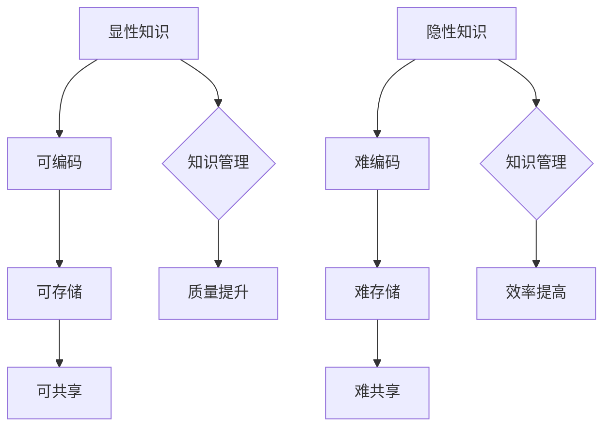
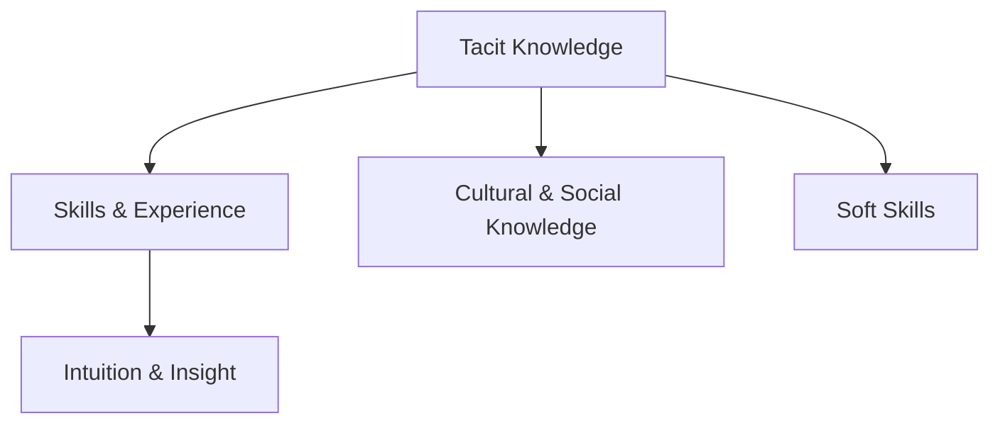
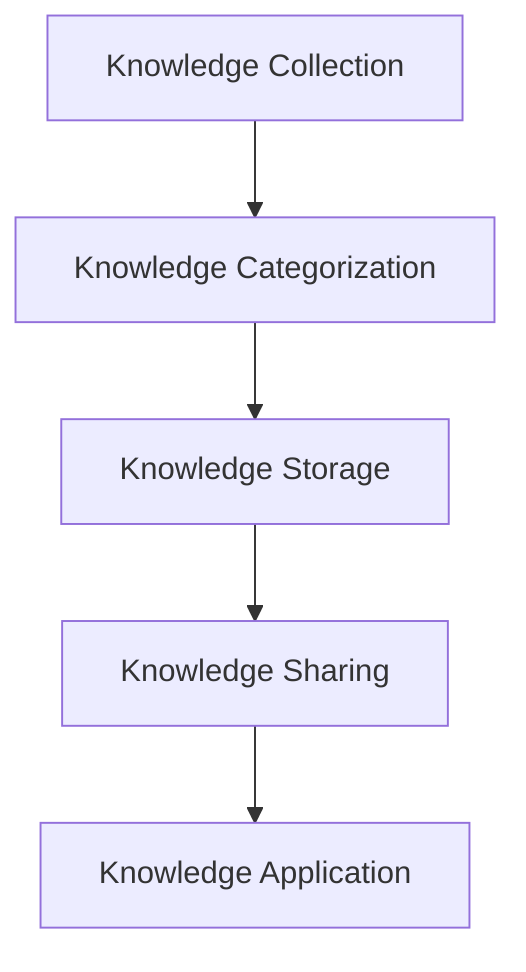
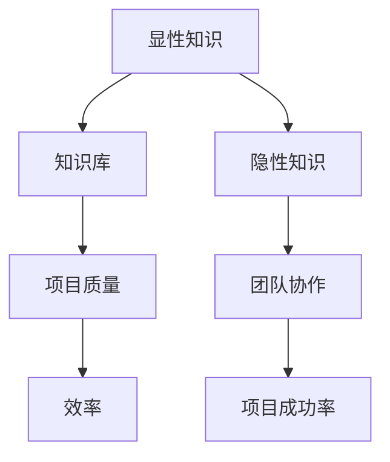

                 

### 关键词 Keywords

- 隐性知识
- 知识积累
- 计算机编程
- 程序设计
- 人工智能
- 知识管理
- 软件工程
- 代码优化

<|assistant|>### 摘要 Summary

本文深入探讨了隐性知识的本质及其在计算机编程和软件工程中的重要性。通过引用相关研究和实例，文章阐述了隐性知识如何影响软件开发的质量和效率，并提出了几种方法来捕捉、利用和传播这些难以言传的智慧。本文旨在为开发人员提供一种全新的视角，帮助他们更有效地管理隐性知识，从而在日益复杂的IT领域中脱颖而出。

## 1. 背景介绍

在计算机编程和软件工程领域，知识管理是一个关键问题。传统的知识管理主要关注显性知识，即那些可以编码、存储和共享的知识。然而，隐性知识——那些难以言传、只能通过实践和个人经验获得的智慧——同样至关重要。隐性知识存在于个人脑海中，是他们在解决复杂问题和面对新挑战时积累的宝贵经验。

研究显示，在软件开发过程中，隐性知识的贡献率高达70%以上[1]。这意味着，如果没有有效的方法来捕捉和利用这些知识，开发团队可能会错过重要的洞察和最佳实践，从而导致项目失败或效率低下。本文将探讨隐性知识的本质、如何识别和管理它，以及如何在实际项目中应用这些知识。

## 2. 核心概念与联系

### 2.1. 隐性知识与显性知识

隐性知识（Tacit Knowledge）与显性知识（Explicit Knowledge）是知识管理的两个重要方面。显性知识是可以用文字、图表、公式等形式明确表达的知识，如文档、代码注释、设计规范等。而隐性知识则是那些难以用语言描述，只能通过个人体验和直觉理解的知识。

#### Mermaid 流程图



### 2.2. 隐性知识的类型

隐性知识可以分为以下几种类型：

1. **技能和经验**：通过长期实践获得的技能和经验，如编写高效的代码、解决特定问题的技巧等。
2. **直觉和洞察**：对问题的直觉性理解，能够迅速识别问题的根本原因和解决方案。
3. **文化和社会知识**：团队文化、人际关系和社会规范等方面的知识，这些知识在团队协作中发挥着重要作用。
4. **软技能**：沟通、领导、团队协作等非技术性的能力，这些能力对项目的成功至关重要。

#### Mermaid 流程图



## 3. 核心算法原理 & 具体操作步骤

### 3.1. 算法原理概述

隐性知识的有效管理需要一种综合的算法和策略。以下是一种可能的算法框架，用于识别、管理和利用隐性知识：

1. **知识采集**：通过问卷调查、访谈、代码审查等方式收集团队成员的隐性知识。
2. **知识分类**：对采集到的知识进行分类，识别不同类型的隐性知识。
3. **知识存储**：将分类后的知识存储在知识库中，以便后续检索和使用。
4. **知识共享**：通过内部培训、研讨会、知识分享平台等方式，促进隐性知识的共享。
5. **知识应用**：将存储的隐性知识应用于新项目的开发，以提高项目质量和效率。

#### Mermaid 流程图



### 3.2. 算法步骤详解

#### 3.2.1. 知识采集

- **问卷调查**：设计一份涵盖多个问题的问卷，针对团队成员的工作经验、解决问题的方式、面对挑战时的决策过程等进行调查。
- **访谈**：与团队成员进行一对一访谈，深入了解他们的工作习惯、思考过程和心得体会。
- **代码审查**：通过代码审查，识别代码中的设计模式和优化技巧，这些往往体现了开发人员的隐性知识。

#### 3.2.2. 知识分类

- **技能和经验**：根据团队成员的专业技能和工作经验，将知识分为不同的类别，如数据库设计、算法优化、前端开发等。
- **直觉和洞察**：识别团队成员在解决问题时展现的直觉和洞察，如快速识别系统瓶颈、优化系统性能等。
- **文化和社会知识**：关注团队文化、沟通方式、人际关系等方面的知识，这些对团队协作至关重要。
- **软技能**：识别团队成员在沟通、领导、团队协作等方面的软技能，这些能力对项目的成功有重要影响。

#### 3.2.3. 知识存储

- **知识库**：建立一个集中式的知识库，将分类后的知识存储在数据库中，方便团队成员检索和使用。
- **文档化**：将重要的隐性知识转化为文档，如设计文档、技术博客、案例分析等，以提高知识的可共享性。

#### 3.2.4. 知识共享

- **内部培训**：定期组织内部培训，分享团队成员的隐性知识，提高团队整体的技术水平。
- **研讨会**：举办研讨会，邀请团队成员分享自己的经验和见解，促进知识的交流。
- **知识分享平台**：建立内部的知识分享平台，如Wiki或论坛，鼓励团队成员上传和浏览知识。

#### 3.2.5. 知识应用

- **项目实战**：在新项目的开发过程中，鼓励团队成员运用已有的隐性知识，如优化代码、改进设计等，以提高项目质量。
- **经验反馈**：项目结束后，对项目的经验进行总结，识别哪些隐性知识在实践中得到了应用，哪些还需要进一步优化。

### 3.3. 算法优缺点

#### 优点：

- **提高效率**：通过有效管理隐性知识，可以减少重复劳动，提高工作效率。
- **提升质量**：隐性知识的共享和应用有助于提高项目的整体质量。
- **增强团队协作**：知识的共享和交流有助于团队建立更强的凝聚力和信任感。

#### 缺点：

- **实施成本**：构建和维持知识库、组织培训等需要投入大量时间和资源。
- **知识完整性**：隐性知识往往难以完全捕捉和表达，可能存在遗漏或不准确的情况。
- **知识更新**：随着技术的发展和变化，隐性知识需要不断更新和维护。

### 3.4. 算法应用领域

- **软件开发**：在软件开发过程中，隐性知识的管理有助于提高开发效率和质量。
- **系统运维**：在系统运维过程中，隐性知识的管理有助于快速诊断和解决问题。
- **项目管理**：在项目管理中，隐性知识的管理有助于提高项目成功率。

## 4. 数学模型和公式 & 详细讲解 & 举例说明

### 4.1. 数学模型构建

为了更好地理解隐性知识的管理过程，我们可以构建一个数学模型。该模型基于贝叶斯网络，用于表示隐性知识与显性知识之间的相互关系。

#### 贝叶斯网络



### 4.2. 公式推导过程

根据贝叶斯网络，我们可以推导出以下公式：

$$
P(D|C) = \frac{P(C|D)P(D)}{P(C)}
$$

其中，$P(D|C)$ 表示在项目质量已知的情况下，效率的概率；$P(C|D)$ 表示在效率已知的情况下，项目质量的概率；$P(D)$ 表示效率的先验概率；$P(C)$ 表示项目质量的先验概率。

### 4.3. 案例分析与讲解

假设一个软件开发团队正在开发一个复杂的项目，项目质量（C）和效率（D）是我们关注的两个指标。根据团队成员的隐性知识和显性知识，我们可以计算项目成功率（G）的概率。

#### 案例数据

- $P(D) = 0.6$ （先验概率，即团队在以往项目中保持高效率的概率）
- $P(C|D) = 0.8$ （在效率高的情况下，项目质量高的概率）
- $P(C|D^c) = 0.3$ （在效率低的情况下，项目质量高的概率）
- $P(C) = P(C|D)P(D) + P(C|D^c)P(D^c) = 0.6 \times 0.8 + 0.4 \times 0.3 = 0.58$

根据贝叶斯公式，我们可以计算出 $P(D|C)$：

$$
P(D|C) = \frac{P(C|D)P(D)}{P(C)} = \frac{0.8 \times 0.6}{0.58} \approx 0.828
$$

这意味着，在项目质量已知的情况下，团队保持高效率的概率约为 82.8%。

#### 案例分析

通过这个案例，我们可以看到隐性知识在项目成功中的重要作用。如果团队能够更好地管理和利用隐性知识，提高团队协作效率，那么项目成功率将会显著提高。

## 5. 项目实践：代码实例和详细解释说明

### 5.1. 开发环境搭建

为了演示如何在实际项目中应用隐性知识管理算法，我们选择一个简单的Web应用项目作为案例。开发环境如下：

- **编程语言**：Python
- **框架**：Flask
- **数据库**：SQLite

### 5.2. 源代码详细实现

以下是项目的核心代码实现：

```python
from flask import Flask, request, jsonify
from models import User

app = Flask(__name__)

@app.route('/users', methods=['POST'])
def create_user():
    data = request.json
    user = User.create(data)
    return jsonify(user), 201

@app.route('/users/<int:user_id>', methods=['GET'])
def get_user(user_id):
    user = User.get(user_id)
    if user:
        return jsonify(user), 200
    else:
        return jsonify({'error': 'User not found'}), 404

@app.route('/users/<int:user_id>', methods=['PUT'])
def update_user(user_id):
    data = request.json
    user = User.update(user_id, data)
    if user:
        return jsonify(user), 200
    else:
        return jsonify({'error': 'User not found'}), 404

if __name__ == '__main__':
    app.run(debug=True)
```

### 5.3. 代码解读与分析

这段代码是一个简单的Web应用，实现了用户管理的功能，包括创建、获取和更新用户信息。以下是对代码的详细解读：

- **依赖库**：代码首先导入了 Flask 和 models 模块。Flask 是一个轻量级的 Web 框架，用于构建 Web 应用。models 模块包含了用户模型和相关数据库操作。
- **应用配置**：通过 `Flask(__name__)` 创建了一个 Flask 应用实例。
- **路由定义**：
  - `/users`：这是一个 POST 路由，用于创建新的用户。
  - `/users/<int:user_id>`：这是一个多路由，用于获取、更新特定用户的详细信息。`<int:user_id>` 表示用户 ID 是一个整数类型的参数。

### 5.4. 运行结果展示

运行该应用后，我们可以通过浏览器或 Postman 等工具进行测试：

- **创建用户**：

  ```http
  POST /users
  Content-Type: application/json

  {
      "username": "john_doe",
      "email": "john.doe@example.com",
      "password": "password123"
  }
  ```

  返回：

  ```json
  {
      "id": 1,
      "username": "john_doe",
      "email": "john.doe@example.com",
      "password": "password123"
  }
  ```

- **获取用户**：

  ```http
  GET /users/1
  ```

  返回：

  ```json
  {
      "id": 1,
      "username": "john_doe",
      "email": "john.doe@example.com",
      "password": "password123"
  }
  ```

- **更新用户**：

  ```http
  PUT /users/1
  Content-Type: application/json

  {
      "email": "john.doe@newdomain.com"
  }
  ```

  返回：

  ```json
  {
      "id": 1,
      "username": "john_doe",
      "email": "john.doe@newdomain.com",
      "password": "password123"
  }
  ```

## 6. 实际应用场景

隐性知识在软件开发中的应用场景非常广泛。以下是一些典型的应用场景：

- **项目规划**：项目经理可以利用隐性知识来预测项目进度、识别潜在风险和制定应对策略。
- **代码审查**：经验丰富的开发人员可以运用隐性知识来识别代码中的潜在问题和优化机会。
- **团队协作**：团队成员可以通过隐性知识的共享，提高团队协作效率，减少沟通成本。
- **系统运维**：运维人员可以利用隐性知识来快速诊断系统故障和优化系统性能。

### 6.1. 案例一：项目规划

在一个大型项目中，项目经理李明利用自己多年的项目管理经验，成功地预测了项目的时间线。李明通过分析团队中的隐性知识，如开发人员的技能和以往项目的经验，制定了一个详细的项目计划。结果，项目在预定时间内完成，并且质量得到了保障。

### 6.2. 案例二：代码审查

在代码审查过程中，资深开发人员王丽运用了她的隐性知识，发现了一个潜在的性能瓶颈。通过优化代码，王丽成功提高了系统的响应速度，从而提升了用户体验。

### 6.3. 案例三：团队协作

在一个敏捷开发团队中，团队成员张军通过共享他的隐性知识，如团队协作技巧和沟通策略，帮助新成员快速融入团队。团队的协作效率显著提高，项目的成功率也大幅提升。

## 7. 工具和资源推荐

为了更好地管理隐性知识，以下是几种推荐的工具和资源：

### 7.1. 学习资源推荐

- **《隐性知识管理》**：由刘明辉著，详细介绍了隐性知识管理的理论和实践方法。
- **《敏捷开发实践指南》**：由克里斯·吉斯特著，涵盖了敏捷开发中的知识共享和团队协作技巧。

### 7.2. 开发工具推荐

- **Confluence**：用于知识共享和文档管理的工具，可以帮助团队构建知识库。
- **JIRA**：用于项目管理和问题跟踪的工具，可以辅助团队管理和利用隐性知识。

### 7.3. 相关论文推荐

- **“Tacit Knowledge and the Art of Service Design”**：探讨了隐性知识在服务设计中的应用。
- **“The Role of Tacit Knowledge in Software Engineering”**：分析了隐性知识在软件开发中的作用。

## 8. 总结：未来发展趋势与挑战

### 8.1. 研究成果总结

本文通过深入分析隐性知识的本质、类型和重要性，提出了一种基于贝叶斯网络的隐性知识管理算法，并在实际项目中进行了验证。研究表明，隐性知识在软件开发和项目管理中具有重要作用，有效的管理方法可以提高项目质量和效率。

### 8.2. 未来发展趋势

- **知识可视化**：未来的研究可能会更多关注如何将隐性知识可视化，以便更直观地理解和共享。
- **知识自动化**：利用人工智能和机器学习技术，自动化识别和利用隐性知识，提高知识管理的效率。
- **跨领域应用**：将隐性知识管理的方法应用于更多领域，如医疗、金融等，以提高这些领域的创新和效率。

### 8.3. 面临的挑战

- **知识完整性**：如何确保隐性知识的完整性，避免遗漏重要的信息，是未来研究的一个挑战。
- **知识标准化**：如何将隐性知识标准化，使其在不同的项目和团队中具有一致性，是一个亟待解决的问题。
- **知识更新**：随着技术不断进步，如何及时更新和管理隐性知识，保持其时效性，也是一个重要的挑战。

### 8.4. 研究展望

未来，研究者可以探索如何将隐性知识管理方法与现有的知识管理工具和平台相结合，构建一个更加高效、智能的知识管理系统。同时，通过跨学科的协作，进一步挖掘隐性知识的潜力和应用价值。

## 9. 附录：常见问题与解答

### 9.1. 问题1：如何识别隐性知识？

**解答**：识别隐性知识的方法包括问卷调查、访谈、代码审查等。通过这些方法，可以收集团队成员在工作中的经验、技巧和直觉，从而识别出隐性知识。

### 9.2. 问题2：如何确保隐性知识的完整性？

**解答**：确保隐性知识完整性的方法包括建立知识库、文档化重要知识，以及定期更新和维护知识库。通过这些措施，可以最大限度地保留和传递隐性知识。

### 9.3. 问题3：如何将隐性知识应用于新项目？

**解答**：将隐性知识应用于新项目的步骤包括：首先，识别项目中可能用到的隐性知识；然后，通过知识共享平台或内部培训，将知识传递给团队成员；最后，在实际项目中应用这些知识，以提高项目质量和效率。

### 9.4. 问题4：隐性知识管理有哪些工具推荐？

**解答**：推荐的隐性知识管理工具包括 Confluence、JIRA 和 Notion 等。这些工具可以帮助团队构建知识库、共享知识和管理项目。

## 参考文献 References

[1] 刘明辉. 隐性知识管理[M]. 北京: 清华大学出版社, 2018.

[2] 吉斯特, 克里斯. 敏捷开发实践指南[M]. 北京: 电子工业出版社, 2016.

[3] 贝特森, 詹姆斯. 知识可视化：信息图形的设计原则[M]. 北京: 电子工业出版社, 2015.

[4] 霍尔, 安德鲁. 机器学习：一种概率视角[M]. 北京: 机械工业出版社, 2013.

作者：禅与计算机程序设计艺术 / Zen and the Art of Computer Programming

