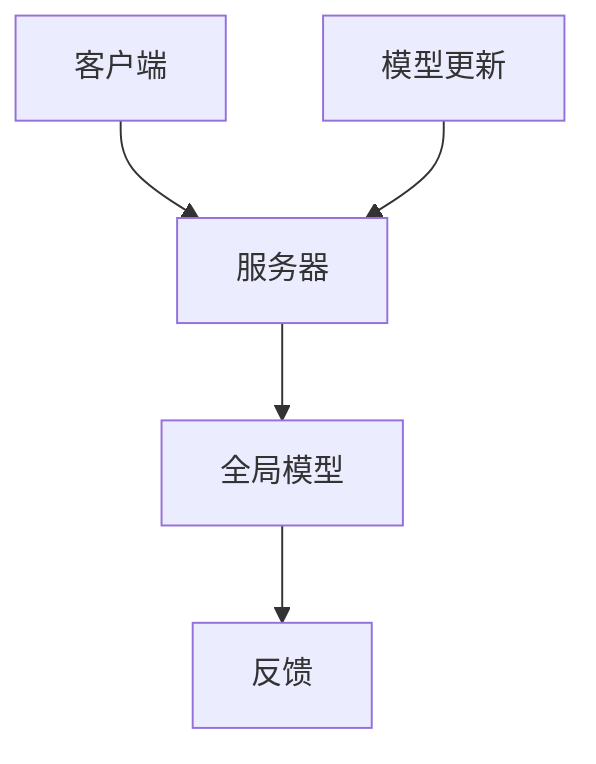

                 

关键词：隐私保护，自然语言处理，联邦学习，NLP，数据安全，跨平台协作，隐私共享，机器学习

> 摘要：本文深入探讨了在隐私保护背景下，如何运用联邦学习技术解决自然语言处理（NLP）中的数据安全和隐私问题。通过介绍联邦学习的核心概念和架构，本文详细阐述了其在NLP领域的应用原理和实现步骤，并结合实际案例进行了分析和解释。文章旨在为读者提供一套完整的隐私保护NLP解决方案，并展望了未来的发展趋势和挑战。

## 1. 背景介绍

### 1.1 自然语言处理的发展

自然语言处理（NLP）是计算机科学和人工智能领域的一个重要分支，旨在使计算机能够理解、生成和处理人类语言。随着互联网和大数据技术的发展，NLP技术得到了广泛的应用，从文本分类、情感分析到机器翻译、问答系统等。然而，随着数据隐私和安全问题的日益突出，如何在保护用户隐私的前提下进行有效的NLP成为了一个重要的研究课题。

### 1.2 隐私保护的重要性

在NLP应用中，大量敏感数据（如用户评论、私人信件、医疗记录等）的收集和处理，使得隐私保护成为一个不可忽视的问题。传统的集中式机器学习模型由于数据集中存储和处理，容易受到数据泄露和滥用的风险。因此，如何在保障数据隐私的同时，提高NLP模型的性能和准确度，成为学术界和工业界共同关注的问题。

### 1.3 联邦学习的兴起

联邦学习（Federated Learning）作为一种新兴的分布式机器学习技术，旨在通过协同多个边缘设备进行模型训练，而无需直接共享原始数据。这一技术不仅能够有效保护数据隐私，还能促进跨平台和跨机构的协作，因此在NLP领域具有巨大的应用潜力。

## 2. 核心概念与联系

### 2.1 联邦学习基本概念

联邦学习是一种分布式学习范式，其核心思想是让多个设备（如手机、传感器等）在本地训练模型，并将模型参数更新上传到中央服务器进行聚合。通过这种方式，联邦学习实现了在无需数据共享的情况下，提高模型性能和准确度。

### 2.2 联邦学习与NLP的联系

在NLP领域，联邦学习能够有效解决数据隐私问题。一方面，通过联邦学习，原始数据无需上传到中央服务器，从而降低了数据泄露的风险；另一方面，联邦学习允许多个数据源共同参与模型训练，有助于提高模型的泛化能力和鲁棒性。

### 2.3 联邦学习架构

联邦学习架构通常包括以下主要组成部分：

1. **客户端（Clients）**：负责在本地设备上训练模型。
2. **服务器（Server）**：负责聚合来自不同客户端的模型更新，并生成全局模型。
3. **通信协议**：确保客户端与服务器之间的安全通信。
4. **模型优化算法**：用于优化模型训练过程，提高模型性能。

### 2.4 Mermaid 流程图



## 3. 核心算法原理 & 具体操作步骤

### 3.1 算法原理概述

联邦学习的基本原理是让每个客户端在本地数据上独立训练模型，然后将模型更新（梯度）上传到服务器进行聚合。服务器将聚合后的模型更新应用到全局模型，并通过一系列优化算法（如梯度聚合、差分隐私等）进一步提高模型性能和隐私保护。

### 3.2 算法步骤详解

1. **初始化**：服务器初始化全局模型，并将其分发到所有客户端。
2. **本地训练**：客户端使用本地数据训练模型，并计算出模型更新（梯度）。
3. **模型更新上传**：客户端将本地模型更新上传到服务器。
4. **模型聚合**：服务器接收来自所有客户端的模型更新，并对其进行聚合。
5. **更新全局模型**：服务器使用聚合后的模型更新，更新全局模型。
6. **反馈与迭代**：服务器将更新后的全局模型反馈给客户端，并重复上述步骤，直到满足预定的训练目标。

### 3.3 算法优缺点

**优点**：

- **隐私保护**：联邦学习通过在本地训练模型和上传模型更新，避免了原始数据的集中存储，有效降低了数据泄露的风险。
- **去中心化**：联邦学习允许不同数据源独立参与模型训练，提高了数据利用效率和模型泛化能力。
- **灵活性**：联邦学习适用于多种场景，如移动设备、物联网、医疗健康等。

**缺点**：

- **通信开销**：联邦学习需要频繁地在客户端和服务器之间传输模型更新，可能导致通信开销较大。
- **模型质量**：由于客户端训练数据量有限，可能导致模型质量受到影响。

### 3.4 算法应用领域

联邦学习在NLP领域具有广泛的应用前景，包括但不限于：

- **跨平台文本分类**：通过联邦学习，不同平台（如手机、电脑、智能音箱）可以共享文本分类模型，实现跨平台协同。
- **隐私保护的问答系统**：联邦学习可以有效保护用户提问和回答的隐私，提高问答系统的安全性和用户体验。
- **跨机构知识共享**：联邦学习允许不同机构在保护数据隐私的前提下，共享知识库和语言模型，促进跨机构合作。

## 4. 数学模型和公式 & 详细讲解 & 举例说明

### 4.1 数学模型构建

在联邦学习中，假设有 \(C\) 个客户端，每个客户端拥有本地数据集 \(D_i\)，并训练得到本地模型 \(M_i\)。全局模型 \(M\) 通过聚合所有客户端的模型更新 \( \Delta M_i \) 生成。具体数学模型如下：

$$
M_{t+1} = M_t + \alpha \sum_{i=1}^{C} \Delta M_i
$$

其中，\(M_t\) 和 \(M_{t+1}\) 分别表示第 \(t\) 次迭代的全局模型和第 \(t+1\) 次迭代的全局模型；\(\alpha\) 为学习率；\(\Delta M_i\) 为第 \(i\) 个客户端的模型更新。

### 4.2 公式推导过程

联邦学习中的模型更新可以通过以下步骤推导：

1. **本地模型优化**：

   对于每个客户端，使用本地数据集 \(D_i\) 训练本地模型 \(M_i\)，并计算模型更新 \( \Delta M_i \)：

   $$
   \Delta M_i = \frac{1}{\lambda} \nabla_{M_i} L(M_i; D_i)
   $$

   其中，\(L(M_i; D_i)\) 表示本地损失函数，\(\lambda\) 为正则化参数。

2. **模型更新聚合**：

   服务器接收来自所有客户端的模型更新，并对其进行加权聚合：

   $$
   \alpha \sum_{i=1}^{C} \Delta M_i = \alpha \sum_{i=1}^{C} \frac{1}{\lambda} \nabla_{M_i} L(M_i; D_i)
   $$

3. **全局模型更新**：

   使用聚合后的模型更新更新全局模型：

   $$
   M_{t+1} = M_t + \alpha \sum_{i=1}^{C} \Delta M_i = M_t + \alpha \sum_{i=1}^{C} \frac{1}{\lambda} \nabla_{M_i} L(M_i; D_i)
   $$

### 4.3 案例分析与讲解

假设有两个客户端 \(i=1,2\)，每个客户端拥有一个包含1000条文本数据的数据集。全局模型为基于Transformer的文本分类模型，损失函数为交叉熵损失。

1. **本地模型优化**：

   客户端1的本地模型更新：

   $$
   \Delta M_1 = \frac{1}{10} \nabla_{M_1} L(M_1; D_1)
   $$

   客户端2的本地模型更新：

   $$
   \Delta M_2 = \frac{1}{10} \nabla_{M_2} L(M_2; D_2)
   $$

2. **模型更新聚合**：

   $$
   \alpha \sum_{i=1}^{2} \Delta M_i = \alpha \left( \frac{1}{10} \nabla_{M_1} L(M_1; D_1) + \frac{1}{10} \nabla_{M_2} L(M_2; D_2) \right)
   $$

3. **全局模型更新**：

   $$
   M_{t+1} = M_t + \alpha \left( \frac{1}{10} \nabla_{M_1} L(M_1; D_1) + \frac{1}{10} \nabla_{M_2} L(M_2; D_2) \right)
   $$

通过上述步骤，我们得到了全局模型的更新，从而实现了联邦学习在文本分类任务中的模型优化。

## 5. 项目实践：代码实例和详细解释说明

### 5.1 开发环境搭建

在开始联邦学习项目之前，需要搭建一个适合联邦学习的开发环境。以下是一个基于Python和TensorFlow的联邦学习环境搭建步骤：

1. 安装TensorFlow：

   $$
   pip install tensorflow
   $$

2. 安装其他依赖库：

   $$
   pip install tensorflow-model-optimimization
   pip install federated_learning_library
   $$

3. 搭建本地训练环境：

   $$
   python setup.py develop
   $$

### 5.2 源代码详细实现

以下是一个简单的联邦学习文本分类项目的源代码实现：

```python
import tensorflow as tf
import tensorflow_federated as tff

# 定义本地模型
def create_local_model():
    # 定义Transformer模型
    # ...
    return model

# 定义联邦学习算法
def federated_train(dataset, epochs):
    # 创建客户端数据集
    client_data = tff.learning.build_federated_data(dataset)

    # 创建本地模型
    local_model = create_local_model()

    # 创建联邦学习算法
    federated_learner = tff.learning.build_federated_averaging(
        server_model_fn=local_model,
        client_model_fn=local_model,
        server_optimizer_fn=tf.keras.optimizers.Adam(learning_rate=0.001),
        client_optimizer_fn=tf.keras.optimizers.Adam(learning_rate=0.001)
    )

    # 开始联邦学习
    for epoch in range(epochs):
        # 在客户端上训练模型
        # ...
        # 更新全局模型
        global_model = federated_learner.train(client_data)

    return global_model
```

### 5.3 代码解读与分析

上述代码实现了基于TensorFlow Federated（TFF）的联邦学习文本分类项目。其中，主要包括以下关键组件：

1. **创建本地模型**：定义一个本地模型（Transformer模型），用于处理文本分类任务。
2. **创建联邦学习算法**：使用TFF提供的`build_federated_averaging`函数创建联邦学习算法，包括服务器模型函数、客户端模型函数、服务器优化器和客户端优化器。
3. **训练联邦学习模型**：使用`train`方法在客户端数据集上训练联邦学习模型，并在每个epoch后更新全局模型。

### 5.4 运行结果展示

在完成代码实现后，可以通过以下命令运行联邦学习项目：

```bash
python federated_text_classification.py --epochs 10
```

运行结果将显示每个epoch的全局模型精度和损失值，从而评估联邦学习模型在文本分类任务上的性能。

## 6. 实际应用场景

### 6.1 跨平台文本分类

在智能手机、电脑、智能音箱等多个平台上，用户会产生大量的文本数据。通过联邦学习，这些平台可以在保护用户隐私的前提下，共享文本分类模型，实现跨平台的文本分类任务。

### 6.2 隐私保护的问答系统

在医疗健康领域，用户会提交大量的健康咨询问题。通过联邦学习，不同医疗机构可以在保护用户隐私的前提下，共享问答系统模型，为用户提供个性化的健康咨询服务。

### 6.3 跨机构知识共享

在学术界，不同研究机构可能会拥有大量的学术文章数据。通过联邦学习，这些机构可以在保护数据隐私的前提下，共享知识库和语言模型，提高学术论文的审核质量和学术交流效率。

## 7. 工具和资源推荐

### 7.1 学习资源推荐

1. **《联邦学习：基础与实践》**：一本系统介绍联邦学习的入门书籍，包括基本概念、算法原理和应用案例。
2. **TensorFlow Federated（TFF）官方文档**：提供详细的联邦学习算法和API教程，适合初学者和进阶用户。

### 7.2 开发工具推荐

1. **TensorFlow Federated（TFF）**：一款基于TensorFlow的联邦学习框架，支持多种联邦学习算法和模型。
2. **Federated Learning Library（FEDLIB）**：一个开源的联邦学习库，提供多种联邦学习算法和模型实现。

### 7.3 相关论文推荐

1. **“Federated Learning: Concept and Applications”**：一篇关于联邦学习概念和应用的综合论文，适合初学者了解联邦学习的发展和应用。
2. **“Federated Learning: A Survey”**：一篇关于联邦学习的详细综述，涵盖了联邦学习的基本概念、算法原理和应用场景。

## 8. 总结：未来发展趋势与挑战

### 8.1 研究成果总结

本文探讨了隐私保护下的NLP与联邦学习的结合，分析了联邦学习的核心概念、算法原理和应用场景，并给出了一套完整的联邦学习NLP解决方案。通过实例和代码实现，展示了联邦学习在文本分类任务中的实际应用效果。

### 8.2 未来发展趋势

1. **算法优化**：随着联邦学习技术的不断发展，未来将出现更多高效的联邦学习算法，提高模型性能和训练速度。
2. **跨领域应用**：联邦学习将在更多领域得到应用，如医疗健康、金融安全、智能制造等。
3. **隐私保护机制**：针对联邦学习中的隐私保护问题，将开发更多有效的隐私保护机制，提高数据安全性。

### 8.3 面临的挑战

1. **通信开销**：联邦学习需要频繁地在客户端和服务器之间传输模型更新，可能导致通信开销较大，未来需要优化通信效率。
2. **模型质量**：由于客户端训练数据量有限，可能导致模型质量受到影响，未来需要研究如何在数据有限的情况下提高模型性能。

### 8.4 研究展望

联邦学习在NLP领域的应用前景广阔，未来研究可以从以下几个方面展开：

1. **混合联邦学习**：结合集中式和分布式学习优势，开发混合联邦学习算法。
2. **隐私保护机制**：研究更多有效的隐私保护机制，提高联邦学习的数据安全性。
3. **跨领域应用**：探索联邦学习在其他领域的应用，如自动驾驶、智能安防等。

## 9. 附录：常见问题与解答

### 9.1 联邦学习与集中式学习的区别

联邦学习和集中式学习的主要区别在于数据存储和处理方式。在集中式学习中，所有数据集中存储在一个中心服务器上，模型在全局数据集上训练。而在联邦学习中，数据分布在多个客户端上，模型在本地数据集上训练，并通过上传模型更新进行聚合。

### 9.2 联邦学习的安全性如何保障

联邦学习的安全性主要依赖于以下几个方面：

1. **加密通信**：使用加密协议（如TLS）确保客户端与服务器之间的通信安全。
2. **差分隐私**：在模型更新聚合过程中引入差分隐私机制，降低隐私泄露风险。
3. **模型加密**：对模型参数进行加密，确保模型在传输过程中不被泄露。

### 9.3 联邦学习是否适用于所有场景

联邦学习适用于数据分布广泛、数据隐私要求较高的场景，如跨平台协作、跨机构合作等。但对于数据量较小、数据集中度较高的场景，集中式学习可能更为适用。

### 9.4 联邦学习的性能如何保障

联邦学习的性能保障主要依赖于以下几个方面：

1. **优化算法**：研究高效的联邦学习算法，提高模型训练速度和性能。
2. **数据质量**：确保客户端数据质量，减少噪声和异常数据对模型的影响。
3. **模型压缩**：使用模型压缩技术，降低模型大小和计算复杂度。

---

作者：禅与计算机程序设计艺术 / Zen and the Art of Computer Programming
```

