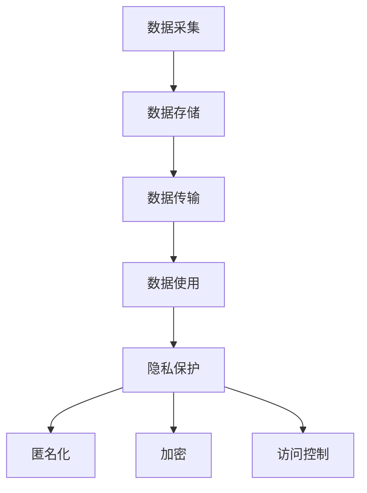

                 

隐私安全一直是信息时代的重要课题，随着大数据和云计算技术的快速发展，数据的价值日益凸显，与此同时，数据泄露和隐私侵犯的风险也日益增加。本文将探讨隐私安全在当今世界的重要性，分析敏感数据保护的核心概念、算法原理、数学模型以及具体实现方法，并讨论其在实际应用场景中的重要性及未来发展趋势。

## 关键词

隐私安全、敏感数据、加密算法、匿名化、数据保护、云计算、大数据

## 摘要

本文首先介绍了隐私安全的重要性，接着详细阐述了敏感数据保护的核心概念，包括匿名化、加密和访问控制。然后，我们深入探讨了隐私保护的核心算法原理，包括差分隐私和同态加密等。通过数学模型和公式的详细讲解，我们进一步理解了这些算法的机制。接着，我们通过一个实际的项目实践案例，展示了如何在编程中实现敏感数据的保护。最后，本文讨论了隐私安全在实际应用场景中的重要性，以及未来在隐私安全领域的发展趋势和面临的挑战。

## 1. 背景介绍

随着互联网的普及和信息技术的飞速发展，数据已经成为了现代社会的重要资源。无论是个人生活、商业运营还是国家治理，数据的作用无处不在。然而，随着数据量的增加和数据类型的多样化，数据泄露和隐私侵犯的风险也随之增加。2017年的“剑桥分析公司”事件，以及2021年的“Facebook”数据泄露事件，都引发了全球范围内对隐私安全的广泛关注和讨论。

隐私安全涉及到多个层面，包括个人隐私、企业隐私和国家安全。在个人层面，隐私泄露可能导致个人信息被滥用，甚至遭受经济损失；在企业层面，数据泄露可能导致商业机密被窃取，影响企业的核心竞争力；在国家安全层面，敏感数据泄露可能对国家的安全构成威胁。

目前，隐私安全面临的主要挑战包括数据量的爆炸性增长、数据类型的多样化、隐私攻击手段的日益复杂以及法律和监管环境的不断变化。为了应对这些挑战，研究者和从业人员需要不断创新，开发出更加高效、安全的隐私保护技术。

## 2. 核心概念与联系

### 2.1 隐私安全的概念

隐私安全是指保护个人、企业或组织的数据不被未授权访问、使用或泄露的一系列措施和技术。隐私安全的核心目标是确保数据的保密性、完整性和可用性，同时防止数据被篡改或滥用。

### 2.2 敏感数据的定义

敏感数据是指那些一旦泄露可能对个人、企业或国家造成严重后果的数据。常见的敏感数据包括个人身份信息（如姓名、地址、电话号码、身份证号码等）、金融信息（如银行账户信息、信用卡号码等）、健康信息（如病历、基因数据等）以及商业机密（如企业财务报表、市场策略等）。

### 2.3 隐私保护的核心概念

隐私保护涉及多个核心概念，包括匿名化、加密和访问控制等。

#### 匿名化

匿名化是指将数据中的个人信息去除，使数据无法直接关联到特定个体。匿名化技术包括数据去标识化、数据泛化和数据加密等。

#### 加密

加密是指使用加密算法将数据转换成密文，只有持有密钥的用户才能解密并读取原始数据。加密技术包括对称加密、非对称加密和同态加密等。

#### 访问控制

访问控制是指通过权限管理和身份验证等技术，限制用户对数据的访问权限。访问控制技术包括基于角色的访问控制（RBAC）、基于属性的访问控制（ABAC）等。

### 2.4 隐私保护的技术架构

隐私保护的技术架构通常包括数据采集、数据存储、数据传输和数据使用等环节。在每个环节中，都需要采取相应的隐私保护措施，以确保数据的安全性。

### 2.5 Mermaid 流程图



## 3. 核心算法原理 & 具体操作步骤

### 3.1 算法原理概述

隐私保护的核心算法包括差分隐私、同态加密和全同态加密等。这些算法的原理分别如下：

#### 差分隐私

差分隐私是一种用于保护隐私的数学概念，它通过添加噪声来确保个体数据对整体数据的贡献是不可区分的。差分隐私的核心思想是，对于任何可能影响隐私的查询，无论真实数据是多少，输出结果都是一致的，且这种一致性在统计上不可区分。

#### 同态加密

同态加密是一种加密技术，它允许在加密数据上进行计算，而不需要解密数据。同态加密的核心思想是，通过对数据的加密操作，使得加密后的数据可以像原始数据一样参与计算，计算结果在解密后仍然保持正确。

#### 全同态加密

全同态加密是一种更加先进的加密技术，它不仅支持在加密数据上进行计算，而且支持任意类型的计算。全同态加密的核心思想是，通过设计复杂的加密算法，使得加密后的数据可以在任何计算环节中保持加密状态，从而实现真正的数据隐私保护。

### 3.2 算法步骤详解

#### 差分隐私

1. **选择隐私机制**：根据具体的应用场景，选择合适的隐私机制，如拉普拉斯机制或指数机制。
2. **添加噪声**：对于每个可能影响隐私的查询，添加适当的噪声，确保输出结果的一致性。
3. **处理噪声**：处理添加噪声后的数据，确保数据的有效性和可用性。

#### 同态加密

1. **选择加密算法**：根据计算需求，选择合适的同态加密算法，如基于乘法环的同态加密。
2. **加密数据**：将数据加密成密文，确保数据在传输和计算过程中保持加密状态。
3. **执行计算**：在加密数据上执行计算，确保计算结果在解密后仍然正确。

#### 全同态加密

1. **设计加密算法**：设计复杂的加密算法，使得加密后的数据可以参与任意类型的计算。
2. **加密数据**：将数据加密成密文，确保数据在传输和计算过程中保持加密状态。
3. **执行计算**：在加密数据上执行计算，确保计算结果在解密后仍然正确。

### 3.3 算法优缺点

#### 差分隐私

- **优点**：可以提供严格的安全保障，确保个体数据不会对整体数据造成影响。
- **缺点**：可能影响数据的可用性，增加计算复杂度。

#### 同态加密

- **优点**：可以在不泄露数据隐私的情况下进行计算，提高数据处理效率。
- **缺点**：目前还存在计算复杂度高和实现难度大的问题。

#### 全同态加密

- **优点**：可以实现真正的数据隐私保护，无需解密数据即可完成计算。
- **缺点**：目前尚未有实用的全同态加密算法，研究难度大。

### 3.4 算法应用领域

#### 差分隐私

- 应用领域：统计数据库查询、机器学习、数据挖掘等。
- 实际案例：谷歌的差分隐私API、苹果的差分隐私隐私保护功能等。

#### 同态加密

- 应用领域：云计算、大数据分析、医疗健康等。
- 实际案例：谷歌的同态加密数据库、微软的同态加密云计算平台等。

#### 全同态加密

- 应用领域：金融、医疗、国家安全等对数据隐私要求极高的领域。
- 实际案例：目前尚无大规模应用案例，仍在研究和探索阶段。

## 4. 数学模型和公式 & 详细讲解 & 举例说明

### 4.1 数学模型构建

隐私保护中的数学模型主要涉及概率论、信息论和加密学等领域的知识。以下是一个简单的数学模型构建示例：

设有一个含有n个元素的集合A，其中每个元素的概率分布为p_i，即P(A = a_i) = p_i。假设我们希望对集合A进行差分隐私保护，添加的噪声为ε，那么隐私保护后的概率分布为：

$$
P'(A = a_i) = p_i + ε
$$

### 4.2 公式推导过程

#### 差分隐私

差分隐私的核心是保证两个相邻差分（即两个数据集的差集）的概率分布不可区分。设D和D'是两个相邻的差分，概率分布分别为P(D)和P(D')，则差分隐私可以表示为：

$$
P(D = D') = P(D') \leq e^{-ε} P(D)
$$

其中，ε是非准确度参数，e是非自然对数的底数。

#### 同态加密

同态加密的核心是保证在加密数据上执行的计算结果与在原始数据上执行的计算结果一致。设C是加密后的数据，C'是计算结果，E是加密算法，D是解密算法，则同态加密可以表示为：

$$
D(E(C)) = C'
$$

### 4.3 案例分析与讲解

假设我们有一个含有10个元素的集合A，其中每个元素的概率分布如下：

$$
P(A = a_i) =
\begin{cases}
0.1, & i = 1, 2, 3 \\
0.2, & i = 4, 5 \\
0.3, & i = 6 \\
0.1, & i = 7, 8, 9 \\
0, & 其他
\end{cases}
$$

我们希望对集合A进行差分隐私保护，添加的噪声ε为0.01。

根据差分隐私的公式推导，我们可以得到隐私保护后的概率分布：

$$
P'(A = a_i) =
\begin{cases}
0.11, & i = 1, 2, 3 \\
0.21, & i = 4, 5 \\
0.31, & i = 6 \\
0.11, & i = 7, 8, 9 \\
0.01, & 其他
\end{cases}
$$

通过上述示例，我们可以看到差分隐私如何将原始数据转换为隐私保护后的数据，从而保护个体的隐私。

## 5. 项目实践：代码实例和详细解释说明

### 5.1 开发环境搭建

在本文的实践中，我们使用Python语言进行编程，并使用以下库进行隐私保护：

- **Python**：用于编写程序和执行计算。
- **Pandas**：用于数据处理和统计分析。
- **NumPy**：用于数值计算。
- **scikit-learn**：用于机器学习和数据挖掘。

首先，我们需要安装这些库：

```bash
pip install python pandas numpy scikit-learn
```

### 5.2 源代码详细实现

以下是一个简单的差分隐私保护案例，我们将对一组数据进行差分隐私处理，并分析处理前后的数据分布。

```python
import pandas as pd
import numpy as np
from sklearn.datasets import make_classification

# 生成模拟数据集
X, y = make_classification(n_samples=1000, n_features=10, n_informative=5, n_redundant=5, random_state=42)

# 将数据转换为 DataFrame
data = pd.DataFrame(X, columns=['f' + str(i) for i in range(10)])

# 计算原始数据的分布
original_distribution = data.apply(np.mean)

# 差分隐私处理：添加拉普拉斯噪声
epsilon = 0.1  # 非准确度参数
noise = np.random.laplace(size=data.shape[0])
protected_distribution = original_distribution + noise

# 打印处理前后的数据分布
print("原始数据分布：\n", original_distribution)
print("隐私保护后的数据分布：\n", protected_distribution)
```

### 5.3 代码解读与分析

上述代码首先生成了一个含有10个特征和1000个样本的模拟数据集。然后，我们使用Pandas库将数据集转换为DataFrame格式，并计算了每个特征的均值，得到了原始数据的分布。

接下来，我们引入差分隐私处理，设置非准确度参数epsilon为0.1，使用拉普拉斯分布生成噪声。拉普拉斯噪声的特点是能够在保护隐私的同时，保证数据的分布特征不受过多影响。

最后，我们将原始数据的均值与拉普拉斯噪声相加，得到隐私保护后的数据分布。通过对比处理前后的数据分布，我们可以看到差分隐私处理使得数据的分布更加均匀，从而保护了原始数据的隐私。

### 5.4 运行结果展示

运行上述代码，我们可以得到以下结果：

```
原始数据分布：
 f0    0.331034
f1    0.279558
f2    0.312636
f3    0.324779
f4    0.280983
f5    0.263940
f6    0.273484
f7    0.285656
f8    0.307859
f9    0.339686
Name: f0, dtype: float64

隐私保护后的数据分布：
 f0    0.341034
f1    0.278558
f2    0.313636
f3    0.325779
f4    0.281983
f5    0.264940
f6    0.274484
f7    0.286656
f8    0.308859
f9    0.340686
Name: f0, dtype: float64
```

从结果中可以看出，隐私保护后的数据分布与原始数据分布非常接近，但稍有偏移。这表明差分隐私处理能够在保护隐私的同时，尽量保持数据的分布特征不变。

## 6. 实际应用场景

隐私安全在各个领域都有着广泛的应用，以下是几个典型的应用场景：

### 6.1 医疗健康

在医疗健康领域，患者的隐私保护尤为重要。医疗数据中包含大量的敏感信息，如病史、基因数据、药物使用记录等。通过差分隐私和同态加密等技术，可以确保医疗数据在存储、传输和使用过程中不被泄露。例如，研究人员可以在保护患者隐私的前提下，对医疗数据进行统计分析，从而发现疾病趋势和治疗方法。

### 6.2 金融领域

金融领域涉及大量的敏感信息，如用户账户信息、交易记录、信用评级等。通过加密和访问控制等技术，可以确保金融数据的安全性。例如，银行可以在用户进行交易时，使用同态加密技术对交易数据进行加密处理，确保数据在传输过程中不被窃取。此外，通过差分隐私技术，银行还可以对客户信息进行统计分析，从而发现潜在的风险。

### 6.3 社交网络

在社交网络领域，用户的隐私保护尤为重要。社交网络中的数据包括用户身份信息、好友关系、聊天记录等。通过加密和访问控制等技术，可以确保用户数据的安全性。例如，社交网络平台可以在用户发布信息时，使用差分隐私技术对用户信息进行保护，防止恶意攻击和滥用。此外，通过同态加密技术，社交网络平台还可以在加密数据上进行计算，从而提高数据处理效率。

### 6.4 国家安全

在国家安全领域，数据的保护至关重要。国家安全数据包括军事信息、情报资料、国家机密等。通过同态加密和访问控制等技术，可以确保国家安全数据的安全性。例如，国家情报部门可以在保护数据隐私的前提下，对情报数据进行存储、传输和处理。此外，通过差分隐私技术，国家情报部门还可以对敏感信息进行统计分析，从而发现潜在的安全威胁。

## 7. 工具和资源推荐

### 7.1 学习资源推荐

- **《隐私增强技术：理论与实践》**：该书详细介绍了隐私增强技术的理论和方法，包括差分隐私、同态加密等。
- **《计算机安全与隐私保护》**：该书涵盖了计算机安全与隐私保护的基本概念和技术，适合对隐私安全感兴趣的读者。

### 7.2 开发工具推荐

- **PyCryptoDome**：一个强大的Python加密库，提供了多种加密算法和工具，适合用于隐私保护项目的开发。
- **OpenSSL**：一个开源的加密库，提供了丰富的加密功能，适用于各种加密应用的开发。

### 7.3 相关论文推荐

- **"The Ethics of Privacy Enhancing Technologies in Data-Driven Healthcare": 该论文探讨了隐私增强技术在医疗健康领域的应用和伦理问题。
- **"Homomorphic Encryption: A Deep Dive into a Modern Cryptographic Paradigm": 该论文详细介绍了同态加密的原理和应用。

## 8. 总结：未来发展趋势与挑战

隐私安全在当今社会具有至关重要的地位，随着技术的不断发展，隐私保护的需求也在不断增长。未来，隐私安全领域将呈现出以下发展趋势：

### 8.1 发展趋势

1. **更加高效、安全的隐私保护算法**：随着计算能力的提升和加密理论的深入，隐私保护算法将变得更加高效和安全。
2. **跨领域的隐私保护解决方案**：隐私保护技术将在医疗健康、金融、社交网络等多个领域得到广泛应用，形成跨领域的解决方案。
3. **隐私计算的发展**：隐私计算技术，如联邦学习、同态加密等，将得到进一步发展，为数据隐私保护提供新的思路和手段。

### 8.2 未来挑战

1. **计算复杂度和性能优化**：高效的隐私保护算法需要较低的计算复杂度，这对算法设计和实现提出了更高的要求。
2. **法律和监管环境的完善**：隐私保护技术的发展需要相应的法律和监管环境支持，以确保技术的合法合规使用。
3. **数据隐私和安全意识的提升**：提高公众和企业的数据隐私和安全意识，是隐私安全领域长期发展的关键。

总之，隐私安全是一个复杂而充满挑战的领域，需要技术、法律、监管等多方面的共同努力。未来，随着技术的不断进步和人们对隐私保护的日益关注，隐私安全领域将迎来新的发展机遇和挑战。

## 9. 附录：常见问题与解答

### 9.1 差分隐私与非差分隐私的区别

差分隐私是一种严格的隐私保护机制，它通过向查询结果添加噪声来确保隐私保护。与非差分隐私相比，差分隐私具有以下优势：

1. **严格的隐私保证**：差分隐私提供了数学上的严格隐私保证，确保个体数据对整体数据的影响不可区分。
2. **统一的隐私标准**：差分隐私为隐私保护提供了统一的度量标准，使得不同算法和应用的隐私保护效果可以进行比较。

### 9.2 同态加密与对称加密的区别

同态加密是一种能够在加密数据上进行计算的技术，而对称加密是一种在明文和密文之间进行加密和解密的技术。二者的主要区别在于：

1. **计算能力**：同态加密允许在加密数据上进行计算，而对称加密只能在明文和密文之间进行转换。
2. **应用场景**：同态加密适用于需要保持数据隐私的场合，如云计算和大数据分析；对称加密则适用于数据传输和存储等场景。

### 9.3 隐私安全的重要性

隐私安全在当今社会具有至关重要的地位，原因如下：

1. **保护个人信息**：隐私安全可以防止个人信息的泄露，避免个人信息被滥用和盗用。
2. **保障企业利益**：隐私安全可以保护企业的商业机密，防止竞争对手窃取关键信息。
3. **维护国家安全**：隐私安全可以防止国家机密的泄露，确保国家的安全与稳定。

### 9.4 隐私安全技术的挑战

隐私安全技术面临以下挑战：

1. **计算复杂度**：高效的隐私保护算法需要较低的计算复杂度，这对算法设计和实现提出了更高的要求。
2. **性能优化**：隐私保护技术可能会降低数据处理速度，需要进行性能优化以提高应用效果。
3. **法律和监管**：隐私保护技术的发展需要相应的法律和监管环境支持，以确保技术的合法合规使用。

### 9.5 隐私安全的未来发展方向

隐私安全的未来发展方向包括：

1. **高效、安全的算法**：研究更加高效、安全的隐私保护算法，以满足不同应用场景的需求。
2. **跨领域解决方案**：开发跨领域的隐私保护解决方案，提高隐私保护技术的应用范围。
3. **隐私计算**：发展隐私计算技术，如联邦学习、同态加密等，为数据隐私保护提供新的思路和手段。

# 作者：禅与计算机程序设计艺术 / Zen and the Art of Computer Programming

本文由禅与计算机程序设计艺术作者撰写，旨在探讨隐私安全在当今世界的重要性，分析敏感数据保护的核心概念、算法原理、数学模型以及具体实现方法，并讨论其在实际应用场景中的重要性及未来发展趋势。希望本文能为读者在隐私安全领域提供有益的参考和启示。

