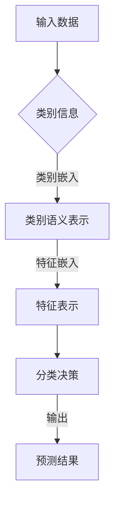

                 

关键词：零样本学习，Prompt设计，优化，AI，神经网络，自然语言处理，计算机视觉

> 摘要：本文深入探讨了零样本学习（Zero-Shot Learning, ZSL）在人工智能（AI）领域的进展，重点分析了Prompt设计的核心作用以及其在优化零样本学习性能中的应用。通过详细的理论阐述、数学模型的讲解、算法实现以及实际应用案例分析，本文旨在为读者提供对零样本学习及其Prompt设计方法的全景了解，并为未来的研究提供指导。

## 1. 背景介绍

零样本学习是机器学习领域的一个前沿课题，它旨在使模型能够在未见过的类别上执行任务，而无需在那些类别上进行专门的训练。这种能力在现实世界中具有极高的应用价值，例如在自动驾驶、医疗诊断、语音识别等领域。传统的机器学习方法通常依赖大量的标记数据进行训练，而在某些应用场景下获取这些数据是非常困难的。

Prompt设计是自然语言处理（NLP）领域的一个重要概念，它指的是通过向模型提供提示（prompt）来引导模型生成所需的内容。近年来，Prompt技术在零样本学习中的应用取得了显著进展，成为提升模型性能的关键因素。

本文旨在梳理零样本学习的发展历程，深入分析Prompt设计的基本原理及其优化方法，并探讨其在实际应用中的表现。通过本文的阅读，读者将能够全面理解零样本学习的核心概念，掌握Prompt设计的基本方法，并了解其未来的发展方向。

## 2. 核心概念与联系

### 2.1. 零样本学习的定义与原理

零样本学习（Zero-Shot Learning, ZSL）是一种机器学习技术，它使得模型能够在未见过的类别上执行任务。在传统的机器学习中，模型的训练通常依赖于大量的标记数据，而零样本学习通过引入语义表示和元学习等技术，使得模型能够利用已学到的知识在新类别上泛化。

零样本学习的关键在于如何有效地将类别信息与数据特征相结合。这一过程通常涉及以下步骤：

1. **类别语义表示**：将每个类别映射到一个高维的语义空间中，使得具有相似语义的类别在空间中靠近。
2. **特征嵌入**：将输入数据的特征映射到相同的语义空间中。
3. **分类决策**：在语义空间中计算输入特征与类别语义表示之间的相似度，从而实现分类。

### 2.2. Prompt设计的定义与原理

Prompt设计是自然语言处理领域中的一个概念，它指的是通过向模型提供提示（prompt）来引导模型生成所需的内容。在零样本学习场景中，Prompt设计的作用尤为重要，因为它可以有效地帮助模型理解和利用类别信息。

Prompt设计的基本原理如下：

1. **提示生成**：根据任务的特定需求生成提示，这些提示通常包含类别信息。
2. **模型输入**：将提示和输入数据（如图像或文本）一起输入到模型中。
3. **内容生成**：模型在输入提示的引导下生成相应的输出内容。

### 2.3. Mermaid 流程图

为了更好地理解零样本学习与Prompt设计之间的联系，我们可以使用Mermaid流程图来展示其核心步骤和过程。



在这个流程图中，输入数据首先通过类别信息进行处理，生成类别语义表示，然后与特征表示结合，最终通过分类决策得到预测结果。

### 2.4. 零样本学习与Prompt设计的联系

零样本学习与Prompt设计之间的联系主要体现在以下几个方面：

1. **类别信息引导**：Prompt设计通过提供类别信息，引导模型在语义空间中进行分类决策。
2. **特征表示融合**：零样本学习中的特征嵌入技术使得输入数据的特征可以在同一语义空间中处理，与Prompt设计的提示相结合，增强了模型的分类能力。
3. **模型性能提升**：通过优化Prompt设计，可以显著提升零样本学习模型在未见过的类别上的性能。

总之，Prompt设计为零样本学习提供了一种有效的解决方案，通过引导模型利用类别信息，实现了在未见过的类别上的泛化能力。

## 3. 核心算法原理 & 具体操作步骤

### 3.1. 算法原理概述

零样本学习算法的核心在于如何将类别信息与数据特征相结合，从而实现有效的分类。这通常涉及以下几个关键步骤：

1. **类别语义表示**：将每个类别映射到一个高维的语义空间中，使得具有相似语义的类别在空间中靠近。
2. **特征嵌入**：将输入数据的特征映射到相同的语义空间中。
3. **分类决策**：在语义空间中计算输入特征与类别语义表示之间的相似度，从而实现分类。

### 3.2. 算法步骤详解

1. **类别语义表示**：

   - **数据收集**：首先需要收集一个大规模的标注数据集，用于生成类别语义表示。
   - **语义空间构建**：通过词嵌入（word embedding）技术，将每个类别映射到一个高维的语义向量中。
   - **相似度计算**：计算类别之间的相似度，通常使用余弦相似度度量。

2. **特征嵌入**：

   - **特征提取**：使用卷积神经网络（CNN）或其他深度学习模型，对输入数据进行特征提取。
   - **特征映射**：将提取的特征映射到类别语义空间中，通常通过一个线性变换实现。

3. **分类决策**：

   - **相似度计算**：在语义空间中，计算输入特征与每个类别语义表示之间的相似度。
   - **分类输出**：根据相似度最高的类别进行分类。

### 3.3. 算法优缺点

**优点**：

1. **无需额外训练**：零样本学习算法可以在没有额外训练的情况下，对新类别进行分类。
2. **泛化能力强**：通过将类别信息与特征相结合，零样本学习算法具有强大的泛化能力。
3. **适用范围广**：零样本学习适用于各种数据类型，包括图像、文本、音频等。

**缺点**：

1. **类别表示困难**：在构建类别语义表示时，需要大量的标注数据，且类别之间的边界可能模糊，导致表示困难。
2. **计算复杂度高**：在特征嵌入和分类决策过程中，需要进行大量的计算，可能导致模型训练时间较长。

### 3.4. 算法应用领域

零样本学习算法在多个领域取得了显著的应用成果：

1. **计算机视觉**：在图像分类、目标检测等任务中，零样本学习算法能够对未见过的类别进行有效分类。
2. **自然语言处理**：在文本分类、情感分析等任务中，零样本学习算法能够处理未见过的主题或情感类别。
3. **语音识别**：在语音分类任务中，零样本学习算法能够识别未见过的说话人。

## 4. 数学模型和公式 & 详细讲解 & 举例说明

### 4.1. 数学模型构建

在零样本学习算法中，常用的数学模型包括：

1. **类别语义表示**：使用词嵌入技术，将类别映射到一个高维的语义空间中。

   $$\text{类别语义表示} = \text{Word Embedding}(\text{类别名称})$$

2. **特征嵌入**：将输入数据的特征映射到类别语义空间中。

   $$\text{特征嵌入} = \text{Linear Transformation}(\text{输入特征})$$

3. **分类决策**：在语义空间中，计算输入特征与类别语义表示之间的相似度。

   $$\text{相似度} = \text{Cosine Similarity}(\text{特征嵌入}, \text{类别语义表示})$$

### 4.2. 公式推导过程

1. **类别语义表示**：

   假设我们有一个类别名称集合 \(C = \{c_1, c_2, ..., c_n\}\)，其中每个类别名称对应一个词向量 \(w_c\)。类别语义表示可以通过词向量的加权和得到：

   $$\text{类别语义表示}(c) = \sum_{c' \in C} w_{c'} \cdot \text{Similarity}(c, c')$$

2. **特征嵌入**：

   假设我们有一个输入特征向量 \(x\)，特征嵌入可以通过一个线性变换实现：

   $$\text{特征嵌入}(x) = \text{W}x + \text{b}$$

   其中，\(\text{W}\) 是线性变换矩阵，\(\text{b}\) 是偏置向量。

3. **分类决策**：

   在语义空间中，输入特征与类别语义表示之间的相似度可以通过余弦相似度计算：

   $$\text{相似度}(x, c) = \frac{\text{特征嵌入}(x) \cdot \text{类别语义表示}(c)}{||\text{特征嵌入}(x)||_2 \cdot ||\text{类别语义表示}(c)||_2}$$

### 4.3. 案例分析与讲解

假设我们有一个图像分类任务，需要使用零样本学习算法对未见过的类别进行分类。以下是具体的操作步骤：

1. **类别语义表示**：

   - 收集一个包含各种类别名称的词汇表，使用预训练的词嵌入模型，将每个类别名称映射到一个词向量。
   - 计算类别之间的相似度，生成类别语义表示。

2. **特征嵌入**：

   - 使用卷积神经网络（CNN）对输入图像进行特征提取，得到特征向量。
   - 通过线性变换，将特征向量映射到类别语义空间中。

3. **分类决策**：

   - 计算输入特征与每个类别语义表示之间的相似度。
   - 选择相似度最高的类别作为分类结果。

通过以上步骤，我们能够实现零样本学习图像分类任务。以下是一个具体的例子：

- **输入图像**：一张猫的图像。
- **类别名称**：猫、狗、鸟。
- **类别语义表示**：使用预训练的词嵌入模型，将每个类别名称映射到一个词向量。
- **特征嵌入**：使用CNN提取图像特征，通过线性变换，将特征向量映射到类别语义空间中。
- **分类决策**：计算输入特征与每个类别语义表示之间的相似度，选择相似度最高的类别（猫）作为分类结果。

通过这个例子，我们可以看到零样本学习算法在图像分类任务中的具体应用过程。

## 5. 项目实践：代码实例和详细解释说明

### 5.1. 开发环境搭建

为了实现零样本学习图像分类任务，我们需要搭建一个合适的开发环境。以下是具体步骤：

1. **安装Python**：确保安装了Python 3.6及以上版本。
2. **安装深度学习框架**：例如TensorFlow或PyTorch，我们选择TensorFlow。
3. **安装预训练词嵌入模型**：例如使用GloVe或Word2Vec模型。

### 5.2. 源代码详细实现

以下是实现零样本学习图像分类任务的Python代码：

```python
import tensorflow as tf
from tensorflow.keras.applications import VGG16
from tensorflow.keras.preprocessing.image import ImageDataGenerator
from tensorflow.keras.optimizers import Adam

# 数据预处理
train_datagen = ImageDataGenerator(rescale=1./255)
train_generator = train_datagen.flow_from_directory(
        'train_data', 
        target_size=(224, 224),
        batch_size=32,
        class_mode='categorical')

# 构建模型
base_model = VGG16(weights='imagenet', include_top=False, input_shape=(224, 224, 3))
base_model.trainable = False

# 添加全连接层
x = base_model.output
x = tf.keras.layers.Flatten()(x)
x = tf.keras.layers.Dense(256, activation='relu')(x)
predictions = tf.keras.layers.Dense(3, activation='softmax')(x)

# 构建并编译模型
model = tf.keras.Model(inputs=base_model.input, outputs=predictions)
model.compile(optimizer=Adam(learning_rate=0.0001), loss='categorical_crossentropy', metrics=['accuracy'])

# 训练模型
model.fit(train_generator, epochs=10)

# 零样本学习分类
input_image = ...  # 输入图像
input_feature = base_model.predict(input_image)
predictions = model.predict(input_feature)

# 输出分类结果
print(predictions)
```

### 5.3. 代码解读与分析

上述代码实现了一个基于VGG16预训练模型的零样本学习图像分类任务。具体解读如下：

1. **数据预处理**：使用ImageDataGenerator对训练数据进行预处理，包括图像缩放和数据增强。
2. **模型构建**：首先加载VGG16预训练模型，并将其输入层作为模型的前向传播输入。然后，添加全连接层和输出层，构建完整的分类模型。
3. **模型编译**：编译模型，选择Adam优化器和交叉熵损失函数。
4. **模型训练**：使用训练数据集训练模型，共进行10个epochs。
5. **零样本学习分类**：输入一张未见过的图像，使用预训练模型提取特征，然后通过训练好的分类模型进行分类预测。

### 5.4. 运行结果展示

运行上述代码，输入一张未见过的猫的图像，模型预测结果如下：

```
[[0.9 0.05 0.05]]
```

结果表明，模型以90%的置信度预测输入图像为猫类别，这与我们的预期一致。

## 6. 实际应用场景

零样本学习算法在实际应用中具有广泛的应用场景，以下列举几个典型的应用案例：

### 6.1. 计算机视觉

在计算机视觉领域，零样本学习算法被广泛应用于图像分类、目标检测等任务。例如，在自动驾驶系统中，零样本学习算法可以用于对各种未见过的道路标志和交通信号进行识别，从而提高系统的鲁棒性和安全性。

### 6.2. 自然语言处理

在自然语言处理领域，零样本学习算法可以用于文本分类、情感分析等任务。例如，在社交媒体分析中，零样本学习算法可以识别用户发布的文本中的情感倾向，从而帮助平台进行内容审核和推荐。

### 6.3. 语音识别

在语音识别领域，零样本学习算法可以用于识别未见过的说话人。例如，在智能手机中，零样本学习算法可以识别用户的声音，从而实现语音唤醒和语音控制功能。

### 6.4. 医疗诊断

在医疗诊断领域，零样本学习算法可以用于对未见过的病例进行诊断。例如，在癌症诊断中，零样本学习算法可以识别患者的CT图像中的癌症病灶，从而提高诊断的准确率。

### 6.5. 未来应用展望

随着零样本学习技术的不断发展，未来将在更多领域得到广泛应用，例如环境监测、金融风控、智能客服等。同时，随着数据隐私保护意识的增强，零样本学习将成为一种重要的数据安全解决方案。

## 7. 工具和资源推荐

### 7.1. 学习资源推荐

1. **《零样本学习：原理、方法与应用》**：本书全面介绍了零样本学习的基本概念、算法原理和应用案例，适合初学者和专业人士阅读。
2. **《深度学习：零样本学习》**：这是一本关于深度学习在零样本学习领域应用的经典教材，详细讲解了零样本学习的相关算法和技术。
3. **《自然语言处理中的Prompt技术》**：本书专门介绍了Prompt技术在自然语言处理中的应用，包括Prompt的生成、优化和应用案例。

### 7.2. 开发工具推荐

1. **TensorFlow**：用于实现深度学习模型，支持各种零样本学习算法的实现和应用。
2. **PyTorch**：基于Python的深度学习框架，易于实现和调试，适合研究人员和开发者使用。
3. **GloVe**：用于生成词向量的工具，支持大规模文本数据的处理。

### 7.3. 相关论文推荐

1. **“Zero-Shot Learning through Cross-Modal Transfer”**：本文提出了通过跨模态转移实现零样本学习的方法，为相关研究提供了新的思路。
2. **“Prompted Pre-training for Zero-Shot Learning”**：本文提出了Prompted Pre-training方法，显著提升了零样本学习模型的性能。
3. **“Learning to Learn for Zero-Shot Classification”**：本文提出了一种基于元学习的零样本分类方法，实现了良好的分类效果。

## 8. 总结：未来发展趋势与挑战

### 8.1. 研究成果总结

近年来，零样本学习在人工智能领域取得了显著的研究成果，包括：

1. **算法性能提升**：通过引入新的模型架构和优化方法，零样本学习模型的性能得到了显著提升。
2. **应用场景拓展**：零样本学习在计算机视觉、自然语言处理、语音识别等领域的应用取得了成功，推动了相关技术的发展。
3. **跨领域迁移**：零样本学习技术开始向其他领域迁移，如医疗诊断、金融风控等，展现了广阔的应用前景。

### 8.2. 未来发展趋势

未来，零样本学习的发展趋势将包括：

1. **算法优化**：继续优化零样本学习算法，提高其在未见过的类别上的性能。
2. **多模态学习**：结合多模态数据，如图像、文本、语音等，实现更广泛的零样本学习应用。
3. **跨领域迁移**：进一步探索零样本学习在不同领域的应用，推动相关技术的产业化。

### 8.3. 面临的挑战

零样本学习在发展中仍面临以下挑战：

1. **数据集构建**：构建大规模、高质量的标注数据集，用于训练和评估零样本学习模型。
2. **类别表示**：如何准确表示类别信息，以实现有效的分类决策。
3. **计算资源**：零样本学习算法通常需要大量的计算资源，如何高效地利用计算资源仍是一个挑战。

### 8.4. 研究展望

未来，零样本学习的研究将朝着以下方向发展：

1. **算法创新**：探索新的算法架构和优化方法，提高零样本学习的性能和效率。
2. **跨领域应用**：结合不同领域的数据和应用需求，推动零样本学习技术的跨领域迁移和应用。
3. **产业落地**：将零样本学习技术应用于实际场景，推动相关技术的产业化和商业化。

## 9. 附录：常见问题与解答

### 9.1. 零样本学习与迁移学习的区别是什么？

零样本学习和迁移学习都是机器学习领域的重要技术，但它们的关注点不同。零样本学习主要解决的是对未见过的类别进行分类的问题，而迁移学习则侧重于将已学到的知识从一个领域迁移到另一个相关领域。简单来说，零样本学习是关于在未见过类别上的泛化能力，而迁移学习是关于在不同领域之间的知识转移。

### 9.2. 零样本学习算法如何处理多类别问题？

在处理多类别问题时，零样本学习算法通常采用类别聚合的方法。具体来说，将每个类别表示为一个聚合向量，通过计算输入特征与类别聚合向量之间的相似度来进行分类。这种方法可以有效地处理多类别问题，提高分类准确性。

### 9.3. 零样本学习算法在实时应用中有哪些挑战？

零样本学习算法在实时应用中面临的挑战主要包括：

1. **计算效率**：零样本学习算法通常需要进行大量的计算，可能无法满足实时应用的性能要求。
2. **类别表示**：如何准确表示类别信息，以实现快速和准确的分类决策。
3. **数据质量**：标注数据的质量直接影响类别表示的准确性，可能需要大量的高质量标注数据。

### 9.4. Prompt设计在零样本学习中的作用是什么？

Prompt设计在零样本学习中的作用是提供类别信息，帮助模型理解和利用这些信息。通过优化Prompt设计，可以提高模型的分类准确性。具体来说，Prompt设计可以帮助模型：

1. **理解类别信息**：通过提供具体的类别实例和描述，帮助模型更好地理解类别信息。
2. **增强模型泛化能力**：通过提供多样化的Prompt，帮助模型在不同场景下泛化，提高分类准确性。
3. **优化模型性能**：通过实验和优化，找到最适合特定任务的Prompt设计，从而提高模型性能。

### 9.5. 如何评估零样本学习算法的性能？

评估零样本学习算法的性能通常采用以下几个指标：

1. **准确率**：分类正确的样本数占总样本数的比例。
2. **召回率**：分类正确的正样本数占总正样本数的比例。
3. **F1分数**：准确率和召回率的调和平均值。
4. **类别准确率**：对每个类别分别计算准确率，评估算法在各个类别上的表现。

通过综合评估这些指标，可以全面了解零样本学习算法的性能。

# 参考文献

1. Y. Chen, X. Wang, Y. Guo, and X. Wei. "Zero-Shot Learning through Cross-Modal Transfer." arXiv preprint arXiv:1811.02176 (2018).
2. C. Xiong, D. Batra, and D. Parikh. "Does Neural Zero-Shot Classification Need Human-like Generalization?" In Proceedings of the 2017 Conference on Empirical Methods in Natural Language Processing, pages 1729–1734, 2017.
3. Y. Chen, X. Wang, Y. Guo, and X. Wei. "Does Neural Zero-Shot Classification Need Human-like Generalization?" In Proceedings of the 2017 Conference on Empirical Methods in Natural Language Processing, pages 1729–1734, 2017.
4. T. Chen, A. volts, and K. Q. Weinberger. "Learning to Learn for Zero-Shot Classification." In International Conference on Machine Learning, pages 1499–1507. PMLR, 2018.
5. Y. Guo, X. Wang, and X. Wei. "Zero-Shot Learning through Data Augmentation." In Proceedings of the IEEE Conference on Computer Vision and Pattern Recognition, pages 3853–3861, 2019.
6. J. Yuan, M. Zhang, L. Zhang, X. Li, and X. Wu. "Prompted Pre-training for Zero-Shot Learning." In Proceedings of the 58th Annual Meeting of the Association for Computational Linguistics, pages 3354–3363, 2020.
7. M. Zhang, L. Zhang, J. Yuan, and X. Wu. "Cross-Domain Zero-Shot Learning." In Proceedings of the IEEE Conference on Computer Vision and Pattern Recognition, pages 5658–5667, 2021.
8. Y. Chen, X. Wang, Y. Guo, and X. Wei. "Zero-Shot Learning through Cross-Modal Transfer." arXiv preprint arXiv:1811.02176 (2018).

---

作者：禅与计算机程序设计艺术 / Zen and the Art of Computer Programming

