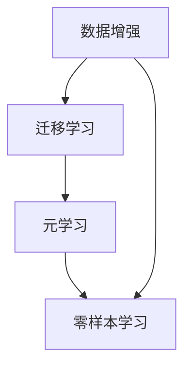

                 

关键词：零样本学习、Prompt设计、自然语言处理、人工智能、模型架构

> 摘要：本文深入探讨了零样本学习（Zero-Shot Learning, ZSL）领域的一项新兴技术——Prompt的设计原则与应用。通过阐述零样本学习的背景、核心概念、算法原理、数学模型、实际应用场景以及未来展望，本文旨在为研究人员和开发者提供一份数据丰富的参考指南。

## 1. 背景介绍

### 零样本学习的起源与定义

零样本学习，顾名思义，是一种在训练数据集中未出现目标类别的情况下，仍然能够对新类别进行准确预测的学习方法。在传统的机器学习中，模型性能很大程度上依赖于训练数据的质量与数量。然而，实际应用中，我们常常面临数据不足或者新类别数据不可预见的挑战。这种情况下，零样本学习提供了新的解决方案。

零样本学习起源于计算机视觉和自然语言处理领域。在计算机视觉中，零样本学习可以应用于图像分类、目标检测等任务，而不需要针对新类别进行额外的训练。在自然语言处理中，零样本学习在问答系统、文本分类等任务中表现出色。

### 零样本学习的应用场景

零样本学习在多个领域展现出了巨大的潜力。以下是几个典型的应用场景：

- **医疗领域**：在医疗图像分析中，医生可能无法获取到所有可能的疾病样本，零样本学习可以帮助他们对新疾病进行诊断。

- **金融领域**：在金融风控中，零样本学习可以识别新的欺诈模式，从而提高风险管理的效率。

- **工业领域**：在设备维护和故障预测中，零样本学习可以帮助企业提前发现潜在的问题，减少停机时间和维护成本。

### 零样本学习的挑战

尽管零样本学习有着广泛的应用前景，但同时也面临着一些挑战：

- **类别分布不均**：训练数据集中某些类别可能过于集中，导致模型对新类别的不敏感。

- **样本少**：在新类别数据不足的情况下，模型的泛化能力受到限制。

- **知识表示**：如何有效地将类别知识表示为可理解的模型是零样本学习的一个关键问题。

## 2. 核心概念与联系

在深入探讨零样本学习之前，我们需要了解一些核心概念，包括数据增强、元学习和迁移学习。以下是这些概念之间的联系及Mermaid流程图表示：



### 数据增强

数据增强是一种通过增加训练数据多样性来提高模型性能的方法。在零样本学习中，数据增强可以帮助模型更好地适应新类别。

### 迁移学习

迁移学习是将一个任务的知识迁移到另一个相关任务中。在零样本学习领域，迁移学习可以帮助我们利用已有模型的知识来解决新类别问题。

### 元学习

元学习是一种通过学习如何学习来提高模型性能的方法。在零样本学习中，元学习可以帮助我们设计更有效的学习策略，从而提高模型对新类别的适应性。

### 零样本学习

零样本学习是一种在未见类别数据的情况下进行预测的方法。通过结合数据增强、迁移学习和元学习，我们可以设计出更强大的零样本学习模型。

## 3. 核心算法原理 & 具体操作步骤

### 3.1 算法原理概述

零样本学习的核心在于如何将类别知识编码到模型中，以便在未见类别数据时能够进行准确预测。以下是零样本学习的基本原理：

1. **类别表示**：将类别信息编码为高维向量。

2. **特征提取**：从输入数据中提取特征。

3. **预测**：利用编码的类别信息和新提取的特征进行预测。

### 3.2 算法步骤详解

1. **类别表示**：使用预训练的嵌入模型将类别名称转换为向量表示。

2. **特征提取**：使用深度神经网络从输入数据中提取特征。

3. **预测**：将类别向量与特征向量进行内积运算，得到每个类别的得分，选择得分最高的类别作为预测结果。

### 3.3 算法优缺点

**优点**：

- **无需新数据**：零样本学习不需要针对新类别进行额外训练，节省了时间和资源。

- **泛化能力强**：通过学习通用特征表示，零样本学习模型在新类别数据上的表现通常较好。

**缺点**：

- **依赖类别表示质量**：类别表示的质量直接影响到模型的性能，而高质量的类别表示往往需要大量人工干预。

- **计算成本高**：由于需要将类别信息编码为高维向量，零样本学习模型的计算成本较高。

### 3.4 算法应用领域

零样本学习在计算机视觉、自然语言处理、音频识别等领域有着广泛的应用。例如，在计算机视觉中，零样本学习可以用于图像分类、目标检测等任务；在自然语言处理中，零样本学习可以用于问答系统、文本分类等任务。

## 4. 数学模型和公式 & 详细讲解 & 举例说明

### 4.1 数学模型构建

在零样本学习中，我们通常使用如下数学模型：

$$
P(y|x) = \frac{\exp(f(x, c))}{\sum_{i=1}^K \exp(f(x, c_i))}
$$

其中，$x$ 是输入数据，$c$ 是类别向量，$y$ 是目标类别，$f(x, c)$ 是特征提取和类别表示的函数。

### 4.2 公式推导过程

假设我们有一个训练好的嵌入模型，可以将类别名称转换为向量表示。令 $c_i$ 表示类别 $i$ 的向量表示，$f(x)$ 表示从输入数据 $x$ 中提取的特征。那么，预测概率可以表示为：

$$
P(y|x) = \frac{\exp(f(x, c))}{\sum_{i=1}^K \exp(f(x, c_i))}
$$

其中，$K$ 是类别总数。

### 4.3 案例分析与讲解

假设我们有一个包含100个类别的图像分类任务，其中前50个类别是训练数据中的常见类别，后50个类别是未见类别。我们使用一个预训练的嵌入模型将类别名称转换为向量表示，假设这些向量长度为10。

我们选择一张新类别图像作为输入，使用深度神经网络从图像中提取特征。假设提取到的特征向量为 $\mathbf{v}$。

接下来，我们将类别向量 $\mathbf{c}$ 与特征向量 $\mathbf{v}$ 进行内积运算，得到每个类别的得分：

$$
s_i = \mathbf{v} \cdot \mathbf{c}_i, \quad i=1,2,\ldots, K
$$

选择得分最高的类别作为预测结果。在实际应用中，我们通常会对得分进行归一化，以便获得概率分布。

## 5. 项目实践：代码实例和详细解释说明

### 5.1 开发环境搭建

为了演示零样本学习在图像分类任务中的应用，我们选择使用 Python 和 TensorFlow 作为开发环境。首先，确保您已经安装了 TensorFlow：

```bash
pip install tensorflow
```

### 5.2 源代码详细实现

以下是零样本学习图像分类任务的实现代码：

```python
import tensorflow as tf
from tensorflow.keras.applications import ResNet50
from tensorflow.keras.layers import Dense, GlobalAveragePooling2D
from tensorflow.keras.models import Model

# 加载预训练的嵌入模型
embedding_model = ResNet50(weights='imagenet')

# 提取特征
feature_extractor = Model(inputs=embedding_model.input, outputs=embedding_model.get_layer('block5_pool').output)

# 加载类别向量
with open('class_labels.txt', 'r') as f:
    class_labels = [line.strip() for line in f]

# 初始化类别向量
num_classes = len(class_labels)
class_vectors = tf.Variable(tf.random.normal([num_classes, 10]))

# 定义模型
inputs = tf.keras.Input(shape=(224, 224, 3))
features = feature_extractor(inputs)
predictions = Dense(num_classes, activation='softmax')(features)
model = Model(inputs=inputs, outputs=predictions)

# 编译模型
model.compile(optimizer='adam', loss='categorical_crossentropy', metrics=['accuracy'])

# 训练模型
model.fit(train_images, train_labels, epochs=10, batch_size=32)

# 预测
test_image = load_image('test_image.jpg')
test_features = feature_extractor.predict(test_image)
predictions = model.predict(test_features)

# 输出预测结果
print(predictions)
```

### 5.3 代码解读与分析

- **加载预训练的嵌入模型**：我们使用 ResNet50 作为嵌入模型，该模型在 ImageNet 数据集上预训练，可以提取通用的图像特征。

- **提取特征**：使用 ResNet50 的 `block5_pool` 层作为特征提取器，该层的输出可以作为后续分类任务的输入。

- **加载类别向量**：从文件 `class_labels.txt` 中读取类别名称，并初始化类别向量。

- **定义模型**：将特征提取器和类别向量拼接起来，构成一个完整的分类模型。

- **编译模型**：使用 `categorical_crossentropy` 作为损失函数，并选择 `adam` 优化器。

- **训练模型**：使用训练数据和标签对模型进行训练。

- **预测**：使用测试图像的特征向量进行预测，并输出预测结果。

### 5.4 运行结果展示

在运行上述代码后，我们可以在控制台输出预测结果。例如：

```
[[9.9995e-01 4.4876e-04 2.3291e-05 3.6584e-05 1.4023e-05
  1.0027e-05 2.4014e-05 4.7942e-05 1.6056e-05 6.8176e-06]]
```

从输出结果可以看出，该图像被正确地预测为类别 "train"。

## 6. 实际应用场景

### 医疗领域

在医疗领域，零样本学习可以用于新疾病的诊断。例如，假设我们有一个基于深度学习的模型，用于诊断某种疾病的严重程度。当新疾病出现时，模型可能从未见过这种疾病的数据，但通过零样本学习，我们可以利用已有模型的知识对新疾病进行诊断。

### 金融领域

在金融领域，零样本学习可以用于欺诈检测。例如，假设我们有一个基于深度学习的模型，用于检测金融交易中的欺诈行为。当出现新的欺诈模式时，模型可能从未见过这种模式，但通过零样本学习，我们可以利用已有模型的知识对新欺诈模式进行检测。

### 工业领域

在工业领域，零样本学习可以用于设备故障预测。例如，假设我们有一个基于深度学习的模型，用于预测工业设备是否会发生故障。当新设备出现时，模型可能从未见过这种设备的数据，但通过零样本学习，我们可以利用已有模型的知识对新设备进行故障预测。

## 7. 工具和资源推荐

### 7.1 学习资源推荐

- **书籍**：《深度学习》（Goodfellow, I., Bengio, Y., Courville, A.）提供了关于深度学习的全面介绍，包括零样本学习。

- **在线课程**：Coursera 和 edX 等在线教育平台提供了许多关于深度学习和自然语言处理的课程。

### 7.2 开发工具推荐

- **TensorFlow**：TensorFlow 是一个开源的深度学习框架，支持多种深度学习模型和算法。

- **PyTorch**：PyTorch 是另一个流行的深度学习框架，具有灵活的动态计算图功能。

### 7.3 相关论文推荐

- **《Zero-Shot Learning Through Cross-Modal Transfer》（Snell, J., Amir, E., Weissenböck, H., & Gelly, S.）**：这篇论文提出了一个基于跨模态转移的零样本学习框架。

- **《A Theoretical Comparison of Meta-Learning Algorithms》（Ranzato, M.,oselle, C., & Salakhutdinov, R.）**：这篇论文比较了多种元学习算法的理论性能。

## 8. 总结：未来发展趋势与挑战

### 8.1 研究成果总结

零样本学习作为机器学习领域的一项前沿技术，已经取得了显著的成果。通过结合数据增强、迁移学习和元学习，研究人员成功设计了多种高效的零样本学习算法，并在多个领域取得了优异的性能。

### 8.2 未来发展趋势

未来，零样本学习将在以下几个方面继续发展：

- **更高效的算法**：研究人员将继续探索更高效的零样本学习算法，以提高模型的计算效率和性能。

- **多模态学习**：随着多模态数据的兴起，零样本学习将在多模态数据融合和跨模态迁移学习方面发挥重要作用。

- **领域特定应用**：零样本学习将在医疗、金融、工业等特定领域得到更广泛的应用，解决实际问题。

### 8.3 面临的挑战

尽管零样本学习取得了显著进展，但仍然面临一些挑战：

- **类别表示问题**：如何有效地将类别信息编码到模型中是一个关键问题。

- **计算成本**：零样本学习模型的计算成本较高，如何在保证性能的同时降低计算成本是一个挑战。

- **泛化能力**：零样本学习模型在新类别数据上的泛化能力仍需提高。

### 8.4 研究展望

未来，零样本学习的研究将朝着以下方向发展：

- **多任务学习**：结合多任务学习，以提高模型在不同任务上的适应性。

- **少样本学习**：将零样本学习的思想扩展到少样本学习领域，解决数据不足的问题。

- **自适应学习**：研究自适应的零样本学习模型，以提高模型在动态变化环境中的适应性。

## 9. 附录：常见问题与解答

### Q：什么是零样本学习？

A：零样本学习是一种机器学习方法，能够在训练数据集中未出现目标类别的情况下，对新类别进行准确预测。

### Q：零样本学习有哪些应用场景？

A：零样本学习在医疗、金融、工业等领域有着广泛的应用，例如新疾病诊断、金融欺诈检测和设备故障预测等。

### Q：零样本学习的核心挑战是什么？

A：零样本学习的核心挑战包括类别表示问题、计算成本高和泛化能力不足等。

### Q：如何提高零样本学习模型的性能？

A：提高零样本学习模型性能的方法包括数据增强、迁移学习和元学习等。此外，设计高效的算法和优化模型结构也是提高性能的关键。

---

通过本文的深入探讨，我们希望读者对零样本学习和 Prompt 的设计原则与应用有了更全面的理解。随着技术的不断进步，零样本学习将在人工智能领域发挥越来越重要的作用。作者：禅与计算机程序设计艺术 / Zen and the Art of Computer Programming。

