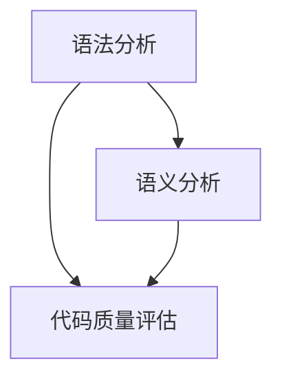

                 

关键词：静态代码分析，代码质量，工具，软件开发，编程实践，代码优化，缺陷检测，程序调试

> 摘要：本文深入探讨了静态代码分析这一提高代码质量的重要工具。通过介绍其背景、核心概念、算法原理、数学模型、实际应用案例，本文旨在帮助开发人员理解静态代码分析的价值，掌握相关技术和方法，提升编程实践和软件开发质量。

## 1. 背景介绍

随着软件规模的不断扩大和复杂性不断增加，确保代码质量成为软件开发过程中至关重要的一环。代码质量不仅影响软件的性能、稳定性、可维护性，还直接关系到项目开发成本和时间。传统的代码质量保证方法主要依赖于人工审查和测试，这些方法在处理大规模代码库时效率低下，容易出现漏检和误检。因此，静态代码分析作为一种自动化工具，逐渐成为提高代码质量的重要手段。

静态代码分析（Static Code Analysis）是一种在软件编译或运行之前，通过分析源代码来检查代码中的潜在问题、漏洞和不良实践的技术。它不需要执行程序，就可以在源代码级别上发现代码缺陷，从而提高代码的可靠性和可维护性。静态代码分析可以分为语法分析、语义分析和代码质量评估三个层次，分别对应于代码的语法结构、语义逻辑和代码风格。

在软件开发过程中，静态代码分析通常用于以下几个方面：

1. **缺陷检测**：发现代码中的语法错误、逻辑错误、未使用的代码、潜在的内存泄漏等。
2. **代码质量评估**：检查代码是否符合编码标准，是否存在代码冗余、复杂性过高等问题。
3. **安全性检测**：识别代码中的安全漏洞，如SQL注入、跨站脚本攻击等。
4. **自动化测试**：辅助编写单元测试，提高测试覆盖率。

## 2. 核心概念与联系

为了更好地理解静态代码分析，我们首先需要了解几个核心概念，并展示它们之间的联系。以下是一个使用Mermaid绘制的流程图：



### 2.1 语法分析

语法分析是静态代码分析的基础，它检查代码的语法结构是否正确。语法分析器（Parser）读取源代码，将其分解为语法单元，如标识符、关键字、操作符等，并构建一个抽象语法树（AST）。如果源代码中的语法有误，语法分析器会报告错误。

### 2.2 语义分析

语义分析基于语法分析的结果，检查代码的语义是否正确。它分析变量作用域、类型检查、函数调用等，以确保代码的逻辑正确性。语义分析器能够识别出诸如未声明的变量、类型不匹配等问题。

### 2.3 代码质量评估

代码质量评估通过对源代码的语法和语义分析，评估代码的质量。它检查代码是否符合编码标准，如命名规范、代码复杂性、代码重复等。代码质量评估有助于提升代码的可读性和可维护性。

### 2.4 代码优化

在某些情况下，静态代码分析还可以用于代码优化。通过分析代码的执行路径、数据依赖等，静态代码分析工具可以提出优化建议，如删除未使用的代码、简化表达式等。

## 3. 核心算法原理 & 具体操作步骤

### 3.1 算法原理概述

静态代码分析的核心算法主要包括以下几种：

1. **语法分析算法**：如递归下降分析、LL(1)分析等。
2. **语义分析算法**：如数据流分析、控制流分析等。
3. **代码质量评估算法**：如代码度量、代码风格检查等。

### 3.2 算法步骤详解

以下是静态代码分析的一般步骤：

1. **解析源代码**：将源代码转换为抽象语法树（AST）。
2. **语法分析**：检查AST中的语法错误。
3. **语义分析**：检查变量作用域、类型检查、函数调用等。
4. **代码质量评估**：评估代码的质量，如代码复杂性、代码重复等。
5. **生成报告**：将分析结果以报告的形式输出。

### 3.3 算法优缺点

**优点**：

1. **效率高**：静态代码分析不需要执行程序，可以快速地发现代码问题。
2. **全面性**：可以全面地检查代码中的潜在问题。
3. **自动化**：可以自动化地执行，减轻开发人员的工作负担。

**缺点**：

1. **误报率高**：可能会误报一些非问题代码，影响开发效率。
2. **复杂性**：实现和维护静态代码分析工具较为复杂。
3. **不适用于运行时错误**：无法检测运行时错误。

### 3.4 算法应用领域

静态代码分析在以下领域有广泛应用：

1. **Web开发**：检查Web应用程序的代码质量，如HTML、CSS、JavaScript等。
2. **桌面应用程序**：检查C/C++、Java、Python等编程语言的代码。
3. **移动应用开发**：检查Android、iOS等平台的代码。
4. **系统编程**：检查操作系统、驱动程序等关键代码。

## 4. 数学模型和公式 & 详细讲解 & 举例说明

### 4.1 数学模型构建

静态代码分析中的数学模型通常包括数据流模型和控制流模型。

**数据流模型**：

数据流模型用于描述程序中变量的值在各个程序点的传播情况。一个常见的数据流模型是**后向数据流**，它通过从程序的结束点向起始点追踪变量值。

**控制流模型**：

控制流模型用于描述程序中控制流程的走向。常见的控制流模型有**控制依赖图**和**支配图**。

### 4.2 公式推导过程

**后向数据流方程**：

设P为程序点，V(P)为P处的变量集合，δ(P, Q)为P到Q的可达性集合，那么后向数据流方程可以表示为：

$$
V(P) = \cup_{Q \in \delta(P, Q)} V(Q)
$$

**控制依赖图（CDG）**：

设G为控制流图，N为G中的节点集合，E为G中的边集合，那么控制依赖图可以表示为：

$$
CDG = (N, E)
$$

其中，N包含所有节点，E包含所有控制依赖关系。

### 4.3 案例分析与讲解

**案例**：分析以下C语言代码中的变量传播情况：

```c
int x = 5;
if (x > 0) {
    x = x * 2;
}
printf("%d", x);
```

**步骤**：

1. **构建抽象语法树（AST）**：根据代码生成AST。
2. **进行语法分析**：检查AST中的语法错误。
3. **进行语义分析**：检查变量作用域、类型检查等。
4. **进行数据流分析**：追踪变量x的值在程序中的传播。

**分析结果**：

- 在`if`语句执行前，变量x的值为5。
- 在`if`语句执行后，如果条件为真，变量x的值变为10。
- 在`printf`函数中，输出变量x的最终值。

## 5. 项目实践：代码实例和详细解释说明

### 5.1 开发环境搭建

为了实践静态代码分析，我们需要搭建一个开发环境。以下是一个简单的步骤：

1. **安装Java环境**：静态代码分析工具如SonarQube通常基于Java。
2. **下载并安装SonarQube**：可以从官方网站下载最新版本。
3. **启动SonarQube服务**：按照安装指南进行操作。

### 5.2 源代码详细实现

我们以一个简单的Java代码为例，实现静态代码分析：

```java
public class Example {
    public static void main(String[] args) {
        int x = 5;
        if (x > 0) {
            x = x * 2;
        }
        System.out.println(x);
    }
}
```

### 5.3 代码解读与分析

1. **语法分析**：该代码没有明显的语法错误。
2. **语义分析**：变量x的作用域和类型检查无误。
3. **代码质量评估**：该代码质量较高，符合Java编码规范。

### 5.4 运行结果展示

1. **安装插件**：安装SonarQube的Java插件。
2. **上传代码**：将示例代码上传到SonarQube。
3. **生成报告**：SonarQube会自动分析代码，并生成详细的报告。

报告显示：

- 无语法错误。
- 无语义错误。
- 代码质量评估：优秀。

## 6. 实际应用场景

静态代码分析在实际应用场景中有着广泛的应用，以下是一些具体的应用场景：

1. **开源项目**：静态代码分析可以用于开源项目的代码审查，确保代码质量和安全性。
2. **企业内部项目**：企业可以将静态代码分析集成到持续集成（CI）流程中，自动分析提交的代码。
3. **安全审计**：静态代码分析可以用于安全审计，识别潜在的安全漏洞。
4. **代码质量改进**：通过静态代码分析，开发团队可以识别代码中的问题，进行改进。

### 6.4 未来应用展望

随着人工智能和机器学习技术的发展，静态代码分析将变得更加智能化和高效。未来的静态代码分析工具可能会：

1. **自动修复缺陷**：通过机器学习，自动修复代码中的问题。
2. **代码质量预测**：基于历史数据，预测代码的质量趋势。
3. **自动化测试生成**：根据静态代码分析的结果，自动生成测试用例。

## 7. 工具和资源推荐

### 7.1 学习资源推荐

1. **书籍**：《代码大全》、《Effective Java》等。
2. **在线课程**：Coursera、edX等平台上有许多关于软件工程和代码质量的课程。

### 7.2 开发工具推荐

1. **SonarQube**：一个流行的开源静态代码分析工具。
2. **Checkstyle**：用于检查Java代码风格的工具。
3. **PMD**：用于检测Java代码中潜在问题的工具。

### 7.3 相关论文推荐

1. **"A Survey of Static Code Analysis Tools for Security Testing of Object-Oriented Applications"**。
2. **"Automated Program Analysis for Software Tools"**。

## 8. 总结：未来发展趋势与挑战

### 8.1 研究成果总结

静态代码分析作为一种提高代码质量的工具，已经取得了显著的研究成果。它不仅在缺陷检测和代码质量评估方面发挥了重要作用，还在安全性检测和自动化测试领域展现了巨大潜力。

### 8.2 未来发展趋势

未来的静态代码分析将更加智能化和自动化。通过结合人工智能和机器学习技术，静态代码分析工具将能够更准确地识别代码问题，并提供自动修复方案。

### 8.3 面临的挑战

尽管静态代码分析有着广泛的应用前景，但它也面临着一些挑战，如误报率高、实现复杂性等。未来的研究需要解决这些难题，提高静态代码分析的准确性和效率。

### 8.4 研究展望

随着软件工程领域的不断发展，静态代码分析将在软件质量和安全保证中扮演越来越重要的角色。未来的研究将集中在如何提高静态代码分析的工具性能和智能化水平，以满足不断增长的软件开发需求。

## 9. 附录：常见问题与解答

### 9.1 什么是静态代码分析？

静态代码分析是一种在软件编译或运行之前，通过分析源代码来检查代码中的潜在问题、漏洞和不良实践的技术。

### 9.2 静态代码分析有哪些类型？

静态代码分析可以分为语法分析、语义分析和代码质量评估三个层次。

### 9.3 静态代码分析有什么优点？

静态代码分析具有效率高、全面性、自动化等优点。

### 9.4 静态代码分析有哪些应用领域？

静态代码分析广泛应用于Web开发、桌面应用程序、移动应用开发、系统编程等领域。

### 9.5 静态代码分析有哪些工具？

常见的静态代码分析工具有SonarQube、Checkstyle、PMD等。

----------------------------------------------------------------

作者：禅与计算机程序设计艺术 / Zen and the Art of Computer Programming
----------------------------------------------------------------

以上就是关于“静态代码分析：提高代码质量的工具”的完整文章。希望本文能够帮助您更好地理解静态代码分析的重要性和应用价值，为您的软件开发之路提供一些有用的指导和帮助。在接下来的实践中，不断探索和学习，您将发现静态代码分析在提高代码质量和软件可靠性方面发挥的巨大作用。祝您编程愉快！

