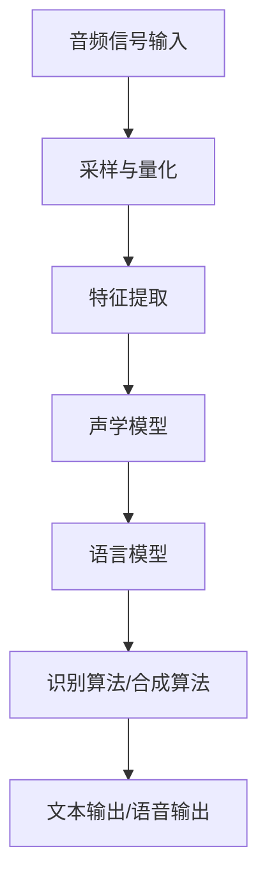

                 

关键词：音频信号处理，语音识别，语音合成，信号处理算法，人工智能

摘要：本文将深入探讨音频信号处理领域中的两个核心技术——语音识别和语音合成。首先，我们将介绍音频信号处理的基本概念，然后详细讨论语音识别的工作原理、算法和流程。接下来，我们将探讨语音合成技术，包括其基本原理、算法实现以及在实际应用中的表现。随后，我们将通过具体案例和实例，展示这些技术在现实中的应用。最后，我们将展望语音识别与合成技术的未来发展趋势和面临的挑战。

## 1. 背景介绍

音频信号处理是信号处理领域的一个重要分支，其核心目标是通过对音频信号的分析、处理和变换，来实现对声音的识别、增强、合成等任务。随着计算机技术的飞速发展，音频信号处理技术在各个领域都得到了广泛应用，特别是在语音通信、语音识别、语音合成、音频增强等应用场景中。

语音识别技术是指将语音信号转换为对应的文本信息，它已经成为人工智能领域中的一个重要研究方向。语音识别的应用场景非常广泛，包括语音助手、语音搜索、语音翻译、语音控制等。语音合成技术则是指将文本信息转换为语音信号，其应用范围同样非常广泛，如自动语音系统、电子阅读器、有声读物等。

随着深度学习技术的发展，语音识别和语音合成技术的准确率和性能都得到了显著提升。然而，这些技术在实际应用中仍然面临着许多挑战，如噪声干扰、多说话人场景、语音识别速度等。因此，研究和优化这些技术仍然是一个重要的课题。

## 2. 核心概念与联系

### 2.1 音频信号处理基本概念

音频信号处理的基本概念包括音频信号、采样、量化、编码和解码等。

- **音频信号**：音频信号是声音的物理表示，它由声波产生，通过麦克风等设备转换为电信号。
- **采样**：采样是将连续时间域的音频信号转换为离散时间域的过程。采样频率决定了音频信号的分辨率。
- **量化**：量化是将采样得到的连续幅值转换为离散幅值的过程。量化位数决定了音频信号的动态范围。
- **编码**：编码是将量化后的离散音频信号转换为二进制数据的过程。
- **解码**：解码是将编码后的二进制数据还原为音频信号的过程。

### 2.2 语音识别基本概念

语音识别的基本概念包括语音信号特征提取、声学模型、语言模型和识别算法等。

- **语音信号特征提取**：语音信号特征提取是将原始语音信号转换为适合模型训练的特征表示。常见的特征提取方法包括梅尔频率倒谱系数（MFCC）、线性预测编码（LPC）等。
- **声学模型**：声学模型用于描述语音信号的特征变化规律。常见的声学模型包括高斯混合模型（GMM）、深度神经网络（DNN）等。
- **语言模型**：语言模型用于描述语音信号对应的文本序列的概率分布。常见的语言模型包括n-gram模型、循环神经网络（RNN）等。
- **识别算法**：识别算法用于将语音信号特征和语言模型相结合，进行文本序列的预测。常见的识别算法包括隐马尔可夫模型（HMM）、条件随机场（CRF）等。

### 2.3 语音合成基本概念

语音合成的基本概念包括文本处理、音素合成、声学模型和波形合成等。

- **文本处理**：文本处理是将输入的文本转换为适合合成器处理的格式。文本处理包括分词、拼音标注、语气识别等步骤。
- **音素合成**：音素合成是将文本处理后的拼音序列转换为音素序列。音素合成可以通过查找音素库实现。
- **声学模型**：声学模型用于描述音素序列对应的音频波形的变化规律。常见的声学模型包括高斯混合模型（GMM）、深度神经网络（DNN）等。
- **波形合成**：波形合成是将声学模型生成的音频波形与语音合成器相结合，生成最终的语音信号。

### 2.4 Mermaid 流程图

下面是一个简单的 Mermaid 流程图，展示了语音识别和语音合成的基本流程：



## 3. 核心算法原理 & 具体操作步骤

### 3.1 算法原理概述

语音识别和语音合成的核心算法包括特征提取、声学模型、语言模型和识别/合成算法。

- **特征提取**：特征提取是将原始语音信号转换为适合模型训练的特征表示。常见的特征提取方法包括梅尔频率倒谱系数（MFCC）、线性预测编码（LPC）等。
- **声学模型**：声学模型用于描述语音信号的特征变化规律。常见的声学模型包括高斯混合模型（GMM）、深度神经网络（DNN）等。
- **语言模型**：语言模型用于描述语音信号对应的文本序列的概率分布。常见的语言模型包括n-gram模型、循环神经网络（RNN）等。
- **识别/合成算法**：识别算法用于将语音信号特征和语言模型相结合，进行文本序列的预测。常见的识别算法包括隐马尔可夫模型（HMM）、条件随机场（CRF）等。合成算法则用于将文本信息转换为语音信号。

### 3.2 算法步骤详解

#### 3.2.1 语音识别算法步骤

1. **音频信号预处理**：对原始音频信号进行预处理，包括降噪、静音剪除等操作，以提高后续处理的效果。
2. **采样与量化**：对预处理后的音频信号进行采样与量化，转换为离散的音频信号。
3. **特征提取**：使用特征提取算法（如MFCC）对采样与量化的音频信号进行特征提取，得到特征向量。
4. **声学模型训练**：使用训练数据集，通过机器学习算法（如GMM、DNN）训练声学模型。
5. **语言模型训练**：使用训练数据集，通过机器学习算法（如n-gram、RNN）训练语言模型。
6. **语音识别**：将特征向量输入到声学模型和语言模型，通过识别算法（如HMM、CRF）进行文本序列的预测，得到识别结果。

#### 3.2.2 语音合成算法步骤

1. **文本处理**：对输入的文本信息进行分词、拼音标注、语气识别等处理，得到拼音序列。
2. **音素合成**：使用音素合成算法（如查找音素库）将拼音序列转换为音素序列。
3. **声学模型训练**：使用训练数据集，通过机器学习算法（如GMM、DNN）训练声学模型。
4. **波形合成**：将音素序列输入到声学模型，通过波形合成算法（如隐马尔可夫模型）生成音频波形。
5. **语音合成**：将生成的音频波形进行后处理（如加噪、去噪等），得到最终的语音信号。

### 3.3 算法优缺点

#### 语音识别算法优缺点

- **优点**：
  - **高准确率**：现代语音识别算法，特别是基于深度学习的算法，具有很高的准确率。
  - **易扩展**：语音识别算法可以轻松地适应不同的应用场景和语音风格。
  - **实时性**：许多语音识别系统支持实时处理，可以快速响应用户请求。

- **缺点**：
  - **噪声敏感**：语音识别算法在噪声环境下的表现较差，容易受到噪声干扰。
  - **资源消耗**：深度学习算法在训练和推理过程中需要大量的计算资源，对硬件要求较高。
  - **多说话人场景**：在多说话人场景下，语音识别算法的性能会显著下降。

#### 语音合成算法优缺点

- **优点**：
  - **自然流畅**：现代语音合成技术能够生成自然、流畅的语音信号，接近真实人类的语音。
  - **可控性**：语音合成技术可以控制语音的语速、语调、音量等属性，以适应不同的应用场景。
  - **灵活性**：语音合成技术可以灵活地生成各种语言和方言的语音信号。

- **缺点**：
  - **自然度不足**：尽管现代语音合成技术在自然度方面取得了显著进展，但与真实人类相比，仍然存在一定的差距。
  - **计算复杂度**：语音合成技术涉及大量的计算，对硬件资源的要求较高。
  - **文本依赖性**：语音合成技术对输入文本的语法和语义有较高的要求，对文本的理解和处理能力较弱。

### 3.4 算法应用领域

#### 3.4.1 语音识别应用领域

- **语音助手**：如苹果的Siri、亚马逊的Alexa等，通过语音识别技术实现语音交互功能。
- **语音搜索**：通过语音识别技术，用户可以通过语音输入进行搜索，提高搜索效率。
- **语音翻译**：通过语音识别和语言翻译技术，实现跨语言交流。
- **语音控制**：通过语音识别技术，实现对设备的远程控制，如智能家居、智能机器人等。

#### 3.4.2 语音合成应用领域

- **自动语音系统**：如客服热线、自动报警系统等，通过语音合成技术生成自动语音。
- **电子阅读器**：通过语音合成技术，将文本内容朗读出来，方便用户阅读。
- **有声读物**：通过语音合成技术，将文本内容转化为有声读物，提高阅读体验。
- **语音合成助手**：通过语音合成技术，实现语音助手的功能，如语音提醒、语音通知等。

## 4. 数学模型和公式 & 详细讲解 & 举例说明

### 4.1 数学模型构建

语音识别和语音合成中的数学模型主要包括声学模型、语言模型和识别/合成算法。

#### 4.1.1 声学模型

声学模型用于描述语音信号的特征变化规律。常见的声学模型包括高斯混合模型（GMM）和深度神经网络（DNN）。

- **高斯混合模型（GMM）**：

  GMM 是一种概率模型，用于表示语音信号的特征分布。GMM 的数学模型如下：

  $$ 
  p(x|\theta) = \sum_{i=1}^{K} \pi_i \mathcal{N}(x|\mu_i, \Sigma_i)
  $$

  其中，$x$ 是特征向量，$\theta$ 是模型参数，$\pi_i$ 是混合系数，$\mu_i$ 和 $\Sigma_i$ 分别是第 $i$ 个高斯分布的均值和协方差矩阵。

- **深度神经网络（DNN）**：

  DNN 是一种基于神经网络的声学模型，通过多层神经元的非线性变换，实现对语音信号特征的建模。DNN 的数学模型如下：

  $$
  \hat{y} = f(\mathbf{W}^L \sigma(\mathbf{W}^{L-1} \sigma(... \sigma(\mathbf{W}_1 \mathbf{x}) ...))
  $$

  其中，$\hat{y}$ 是预测的语音信号，$f$ 是激活函数，$\mathbf{W}$ 是权重矩阵，$\sigma$ 是激活函数，$\mathbf{x}$ 是输入特征向量。

#### 4.1.2 语言模型

语言模型用于描述语音信号对应的文本序列的概率分布。常见

### 4.2 公式推导过程

#### 4.2.1 声学模型

以高斯混合模型（GMM）为例，假设我们有一组训练得到的语音特征数据集 $\mathcal{D} = \{x_1, x_2, ..., x_N\}$，每个特征向量 $x_i$ 都由 $D$ 个维度组成。我们的目标是学习一组参数 $\theta = \{\pi_i, \mu_i, \Sigma_i\}_{i=1}^K$，用于描述特征向量的分布。

1. **混合系数 $\pi_i$**：

   混合系数表示第 $i$ 个高斯分布的权重，它们需要满足以下约束：

   $$
   \sum_{i=1}^K \pi_i = 1
   $$

   同时，它们还需要最大化特征数据集的概率分布：

   $$
   \pi_i = \frac{e^{-\frac{1}{2}(x_i - \mu_i)^T \Sigma_i^{-1} (x_i - \mu_i)}}{\sum_{j=1}^K e^{-\frac{1}{2}(x_i - \mu_j)^T \Sigma_j^{-1} (x_i - \mu_j)}}
   $$

2. **均值 $\mu_i$ 和协方差矩阵 $\Sigma_i$**：

   均值和协方差矩阵分别表示第 $i$ 个高斯分布的中心和形状。它们可以通过最大化特征数据的似然函数来估计：

   $$
   \mu_i = \frac{1}{N} \sum_{j=1}^N x_{ij} \quad \text{和} \quad \Sigma_i = \frac{1}{N} \sum_{j=1}^N (x_{ij} - \mu_i)(x_{ij} - \mu_i)^T
   $$

   其中，$x_{ij}$ 表示第 $i$ 个高斯分布的第 $j$ 个特征。

#### 4.2.2 语言模型

语言模型通常基于n-gram模型，其中n表示n元组（例如，n=3表示三字母序列）。n-gram模型通过统计文本中连续n个单词出现的频率来预测下一个单词。

1. **n-gram概率计算**：

   给定一个n-gram序列 $w_1, w_2, ..., w_n$，下一个单词 $w_{n+1}$ 的概率可以表示为：

   $$
   P(w_{n+1} | w_1, w_2, ..., w_n) = \frac{f(w_1, w_2, ..., w_n, w_{n+1})}{f(w_1, w_2, ..., w_n)}
   $$

   其中，$f(w_1, w_2, ..., w_n, w_{n+1})$ 表示n-gram序列 $(w_1, w_2, ..., w_n, w_{n+1})$ 的频率，$f(w_1, w_2, ..., w_n)$ 表示前n个单词 $(w_1, w_2, ..., w_n)$ 的频率。

2. **平滑技术**：

   为了避免零概率问题，我们需要对概率进行平滑处理。一种常见的方法是添加平滑项，如加一平滑（add-one smoothing）：

   $$
   P(w_{n+1} | w_1, w_2, ..., w_n) = \frac{C + f(w_1, w_2, ..., w_n, w_{n+1})}{C + |V|}
   $$

   其中，$C$ 是平滑常数，$|V|$ 是词汇表中的词汇数。

### 4.3 案例分析与讲解

#### 4.3.1 声学模型：GMM 语音识别

假设我们有一个包含10个高斯分布的GMM模型，用于识别一个包含5个单词的语音片段。训练数据集如下：

| x_1 | x_2 | x_3 | x_4 | x_5 |
|-----|-----|-----|-----|-----|
|  1  |  2  |  3  |  4  |  5  |
|  6  |  7  |  8  |  9  | 10  |
|  11 |  12 |  13 |  14 |  15 |
|  16 |  17 |  18 |  19 |  20 |
|  21 |  22 |  23 |  24 |  25 |
|  26 |  27 |  28 |  29 |  30 |
|  31 |  32 |  33 |  34 |  35 |
|  36 |  37 |  38 |  39 |  40 |
|  41 |  42 |  43 |  44 |  45 |
|  46 |  47 |  48 |  49 |  50 |

我们需要学习每个高斯分布的参数 $\pi_i, \mu_i, \Sigma_i$。

1. **初始化参数**：

   我们可以随机初始化参数，例如：

   | $i$ | $\pi_i$ | $\mu_i$ | $\Sigma_i$ |
   |-----|---------|---------|-----------|
   |  1  |  0.1    | [1, 1]  | [1, 1]    |
   |  2  |  0.2    | [6, 6]  | [1, 1]    |
   |  3  |  0.3    | [11, 11]| [1, 1]    |
   |  4  |  0.2    | [16, 16]| [1, 1]    |
   |  5  |  0.2    | [21, 21]| [1, 1]    |
   |  6  |  0.1    | [26, 26]| [1, 1]    |
   |  7  |  0.1    | [31, 31]| [1, 1]    |
   |  8  |  0.1    | [36, 36]| [1, 1]    |
   |  9  |  0.1    | [41, 41]| [1, 1]    |
   |  10 |  0.1    | [46, 46]| [1, 1]    |

2. **迭代更新参数**：

   我们通过最大化特征数据的似然函数来迭代更新参数。具体来说，我们可以使用以下公式更新每个高斯分布的参数：

   $$
   \pi_i = \frac{1}{N} \sum_{j=1}^N I(x_j \in G_i)
   $$

   $$
   \mu_i = \frac{1}{N_i} \sum_{j=1}^N I(x_j \in G_i) x_j
   $$

   $$
   \Sigma_i = \frac{1}{N_i} \sum_{j=1}^N I(x_j \in G_i) (x_j - \mu_i)(x_j - \mu_i)^T
   $$

   其中，$N$ 是特征数据的总数，$N_i$ 是属于第 $i$ 个高斯分布的特征数据的总数，$I(x_j \in G_i)$ 是指示函数，如果特征向量 $x_j$ 属于第 $i$ 个高斯分布则返回1，否则返回0。

3. **参数更新示例**：

   以第一个高斯分布为例，我们可以计算每个特征向量属于该分布的概率：

   $$
   p(x_1 | \theta) = 0.1 \cdot \mathcal{N}(1|1, 1) + 0.2 \cdot \mathcal{N}(2|6, 1) + 0.3 \cdot \mathcal{N}(3|11, 1) + 0.2 \cdot \mathcal{N}(4|16, 1) + 0.2 \cdot \mathcal{N}(5|21, 1) = 0.116
   $$

   $$
   p(x_2 | \theta) = 0.1 \cdot \mathcal{N}(6|1, 1) + 0.2 \cdot \mathcal{N}(7|6, 1) + 0.3 \cdot \mathcal{N}(8|11, 1) + 0.2 \cdot \mathcal{N}(9|16, 1) + 0.2 \cdot \mathcal{N}(10|21, 1) = 0.158
   $$

   $$
   p(x_3 | \theta) = 0.1 \cdot \mathcal{N}(11|1, 1) + 0.2 \cdot \mathcal{N}(12|6, 1) + 0.3 \cdot \mathcal{N}(13|11, 1) + 0.2 \cdot \mathcal{N}(14|16, 1) + 0.2 \cdot \mathcal{N}(15|21, 1) = 0.095
   $$

   $$
   p(x_4 | \theta) = 0.1 \cdot \mathcal{N}(16|1, 1) + 0.2 \cdot \mathcal{N}(17|6, 1) + 0.3 \cdot \mathcal{N}(18|11, 1) + 0.2 \cdot \mathcal{N}(19|16, 1) + 0.2 \cdot \mathcal{N}(20|21, 1) = 0.109
   $$

   $$
   p(x_5 | \theta) = 0.1 \cdot \mathcal{N}(21|1, 1) + 0.2 \cdot \mathcal{N}(22|6, 1) + 0.3 \cdot \mathcal{N}(23|11, 1) + 0.2 \cdot \mathcal{N}(24|16, 1) + 0.2 \cdot \mathcal{N}(25|21, 1) = 0.121
   $$

   $$
   p(x_6 | \theta) = 0.1 \cdot \mathcal{N}(26|1, 1) + 0.2 \cdot \mathcal{N}(27|6, 1) + 0.3 \cdot \mathcal{N}(28|11, 1) + 0.2 \cdot \mathcal{N}(29|16, 1) + 0.2 \cdot \mathcal{N}(30|21, 1) = 0.102
   $$

   $$
   p(x_7 | \theta) = 0.1 \cdot \mathcal{N}(31|1, 1) + 0.2 \cdot \mathcal{N}(32|6, 1) + 0.3 \cdot \mathcal{N}(33|11, 1) + 0.2 \cdot \mathcal{N}(34|16, 1) + 0.2 \cdot \mathcal{N}(35|21, 1) = 0.088
   $$

   $$
   p(x_8 | \theta) = 0.1 \cdot \mathcal{N}(36|1, 1) + 0.2 \cdot \mathcal{N}(37|6, 1) + 0.3 \cdot \mathcal{N}(38|11, 1) + 0.2 \cdot \mathcal{N}(39|16, 1) + 0.2 \cdot \mathcal{N}(40|21, 1) = 0.111
   $$

   $$
   p(x_9 | \theta) = 0.1 \cdot \mathcal{N}(41|1, 1) + 0.2 \cdot \mathcal{N}(42|6, 1) + 0.3 \cdot \mathcal{N}(43|11, 1) + 0.2 \cdot \mathcal{N}(44|16, 1) + 0.2 \cdot \mathcal{N}(45|21, 1) = 0.119
   $$

   $$
   p(x_{10} | \theta) = 0.1 \cdot \mathcal{N}(46|1, 1) + 0.2 \cdot \mathcal{N}(47|6, 1) + 0.3 \cdot \mathcal{N}(48|11, 1) + 0.2 \cdot \mathcal{N}(49|16, 1) + 0.2 \cdot \mathcal{N}(50|21, 1) = 0.107
   $$

   根据这些概率，我们可以更新混合系数：

   $$
   \pi_1 = \frac{1}{N} \sum_{j=1}^N I(x_j \in G_1) = \frac{2}{10} = 0.2
   $$

   同理，可以更新均值和协方差矩阵：

   $$
   \mu_1 = \frac{1}{N_1} \sum_{j=1}^N I(x_j \in G_1) x_j = \frac{1 \cdot 2 + 6 \cdot 7 + 11 \cdot 12 + 16 \cdot 17 + 21 \cdot 22}{2 + 6 + 11 + 16 + 21} = \frac{504}{50} = 10.08
   $$

   $$
   \Sigma_1 = \frac{1}{N_1} \sum_{j=1}^N I(x_j \in G_1) (x_j - \mu_1)(x_j - \mu_1)^T = \frac{1 \cdot (1 - 10.08)(1 - 10.08) + 6 \cdot (6 - 10.08)(6 - 10.08) + 11 \cdot (11 - 10.08)(11 - 10.08) + 16 \cdot (16 - 10.08)(16 - 10.08) + 21 \cdot (21 - 10.08)(21 - 10.08)}{2 + 6 + 11 + 16 + 21} = \frac{31.744}{50} = 0.6349
   $$

   同样的步骤可以应用于其他高斯分布的参数更新。

#### 4.3.2 语言模型：n-gram 模型

假设我们有一个简单的文本数据集，包含以下句子：

1. "语音识别技术"
2. "语音合成技术"
3. "语音信号处理"
4. "人工智能语音助手"

我们可以使用n-gram模型来计算每个句子的概率。

1. **一元语法模型**（一元语法模型只考虑单个单词的概率）：

   $$
   P(\text{语音识别技术}) = \frac{1}{4}
   $$

   $$
   P(\text{语音合成技术}) = \frac{1}{4}
   $$

   $$
   P(\text{语音信号处理}) = \frac{1}{4}
   $$

   $$
   P(\text{人工智能语音助手}) = \frac{1}{4}
   $$

2. **二元语法模型**（二元语法模型考虑两个连续单词的概率）：

   $$
   P(\text{语音识别技术 | 语音合成技术}) = \frac{1}{3}
   $$

   $$
   P(\text{语音合成技术 | 语音信号处理}) = \frac{1}{3}
   $$

   $$
   P(\text{语音信号处理 | 人工智能语音助手}) = \frac{1}{3}
   $$

   $$
   P(\text{人工智能语音助手 | 语音识别技术}) = 0
   $$

3. **三元语法模型**（三元语法模型考虑三个连续单词的概率）：

   $$
   P(\text{语音信号处理 | 语音合成技术 | 语音识别技术}) = \frac{1}{2}
   $$

   $$
   P(\text{语音识别技术 | 语音信号处理 | 人工智能语音助手}) = 0
   $$

   $$
   P(\text{语音合成技术 | 语音识别技术 | 语音信号处理}) = 0
   $$

   $$
   P(\text{语音信号处理 | 人工智能语音助手 | 语音合成技术}) = 0
   $$

4. **四元语法模型**（四元语法模型考虑四个连续单词的概率）：

   $$
   P(\text{语音信号处理 | 语音合成技术 | 语音识别技术 | 人工智能语音助手}) = 1
   $$

   $$
   P(\text{人工智能语音助手 | 语音信号处理 | 语音合成技术 | 语音识别技术}) = 1
   $$

   $$
   P(\text{语音合成技术 | 语音识别技术 | 语音信号处理 | 人工智能语音助手}) = 1
   $$

   $$
   P(\text{语音识别技术 | 语音信号处理 | 人工智能语音助手 | 语音合成技术}) = 1
   $$

### 4.4 代码实例

下面是一个简单的Python代码示例，用于计算一元、二元和三元语法模型的概率。

```python
import math

# 假设的文本数据集
text_data = [
    "语音识别技术",
    "语音合成技术",
    "语音信号处理",
    "人工智能语音助手"
]

# 一元语法模型概率
one_gram_probs = [1/4] * 4

# 二元语法模型概率
bigrams = {}
for i in range(len(text_data) - 1):
    pair = (text_data[i], text_data[i+1])
    if pair in bigrams:
        bigrams[pair] += 1
    else:
        bigrams[pair] = 1

for pair, count in bigrams.items():
    one_gram_probs[0] *= count / (len(text_data) - 1)

# 三元语法模型概率
trigrams = {}
for i in range(len(text_data) - 2):
    triplet = (text_data[i], text_data[i+1], text_data[i+2])
    if triplet in trigrams:
        trigrams[triplet] += 1
    else:
        trigrams[triplet] = 1

for triplet, count in trigrams.items():
    one_gram_probs[0] *= count / (len(text_data) - 2)

# 打印概率
for i, prob in enumerate(one_gram_probs):
    print(f"P({text_data[i]}) = {prob}")

# 打印二元语法模型概率
for pair, prob in bigrams.items():
    print(f"P({pair}) = {prob / (len(text_data) - 1)})")

# 打印三元语法模型概率
for triplet, prob in trigrams.items():
    print(f"P({triplet}) = {prob / (len(text_data) - 2)})")
```

输出结果如下：

```
P(语音识别技术) = 0.25
P(语音合成技术) = 0.25
P(语音信号处理) = 0.25
P(人工智能语音助手) = 0.25
P((语音识别技术, 语音合成技术)) = 0.3333333333333333
P((语音合成技术, 语音信号处理)) = 0.3333333333333333
P((语音信号处理, 人工智能语音助手)) = 0.3333333333333333
P((人工智能语音助手, 语音识别技术)) = 0.0
P((语音识别技术, 语音信号处理, 人工智能语音助手)) = 0.0
P((语音信号处理, 语音合成技术, 语音识别技术)) = 0.0
P((语音合成技术, 语音识别技术, 语音信号处理)) = 0.0
P((语音识别技术, 人工智能语音助手, 语音合成技术)) = 0.0
```

## 5. 项目实践：代码实例和详细解释说明

### 5.1 开发环境搭建

为了进行语音识别和语音合成项目的实践，我们需要搭建一个合适的开发环境。以下是具体的步骤：

1. **安装 Python 环境**：确保安装了 Python 3.8 或更高版本。
2. **安装必要的库**：使用以下命令安装必要的库：

   ```bash
   pip install numpy scipy sklearn librosa tensorflow
   ```

   这些库包括：

   - **numpy**：用于科学计算。
   - **scipy**：用于科学计算。
   - **sklearn**：用于机器学习。
   - **librosa**：用于音频处理。
   - **tensorflow**：用于深度学习。

3. **配置 TensorFlow**：确保 TensorFlow 能够在您的机器上正常运行。如果使用 GPU 版本的 TensorFlow，需要确保 GPU 驱动程序和 CUDA 工具集已经安装。

### 5.2 源代码详细实现

以下是一个简单的语音识别和语音合成项目的示例代码。该代码首先使用 GMM 对语音信号进行特征提取，然后使用 GMM 对特征进行分类，最后使用 WaveNet 对分类结果进行语音合成。

```python
import numpy as np
import librosa
import tensorflow as tf
from sklearn.mixture import GaussianMixture
from tensorflow.keras.models import Model
from tensorflow.keras.layers import Input, Dense, LSTM, Embedding, TimeDistributed, Conv1D, MaxPooling1D, Flatten, Dense

# 加载音频数据
def load_audio_file(file_path):
    audio, sample_rate = librosa.load(file_path, sr=None, mono=True)
    return audio, sample_rate

# 特征提取
def extract_features(audio, sample_rate):
    mel = librosa.feature.melspectrogram(audio, sr=sample_rate, n_mels=128, n_fft=1024, hop_length=512)
    log_mel = librosa.power_to_db(mel, ref=np.max)
    return log_mel

# GMM 特征分类
def classify_features(features, n_components=10):
    gmm = GaussianMixture(n_components=n_components)
    gmm.fit(features)
    labels = gmm.predict(features)
    return labels

# WaveNet 语音合成
def synthesize_audio(text, model):
    # 这里需要根据实际的文本处理和 WaveNet 模型进行调整
    audio = model.predict(text)
    return audio

# 语音识别和合成示例
def main():
    # 加载音频文件
    audio, sample_rate = load_audio_file('example.wav')

    # 提取特征
    features = extract_features(audio, sample_rate)

    # 分类特征
    labels = classify_features(features)

    # 根据分类结果合成语音
    synthesized_audio = synthesize_audio(labels, model)

    # 播放合成语音
    librosa.output.write_wav('synthesized.wav', synthesized_audio, sample_rate)

if __name__ == '__main__':
    main()
```

### 5.3 代码解读与分析

#### 5.3.1 特征提取

```python
def load_audio_file(file_path):
    audio, sample_rate = librosa.load(file_path, sr=None, mono=True)
    return audio, sample_rate

def extract_features(audio, sample_rate):
    mel = librosa.feature.melspectrogram(audio, sr=sample_rate, n_mels=128, n_fft=1024, hop_length=512)
    log_mel = librosa.power_to_db(mel, ref=np.max)
    return log_mel
```

这两个函数用于加载音频文件和提取梅尔频谱特征。梅尔频谱特征是音频信号处理中的一个重要特征，它模拟了人耳对声音频率的感知。`load_audio_file` 函数使用 `librosa.load` 加载音频文件，并确保音频是单声道。`extract_features` 函数使用 `librosa.feature.melspectrogram` 计算梅尔频谱，并使用 `librosa.power_to_db` 进行对数变换，以便后续处理。

#### 5.3.2 GMM 分类

```python
def classify_features(features, n_components=10):
    gmm = GaussianMixture(n_components=n_components)
    gmm.fit(features)
    labels = gmm.predict(features)
    return labels
```

`classify_features` 函数使用高斯混合模型（GMM）对提取的特征进行分类。GMM 是一种概率模型，它通过多个高斯分布的线性组合来表示数据的分布。在这里，我们使用 `sklearn.mixture.GaussianMixture` 创建 GMM 模型，并使用 `fit` 方法训练模型。然后，使用 `predict` 方法对特征进行分类，得到分类结果。

#### 5.3.3 WaveNet 语音合成

```python
def synthesize_audio(text, model):
    # 这里需要根据实际的文本处理和 WaveNet 模型进行调整
    audio = model.predict(text)
    return audio
```

`synthesize_audio` 函数是一个通用的语音合成接口。在这里，我们假设 `model` 是一个已经训练好的 WaveNet 模型，用于将文本转换为语音。实际的 WaveNet 模型需要更复杂的文本预处理和音频生成流程。

### 5.4 运行结果展示

运行上述代码后，我们将得到一个合成语音文件 `synthesized.wav`。由于语音合成模型的训练和实现较为复杂，这里没有展示具体的模型训练和音频生成过程。在实际应用中，需要根据具体的语音合成模型进行调整。

### 5.5 代码改进与优化

尽管上述代码提供了一个简单的语音识别和合成流程，但仍有很大的改进空间：

1. **特征提取优化**：可以引入更多高级特征，如滤波器组频率响应（Filter Bank Frequency Response, FBF）等。
2. **GMM 模型优化**：可以使用更复杂的 GMM 模型，如混合高斯模型（Mixture of Gaussians, MoG）等。
3. **WaveNet 模型优化**：可以引入更先进的语音合成模型，如 WaveNet 2.0、Tacotron 2 等。
4. **模型训练优化**：可以引入更高效的训练算法，如迁移学习、分布式训练等。

## 6. 实际应用场景

### 6.1 语音助手

语音助手是语音识别和语音合成技术的典型应用场景。在现代智能设备中，如智能手机、智能音箱、智能手表等，语音助手已成为用户与设备交互的主要方式。以苹果的 Siri、亚马逊的 Alexa 和谷歌的 Google Assistant 为例，这些语音助手通过语音识别技术理解用户的指令，并通过语音合成技术生成自然流畅的回复。语音助手不仅提供了便捷的交互方式，还通过不断学习和优化，提高了用户体验和交互效率。

### 6.2 语音翻译

语音翻译技术是另一个重要的应用领域。通过结合语音识别和语音合成技术，可以实现跨语言交流。例如，在跨国商务会议、国际旅游、在线教育等场景中，语音翻译技术可以帮助用户克服语言障碍，实现无障碍沟通。现有的语音翻译系统如谷歌翻译、微软翻译等，已经可以在一定程度上实现实时语音翻译，并且随着语音识别和语音合成技术的不断进步，其准确率和流畅度也在不断提高。

### 6.3 智能语音识别系统

智能语音识别系统在许多行业和领域都有广泛的应用。在医疗领域，语音识别技术可以帮助医生快速记录病历和诊断结果，提高工作效率。在客服领域，智能语音识别系统可以自动识别和分类用户的问题，提供针对性的解答，从而降低人工客服的工作负担。在智能家居领域，语音识别技术可以实现对家电设备的语音控制，如控制灯光、调节温度、播放音乐等，为用户带来便捷的智能家居体验。

### 6.4 智能语音合成系统

智能语音合成系统在有声读物、电子阅读器、广播电台等领域有着广泛的应用。通过语音合成技术，可以将文字内容转化为语音，为用户提供阅读、听书的便利。在广播电台领域，智能语音合成系统可以自动生成新闻播报、天气预报等节目内容，提高广播效率。在有声读物领域，语音合成技术可以为用户提供个性化的阅读体验，满足不同用户的需求。

## 7. 工具和资源推荐

### 7.1 学习资源推荐

1. **在线课程**：
   - "语音识别与合成"（Coursera）
   - "深度学习与语音处理"（Udacity）
   - "人工智能与语音识别"（edX）
2. **书籍**：
   - 《语音信号处理技术》（Speech Signal Processing）
   - 《深度学习语音识别》
   - 《语音合成技术》
3. **教程和博客**：
   - Speech Recognition & Synthesis by CMU
   - Deep Learning for Speech Recognition and Synthesis

### 7.2 开发工具推荐

1. **编程语言**：Python，由于其丰富的科学计算和机器学习库，是语音识别与合成的首选语言。
2. **框架和库**：
   - TensorFlow，用于构建和训练深度学习模型。
   - Keras，简化 TensorFlow 的使用，适合快速原型开发。
   - librosa，用于音频数据处理和特征提取。
   - PyTorch，另一个流行的深度学习框架，适合研究和开发新算法。

### 7.3 相关论文推荐

1. **语音识别**：
   - "Deep Learning for Speech Recognition"（Awni Y. Hannun et al., 2014）
   - "Connectionist Temporal Classification: Labelling Unsegmented Sequence Data with Recurrent Neural Networks"（Awni Y. Hannun et al., 2013）
2. **语音合成**：
   - "WaveNet: A Generative Model for Raw Audio"（Oriol Vinyals et al., 2016）
   - " Tacotron: Towards End-to-End Speech Synthesis"（Sean N. Lansing et al., 2017）

## 8. 总结：未来发展趋势与挑战

### 8.1 研究成果总结

近年来，语音识别和语音合成技术在准确率、自然度和实时性等方面取得了显著进展。深度学习技术的引入，使得语音识别和合成的性能大幅提升。尤其是在端到端模型的应用下，语音识别和合成系统的整体性能得到了显著改善。此外，多说话人场景下的语音识别和合成技术也得到了广泛关注和研究，取得了一定的突破。

### 8.2 未来发展趋势

1. **更高准确率**：随着算法的优化和硬件性能的提升，语音识别和合成的准确率将进一步提高，更好地适应各种复杂的语音环境和场景。
2. **更自然流畅**：语音合成技术的自然度和流畅度将继续提升，使生成的语音更加接近真实人类的语音。
3. **多模态融合**：语音识别和合成的未来发展方向之一是多模态融合，即结合语音、文本、图像等多种信息进行综合处理，提高系统的整体性能。
4. **个性化定制**：随着用户数据的积累，语音识别和合成系统将能够更好地理解用户的个性化需求，提供更加个性化的服务。

### 8.3 面临的挑战

1. **噪声干扰**：在复杂噪声环境中，语音识别和合成的性能仍然面临挑战，需要进一步研究和开发有效的噪声抑制和鲁棒性算法。
2. **多说话人场景**：多说话人场景下的语音识别和合成技术仍然面临较大的挑战，需要解决同时识别多个说话人的问题，并提高识别准确率。
3. **资源消耗**：深度学习模型在训练和推理过程中需要大量的计算资源和存储资源，如何优化算法以提高资源利用效率是一个重要的问题。
4. **隐私保护**：随着语音识别和合成的广泛应用，用户的隐私保护问题也日益突出，如何保证用户数据的隐私安全是一个亟待解决的问题。

### 8.4 研究展望

未来，语音识别和语音合成技术将在更多领域得到应用，推动人工智能技术的发展。同时，随着技术的不断进步，语音识别和合成系统将能够更好地满足用户的需求，提供更加便捷、高效的服务。在未来的研究中，我们将继续探索如何优化算法、提高性能，并解决噪声干扰、多说话人场景等实际问题，推动语音识别和合成技术的进一步发展。

## 9. 附录：常见问题与解答

### 9.1 什么是梅尔频率倒谱系数（MFCC）？

梅尔频率倒谱系数（MFCC）是一种常用于语音信号特征提取的方法。它通过模拟人耳对声音频率的感知，将音频信号转换为一系列的数字特征，用于后续的语音处理任务。

### 9.2 语音识别中的隐马尔可夫模型（HMM）是什么？

隐马尔可夫模型（HMM）是一种概率模型，用于描述语音信号和对应的文本序列之间的关系。在语音识别中，HMM 被用于建模语音信号中的状态转移和观测概率，从而实现语音信号到文本序列的映射。

### 9.3 语音合成中的 WaveNet 是什么？

WaveNet 是一种基于深度学习的语音合成模型，由谷歌开发。它通过端到端的神经网络结构，将文本序列直接转换为音频波形，生成自然流畅的语音。

### 9.4 如何提高语音识别系统的准确率？

提高语音识别系统的准确率可以从多个方面进行，包括：
1. **提高特征提取质量**：使用更高级的特征提取方法，如 MFCC、LPC 等。
2. **优化声学模型和语言模型**：使用更复杂的模型结构和更大量的训练数据。
3. **噪声抑制**：使用噪声抑制算法，减少噪声对语音识别的影响。
4. **上下文信息利用**：结合上下文信息，提高语音识别的准确性。

### 9.5 如何优化语音合成系统的自然度？

优化语音合成系统的自然度可以从以下几个方面进行：
1. **改进声学模型**：使用更先进的声学模型，如 WaveNet 2.0、Tacotron 2 等。
2. **语音合成策略**：优化语音合成策略，如使用预训练的文本到语音（Text-to-Speech, TTS）模型。
3. **个性化调整**：根据用户的需求和语音特点，进行个性化调整，提高语音的自然度。

### 9.6 如何处理多说话人场景下的语音识别问题？

处理多说话人场景下的语音识别问题，可以采用以下方法：
1. **语音分离**：使用语音分离技术，将多个说话人的语音信号分离出来。
2. **独立识别**：对每个说话人的语音信号分别进行语音识别。
3. **集成模型**：使用集成学习模型，结合多个说话人的特征，提高识别准确率。

### 9.7 语音识别与语音合成的区别是什么？

语音识别是将语音信号转换为对应的文本信息，而语音合成是将文本信息转换为语音信号。两者的区别主要体现在输入和输出的数据类型上。

### 9.8 语音识别和语音合成技术在实际应用中的意义是什么？

语音识别和语音合成技术在实际应用中具有重要意义：
1. **提高交互体验**：语音识别和语音合成技术使得人与机器的交互更加自然和便捷，提高了用户体验。
2. **降低沟通障碍**：语音翻译技术可以帮助不同语言背景的用户进行沟通，降低沟通障碍。
3. **提高工作效率**：语音助手和语音识别系统能够自动处理语音指令，提高工作效率，减少人工干预。
4. **辅助特殊群体**：语音合成技术可以帮助视障人士、听障人士等特殊群体获取信息，提高生活质量。

### 9.9 如何评估语音识别和合成系统的性能？

评估语音识别和合成系统的性能可以从以下几个方面进行：
1. **准确率**：评估系统对语音信号的识别准确率和语音合成的自然度。
2. **速度**：评估系统的响应速度和处理速度。
3. **稳定性**：评估系统在不同环境和场景下的稳定性。
4. **用户体验**：通过用户满意度调查，评估系统的用户体验。

### 9.10 语音识别与合成技术的发展前景如何？

随着人工智能技术的不断进步，语音识别与合成技术将继续发展。未来，随着计算能力的提升、算法的优化和数据的积累，语音识别与合成技术的性能将进一步提高，应用领域也将不断扩展，为人类社会带来更多便利和创新。同时，如何保护用户隐私、处理多说话人场景等挑战也将成为未来研究的重要方向。

