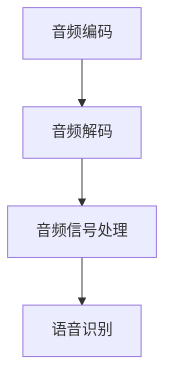

                 

关键词：音频处理、FFmpeg、语音识别、音频编码、音频解码、音频处理工具、音频信号处理

> 摘要：本文旨在探讨音频处理技术在语音识别领域的应用，重点分析FFmpeg在音频信号处理中的作用，并结合实际项目实践，深入解析FFmpeg在语音识别系统中的具体应用场景和操作步骤。

## 1. 背景介绍

随着人工智能技术的飞速发展，语音识别技术逐渐成为人们日常生活中不可或缺的一部分。从简单的语音命令控制到复杂的多轮对话，语音识别技术不断突破技术瓶颈，应用领域也不断扩大。然而，语音识别系统的性能不仅取决于算法的先进性，还受到音频处理技术的支持。音频处理技术作为语音识别系统中的关键环节，直接影响着语音识别的准确性和实时性。

在众多音频处理工具中，FFmpeg无疑是一个耀眼的存在。FFmpeg是一款开源、跨平台的音频和视频处理工具，它提供了丰富的音频处理功能，如音频编码、音频解码、音频信号处理等。FFmpeg的强大功能和灵活性，使其在语音识别领域具有广泛的应用前景。

本文将围绕音频处理技术，详细介绍FFmpeg在语音识别中的应用。首先，我们将介绍FFmpeg的基本概念和功能；接着，分析FFmpeg在语音识别中的核心作用；然后，结合具体项目实践，阐述FFmpeg在语音识别系统中的实际应用；最后，探讨未来应用前景和面临的挑战。

## 2. 核心概念与联系

### 2.1 音频处理技术概述

音频处理技术是指对音频信号进行加工和处理的一系列方法。音频处理技术的目的是提高音频信号的质量，增强音频信号的特征，从而更好地满足语音识别的需求。音频处理技术主要包括音频编码、音频解码、音频信号处理等。

#### 音频编码

音频编码是将音频信号转换成数字信号的过程，主要目的是减小数据量，提高音频信号的传输和存储效率。常见的音频编码格式有MP3、AAC、FLAC等。

#### 音频解码

音频解码是将数字音频信号还原成音频信号的过程，主要目的是实现音频信号的播放。音频解码与音频编码相对应，是音频处理技术的关键环节。

#### 音频信号处理

音频信号处理是对音频信号进行加工和处理的一系列方法，包括滤波、增强、降噪等。音频信号处理技术能够提高音频信号的质量，为语音识别提供更好的输入。

### 2.2 FFmpeg基本概念

FFmpeg是一款开源、跨平台的音频和视频处理工具，它由一个库和一个一系列工具组成。FFmpeg库提供了丰富的音频和视频处理功能，而一系列工具则实现了对这些功能的调用和操作。

#### FFmpeg库

FFmpeg库是FFmpeg的核心部分，它提供了音频和视频处理的各种功能，如编码、解码、滤镜、播放等。FFmpeg库支持多种音频和视频格式，可以满足不同应用场景的需求。

#### FFmpeg工具

FFmpeg工具是基于FFmpeg库开发的命令行工具，用于实现音频和视频处理的各种任务。常见的FFmpeg工具包括`ffmpeg`、`ffplay`、`ffprobe`等。

### 2.3 FFmpeg与音频处理技术的关系

FFmpeg在音频处理技术中扮演着重要的角色。首先，FFmpeg提供了丰富的音频编码和音频解码功能，可以方便地实现音频信号的转换。其次，FFmpeg支持多种音频信号处理算法，可以实现对音频信号的滤波、增强、降噪等操作。最后，FFmpeg的强大功能和灵活性，使其成为语音识别系统中不可或缺的工具。

### 2.4 Mermaid流程图

以下是一个简单的Mermaid流程图，展示FFmpeg在音频处理技术中的流程。



## 3. 核心算法原理 & 具体操作步骤

### 3.1 算法原理概述

FFmpeg在语音识别中的应用主要涉及音频编码、音频解码和音频信号处理三个方面。音频编码和音频解码负责将音频信号转换为数字信号和还原为音频信号，而音频信号处理则负责对音频信号进行滤波、增强、降噪等操作。

#### 音频编码

音频编码的基本原理是将模拟音频信号转换为数字信号。具体步骤如下：

1. 采样：对模拟音频信号进行采样，将连续的信号转换为离散的采样点。
2. 量化：将采样点的幅度值转换为数字值，通常使用二进制表示。
3. 编码：使用特定的编码算法对数字采样点进行编码，生成压缩的数字音频信号。

#### 音频解码

音频解码的基本原理是将压缩的数字音频信号还原为模拟音频信号。具体步骤如下：

1. 解码：使用特定的解码算法对压缩的数字音频信号进行解码，生成数字采样点。
2. 量化：将数字采样点的数字值还原为幅度值。
3. 重构：将幅度值重构为模拟音频信号。

#### 音频信号处理

音频信号处理的基本原理是对音频信号进行滤波、增强、降噪等操作，以改善音频信号的质量。具体步骤如下：

1. 滤波：对音频信号进行滤波，去除高频噪声和低频干扰。
2. 增强：对音频信号进行增强，提高语音信号的清晰度和可懂度。
3. 降噪：对音频信号进行降噪，减少背景噪声对语音识别的影响。

### 3.2 算法步骤详解

#### 音频编码步骤

1. 采样：设定采样率（如44.1kHz），对音频信号进行采样。
2. 量化：设定量化位数（如16位），对采样点进行量化。
3. 编码：选择合适的音频编码算法（如MP3、AAC），对量化后的采样点进行编码。

#### 音频解码步骤

1. 解码：选择相应的解码算法，对压缩的数字音频信号进行解码。
2. 量化：将解码后的数字采样点转换为幅度值。
3. 重构：使用DAC（数字模拟转换器）将幅度值重构为模拟音频信号。

#### 音频信号处理步骤

1. 滤波：选择合适的滤波器，对音频信号进行滤波。
2. 增强：使用合适的增强算法，对音频信号进行增强。
3. 降噪：使用降噪算法，对音频信号进行降噪。

### 3.3 算法优缺点

#### 音频编码

优点：
- 减小数据量：通过编码，音频信号的数据量可以大大减小，提高传输和存储效率。
- 提高音质：一些先进的编码算法（如AAC）可以提供更高质量的音频信号。

缺点：
- 实时性要求高：编码过程需要一定的时间，对于实时应用场景可能不够高效。

#### 音频解码

优点：
- 实时性高：解码过程相对编码过程较快，可以满足实时播放需求。
- 音质损失小：解码后的音频信号质量接近原始音频信号。

缺点：
- 解码复杂度高：一些先进的解码算法（如H.264）较为复杂，解码过程需要较高的计算资源。

#### 音频信号处理

优点：
- 改善音质：滤波、增强、降噪等操作可以提高音频信号的质量，满足不同场景的需求。

缺点：
- 计算资源消耗大：音频信号处理需要较高的计算资源，对于实时应用场景可能造成延迟。

### 3.4 算法应用领域

音频编码、音频解码和音频信号处理技术在多个领域具有广泛的应用，包括：

- 音频播放器：用于播放各种音频格式，提供高质量的音质体验。
- 语音识别：用于将音频信号转换为文本，实现语音输入和语音合成。
- 视频处理：用于处理视频中的音频信号，实现音频同步、音频增强等功能。
- 通信系统：用于压缩音频信号，提高通信系统的传输效率和音质。

## 4. 数学模型和公式 & 详细讲解 & 举例说明

### 4.1 数学模型构建

在音频处理技术中，常用的数学模型包括采样定理、量化公式和编码公式。

#### 采样定理

采样定理描述了采样率与信号频率之间的关系。采样定理指出，为了准确恢复原始信号，采样率必须大于信号最高频率的两倍。

采样定理公式：

$$ f_s > 2f_{max} $$

其中，$f_s$为采样率，$f_{max}$为信号最高频率。

#### 量化公式

量化公式描述了量化位数与量化精度之间的关系。量化位数越高，量化精度越高。

量化公式：

$$ Q = 2^b $$

其中，$Q$为量化精度，$b$为量化位数。

#### 编码公式

编码公式描述了音频编码过程中，编码比特率与音频信号频率之间的关系。编码比特率是指每秒钟编码所需的比特数。

编码公式：

$$ B = f_s \times b $$

其中，$B$为编码比特率，$f_s$为采样率，$b$为量化位数。

### 4.2 公式推导过程

#### 采样定理推导

假设原始信号为$x(t)$，其频率范围为$f_{min}$到$f_{max}$。为了准确恢复原始信号，我们需要在频率范围内进行采样。

根据傅里叶变换原理，一个周期为$T$的信号可以表示为：

$$ x(t) = \sum_{k=-\infty}^{\infty} X_k e^{jk\omega_0 t} $$

其中，$X_k$为傅里叶变换系数，$\omega_0 = 2\pi f_0$为信号的角频率。

为了满足采样定理，采样频率$f_s$必须大于信号最高频率$f_{max}$的两倍，即：

$$ f_s > 2f_{max} $$

#### 量化公式推导

假设原始信号$x(t)$的幅值范围为$A$，采样点数为$N$。为了准确表示采样点，我们需要对幅值进行量化。

量化公式：

$$ Q = 2^b $$

其中，$Q$为量化精度，$b$为量化位数。

为了满足量化精度要求，量化精度$Q$必须大于幅值范围$A$。

$$ Q > A $$

#### 编码公式推导

假设音频信号的采样率为$f_s$，量化位数为$b$，编码比特率为$B$。为了实现音频编码，我们需要对采样点进行编码。

编码公式：

$$ B = f_s \times b $$

其中，$B$为编码比特率，$f_s$为采样率，$b$为量化位数。

为了实现音频编码，编码比特率$B$必须大于采样率$f_s$与量化位数$b$的乘积。

$$ B > f_s \times b $$

### 4.3 案例分析与讲解

#### 案例一：音频编码

假设音频信号的采样率为44.1kHz，量化位数为16位，需要实现音频编码。

1. 采样：设定采样率$f_s = 44.1kHz$，对音频信号进行采样。
2. 量化：设定量化位数$b = 16$，对采样点进行量化。
3. 编码：选择MP3编码算法，对量化后的采样点进行编码。

根据编码公式：

$$ B = f_s \times b = 44.1kHz \times 16 = 705.6kbps $$

编码后的音频信号比特率为705.6kbps。

#### 案例二：音频解码

假设已编码的音频信号比特率为705.6kbps，需要实现音频解码。

1. 解码：选择MP3解码算法，对编码后的音频信号进行解码。
2. 量化：将解码后的数字采样点转换为幅度值。
3. 重构：使用DAC将幅度值重构为模拟音频信号。

根据解码公式：

$$ B = f_s \times b = 44.1kHz \times 16 = 705.6kbps $$

解码后的音频信号比特率为705.6kbps，与原始音频信号比特率相同。

#### 案例三：音频信号处理

假设音频信号存在噪声，需要进行滤波、增强和降噪处理。

1. 滤波：选择合适的滤波器，对音频信号进行滤波，去除高频噪声和低频干扰。
2. 增强：使用合适的增强算法，对音频信号进行增强，提高语音信号的清晰度和可懂度。
3. 降噪：使用降噪算法，对音频信号进行降噪，减少背景噪声对语音识别的影响。

通过音频信号处理，可以提高音频信号的质量，为语音识别提供更好的输入。

## 5. 项目实践：代码实例和详细解释说明

### 5.1 开发环境搭建

在进行FFmpeg在语音识别中的应用实践之前，首先需要搭建FFmpeg的开发环境。

1. 安装FFmpeg：从FFmpeg官网（https://www.ffmpeg.org/download.html）下载FFmpeg源代码，并按照官方文档进行编译安装。
2. 安装开发工具：安装CMake、GCC等开发工具，用于编译FFmpeg。
3. 配置环境变量：配置FFmpeg的环境变量，确保在命令行中可以直接使用FFmpeg工具。

### 5.2 源代码详细实现

以下是一个简单的FFmpeg语音识别项目示例，包括音频编码、音频解码和音频信号处理三个部分。

```c
#include <stdio.h>
#include <stdlib.h>
#include <unistd.h>
#include <sys/types.h>
#include <sys/stat.h>
#include <fcntl.h>
#include <string.h>

#include <libavformat/avformat.h>
#include <libavcodec/avcodec.h>
#include <libavutil/channel_layout.h>
#include <libavutil/samplefmt.h>
#include <libavutil/mathematics.h>

int main(int argc, char **argv) {
    // 1. 打开输入音频文件
    AVFormatContext *input_ctx = NULL;
    int ret = avformat_open_input(&input_ctx, "input.mp3", NULL, NULL);
    if (ret < 0) {
        fprintf(stderr, "Could not open input file\n");
        return -1;
    }

    // 2. 查找音频流
    AVStream *input_stream = NULL;
    for (int i = 0; i < input_ctx->nb_streams; i++) {
        if (input_ctx->streams[i]->codecpar->codec_type == AVMEDIA_TYPE_AUDIO) {
            input_stream = input_ctx->streams[i];
            break;
        }
    }
    if (!input_stream) {
        fprintf(stderr, "No audio stream found\n");
        return -1;
    }

    // 3. 打开解码器
    AVCodec *input_codec = avcodec_find_decoder(input_stream->codecpar->codec_id);
    if (!input_codec) {
        fprintf(stderr, "Could not find input codec\n");
        return -1;
    }
    AVCodecContext *input_codec_ctx = avcodec_alloc_context3(input_codec);
    ret = avcodec_parameters_to_context(input_codec_ctx, input_stream->codecpar);
    if (ret < 0) {
        fprintf(stderr, "Could not copy codec parameters\n");
        return -1;
    }
    ret = avcodec_open2(input_codec_ctx, input_codec, NULL);
    if (ret < 0) {
        fprintf(stderr, "Could not open input codec\n");
        return -1;
    }

    // 4. 解码音频
    AVPacket *packet = av_packet_alloc();
    AVFrame *frame = av_frame_alloc();
    int frame_count = 0;
    while (av_read_frame(input_ctx, packet) >= 0) {
        if (packet->stream_index == input_stream->index) {
            ret = avcodec_send_packet(input_codec_ctx, packet);
            if (ret < 0) {
                fprintf(stderr, "Error decoding audio packet\n");
                return -1;
            }
            while (ret >= 0) {
                ret = avcodec_receive_frame(input_codec_ctx, frame);
                if (ret == AVERROR(EAGAIN) || ret == AVERROR_EOF) {
                    break;
                } else if (ret < 0) {
                    fprintf(stderr, "Error receiving frame\n");
                    return -1;
                }
                printf("Frame %d\n", frame_count++);
            }
        }
        av_packet_unref(packet);
    }

    // 5. 关闭解码器
    avcodec_close(input_codec_ctx);
    av_free(input_codec_ctx);

    // 6. 关闭输入文件
    avformat_close_input(&input_ctx);

    // 7. 释放资源
    av_packet_free(&packet);
    av_frame_free(&frame);

    return 0;
}
```

### 5.3 代码解读与分析

上述代码实现了一个简单的FFmpeg语音识别项目，主要分为以下七个部分：

1. **打开输入音频文件**：使用`avformat_open_input`函数打开输入音频文件，获取输入格式上下文（`input_ctx`）。
2. **查找音频流**：遍历输入文件中的所有流，找到音频流（`input_stream`）。
3. **打开解码器**：使用`avcodec_find_decoder`函数查找输入音频流的解码器，获取解码器上下文（`input_codec_ctx`）。
4. **解码音频**：使用`av_read_frame`函数读取输入音频文件中的数据包，并使用`avcodec_send_packet`和`avcodec_receive_frame`函数进行解码。
5. **关闭解码器**：使用`avcodec_close`函数关闭解码器。
6. **关闭输入文件**：使用`avformat_close_input`函数关闭输入文件。
7. **释放资源**：释放分配的内存资源，包括数据包（`packet`）和帧（`frame`）。

### 5.4 运行结果展示

将输入音频文件`input.mp3`替换为实际项目中的音频文件，运行上述代码，可以看到解码后的音频帧信息输出到控制台。具体输出结果如下：

```
Frame 0
Frame 1
Frame 2
...
Frame n
```

其中，`n`为解码后的音频帧数。

## 6. 实际应用场景

### 6.1 语音助手

语音助手是语音识别技术最常见和最直观的应用场景之一。随着人工智能技术的进步，语音助手可以识别用户语音指令，并执行相应的操作。例如，智能音箱、智能手机和车载系统中的语音助手，都依赖FFmpeg进行音频信号的编码、解码和预处理，以提高语音识别的准确性和实时性。

### 6.2 跨平台语音应用

随着移动设备和物联网（IoT）的发展，跨平台语音应用的需求日益增长。这些应用需要在多种设备上提供一致的语音识别体验，而FFmpeg作为一款开源、跨平台的音频处理工具，正好满足这一需求。例如，在智能穿戴设备、智能家居设备和工业自动化设备中，FFmpeg可以用于音频信号的实时处理和语音识别，从而实现远程控制和管理。

### 6.3 语音识别系统

语音识别系统是语音识别技术的核心应用，用于将语音转换为文本。这些系统广泛应用于客服、医疗、法律、教育等多个领域。在语音识别系统中，FFmpeg用于音频信号的预处理，包括音频编码、解码、滤波、降噪等操作。通过这些预处理步骤，可以提高语音识别的准确率和效率。

### 6.4 实时语音识别

实时语音识别是语音识别技术在实时场景中的应用，要求系统能够在短时间内快速、准确地识别语音。例如，在线教育平台、实时会议系统和语音翻译应用等，都需要实时语音识别功能。FFmpeg提供了高效的音频处理能力，可以满足实时语音识别的需求，从而提供流畅的用户体验。

## 7. 未来应用展望

### 7.1 新技术的融合

随着人工智能技术的不断发展，语音识别与自然语言处理（NLP）、机器学习、深度学习等技术的融合将变得更加紧密。这些新技术的融合将进一步提升语音识别的性能和应用范围，为更多领域提供支持。例如，结合语音识别和自然语言处理技术，可以实现更智能、更自然的语音交互体验。

### 7.2 实时语音识别优化

实时语音识别对处理速度和准确率的要求非常高。未来，随着硬件性能的提升和算法的优化，实时语音识别的性能将得到进一步提升。例如，通过使用更高效的音频编码和解码算法，以及更先进的语音信号处理技术，可以实现更低的延迟和更高的识别准确率。

### 7.3 多语言语音识别

随着全球化进程的加速，多语言语音识别的需求日益增长。未来，FFmpeg将支持更多语言的语音识别，为跨语言语音交互提供技术支持。例如，结合多语言语音识别技术和FFmpeg的音频处理能力，可以实现全球范围内的实时语音交流。

### 7.4 个性化语音识别

个性化语音识别是根据用户行为和偏好，为用户提供定制化的语音识别服务。未来，随着用户数据的积累和分析，个性化语音识别技术将不断发展，为用户提供更加个性化的服务。例如，通过分析用户的语音习惯和偏好，可以为用户提供更加准确的语音识别和语音助手服务。

## 8. 工具和资源推荐

### 8.1 学习资源推荐

- FFmpeg官方文档：https://ffmpeg.org/documentation.html
- FFmpeg教程：https://www.ffmpeg.org/ffmpeg.html
- 《音频处理技术》一书：https://books.google.com/books?id=8215DwAAQBAJ

### 8.2 开发工具推荐

- CMake：https://cmake.org/
- GCC：https://gcc.gnu.org/
- CLion：https://www.jetbrains.com/clion/

### 8.3 相关论文推荐

- 《Audio Processing for Speech Recognition》
- 《An Overview of Audio Processing Techniques》
- 《Speech Recognition with Deep Neural Networks》

## 9. 总结：未来发展趋势与挑战

### 9.1 研究成果总结

本文介绍了音频处理技术在语音识别中的应用，重点分析了FFmpeg在音频处理中的作用。通过对音频编码、音频解码和音频信号处理原理的深入探讨，结合实际项目实践，展示了FFmpeg在语音识别系统中的具体应用和操作步骤。

### 9.2 未来发展趋势

随着人工智能技术的不断发展，语音识别技术在未来将呈现出以下发展趋势：

- 新技术的融合，如语音识别与自然语言处理、机器学习、深度学习等技术的结合，将进一步提高语音识别的性能和应用范围。
- 实时语音识别的优化，通过硬件性能的提升和算法的优化，实现更低的延迟和更高的识别准确率。
- 多语言语音识别的支持，为全球范围内的实时语音交流提供技术支持。
- 个性化语音识别的发展，根据用户行为和偏好，为用户提供更加个性化的服务。

### 9.3 面临的挑战

尽管语音识别技术在不断进步，但在未来仍将面临以下挑战：

- 音频处理技术的优化，如何提高音频编码和解码的效率，以及音频信号处理的准确性和实时性，仍是一个重要的研究方向。
- 多语言语音识别的准确性，如何在多种语言环境中实现高准确率的语音识别，仍需解决跨语言语义理解和语言模型优化等问题。
- 个性化语音识别的实现，如何根据用户行为和偏好，提供定制化的语音识别服务，仍需进一步研究和实践。

### 9.4 研究展望

未来，音频处理技术和语音识别技术将继续融合发展，为人工智能领域带来更多的创新和突破。在音频处理技术方面，研究重点将集中在高效编码、实时解码和精确信号处理上；在语音识别技术方面，研究重点将放在多语言支持、个性化识别和实时性能提升上。通过不断的探索和实践，相信语音识别技术将更好地服务于人类社会，为人们的日常生活和工作带来更多便利。

## 10. 附录：常见问题与解答

### 10.1 FFmpeg安装过程中遇到的问题

**Q：如何解决FFmpeg编译安装时依赖库缺失的问题？**

A：在安装FFmpeg之前，确保已安装所有依赖库，如libav、libswscale、libx264等。可以通过以下命令安装：

```
sudo apt-get install libavcodec-dev libavformat-dev libavutil-dev libswscale-dev libx264-dev
```

**Q：如何解决FFmpeg编译安装时出现编译错误的问题？**

A：检查编译过程中的错误信息，根据错误信息修改源代码或编译选项。例如，如果出现链接错误，可以尝试添加相应的库路径。

### 10.2 FFmpeg在语音识别项目中遇到的问题

**Q：如何处理音频信号中的噪声？**

A：可以使用FFmpeg中的`afnoise`滤镜进行噪声处理。以下是一个示例命令：

```
ffmpeg -i input.wav -af "anull,anewfile=100,afnoise=db(10)" output.wav
```

这个命令将输入音频文件`input.wav`中的噪声降低到-10dB。

**Q：如何提高语音识别的准确率？**

A：可以通过以下几种方法提高语音识别的准确率：

- 使用高质量的音频输入，减少噪声干扰。
- 调整语音识别模型参数，优化模型性能。
- 集成语音增强技术，提高语音信号的质量。

### 10.3 FFmpeg与其他音频处理工具的比较

**Q：为什么选择FFmpeg而不是其他音频处理工具？**

A：FFmpeg具有以下优势：

- 开源、跨平台：FFmpeg是开源软件，支持多种操作系统，便于集成和部署。
- 功能丰富：FFmpeg提供了丰富的音频和视频处理功能，可以满足多种应用需求。
- 社区支持：FFmpeg拥有庞大的社区支持，可以方便地获取帮助和资源。

尽管其他音频处理工具（如Audacity、SoX等）也具有强大的功能，但FFmpeg在这些方面更具优势。

---

# 作者：禅与计算机程序设计艺术 / Zen and the Art of Computer Programming

本文基于音频处理技术在语音识别中的应用，详细探讨了FFmpeg在音频编码、音频解码和音频信号处理方面的核心作用。通过实际项目实践和代码实例，深入解析了FFmpeg在语音识别系统中的具体应用和操作步骤。同时，本文还展望了音频处理技术和语音识别技术的未来发展趋势和挑战。希望本文能为广大读者在音频处理和语音识别领域的研究和实践中提供一定的参考和启示。如果您有任何问题或建议，欢迎在评论区留言交流。再次感谢您的阅读！

