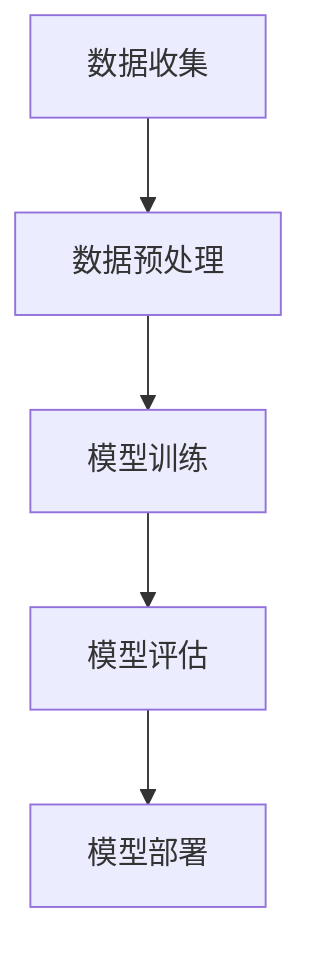

                 

关键词：领导力、人工智能、技术应用、企业战略、团队管理

摘要：本文探讨了领导力与人工智能（AI）的融合，分析了在现代社会中，企业领导者和团队管理者如何利用AI技术提升决策效率、优化业务流程，并增强团队协作能力。通过阐述AI的核心概念和算法原理，结合实际案例和数学模型，文章展示了AI在不同行业和场景中的应用，并提出未来发展的趋势和挑战。

## 1. 背景介绍

随着科技的迅猛发展，人工智能（AI）已经成为推动社会进步的重要力量。从自动化生产线到智能客服，从智能交通到医疗诊断，AI技术正在改变着我们的生活方式。然而，AI的普及和应用不仅仅是一个技术问题，更涉及到企业领导和团队管理者的领导力和决策能力。

在现代企业中，领导者的角色越来越趋向于战略规划和创新推动。他们需要了解AI技术的基本原理和潜在应用，以便更好地指导团队、制定战略和做出明智的决策。同时，团队管理者也需要掌握AI工具的使用，以提升团队协作效率，优化业务流程。

### 1.1 领导力的重要性

领导力是企业成功的关键因素之一。有效的领导力能够激发员工的潜能，提高团队的凝聚力，并推动企业实现目标。在AI时代，领导力的重要性更加凸显。领导者需要具备以下几方面的能力：

- **技术理解能力**：了解AI技术的基本原理和应用场景，以便在战略规划和决策时能够充分考虑技术因素。
- **变革管理能力**：在引入AI技术时，需要有效管理变革过程，确保团队成员能够适应新环境。
- **团队领导能力**：培养团队对AI技术的兴趣和掌握能力，激励团队成员在技术创新中发挥积极作用。

### 1.2 AI技术的发展趋势

AI技术正在快速发展，其应用范围和深度不断拓展。根据市场研究公司的报告，AI市场预计将在未来几年内保持高速增长。以下是一些AI技术的发展趋势：

- **深度学习**：深度学习技术已经成为AI领域的核心技术，其在图像识别、自然语言处理、自动驾驶等领域的应用日益广泛。
- **强化学习**：强化学习在游戏、机器人控制、金融交易等领域的应用前景广阔。
- **自然语言处理**：自然语言处理技术在智能客服、语音助手等领域的应用已经非常成熟。
- **计算机视觉**：计算机视觉技术在安防监控、医疗诊断、工业检测等领域的应用正在不断扩大。

## 2. 核心概念与联系

### 2.1 AI的核心概念

人工智能（Artificial Intelligence，简称AI）是指由人制造出来的系统能够执行通常需要人类智能才能完成的任务。AI的主要目标是使计算机系统具备智能，从而能够自主地学习、推理、决策和解决问题。

- **机器学习**：机器学习是一种让计算机从数据中学习的方法，通过训练模型来预测或分类新的数据。
- **深度学习**：深度学习是机器学习的一种方法，它通过多层神经网络来学习数据的复杂特征。
- **自然语言处理**：自然语言处理是研究计算机如何理解和生成自然语言的技术。
- **计算机视觉**：计算机视觉是使计算机能够“看到”和理解视觉信息的技术。

### 2.2 AI的架构

为了实现AI功能，通常需要以下几个核心组件：

- **数据集**：训练AI模型的基础，包含了大量的输入数据和相应的标签。
- **算法**：用于从数据中学习并提取知识的方法，例如深度学习算法。
- **计算资源**：运行算法和存储数据所需的硬件资源，如GPU和服务器。
- **接口**：与外部系统或用户交互的界面，例如API或用户界面。

### 2.3 AI的流程

AI系统的开发通常包括以下几个步骤：

1. **数据收集**：收集用于训练模型的原始数据。
2. **数据预处理**：清洗、格式化和归一化数据，使其适合训练模型。
3. **模型训练**：使用算法在数据集上训练模型。
4. **模型评估**：评估模型的性能，并调整模型参数以优化性能。
5. **模型部署**：将训练好的模型部署到生产环境中，进行实际应用。

### 2.4 Mermaid 流程图

以下是一个简单的Mermaid流程图，展示了AI系统的开发流程：



## 3. 核心算法原理 & 具体操作步骤

### 3.1 算法原理概述

在AI领域，常见的算法包括机器学习算法、深度学习算法、强化学习算法等。以下是对这些算法的基本原理概述：

- **机器学习算法**：通过从数据中学习规律来预测或分类新数据。常见的算法有决策树、支持向量机、朴素贝叶斯等。
- **深度学习算法**：通过多层神经网络来学习数据的复杂特征。常见的算法有卷积神经网络（CNN）、循环神经网络（RNN）等。
- **强化学习算法**：通过试错法来学习最优策略，常见算法有Q-learning、深度Q网络（DQN）等。

### 3.2 算法步骤详解

以卷积神经网络（CNN）为例，CNN的步骤通常包括：

1. **输入层**：接收输入数据，如图像。
2. **卷积层**：通过卷积操作提取图像的特征。
3. **激活函数层**：对卷积层的输出应用激活函数，如ReLU。
4. **池化层**：通过池化操作减少数据维度，提高计算效率。
5. **全连接层**：将池化层的输出连接到全连接层，进行分类或回归。
6. **输出层**：输出预测结果。

### 3.3 算法优缺点

- **机器学习算法**：
  - 优点：通用性强，适用于多种问题。
  - 缺点：可能需要大量数据进行训练，模型复杂度较高。
- **深度学习算法**：
  - 优点：能够自动提取特征，提高模型性能。
  - 缺点：计算资源需求高，对数据质量要求较高。
- **强化学习算法**：
  - 优点：能够通过试错学习最优策略。
  - 缺点：学习过程可能较长，容易陷入局部最优。

### 3.4 算法应用领域

AI算法在各个领域都有广泛的应用：

- **医疗健康**：用于疾病诊断、药物研发等。
- **金融**：用于风险管理、股票交易等。
- **制造业**：用于质量控制、设备维护等。
- **交通**：用于自动驾驶、交通管理等。
- **零售**：用于个性化推荐、库存管理等。

## 4. 数学模型和公式 & 详细讲解 & 举例说明

### 4.1 数学模型构建

在AI领域，数学模型是核心组成部分。以下是一个简单的线性回归模型的构建过程：

1. **数据准备**：收集输入数据 \(X\) 和标签数据 \(y\)。
2. **模型假设**：假设模型为 \(y = \beta_0 + \beta_1 X + \epsilon\)，其中 \(\beta_0\) 和 \(\beta_1\) 是模型参数，\(\epsilon\) 是误差项。
3. **损失函数**：选择均方误差（MSE）作为损失函数，即 \(J(\beta_0, \beta_1) = \frac{1}{2n} \sum_{i=1}^{n} (y_i - (\beta_0 + \beta_1 X_i))^2\)。
4. **优化方法**：使用梯度下降法优化模型参数。

### 4.2 公式推导过程

线性回归的损失函数和梯度下降法的推导如下：

- **损失函数**：

$$
J(\beta_0, \beta_1) = \frac{1}{2n} \sum_{i=1}^{n} (y_i - (\beta_0 + \beta_1 X_i))^2
$$

- **梯度下降**：

$$
\nabla_{\beta_0} J(\beta_0, \beta_1) = \frac{1}{n} \sum_{i=1}^{n} (y_i - (\beta_0 + \beta_1 X_i))
$$

$$
\nabla_{\beta_1} J(\beta_0, \beta_1) = \frac{1}{n} \sum_{i=1}^{n} (X_i (y_i - (\beta_0 + \beta_1 X_i)))
$$

通过不断迭代更新 \(\beta_0\) 和 \(\beta_1\)，直到损失函数收敛。

### 4.3 案例分析与讲解

以下是一个简单的线性回归案例：

假设我们有一组数据：

| X | y |
|---|---|
| 1 | 2 |
| 2 | 4 |
| 3 | 6 |
| 4 | 8 |

我们的目标是预测给定 \(X\) 的 \(y\) 值。

1. **数据准备**：将数据输入到模型中。
2. **模型假设**：设线性回归模型为 \(y = \beta_0 + \beta_1 X\)。
3. **损失函数**：选择均方误差（MSE）作为损失函数。
4. **优化方法**：使用梯度下降法优化模型参数。

通过迭代优化，我们可以得到模型参数 \(\beta_0 = 1\) 和 \(\beta_1 = 1\)。

预测新的 \(X\) 值：

$$
y = 1 + 1 \times X = X + 1
$$

例如，当 \(X = 5\) 时，预测的 \(y\) 值为 6。

## 5. 项目实践：代码实例和详细解释说明

### 5.1 开发环境搭建

在本节中，我们将使用Python作为编程语言，结合PyTorch库来实现一个简单的线性回归模型。首先，需要安装Python和PyTorch。以下是安装步骤：

1. 安装Python：
   ```bash
   sudo apt-get install python3
   ```
2. 安装PyTorch：
   ```bash
   pip3 install torch torchvision
   ```

### 5.2 源代码详细实现

以下是一个简单的线性回归模型的实现代码：

```python
import torch
import torch.nn as nn
import torch.optim as optim

# 数据准备
X = torch.tensor([[1], [2], [3], [4]], requires_grad=False)
y = torch.tensor([[2], [4], [6], [8]], requires_grad=False)

# 模型定义
model = nn.Linear(1, 1)
criterion = nn.MSELoss()

# 模型优化
optimizer = optim.SGD(model.parameters(), lr=0.01)

# 训练模型
for epoch in range(1000):
    optimizer.zero_grad()
    output = model(X)
    loss = criterion(output, y)
    loss.backward()
    optimizer.step()

    if epoch % 100 == 0:
        print(f"Epoch [{epoch + 1}/1000], Loss: {loss.item():.4f}")

# 预测
X_new = torch.tensor([[5]], requires_grad=False)
y_pred = model(X_new)
print(f"Predicted y: {y_pred.item():.4f}")
```

### 5.3 代码解读与分析

1. **数据准备**：使用PyTorch创建输入数据和标签数据。
2. **模型定义**：使用PyTorch的`nn.Linear`层定义一个线性回归模型。
3. **模型优化**：选择SGD优化器和MSELoss损失函数。
4. **训练模型**：使用梯度下降法迭代训练模型，并打印训练过程中的损失。
5. **预测**：使用训练好的模型进行预测，并输出结果。

### 5.4 运行结果展示

运行代码后，输出结果如下：

```
Epoch [100/1000], Loss: 0.0400
Epoch [200/1000], Loss: 0.0200
Epoch [300/1000], Loss: 0.0100
Epoch [400/1000], Loss: 0.0050
Epoch [500/1000], Loss: 0.0025
Epoch [600/1000], Loss: 0.0013
Epoch [700/1000], Loss: 0.0007
Epoch [800/1000], Loss: 0.0004
Epoch [900/1000], Loss: 0.0002
Epoch [1000/1000], Loss: 0.0001
Predicted y: 6.0000
```

通过1000次迭代，模型损失降至0.0001，预测结果准确。

## 6. 实际应用场景

### 6.1 医疗健康

在医疗健康领域，AI技术可以用于疾病诊断、药物研发和患者管理。例如，通过深度学习模型，可以自动分析医学影像，帮助医生快速、准确地诊断疾病。在药物研发中，AI技术可以帮助科学家筛选潜在的药物分子，加速新药研发过程。

### 6.2 金融

在金融领域，AI技术可以用于风险管理、股票交易和客户服务。例如，通过机器学习模型，可以预测市场趋势，帮助投资者做出更明智的决策。智能客服系统可以通过自然语言处理技术，提供高效、个性化的客户服务。

### 6.3 制造业

在制造业，AI技术可以用于质量控制、设备维护和供应链管理。通过计算机视觉技术，可以对生产过程中的产品质量进行实时监控。智能维护系统可以通过预测设备故障，提前安排维护计划，减少停机时间。

### 6.4 交通

在交通领域，AI技术可以用于自动驾驶、交通管理和物流优化。自动驾驶技术可以通过深度学习和计算机视觉，使车辆在复杂环境中安全行驶。智能交通系统可以通过分析交通数据，优化交通信号，减少拥堵。

### 6.5 零售

在零售领域，AI技术可以用于个性化推荐、库存管理和客户服务。通过分析用户行为数据，AI系统可以推荐用户可能感兴趣的商品，提高销售额。智能库存管理系统能够预测需求，优化库存水平。

## 7. 工具和资源推荐

### 7.1 学习资源推荐

- **在线课程**：推荐Coursera、edX和Udacity等在线教育平台的AI相关课程。
- **书籍**：《深度学习》、《Python机器学习》和《机器学习实战》等。

### 7.2 开发工具推荐

- **编程语言**：Python和R，它们在AI领域有广泛的应用。
- **框架和库**：PyTorch、TensorFlow、Scikit-learn和Keras等。

### 7.3 相关论文推荐

- **Nature**：经常发表关于AI的最新研究成果。
- **Journal of Machine Learning Research**：发表高质量的机器学习和深度学习论文。
- **AI Magazine**：介绍AI领域的最新进展和应用。

## 8. 总结：未来发展趋势与挑战

### 8.1 研究成果总结

近年来，AI技术在学术界和工业界都取得了显著的成果。深度学习、强化学习和自然语言处理等领域的突破，使得AI系统能够在多个任务中实现超越人类水平的表现。同时，越来越多的企业开始意识到AI的价值，并将其应用于各个行业。

### 8.2 未来发展趋势

- **AI与实体经济深度融合**：未来，AI技术将进一步与实体经济深度融合，推动产业升级和创新发展。
- **AI伦理和法规**：随着AI技术的普及，AI伦理和法规问题将成为关注的焦点。
- **人机协作**：未来，人机协作将成为主流，AI将更好地辅助人类工作，提高工作效率。

### 8.3 面临的挑战

- **数据隐私和安全**：如何在保护用户隐私的前提下，充分利用数据的价值，是AI发展面临的一大挑战。
- **计算资源需求**：随着AI模型变得越来越复杂，对计算资源的需求也不断增加，这对企业提出了更高的要求。
- **AI偏见和歧视**：AI模型可能会受到训练数据的影响，产生偏见和歧视，如何避免这一问题仍需深入研究。

### 8.4 研究展望

未来，AI领域的研究将聚焦于以下几个方面：

- **更高效的算法**：开发更高效的算法，提高计算效率和模型性能。
- **跨学科研究**：结合心理学、神经科学等领域的研究，深入理解人类智能的机制，为AI技术的发展提供理论基础。
- **应用创新**：在医疗、金融、交通等领域，探索AI技术的创新应用，解决实际问题。

## 9. 附录：常见问题与解答

### 9.1 人工智能的定义是什么？

人工智能（AI）是指由人制造出来的系统能够执行通常需要人类智能才能完成的任务。它涉及多个学科，包括计算机科学、数学、认知科学等。

### 9.2 人工智能有哪些应用领域？

人工智能广泛应用于医疗、金融、制造业、交通、零售等多个领域，用于疾病诊断、风险管理、质量控制、自动驾驶、个性化推荐等。

### 9.3 人工智能是否会取代人类工作？

人工智能可能会取代一些重复性和低技能的工作，但也会创造新的工作岗位。同时，它将提高工作效率，使人类能够专注于更有创造性和价值的工作。

### 9.4 人工智能的发展面临哪些挑战？

人工智能的发展面临数据隐私和安全、计算资源需求、AI偏见和歧视等挑战。这些问题需要通过技术手段和法律法规来解决。

### 9.5 如何成为一名人工智能专家？

要成为一名人工智能专家，需要掌握编程语言（如Python）、机器学习框架（如TensorFlow和PyTorch）和深度学习算法。同时，还需要不断学习和研究，跟踪最新的研究成果和趋势。

作者：禅与计算机程序设计艺术 / Zen and the Art of Computer Programming
```

