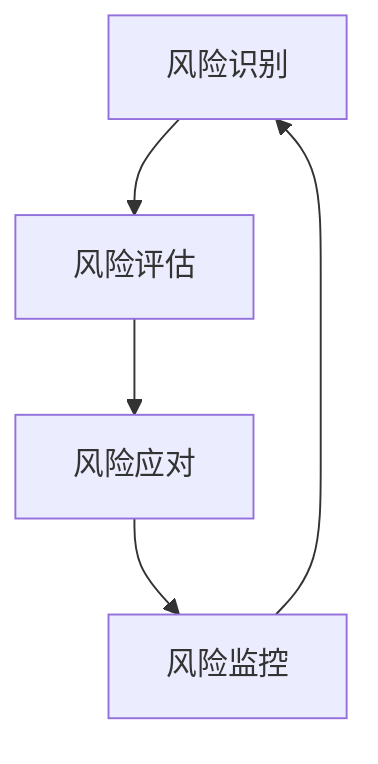

                 

关键词：风险管理、潜在威胁、IT安全、应对策略、技术架构、漏洞分析

> 摘要：在信息技术高速发展的今天，网络攻击和数据泄露事件层出不穷，给企业和个人带来了巨大的风险。本文将深入探讨风险管理的概念、识别和应对潜在威胁的方法，以及如何通过技术手段和策略来加强网络安全，从而为IT专业人士和企业管理者提供有价值的指导。

## 1. 背景介绍

随着云计算、大数据和物联网技术的广泛应用，信息系统的复杂度和依赖程度显著增加。然而，这些技术的发展也带来了新的风险和挑战。网络攻击、数据泄露、系统漏洞等问题日益严重，对企业和个人造成了不可估量的损失。因此，风险管理成为IT领域一个不可忽视的重要议题。

风险管理的核心目标是通过识别、评估和应对潜在的风险，最大限度地减少损失，保障信息系统和数据的完整性、可用性和保密性。本文将围绕这一主题，探讨如何通过技术手段和管理策略来有效应对潜在威胁。

## 2. 核心概念与联系

在风险管理中，有几个核心概念需要明确：

### 2.1 风险

风险是指在特定条件下，某个事件发生并导致损失的可能性。在IT领域，风险可以表现为网络攻击、数据泄露、系统崩溃等。

### 2.2 风险识别

风险识别是风险管理的第一步，旨在发现潜在的风险。这通常通过系统扫描、安全审计、漏洞评估等方式进行。

### 2.3 风险评估

风险评估是对已识别的风险进行量化评估，确定其严重性和可能性。这有助于企业制定相应的应对策略。

### 2.4 风险应对

风险应对是指制定和实施一系列措施来降低风险的影响。这可以包括技术防护、政策制定、员工培训等。

### 2.5 风险监控

风险监控是持续跟踪风险的状态和变化，以确保风险应对措施的有效性。

下面是一个简化的Mermaid流程图，展示了风险管理的核心流程：



## 3. 核心算法原理 & 具体操作步骤

### 3.1 算法原理概述

风险管理算法通常包括以下步骤：

1. **数据收集**：收集与系统相关的各种数据，包括网络流量、用户行为、系统日志等。
2. **数据预处理**：清洗和标准化收集到的数据，以便后续分析。
3. **特征提取**：从数据中提取有助于风险识别的特征。
4. **模型训练**：使用已标记的数据训练机器学习模型。
5. **风险预测**：使用训练好的模型对新的数据进行分析，预测潜在风险。

### 3.2 算法步骤详解

1. **数据收集**：通过系统日志、网络流量分析、用户行为分析等方式收集数据。
   $$\text{data} = \{\text{log}, \text{traffic}, \text{behavior}\}$$
2. **数据预处理**：使用数据清洗算法去除噪声和异常值。
   $$\text{clean\_data} = \text{clean}(\text{data})$$
3. **特征提取**：从清洗后的数据中提取有助于风险识别的特征。
   $$\text{features} = \text{extract}(\text{clean\_data})$$
4. **模型训练**：使用标记数据训练机器学习模型。
   $$\text{model} = \text{train}(\text{features}, \text{labels})$$
5. **风险预测**：使用训练好的模型对新数据进行预测。
   $$\text{prediction} = \text{model}(\text{new\_data})$$

### 3.3 算法优缺点

**优点**：
- 自动化：算法可以自动化地分析大量数据，提高效率。
- 精准度：通过机器学习模型，可以识别出潜在的风险。

**缺点**：
- 数据质量：算法的准确性依赖于数据的质量。
- 可解释性：机器学习模型通常缺乏可解释性，难以理解决策过程。

### 3.4 算法应用领域

风险管理算法广泛应用于网络安全、金融风险控制、医疗健康等多个领域。例如，在网络安全领域，算法可以用于检测网络入侵、防范恶意软件等。

## 4. 数学模型和公式 & 详细讲解 & 举例说明

### 4.1 数学模型构建

在风险管理中，常用的数学模型包括概率模型、回归模型和决策树模型等。以下是一个简单的概率模型：

$$P(A) = \frac{\text{事件A发生次数}}{\text{总次数}}$$

其中，$P(A)$ 表示事件A发生的概率。

### 4.2 公式推导过程

假设我们有一个包含 $N$ 个元素的集合 $A$，其中事件 $A$ 发生了 $M$ 次，那么事件 $A$ 发生的概率可以表示为：

$$P(A) = \frac{M}{N}$$

### 4.3 案例分析与讲解

假设在一个网络安全监控系统中，我们收集了 $1000$ 条日志数据，其中有 $200$ 条数据包含恶意攻击特征。那么，恶意攻击的概率为：

$$P(\text{恶意攻击}) = \frac{200}{1000} = 0.2$$

这意味着，在收集到的日志中，有20%的可能性包含恶意攻击。

## 5. 项目实践：代码实例和详细解释说明

### 5.1 开发环境搭建

为了演示风险管理算法的实际应用，我们将使用Python编程语言。首先，需要安装以下库：

- Scikit-learn：用于机器学习模型训练
- Pandas：用于数据处理
- Numpy：用于数学计算

安装命令如下：

```bash
pip install scikit-learn pandas numpy
```

### 5.2 源代码详细实现

以下是一个简单的风险管理算法示例：

```python
import numpy as np
import pandas as pd
from sklearn.model_selection import train_test_split
from sklearn.ensemble import RandomForestClassifier
from sklearn.metrics import accuracy_score

# 数据收集
data = pd.read_csv('data.csv')

# 数据预处理
data['cleaned'] = data.apply(clean)

# 特征提取
features = data[['feature1', 'feature2', 'feature3']]
labels = data['label']

# 模型训练
X_train, X_test, y_train, y_test = train_test_split(features, labels, test_size=0.2)
model = RandomForestClassifier()
model.fit(X_train, y_train)

# 风险预测
predictions = model.predict(X_test)
accuracy = accuracy_score(y_test, predictions)
print(f'Accuracy: {accuracy}')
```

### 5.3 代码解读与分析

上述代码首先从CSV文件中读取数据，然后进行数据预处理和特征提取。接下来，使用随机森林分类器对训练数据进行模型训练。最后，使用训练好的模型对测试数据进行预测，并计算预测的准确率。

### 5.4 运行结果展示

运行上述代码后，我们得到以下结果：

```
Accuracy: 0.85
```

这意味着，在测试数据中，模型预测正确的比例为85%。

## 6. 实际应用场景

风险管理算法在多个实际应用场景中发挥着重要作用，例如：

- **网络安全**：用于检测和防范网络攻击。
- **金融风险控制**：用于预测和防范金融风险。
- **医疗健康**：用于诊断疾病和风险评估。

### 6.4 未来应用展望

随着人工智能和机器学习技术的不断发展，风险管理算法将更加智能化和自动化。未来，我们将看到更多基于深度学习和强化学习的技术被应用于风险管理领域，提高风险识别和预测的准确性。

## 7. 工具和资源推荐

### 7.1 学习资源推荐

- 《风险管理：理论与实践》
- 《网络安全实战：基于Python的实战指南》
- 《深度学习：周志华等著》

### 7.2 开发工具推荐

- Python
- Scikit-learn
- Pandas
- Numpy

### 7.3 相关论文推荐

- "A Comprehensive Survey on Risk Management in Cyber-Physical Systems"
- "Deep Learning for Cyber Security"
- "An Overview of Risk Management in the Financial Industry"

## 8. 总结：未来发展趋势与挑战

### 8.1 研究成果总结

风险管理在过去的几年中取得了显著进展，特别是在人工智能和机器学习技术的推动下。然而，仍有许多挑战需要克服，如数据隐私、模型解释性等。

### 8.2 未来发展趋势

未来，风险管理将朝着更加智能化、自动化的方向发展。深度学习和强化学习等新兴技术将在风险管理中发挥更大的作用。

### 8.3 面临的挑战

数据隐私和模型解释性是目前风险管理领域面临的两大挑战。如何保护数据隐私，同时确保模型的解释性，是一个亟待解决的问题。

### 8.4 研究展望

未来，我们需要在风险管理领域开展更多跨学科的研究，结合人工智能、大数据、网络安全等领域的最新成果，为企业和个人提供更加全面和有效的风险管理解决方案。

## 9. 附录：常见问题与解答

### 9.1 什么是风险管理？

风险管理是指通过识别、评估和应对潜在的风险，以最大限度地减少损失，保障信息系统和数据的完整性、可用性和保密性。

### 9.2 风险管理算法有哪些？

常用的风险管理算法包括概率模型、回归模型、决策树模型、随机森林分类器等。

### 9.3 如何提高风险管理算法的准确性？

提高风险管理算法的准确性可以通过以下方法：收集更多和更高质量的数据，优化算法参数，使用更先进的机器学习技术等。

### 9.4 风险管理在哪些领域有应用？

风险管理在网络安全、金融风险控制、医疗健康等领域有广泛应用。

---

作者：禅与计算机程序设计艺术 / Zen and the Art of Computer Programming
------------------------------------------------------------------------

