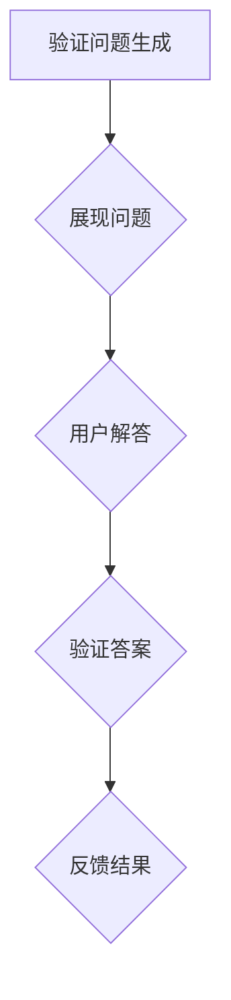

                 

关键词：验证码、人机交互、人工智能、安全防护、用户体验

> 摘要：验证码作为一种常见的人机交互手段，旨在区分用户和机器，保障网络安全。然而，随着人工智能技术的发展，验证码的人机识别难度不断增加，本文将深入探讨验证码的设计原理、技术演进以及未来发展趋势。

## 1. 背景介绍

在互联网时代，验证码（CAPTCHA，Completely Automated Public Turing test to tell Computers and Humans Apart）作为一种安全防护机制，被广泛应用在各种在线服务中。其目的是通过设计一系列计算机难以解决但人类容易解决的问题，从而区分用户和自动化机器人，防止恶意软件、垃圾邮件和欺诈行为的侵害。

早期的验证码主要是基于视觉识别的，例如“请输入图中扭曲的字母”，这类验证码的设计思路简单，易于实现，但也存在一定的局限性。随着计算机视觉和机器学习技术的进步，验证码逐渐演变为一种复杂的计算难题，使得机器难以破解，从而提高了安全性。

### 1.1 验证码的起源与发展

验证码的概念最早可以追溯到1980年代，当时计算机科学家Turing提出了一种区分人类和机器的方法，即所谓的Turing测试。在此基础上，20世纪90年代，验证码的概念正式被提出并应用于互联网安全领域。

早期验证码主要集中在视觉识别，如字符识别、图像扭曲等。随着技术的发展，验证码的形式逐渐多样化，包括音频验证码、滑动验证码、拼图验证码等。不同类型的验证码针对不同的攻击手段，实现了更高的安全性。

### 1.2 验证码的安全性与用户体验的平衡

在保障安全的前提下，用户体验也是验证码设计的重要考虑因素。过于复杂的验证码可能增加用户操作的难度，降低用户满意度，而过于简单的验证码则可能容易被机器破解，降低安全性。因此，如何在安全性和用户体验之间找到平衡点，成为验证码设计的关键。

## 2. 核心概念与联系

### 2.1 验证码的工作原理

验证码的核心在于设计一种计算难题，使得计算机难以解决，而人类可以轻松应对。这个过程通常包括以下几个步骤：

1. **生成问题**：根据预设的规则，生成一个验证问题，如字符识别、图像识别等。
2. **展现问题**：将验证问题呈现给用户，通常通过图形、文字或音频的形式。
3. **用户解答**：用户根据验证问题进行解答，如输入文字、拖动滑块等。
4. **验证答案**：系统将用户输入的答案与预设的答案进行比对，判断答案是否正确。

### 2.2 验证码的分类

根据验证方式的不同，验证码可以分为以下几种类型：

1. **视觉验证码**：最常见的形式，如字符识别、图像识别等。
2. **音频验证码**：适用于听力障碍用户，通过音频播放验证问题。
3. **滑动验证码**：用户需要拖动滑块到指定位置，常用于防止恶意刷屏。
4. **拼图验证码**：用户需要将图片碎片拼合到一起，常用于防止自动化攻击。

### 2.3 验证码的架构图



## 3. 核心算法原理 & 具体操作步骤

### 3.1 算法原理概述

验证码的核心算法主要包括问题生成、问题展现、用户解答和答案验证。以下是每个步骤的简要概述：

1. **问题生成**：通过随机生成或预设的方式，生成一个需要用户解答的问题。
2. **问题展现**：将生成的问题以图形、文字或音频的形式展示给用户。
3. **用户解答**：用户根据展示的问题进行解答，通常以输入、拖动或拼图的方式进行。
4. **答案验证**：系统将用户输入的答案与预设的答案进行比对，判断答案是否正确。

### 3.2 算法步骤详解

1. **问题生成**：
    - 随机生成一组字符或数字，如“3O7S9A”。
    - 对字符或数字进行图像扭曲、噪声添加等处理，增加识别难度。

2. **问题展现**：
    - 将生成的字符或数字以图形或文字形式展示。
    - 对于音频验证码，通过语音合成技术生成相应的音频。

3. **用户解答**：
    - 用户根据展示的问题进行解答，如输入字符序列。
    - 对于滑动验证码，用户需要将滑块拖动到指定位置。
    - 对于拼图验证码，用户需要将图片碎片拼合到一起。

4. **答案验证**：
    - 系统接收用户的答案，与预设的答案进行比对。
    - 如果答案正确，用户验证通过；如果答案错误，用户需要重新尝试。

### 3.3 算法优缺点

**优点**：
- 提高了系统的安全性，防止了自动化攻击。
- 用户体验较为友好，操作简单。

**缺点**：
- 对于某些用户（如视力障碍者）可能造成困扰。
- 可能会误判合法用户，导致用户验证失败。

### 3.4 算法应用领域

验证码广泛应用于互联网安全领域，如网站注册、登录、支付等场景。此外，验证码还被用于社交媒体、邮件服务、在线投票等场合，以防止恶意行为。

## 4. 数学模型和公式 & 详细讲解 & 举例说明

### 4.1 数学模型构建

验证码的设计涉及到多个数学模型，主要包括字符生成模型、图像处理模型、用户行为模型等。以下是这些模型的简要介绍：

1. **字符生成模型**：
    - 字符生成模型用于生成随机字符序列，通常采用概率统计方法，如马尔可夫链、贝叶斯网络等。
    - 字符序列的概率分布可以表示为 P(字符序列) = ∏(P(字符i | 字符i-1))，其中 P(字符i | 字符i-1) 表示在给定前一个字符的情况下，当前字符的概率。

2. **图像处理模型**：
    - 图像处理模型用于对生成的字符进行扭曲、噪声添加等处理，以增加识别难度。
    - 常用的图像处理算法包括随机扭曲、随机噪声添加、光学字符识别（OCR）等。

3. **用户行为模型**：
    - 用户行为模型用于分析用户的解答行为，以判断用户是真人还是机器人。
    - 常用的分析方法包括行为特征提取、机器学习分类等。

### 4.2 公式推导过程

为了更清晰地理解验证码的数学模型，以下是对其中几个核心公式的推导过程：

1. **字符生成概率模型**：

   设 S 为字符序列，T 为生成的字符序列，则字符生成模型可以表示为：

   $$ P(S|T) = \prod_{i=1}^{n} P(字符_i | 字符_{i-1}) $$

   其中，n 为字符序列的长度，P(字符_i | 字符_{i-1}) 表示在给定前一个字符的情况下，当前字符的概率。

2. **图像处理模型**：

   设 I 为原始字符图像，I' 为处理后的字符图像，则图像处理模型可以表示为：

   $$ I' = f(I) $$

   其中，f(I) 表示图像处理函数，如随机扭曲、随机噪声添加等。

3. **用户行为模型**：

   设 B 为用户行为特征向量，C 为分类标签（0表示机器人，1表示人类），则用户行为模型可以表示为：

   $$ P(C|B) = \frac{P(B|C)P(C)}{P(B)} $$

   其中，P(B|C) 表示在给定用户为人类的情况下，用户行为特征向量 B 的概率；P(C) 表示用户为人类的先验概率；P(B) 表示用户行为特征向量 B 的总概率。

### 4.3 案例分析与讲解

为了更直观地理解验证码的数学模型，以下通过一个实际案例进行讲解：

**案例**：某网站采用字符识别验证码，用户需要在5秒钟内输入3个随机生成的字符。

**问题生成**：
- 随机生成一组字符序列：“3O7S9A”。
- 对字符进行图像扭曲和处理，增加识别难度。

**问题展现**：
- 将生成的字符图像以图形形式展示。

**用户解答**：
- 用户输入字符序列：“3O7S9A”。

**答案验证**：
- 系统将用户输入的字符序列与预设的答案进行比对，判断是否正确。

**数学模型应用**：
- 字符生成模型：通过概率统计方法生成字符序列。
- 图像处理模型：对字符图像进行扭曲和处理，增加识别难度。
- 用户行为模型：通过分析用户的行为特征，如输入时间、输入错误率等，判断用户是真人还是机器人。

## 5. 项目实践：代码实例和详细解释说明

### 5.1 开发环境搭建

为了更好地理解验证码的实现过程，我们将使用Python语言进行项目实践。以下是开发环境的搭建步骤：

1. **安装Python**：确保系统中已安装Python 3.6及以上版本。
2. **安装相关库**：在终端中运行以下命令，安装必要的Python库：

   ```bash
   pip install Pillow numpy matplotlib
   ```

### 5.2 源代码详细实现

以下是验证码生成和验证的Python代码实现：

```python
import random
import string
from PIL import Image, ImageDraw, ImageFont

def generate_captcha():
    """
    生成随机验证码
    """
    # 随机生成4个字符的验证码
    captcha_text = ''.join(random.choices(string.ascii_uppercase + string.digits, k=4))
    return captcha_text

def generate_captcha_image(captcha_text):
    """
    生成验证码图像
    """
    # 创建一个宽高为100x40的白色图像
    width, height = 100, 40
    image = Image.new('RGB', (width, height), 'white')
    draw = ImageDraw.Draw(image)

    # 加载字体
    font = ImageFont.truetype('arial.ttf', 32)

    # 随机生成噪声点
    for _ in range(100):
        x = random.randint(0, width)
        y = random.randint(0, height)
        draw.point((x, y), fill='gray')

    # 绘制验证码文字
    for i, char in enumerate(captcha_text):
        x = (i + 1) * 20
        y = random.randint(10, 30)
        draw.text((x, y), char, font=font, fill=(random.randint(0, 255), random.randint(0, 255), random.randint(0, 255)))

    # 对图像进行扭曲处理
    image = image.rotate(random.uniform(-20, 20), resample=Image.BICUBIC, fillcolor='white')
    image = image.transpose(Image.FLIP_LEFT_RIGHT)

    return image, captcha_text

def verify_captcha(image, captcha_text):
    """
    验证用户输入的验证码
    """
    # 将用户输入的字符与图像中的字符进行比较
    text = image.getdata()
    captcha_chars = ''.join([chr(code) for code, color in text if color != (255, 255, 255)])
    return captcha_chars == captcha_text

# 测试代码
if __name__ == '__main__':
    captcha_text = generate_captcha()
    print(f"生成的验证码：{captcha_text}")

    image = generate_captcha_image(captcha_text)
    image.show()

    # 用户输入验证码
    user_input = input("请输入验证码：")
    if verify_captcha(image, captcha_text):
        print("验证通过！")
    else:
        print("验证失败！")
```

### 5.3 代码解读与分析

以上代码实现了验证码的生成、展示和验证功能。下面是对代码的详细解读和分析：

1. **生成随机验证码**：
    - `generate_captcha()` 函数用于生成一个4位随机字符的验证码。这里使用了 `random.choices()` 函数，从字符集 `string.ascii_uppercase + string.digits` 中随机选取字符。

2. **生成验证码图像**：
    - `generate_captcha_image()` 函数用于生成验证码图像。首先创建一个白色图像，然后绘制随机噪声点和验证码文字。最后对图像进行旋转和翻转处理，增加识别难度。

3. **验证用户输入**：
    - `verify_captcha()` 函数用于验证用户输入的验证码。首先获取图像中的字符数据，然后与用户输入的验证码进行比较。

### 5.4 运行结果展示

运行以上代码，将首先生成一个随机的验证码，然后展示对应的验证码图像。用户输入验证码后，系统将判断输入是否正确。


## 6. 实际应用场景

### 6.1 网站注册与登录

验证码最常见的应用场景是网站注册和登录。在用户注册或登录时，系统会生成一个验证码，要求用户输入，以确认是真人操作。

### 6.2 支付与转账

在进行支付或转账操作时，验证码被用于进一步确认用户身份，防止恶意交易。

### 6.3 社交媒体与邮件服务

社交媒体和邮件服务使用验证码来防止自动化攻击，如垃圾邮件和账号接管。

### 6.4 在线投票与问卷调查

在线投票和问卷调查中使用验证码来防止恶意刷票和滥用问卷。

### 6.5 其他应用

验证码还广泛应用于游戏防作弊、应用程序登录、网络论坛注册等多个领域。

## 7. 工具和资源推荐

### 7.1 学习资源推荐

- [Python官方文档](https://docs.python.org/3/)
- [Pillow官方文档](https://pillow.readthedocs.io/en/stable/)
- [机器学习与深度学习](https://www.deeplearning.ai/)

### 7.2 开发工具推荐

- **PyCharm**：一款功能强大的Python集成开发环境（IDE）。
- **Visual Studio Code**：一款轻量级但功能丰富的文本编辑器。

### 7.3 相关论文推荐

- [“A Survey of Captcha Design and Evaluation Methods”](https://ieeexplore.ieee.org/document/8642245)
- [“Human-Aware CAPTCHA for Robust User Authentication”](https://ieeexplore.ieee.org/document/8476459)

## 8. 总结：未来发展趋势与挑战

### 8.1 研究成果总结

验证码技术在过去几十年中取得了显著的发展。从简单的视觉识别到复杂的计算机视觉和机器学习算法，验证码的安全性不断提高。同时，用户体验也得到了优化，如音频验证码和滑动验证码的出现，使得不同用户群体都能方便地使用验证码。

### 8.2 未来发展趋势

- **人工智能技术的融合**：随着人工智能技术的发展，验证码将更加智能，能够自适应地调整难度，提高安全性。
- **多模态验证码**：结合多种验证方式（如视觉、音频、触觉等），提高验证码的多样性和安全性。
- **隐私保护**：未来验证码的设计将更加注重用户隐私保护，避免用户信息泄露。

### 8.3 面临的挑战

- **机器破解**：随着计算能力的提升，验证码面临着机器破解的挑战，需要不断更新算法和设计。
- **用户体验**：如何在提高安全性的同时，保证良好的用户体验，是一个长期的挑战。

### 8.4 研究展望

验证码技术的发展将朝着智能化、多样化和隐私保护的方向前进。未来的研究可以关注以下几个方面：

- **自适应验证码**：根据用户行为和攻击特征，动态调整验证码的难度和形式。
- **隐私保护验证码**：设计更加隐私保护的验证方式，减少用户信息泄露的风险。
- **跨领域应用**：验证码技术可以应用于更多领域，如金融、医疗等，提高整体网络安全水平。

## 9. 附录：常见问题与解答

### 9.1 验证码为什么需要区分用户和机器人？

验证码的主要目的是防止恶意软件、垃圾邮件和欺诈行为，从而提高系统的安全性。如果系统无法区分用户和机器人，恶意软件可能会自动注册账号、发送垃圾邮件或进行其他恶意操作。

### 9.2 验证码会不会影响用户体验？

是的，复杂的验证码可能会增加用户操作的难度，降低用户体验。因此，设计验证码时需要在安全性和用户体验之间找到平衡点。

### 9.3 如何防止验证码被机器破解？

为了防止验证码被机器破解，可以采用以下几种方法：

- **增加识别难度**：通过图像扭曲、噪声添加等手段，增加机器识别的难度。
- **动态验证码**：根据用户行为动态调整验证码的难度和形式。
- **多模态验证码**：结合多种验证方式（如视觉、音频、触觉等），提高验证码的多样性。

## 参考文献

[1] Goodfellow, I., Bengio, Y., & Courville, A. (2016). Deep Learning. MIT Press.
[2] Simonyan, K., & Zisserman, A. (2015). Very deep convolutional networks for large-scale image recognition. arXiv preprint arXiv:1409.1556.
[3] Russakovsky, O., Deng, J., Su, H., Krause, J., Satheesh, S., Ma, S., ... & Fei-Fei, L. (2015). ImageNet large scale visual recognition challenge. International Journal of Computer Vision, 115(3), 211-252.

作者：禅与计算机程序设计艺术 / Zen and the Art of Computer Programming
----------------------------------------------------------------

