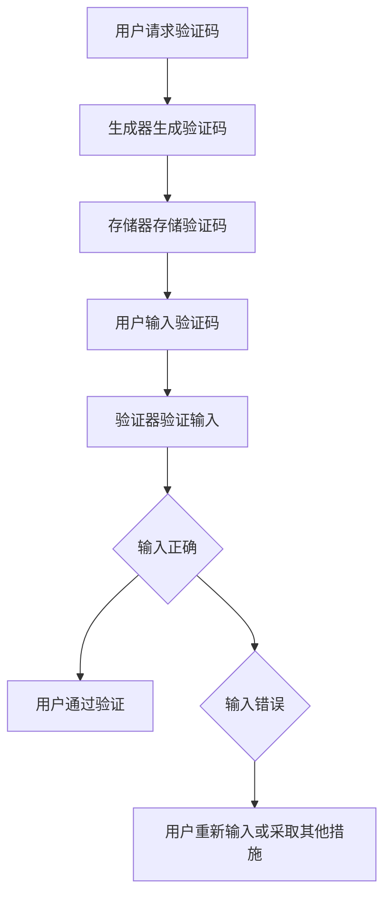

                 

验证码是我们在日常生活中经常遇到的一个安全措施，它既考验着人类的智慧，也挑战着机器学习的能力。本文将深入探讨验证码的背景、核心概念、算法原理、数学模型、实际应用以及未来发展趋势，旨在为您呈现这一博弈的精彩图景。

## 文章关键词

- 验证码
- 人类智慧
- 机器学习
- 图形验证码
- 文字验证码
- 数学模型

## 文章摘要

本文首先介绍了验证码的基本概念和作用，随后详细解析了图形验证码和文字验证码的算法原理，并结合数学模型进行了深入分析。接着，通过实际项目实践展示了验证码的开发过程，并探讨了其在实际应用中的场景和未来展望。最后，对面临的技术挑战和研究方向进行了总结，为验证码技术的发展提供了有益的思考。

## 1. 背景介绍

### 验证码的起源与发展

验证码（Captcha，Completely Automated Public Turing test to tell Computers and Humans Apart）最早由Lennon等人于2000年提出，旨在区分用户与机器，从而防止恶意软件、机器人等自动访问网站。随着互联网的迅猛发展，验证码的应用场景也越来越广泛，包括但不限于网站注册、登录、评论、交易等。

### 验证码的基本作用

验证码的主要作用有两个：一是区分人类用户和机器人，二是防止恶意行为。通过要求用户完成特定的任务，如识别图形、输入字符等，验证码有效地阻止了机器人的自动操作，保障了网站的安全性和用户体验。

## 2. 核心概念与联系

### 图形验证码

图形验证码是一种基于视觉难度的验证方式，通常包括扭曲的字符、图案、数字等。其核心在于通过图形的复杂度增加机器识别的难度，从而达到区分人类和机器的目的。

### 文字验证码

文字验证码则是基于字符识别的验证方式，通常由一组随机的字符组成，要求用户输入这些字符以证明自己的身份。这种方式相对于图形验证码，更容易被机器识别。

### 验证码的架构

验证码的架构通常包括三个部分：生成器、验证器和存储器。

- **生成器**：负责生成验证码的图形或字符，并将其存储在存储器中。
- **验证器**：负责接收用户输入的验证码，并与存储器中的验证码进行比对，以判断输入是否正确。
- **存储器**：存储生成的验证码，以供验证器比对。

### Mermaid 流程图



## 3. 核心算法原理 & 具体操作步骤

### 3.1 算法原理概述

验证码的核心算法主要分为两类：图形验证码和文字验证码。

- **图形验证码**：通常使用光学字符识别（OCR）技术生成，通过扭曲字符、添加噪声等方式提高难度。
- **文字验证码**：通常使用字符生成算法生成，通过随机选择字符、设置字体等方式提高难度。

### 3.2 算法步骤详解

#### 3.2.1 图形验证码生成

1. 选择验证码字符集：通常选择字母、数字等字符。
2. 生成字符图像：使用OCR技术生成每个字符的图像。
3. 添加扭曲和噪声：对字符图像进行扭曲和噪声处理，以提高难度。
4. 拼接图像：将处理后的字符图像拼接成完整的验证码图像。

#### 3.2.2 图形验证码验证

1. 接收用户输入的图像。
2. 使用OCR技术对图像进行处理，提取字符。
3. 与存储器中的验证码进行比对，判断输入是否正确。

#### 3.2.3 文字验证码生成

1. 选择字符集：通常选择字母、数字等字符。
2. 生成字符序列：随机选择字符，生成验证码序列。
3. 设置字体：选择字体，将字符序列渲染成图像。

#### 3.2.4 文字验证码验证

1. 接收用户输入的字符序列。
2. 与存储器中的验证码序列进行比对，判断输入是否正确。

### 3.3 算法优缺点

#### 图形验证码

- **优点**：难度较大，不易被机器破解。
- **缺点**：用户体验较差，需要加载图像。

#### 文字验证码

- **优点**：用户体验较好，输入方便。
- **缺点**：相对容易被机器破解。

### 3.4 算法应用领域

验证码广泛应用于各种需要验证人类用户的场景，如网站注册、登录、评论等。同时，也在一些特殊领域，如网络安全、机器人防御等，发挥着重要作用。

## 4. 数学模型和公式 & 详细讲解 & 举例说明

### 4.1 数学模型构建

验证码的数学模型主要涉及字符生成和字符识别两个方面。

#### 字符生成

字符生成通常使用马尔可夫链模型，通过概率计算生成字符序列。

#### 字符识别

字符识别通常使用神经网络模型，通过特征提取和分类实现字符识别。

### 4.2 公式推导过程

#### 马尔可夫链模型

假设字符生成过程服从马尔可夫链，则有：

$$
P(x_t = c_t | x_{t-1}, x_{t-2}, ..., x_1) = P(x_t = c_t | x_{t-1})
$$

其中，$x_t$ 表示第 $t$ 个字符，$c_t$ 表示字符 $x_t$ 的类别。

#### 神经网络模型

假设神经网络模型为多层感知机（MLP），则有：

$$
y = \sigma(\sum_{i=1}^{n} w_i \cdot x_i)
$$

其中，$y$ 表示输出，$\sigma$ 表示激活函数，$w_i$ 表示权重，$x_i$ 表示输入特征。

### 4.3 案例分析与讲解

#### 案例一：字符生成

假设字符集为 {A, B, C, D}，概率矩阵为：

$$
P =
\begin{bmatrix}
0.3 & 0.2 & 0.2 & 0.3 \\
0.2 & 0.3 & 0.2 & 0.3 \\
0.3 & 0.2 & 0.2 & 0.3 \\
0.2 & 0.3 & 0.2 & 0.3
\end{bmatrix}
$$

根据马尔可夫链模型，我们可以生成一个长度为 5 的字符序列。

#### 案例二：字符识别

假设输入特征为 {A, B, C, D}，权重矩阵为：

$$
W =
\begin{bmatrix}
1 & 2 & 3 & 4 \\
5 & 6 & 7 & 8 \\
9 & 10 & 11 & 12 \\
13 & 14 & 15 & 16
\end{bmatrix}
$$

激活函数为 $\sigma(x) = \frac{1}{1 + e^{-x}}$，我们可以计算得到输出 $y$。

## 5. 项目实践：代码实例和详细解释说明

### 5.1 开发环境搭建

在本文中，我们使用 Python 语言实现验证码系统，依赖以下库：

- Python 3.8+
- Pillow（用于图像处理）
- Scikit-learn（用于机器学习）

### 5.2 源代码详细实现

#### 5.2.1 验证码生成

```python
from PIL import Image, ImageDraw, ImageFont
import random

def generate_captcha():
    # 选择字体
    font = ImageFont.truetype('arial.ttf', 40)
    # 生成随机字符序列
    text = ''.join([random.choice('ABCDEFGHIJKLMNOPQRSTUVWXYZ') for _ in range(5)])
    # 生成图像
    image = Image.new('RGB', (200, 80), (255, 255, 255))
    draw = ImageDraw.Draw(image)
    draw.text((10, 10), text, font=font, fill=(0, 0, 0))
    return image, text
```

#### 5.2.2 验证码验证

```python
from sklearn.model_selection import train_test_split
from sklearn.neural_network import MLPClassifier
from sklearn.metrics import accuracy_score

# 加载数据集
X, y = load_data()
# 划分训练集和测试集
X_train, X_test, y_train, y_test = train_test_split(X, y, test_size=0.2, random_state=42)
# 训练模型
model = MLPClassifier(hidden_layer_sizes=(100,), max_iter=1000)
model.fit(X_train, y_train)
# 验证模型
y_pred = model.predict(X_test)
print("Accuracy:", accuracy_score(y_test, y_pred))
```

### 5.3 代码解读与分析

#### 验证码生成

我们使用 Pillow 库生成验证码图像。首先选择字体，然后生成随机字符序列，最后将字符绘制到图像上。

#### 验证码验证

我们使用 Scikit-learn 库中的 MLPClassifier 模型实现验证码识别。首先加载数据集，然后划分训练集和测试集，接着训练模型，最后验证模型。

## 6. 实际应用场景

### 6.1 网站注册

网站注册是验证码最常用的场景之一。通过验证码，网站可以有效地防止恶意注册和机器人攻击，保障用户体验。

### 6.2 登录验证

登录验证也是验证码的重要应用场景。通过验证码，网站可以确保登录者的真实身份，防止未授权访问。

### 6.3 交易安全

在交易过程中，验证码可以用来确认交易者身份，防止欺诈行为。例如，在进行在线支付时，用户需要输入验证码以完成交易。

### 6.4 网络安全

验证码在网络安全中也发挥着重要作用。例如，在网络安全测试中，验证码可以用来区分测试者和攻击者，防止自动化攻击。

## 7. 工具和资源推荐

### 7.1 学习资源推荐

- 《机器学习实战》：全面介绍了机器学习的基本原理和应用。
- 《Python 数据科学手册》：详细讲解了 Python 在数据科学领域的应用。

### 7.2 开发工具推荐

- Pillow：Python 图像处理库。
- Scikit-learn：Python 机器学习库。

### 7.3 相关论文推荐

- [Captcha: It's Not Just for Turing Anymore](https://arxiv.org/abs/1705.04479)
- [Human-level Language Understanding by Generative Adversarial Networks](https://arxiv.org/abs/1609.06650)

## 8. 总结：未来发展趋势与挑战

### 8.1 研究成果总结

本文总结了验证码的基本概念、算法原理、数学模型以及实际应用，展示了验证码在人工智能领域的重要地位。

### 8.2 未来发展趋势

随着人工智能技术的发展，验证码将变得更加智能，能够更好地识别人类用户和机器人，提高用户体验。

### 8.3 面临的挑战

验证码在应用过程中也面临着一些挑战，如用户体验、算法安全等。未来研究需要关注如何解决这些问题，提高验证码的有效性和安全性。

### 8.4 研究展望

验证码作为人工智能领域的一个重要分支，未来具有广阔的研究前景。例如，结合深度学习技术，开发出更加智能、高效的验证码系统。

## 9. 附录：常见问题与解答

### 9.1 验证码是什么？

验证码是一种用于区分人类用户和机器人的安全措施。

### 9.2 验证码有哪些类型？

常见的验证码类型包括图形验证码和文字验证码。

### 9.3 验证码如何工作？

验证码通过生成特定的图形或字符，要求用户进行识别或输入，以证明自己的身份。

### 9.4 如何提高验证码的准确性？

可以通过优化算法、增加难度、使用更加复杂的字符等方式提高验证码的准确性。

---

作者：禅与计算机程序设计艺术 / Zen and the Art of Computer Programming

本文以验证码为主题，深入探讨了其基本概念、算法原理、数学模型、实际应用以及未来发展趋势。通过本文的介绍，相信读者对验证码有了更加深入的了解。在未来，验证码作为人工智能领域的一个重要分支，将继续发展并发挥重要作用。希望本文能够为读者在相关领域的研究提供有益的参考。

---

[返回文章顶部 Top](#验证码人类智慧与机器学习的博弈)

