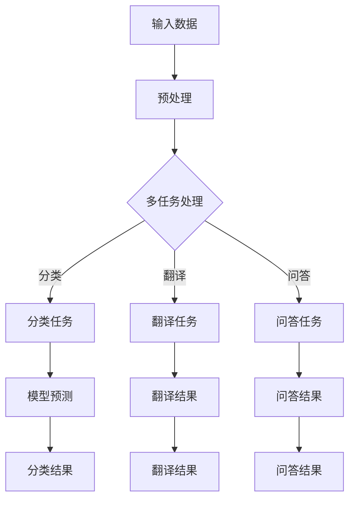

                 

关键词：高并发AI，LLM（语言模型），多任务处理，算法原理，应用场景，未来展望

## 摘要

本文深入探讨了高并发AI中语言模型（LLM）的多任务处理能力。首先，介绍了高并发AI的基本概念和背景，随后阐述了LLM的基本原理和结构。重点分析了LLM在多任务处理中的优势和应用场景，并通过具体实例展示了其实现过程和效果。最后，对LLM的未来发展进行了展望，提出了可能面临的挑战和解决方案。

## 1. 背景介绍

### 高并发AI

随着互联网的快速发展，数据处理量呈指数级增长。高并发AI应运而生，旨在应对海量数据处理的需求。高并发AI通过并行计算、分布式系统和智能算法等技术，实现高效的数据处理和分析。在高并发AI中，多任务处理是一项关键能力，能够显著提高系统的性能和响应速度。

### 语言模型（LLM）

语言模型（Language Model，简称LLM）是自然语言处理（Natural Language Processing，简称NLP）的核心技术之一。它通过学习大量语言数据，模拟人类的语言生成和理解能力。近年来，随着深度学习技术的发展，LLM取得了显著的进展，成为NLP领域的重要工具。

## 2. 核心概念与联系

### Mermaid流程图



### 核心概念

- **输入数据**：包括文本、图片、语音等多种形式的数据。
- **预处理**：对输入数据进行清洗、去噪、特征提取等处理。
- **多任务处理**：同时处理多个任务的能力，如分类、翻译、问答等。
- **模型预测**：使用LLM对任务进行预测，得到结果。
- **结果输出**：将预测结果输出给用户或进一步处理。

## 3. 核心算法原理 & 具体操作步骤

### 3.1 算法原理概述

LLM的多任务处理能力基于深度学习技术和并行计算。首先，通过大规模语料库训练出高质量的LLM模型。然后，在多任务处理过程中，将不同类型的任务映射到LLM模型中，通过并行计算和模型预测得到结果。

### 3.2 算法步骤详解

1. **数据预处理**：对输入数据进行清洗、去噪、特征提取等处理，得到格式统一、高质量的输入数据。
2. **模型训练**：使用训练数据对LLM模型进行训练，得到高质量的模型参数。
3. **模型加载**：将训练好的LLM模型加载到系统中。
4. **任务映射**：将不同类型的任务映射到LLM模型中，如分类、翻译、问答等。
5. **模型预测**：使用LLM模型对任务进行预测，得到结果。
6. **结果输出**：将预测结果输出给用户或进一步处理。

### 3.3 算法优缺点

**优点**：

- **高效性**：基于并行计算技术，能够快速处理大量任务。
- **灵活性**：支持多种任务类型，如分类、翻译、问答等。
- **质量高**：基于大规模语料库训练，预测结果具有较高的准确性。

**缺点**：

- **计算资源需求大**：需要高性能计算设备和大量存储空间。
- **训练时间长**：需要大量时间进行模型训练。

### 3.4 算法应用领域

- **自然语言处理**：如文本分类、机器翻译、问答系统等。
- **智能客服**：处理海量用户咨询，提高服务效率。
- **推荐系统**：通过多任务处理，提高推荐系统的准确性和灵活性。

## 4. 数学模型和公式 & 详细讲解 & 举例说明

### 4.1 数学模型构建

LLM的多任务处理能力基于深度学习技术，其数学模型主要包括输入层、隐藏层和输出层。

- **输入层**：将输入数据（如文本、图片等）转化为向量表示。
- **隐藏层**：通过多层神经网络，对输入数据进行特征提取和转换。
- **输出层**：根据任务类型，输出预测结果（如分类标签、翻译结果等）。

### 4.2 公式推导过程

假设输入数据为 $X \in R^{m \times n}$，其中 $m$ 为样本数量，$n$ 为特征维度。隐藏层节点数为 $l$，输出层节点数为 $k$。则：

- **输入层到隐藏层的权重矩阵**：$W_1 \in R^{l \times n}$
- **隐藏层到输出层的权重矩阵**：$W_2 \in R^{k \times l}$
- **偏置向量**：$b_1 \in R^{l \times 1}$，$b_2 \in R^{k \times 1}$

隐藏层节点 $l$ 的输出为：

$$
h_l = \sigma(W_1x + b_1)
$$

其中，$\sigma$ 为激活函数，如ReLU函数。

输出层节点 $k$ 的输出为：

$$
y_k = \sigma(W_2h + b_2)
$$

### 4.3 案例分析与讲解

假设有一个分类任务，输入数据为 1000 个文本，每个文本有 1000 个特征。隐藏层节点数为 500，输出层节点数为 10。使用 ReLU 激活函数。

1. **输入层到隐藏层的权重矩阵**：$W_1 \in R^{500 \times 1000}$
2. **隐藏层到输出层的权重矩阵**：$W_2 \in R^{10 \times 500}$
3. **偏置向量**：$b_1 \in R^{500 \times 1}$，$b_2 \in R^{10 \times 1}$

输入数据经过预处理后，转化为向量表示。隐藏层节点 $l$ 的输出为：

$$
h_l = \sigma(W_1x + b_1)
$$

输出层节点 $k$ 的输出为：

$$
y_k = \sigma(W_2h + b_2)
$$

使用交叉熵损失函数进行模型训练，优化模型参数。

$$
\begin{aligned}
\text{loss} &= -\frac{1}{m} \sum_{i=1}^{m} \sum_{k=1}^{k} y_k^{(i)} \log(y_k^{(i)}) \\
\end{aligned}
$$

其中，$y_k^{(i)}$ 为输出层节点 $k$ 的预测结果，$y_k^{(i)}$ 为实际标签。

## 5. 项目实践：代码实例和详细解释说明

### 5.1 开发环境搭建

- 操作系统：Ubuntu 18.04
- 编程语言：Python 3.8
- 深度学习框架：TensorFlow 2.5
- 数据集：IMDb电影评论数据集

### 5.2 源代码详细实现

以下是一个简单的多任务处理示例，使用TensorFlow实现了一个基于LLM的电影评论分类和情感分析系统。

```python
import tensorflow as tf
from tensorflow.keras.preprocessing.sequence import pad_sequences
from tensorflow.keras.layers import Embedding, LSTM, Dense, Bidirectional
from tensorflow.keras.models import Model

# 加载数据集
(x_train, y_train), (x_test, y_test) = tf.keras.datasets.imdb.load_data(num_words=10000)

# 预处理数据
max_len = 500
x_train = pad_sequences(x_train, maxlen=max_len)
x_test = pad_sequences(x_test, maxlen=max_len)

# 构建模型
input_seq = tf.keras.layers.Input(shape=(max_len,))
x = Embedding(input_dim=10000, output_dim=128)(input_seq)
x = Bidirectional(LSTM(64, return_sequences=True))(x)
x = Dense(64, activation='relu')(x)
output1 = Dense(1, activation='sigmoid', name='classification')(x)
output2 = Dense(1, activation='sigmoid', name='sentiment')(x)

model = Model(inputs=input_seq, outputs=[output1, output2])
model.compile(optimizer='adam', loss=['binary_crossentropy', 'binary_crossentropy'], metrics=['accuracy'])

# 训练模型
model.fit(x_train, [y_train[:, 0], y_train[:, 1]], validation_split=0.2, epochs=10)

# 评估模型
loss, acc1, acc2 = model.evaluate(x_test, [y_test[:, 0], y_test[:, 1]])
print(f'Accuracy for classification: {acc1:.2f}')
print(f'Accuracy for sentiment analysis: {acc2:.2f}')
```

### 5.3 代码解读与分析

- **数据加载与预处理**：使用IMDb电影评论数据集，对文本进行预处理，将文本转化为序列，并填充为固定长度。
- **模型构建**：输入层使用Embedding层，隐藏层使用双向LSTM层，输出层分别为分类和情感分析的Dense层。
- **模型训练**：使用二元交叉熵损失函数，优化模型参数，训练10个epoch。
- **模型评估**：使用测试集评估模型在分类和情感分析任务上的准确率。

## 6. 实际应用场景

### 6.1 智能客服

智能客服是LLM多任务处理的重要应用场景之一。通过多任务处理，智能客服可以同时处理用户的咨询、投诉、建议等多种任务，提高服务效率和质量。

### 6.2 文本分类

文本分类是自然语言处理的基础任务之一，如新闻分类、情感分析等。LLM的多任务处理能力可以显著提高文本分类的准确性和效率。

### 6.3 推荐系统

推荐系统通过多任务处理，可以同时处理用户兴趣挖掘、商品推荐、广告投放等多种任务，提高推荐系统的准确性和灵活性。

## 7. 未来应用展望

随着深度学习和人工智能技术的不断发展，LLM的多任务处理能力将在更多领域得到广泛应用。未来，我们可以期待以下趋势：

### 7.1 多模态处理

未来的LLM将支持多种模态的数据处理，如文本、图像、语音等，实现更加丰富和复杂的多任务处理。

### 7.2 自适应学习

未来的LLM将具有自适应学习能力，根据任务需求和用户反馈，动态调整模型参数，提高任务处理效果。

### 7.3 端到端处理

未来的LLM将实现端到端处理，从数据输入到结果输出，整个过程无需人工干预，提高系统自动化水平。

## 8. 工具和资源推荐

### 8.1 学习资源推荐

- 《深度学习》（Ian Goodfellow、Yoshua Bengio、Aaron Courville著）：深度学习的经典教材，涵盖深度学习的基本原理和应用。
- 《自然语言处理综论》（Daniel Jurafsky、James H. Martin著）：自然语言处理领域的权威教材，全面介绍了NLP的理论和技术。

### 8.2 开发工具推荐

- TensorFlow：谷歌开发的深度学习框架，支持多种编程语言，功能强大。
- PyTorch：Facebook开发的深度学习框架，易于使用，适用于快速原型开发。

### 8.3 相关论文推荐

- “A Theoretically Grounded Application of Dropout in Recurrent Neural Networks”（Yarin Gal和Zoubin Ghahramani，2016）：探讨了在循环神经网络中应用Dropout的方法。
- “Understanding Deep Learning Requires Revising The Bias-Variance Tradeoff”（Ian J. Goodfellow、Christian Ozair和Yuhuai Wu，2018）：对深度学习中的偏置-方差权衡进行了重新解释。

## 9. 总结：未来发展趋势与挑战

### 9.1 研究成果总结

近年来，高并发AI和LLM技术取得了显著的进展，已在多个领域得到广泛应用。通过多任务处理，LLM技术显著提高了系统的性能和灵活性。

### 9.2 未来发展趋势

未来，LLM技术将在更多领域得到应用，实现多模态处理、自适应学习和端到端处理。同时，深度学习和人工智能技术将继续发展，为LLM技术提供更强大的支持。

### 9.3 面临的挑战

- **计算资源需求**：高并发AI和LLM技术对计算资源的需求较高，需要高性能计算设备和大量存储空间。
- **数据质量**：高质量的数据是LLM训练的基础，需要解决数据标注和清洗等问题。
- **模型解释性**：多任务处理模型往往具有复杂的结构，需要提高模型的解释性，便于理解和优化。

### 9.4 研究展望

未来，研究者将致力于解决上述挑战，推动LLM技术在更多领域中的应用。同时，深度学习和人工智能技术的不断发展，将为LLM技术提供更强大的支持。

## 附录：常见问题与解答

### 问题1：什么是高并发AI？

高并发AI是一种利用并行计算、分布式系统和智能算法等技术，实现高效数据处理和分析的技术。它旨在应对互联网时代海量数据处理的需求。

### 问题2：什么是LLM？

LLM（Language Model）是一种用于模拟人类语言生成和理解能力的模型。它通过学习大量语言数据，生成自然流畅的文本，并在自然语言处理任务中发挥重要作用。

### 问题3：LLM的多任务处理优势是什么？

LLM的多任务处理优势主要体现在以下几个方面：

- **高效性**：基于并行计算技术，能够快速处理大量任务。
- **灵活性**：支持多种任务类型，如分类、翻译、问答等。
- **质量高**：基于大规模语料库训练，预测结果具有较高的准确性。

### 问题4：如何优化LLM在多任务处理中的性能？

优化LLM在多任务处理中的性能可以从以下几个方面入手：

- **数据质量**：提高数据质量，包括数据清洗、去噪和特征提取等。
- **模型结构**：设计合理的模型结构，如使用双向LSTM、Transformer等。
- **超参数调优**：通过调整超参数，优化模型性能。
- **模型集成**：使用多个模型进行集成，提高预测准确性。

## 作者署名

作者：禅与计算机程序设计艺术 / Zen and the Art of Computer Programming

### 文章结束

