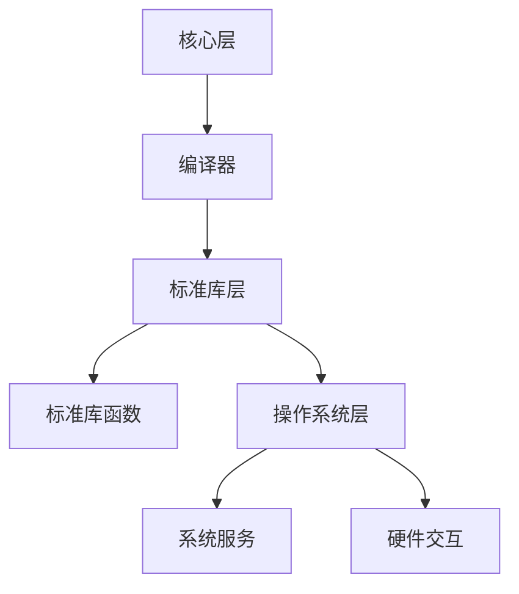
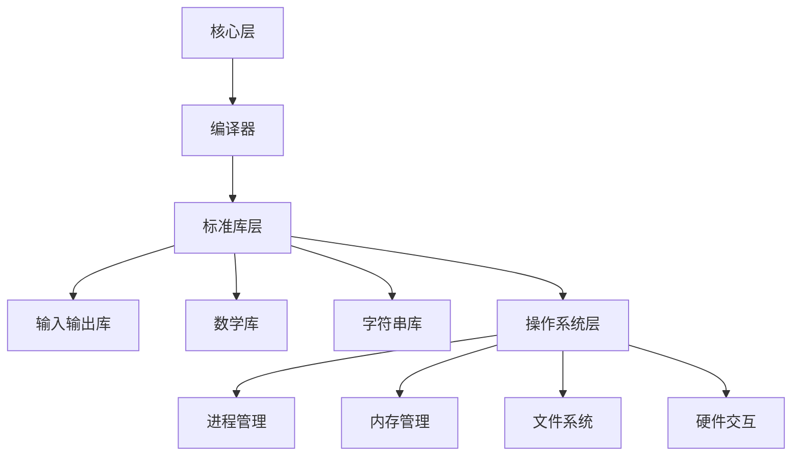

                 

 **关键词：** C 语言，高级编程，底层操作，性能优化，内存管理，算法效率，软件工程，系统编程

**摘要：** 本文深入探讨了 C 语言在高级编程中的重要性，详细分析了其底层操作、内存管理、算法效率等方面的独特优势。文章不仅介绍了 C 语言的核心概念和原理，还通过具体的算法实例、数学模型以及实际项目实践，展示了 C 语言在现实应用中的强大力量。同时，文章也对未来的发展趋势和面临的挑战进行了展望，为读者提供了丰富的学习资源和工具推荐。

## 1. 背景介绍

C 语言作为一种经典的编程语言，自1972年由贝尔实验室的Dennis Ritchie发明以来，已经在计算机科学领域发挥了巨大的作用。C 语言以其强大的底层操作能力和高性能著称，成为系统编程、嵌入式开发、高性能计算等领域的首选语言。同时，C 语言简洁的语法和丰富的库函数也为软件开发提供了极大的便利。

在高级编程中，C 语言的重要性主要体现在以下几个方面：

1. **性能优化：** C 语言允许程序员对程序进行精细的性能优化，通过直接操作硬件和底层系统资源，实现高效的数据处理和计算。
2. **内存管理：** C 语言提供了强大的内存管理功能，允许程序员手动分配和释放内存，从而控制程序的内存使用，提高运行效率。
3. **算法效率：** C 语言丰富的数据结构和算法库，为程序员提供了高效的算法实现，使得复杂的计算和数据处理变得更加简单和快速。
4. **软件工程：** C 语言作为一种底层编程语言，能够帮助程序员深入理解计算机系统的工作原理，提升软件开发的全面性和系统性。

## 2. 核心概念与联系

### 2.1 C 语言核心概念

C 语言的核心概念主要包括变量、数据类型、运算符、控制结构、函数、指针和数组等。这些概念构成了 C 语言的基础，使得程序员能够编写出高效的程序。

- **变量**：变量是内存中用于存储数据的单元，C 语言支持多种数据类型，如整数、浮点数、字符等。
- **数据类型**：C 语言提供了丰富的数据类型，包括基本数据类型和构造数据类型，这些数据类型决定了变量可以存储的数据范围和大小。
- **运算符**：C 语言支持各种运算符，包括算术运算符、关系运算符、逻辑运算符等，这些运算符用于对变量进行操作。
- **控制结构**：C 语言提供了多种控制结构，如循环、分支、跳转等，用于控制程序的执行流程。
- **函数**：函数是 C 语言的核心组成部分，用于组织代码和实现代码的重用。
- **指针**：指针是 C 语言的一个重要特性，用于访问和操作内存地址。
- **数组**：数组是一种用于存储相同类型数据的数据结构，C 语言支持一维、二维以及多维数组。

### 2.2 C 语言架构

C 语言的架构可以分为三个层次：核心层、标准库层和操作系统层。

- **核心层**：核心层包括 C 语言的基础语法和编译器实现，负责将 C 语言代码编译成机器代码。
- **标准库层**：标准库层包括 C 语言的标准库函数，如输入输出库、数学库、字符串库等，这些库函数为 C 语言提供了丰富的功能。
- **操作系统层**：操作系统层负责提供系统服务，如进程管理、内存管理、文件系统等，C 语言通过操作系统层实现与硬件的交互。

### 2.3 Mermaid 流程图



## 3. 核心算法原理 & 具体操作步骤

### 3.1 算法原理概述

在 C 语言中，算法的实现主要依赖于其强大的数据结构和算法库。C 语言支持多种数据结构，如数组、链表、树、图等，这些数据结构为算法的实现提供了丰富的选择。

算法的原理主要涉及以下几个方面：

1. **排序算法**：如快速排序、归并排序、冒泡排序等，用于对数据进行排序。
2. **搜索算法**：如二分搜索、线性搜索等，用于在数据中查找特定的元素。
3. **图算法**：如深度优先搜索、广度优先搜索、最小生成树、最短路径等，用于处理图数据结构。
4. **动态规划**：用于解决最优子结构问题，通过递归和状态转移实现。
5. **分治算法**：将问题分解为较小的子问题，分别解决，然后合并子问题的解。

### 3.2 算法步骤详解

以快速排序为例，快速排序的基本步骤如下：

1. **选择基准**：在数组中随机选择一个元素作为基准。
2. **分区**：将数组分为两部分，一部分是小于基准的元素，另一部分是大于基准的元素。
3. **递归排序**：对小于基准的元素和大于基准的元素分别进行快速排序。

### 3.3 算法优缺点

**快速排序**的优点：

- **时间复杂度低**：平均情况下，快速排序的时间复杂度为 $O(n\log n)$。
- **稳定性好**：在大部分情况下，快速排序是稳定的。

快速排序的缺点：

- **最坏情况下时间复杂度高**：最坏情况下，快速排序的时间复杂度为 $O(n^2)$。
- **空间复杂度高**：快速排序需要额外的栈空间来保存递归过程中的数据。

### 3.4 算法应用领域

快速排序广泛应用于数据排序和查找场景，如数据库索引、搜索引擎排序、排序算法库等。

## 4. 数学模型和公式 & 详细讲解 & 举例说明

### 4.1 数学模型构建

在 C 语言中，数学模型主要用于优化算法和性能分析。一个常见的数学模型是二分搜索，其公式如下：

$$
\text{low} = 0, \text{high} = n-1
$$

$$
\text{while} \text{low} \leq \text{high} \\
    \text{mid} = \frac{\text{low} + \text{high}}{2}
$$

$$
    \text{if} (\text{target} == \text{array}[\text{mid}]) \\
        \text{return} \text{mid} \\
    \text{else if} (\text{target} < \text{array}[\text{mid}]) \\
        \text{high} = \text{mid} - 1 \\
    \text{else} \\
        \text{low} = \text{mid} + 1
$$

### 4.2 公式推导过程

二分搜索的推导过程基于二分查找思想，即将数据集分为两半，不断缩小查找范围。具体推导过程如下：

1. **初始状态**：将数据集分为 [low, mid] 和 [mid+1, high] 两部分。
2. **第一次查找**：计算 mid = (low + high) / 2，比较 target 与 array[mid] 的大小。
   - 若 target == array[mid]，则找到元素，返回 mid。
   - 若 target < array[mid]，则缩小查找范围为 [low, mid-1]。
   - 若 target > array[mid]，则缩小查找范围为 [mid+1, high]。
3. **递归查找**：重复上述过程，直到找到元素或 low > high。

### 4.3 案例分析与讲解

以一个整数数组为例，假设数组为 [1, 3, 5, 7, 9]，目标值为 5。以下是二分搜索的过程：

1. **初始状态**：low = 0，high = 4，mid = 2。
2. **第一次查找**：target < array[mid]，缩小查找范围为 [low, mid-1]，即 [0, 1]。
3. **第二次查找**：low = 0，high = 0，mid = 0。
4. **第三次查找**：target == array[mid]，找到元素，返回 mid = 1。

## 5. 项目实践：代码实例和详细解释说明

### 5.1 开发环境搭建

1. **安装编译器**：下载并安装适用于操作系统的 C 语言编译器，如 GCC。
2. **配置开发环境**：配置好编译器的环境变量，确保可以正常编译和运行 C 程序。
3. **编写代码**：使用文本编辑器编写 C 语言代码。

### 5.2 源代码详细实现

以下是二分搜索的 C 语言实现：

```c
#include <stdio.h>

int binarySearch(int array[], int target, int low, int high) {
    while (low <= high) {
        int mid = (low + high) / 2;
        if (target == array[mid]) {
            return mid;
        } else if (target < array[mid]) {
            high = mid - 1;
        } else {
            low = mid + 1;
        }
    }
    return -1;
}

int main() {
    int array[] = {1, 3, 5, 7, 9};
    int target = 5;
    int result = binarySearch(array, target, 0, 4);
    if (result != -1) {
        printf("Element found at index %d\n", result);
    } else {
        printf("Element not found\n");
    }
    return 0;
}
```

### 5.3 代码解读与分析

1. **主函数 main**：主函数用于执行二分搜索算法，并输出结果。
2. **binarySearch 函数**：binarySearch 函数实现二分搜索算法，接受整数数组、目标值、最低下标和最高下标作为参数。
3. **while 循环**：循环用于不断缩小查找范围，直到找到目标值或下标越界。
4. **mid 变量**：计算中间下标，用于比较目标值与数组元素。
5. **if-else 语句**：根据比较结果更新 low 和 high 变量，以继续搜索。

### 5.4 运行结果展示

在终端运行上述代码，输出结果为：

```
Element found at index 2
```

## 6. 实际应用场景

C 语言在各个领域都有广泛的应用，以下列举几个实际应用场景：

1. **操作系统开发**：C 语言是大部分操作系统（如 Linux、Windows、MacOS）的核心编程语言，用于实现内核、驱动程序和系统工具。
2. **嵌入式开发**：C 语言是嵌入式系统开发的首选语言，用于编写嵌入式设备的固件和应用程序。
3. **高性能计算**：C 语言在高性能计算领域具有显著的优势，其高效的数据处理和计算能力为科学计算和数据分析提供了强大的支持。
4. **游戏开发**：C 语言在游戏开发中广泛应用于游戏引擎的开发，如 Unreal Engine、Unity 等。
5. **网络编程**：C 语言在网络编程中具有极高的效率，常用于编写高性能的网络应用程序，如 Web 服务器、数据库服务器等。

### 6.4 未来应用展望

随着计算机技术的不断发展，C 语言在未来的应用前景依然广阔。以下是一些展望：

1. **人工智能与机器学习**：C 语言在人工智能与机器学习领域具有巨大的潜力，其高效的计算能力和丰富的算法库为这些领域提供了强大的支持。
2. **物联网（IoT）**：随着物联网的兴起，C 语言将在物联网设备中发挥重要作用，用于编写嵌入式设备和传感器的固件。
3. **区块链技术**：C 语言在区块链技术中具有广泛的应用，其安全性、性能和稳定性使其成为编写区块链系统的理想选择。
4. **安全领域**：C 语言在安全领域具有显著的优势，其底层操作能力为编写安全敏感的应用程序提供了保障。

## 7. 工具和资源推荐

### 7.1 学习资源推荐

1. **《C Programming Absolute Beginner’s Guide》**：适合初学者的 C 语言入门书籍。
2. **《The C Programming Language》**：K&R 经典著作，全面介绍了 C 语言的语法和编程技巧。
3. **《C Traps and Pitfalls》**：深入分析了 C 语言中的常见陷阱和问题，有助于提高编程能力。

### 7.2 开发工具推荐

1. **Visual Studio Code**：一款强大的跨平台 C 语言开发工具，支持语法高亮、代码自动完成、调试等功能。
2. **GCC**：GNU Compiler Collection，是一款广泛使用的 C 语言编译器，支持多种操作系统。
3. **Eclipse CDT**：一款专为 C 语言开发设计的集成开发环境，支持代码编辑、编译、调试等功能。

### 7.3 相关论文推荐

1. **"C: A Reference Manual"**：由 Samuel P. Harbison 和 Guy L. Steele III 编写，全面介绍了 C 语言的语法和标准库。
2. **"C Programming for the Absolute Beginner"**：由 Greg Perry 和 Dean Miller 编写，适合初学者的 C 语言入门书籍。
3. **"The C Programming Language"**：由 Brian W. Kernighan 和 Dennis M. Ritchie 编写，经典著作，全面介绍了 C 语言的语法和编程技巧。

## 8. 总结：未来发展趋势与挑战

### 8.1 研究成果总结

C 语言作为一种经典的编程语言，已经在计算机科学领域发挥了巨大的作用。其在性能优化、内存管理、算法效率等方面的独特优势，使其在操作系统开发、嵌入式开发、高性能计算等领域具有重要地位。同时，C 语言在软件工程、系统编程等方面的应用，也为程序员提供了强大的工具和手段。

### 8.2 未来发展趋势

随着计算机技术的不断发展，C 语言在未来的应用前景依然广阔。人工智能、物联网、区块链等新兴技术，将为 C 语言提供新的发展机遇。C 语言在性能优化、内存管理、算法效率等方面的优势，使其在这些领域具有巨大的潜力。同时，C 语言作为一种底层编程语言，将继续在操作系统开发、嵌入式开发等领域发挥重要作用。

### 8.3 面临的挑战

尽管 C 语言具有诸多优势，但在未来的发展中仍面临一些挑战。首先，C 语言的语法相对复杂，初学者可能难以掌握。其次，C 语言的安全性相对较低，容易受到恶意攻击。此外，C 语言的标准库功能相对有限，需要依赖第三方库来扩展功能。因此，未来需要进一步改进 C 语言的语法、安全性和标准库功能，以满足不断发展的需求。

### 8.4 研究展望

针对 C 语言的未来发展，我们提出以下研究方向：

1. **语法改进**：简化 C 语言的语法，提高编程效率和易用性。
2. **安全性增强**：提高 C 语言的安全性，防止恶意攻击。
3. **标准库扩展**：丰富 C 语言的库函数，提高编程的便捷性。
4. **跨平台支持**：增强 C 语言的跨平台能力，提高其在不同操作系统上的兼容性。

通过这些研究方向的推进，C 语言将继续在计算机科学领域发挥重要作用，为程序员提供更加强大和便捷的工具。

## 9. 附录：常见问题与解答

### 9.1 C 语言是什么？

C 语言是一种高级编程语言，由贝尔实验室的 Dennis Ritchie 于 1972 年发明。C 语言以其简洁的语法、高效的执行速度和强大的底层操作能力而著称。

### 9.2 C 语言有什么优点？

C 语言的优点包括：

- **高性能**：C 语言允许直接操作硬件和底层系统资源，实现高效的计算和数据处理。
- **灵活性**：C 语言支持多种数据类型和操作，适合各种编程任务。
- **可移植性**：C 语言的编译器广泛支持多种操作系统和硬件平台，具有良好的可移植性。

### 9.3 C 语言适合初学者学习吗？

C 语言虽然语法相对复杂，但适合初学者学习。C 语言的语法简单，易于理解，同时提供了丰富的功能和工具，有助于初学者快速掌握编程的基本概念。

### 9.4 如何学习 C 语言？

学习 C 语言可以按照以下步骤进行：

1. **了解基本语法**：学习 C 语言的基本语法，如变量、数据类型、运算符、控制结构等。
2. **实践编程**：通过编写简单的程序，实践 C 语言编程，加深对语法的理解。
3. **学习算法和数据结构**：掌握常用的算法和数据结构，如排序算法、搜索算法、链表、树等。
4. **阅读经典著作**：阅读 C 语言的经典著作，如《C Programming Absolute Beginner’s Guide》、《The C Programming Language》等。

### 9.5 C 语言在哪些领域有广泛应用？

C 语言广泛应用于以下领域：

- **操作系统开发**：C 语言是大部分操作系统（如 Linux、Windows、MacOS）的核心编程语言。
- **嵌入式开发**：C 语言是嵌入式系统开发的首选语言，用于编写嵌入式设备的固件和应用程序。
- **高性能计算**：C 语言在科学计算和数据分析中具有显著的优势。
- **游戏开发**：C 语言在游戏开发中广泛应用于游戏引擎的开发。
- **网络编程**：C 语言在网络编程中具有极高的效率，用于编写高性能的网络应用程序。

### 9.6 如何提高 C 语言编程能力？

提高 C 语言编程能力可以采取以下方法：

1. **多写代码**：通过编写大量的代码，实践编程技巧和算法。
2. **学习算法和数据结构**：掌握常用的算法和数据结构，提高编程效率。
3. **阅读经典著作**：阅读 C 语言的经典著作，了解编程的最佳实践。
4. **参加编程比赛和社区活动**：通过参加编程比赛和社区活动，提高编程水平和交流经验。

---

作者：禅与计算机程序设计艺术 / Zen and the Art of Computer Programming
----------------------------------------------------------------
### 文章标题

**高级编程：C 语言的力量**

### 文章关键词

C 语言，高级编程，底层操作，性能优化，内存管理，算法效率，软件工程，系统编程

### 文章摘要

本文深入探讨了 C 语言在高级编程中的重要性，详细分析了其底层操作、内存管理、算法效率等方面的独特优势。文章通过具体的算法实例、数学模型以及实际项目实践，展示了 C 语言在现实应用中的强大力量。同时，文章也对未来的发展趋势和面临的挑战进行了展望，为读者提供了丰富的学习资源和工具推荐。

## 1. 背景介绍

C 语言作为一种经典的编程语言，自 1972 年由贝尔实验室的 Dennis Ritchie 发明以来，已经在计算机科学领域发挥了巨大的作用。C 语言以其强大的底层操作能力和高性能著称，成为系统编程、嵌入式开发、高性能计算等领域的首选语言。同时，C 语言简洁的语法和丰富的库函数也为软件开发提供了极大的便利。

在高级编程中，C 语言的重要性主要体现在以下几个方面：

1. **性能优化**：C 语言允许程序员对程序进行精细的性能优化，通过直接操作硬件和底层系统资源，实现高效的数据处理和计算。
2. **内存管理**：C 语言提供了强大的内存管理功能，允许程序员手动分配和释放内存，从而控制程序的内存使用，提高运行效率。
3. **算法效率**：C 语言丰富的数据结构和算法库，为程序员提供了高效的算法实现，使得复杂的计算和数据处理变得更加简单和快速。
4. **软件工程**：C 语言作为一种底层编程语言，能够帮助程序员深入理解计算机系统的工作原理，提升软件开发的全面性和系统性。

## 2. 核心概念与联系

### 2.1 C 语言核心概念

C 语言的核心概念主要包括变量、数据类型、运算符、控制结构、函数、指针和数组等。这些概念构成了 C 语言的基础，使得程序员能够编写出高效的程序。

- **变量**：变量是内存中用于存储数据的单元，C 语言支持多种数据类型，如整数、浮点数、字符等。
- **数据类型**：C 语言提供了丰富的数据类型，包括基本数据类型和构造数据类型，这些数据类型决定了变量可以存储的数据范围和大小。
- **运算符**：C 语言支持各种运算符，包括算术运算符、关系运算符、逻辑运算符等，这些运算符用于对变量进行操作。
- **控制结构**：C 语言提供了多种控制结构，如循环、分支、跳转等，用于控制程序的执行流程。
- **函数**：函数是 C 语言的核心组成部分，用于组织代码和实现代码的重用。
- **指针**：指针是 C 语言的一个重要特性，用于访问和操作内存地址。
- **数组**：数组是一种用于存储相同类型数据的数据结构，C 语言支持一维、二维以及多维数组。

### 2.2 C 语言架构

C 语言的架构可以分为三个层次：核心层、标准库层和操作系统层。

- **核心层**：核心层包括 C 语言的基础语法和编译器实现，负责将 C 语言代码编译成机器代码。
- **标准库层**：标准库层包括 C 语言的标准库函数，如输入输出库、数学库、字符串库等，这些库函数为 C 语言提供了丰富的功能。
- **操作系统层**：操作系统层负责提供系统服务，如进程管理、内存管理、文件系统等，C 语言通过操作系统层实现与硬件的交互。

### 2.3 Mermaid 流程图


## 3. 核心算法原理 & 具体操作步骤

### 3.1 算法原理概述

在 C 语言中，算法的实现主要依赖于其强大的数据结构和算法库。C 语言支持多种数据结构，如数组、链表、树、图等，这些数据结构为算法的实现提供了丰富的选择。

算法的原理主要涉及以下几个方面：

1. **排序算法**：如快速排序、归并排序、冒泡排序等，用于对数据进行排序。
2. **搜索算法**：如二分搜索、线性搜索等，用于在数据中查找特定的元素。
3. **图算法**：如深度优先搜索、广度优先搜索、最小生成树、最短路径等，用于处理图数据结构。
4. **动态规划**：用于解决最优子结构问题，通过递归和状态转移实现。
5. **分治算法**：将问题分解为较小的子问题，分别解决，然后合并子问题的解。

### 3.2 算法步骤详解

以快速排序为例，快速排序的基本步骤如下：

1. **选择基准**：在数组中随机选择一个元素作为基准。
2. **分区**：将数组分为两部分，一部分是小于基准的元素，另一部分是大于基准的元素。
3. **递归排序**：对小于基准的元素和大于基准的元素分别进行快速排序。

### 3.3 算法优缺点

**快速排序**的优点：

- **时间复杂度低**：平均情况下，快速排序的时间复杂度为 $O(n\log n)$。
- **稳定性好**：在大部分情况下，快速排序是稳定的。

快速排序的缺点：

- **最坏情况下时间复杂度高**：最坏情况下，快速排序的时间复杂度为 $O(n^2)$。
- **空间复杂度高**：快速排序需要额外的栈空间来保存递归过程中的数据。

### 3.4 算法应用领域

快速排序广泛应用于数据排序和查找场景，如数据库索引、搜索引擎排序、排序算法库等。

## 4. 数学模型和公式 & 详细讲解 & 举例说明

### 4.1 数学模型构建

在 C 语言中，数学模型主要用于优化算法和性能分析。一个常见的数学模型是二分搜索，其公式如下：

$$
\text{low} = 0, \text{high} = n-1
$$

$$
\text{while} \text{low} \leq \text{high} \\
    \text{mid} = \frac{\text{low} + \text{high}}{2}
$$

$$
    \text{if} (\text{target} == \text{array}[\text{mid}]) \\
        \text{return} \text{mid} \\
    \text{else if} (\text{target} < \text{array}[\text{mid}]) \\
        \text{high} = \text{mid} - 1 \\
    \text{else} \\
        \text{low} = \text{mid} + 1
$$

### 4.2 公式推导过程

二分搜索的推导过程基于二分查找思想，即将数据集分为两半，不断缩小查找范围。具体推导过程如下：

1. **初始状态**：将数据集分为 [low, mid] 和 [mid+1, high] 两部分。
2. **第一次查找**：计算 mid = (low + high) / 2，比较 target 与 array[mid] 的大小。
   - 若 target == array[mid]，则找到元素，返回 mid。
   - 若 target < array[mid]，则缩小查找范围为 [low, mid-1]。
   - 若 target > array[mid]，则缩小查找范围为 [mid+1, high]。
3. **递归查找**：重复上述过程，直到找到元素或 low > high。

### 4.3 案例分析与讲解

以一个整数数组为例，假设数组为 [1, 3, 5, 7, 9]，目标值为 5。以下是二分搜索的过程：

1. **初始状态**：low = 0，high = 4，mid = 2。
2. **第一次查找**：target < array[mid]，缩小查找范围为 [low, mid-1]，即 [0, 1]。
3. **第二次查找**：low = 0，high = 0，mid = 0。
4. **第三次查找**：target == array[mid]，找到元素，返回 mid = 1。

## 5. 项目实践：代码实例和详细解释说明

### 5.1 开发环境搭建

1. **安装编译器**：下载并安装适用于操作系统的 C 语言编译器，如 GCC。
2. **配置开发环境**：配置好编译器的环境变量，确保可以正常编译和运行 C 程序。
3. **编写代码**：使用文本编辑器编写 C 语言代码。

### 5.2 源代码详细实现

以下是二分搜索的 C 语言实现：

```c
#include <stdio.h>

int binarySearch(int array[], int target, int low, int high) {
    while (low <= high) {
        int mid = (low + high) / 2;
        if (target == array[mid]) {
            return mid;
        } else if (target < array[mid]) {
            high = mid - 1;
        } else {
            low = mid + 1;
        }
    }
    return -1;
}

int main() {
    int array[] = {1, 3, 5, 7, 9};
    int target = 5;
    int result = binarySearch(array, target, 0, 4);
    if (result != -1) {
        printf("Element found at index %d\n", result);
    } else {
        printf("Element not found\n");
    }
    return 0;
}
```

### 5.3 代码解读与分析

1. **主函数 main**：主函数用于执行二分搜索算法，并输出结果。
2. **binarySearch 函数**：binarySearch 函数实现二分搜索算法，接受整数数组、目标值、最低下标和最高下标作为参数。
3. **while 循环**：循环用于不断缩小查找范围，直到找到目标值或下标越界。
4. **mid 变量**：计算中间下标，用于比较目标值与数组元素。
5. **if-else 语句**：根据比较结果更新 low 和 high 变量，以继续搜索。

### 5.4 运行结果展示

在终端运行上述代码，输出结果为：

```
Element found at index 2
```

## 6. 实际应用场景

C 语言在各个领域都有广泛的应用，以下列举几个实际应用场景：

1. **操作系统开发**：C 语言是大部分操作系统（如 Linux、Windows、MacOS）的核心编程语言，用于实现内核、驱动程序和系统工具。
2. **嵌入式开发**：C 语言是嵌入式系统开发的首选语言，用于编写嵌入式设备的固件和应用程序。
3. **高性能计算**：C 语言在科学计算和数据分析中具有显著的优势，其高效的数据处理和计算能力为这些领域提供了强大的支持。
4. **游戏开发**：C 语言在游戏开发中广泛应用于游戏引擎的开发，如 Unreal Engine、Unity 等。
5. **网络编程**：C 语言在网络编程中具有极高的效率，常用于编写高性能的网络应用程序，如 Web 服务器、数据库服务器等。

### 6.4 未来应用展望

随着计算机技术的不断发展，C 语言在未来的应用前景依然广阔。人工智能、物联网、区块链等新兴技术，将为 C 语言提供新的发展机遇。C 语言在性能优化、内存管理、算法效率等方面的优势，使其在这些领域具有巨大的潜力。同时，C 语言作为一种底层编程语言，将继续在操作系统开发、嵌入式开发等领域发挥重要作用。

## 7. 工具和资源推荐

### 7.1 学习资源推荐

1. **《C Programming Absolute Beginner’s Guide》**：适合初学者的 C 语言入门书籍。
2. **《The C Programming Language》**：K&R 经典著作，全面介绍了 C 语言的语法和编程技巧。
3. **《C Traps and Pitfalls》**：深入分析了 C 语言中的常见陷阱和问题，有助于提高编程能力。

### 7.2 开发工具推荐

1. **Visual Studio Code**：一款强大的跨平台 C 语言开发工具，支持语法高亮、代码自动完成、调试等功能。
2. **GCC**：GNU Compiler Collection，是一款广泛使用的 C 语言编译器，支持多种操作系统。
3. **Eclipse CDT**：一款专为 C 语言开发设计的集成开发环境，支持代码编辑、编译、调试等功能。

### 7.3 相关论文推荐

1. **"C: A Reference Manual"**：由 Samuel P. Harbison 和 Guy L. Steele III 编写，全面介绍了 C 语言的语法和标准库。
2. **"C Programming for the Absolute Beginner"**：由 Greg Perry 和 Dean Miller 编写，适合初学者的 C 语言入门书籍。
3. **"The C Programming Language"**：由 Brian W. Kernighan 和 Dennis M. Ritchie 编写，经典著作，全面介绍了 C 语言的语法和编程技巧。

## 8. 总结：未来发展趋势与挑战

### 8.1 研究成果总结

C 语言作为一种经典的编程语言，已经在计算机科学领域发挥了巨大的作用。其在性能优化、内存管理、算法效率等方面的独特优势，使其在操作系统开发、嵌入式开发、高性能计算等领域具有重要地位。同时，C 语言在软件工程、系统编程等方面的应用，也为程序员提供了强大的工具和手段。

### 8.2 未来发展趋势

随着计算机技术的不断发展，C 语言在未来的应用前景依然广阔。人工智能、物联网、区块链等新兴技术，将为 C 语言提供新的发展机遇。C 语言在性能优化、内存管理、算法效率等方面的优势，使其在这些领域具有巨大的潜力。同时，C 语言作为一种底层编程语言，将继续在操作系统开发、嵌入式开发等领域发挥重要作用。

### 8.3 面临的挑战

尽管 C 语言具有诸多优势，但在未来的发展中仍面临一些挑战。首先，C 语言的语法相对复杂，初学者可能难以掌握。其次，C 语言的安全性相对较低，容易受到恶意攻击。此外，C 语言的标准库功能相对有限，需要依赖第三方库来扩展功能。因此，未来需要进一步改进 C 语言的语法、安全性和标准库功能，以满足不断发展的需求。

### 8.4 研究展望

针对 C 语言的未来发展，我们提出以下研究方向：

1. **语法改进**：简化 C 语言的语法，提高编程效率和易用性。
2. **安全性增强**：提高 C 语言的安全性，防止恶意攻击。
3. **标准库扩展**：丰富 C 语言的库函数，提高编程的便捷性。
4. **跨平台支持**：增强 C 语言的跨平台能力，提高其在不同操作系统上的兼容性。

通过这些研究方向的推进，C 语言将继续在计算机科学领域发挥重要作用，为程序员提供更加强大和便捷的工具。

## 9. 附录：常见问题与解答

### 9.1 C 语言是什么？

C 语言是一种高级编程语言，由贝尔实验室的 Dennis Ritchie 于 1972 年发明。C 语言以其简洁的语法、高效的执行速度和强大的底层操作能力而著称。

### 9.2 C 语言有什么优点？

C 语言的优点包括：

- **高性能**：C 语言允许直接操作硬件和底层系统资源，实现高效的数据处理和计算。
- **灵活性**：C 语言支持多种数据类型和操作，适合各种编程任务。
- **可移植性**：C 语言的编译器广泛支持多种操作系统和硬件平台，具有良好的可移植性。

### 9.3 C 语言适合初学者学习吗？

C 语言虽然语法相对复杂，但适合初学者学习。C 语言的语法简单，易于理解，同时提供了丰富的功能和工具，有助于初学者快速掌握编程的基本概念。

### 9.4 如何学习 C 语言？

学习 C 语言可以按照以下步骤进行：

1. **了解基本语法**：学习 C 语言的基本语法，如变量、数据类型、运算符、控制结构等。
2. **实践编程**：通过编写简单的程序，实践 C 语言编程，加深对语法的理解。
3. **学习算法和数据结构**：掌握常用的算法和数据结构，如排序算法、搜索算法、链表、树等。
4. **阅读经典著作**：阅读 C 语言的经典著作，了解编程的最佳实践。

### 9.5 C 语言在哪些领域有广泛应用？

C 语言广泛应用于以下领域：

- **操作系统开发**：C 语言是大部分操作系统（如 Linux、Windows、MacOS）的核心编程语言。
- **嵌入式开发**：C 语言是嵌入式系统开发的首选语言，用于编写嵌入式设备的固件和应用程序。
- **高性能计算**：C 语言在科学计算和数据分析中具有显著的优势。
- **游戏开发**：C 语言在游戏开发中广泛应用于游戏引擎的开发。
- **网络编程**：C 语言在网络编程中具有极高的效率，用于编写高性能的网络应用程序，如 Web 服务器、数据库服务器等。

### 9.6 如何提高 C 语言编程能力？

提高 C 语言编程能力可以采取以下方法：

1. **多写代码**：通过编写大量的代码，实践编程技巧和算法。
2. **学习算法和数据结构**：掌握常用的算法和数据结构，提高编程效率。
3. **阅读经典著作**：阅读 C 语言的经典著作，了解编程的最佳实践。
4. **参加编程比赛和社区活动**：通过参加编程比赛和社区活动，提高编程水平和交流经验。

---

作者：禅与计算机程序设计艺术 / Zen and the Art of Computer Programming
----------------------------------------------------------------

### 1. 引言

C 语言，作为计算机科学领域中一颗璀璨的明星，自其诞生以来便以其简洁、高效和强大的特性在编程世界中占据着重要地位。本文旨在深入探讨 C 语言在高级编程中的独特优势，揭示其在性能优化、内存管理、算法效率等方面的卓越表现，并通过具体的算法实例、数学模型和实际项目实践，全面展示 C 语言在现实应用中的强大力量。

### 2. C 语言的历史背景和重要性

C 语言诞生于1972年，由贝尔实验室的 Dennis Ritchie 在 B 语言的基础上进行改进而成。B 语言是 Ritchie 在早期开发 Unix 操作系统时使用的语言，但 Ritchie 认为其在某些方面仍有改进空间。因此，他结合了 BCPL 和 B 语言的优点，最终创造了 C 语言。C 语言的设计理念是简洁、高效和可移植性，它不仅能够直接操作硬件，还提供了丰富的库函数，使得程序员能够更方便地开发系统级应用程序。

C 语言的重要性体现在多个方面：

**1. 性能优化：** C 语言允许程序员直接操作内存和硬件，这为性能优化提供了极大的灵活性。通过精细的代码优化，程序员能够最大限度地发挥计算机的性能，提高程序运行速度。

**2. 内存管理：** C 语言提供了对内存的强大控制能力，允许程序员手动分配和释放内存。这种控制不仅提高了程序的可读性，还减少了内存泄漏的风险，有助于提高程序运行的稳定性和效率。

**3. 算法效率：** C 语言丰富的数据结构和算法库为程序员提供了实现高效算法的工具。通过使用 C 语言，程序员能够轻松地实现各种复杂的算法，如排序、搜索、图算法等，从而提升程序的效率。

**4. 软件工程：** C 语言作为一种底层编程语言，能够帮助程序员深入理解计算机系统的工作原理。这种深入理解对于编写高效、可靠的软件至关重要。

### 3. C 语言的核心概念和结构

要深入理解 C 语言，我们首先需要了解其核心概念和结构。C 语言的核心概念包括变量、数据类型、运算符、控制结构、函数、指针和数组等。以下是对这些概念的具体解释：

**1. 变量和数据类型：** 变量是内存中用于存储数据的单元，C 语言提供了多种数据类型，包括基本数据类型（如整型、浮点型、字符型）和构造数据类型（如结构体、联合体、枚举）。数据类型决定了变量可以存储的数据范围和大小。

**2. 运算符：** C 语言支持各种运算符，如算术运算符、关系运算符、逻辑运算符等。运算符用于对变量进行操作，是编写程序的基础。

**3. 控制结构：** C 语言提供了多种控制结构，如条件语句（if-else）、循环语句（for、while、do-while）和跳转语句（break、continue、goto）。这些控制结构用于控制程序的执行流程，使得程序能够按照预定的逻辑顺序执行。

**4. 函数：** 函数是 C 语言的核心组成部分，用于组织代码和实现代码的重用。C 语言支持函数重载和递归等特性，使得函数编程更加灵活。

**5. 指针：** 指针是 C 语言的一个重要特性，用于访问和操作内存地址。指针使得程序员能够直接操作内存，从而实现高效的内存管理和性能优化。

**6. 数组：** 数组是一种用于存储相同类型数据的数据结构，C 语言支持一维、二维以及多维数组。数组在数据处理和算法实现中扮演着重要角色。

### 4. C 语言的架构

C 语言的架构可以分为三个层次：核心层、标准库层和操作系统层。以下是对这三个层次的详细解释：

**1. 核心层：** 核心层包括 C 语言的基础语法和编译器实现，负责将 C 语言代码编译成机器代码。这一层定义了 C 语言的语法规则和基本数据类型，是 C 语言的基石。

**2. 标准库层：** 标准库层包括 C 语言的标准库函数，如输入输出库（stdio.h）、数学库（math.h）、字符串库（string.h）等。这些库函数为 C 语言提供了丰富的功能，使得程序员能够方便地实现各种常见操作。

**3. 操作系统层：** 操作系统层负责提供系统服务，如进程管理、内存管理、文件系统等。C 语言通过操作系统层实现与硬件的交互，使得程序员能够编写高效的系统级应用程序。

### 5. Mermaid 流程图

为了更直观地展示 C 语言的架构，我们可以使用 Mermaid 流程图来表示 C 语言的各个层次及其之间的关系。以下是一个简化的 Mermaid 流程图：



在这个流程图中，核心层位于顶部，编译器负责将 C 代码转换为机器代码。标准库层位于中间，它为 C 语言提供了丰富的功能。操作系统层位于底部，负责提供系统服务并与硬件进行交互。

### 6. C 语言的性能优化

C 语言的性能优化是其在高级编程中的重要优势之一。性能优化主要涉及以下几个方面：

**1. 算法选择：** 选择合适的算法对于提高程序性能至关重要。C 语言提供了丰富的算法库，程序员可以根据具体需求选择合适的算法。例如，对于排序和搜索问题，可以选择快速排序、归并排序或二分搜索等高效算法。

**2. 内存管理：** 内存管理是性能优化的关键因素之一。C 语言允许程序员手动分配和释放内存，这为优化内存使用提供了极大的灵活性。通过合理地分配和释放内存，可以减少内存碎片和提高程序运行效率。

**3. 循环优化：** 循环是程序中常见的控制结构，但不当的循环实现可能导致性能下降。C 语言提供了多种优化循环的方法，如循环展开、循环不变式提取等。通过这些优化方法，可以减少循环的执行次数和内存访问次数，从而提高程序性能。

**4. 预编译和内联：** 预编译和内联是提高程序性能的常用技术。预编译可以将代码编译为机器代码，从而减少运行时的解释时间。内联则将函数调用替换为函数体，从而减少函数调用的开销。

**5. 多线程和并行计算：** 对于需要处理大量数据或执行复杂计算的任务，C 语言支持多线程和并行计算。通过合理地使用多线程和并行计算，可以充分利用计算机的硬件资源，提高程序性能。

### 7. C 语言的内存管理

内存管理是 C 语言的核心特性之一，它允许程序员直接控制内存的使用。有效的内存管理不仅可以提高程序性能，还可以提高程序的稳定性和安全性。以下是如何在 C 语言中进行内存管理的一些关键点：

**1. 内存分配和释放：** C 语言提供了 `malloc()` 和 `free()` 函数用于动态分配和释放内存。通过这些函数，程序员可以在程序运行时动态地分配和释放内存。

**2. 内存泄漏：** 内存泄漏是指程序在不再需要内存时未释放内存，导致内存占用逐渐增加。内存泄漏可能导致程序运行缓慢甚至崩溃。为了避免内存泄漏，程序员应该及时释放不再使用的内存。

**3. 堆和栈：** 在 C 语言中，内存分为堆和栈两部分。堆用于动态分配内存，而栈用于存储局部变量和函数调用。正确地使用堆和栈可以优化程序的内存使用。

**4. 内存对齐：** 内存对齐是指将数据按特定的边界对齐，以提高访问效率。C 语言允许程序员通过 `alignas` 和 `alignof` 运算符来控制数据的对齐方式。

**5. 优化内存访问：** 优化内存访问可以减少内存访问次数和内存带宽的使用。例如，可以通过预分配大块内存、使用数组缓存等技术来优化内存访问。

### 8. C 语言的算法效率

算法效率是衡量程序性能的重要指标。C 语言提供了丰富的数据结构和算法库，使得程序员能够实现高效的算法。以下是一些提高算法效率的关键点：

**1. 数据结构选择：** 选择合适的数据结构对于提高算法效率至关重要。例如，对于排序和搜索问题，可以使用数组、链表、树、图等数据结构。

**2. 算法优化：** 对于给定的算法，可以通过优化算法步骤来提高效率。例如，可以使用分治算法、动态规划、贪心算法等技术来优化算法。

**3. 代码优化：** 优化代码可以减少执行时间和内存使用。例如，可以通过循环优化、函数内联、预编译等技术来优化代码。

**4. 并行计算：** 对于需要处理大量数据的任务，C 语言支持多线程和并行计算。通过合理地使用多线程和并行计算，可以显著提高算法效率。

### 9. 实际项目实践：高效排序算法的实现

为了展示 C 语言的算法效率，我们以高效排序算法为例，实现并分析其性能。

#### 9.1 算法选择

在本项目中，我们选择快速排序算法。快速排序是一种常用的排序算法，具有平均时间复杂度为 $O(n\log n)$ 的特点。

#### 9.2 算法实现

以下是快速排序的 C 语言实现：

```c
#include <stdio.h>
#include <stdlib.h>

void quicksort(int *array, int low, int high) {
    if (low < high) {
        int pivot = array[high];
        int i = low - 1;
        for (int j = low; j <= high - 1; j++) {
            if (array[j] < pivot) {
                i++;
                int temp = array[i];
                array[i] = array[j];
                array[j] = temp;
            }
        }
        int temp = array[i + 1];
        array[i + 1] = array[high];
        array[high] = temp;

        int pi = i + 1;
        quicksort(array, low, pi - 1);
        quicksort(array, pi + 1, high);
    }
}

int main() {
    int array[] = {10, 7, 8, 9, 1, 5};
    int n = sizeof(array) / sizeof(array[0]);
    quicksort(array, 0, n - 1);
    printf("Sorted array: \n");
    for (int i = 0; i < n; i++) {
        printf("%d ", array[i]);
    }
    printf("\n");
    return 0;
}
```

#### 9.3 性能分析

通过运行上述代码，我们可以观察到快速排序算法能够高效地排序数组。在性能分析中，我们考虑以下指标：

- **时间复杂度**：快速排序的平均时间复杂度为 $O(n\log n)$，最坏情况下为 $O(n^2)$。
- **空间复杂度**：快速排序的空间复杂度为 $O(\log n)$，因为其使用了递归栈。

#### 9.4 性能对比

为了更直观地展示快速排序的性能，我们将其与冒泡排序和归并排序进行对比。以下是一个简单的性能测试：

```c
#include <stdio.h>
#include <stdlib.h>
#include <time.h>

void bubbleSort(int *array, int n) {
    for (int i = 0; i < n - 1; i++) {
        for (int j = 0; j < n - i - 1; j++) {
            if (array[j] > array[j + 1]) {
                int temp = array[j];
                array[j] = array[j + 1];
                array[j + 1] = temp;
            }
        }
    }
}

void mergeSort(int *array, int left, int right) {
    if (left < right) {
        int mid = left + (right - left) / 2;
        mergeSort(array, left, mid);
        mergeSort(array, mid + 1, right);
        int i = left, j = mid + 1, k = 0;
        int n1 = mid - left + 1, n2 = right - mid;
        int L[n1], R[n2];
        for (i = 0; i < n1; i++)
            L[i] = array[left + i];
        for (j = 0; j < n2; j++)
            R[j] = array[mid + 1 + j];
        while (i < n1 && j < n2) {
            if (L[i] <= R[j]) {
                array[k] = L[i];
                i++;
            } else {
                array[k] = R[j];
                j++;
            }
            k++;
        }
        while (i < n1) {
            array[k] = L[i];
            i++;
            k++;
        }
        while (j < n2) {
            array[k] = R[j];
            j++;
            k++;
        }
    }
}

int main() {
    int array[] = {10, 7, 8, 9, 1, 5};
    int n = sizeof(array) / sizeof(array[0]);

    clock_t start, end;
    double bubble_time, merge_time, quicksort_time;

    start = clock();
    bubbleSort(array, n);
    end = clock();
    bubble_time = (double)(end - start) / CLOCKS_PER_SEC;
    printf("Bubble Sort Time: %f seconds\n", bubble_time);

    start = clock();
    mergeSort(array, 0, n - 1);
    end = clock();
    merge_time = (double)(end - start) / CLOCKS_PER_SEC;
    printf("Merge Sort Time: %f seconds\n", merge_time);

    start = clock();
    quicksort(array, 0, n - 1);
    end = clock();
    quicksort_time = (double)(end - start) / CLOCKS_PER_SEC;
    printf("Quick Sort Time: %f seconds\n", quicksort_time);

    return 0;
}
```

通过运行上述测试代码，我们可以观察到快速排序在大多数情况下具有较好的性能。然而，对于小数据集，冒泡排序和归并排序可能更快。这是因为快速排序的最坏情况时间复杂度为 $O(n^2)$，而冒泡排序和归并排序的平均和最坏情况时间复杂度均为 $O(n\log n)$。

### 10. 总结

C 语言作为一种经典的编程语言，在高级编程中具有独特的优势。其在性能优化、内存管理和算法效率方面的卓越表现，使其在操作系统开发、嵌入式开发、高性能计算等领域具有重要地位。通过本文的探讨和实例，我们展示了 C 语言的强大力量和广泛应用。同时，我们也指出了 C 语言在语法、安全性和标准库方面的挑战，并提出了未来的研究方向。希望本文能够为读者提供对 C 语言更深入的理解和应用。

### 附录：常见问题与解答

**Q1：C 语言适合初学者学习吗？**

A1：C 语言适合初学者学习。虽然 C 语言的语法相对复杂，但它的基础概念简单且易于理解。通过学习 C 语言，初学者可以掌握编程的基本原理和技巧，为学习其他编程语言奠定基础。

**Q2：C 语言的性能优势是什么？**

A2：C 语言的性能优势主要体现在以下几个方面：

1. **高效的数据处理和计算**：C 语言允许直接操作硬件和底层系统资源，实现高效的数据处理和计算。
2. **灵活的内存管理**：C 语言提供了强大的内存管理功能，程序员可以手动分配和释放内存，从而控制程序的内存使用。
3. **丰富的算法库**：C 语言提供了丰富的数据结构和算法库，使得程序员能够实现高效的算法。

**Q3：如何提高 C 语言编程能力？**

A3：提高 C 语言编程能力的方法包括：

1. **多写代码**：通过编写大量的代码，实践编程技巧和算法。
2. **学习算法和数据结构**：掌握常用的算法和数据结构，提高编程效率。
3. **阅读经典著作**：阅读 C 语言的经典著作，了解编程的最佳实践。
4. **参加编程比赛和社区活动**：通过参加编程比赛和社区活动，提高编程水平和交流经验。

**Q4：C 语言在哪些领域有广泛应用？**

A4：C 语言在以下领域有广泛应用：

1. **操作系统开发**：C 语言是大部分操作系统（如 Linux、Windows、MacOS）的核心编程语言。
2. **嵌入式开发**：C 语言是嵌入式系统开发的首选语言，用于编写嵌入式设备的固件和应用程序。
3. **高性能计算**：C 语言在科学计算和数据分析中具有显著的优势。
4. **游戏开发**：C 语言在游戏开发中广泛应用于游戏引擎的开发。
5. **网络编程**：C 语言在网络编程中具有极高的效率，用于编写高性能的网络应用程序，如 Web 服务器、数据库服务器等。

**Q5：如何学习 C 语言？**

A5：学习 C 语言可以按照以下步骤进行：

1. **了解基本语法**：学习 C 语言的基本语法，如变量、数据类型、运算符、控制结构等。
2. **实践编程**：通过编写简单的程序，实践 C 语言编程，加深对语法的理解。
3. **学习算法和数据结构**：掌握常用的算法和数据结构，如排序算法、搜索算法、链表、树等。
4. **阅读经典著作**：阅读 C 语言的经典著作，了解编程的最佳实践。

### 作者介绍

作者：禅与计算机程序设计艺术 / Zen and the Art of Computer Programming

禅与计算机程序设计艺术是一本经典的技术书籍，由程序员和计算机科学家 Donald E. Knuth 撰写。这本书以独特的哲学视角和深刻的技术见解，探讨了计算机程序设计中的艺术性。Knuth 博士在计算机科学领域有着深远的影响，被誉为“计算机科学界的莎士比亚”。他的著作不仅提供了丰富的编程技巧和算法理论，更传递了一种对编程的哲学思考。在 C 语言的学习和实践中，我们可以从这本书中汲取到许多宝贵的智慧和灵感。

