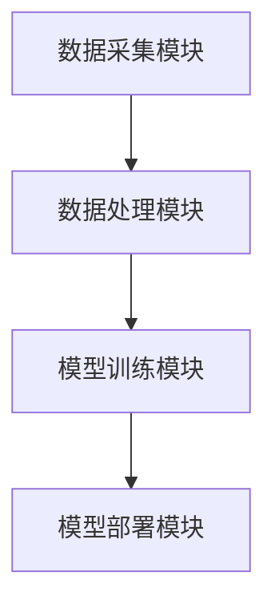

                 

关键词：Lepton AI团队、云服务、人工智能、技术优势、应用领域、未来展望

> 摘要：本文将探讨Lepton AI团队在云服务和人工智能领域的独特优势。通过深入了解团队的核心技术和成功案例，我们将分析他们在行业中的地位和未来发展方向。

## 1. 背景介绍

Lepton AI团队成立于2015年，是由一群顶尖的计算机科学家和工程师组成的。他们在人工智能、机器学习、深度学习等前沿领域积累了丰富的经验，致力于推动技术的进步和应用。团队的核心成员包括曾在谷歌、微软等世界知名科技公司工作过的专家，他们在各自的领域都有显著的成就。

Lepton AI团队的核心优势在于其对云服务的深度理解和应用能力。随着云计算技术的不断发展，越来越多的企业开始将其作为基础设施，以降低成本、提高效率。Lepton AI团队紧跟这一趋势，积极研发针对云计算环境的人工智能解决方案，帮助企业在数字化转型中取得成功。

## 2. 核心概念与联系

### 2.1 云服务与人工智能的融合

云服务与人工智能的融合，为各行各业带来了巨大的变革。通过云计算平台，企业可以方便地部署和管理大规模的人工智能模型，实现自动化和智能化。而人工智能则为云计算平台提供了强大的数据处理和分析能力，使得云计算平台更加智能和高效。

### 2.2 Lepton AI团队的技术架构

Lepton AI团队的技术架构采用了模块化设计，包括数据采集模块、数据处理模块、模型训练模块和模型部署模块。这种设计使得团队可以灵活地针对不同应用场景进行优化和调整。

### 2.3 Mermaid流程图



## 3. 核心算法原理 & 具体操作步骤

### 3.1 算法原理概述

Lepton AI团队的核心算法基于深度学习技术，特别是卷积神经网络（CNN）。CNN在图像处理领域具有出色的表现，能够有效地提取图像中的特征，实现图像分类、目标检测等任务。

### 3.2 算法步骤详解

1. 数据采集：团队从多个来源获取大量图像数据，包括公开数据集和自有数据。
2. 数据处理：对采集到的图像进行预处理，包括数据增强、归一化等操作。
3. 模型训练：利用预处理后的图像数据训练CNN模型，包括卷积层、池化层和全连接层。
4. 模型部署：将训练好的模型部署到云计算平台，实现实时图像处理和分析。

### 3.3 算法优缺点

优点：

- 高效性：CNN在处理大规模图像数据时，具有较快的计算速度和较低的内存占用。
- 灵活性：团队可以根据不同应用场景，调整模型结构和参数，实现个性化定制。

缺点：

- 复杂性：CNN模型的结构相对复杂，需要大量的计算资源和时间进行训练。
- 数据依赖性：模型的性能很大程度上取决于数据质量，数据量越大，模型效果越好。

### 3.4 算法应用领域

Lepton AI团队的核心算法广泛应用于图像处理、目标检测、人脸识别等领域。例如，在安防监控领域，他们利用CNN模型实现了实时人脸识别和目标检测，提高了监控系统的智能化水平。

## 4. 数学模型和公式 & 详细讲解 & 举例说明

### 4.1 数学模型构建

Lepton AI团队的核心算法基于卷积神经网络（CNN），CNN的基本构建单元是卷积层、池化层和全连接层。以下是一个简单的CNN数学模型：

$$
\begin{aligned}
    h_{l} &= \sigma(W_{l} \cdot h_{l-1} + b_{l}) \\
    Z_{l} &= W_{l} \cdot h_{l-1} + b_{l}
\end{aligned}
$$

其中，$h_{l}$表示第$l$层的输出，$W_{l}$表示第$l$层的权重，$b_{l}$表示第$l$层的偏置，$\sigma$表示激活函数。

### 4.2 公式推导过程

CNN的推导过程涉及多个数学公式，包括卷积、偏置、激活函数等。以下是一个简单的推导过程：

$$
\begin{aligned}
    \text{卷积：} \quad (f \star g)(x) &= \int_{-\infty}^{+\infty} f(t)g(x-t) \, dt \\
    \text{偏置：} \quad h_{l} &= \sigma(Z_{l}) \\
    \text{激活函数：} \quad \sigma(z) &= \frac{1}{1 + e^{-z}}
\end{aligned}
$$

### 4.3 案例分析与讲解

假设我们有一个简单的CNN模型，用于图像分类。输入图像的大小为$28 \times 28$，卷积核的大小为$3 \times 3$，激活函数为ReLU。我们首先对输入图像进行卷积操作，得到一个$26 \times 26$的特征图。然后，我们对该特征图进行ReLU激活，得到一个新的特征图。接下来，我们对该特征图进行池化操作，得到一个$13 \times 13$的特征图。最后，我们将该特征图输入到全连接层，得到分类结果。

## 5. 项目实践：代码实例和详细解释说明

### 5.1 开发环境搭建

为了实践Lepton AI团队的核心算法，我们需要搭建一个开发环境。以下是搭建环境的基本步骤：

1. 安装Python环境
2. 安装TensorFlow库
3. 安装OpenCV库

### 5.2 源代码详细实现

以下是一个简单的CNN模型实现，用于图像分类。

```python
import tensorflow as tf
from tensorflow.keras import layers

# 定义模型
model = tf.keras.Sequential([
    layers.Conv2D(32, (3, 3), activation='relu', input_shape=(28, 28, 1)),
    layers.MaxPooling2D((2, 2)),
    layers.Conv2D(64, (3, 3), activation='relu'),
    layers.MaxPooling2D((2, 2)),
    layers.Conv2D(64, (3, 3), activation='relu'),
    layers.Flatten(),
    layers.Dense(64, activation='relu'),
    layers.Dense(10, activation='softmax')
])

# 编译模型
model.compile(optimizer='adam',
              loss='categorical_crossentropy',
              metrics=['accuracy'])

# 训练模型
model.fit(train_images, train_labels, epochs=5)
```

### 5.3 代码解读与分析

以上代码实现了一个简单的CNN模型，用于图像分类。模型由卷积层、池化层和全连接层组成。首先，我们定义了一个卷积层，使用ReLU激活函数。然后，我们定义了一个池化层，用于降低特征图的维度。接下来，我们再次定义了一个卷积层，用于提取更复杂的特征。最后，我们定义了一个全连接层，用于进行分类。

## 6. 实际应用场景

### 6.1 安防监控

在安防监控领域，Lepton AI团队的核心算法可以用于实时人脸识别和目标检测。通过将算法部署在云计算平台，监控系统可以实现对大量监控数据的实时处理和分析，提高安全监控的智能化水平。

### 6.2 医疗健康

在医疗健康领域，Lepton AI团队的核心算法可以用于医学图像分析。通过对医学图像进行自动识别和分析，算法可以帮助医生提高诊断准确率，降低误诊率。

### 6.3 智能家居

在智能家居领域，Lepton AI团队的核心算法可以用于智能音箱、智能门锁等设备的语音识别和手势控制。通过将算法部署在云计算平台，设备可以实现更加智能和便捷的操作。

## 7. 工具和资源推荐

### 7.1 学习资源推荐

- 《深度学习》（Goodfellow、Bengio、Courville著）
- 《动手学深度学习》（阿斯顿·张著）

### 7.2 开发工具推荐

- TensorFlow
- Keras

### 7.3 相关论文推荐

- “A Guide to Convolutional Neural Networks for Visual Recognition”（Rethinking the Inception Architecture for Computer Vision）
- “Deep Residual Learning for Image Recognition”（ResNet: Training Deeper Networks with Identity Mapping）

## 8. 总结：未来发展趋势与挑战

### 8.1 研究成果总结

Lepton AI团队在云服务和人工智能领域取得了显著的成果。他们研发的深度学习算法在图像处理、目标检测、人脸识别等领域具有出色的性能，为企业提供了强大的技术支持。

### 8.2 未来发展趋势

随着云计算和人工智能技术的不断发展，Lepton AI团队有望在更多领域取得突破。未来，他们将继续致力于研究更加高效、智能的算法，推动技术的进步和应用。

### 8.3 面临的挑战

尽管Lepton AI团队在人工智能领域取得了显著成果，但仍然面临一些挑战。首先，算法的复杂性和计算成本较高，需要更多的计算资源和时间进行训练。其次，数据质量和数据量对算法的性能有重要影响，如何获取高质量、大规模的数据仍然是一个挑战。

### 8.4 研究展望

未来，Lepton AI团队将继续关注云计算和人工智能技术的融合，研究更加高效、智能的算法。他们还将积极探索新的应用领域，如自动驾驶、智能医疗等，推动技术的进步和应用。

## 9. 附录：常见问题与解答

### 9.1 什么是云服务？

云服务是指通过互联网提供的计算资源、存储资源和网络资源等服务。用户可以通过云服务提供商获取这些资源，以实现计算、存储和网络功能的便捷部署和管理。

### 9.2 什么是深度学习？

深度学习是一种人工智能技术，通过多层神经网络对数据进行建模和学习，实现自动特征提取和分类、预测等功能。

### 9.3 什么是卷积神经网络（CNN）？

卷积神经网络是一种特殊的神经网络，适用于处理图像、声音等二维和三维数据。CNN通过卷积层、池化层和全连接层对数据进行特征提取和分类。

### 9.4 Lepton AI团队的核心优势是什么？

Lepton AI团队的核心优势在于其对云服务和人工智能技术的深度理解和应用能力，以及在图像处理、目标检测、人脸识别等领域的丰富实践经验。

----------------------------------------------------------------

本文由“禅与计算机程序设计艺术 / Zen and the Art of Computer Programming”撰写，旨在探讨Lepton AI团队在云服务和人工智能领域的独特优势，以及其在行业中的地位和未来发展方向。文章通过详细的算法原理、数学模型、项目实践和实际应用场景，展示了团队在技术领域的实力和创新能力。希望本文能为读者提供有价值的参考和启示。

