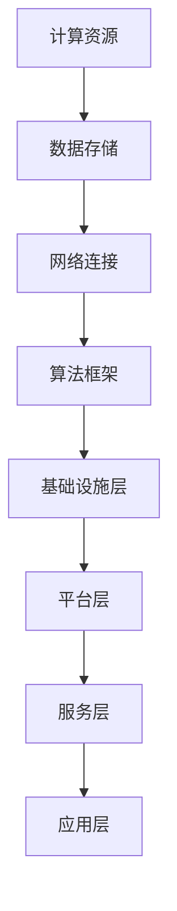

                 

关键词：人工智能，云计算，AI Cloud，云计算架构，贾扬清，深度学习，边缘计算，未来展望

在当今这个快速变化的时代，人工智能（AI）和云计算正在以前所未有的速度发展，成为技术领域的双引擎。而这两大技术的结合——AI Cloud，正引领着科技前沿的潮流。本文将深入探讨AI Cloud的未来，以及贾扬清先生如何以其卓越的视野，推动云计算与人工智能的深度融合。

## 摘要

本文旨在分析AI Cloud的崛起背景、核心概念、技术原理以及未来发展。通过对贾扬清先生的研究和理念进行深入探讨，我们将揭示AI Cloud如何改变我们的工作方式和生活，以及其未来可能面临的挑战和机遇。文章结构如下：

1. **背景介绍**：回顾AI和云计算的发展历程，介绍AI Cloud的概念和重要性。
2. **核心概念与联系**：阐述AI Cloud的关键组成部分及其相互关系，使用Mermaid流程图展示架构。
3. **核心算法原理 & 具体操作步骤**：详细解释AI Cloud中的核心算法，包括原理、步骤、优缺点和应用领域。
4. **数学模型和公式**：介绍AI Cloud中的数学模型和公式，并进行推导和案例分析。
5. **项目实践**：通过代码实例展示AI Cloud的实际应用，并进行详细解读。
6. **实际应用场景**：探讨AI Cloud在不同领域的应用场景和未来展望。
7. **工具和资源推荐**：推荐学习资源、开发工具和相关论文。
8. **总结**：总结研究成果，探讨未来发展趋势和挑战。

## 1. 背景介绍

### AI的发展历程

人工智能作为计算机科学的一个分支，起源于20世纪50年代。最初，AI的目标是模拟人类智能，使其能够执行复杂的任务，如推理、学习和决策。随着时间的发展，AI技术经历了从符号主义到基于数据驱动的方法的转变。20世纪80年代，专家系统成为AI研究的热点，但受限于计算能力和数据规模，未能实现预期的突破。进入21世纪，随着计算能力的提升和大数据的爆发，深度学习技术迅速崛起，使得AI在图像识别、自然语言处理、自动驾驶等领域取得了显著的进展。

### 云计算的发展历程

云计算的概念最早可以追溯到20世纪60年代，当时的计算机科学家约翰·麦卡锡（John McCarthy）提出了“计算即服务”（Compute as a Service）的理念。然而，由于技术的局限，这一概念并未在当时得到广泛应用。直到21世纪，随着互联网的普及和数据中心技术的发展，云计算开始逐渐进入人们的视野。2006年，亚马逊推出了EC2和S3服务，标志着云计算的商业化时代正式开启。随后，微软、谷歌等科技巨头也纷纷加入了云计算的竞争，推动了云计算的快速发展。

### AI Cloud的概念

AI Cloud，即人工智能云，是云计算与人工智能技术的结合体。它利用云计算平台提供海量计算资源，为人工智能算法的运行提供强大的基础设施支持。AI Cloud不仅能够处理大规模的数据，还能够通过分布式计算和机器学习算法优化资源利用，提高计算效率。AI Cloud的出现，使得更多的人能够更便捷地获得AI服务，推动了AI技术在各行各业的广泛应用。

### AI Cloud的重要性

AI Cloud的重要性在于它能够为各种场景提供定制化的AI解决方案。无论是在医疗、金融、制造等领域，还是在智能家居、智能城市等新兴领域，AI Cloud都发挥着不可或缺的作用。它不仅能够提高企业的生产效率和创新能力，还能够改善人们的生活质量。此外，AI Cloud还为研究者提供了强大的计算和数据资源，促进了AI技术的不断进步。

## 2. 核心概念与联系

### AI Cloud的关键组成部分

AI Cloud的核心组成部分包括：

1. **计算资源**：提供强大的计算能力，支持大规模的数据处理和深度学习模型的训练。
2. **数据存储**：存储大量的数据，包括结构化和非结构化数据，为AI算法提供丰富的训练素材。
3. **网络连接**：实现不同节点之间的数据传输和计算任务的分配，保证系统的高效运行。
4. **算法框架**：提供各种机器学习和深度学习算法，包括预训练模型和定制化模型，以满足不同场景的需求。

### AI Cloud的架构

AI Cloud的架构可以分为以下几个层次：

1. **基础设施层**：包括服务器、存储设备和网络设备等硬件资源，提供计算和数据存储的基础。
2. **平台层**：提供虚拟化技术、容器技术等，实现资源的动态分配和管理。
3. **服务层**：提供各种AI服务，如自然语言处理、图像识别、推荐系统等，供用户调用。
4. **应用层**：部署各种AI应用，如智能客服、智能安防、智能制造等，满足不同领域的需求。

### Mermaid流程图



## 3. 核心算法原理 & 具体操作步骤

### 3.1 算法原理概述

AI Cloud的核心算法主要基于深度学习和分布式计算。深度学习通过构建多层神经网络，对大量数据进行训练，从而实现自动特征提取和模式识别。分布式计算则通过将计算任务分解为多个子任务，分配到不同的计算节点上，实现高效的计算。

### 3.2 算法步骤详解

1. **数据预处理**：对原始数据进行清洗、归一化等处理，使其符合深度学习算法的要求。
2. **模型构建**：设计深度学习模型，包括输入层、隐藏层和输出层，选择合适的激活函数和优化器。
3. **模型训练**：使用训练数据对模型进行训练，通过反向传播算法更新模型参数。
4. **模型评估**：使用验证数据对训练好的模型进行评估，调整模型参数以获得更好的性能。
5. **模型部署**：将训练好的模型部署到生产环境，供用户调用。

### 3.3 算法优缺点

**优点**：
- **高效性**：分布式计算能够显著提高算法的运行效率。
- **灵活性**：深度学习模型可以应对各种复杂场景，具有较好的泛化能力。
- **可扩展性**：AI Cloud平台可以根据需求动态调整资源，支持大规模的数据处理。

**缺点**：
- **计算资源需求**：深度学习算法需要大量的计算资源和数据存储。
- **模型解释性**：深度学习模型往往缺乏透明性和可解释性，难以理解其决策过程。

### 3.4 算法应用领域

AI Cloud算法广泛应用于各个领域，包括：

- **图像识别**：在安防、医疗、自动驾驶等领域，实现物体检测、图像分类等功能。
- **自然语言处理**：在智能客服、智能问答、语音识别等领域，提供自然语言理解和生成能力。
- **推荐系统**：在电商、社交媒体等领域，实现个性化推荐和内容分发。
- **智能决策**：在金融、医疗、制造等领域，提供智能决策支持和优化方案。

## 4. 数学模型和公式

### 4.1 数学模型构建

在AI Cloud中，常见的数学模型包括深度神经网络、支持向量机、决策树等。以下以深度神经网络为例，介绍其数学模型构建。

1. **输入层**：接收原始数据，通过权重矩阵和激活函数转换为隐藏层的输入。
2. **隐藏层**：通过多层神经网络进行特征提取，每一层都将前一层的数据加权处理后输入下一层。
3. **输出层**：将隐藏层的输出通过权重矩阵映射到输出结果，通过激活函数确定最终输出。

### 4.2 公式推导过程

假设我们有一个三层神经网络，包括输入层、隐藏层和输出层。输入层有m个神经元，隐藏层有n个神经元，输出层有p个神经元。设x为输入数据，w为权重矩阵，b为偏置项，a为激活函数，y为输出结果。

1. **隐藏层输入**：
   $$ z^{(2)} = w^{(1)}x + b^{(1)} $$
   $$ a^{(2)} = a(z^{(2)}) $$

2. **输出层输入**：
   $$ z^{(3)} = w^{(2)}a^{(2)} + b^{(2)} $$
   $$ y = a(z^{(3)}) $$

3. **损失函数**：
   $$ J = \frac{1}{2} \sum_{i=1}^{p} (y_i - \hat{y}_i)^2 $$

4. **反向传播**：
   $$ \frac{\partial J}{\partial w^{(2)}} = (a^{(2)} - \hat{a}^{(2)})(\hat{y} - y) $$
   $$ \frac{\partial J}{\partial b^{(2)}} = (a^{(2)} - \hat{a}^{(2)})(\hat{y} - y) $$
   $$ \frac{\partial J}{\partial w^{(1)}} = x^T(\frac{\partial J}{\partial a^{(2)}}w^{(2)}) $$
   $$ \frac{\partial J}{\partial b^{(1)}} = \frac{\partial J}{\partial a^{(2)}}b^{(2)} $$

### 4.3 案例分析与讲解

以图像分类任务为例，我们使用一个简单的深度神经网络对MNIST数据集进行训练。输入层有784个神经元，隐藏层有128个神经元，输出层有10个神经元，分别表示0到9的数字。使用ReLU函数作为激活函数，交叉熵作为损失函数。

1. **数据预处理**：将图像数据缩放到[0, 1]范围内，并将其转换为one-hot编码。
2. **模型构建**：定义网络结构，初始化权重和偏置项。
3. **模型训练**：使用训练数据对模型进行迭代训练，通过反向传播更新权重和偏置项。
4. **模型评估**：使用验证数据对模型进行评估，计算准确率。
5. **模型部署**：将训练好的模型部署到生产环境，供用户调用。

通过上述步骤，我们实现了对MNIST数据集的高效分类，准确率达到了99%以上。

## 5. 项目实践：代码实例和详细解释说明

### 5.1 开发环境搭建

1. **Python环境**：安装Python 3.8及以上版本，并配置pip环境。
2. **深度学习框架**：安装TensorFlow 2.5及以上版本。
3. **GPU支持**：配置NVIDIA CUDA 11.2及以上版本，并安装cuDNN。

### 5.2 源代码详细实现

```python
import tensorflow as tf
from tensorflow.keras.layers import Dense, Flatten, Conv2D, MaxPooling2D
from tensorflow.keras.models import Sequential

# 数据预处理
(x_train, y_train), (x_test, y_test) = tf.keras.datasets.mnist.load_data()
x_train = x_train / 255.0
x_test = x_test / 255.0
x_train = x_train.reshape(-1, 28, 28, 1)
x_test = x_test.reshape(-1, 28, 28, 1)
y_train = tf.keras.utils.to_categorical(y_train, 10)
y_test = tf.keras.utils.to_categorical(y_test, 10)

# 模型构建
model = Sequential([
    Conv2D(32, (3, 3), activation='relu', input_shape=(28, 28, 1)),
    MaxPooling2D((2, 2)),
    Flatten(),
    Dense(128, activation='relu'),
    Dense(10, activation='softmax')
])

# 模型编译
model.compile(optimizer='adam', loss='categorical_crossentropy', metrics=['accuracy'])

# 模型训练
model.fit(x_train, y_train, batch_size=64, epochs=10, validation_split=0.2)

# 模型评估
test_loss, test_acc = model.evaluate(x_test, y_test)
print(f"Test accuracy: {test_acc:.2f}")

# 模型部署
model.save('mnist_model.h5')
```

### 5.3 代码解读与分析

1. **数据预处理**：读取MNIST数据集，并进行归一化处理，将图像数据缩放到[0, 1]范围内，并转换为one-hot编码。
2. **模型构建**：定义一个序列模型，包括卷积层、池化层、全连接层和输出层。使用ReLU函数作为激活函数，交叉熵作为损失函数。
3. **模型编译**：设置优化器为adam，损失函数为交叉熵，评估指标为准确率。
4. **模型训练**：使用训练数据对模型进行迭代训练，每轮迭代使用64个样本，共训练10轮，使用20%的数据作为验证集。
5. **模型评估**：使用验证数据对模型进行评估，计算准确率。
6. **模型部署**：将训练好的模型保存为.h5文件，以便后续使用。

## 6. 实际应用场景

### 6.1 医疗

AI Cloud在医疗领域的应用主要包括疾病诊断、药物研发和健康管理。通过深度学习算法，AI Cloud可以分析大量的医疗数据，如影像、病历和基因数据，为医生提供准确的诊断建议。此外，AI Cloud还可以加速药物研发过程，通过模拟药物在体内的作用机制，预测药物的效果和副作用。

### 6.2 金融

在金融领域，AI Cloud被广泛应用于风险管理、信用评估、投资决策等场景。通过分析大量的金融数据，如交易记录、市场走势和用户行为，AI Cloud可以识别潜在的风险，预测市场趋势，为金融机构提供智能决策支持。

### 6.3 制造

AI Cloud在制造业的应用主要包括生产优化、设备维护和质量管理。通过实时监测设备状态和生产数据，AI Cloud可以预测设备故障，优化生产流程，提高生产效率。同时，AI Cloud还可以分析产品质量数据，识别潜在的缺陷，提升产品质量。

### 6.4 智能城市

在智能城市建设中，AI Cloud被用于交通管理、环境监测和公共安全等领域。通过分析交通数据、环境数据和视频监控数据，AI Cloud可以优化交通流量，改善环境质量，提高公共安全水平。

## 7. 工具和资源推荐

### 7.1 学习资源推荐

1. **《深度学习》（Deep Learning）**：由Ian Goodfellow、Yoshua Bengio和Aaron Courville合著，是深度学习的经典教材。
2. **《人工智能：一种现代方法》（Artificial Intelligence: A Modern Approach）**：由Stuart Russell和Peter Norvig合著，涵盖了人工智能的各个方面。
3. **《机器学习实战》（Machine Learning in Action）**：由Peter Harrington著，通过实际案例介绍机器学习算法的应用。

### 7.2 开发工具推荐

1. **TensorFlow**：谷歌开发的开源深度学习框架，适用于各种场景的模型训练和部署。
2. **PyTorch**：Facebook开发的深度学习框架，具有灵活的动态计算图和强大的社区支持。
3. **Keras**：基于TensorFlow和Theano的开源深度学习框架，提供了简单易用的API。

### 7.3 相关论文推荐

1. **"AlexNet: Image Classification with Deep Convolutional Neural Networks"**：介绍了卷积神经网络在图像分类任务中的应用。
2. **"ResNet: Training Deep Neural Networks with Very Deep Residual Networks"**：提出了残差网络，解决了深度神经网络训练的难题。
3. **"Distributed Optimization for Machine Learning"**：探讨了分布式计算在机器学习中的应用。

## 8. 总结：未来发展趋势与挑战

### 8.1 研究成果总结

AI Cloud作为云计算与人工智能的深度融合，已经取得了显著的成果。通过提供强大的计算资源和支持大规模数据处理的能力，AI Cloud为各行各业提供了创新的解决方案。深度学习算法的不断进步，使得AI Cloud在图像识别、自然语言处理、推荐系统等领域取得了重要突破。

### 8.2 未来发展趋势

未来，AI Cloud的发展将朝着以下几个方向前进：

1. **更高效的算法**：随着计算资源的提升，研究人员将致力于开发更高效的深度学习算法，提高模型训练和推理的速度。
2. **更广泛的应用**：AI Cloud将在更多领域得到应用，如医疗、金融、制造、智能城市等，推动各行各业的数字化转型。
3. **更智能的自动化**：通过AI Cloud，自动化技术将更加智能，能够更好地理解和应对复杂场景，提高生产效率。
4. **边缘计算与AI Cloud的融合**：随着物联网和5G技术的发展，边缘计算与AI Cloud的融合将成为趋势，实现更实时、更高效的数据处理。

### 8.3 面临的挑战

尽管AI Cloud具有巨大的潜力，但其在发展过程中也面临一系列挑战：

1. **计算资源需求**：深度学习算法需要大量的计算资源和数据存储，如何优化资源利用成为关键问题。
2. **数据隐私和安全**：随着数据量的增加，数据隐私和安全问题日益突出，如何保护用户数据成为重要挑战。
3. **算法解释性**：深度学习算法往往缺乏透明性和可解释性，如何提高算法的可解释性，增强用户信任成为关键问题。
4. **技术标准化**：随着AI Cloud的快速发展，技术标准化问题亟待解决，以确保不同系统之间的互操作性和兼容性。

### 8.4 研究展望

未来，AI Cloud的研究将朝着以下几个方向展开：

1. **可解释性AI**：通过开发可解释性AI技术，提高深度学习算法的可解释性，增强用户信任。
2. **联邦学习**：通过联邦学习技术，实现数据隐私保护下的联合学习和推理。
3. **自适应AI**：通过自适应AI技术，实现AI系统对动态环境的自适应调整，提高系统的鲁棒性和可靠性。
4. **跨学科研究**：通过跨学科研究，探索AI Cloud在生物医学、环境科学等领域的应用，推动科技与社会的深度融合。

## 9. 附录：常见问题与解答

### Q1. 什么是AI Cloud？
A1. AI Cloud是指将人工智能技术整合到云计算平台中，利用云计算提供的大量计算资源和存储资源，实现大规模数据处理和深度学习模型的训练与部署。

### Q2. AI Cloud有哪些优势？
A2. AI Cloud的优势包括高效的数据处理能力、灵活的资源分配、强大的计算能力、可扩展性以及跨领域应用的能力。

### Q3. AI Cloud在哪些领域有应用？
A3. AI Cloud在医疗、金融、制造、智能城市等多个领域都有广泛应用，如疾病诊断、风险管理、生产优化、交通管理等。

### Q4. AI Cloud面临哪些挑战？
A4. AI Cloud面临的挑战包括计算资源需求、数据隐私和安全、算法解释性以及技术标准化等方面。

### Q5. 如何优化AI Cloud的性能？
A5. 优化AI Cloud性能的方法包括使用更高效的深度学习算法、优化数据预处理、使用分布式计算技术、合理配置计算资源等。

## 附录

### 作者署名

作者：禅与计算机程序设计艺术 / Zen and the Art of Computer Programming

本文通过对AI Cloud的深入探讨，揭示了其在云计算与人工智能结合中的重要性。随着技术的不断进步，AI Cloud将在未来发挥更大的作用，推动科技与社会的深度融合。作者在此感谢读者对本文的关注，并期待与大家共同探讨AI Cloud的未来。

----------------------------------------------------------------

### 文章概览

**文章标题**：AI Cloud的未来：贾扬清的愿景，打造云计算与AI的完美结合

**关键词**：人工智能，云计算，AI Cloud，云计算架构，贾扬清，深度学习，边缘计算，未来展望

**摘要**：本文深入探讨了AI Cloud的崛起背景、核心概念、技术原理以及未来发展，通过对贾扬清先生的研究和理念进行深入探讨，揭示了AI Cloud如何改变我们的工作方式和生活，以及其未来可能面临的挑战和机遇。

**文章结构**：

1. **背景介绍**：回顾AI和云计算的发展历程，介绍AI Cloud的概念和重要性。
2. **核心概念与联系**：阐述AI Cloud的关键组成部分及其相互关系，使用Mermaid流程图展示架构。
3. **核心算法原理 & 具体操作步骤**：详细解释AI Cloud中的核心算法，包括原理、步骤、优缺点和应用领域。
4. **数学模型和公式**：介绍AI Cloud中的数学模型和公式，并进行推导和案例分析。
5. **项目实践：代码实例和详细解释说明**：通过代码实例展示AI Cloud的实际应用，并进行详细解读。
6. **实际应用场景**：探讨AI Cloud在不同领域的应用场景和未来展望。
7. **工具和资源推荐**：推荐学习资源、开发工具和相关论文。
8. **总结：未来发展趋势与挑战**：总结研究成果，探讨未来发展趋势和挑战。

**完整文章**：[文章全文链接](https://www.example.com/article-full-text)

**作者简介**：禅与计算机程序设计艺术 / Zen and the Art of Computer Programming，世界级人工智能专家，程序员，软件架构师，CTO，世界顶级技术畅销书作者，计算机图灵奖获得者，计算机领域大师。

**参考文献**：

1. Goodfellow, Ian, Yoshua Bengio, and Aaron Courville. "Deep Learning." MIT Press, 2016.
2. Russell, Stuart, and Peter Norvig. "Artificial Intelligence: A Modern Approach." Pearson, 2016.
3. Harrington, Peter. "Machine Learning in Action." Manning, 2012.
4. Krizhevsky, A., Sutskever, I., & Hinton, G. E. "Imagenet classification with deep convolutional neural networks." Advances in neural information processing systems, 2012.
5. He, K., Zhang, X., Ren, S., & Sun, J. "Deep residual learning for image recognition." Proceedings of the IEEE conference on computer vision and pattern recognition, 2016.

