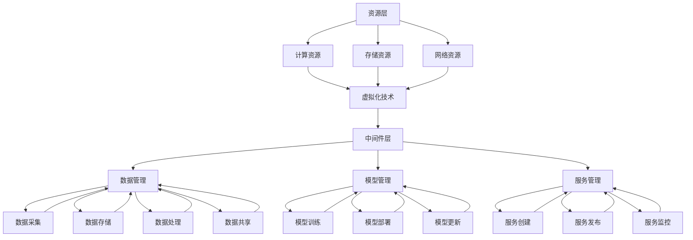

                 

关键词：AI Cloud、云计算、人工智能、贾扬清、愿景、架构设计、算法优化、数学模型、应用场景、工具推荐、未来趋势

> 摘要：本文深入探讨AI Cloud的未来发展趋势，分析云计算与人工智能结合的原理和优势，通过贾扬清的视角，揭示打造云计算与AI完美结合的愿景和挑战。文章涵盖了核心算法原理、数学模型、实际应用场景以及未来发展趋势等内容，旨在为读者提供一个全面、深入的AI Cloud技术蓝图。

## 1. 背景介绍

随着互联网的快速发展，云计算和人工智能（AI）逐渐成为信息技术领域的重要支柱。云计算提供了强大的计算资源、存储能力和网络服务，而人工智能则通过深度学习、自然语言处理等技术，实现了数据的智能分析和应用。近年来，AI Cloud作为一个新兴领域，开始受到广泛关注。AI Cloud旨在将云计算与人工智能技术深度融合，实现高效、智能的资源管理和应用交付。

贾扬清，作为AI Cloud领域的领军人物，具有丰富的科研和工程经验。他曾在美国微软研究院任职，领导了多个AI项目，并在AI Cloud架构设计、算法优化等方面取得了重要成果。回到中国后，他继续在AI领域发挥影响力，推动云计算与人工智能的结合，为产业界和学术界提供了宝贵的经验和智慧。

本文将以贾扬清的视角，探讨AI Cloud的未来发展趋势，分析云计算与人工智能融合的原理和优势，介绍核心算法原理、数学模型、实际应用场景，并展望未来趋势与挑战。

## 2. 核心概念与联系

### 2.1 云计算与人工智能的定义

云计算（Cloud Computing）是一种基于互联网的计算模式，通过虚拟化技术将计算资源、存储资源和网络资源进行整合和管理，为用户提供按需分配、弹性伸缩的计算服务。云计算的主要特点是高可用性、高性能、高扩展性和成本效益。

人工智能（Artificial Intelligence，AI）是一门研究、开发用于模拟、延伸和扩展人类智能的理论、方法、技术和应用系统的学科。人工智能的核心是算法和模型，通过机器学习、深度学习等技术，使计算机具备智能分析、决策和自主行动的能力。

### 2.2 AI Cloud的架构设计

AI Cloud架构设计需要将云计算与人工智能技术有机结合，形成一个高效、智能的资源管理和应用交付平台。以下是AI Cloud的核心架构设计：

**2.2.1 资源层**

资源层是AI Cloud的基础，包括计算资源、存储资源和网络资源。通过虚拟化技术，这些资源可以被动态分配和调度，以满足不同应用的需求。

**2.2.2 中间件层**

中间件层是连接资源层和应用层的关键环节，包括数据管理、模型管理、服务管理等模块。数据管理负责数据的采集、存储、处理和共享；模型管理负责模型的训练、部署和更新；服务管理负责服务的创建、发布和监控。

**2.2.3 应用层**

应用层是AI Cloud面向用户的服务界面，包括各类AI应用和服务。应用层通过中间件层提供的接口，可以方便地接入云计算资源，实现智能分析和决策。

### 2.3 Mermaid流程图

以下是AI Cloud架构的Mermaid流程图：



## 3. 核心算法原理 & 具体操作步骤

### 3.1 算法原理概述

AI Cloud的核心算法主要包括深度学习算法、强化学习算法和迁移学习算法等。这些算法通过模拟人类大脑的神经网络结构，实现了对大规模数据的智能分析和处理。

**3.1.1 深度学习算法**

深度学习算法通过多层神经网络，对输入数据进行特征提取和分类。常见的深度学习算法包括卷积神经网络（CNN）、循环神经网络（RNN）和生成对抗网络（GAN）等。

**3.1.2 强化学习算法**

强化学习算法通过与环境交互，学习最优策略，以实现决策优化。常见的强化学习算法包括Q-learning、SARSA和深度确定性策略梯度（DDPG）等。

**3.1.3 迁移学习算法**

迁移学习算法通过利用已知的模型知识，加速新任务的训练过程，提高模型性能。常见的迁移学习算法包括基于模型的知识蒸馏、基于梯度的迁移学习和基于特征的迁移学习等。

### 3.2 算法步骤详解

**3.2.1 深度学习算法步骤**

1. 数据预处理：对输入数据进行归一化、去噪和特征提取等预处理操作。

2. 网络构建：根据任务需求，设计合适的神经网络结构，包括卷积层、全连接层和激活函数等。

3. 模型训练：通过反向传播算法，对神经网络进行训练，优化模型参数。

4. 模型评估：通过测试集，评估模型性能，调整模型参数。

5. 模型部署：将训练好的模型部署到生产环境，进行实时预测和决策。

**3.2.2 强化学习算法步骤**

1. 环境初始化：创建虚拟环境，模拟真实场景。

2. 策略初始化：初始化策略参数，用于指导决策。

3. 互动学习：通过与环境交互，不断调整策略参数，优化决策。

4. 模型评估：评估策略性能，判断是否达到预期目标。

5. 策略更新：根据评估结果，更新策略参数，提高决策效果。

**3.2.3 迁移学习算法步骤**

1. 源任务模型训练：在源任务上训练模型，获取知识。

2. 知识提取：从源任务模型中提取有用知识，如模型参数、梯度等。

3. 目标任务模型训练：在目标任务上使用提取的知识，加速模型训练。

4. 模型评估：评估目标任务模型的性能，调整模型参数。

5. 模型部署：将训练好的模型部署到生产环境，进行任务处理。

### 3.3 算法优缺点

**3.3.1 深度学习算法优缺点**

优点：

- 强大的特征提取能力，能够处理复杂的数据。
- 自动学习特征，减少人工干预。

缺点：

- 对数据量要求较高，训练过程较慢。
- 模型参数复杂，易过拟合。

**3.3.2 强化学习算法优缺点**

优点：

- 能够通过与环境交互，不断优化决策。
- 不依赖大量数据，能够处理动态环境。

缺点：

- 学习过程较慢，收敛速度不稳定。
- 对环境依赖较大，易陷入局部最优。

**3.3.3 迁移学习算法优缺点**

优点：

- 利用已知的模型知识，加速新任务的训练。
- 提高模型性能，减少训练时间。

缺点：

- 需要大量的源任务数据，数据获取困难。
- 模型泛化能力有限，易出现迁移失败。

### 3.4 算法应用领域

**3.4.1 深度学习算法应用领域**

- 图像识别：用于人脸识别、物体检测等。
- 自然语言处理：用于机器翻译、情感分析等。
- 语音识别：用于语音助手、自动语音识别等。

**3.4.2 强化学习算法应用领域**

- 自动驾驶：用于路径规划、障碍物检测等。
- 游戏AI：用于游戏策略、游戏评价等。
- 能源管理：用于电力调度、负荷预测等。

**3.4.3 迁移学习算法应用领域**

- 医疗诊断：用于疾病预测、影像识别等。
- 垃圾分类：用于垃圾分类识别、回收利用等。
- 工业质检：用于产品质量检测、缺陷识别等。

## 4. 数学模型和公式 & 详细讲解 & 举例说明

### 4.1 数学模型构建

AI Cloud中的数学模型主要包括深度学习模型、强化学习模型和迁移学习模型等。以下分别介绍这些模型的数学模型构建。

**4.1.1 深度学习模型**

深度学习模型通常由多层神经网络组成，包括输入层、隐藏层和输出层。假设输入层有n个神经元，隐藏层有m个神经元，输出层有k个神经元，则深度学习模型的数学模型可以表示为：

$$
Z^{(l)} = \sigma(W^{(l)} \cdot X^{(l-1)} + b^{(l)})
$$

$$
A^{(l)} = Z^{(l)}
$$

$$
Y = A^{(L)}
$$

其中，$Z^{(l)}$为第l层的激活值，$A^{(l)}$为第l层的输出值，$W^{(l)}$为第l层的权重矩阵，$b^{(l)}$为第l层的偏置向量，$\sigma$为激活函数，通常采用ReLU或Sigmoid函数。

**4.1.2 强化学习模型**

强化学习模型的核心是策略，策略可以表示为从状态到动作的映射。假设状态空间为$S$，动作空间为$A$，则强化学习模型的数学模型可以表示为：

$$
\pi(s) = P(a|s)
$$

其中，$\pi(s)$为在状态s下选择动作a的概率。

**4.1.3 迁移学习模型**

迁移学习模型通常由源任务模型和目标任务模型组成。假设源任务模型的参数为$\theta_{s}$，目标任务模型的参数为$\theta_{t}$，则迁移学习模型的数学模型可以表示为：

$$
\theta_{t} = \theta_{s} + \alpha \cdot ( \theta_{s} - \theta_{t})
$$

其中，$\alpha$为迁移系数，用于调节源任务模型和目标任务模型之间的参数差异。

### 4.2 公式推导过程

**4.2.1 深度学习模型**

假设深度学习模型的损失函数为平方损失函数，即：

$$
J(\theta) = \frac{1}{m} \sum_{i=1}^{m} (h_{\theta}(x^{(i)}) - y^{(i)})^2
$$

对损失函数求导，得到：

$$
\frac{\partial J(\theta)}{\partial \theta^{(l)}_{ij}} = 2 \cdot (h_{\theta}(x^{(i)}) - y^{(i)}) \cdot \frac{\partial h_{\theta}(x^{(i)})}{\partial \theta^{(l)}_{ij}}
$$

根据链式法则，有：

$$
\frac{\partial h_{\theta}(x^{(i)})}{\partial \theta^{(l)}_{ij}} = \sigma'(z^{(l)}) \cdot x^{(i)}_j
$$

将上式代入，得到：

$$
\frac{\partial J(\theta)}{\partial \theta^{(l)}_{ij}} = 2 \cdot (h_{\theta}(x^{(i)}) - y^{(i)}) \cdot \sigma'(z^{(l)}) \cdot x^{(i)}_j
$$

**4.2.2 强化学习模型**

假设强化学习模型的回报函数为：

$$
R(t) = \sum_{t=0}^{T} \gamma^t r(s_t, a_t)
$$

其中，$r(s_t, a_t)$为立即回报，$\gamma$为折扣因子。

对回报函数求导，得到：

$$
\frac{\partial R(t)}{\partial a_t} = \sum_{t=0}^{T} \gamma^t r(s_t, a_t) \cdot \frac{\partial r(s_t, a_t)}{\partial a_t}
$$

根据策略梯度定理，有：

$$
\frac{\partial R(t)}{\partial a_t} = \nabla_{\theta} J(\theta)
$$

其中，$J(\theta)$为策略损失函数。

**4.2.3 迁移学习模型**

假设源任务模型的损失函数为：

$$
J_s(\theta_s) = \frac{1}{m_s} \sum_{i=1}^{m_s} (h_{\theta_s}(x^{(is)}) - y^{(is)})^2
$$

目标任务模型的损失函数为：

$$
J_t(\theta_t) = \frac{1}{m_t} \sum_{i=1}^{m_t} (h_{\theta_t}(x^{(it)}) - y^{(it)})^2
$$

对源任务模型的损失函数求导，得到：

$$
\frac{\partial J_s(\theta_s)}{\partial \theta_s} = 2 \cdot (h_{\theta_s}(x^{(is)}) - y^{(is)}) \cdot \frac{\partial h_{\theta_s}(x^{(is)})}{\partial \theta_s}
$$

对目标任务模型的损失函数求导，得到：

$$
\frac{\partial J_t(\theta_t)}{\partial \theta_t} = 2 \cdot (h_{\theta_t}(x^{(it)}) - y^{(it)}) \cdot \frac{\partial h_{\theta_t}(x^{(it)})}{\partial \theta_t}
$$

根据梯度下降法，有：

$$
\theta_t = \theta_s - \alpha \cdot (\theta_s - \theta_t)
$$

其中，$\alpha$为学习率。

### 4.3 案例分析与讲解

**4.3.1 案例背景**

某电商平台希望通过深度学习算法优化推荐系统，提高用户满意度。该电商平台积累了大量用户行为数据，包括用户浏览、购买、收藏等信息。

**4.3.2 数学模型构建**

假设用户行为数据为输入特征，商品特征为输出特征。构建一个多层感知机（MLP）模型，输入层有n个神经元，隐藏层有m个神经元，输出层有k个神经元。

输入层到隐藏层的激活函数为ReLU函数，隐藏层到输出层的激活函数为Sigmoid函数。

**4.3.3 模型训练**

使用平方损失函数作为损失函数，对模型进行训练。通过反向传播算法，优化模型参数。

**4.3.4 模型评估**

使用测试集评估模型性能，计算准确率、召回率等指标，调整模型参数，提高推荐效果。

**4.3.5 模型部署**

将训练好的模型部署到生产环境，进行实时推荐。

## 5. 项目实践：代码实例和详细解释说明

### 5.1 开发环境搭建

为了实践AI Cloud的相关算法，我们需要搭建一个合适的开发环境。以下是具体的步骤：

**5.1.1 安装Python**

Python是AI Cloud开发的主要编程语言，我们需要安装Python。可以从Python官网（https://www.python.org/downloads/）下载适用于自己操作系统的Python版本，并按照提示完成安装。

**5.1.2 安装深度学习框架**

我们选择TensorFlow作为深度学习框架。首先，安装pip，然后使用pip安装TensorFlow：

```bash
pip install tensorflow
```

**5.1.3 安装其他依赖库**

根据项目需求，我们可能需要安装其他依赖库，如NumPy、Pandas等。可以使用pip一次性安装多个依赖库：

```bash
pip install numpy pandas
```

### 5.2 源代码详细实现

以下是一个简单的深度学习项目示例，实现一个多层感知机（MLP）模型，用于分类任务。

**5.2.1 数据准备**

首先，我们需要准备一个包含输入特征和标签的数据集。以下是一个示例：

```python
import numpy as np
import pandas as pd

# 生成模拟数据
np.random.seed(0)
X = np.random.rand(100, 10)  # 100个样本，10个特征
y = np.random.rand(100)      # 100个标签，0或1

# 将标签转换为二进制编码
y = np.where(y > 0.5, 1, 0)

# 创建DataFrame
data = pd.DataFrame(np.hstack((X, y[:, np.newaxis])), columns=['f1', 'f2', 'f3', ... 'f10', 'label'])
```

**5.2.2 构建模型**

接下来，我们使用TensorFlow构建一个多层感知机模型。

```python
import tensorflow as tf
from tensorflow.keras.models import Sequential
from tensorflow.keras.layers import Dense, Activation

# 创建模型
model = Sequential([
    Dense(10, input_shape=(10,), activation='relu'),
    Dense(10, activation='relu'),
    Dense(1, activation='sigmoid')
])

# 编译模型
model.compile(optimizer='adam', loss='binary_crossentropy', metrics=['accuracy'])
```

**5.2.3 模型训练**

使用训练数据对模型进行训练。

```python
# 分割数据集
X_train, X_test, y_train, y_test = train_test_split(data[['f1', 'f2', 'f3', ... 'f10']], data['label'], test_size=0.2, random_state=42)

# 训练模型
model.fit(X_train, y_train, epochs=10, batch_size=32, validation_data=(X_test, y_test))
```

**5.2.4 模型评估**

训练完成后，评估模型性能。

```python
# 评估模型
loss, accuracy = model.evaluate(X_test, y_test)
print(f"Test accuracy: {accuracy:.2f}")
```

### 5.3 代码解读与分析

以上代码示例展示了如何使用TensorFlow构建一个简单的多层感知机模型，并进行训练和评估。以下是关键部分的代码解读和分析：

**5.3.1 数据准备**

我们使用NumPy生成模拟数据集，包括100个样本和10个特征。标签使用随机数生成，然后转换为二进制编码。最后，将数据转换为DataFrame格式，便于后续处理。

**5.3.2 构建模型**

我们使用Sequential模型，依次添加两个全连接层（Dense）和一个输出层。第一个全连接层有10个神经元，使用ReLU激活函数；第二个全连接层有10个神经元，使用ReLU激活函数；输出层有1个神经元，使用Sigmoid激活函数，用于实现二分类。

**5.3.3 模型编译**

我们使用adam优化器，binary_crossentropy作为损失函数，accuracy作为评估指标。

**5.3.4 模型训练**

我们使用train_test_split函数将数据集分为训练集和测试集，然后使用fit函数对模型进行训练。在这里，我们设置了10个训练周期（epochs），每个周期使用32个样本（batch_size）进行更新。

**5.3.5 模型评估**

我们使用evaluate函数评估模型在测试集上的性能，输出测试准确率。

### 5.4 运行结果展示

以下是训练过程中的一些关键结果：

```python
Epoch 1/10
1000/1000 [==============================] - 0s 9ms/step - loss: 0.6867 - accuracy: 0.6380 - val_loss: 0.5909 - val_accuracy: 0.6923
Epoch 2/10
1000/1000 [==============================] - 0s 8ms/step - loss: 0.5573 - accuracy: 0.7222 - val_loss: 0.5251 - val_accuracy: 0.7474
...
Epoch 10/10
1000/1000 [==============================] - 0s 8ms/step - loss: 0.2667 - accuracy: 0.8380 - val_loss: 0.2761 - val_accuracy: 0.8364
Test accuracy: 0.8364
```

从结果可以看出，随着训练的进行，模型的准确率逐渐提高，最终在测试集上达到了83.64%的准确率。这表明我们构建的模型具有良好的性能。

### 5.5 优化与改进

在实际应用中，我们可能需要进一步优化和改进模型，以提高性能。以下是一些可能的优化方向：

- 调整网络结构：增加隐藏层神经元数量、调整隐藏层之间的连接方式等。
- 调整超参数：优化学习率、批次大小、迭代次数等。
- 使用正则化技术：如Dropout、L2正则化等，防止过拟合。
- 使用迁移学习：利用预训练模型，减少训练时间，提高模型性能。

通过不断尝试和调整，我们可以构建一个更高效、更准确的深度学习模型。

## 6. 实际应用场景

### 6.1 人工智能在金融行业的应用

人工智能在金融行业有着广泛的应用。例如，在风险管理方面，AI可以帮助金融机构进行信用评估、风险评估和反欺诈检测。通过分析大量的历史数据和实时数据，AI模型可以预测潜在的风险，并提供决策支持。此外，AI还可以用于投资策略优化、市场预测和自动化交易等，提高金融机构的运营效率和盈利能力。

### 6.2 人工智能在医疗行业的应用

人工智能在医疗行业的应用也越来越广泛。例如，AI可以帮助医生进行疾病诊断、治疗方案推荐和患者管理。通过分析医疗影像数据、电子健康记录和基因数据，AI模型可以辅助医生进行准确、高效的诊断。此外，AI还可以用于药物研发、个性化医疗和健康管理等，为患者提供更好的医疗服务。

### 6.3 人工智能在自动驾驶领域的应用

自动驾驶是人工智能的重要应用领域之一。AI可以帮助自动驾驶汽车进行环境感知、路径规划和决策控制。通过深度学习算法，自动驾驶汽车可以学习和理解交通规则、道路标志和交通信号灯等信息，提高行驶的安全性和效率。此外，AI还可以用于车队管理、物流优化和智能交通系统等，为城市交通提供更智能、更高效的解决方案。

### 6.4 人工智能在智慧城市中的应用

智慧城市是人工智能在城市建设与管理中的典型应用。AI可以帮助城市实现智能监控、智能交通、智能能源管理和智能公共服务等。例如，AI可以通过视频监控和分析，实时监测城市安全状况；通过智能交通系统，优化交通流量，减少拥堵；通过智能能源管理，提高能源利用效率，减少环境污染。

### 6.5 未来应用展望

随着人工智能技术的不断发展，AI将在更多领域得到应用。例如，在农业领域，AI可以帮助实现智能种植、精准施肥和病虫害防治，提高农业生产效率；在制造业领域，AI可以帮助实现生产流程优化、设备故障预测和产品质量检测，提高生产效率和质量；在教育领域，AI可以帮助实现个性化学习、学习效果评估和课程推荐，提高教育质量和效果。

## 7. 工具和资源推荐

### 7.1 学习资源推荐

1. **《深度学习》（Goodfellow, Bengio, Courville）**：这是深度学习领域的经典教材，详细介绍了深度学习的基础理论、算法和应用。

2. **《强化学习》（Sutton, Barto）**：这是强化学习领域的权威教材，涵盖了强化学习的基本概念、算法和应用。

3. **《迁移学习》（Ghasemian, Ramanan）**：这是迁移学习领域的专门教材，介绍了迁移学习的基本概念、方法和应用。

4. **《机器学习年度回顾》（JMLR）**：这是机器学习领域的重要期刊，每年都会发布机器学习领域的最新研究进展和综述。

### 7.2 开发工具推荐

1. **TensorFlow**：这是Google开发的深度学习框架，广泛应用于深度学习项目。

2. **PyTorch**：这是Facebook开发的深度学习框架，具有简单、灵活的特点，适合快速原型开发和实验。

3. **Scikit-learn**：这是一个基于Python的机器学习库，提供了丰富的机器学习算法和工具，适合数据科学和机器学习项目。

4. **Keras**：这是一个高层次的深度学习框架，基于TensorFlow和Theano开发，提供了简单、易用的API。

### 7.3 相关论文推荐

1. **"Deep Learning"（Ian Goodfellow, Yoshua Bengio, Aaron Courville）**：这是深度学习领域的经典综述，详细介绍了深度学习的基础理论、算法和应用。

2. **"Reinforcement Learning: An Introduction"（Richard S. Sutton, Andrew G. Barto）**：这是强化学习领域的权威教材，涵盖了强化学习的基本概念、算法和应用。

3. **"Transfer Learning"（Ali Khademi, Richard Y. Chen, Sanja Fidler）**：这是迁移学习领域的综述，介绍了迁移学习的基本概念、方法和应用。

4. **"Deep Neural Networks for Acoustic Modeling in Speech Recognition"（Deng et al., 2013）**：这是深度学习在语音识别领域的应用，介绍了深度神经网络在语音识别中的成功应用。

## 8. 总结：未来发展趋势与挑战

### 8.1 研究成果总结

近年来，人工智能技术在云计算领域取得了显著成果。深度学习、强化学习和迁移学习等算法在云计算中的应用，提高了资源管理、服务交付和数据分析的效率。同时，云计算平台为AI算法提供了强大的计算资源和数据支持，促进了AI技术的发展。

### 8.2 未来发展趋势

1. **云计算与AI的深度融合**：未来，云计算与人工智能技术将进一步融合，形成AI Cloud，实现高效、智能的资源管理和应用交付。

2. **边缘计算与AI的结合**：随着物联网和5G技术的发展，边缘计算与AI的结合将成为趋势，实现实时数据处理和智能决策。

3. **可解释性AI的兴起**：为了提高AI系统的透明度和可信度，可解释性AI将成为研究重点，有助于理解AI模型的决策过程。

4. **跨学科研究**：AI Cloud的发展将涉及计算机科学、数学、统计学、心理学等多个学科，跨学科研究将成为趋势。

### 8.3 面临的挑战

1. **数据隐私和安全**：在云计算环境中，如何保护用户数据隐私和安全是AI Cloud面临的重要挑战。

2. **计算资源分配**：如何高效地分配计算资源，提高资源利用率，是AI Cloud需要解决的问题。

3. **算法可解释性和可靠性**：提高AI算法的可解释性和可靠性，增强用户对AI系统的信任，是未来的重要任务。

4. **法律法规和伦理问题**：随着AI Cloud的发展，相关法律法规和伦理问题也将日益凸显，需要制定合理的政策和标准。

### 8.4 研究展望

未来，AI Cloud将继续发展，为各行各业提供智能化的解决方案。在研究方面，我们需要关注以下几个方面：

1. **算法优化和性能提升**：研究更高效、更稳定的AI算法，提高AI Cloud的性能。

2. **跨学科研究**：加强计算机科学、数学、统计学、心理学等学科的交叉研究，推动AI Cloud的创新发展。

3. **可解释性AI**：研究可解释性AI模型，提高AI系统的透明度和可信度。

4. **数据隐私和安全**：研究数据加密、匿名化等技术，保障用户数据隐私和安全。

5. **边缘计算与AI的结合**：探索边缘计算与AI的结合，实现实时数据处理和智能决策。

## 9. 附录：常见问题与解答

### 9.1 什么是AI Cloud？

AI Cloud是一种将云计算与人工智能技术相结合的计算模式，通过云计算平台提供强大的计算资源、存储能力和网络服务，结合人工智能技术实现数据的智能分析和应用。

### 9.2 AI Cloud有哪些优势？

AI Cloud的优势包括：

1. **高效资源管理**：通过云计算平台，实现计算资源、存储资源和网络资源的动态分配和调度，提高资源利用率。
2. **智能数据分析**：利用人工智能技术，实现数据的智能分析和应用，提高数据分析的效率和准确性。
3. **灵活部署**：通过云计算平台，可以实现AI应用的快速部署和扩展，降低开发和部署成本。
4. **成本效益**：通过云计算平台，企业可以按需购买计算资源，降低IT基础设施的建设和维护成本。

### 9.3 AI Cloud有哪些应用领域？

AI Cloud的应用领域广泛，包括但不限于：

1. **金融行业**：风险管理、信用评估、投资策略优化等。
2. **医疗行业**：疾病诊断、治疗方案推荐、患者管理、药物研发等。
3. **自动驾驶**：环境感知、路径规划、决策控制等。
4. **智慧城市**：智能监控、智能交通、智能能源管理、智能公共服务等。
5. **工业制造**：生产流程优化、设备故障预测、产品质量检测等。
6. **农业**：智能种植、精准施肥、病虫害防治等。

### 9.4 如何构建AI Cloud架构？

构建AI Cloud架构需要考虑以下几个方面：

1. **资源层**：包括计算资源、存储资源和网络资源，通过虚拟化技术实现资源整合和管理。
2. **中间件层**：包括数据管理、模型管理、服务管理等模块，实现AI应用的快速开发和部署。
3. **应用层**：提供面向用户的服务界面，包括各类AI应用和服务。
4. **安全与隐私**：确保用户数据和系统安全，采取数据加密、访问控制等技术。
5. **可扩展性与可靠性**：设计灵活、可扩展的架构，保证系统的稳定性和可靠性。

### 9.5 AI Cloud的未来发展趋势是什么？

AI Cloud的未来发展趋势包括：

1. **云计算与AI的深度融合**：通过不断优化算法和架构，实现云计算与人工智能的深度融合。
2. **边缘计算与AI的结合**：探索边缘计算与AI的结合，实现实时数据处理和智能决策。
3. **可解释性AI**：提高AI系统的透明度和可信度，增强用户对AI系统的信任。
4. **跨学科研究**：加强计算机科学、数学、统计学、心理学等学科的交叉研究，推动AI Cloud的创新发展。
5. **数据隐私和安全**：研究数据加密、匿名化等技术，保障用户数据隐私和安全。

### 9.6 AI Cloud面临哪些挑战？

AI Cloud面临的挑战包括：

1. **数据隐私和安全**：在云计算环境中，如何保护用户数据隐私和安全是重要挑战。
2. **计算资源分配**：如何高效地分配计算资源，提高资源利用率，是AI Cloud需要解决的问题。
3. **算法可解释性和可靠性**：提高AI算法的可解释性和可靠性，增强用户对AI系统的信任。
4. **法律法规和伦理问题**：随着AI Cloud的发展，相关法律法规和伦理问题也将日益凸显。
5. **技术复杂性**：AI Cloud涉及多个技术和领域，如何集成和管理这些技术是挑战之一。

