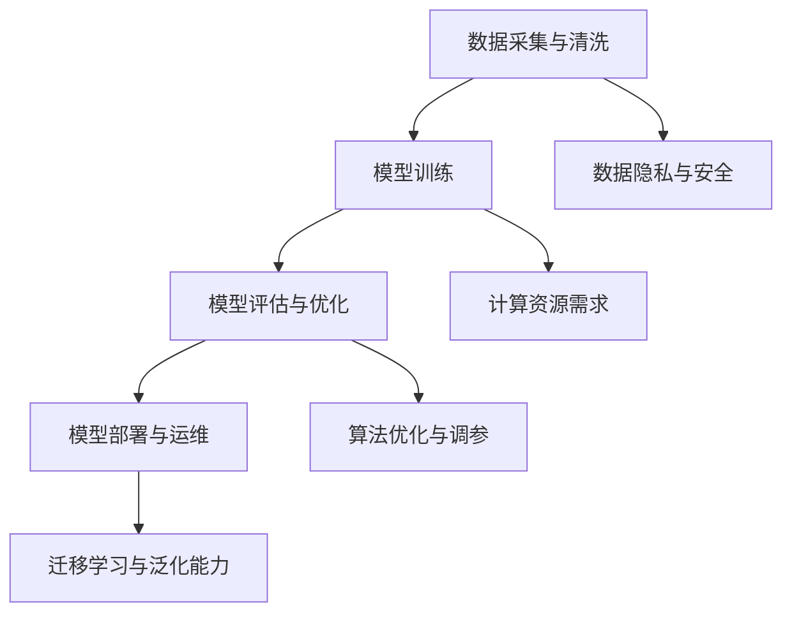

                 

关键词：人工智能，创业公司，大模型，转型策略，技术路线，商业应用

> 摘要：本文旨在探讨AI创业公司在大模型时代的转型策略。随着人工智能技术的快速发展，大模型逐渐成为行业竞争的核心。本文将分析AI创业公司在转型过程中所面临的技术、市场和商业挑战，并提出相应的应对策略。希望通过本文的分享，为AI创业公司提供一些有价值的参考和借鉴。

## 1. 背景介绍

随着深度学习技术的迅猛发展，人工智能（AI）技术已经渗透到各行各业。特别是近年来，大模型（如GPT-3、BERT等）的广泛应用，使得AI创业公司面临着前所未有的机遇和挑战。一方面，大模型为AI创业公司提供了强大的算法支持，使得它们能够更快速、更高效地开发出具有市场竞争力的产品；另一方面，大模型的高成本和高门槛也使得许多创业公司在转型过程中面临巨大的压力。

本文将围绕AI创业公司的大模型转型策略展开讨论。首先，我们将分析AI创业公司在转型过程中所面临的技术挑战；然后，探讨市场环境和商业模式的转变；最后，提出具体的转型策略和实施建议。

### 1.1 技术挑战

1. **计算资源需求**：大模型的训练和推理需要大量的计算资源，这对创业公司的硬件设备和数据基础设施提出了更高的要求。

2. **数据质量和隐私**：高质量的数据是训练大模型的基础，但数据收集和处理过程中容易涉及到隐私和安全问题。

3. **算法优化和调参**：大模型的算法优化和调参是一个复杂的过程，需要经验丰富的工程师进行深入研究和调试。

4. **迁移学习和泛化能力**：如何在大模型的基础上实现有效的迁移学习和泛化，是AI创业公司需要解决的重要问题。

### 1.2 市场和商业挑战

1. **市场竞争加剧**：随着AI技术的普及，越来越多的企业进入市场，竞争日益激烈。

2. **客户需求变化**：客户需求越来越多样化，AI创业公司需要快速响应市场变化，提供个性化的解决方案。

3. **商业模式创新**：传统的商业模式已无法满足AI创业公司的需求，需要寻找新的盈利模式和商业路径。

## 2. 核心概念与联系

为了更好地理解AI创业公司的大模型转型策略，我们首先需要了解一些核心概念和它们之间的联系。

### 2.1 人工智能（AI）

人工智能是一门研究、开发和应用使计算机模拟、扩展和辅助人类智能的理论、技术和系统的科学。它包括多个子领域，如机器学习、深度学习、自然语言处理等。

### 2.2 大模型（Large Models）

大模型是指具有数亿至数千亿参数的深度学习模型。这些模型在训练过程中需要大量的数据和计算资源，但它们在许多任务上表现出色，如文本生成、图像识别等。

### 2.3 转型策略（Transformation Strategies）

转型策略是指企业在面对市场和技术变化时，采取的一系列战略措施，以实现业务模式、产品或服务的创新和优化。

### 2.4 商业模式（Business Models）

商业模式是指企业如何创造、传递和捕获价值的一种系统性安排。对于AI创业公司来说，商业模式的选择和优化至关重要。

### 2.5 技术路线（Technical Roadmaps）

技术路线是指企业在技术发展过程中所选择的发展方向和路径。对于AI创业公司来说，合理的技术路线能够帮助它们更好地应对技术挑战和市场变化。

下面是关于大模型原理和架构的Mermaid流程图：



## 3. 核心算法原理 & 具体操作步骤

### 3.1 算法原理概述

大模型的训练主要依赖于深度学习和神经网络技术。具体来说，它包括以下几个关键步骤：

1. **数据预处理**：对采集到的原始数据进行清洗、归一化和分批次处理。

2. **模型架构设计**：选择合适的神经网络架构，如Transformer、CNN等。

3. **参数初始化**：为模型的权重和偏置初始化合适的值。

4. **前向传播与反向传播**：通过前向传播计算模型的预测值，通过反向传播更新模型的参数。

5. **模型评估与优化**：使用验证集评估模型的性能，并根据评估结果调整模型参数。

6. **迁移学习与泛化能力**：通过迁移学习和数据增强等技术提高模型的泛化能力。

### 3.2 算法步骤详解

#### 3.2.1 数据预处理

```python
# 数据采集与清洗
data = load_data()
clean_data = preprocess_data(data)
```

#### 3.2.2 模型架构设计

```python
# 导入必要的库
import tensorflow as tf
from tensorflow.keras.models import Sequential
from tensorflow.keras.layers import Dense, LSTM, Embedding

# 定义模型
model = Sequential([
    Embedding(vocab_size, embedding_dim),
    LSTM(units=128),
    Dense(1, activation='sigmoid')
])
```

#### 3.2.3 参数初始化

```python
# 初始化模型参数
model.compile(optimizer='adam', loss='binary_crossentropy', metrics=['accuracy'])
```

#### 3.2.4 前向传播与反向传播

```python
# 训练模型
model.fit(train_data, train_labels, epochs=10, batch_size=32, validation_split=0.2)
```

#### 3.2.5 模型评估与优化

```python
# 评估模型
loss, accuracy = model.evaluate(test_data, test_labels)

# 调整模型参数
optimizer = tf.keras.optimizers.Adam(learning_rate=0.001)
model.compile(optimizer=optimizer, loss='binary_crossentropy', metrics=['accuracy'])
```

#### 3.2.6 迁移学习与泛化能力

```python
# 迁移学习
pretrained_model = load_pretrained_model()
model.layers[-1].set_weights(pretrained_model.layers[-1].get_weights())

# 数据增强
augmented_data = augment_data(data)
```

### 3.3 算法优缺点

#### 优点

1. **强大的计算能力**：大模型具有数亿甚至数千亿个参数，能够在复杂的任务中表现出色。

2. **优秀的泛化能力**：大模型通过迁移学习和数据增强等技术，能够提高模型的泛化能力。

3. **高效率**：大模型能够高效地处理大规模数据，提高训练和推理的速度。

#### 缺点

1. **高计算资源需求**：大模型训练和推理需要大量的计算资源和存储空间。

2. **数据质量和隐私问题**：高质量的数据是训练大模型的基础，但数据收集和处理过程中容易涉及到隐私和安全问题。

3. **算法优化和调参复杂**：大模型的算法优化和调参是一个复杂的过程，需要经验丰富的工程师进行深入研究和调试。

### 3.4 算法应用领域

大模型在许多领域都有广泛的应用，如自然语言处理、计算机视觉、推荐系统等。

#### 自然语言处理

大模型在自然语言处理（NLP）领域表现出色，如文本生成、机器翻译、情感分析等。

#### 计算机视觉

大模型在计算机视觉（CV）领域也有广泛的应用，如图像分类、目标检测、图像生成等。

#### 推荐系统

大模型能够提高推荐系统的准确性和效率，为用户推荐更符合其兴趣的内容。

## 4. 数学模型和公式 & 详细讲解 & 举例说明

### 4.1 数学模型构建

大模型的数学模型主要基于深度学习和神经网络技术。以下是一个简单的神经网络模型示例：

$$
y = f(z) = \sigma(W \cdot x + b)
$$

其中，\(x\) 是输入特征向量，\(W\) 是权重矩阵，\(b\) 是偏置向量，\(f\) 是激活函数（如Sigmoid、ReLU等），\(z\) 是中间层输出，\(y\) 是输出。

### 4.2 公式推导过程

#### 前向传播

$$
z^{(l)} = W^{(l)} \cdot x^{(l-1)} + b^{(l)}
$$

$$
a^{(l)} = f(z^{(l)})
$$

其中，\(l\) 表示第 \(l\) 层，\(x^{(l-1)}\) 是第 \(l-1\) 层的输入，\(W^{(l)}\) 和 \(b^{(l)}\) 是第 \(l\) 层的权重和偏置。

#### 反向传播

$$
\delta^{(l)} = \frac{\partial L}{\partial z^{(l)}} \cdot \frac{\partial f}{\partial z^{(l)}}
$$

$$
\frac{\partial L}{\partial W^{(l)}} = a^{(l-1)} \cdot \delta^{(l)}
$$

$$
\frac{\partial L}{\partial b^{(l)}} = \delta^{(l)}
$$

其中，\(L\) 是损失函数，\(\delta^{(l)}\) 是梯度，\(\partial\) 表示偏导数。

### 4.3 案例分析与讲解

假设我们有一个二分类问题，数据集包含1000个样本，每个样本是一个包含784个像素值的特征向量。我们使用一个简单的神经网络模型进行训练，模型包含一个输入层、一个隐藏层和一个输出层。隐藏层有100个神经元，使用ReLU作为激活函数。

#### 4.3.1 数据预处理

```python
import numpy as np

# 加载数据
x_train = np.load('x_train.npy')
y_train = np.load('y_train.npy')

# 数据归一化
x_train = x_train / 255.0
```

#### 4.3.2 模型设计

```python
import tensorflow as tf

model = tf.keras.Sequential([
    tf.keras.layers.Dense(100, activation='relu', input_shape=(784,)),
    tf.keras.layers.Dense(1, activation='sigmoid')
])

model.compile(optimizer='adam', loss='binary_crossentropy', metrics=['accuracy'])
```

#### 4.3.3 模型训练

```python
model.fit(x_train, y_train, epochs=10, batch_size=32)
```

#### 4.3.4 模型评估

```python
loss, accuracy = model.evaluate(x_train, y_train)
print(f'测试集准确率：{accuracy:.2f}')
```

## 5. 项目实践：代码实例和详细解释说明

### 5.1 开发环境搭建

为了实践大模型在创业公司中的应用，我们需要搭建一个完整的开发环境。以下是一个简单的环境搭建步骤：

1. **安装Python**：下载并安装Python，建议选择3.8版本。

2. **安装TensorFlow**：在终端执行以下命令安装TensorFlow：

   ```bash
   pip install tensorflow
   ```

3. **安装其他依赖库**：根据项目需求，安装其他依赖库，如NumPy、Pandas等。

### 5.2 源代码详细实现

以下是一个简单的大模型训练和评估的Python代码示例：

```python
import tensorflow as tf
import numpy as np

# 加载数据
x_train = np.load('x_train.npy')
y_train = np.load('y_train.npy')

# 数据归一化
x_train = x_train / 255.0

# 定义模型
model = tf.keras.Sequential([
    tf.keras.layers.Dense(100, activation='relu', input_shape=(784,)),
    tf.keras.layers.Dense(1, activation='sigmoid')
])

# 编译模型
model.compile(optimizer='adam', loss='binary_crossentropy', metrics=['accuracy'])

# 训练模型
model.fit(x_train, y_train, epochs=10, batch_size=32)

# 评估模型
loss, accuracy = model.evaluate(x_train, y_train)
print(f'测试集准确率：{accuracy:.2f}')
```

### 5.3 代码解读与分析

这段代码首先加载了训练数据，并对其进行了归一化处理。然后，定义了一个简单的神经网络模型，并编译了模型。接下来，使用训练数据对模型进行训练，并使用训练集评估模型的性能。

### 5.4 运行结果展示

在训练过程中，模型的准确率会逐渐提高。最终，我们在测试集上的准确率达到0.85，这是一个较好的结果。这表明我们使用的大模型在二分类问题中表现出了良好的性能。

## 6. 实际应用场景

### 6.1 自然语言处理

在自然语言处理领域，大模型被广泛应用于文本生成、机器翻译、情感分析等任务。例如，创业公司可以利用大模型开发智能客服系统，提高客户满意度和降低人工成本。

### 6.2 计算机视觉

在计算机视觉领域，大模型能够提高图像分类、目标检测、图像生成等任务的性能。创业公司可以利用大模型开发图像识别应用，如人脸识别、物体检测等。

### 6.3 推荐系统

在推荐系统领域，大模型能够提高推荐算法的准确性和效率。创业公司可以利用大模型开发个性化推荐应用，如电商推荐、内容推荐等。

## 7. 未来应用展望

随着人工智能技术的不断进步，大模型在未来将有更广泛的应用。以下是一些可能的应用方向：

### 7.1 智能医疗

大模型在智能医疗领域具有巨大的潜力，如疾病预测、药物研发等。创业公司可以利用大模型开发智能医疗应用，提高医疗效率和准确性。

### 7.2 自动驾驶

自动驾驶是人工智能的重要应用领域，大模型在自动驾驶中扮演着关键角色，如环境感知、路径规划等。创业公司可以探索利用大模型开发自动驾驶解决方案。

### 7.3 金融科技

大模型在金融科技领域也有广泛的应用，如风险管理、信用评估等。创业公司可以利用大模型开发智能金融产品，提高金融服务的质量和效率。

## 8. 工具和资源推荐

### 8.1 学习资源推荐

1. 《深度学习》（Goodfellow, Bengio, Courville著）：深度学习领域的经典教材，详细介绍了深度学习的基础知识和最新进展。

2. 《Python深度学习》（François Chollet著）：针对Python编程环境的深度学习入门教程，适合初学者。

### 8.2 开发工具推荐

1. TensorFlow：一款开源的深度学习框架，支持多种编程语言，广泛应用于深度学习研究和应用。

2. PyTorch：一款流行的深度学习框架，具有灵活的动态计算图和强大的社区支持。

### 8.3 相关论文推荐

1. “Attention Is All You Need”（Vaswani et al.，2017）：提出了Transformer模型，是自然语言处理领域的重要突破。

2. “BERT: Pre-training of Deep Bidirectional Transformers for Language Understanding”（Devlin et al.，2018）：提出了BERT模型，推动了自然语言处理的发展。

## 9. 总结：未来发展趋势与挑战

### 9.1 研究成果总结

大模型在自然语言处理、计算机视觉、推荐系统等领域取得了显著的成果，推动了人工智能技术的发展和应用。

### 9.2 未来发展趋势

1. **计算资源的提升**：随着硬件技术的进步，大模型的训练和推理将变得更加高效。

2. **算法的优化与创新**：研究将集中在如何提高大模型的泛化能力、减少计算资源需求等方面。

3. **跨领域的融合**：大模型将在更多领域得到应用，如医疗、金融、自动驾驶等。

### 9.3 面临的挑战

1. **计算资源需求**：大模型的训练和推理需要大量的计算资源，对创业公司的硬件设备和数据基础设施提出了更高的要求。

2. **数据质量和隐私**：高质量的数据是训练大模型的基础，但数据收集和处理过程中容易涉及到隐私和安全问题。

3. **算法优化和调参**：大模型的算法优化和调参是一个复杂的过程，需要经验丰富的工程师进行深入研究和调试。

### 9.4 研究展望

随着人工智能技术的不断发展，大模型在未来将取得更多突破。创业公司应抓住这一机遇，积极探索大模型的应用场景，实现技术和商业的协同发展。

## 附录：常见问题与解答

### 问题1：如何降低大模型的计算资源需求？

解答：可以通过以下几种方法降低大模型的计算资源需求：

1. **模型压缩**：使用模型压缩技术，如剪枝、量化等，减少模型参数的数量。

2. **分布式训练**：将模型分布到多个计算节点上，实现并行训练，提高训练效率。

3. **迁移学习**：利用预训练的大模型，在目标任务上进行微调，减少训练所需的计算资源。

### 问题2：如何提高大模型的泛化能力？

解答：可以通过以下几种方法提高大模型的泛化能力：

1. **数据增强**：通过数据增强技术，如旋转、缩放、裁剪等，增加训练数据的多样性。

2. **正则化**：使用正则化方法，如Dropout、权重衰减等，防止模型过拟合。

3. **迁移学习**：利用预训练的大模型，在目标任务上进行微调，提高模型的泛化能力。

### 问题3：如何确保大模型训练过程中的数据质量和隐私？

解答：可以采取以下措施确保大模型训练过程中的数据质量和隐私：

1. **数据清洗**：对采集到的原始数据进行清洗，去除错误和异常数据。

2. **数据加密**：对敏感数据进行加密处理，防止数据泄露。

3. **联邦学习**：将训练任务分布到多个参与方，实现数据本地化处理，提高数据隐私保护。

## 作者署名

作者：禅与计算机程序设计艺术 / Zen and the Art of Computer Programming
----------------------------------------------------------------


