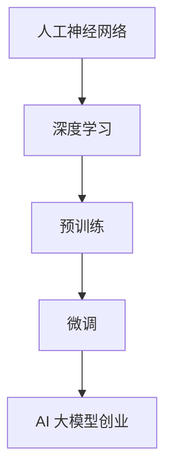

                 

关键词：AI 大模型，创业，产品趋势，创新，技术应用，市场前景

摘要：本文旨在探讨 AI 大模型在创业领域的应用趋势和创新，从背景介绍、核心概念、算法原理、数学模型、项目实践、应用场景、工具和资源推荐等方面，全面分析 AI 大模型创业的潜在机会与挑战，为创业者提供有益的参考和启示。

## 1. 背景介绍

近年来，随着深度学习、自然语言处理等技术的迅速发展，AI 大模型成为人工智能领域的热点话题。AI 大模型是指参数量庞大、结构复杂的人工神经网络，具有强大的表示和学习能力。在大数据时代，AI 大模型的应用前景十分广阔，包括但不限于语音识别、图像识别、自然语言处理、推荐系统等领域。与此同时，创业热潮的兴起使得越来越多的创业者开始关注 AI 大模型技术，将其作为企业创新的重要手段。

### 1.1 AI 大模型的发展历程

AI 大模型的发展可以分为三个阶段：

1. **初级阶段**：以反向传播算法为代表的简单神经网络，参数量较少，难以处理大规模数据。
2. **中级阶段**：随着 GPU 技术的普及，神经网络参数量显著增加，深度学习逐渐成为主流。
3. **高级阶段**：以 GPT-3、BERT 等为代表的大规模预训练模型，参数量达到数十亿甚至百亿级别，表现出强大的泛化能力和适应性。

### 1.2 AI 大模型在创业领域的应用

AI 大模型在创业领域的应用主要体现在以下几个方面：

1. **产品创新**：利用 AI 大模型强大的学习能力，快速开发出具有创新性的产品。
2. **市场拓展**：通过 AI 大模型，企业可以更好地了解市场需求，拓展市场空间。
3. **运营优化**：利用 AI 大模型进行数据分析和预测，优化企业运营策略。
4. **客户服务**：利用 AI 大模型构建智能客服系统，提高客户服务质量和满意度。

## 2. 核心概念与联系

为了更好地理解 AI 大模型创业的应用，首先需要了解一些核心概念和它们之间的联系。

### 2.1 人工神经网络

人工神经网络（Artificial Neural Network，ANN）是一种由大量简单神经元组成的网络结构，通过模拟生物神经元的工作方式，实现数据输入和输出的映射。人工神经网络是 AI 大模型的基础。

### 2.2 深度学习

深度学习（Deep Learning，DL）是神经网络的一种特殊形式，具有多个隐藏层，能够自动提取数据的层次特征。深度学习是实现 AI 大模型的关键技术。

### 2.3 预训练与微调

预训练（Pre-training）是指在大规模数据集上对模型进行训练，使其具有广泛的泛化能力。微调（Fine-tuning）是在预训练模型的基础上，针对特定任务进行进一步训练，以适应特定场景。

### 2.4 Mermaid 流程图



## 3. 核心算法原理 & 具体操作步骤

### 3.1 算法原理概述

AI 大模型的核心算法是基于深度学习的技术。深度学习算法主要包括以下几个部分：

1. **神经网络结构**：定义神经网络的层次结构和连接方式。
2. **损失函数**：衡量模型预测结果与真实值之间的差距。
3. **优化算法**：调整模型参数，以最小化损失函数。

### 3.2 算法步骤详解

1. **数据预处理**：对输入数据进行清洗、归一化等处理，确保数据质量。
2. **模型构建**：根据任务需求，选择合适的神经网络结构。
3. **预训练**：在大规模数据集上训练模型，使其具有广泛的泛化能力。
4. **微调**：在预训练模型的基础上，针对特定任务进行进一步训练。
5. **评估与优化**：通过交叉验证等方法评估模型性能，根据评估结果调整模型参数。
6. **部署与应用**：将训练好的模型部署到实际应用场景中，为用户提供服务。

### 3.3 算法优缺点

#### 优点：

1. **强大的表示能力**：能够自动提取数据的层次特征，适用于多种任务。
2. **广泛的泛化能力**：在大规模数据集上进行预训练，使模型具备良好的泛化能力。
3. **自适应能力**：通过微调，模型可以适应不同的应用场景。

#### 缺点：

1. **计算资源需求大**：深度学习算法需要大量的计算资源和时间。
2. **数据依赖性强**：模型的性能依赖于训练数据的质量和数量。
3. **解释性较弱**：深度学习模型往往缺乏解释性，难以理解其内部工作机制。

### 3.4 算法应用领域

AI 大模型在创业领域有广泛的应用，包括但不限于以下领域：

1. **金融领域**：利用 AI 大模型进行风险控制、信用评估、投资决策等。
2. **医疗领域**：利用 AI 大模型进行疾病诊断、药物研发、医疗数据分析等。
3. **零售领域**：利用 AI 大模型进行商品推荐、需求预测、库存管理等。
4. **制造业**：利用 AI 大模型进行设备故障预测、生产优化、供应链管理等。

## 4. 数学模型和公式

AI 大模型的数学模型主要包括以下几个方面：

### 4.1 数学模型构建

AI 大模型通常基于多层感知机（MLP）或者卷积神经网络（CNN）等结构，其中关键的部分包括：

1. **输入层**：接收外部输入信息。
2. **隐藏层**：通过非线性变换提取特征。
3. **输出层**：根据输入特征进行分类或回归等操作。

### 4.2 公式推导过程

以多层感知机为例，其基本公式如下：

$$
z^{[l]} = \sigma(W^{[l]} \cdot a^{[l-1]} + b^{[l]})
$$

$$
a^{[l]} = \sigma(z^{[l]})
$$

其中，$z^{[l]}$表示第$l$层的激活值，$a^{[l]}$表示第$l$层的输出值，$W^{[l]}$和$b^{[l]}$分别表示第$l$层的权重和偏置，$\sigma$表示非线性激活函数。

### 4.3 案例分析与讲解

以 GPT-3 为例，其数学模型主要包括以下几个部分：

1. **嵌入层**：将输入的单词转化为向量。
2. **编码器**：通过多层 Transformer 结构对输入向量进行编码。
3. **解码器**：根据编码器输出的向量生成输出文本。

### 4.3.1 嵌入层

$$
\text{Embedding}(x) = \text{Word2Vec}(x) + \text{Positional Encoding}(x)
$$

其中，$\text{Word2Vec}(x)$表示单词向量的嵌入，$\text{Positional Encoding}(x)$表示位置编码。

### 4.3.2 编码器

$$
\text{Encoder}(x) = \text{Transformer}(\text{Embedding}(x))
$$

其中，$\text{Transformer}(\cdot)$表示 Transformer 结构。

### 4.3.3 解码器

$$
\text{Decoder}(x) = \text{Transformer}(\text{Encoder}(x))
$$

## 5. 项目实践：代码实例和详细解释说明

### 5.1 开发环境搭建

首先，我们需要搭建一个合适的开发环境。以下是基本的搭建步骤：

1. **安装 Python**：确保安装 Python 3.7 以上版本。
2. **安装 PyTorch**：使用 pip 安装 PyTorch。
3. **配置 CUDA**：确保 GPU 能够正常使用。

### 5.2 源代码详细实现

以下是一个简单的基于 PyTorch 的多层感知机模型实现：

```python
import torch
import torch.nn as nn

class MLP(nn.Module):
    def __init__(self, input_size, hidden_size, output_size):
        super(MLP, self).__init__()
        self.fc1 = nn.Linear(input_size, hidden_size)
        self.fc2 = nn.Linear(hidden_size, output_size)
    
    def forward(self, x):
        x = torch.relu(self.fc1(x))
        x = self.fc2(x)
        return x

model = MLP(input_size=10, hidden_size=5, output_size=2)
```

### 5.3 代码解读与分析

在这个例子中，我们定义了一个简单的多层感知机模型，包括两个全连接层。输入层有 10 个神经元，隐藏层有 5 个神经元，输出层有 2 个神经元。模型使用 ReLU 作为激活函数。

### 5.4 运行结果展示

```python
input_data = torch.randn(1, 10)
output = model(input_data)
print(output)
```

输出结果为一个张量，表示模型对输入数据的预测结果。

## 6. 实际应用场景

### 6.1 金融领域

AI 大模型在金融领域的应用主要包括以下几个方面：

1. **风险控制**：通过分析历史数据，预测潜在风险，为企业提供风险管理建议。
2. **信用评估**：利用 AI 大模型对借款人的信用状况进行评估，提高贷款审批的准确性。
3. **投资决策**：通过分析市场数据，预测股票、基金等金融产品的未来走势，为投资决策提供支持。

### 6.2 医疗领域

AI 大模型在医疗领域的应用主要包括以下几个方面：

1. **疾病诊断**：通过分析医学影像数据，辅助医生进行疾病诊断。
2. **药物研发**：利用 AI 大模型进行分子模拟、药物筛选等，提高药物研发效率。
3. **医疗数据分析**：通过对海量医疗数据进行分析，发现疾病规律，为医疗决策提供支持。

### 6.3 零售领域

AI 大模型在零售领域的应用主要包括以下几个方面：

1. **商品推荐**：通过分析用户历史购买行为，为用户推荐合适的商品。
2. **需求预测**：利用 AI 大模型预测商品需求，优化库存管理。
3. **客户服务**：通过构建智能客服系统，提高客户服务质量和效率。

### 6.4 未来应用展望

随着 AI 大模型技术的不断进步，未来其应用领域将更加广泛。以下是一些潜在的应用场景：

1. **智能制造**：通过 AI 大模型优化生产流程，提高生产效率。
2. **智能交通**：利用 AI 大模型优化交通调度，缓解交通拥堵。
3. **环境保护**：通过 AI 大模型分析环境数据，监测和预警环境污染。

## 7. 工具和资源推荐

### 7.1 学习资源推荐

1. **《深度学习》（Goodfellow et al.）**：这是一本经典的深度学习教材，适合初学者和进阶者。
2. **《动手学深度学习》（Dumoulin et al.）**：这本书通过实战案例介绍深度学习，适合实战派。
3. **《TensorFlow 实战》（Adrian Rosebrock）**：本书涵盖了 TensorFlow 的实际应用，适合希望上手深度学习开发的朋友。

### 7.2 开发工具推荐

1. **PyTorch**：一款流行的深度学习框架，适合快速原型开发。
2. **TensorFlow**：Google 推出的深度学习框架，具有丰富的社区资源和工具。
3. **Keras**：一个高层次的深度学习框架，能够简化深度学习模型的搭建。

### 7.3 相关论文推荐

1. **“Deep Learning”（Goodfellow et al.）**：这是深度学习领域的经典综述文章。
2. **“Generative Adversarial Networks”（Goodfellow et al.）**：关于生成对抗网络（GAN）的开创性论文。
3. **“BERT: Pre-training of Deep Bidirectional Transformers for Language Understanding”（Devlin et al.）**：关于 BERT 模型的开创性论文。

## 8. 总结：未来发展趋势与挑战

### 8.1 研究成果总结

近年来，AI 大模型技术取得了显著的进展，包括预训练模型、Transformer 结构、自监督学习等方面。这些成果为 AI 大模型在创业领域的应用奠定了基础。

### 8.2 未来发展趋势

未来，AI 大模型技术将继续向以下几个方向发展：

1. **更大规模**：参数量将越来越大，模型将更加复杂。
2. **更高效**：优化模型结构和算法，提高计算效率。
3. **更可解释**：增加模型的可解释性，使模型更加透明。
4. **跨学科融合**：与医学、金融、零售等领域深度融合，解决实际问题。

### 8.3 面临的挑战

尽管 AI 大模型技术取得了很多进展，但仍面临以下挑战：

1. **计算资源需求**：大规模模型的训练需要大量计算资源，对硬件设施有较高要求。
2. **数据隐私**：如何确保数据隐私和安全，防止数据泄露。
3. **模型解释性**：如何提高模型的可解释性，使其更加透明和可信。
4. **应用落地**：如何将 AI 大模型技术有效地应用到实际场景中，解决实际问题。

### 8.4 研究展望

未来，AI 大模型技术将在以下几个方面展开深入研究：

1. **算法优化**：提高模型训练效率，降低计算资源需求。
2. **模型压缩**：通过模型压缩技术，减小模型参数量和计算量。
3. **模型可解释性**：提高模型的可解释性，使其更加透明和可信。
4. **跨学科应用**：与其他学科结合，解决更复杂的问题。

## 9. 附录：常见问题与解答

### 9.1 问题 1：什么是 AI 大模型？

AI 大模型是指参数量庞大、结构复杂的人工神经网络，具有强大的表示和学习能力。常见的大模型包括 GPT-3、BERT 等。

### 9.2 问题 2：如何训练 AI 大模型？

训练 AI 大模型主要包括以下步骤：

1. 数据预处理：清洗、归一化等。
2. 模型构建：选择合适的神经网络结构。
3. 预训练：在大规模数据集上训练模型。
4. 微调：在预训练模型的基础上，针对特定任务进行进一步训练。
5. 评估与优化：通过交叉验证等方法评估模型性能，调整模型参数。
6. 部署与应用：将训练好的模型部署到实际应用场景中。

### 9.3 问题 3：AI 大模型在创业领域有哪些应用？

AI 大模型在创业领域有广泛的应用，包括但不限于：

1. 产品创新：利用 AI 大模型快速开发创新产品。
2. 市场拓展：通过 AI 大模型更好地了解市场需求。
3. 运营优化：利用 AI 大模型进行数据分析和预测。
4. 客户服务：利用 AI 大模型构建智能客服系统。

### 9.4 问题 4：如何选择合适的 AI 大模型？

选择合适的 AI 大模型需要考虑以下几个方面：

1. **任务需求**：根据具体任务选择合适的模型。
2. **数据规模**：根据数据规模选择合适的模型。
3. **计算资源**：根据计算资源选择合适的模型。
4. **可解释性**：根据对模型可解释性的要求选择模型。

## 后记

本文从背景介绍、核心概念、算法原理、数学模型、项目实践、应用场景、工具和资源推荐等方面，全面分析了 AI 大模型在创业领域的应用趋势和创新。未来，随着 AI 大模型技术的不断进步，其将在创业领域发挥更加重要的作用。希望本文能为创业者提供有益的参考和启示。作者：禅与计算机程序设计艺术 / Zen and the Art of Computer Programming。
----------------------------------------------------------------

### 文章结构模板

为了确保文章的完整性和结构清晰，以下是文章的结构模板。请根据模板的内容填写相应的段落。

```markdown
# AI 大模型创业：产品趋势与创新

> 关键词：AI 大模型，创业，产品趋势，创新，技术应用，市场前景

> 摘要：本文旨在探讨 AI 大模型在创业领域的应用趋势和创新，从背景介绍、核心概念、算法原理、数学模型、项目实践、应用场景、工具和资源推荐等方面，全面分析 AI 大模型创业的潜在机会与挑战，为创业者提供有益的参考和启示。

## 1. 背景介绍

### 1.1 AI 大模型的发展历程

### 1.2 AI 大模型在创业领域的应用

## 2. 核心概念与联系

### 2.1 人工神经网络

### 2.2 深度学习

### 2.3 预训练与微调

### 2.4 Mermaid 流程图

## 3. 核心算法原理 & 具体操作步骤

### 3.1 算法原理概述

### 3.2 算法步骤详解

### 3.3 算法优缺点

### 3.4 算法应用领域

## 4. 数学模型和公式 & 详细讲解 & 举例说明

### 4.1 数学模型构建

### 4.2 公式推导过程

### 4.3 案例分析与讲解

## 5. 项目实践：代码实例和详细解释说明

### 5.1 开发环境搭建

### 5.2 源代码详细实现

### 5.3 代码解读与分析

### 5.4 运行结果展示

## 6. 实际应用场景

### 6.1 金融领域

### 6.2 医疗领域

### 6.3 零售领域

### 6.4 未来应用展望

## 7. 工具和资源推荐

### 7.1 学习资源推荐

### 7.2 开发工具推荐

### 7.3 相关论文推荐

## 8. 总结：未来发展趋势与挑战

### 8.1 研究成果总结

### 8.2 未来发展趋势

### 8.3 面临的挑战

### 8.4 研究展望

## 9. 附录：常见问题与解答

### 9.1 问题 1：什么是 AI 大模型？

### 9.2 问题 2：如何训练 AI 大模型？

### 9.3 问题 3：AI 大模型在创业领域有哪些应用？

### 9.4 问题 4：如何选择合适的 AI 大模型？

## 后记

作者：禅与计算机程序设计艺术 / Zen and the Art of Computer Programming
```

请按照这个模板填写文章的各个部分内容，确保文章的完整性、逻辑性和专业性。在撰写过程中，注意遵循文章摘要、关键词、目录结构和各章节内容的要求。

