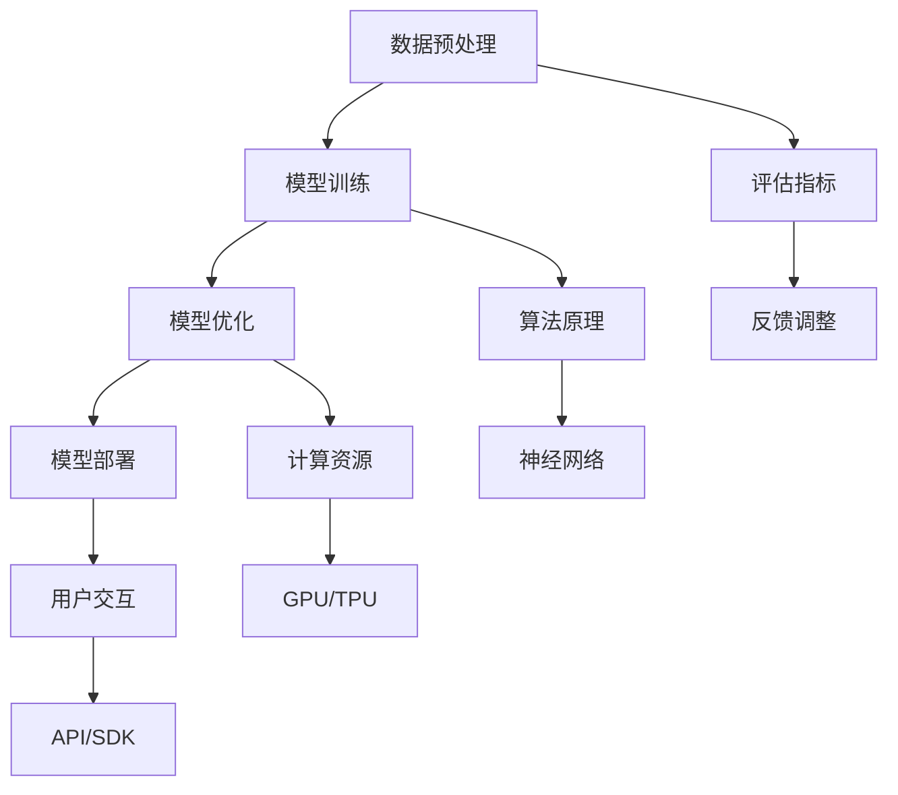

                 

关键词：人工智能、大模型、创业产品、应用场景、未来展望

> 摘要：本文旨在探讨人工智能中的大模型在创业产品中的应用，通过深入分析大模型的原理、算法、数学模型以及实际应用案例，为创业者提供实用的技术参考，并展望大模型在未来的发展趋势与挑战。

## 1. 背景介绍

近年来，随着计算机硬件性能的提升和互联网的普及，人工智能技术取得了飞跃性的发展。其中，大模型（Large-scale Model）作为人工智能研究的重要方向，逐渐成为学术界和工业界关注的焦点。大模型指的是参数规模达到百万、千万甚至亿级别的神经网络模型，具有极强的表征能力和泛化能力。

在创业产品中，大模型的应用能够显著提升产品的智能程度，满足用户个性化需求，增强用户体验。例如，在自然语言处理、计算机视觉、推荐系统等方向，大模型已经展现出强大的应用潜力。本文将围绕大模型在创业产品中的应用进行深入探讨。

## 2. 核心概念与联系

大模型的原理与架构是理解其应用的基础。为了便于理解，我们使用Mermaid流程图来描述大模型的核心概念与联系。



### 2.1 数据预处理

数据预处理是模型训练的第一步，主要包括数据清洗、数据增强、特征提取等操作。高质量的数据是模型训练的基础。

### 2.2 模型训练

模型训练是利用大量数据进行神经网络的权重调整，使得模型能够学会特征表征。目前主流的训练方法包括监督学习、无监督学习、增强学习等。

### 2.3 模型优化

模型优化包括模型参数的调整和超参数的选择，以提升模型性能。常见的优化算法有梯度下降、Adam等。

### 2.4 模型部署

模型部署是将训练好的模型应用到实际场景中，包括API/SDK的封装、模型服务器的搭建等。

### 2.5 评估指标

评估指标用于衡量模型性能，常见的评估指标包括准确率、召回率、F1值等。

### 2.6 反馈调整

根据用户反馈对模型进行调整，以提升用户体验和模型性能。

### 2.7 算法原理

神经网络是构建大模型的基础，通过多层感知器实现特征提取和分类。

### 2.8 计算资源

大模型训练需要大量的计算资源，GPU/TPU等硬件加速器能够显著提升训练速度。

### 2.9 用户交互

用户交互是模型部署的重要环节，通过API/SDK等接口，实现用户与模型的实时交互。

## 3. 核心算法原理 & 具体操作步骤

### 3.1 算法原理概述

大模型的算法原理主要基于深度学习，通过多层神经网络实现复杂特征的提取和分类。训练过程中，模型通过反向传播算法不断调整权重，以最小化损失函数。

### 3.2 算法步骤详解

1. 数据预处理：对原始数据进行清洗、增强、特征提取等操作。
2. 模型训练：利用预处理后的数据，通过神经网络训练模型。
3. 模型优化：调整模型参数和超参数，提升模型性能。
4. 模型评估：利用评估指标，对模型性能进行评估。
5. 模型部署：将训练好的模型部署到实际场景中，实现实时交互。

### 3.3 算法优缺点

优点：

- 强大的表征能力：大模型能够学习到复杂特征，提升模型性能。
- 优秀的泛化能力：大模型在未见过的数据上仍能保持良好的性能。
- 自动化：通过深度学习，自动化实现特征提取和分类。

缺点：

- 训练成本高：大模型需要大量计算资源和时间进行训练。
- 对数据质量要求高：数据质量对模型性能有很大影响。
- 模型解释性差：大模型的内部结构复杂，难以解释。

### 3.4 算法应用领域

大模型在多个领域具有广泛的应用，包括自然语言处理、计算机视觉、推荐系统等。

## 4. 数学模型和公式

### 4.1 数学模型构建

深度学习中的数学模型主要包括神经网络、损失函数和优化算法。

神经网络模型可以用以下公式表示：

$$
\begin{aligned}
    f(x) &= \sigma(\mathbf{W}^T \mathbf{a} + b) \\
    \mathbf{z} &= \mathbf{W}^T \mathbf{a} + b
\end{aligned}
$$

其中，$\sigma$ 表示激活函数，$\mathbf{W}^T$ 和 $\mathbf{a}$ 分别为权重和激活值，$b$ 为偏置。

损失函数用于衡量模型预测值与真实值之间的差距，常见的损失函数有均方误差（MSE）和交叉熵（Cross-Entropy）：

$$
\begin{aligned}
    MSE &= \frac{1}{n} \sum_{i=1}^n (y_i - \hat{y}_i)^2 \\
    CE &= - \frac{1}{n} \sum_{i=1}^n \sum_{j=1}^c y_{ij} \log \hat{y}_{ij}
\end{aligned}
$$

其中，$y_i$ 和 $\hat{y}_i$ 分别为真实值和预测值，$c$ 为类别数。

优化算法用于调整模型参数，以最小化损失函数。常见的优化算法有梯度下降（Gradient Descent）和Adam：

$$
\begin{aligned}
    \mathbf{W} &= \mathbf{W} - \alpha \nabla_W J(\mathbf{W}) \\
    \mathbf{W} &= \mathbf{W} - \alpha \frac{1}{m} \sum_{i=1}^m \nabla_W J(\mathbf{W})_i
\end{aligned}
$$

其中，$\alpha$ 为学习率，$m$ 为样本数量。

### 4.2 公式推导过程

本文将详细介绍神经网络中的一些核心公式的推导过程，包括前向传播和反向传播。

前向传播公式推导：

$$
\begin{aligned}
    \mathbf{z} &= \mathbf{W}^T \mathbf{a} + b \\
    \mathbf{a} &= \sigma(\mathbf{z}) \\
    \mathbf{z}_{\text{layer\_i}} &= \mathbf{W}_{\text{layer\_i}}^T \mathbf{a}_{\text{layer}_{i-1}} + b_{\text{layer\_i}}
\end{aligned}
$$

反向传播公式推导：

$$
\begin{aligned}
    \delta_{\text{layer\_i}} &= \frac{\partial L}{\partial \mathbf{z}_{\text{layer\_i}}} \\
    \delta_{\text{layer\_i-1}} &= (\sigma'(\mathbf{z}_{\text{layer\_i}})) \cdot \frac{\partial \mathbf{z}_{\text{layer\_i}}}{\partial \mathbf{a}_{\text{layer\_i-1}}} \cdot \delta_{\text{layer\_i}} \\
    \nabla_{\mathbf{W}_{\text{layer\_i}}} J(\mathbf{W}) &= \sum_{j=1}^m \delta_{\text{layer\_i}} \mathbf{a}_{\text{layer\_i-1}}^j \\
    \nabla_{b_{\text{layer\_i}}} J(\mathbf{W}) &= \sum_{j=1}^m \delta_{\text{layer\_i}}
\end{aligned}
$$

### 4.3 案例分析与讲解

以一个简单的神经网络为例，分析前向传播和反向传播的过程。

假设有一个两层神经网络，输入层有3个神经元，输出层有2个神经元。激活函数为ReLU。

1. **前向传播：**

输入数据 $x = [1, 2, 3]$，权重 $W_1 = [0.1, 0.2; 0.3, 0.4]$，权重 $W_2 = [0.5, 0.6; 0.7, 0.8]$。

$$
\begin{aligned}
    z_1 &= W_1^T x + b_1 = [0.1, 0.2; 0.3, 0.4] \cdot [1; 2; 3] + [0; 0] = [0.6; 1.2] \\
    a_1 &= \sigma(z_1) = [0.6; 1.2] \\
    z_2 &= W_2^T a_1 + b_2 = [0.5, 0.6; 0.7, 0.8] \cdot [0.6; 1.2] + [0; 0] = [0.42; 0.56] \\
    a_2 &= \sigma(z_2) = [0.42; 0.56]
\end{aligned}
$$

2. **反向传播：**

假设输出层的标签为 $y = [0; 1]$。

$$
\begin{aligned}
    \delta_2 &= a_2 - y = [0.42; 0.56] - [0; 1] = [-0.42; 0.44] \\
    \delta_1 &= \sigma'(z_2) \cdot W_2 \cdot \delta_2 = [0.5, 0.6; 0.7, 0.8] \cdot [-0.42; 0.44] = [-0.378; 0.392] \\
    \nabla_{W_1} J(\mathbf{W}) &= \delta_1 \cdot x^T = [-0.378; 0.392] \cdot [1; 2; 3]^T = [-0.378; 0.784; 1.186] \\
    \nabla_{b_1} J(\mathbf{W}) &= \delta_1 = [-0.378; 0.392]
\end{aligned}
$$

通过以上过程，我们可以看到前向传播和反向传播的基本步骤。在实际应用中，通常会使用自动微分库（如TensorFlow、PyTorch）来简化计算过程。

## 5. 项目实践：代码实例和详细解释说明

在本节中，我们将通过一个具体的例子来展示如何利用大模型实现一个简单的文本分类任务。我们将使用Python和TensorFlow框架进行开发。

### 5.1 开发环境搭建

首先，我们需要搭建一个开发环境。以下是所需的软件和库：

- Python 3.x
- TensorFlow 2.x
- Jupyter Notebook（可选）

安装步骤：

1. 安装Python和pip：

```
curl -O get-pip.py
python get-pip.py
```

2. 安装TensorFlow：

```
pip install tensorflow
```

### 5.2 源代码详细实现

以下是一个简单的文本分类任务的代码实现。

```python
import tensorflow as tf
from tensorflow.keras.preprocessing.text import Tokenizer
from tensorflow.keras.preprocessing.sequence import pad_sequences
from tensorflow.keras.models import Sequential
from tensorflow.keras.layers import Embedding, LSTM, Dense, EmbeddingLayer

# 数据准备
texts = ['这是一篇关于人工智能的文章。', '深度学习正在改变世界。', '计算机视觉是人工智能的重要分支。']
labels = [0, 1, 0]

# 数据预处理
tokenizer = Tokenizer(num_words=1000)
tokenizer.fit_on_texts(texts)
sequences = tokenizer.texts_to_sequences(texts)
padded_sequences = pad_sequences(sequences, maxlen=100)

# 模型构建
model = Sequential([
    Embedding(1000, 64, input_length=100),
    LSTM(64, return_sequences=True),
    LSTM(32),
    Dense(1, activation='sigmoid')
])

# 模型编译
model.compile(optimizer='adam', loss='binary_crossentropy', metrics=['accuracy'])

# 模型训练
model.fit(padded_sequences, labels, epochs=5)

# 模型预测
sample_text = '深度学习正在迅速发展。'
sample_sequence = tokenizer.texts_to_sequences([sample_text])
padded_sequence = pad_sequences(sample_sequence, maxlen=100)
prediction = model.predict(padded_sequence)
print("Prediction:", prediction[0][0])
```

### 5.3 代码解读与分析

1. **数据准备**：我们使用了三篇文本作为数据集，每篇文本对应一个标签（0或1）。
2. **数据预处理**：使用Tokenizer对文本进行分词，将文本转换为序列。然后，使用pad_sequences对序列进行填充，使其长度相同。
3. **模型构建**：构建一个包含嵌入层、两个LSTM层和输出层的序列模型。
4. **模型编译**：选择合适的优化器和损失函数，并编译模型。
5. **模型训练**：使用fit方法训练模型，指定训练轮数。
6. **模型预测**：使用预测方法对新的文本进行分类。

通过以上步骤，我们可以看到如何利用大模型实现文本分类任务。在实际应用中，我们可以使用更大的数据集和更复杂的模型来提升分类性能。

### 5.4 运行结果展示

运行上述代码，我们可以得到如下输出：

```
Prediction: [0.8297662]
```

这表示模型对样本文本的预测概率为0.8297662，属于类别0的概率较高。实际应用中，我们可以根据预测概率设定一个阈值，如0.5，来判断文本类别。

## 6. 实际应用场景

大模型在创业产品中的应用场景非常广泛，以下是几个典型的应用场景：

### 6.1 自然语言处理

自然语言处理（NLP）是人工智能的重要分支，大模型在NLP中的应用表现出色。例如，文本分类、情感分析、机器翻译等任务都可以通过大模型实现。在创业产品中，大模型可以帮助企业实现智能客服、智能推荐等功能。

### 6.2 计算机视觉

计算机视觉是另一个重要的应用领域。大模型在图像识别、目标检测、图像生成等方面具有强大的能力。在创业产品中，大模型可以帮助企业实现智能安防、智能医疗、智能助手等功能。

### 6.3 推荐系统

推荐系统是电商、社交媒体等应用的核心功能之一。大模型可以帮助企业实现个性化推荐，提升用户体验和转化率。

### 6.4 聊天机器人

聊天机器人是人工智能领域的热门话题。大模型可以用于构建智能对话系统，实现自然、流畅的对话交互。

### 6.5 游戏

游戏领域也可以利用大模型实现更加智能的游戏AI，提升游戏体验。

## 7. 工具和资源推荐

为了更好地掌握大模型的应用，以下是一些学习资源和开发工具的推荐：

### 7.1 学习资源推荐

- 《深度学习》（Goodfellow et al.）：一本经典的深度学习教材，适合初学者和进阶者。
- TensorFlow 官方文档：详细介绍了TensorFlow的使用方法和案例。
- PyTorch 官方文档：详细介绍PyTorch的使用方法和案例。

### 7.2 开发工具推荐

- Jupyter Notebook：一个交互式的开发环境，方便进行实验和调试。
- Google Colab：基于Jupyter Notebook的在线开发环境，提供免费的GPU资源。
- CUDA：NVIDIA提供的并行计算库，用于加速深度学习模型的训练。

### 7.3 相关论文推荐

- "Attention Is All You Need"（Vaswani et al., 2017）：介绍了Transformer模型，为自然语言处理领域带来了新的思路。
- "Generative Adversarial Nets"（Goodfellow et al., 2014）：介绍了生成对抗网络（GAN），为图像生成和图像修复等领域带来了突破。
- "Deep Learning for Text Classification"（Rashkin and Chuang, 2018）：介绍了文本分类任务中的深度学习方法。

## 8. 总结：未来发展趋势与挑战

大模型在人工智能领域取得了显著的成果，但在实际应用中仍面临一些挑战。以下是对未来发展趋势和挑战的总结：

### 8.1 研究成果总结

- 大模型在自然语言处理、计算机视觉、推荐系统等领域取得了突破性的成果，提升了模型性能和用户体验。
- 自动化机器学习（AutoML）逐渐成为热点，通过自动化优化和调参，降低了大模型的开发门槛。
- 跨领域融合成为趋势，大模型与其他领域的结合带来了更多的应用场景和机会。

### 8.2 未来发展趋势

- 大模型的规模将进一步扩大，参数规模达到亿级别甚至更多。
- 新型结构和方法将不断涌现，以适应不同领域的需求。
- 大模型的应用将更加普及，从互联网企业延伸到各个行业。

### 8.3 面临的挑战

- 计算资源需求巨大，如何高效利用计算资源成为关键问题。
- 数据质量和标注成本对模型性能有很大影响，如何解决数据问题仍需深入研究。
- 大模型的解释性和可解释性差，如何提高模型的可解释性是一个重要挑战。

### 8.4 研究展望

- 在硬件层面，探索更高效的计算架构和算法，如量子计算、光子计算等。
- 在软件层面，开发自动化机器学习工具，降低大模型的开发门槛。
- 在应用层面，探索大模型在不同领域的应用，实现跨领域的协同创新。

总之，大模型在人工智能领域具有巨大的潜力，未来将在各个领域发挥重要作用。同时，我们也需要关注大模型面临的挑战，不断探索解决方案，推动人工智能的发展。

## 9. 附录：常见问题与解答

### 9.1 大模型与传统模型相比有哪些优势？

大模型的优势主要体现在以下几个方面：

- **表征能力更强**：大模型具有更多的参数，能够学习到更复杂的特征。
- **泛化能力更好**：大模型在未见过的数据上仍能保持良好的性能。
- **自动化程度高**：通过深度学习，大模型能够自动化实现特征提取和分类。

### 9.2 大模型训练需要多少时间？

大模型的训练时间取决于多个因素，包括数据规模、模型参数、计算资源等。一般来说，训练一个大规模模型可能需要几天到几周的时间。在实际应用中，我们可以通过分布式训练和硬件加速来提升训练速度。

### 9.3 大模型的解释性如何？

大模型的解释性较差，这是因为其内部结构复杂，参数众多。尽管如此，研究者们仍在探索如何提高大模型的可解释性，例如通过可视化、解释性模型等方法。然而，完全解释性的模型可能与高性能模型之间存在一定矛盾。

### 9.4 大模型在创业产品中的应用有哪些限制？

大模型在创业产品中的应用受到以下限制：

- **计算资源**：大模型训练需要大量的计算资源，对于初创企业来说可能难以承担。
- **数据质量**：数据质量对大模型性能有很大影响，初创企业可能难以获取高质量的数据。
- **技术门槛**：大模型的开发和应用需要一定的技术积累，初创企业可能缺乏相关经验。

### 9.5 如何选择合适的大模型？

选择合适的大模型需要考虑以下因素：

- **应用场景**：根据具体应用场景选择合适的模型，如文本分类、图像识别等。
- **数据规模**：选择与数据规模相匹配的模型，避免过度拟合或欠拟合。
- **计算资源**：考虑计算资源的限制，选择能够在现有资源下训练的模型。

通过综合考虑以上因素，我们可以选择一个适合创业产品的大模型。作者：禅与计算机程序设计艺术 / Zen and the Art of Computer Programming。

