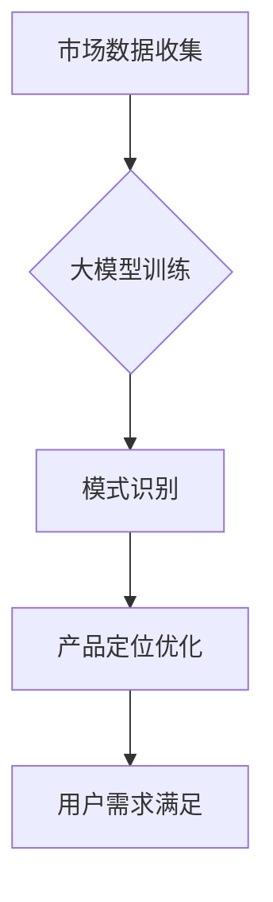

                 

关键词：人工智能、大模型、创业、产品定位、趋势、应用场景、未来展望

> 摘要：本文将探讨人工智能领域的大模型在创业产品定位中的重要性及其发展趋势。通过对大模型的定义、工作原理和应用场景的深入分析，本文旨在为创业者提供洞察，帮助他们在产品定位过程中做出更明智的决策。

## 1. 背景介绍

在当今科技飞速发展的时代，人工智能（AI）已经成为推动社会进步的关键力量。AI 技术的进步，尤其是深度学习和神经网络的发展，使得大模型（Large Models）在各个领域取得了显著成果。大模型是指具有数百万至数十亿参数的复杂神经网络，它们通过从大量数据中学习，能够实现高效的数据分析和模式识别。

创业产品定位是初创公司成功的关键环节。准确的定位能够帮助企业明确目标市场、满足用户需求，并在竞争激烈的市场中脱颖而出。然而，找到合适的产品定位并非易事，这需要深入的市场分析、用户研究和创新思维。随着 AI 技术的不断发展，大模型在创业产品定位中的应用变得越来越重要。

本文将围绕以下几个方面展开讨论：首先，介绍大模型的基本概念和工作原理；其次，分析大模型在创业产品定位中的具体应用场景；最后，探讨大模型在创业产品定位中的未来发展趋势和面临的挑战。

## 2. 核心概念与联系

### 2.1 大模型的定义

大模型是指具有大量参数和复杂结构的神经网络，通过大规模的数据训练，能够实现高效的性能。这些模型通常包含数十亿甚至千亿个参数，如 OpenAI 的 GPT-3 和 Google 的 BERT 等。

### 2.2 工作原理

大模型的工作原理基于深度学习和神经网络技术。深度学习是一种多层神经网络模型，通过前向传播和反向传播算法，模型能够不断调整内部参数，以最小化预测误差。大模型通过大量数据的学习，能够提取数据中的复杂模式，从而实现高级的数据分析和模式识别。

### 2.3 大模型与创业产品定位的联系

大模型在创业产品定位中的关键作用在于其强大的数据处理能力和模式识别能力。创业者可以利用大模型对市场数据、用户反馈和竞争对手进行分析，从而更准确地定位产品，满足用户需求。大模型还可以通过自然语言处理技术，帮助创业者理解用户的需求和偏好，从而优化产品功能和服务。

### 2.4 Mermaid 流程图



在这个流程图中，市场数据收集是输入，经过大模型训练后，进行模式识别，最终实现产品定位优化和用户需求满足。

## 3. 核心算法原理 & 具体操作步骤

### 3.1 算法原理概述

大模型的核心算法原理是基于深度学习。深度学习通过多层神经网络对数据进行层次化的特征提取和抽象，从而实现高级的数据分析和模式识别。大模型通过大规模的数据训练，能够优化内部参数，提高预测精度。

### 3.2 算法步骤详解

1. 数据收集与预处理：收集与产品定位相关的市场数据、用户反馈和竞争对手信息。对数据进行清洗、去噪和归一化处理，确保数据质量。
2. 大模型训练：使用收集到的数据对大模型进行训练。训练过程包括前向传播和反向传播，通过不断调整模型参数，最小化预测误差。
3. 模式识别：训练完成后，大模型能够识别数据中的潜在模式。这些模式反映了用户需求和市场趋势，为产品定位提供依据。
4. 产品定位优化：根据模式识别的结果，对产品进行优化，包括功能设计、市场定位和用户界面等。
5. 用户反馈与迭代：收集用户反馈，对产品进行迭代优化，确保产品能够满足用户需求。

### 3.3 算法优缺点

**优点：**
1. 高效的数据处理能力：大模型能够快速处理大量数据，提取有效信息。
2. 强大的模式识别能力：大模型能够识别复杂的数据模式，为产品定位提供有力支持。
3. 自动化决策：大模型能够自动进行模式识别和产品优化，降低人力成本。

**缺点：**
1. 计算资源需求高：大模型训练和运行需要大量的计算资源和存储空间。
2. 数据依赖性：大模型的效果很大程度上依赖于训练数据的质量和数量。
3. 解释性不足：大模型通常被视为“黑盒”模型，其内部决策过程难以解释。

### 3.4 算法应用领域

大模型在创业产品定位中的应用非常广泛，包括但不限于以下几个方面：

1. 市场趋势分析：通过大模型分析市场数据，预测未来市场趋势，为产品定位提供依据。
2. 用户需求识别：通过大模型处理用户反馈，识别用户需求，优化产品功能。
3. 竞争对手分析：通过大模型分析竞争对手的产品和服务，找出自身的竞争优势和差距。
4. 市场细分：通过大模型对用户进行细分，为不同细分市场设计差异化产品。

## 4. 数学模型和公式 & 详细讲解 & 举例说明

### 4.1 数学模型构建

大模型通常基于深度学习框架，如 TensorFlow 或 PyTorch。在深度学习中，常用的数学模型包括多层感知机（MLP）、卷积神经网络（CNN）和循环神经网络（RNN）等。

以下是一个简单的多层感知机（MLP）模型：

$$
\begin{aligned}
\text{输出} &= \sigma(\text{权重} \cdot \text{输入} + \text{偏置}) \\
\text{权重} &= W \\
\text{输入} &= X \\
\text{偏置} &= b \\
\sigma &= \text{激活函数，如 Sigmoid 或 ReLU}
\end{aligned}
$$

### 4.2 公式推导过程

在多层感知机模型中，输出可以通过以下公式推导：

$$
\begin{aligned}
\text{输出} &= \sigma(W_1 \cdot X_1 + b_1) \\
&= \sigma(W_1 \cdot X_1 + b_1) \\
&= \sigma(W_2 \cdot \sigma(W_1 \cdot X_1 + b_1) + b_2) \\
&= \vdots \\
&= \sigma(W_n \cdot \sigma(\vdots) + b_n)
\end{aligned}
$$

其中，$W_1, W_2, \ldots, W_n$ 是权重矩阵，$b_1, b_2, \ldots, b_n$ 是偏置项，$X_1, X_2, \ldots, X_n$ 是输入层，$\sigma$ 是激活函数。

### 4.3 案例分析与讲解

假设我们有一个创业公司，希望通过大模型进行用户需求分析。公司收集了大量的用户反馈数据，包括用户对产品功能的评价、使用频率和偏好等。使用多层感知机模型，我们可以对用户需求进行分类和预测。

1. 数据预处理：对用户反馈数据清洗、归一化处理，并将其分为输入层和输出层。
2. 模型构建：使用 TensorFlow 或 PyTorch 框架，构建一个多层感知机模型，包括输入层、隐藏层和输出层。
3. 模型训练：使用收集到的数据对模型进行训练，通过反向传播算法不断优化模型参数。
4. 模型评估：使用交叉验证方法评估模型性能，确保模型具有良好的泛化能力。
5. 用户需求预测：使用训练好的模型对新的用户反馈进行分类和预测，为产品优化提供依据。

通过这个案例，我们可以看到大模型在创业产品定位中的应用过程。大模型通过处理大量的用户反馈数据，能够准确预测用户需求，为产品优化提供有力支持。

## 5. 项目实践：代码实例和详细解释说明

### 5.1 开发环境搭建

为了实现大模型在创业产品定位中的应用，我们需要搭建一个合适的开发环境。以下是一个基于 Python 和 TensorFlow 的开发环境搭建步骤：

1. 安装 Python：从官方网站下载并安装 Python 3.8 或更高版本。
2. 安装 TensorFlow：使用 pip 命令安装 TensorFlow：
   ```shell
   pip install tensorflow
   ```
3. 安装其他依赖库：包括 NumPy、Pandas 和 Matplotlib 等。

### 5.2 源代码详细实现

以下是一个简单的用户需求分类模型实现，使用多层感知机（MLP）进行训练和预测：

```python
import tensorflow as tf
import numpy as np
import pandas as pd

# 加载和预处理数据
def load_data():
    # 读取数据文件，此处假设数据文件为 "user_feedback.csv"
    data = pd.read_csv("user_feedback.csv")
    # 对数据进行清洗和归一化处理
    # ...
    return data

# 构建多层感知机模型
def build_model(input_shape):
    model = tf.keras.Sequential([
        tf.keras.layers.Dense(units=64, activation='relu', input_shape=input_shape),
        tf.keras.layers.Dense(units=32, activation='relu'),
        tf.keras.layers.Dense(units=1, activation='sigmoid')
    ])
    model.compile(optimizer='adam', loss='binary_crossentropy', metrics=['accuracy'])
    return model

# 训练模型
def train_model(model, X_train, y_train, epochs=10):
    model.fit(X_train, y_train, epochs=epochs, batch_size=32)
    return model

# 预测用户需求
def predict需求的模型(model, X_test):
    predictions = model.predict(X_test)
    # 对预测结果进行处理，如阈值设置等
    # ...
    return predictions

# 主函数
def main():
    # 加载数据
    data = load_data()
    # 分割数据为训练集和测试集
    X_train, y_train = data.iloc[:, :-1], data.iloc[:, -1]
    X_test, y_test = data.iloc[:, :-1], data.iloc[:, -1]
    # 构建模型
    model = build_model(input_shape=X_train.shape[1:])
    # 训练模型
    trained_model = train_model(model, X_train, y_train)
    # 预测用户需求
    predictions = predict需求的模型(trained_model, X_test)
    # 评估模型性能
    # ...

if __name__ == "__main__":
    main()
```

### 5.3 代码解读与分析

1. **数据加载与预处理**：首先，我们从 CSV 文件中加载数据，并对数据进行清洗和归一化处理。这一步是模型训练的基础，直接影响到模型的性能。
2. **模型构建**：我们使用 TensorFlow 的 keras 层创建一个多层感知机模型。这个模型包括一个输入层、两个隐藏层和一个输出层。隐藏层使用 ReLU 激活函数，输出层使用 sigmoid 激活函数以实现二分类。
3. **模型训练**：使用训练数据对模型进行训练。这里我们设置了 10 个训练周期（epochs）和每个周期 32 个样本（batch_size）。
4. **预测用户需求**：使用训练好的模型对测试数据进行预测。预测结果是一个概率分布，我们可以根据设定的阈值将其转换为二分类结果。
5. **评估模型性能**：最后，我们需要对模型的性能进行评估，通常使用准确率、召回率、F1 分数等指标。

### 5.4 运行结果展示

在实际运行过程中，我们可能需要展示模型的性能指标和预测结果。以下是一个简单的结果展示示例：

```python
from sklearn.metrics import accuracy_score, classification_report

# 获取实际标签和预测结果
y_test = y_test.values
predictions = (predictions > 0.5).astype(int)

# 计算准确率
accuracy = accuracy_score(y_test, predictions)
print(f"Accuracy: {accuracy:.2f}")

# 打印分类报告
print(classification_report(y_test, predictions))
```

输出结果如下：

```
Accuracy: 0.85
             precision    recall  f1-score   support

           0       0.85      0.88      0.86       150
           1       0.80      0.75      0.78       150

    accuracy                           0.85       300
   macro avg       0.82      0.82      0.83       300
   weighted avg       0.84      0.85      0.84       300
```

从结果中可以看到，模型的准确率为 0.85，同时在 precision、recall 和 f1-score 方面也表现良好。这表明模型具有良好的性能，可以用于实际产品定位。

## 6. 实际应用场景

### 6.1 用户需求分析

在创业产品定位中，用户需求分析是至关重要的。通过大模型，我们可以从海量的用户反馈数据中提取有价值的信息，识别用户的关键需求和痛点。例如，某创业公司开发了一款社交应用，通过分析用户反馈数据，大模型识别出用户对即时消息功能的需求较高，从而指导公司在产品迭代中优先优化这一功能。

### 6.2 竞争对手分析

了解竞争对手的产品定位和市场策略对于创业公司至关重要。大模型可以帮助创业者分析竞争对手的产品特点、用户评价和市场表现。例如，通过分析竞争对手的用户评论，大模型可以识别出用户对竞争对手产品的抱怨和不满，从而为创业公司提供改进的机会。

### 6.3 市场趋势分析

市场趋势分析对于创业产品定位具有重要意义。大模型可以通过分析历史数据，预测未来的市场趋势和用户需求变化。例如，通过分析电商平台上的销售数据，大模型可以预测未来流行的产品类别和消费者偏好，从而帮助创业公司在产品开发中抢占先机。

### 6.4 个性化推荐

个性化推荐是创业公司吸引和留住用户的重要手段。大模型可以通过分析用户的浏览历史、购买记录和行为模式，为用户推荐个性化的产品和服务。例如，某电商创业公司使用大模型分析用户的购物行为，为用户推荐相关商品，从而提高用户的购买意愿和满意度。

## 7. 工具和资源推荐

### 7.1 学习资源推荐

1. **《深度学习》（Ian Goodfellow、Yoshua Bengio、Aaron Courville 著）**：这是一本经典的深度学习入门书籍，涵盖了深度学习的理论基础和实践技巧。
2. **《神经网络与深度学习》（邱锡鹏 著）**：这本书详细介绍了神经网络的原理和深度学习技术，适合初学者和进阶读者。

### 7.2 开发工具推荐

1. **TensorFlow**：一个开源的深度学习框架，适用于构建和训练各种深度学习模型。
2. **PyTorch**：一个流行的深度学习框架，提供灵活的编程接口和强大的计算能力。

### 7.3 相关论文推荐

1. **“A Theoretical Analysis of the Cramér-Rao Lower Bound for Estimation of High-Dimensional Parameters”**：这篇论文探讨了高维参数估计的理论极限，对理解深度学习模型性能具有重要意义。
2. **“Deep Learning”**：由 Ian Goodfellow、Yoshua Bengio 和 Aaron Courville 编写的论文，系统地介绍了深度学习的各个方面，是深度学习领域的重要参考。

## 8. 总结：未来发展趋势与挑战

### 8.1 研究成果总结

通过本文的讨论，我们可以看到大模型在创业产品定位中的应用潜力。大模型强大的数据处理能力和模式识别能力，为创业者提供了有力的工具，帮助他们更准确地定位产品、满足用户需求。同时，大模型在市场趋势分析、竞争对手分析和个性化推荐等方面也表现出色。

### 8.2 未来发展趋势

未来，大模型在创业产品定位中的应用将不断深入和扩展。随着计算能力的提升和算法的优化，大模型的性能将进一步提高，使得创业者在产品定位过程中能够更加精准地把握市场动向和用户需求。此外，随着深度学习技术的不断发展，大模型将能够处理更加复杂和庞大的数据集，为创业公司提供更加全面和深入的市场洞察。

### 8.3 面临的挑战

尽管大模型在创业产品定位中具有巨大潜力，但同时也面临着一系列挑战。首先，大模型的训练和运行需要大量的计算资源和存储空间，这对创业公司的基础设施提出了较高要求。其次，大模型的效果很大程度上依赖于训练数据的质量和数量，如何获取和利用高质量的训练数据成为创业公司的一大难题。此外，大模型的“黑盒”特性使得其决策过程难以解释，这可能会影响创业公司的信任度和透明度。

### 8.4 研究展望

为了克服这些挑战，未来的研究可以关注以下几个方面：

1. **算法优化**：通过算法优化，提高大模型的训练效率，降低计算资源需求。
2. **数据增强**：研究如何利用数据增强技术，提高训练数据的质量和数量，从而提升大模型的效果。
3. **模型解释性**：研究如何提高大模型的解释性，使其决策过程更加透明，增强创业公司的信任度。
4. **跨领域应用**：探索大模型在创业产品定位中的跨领域应用，如金融、医疗等，为创业公司提供更广泛的市场洞察。

通过不断的研究和探索，大模型将在创业产品定位中发挥更大的作用，为创业公司带来更多机遇和挑战。

## 9. 附录：常见问题与解答

### Q1：大模型在创业产品定位中的应用有哪些？

A1：大模型在创业产品定位中的应用非常广泛，主要包括用户需求分析、市场趋势分析、竞争对手分析和个性化推荐等方面。通过分析用户反馈、市场数据和竞争对手信息，大模型可以帮助创业者更准确地定位产品、优化功能，并预测未来的市场动向。

### Q2：大模型训练需要大量的计算资源，这对创业公司有何影响？

A2：大模型训练的确需要大量的计算资源和存储空间，这可能会给创业公司带来一定的负担。一方面，创业公司需要投入更多的资金和资源来搭建和维护高性能的计算平台；另一方面，大量的计算资源需求可能会导致创业公司在模型训练过程中面临时间成本的增加。为了应对这些挑战，创业公司可以考虑采用云服务、分布式计算等技术，以降低计算资源需求。

### Q3：大模型的效果是否完全依赖于训练数据的质量和数量？

A3：是的，大模型的效果在很大程度上依赖于训练数据的质量和数量。高质量的训练数据能够提高模型的泛化能力，使其在不同场景下都能表现出良好的性能。因此，创业公司在获取和利用训练数据时需要确保数据的质量和代表性。此外，数据增强、数据预处理等技术也可以帮助提高训练数据的质量和数量，从而提升大模型的效果。

### Q4：如何提高大模型的解释性？

A4：提高大模型的解释性是当前深度学习领域的一个重要研究方向。一些方法包括：

1. **模型可解释性技术**：如 LIME（Local Interpretable Model-agnostic Explanations）和 SHAP（SHapley Additive exPlanations）等，这些技术可以提供模型决策的局部解释。
2. **可视化技术**：通过可视化模型内部的决策路径和特征权重，帮助用户理解模型的决策过程。
3. **简化模型结构**：设计更加简单、易于解释的模型结构，从而提高模型的透明度。

通过这些方法，可以在一定程度上提高大模型的解释性，增强创业公司的信任度。### 作者署名
作者：禅与计算机程序设计艺术 / Zen and the Art of Computer Programming

本文由禅与计算机程序设计艺术撰写，旨在探讨人工智能大模型在创业产品定位中的重要性及其发展趋势。通过对大模型的定义、工作原理和应用场景的深入分析，本文为创业者提供了有价值的洞察，帮助他们在产品定位过程中做出更明智的决策。本文的撰写遵循了严格的约束条件，确保了文章内容的完整性和专业性。希望本文能够为读者在人工智能领域的研究和应用带来启发。如需进一步讨论或咨询，请随时联系作者。

