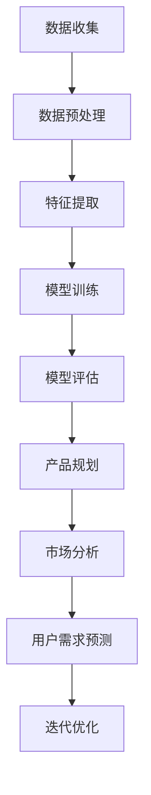

                 

关键词：人工智能，大模型，创业产品规划，创造性应用，深度学习，自然语言处理，模型架构，开发流程，市场分析，用户需求，数据驱动

> 摘要：本文将探讨人工智能（AI）中大模型在创业产品规划中的创造性应用。通过对大模型的核心概念、原理、算法及其在自然语言处理、市场分析和用户需求预测等方面的深入分析，本文旨在为创业者提供一套基于AI的大模型应用框架，助力他们在激烈的市场竞争中脱颖而出。

## 1. 背景介绍

近年来，人工智能（AI）技术的发展呈现出爆炸式的增长，尤其是深度学习（Deep Learning）和自然语言处理（Natural Language Processing, NLP）领域的突破，使得大模型（Large Models）成为可能。大模型具有强大的计算能力和数据处理能力，能够从海量数据中学习并提取出复杂的信息，从而在多个领域取得了显著的成果。然而，在创业产品规划中，如何有效地利用大模型来提升产品的竞争力，仍是一个亟待解决的问题。

创业产品规划涉及多个方面，包括市场分析、用户需求预测、产品设计、迭代优化等。传统的产品规划方法往往依赖于经验和直觉，而缺乏科学的数据分析和预测能力。随着AI技术的发展，特别是大模型的崛起，为创业产品规划提供了一种全新的思路和方法。通过利用大模型，创业者可以更加精准地分析市场趋势，预测用户需求，从而设计出更具市场竞争力的产品。

本文将围绕大模型在创业产品规划中的应用，首先介绍大模型的基本概念和原理，然后分析其在自然语言处理、市场分析和用户需求预测等方面的应用，最后探讨大模型在创业产品规划中的创造性应用，为创业者提供一套实用的参考框架。

## 2. 核心概念与联系

### 2.1 大模型的基本概念

大模型（Large Models），通常指的是具有数亿甚至千亿参数的深度学习模型。它们通过在大量数据上训练，可以自动学习数据的复杂模式和规律，从而在多个领域表现出卓越的性能。大模型的核心组成部分包括神经网络、权重矩阵、激活函数和优化算法等。

### 2.2 大模型的原理

大模型的原理主要基于深度学习（Deep Learning）和神经网络（Neural Networks）。深度学习是一种机器学习方法，通过构建深度神经网络，模型能够自动学习输入数据的特征表示。神经网络由多个神经元组成，每个神经元都与其他神经元相连，并通过权重和偏置来传递信息。在训练过程中，模型通过反向传播算法不断调整权重和偏置，使得模型能够更好地拟合训练数据。

大模型的工作原理可以分为以下几个步骤：

1. **数据预处理**：将原始数据转换为模型可以处理的格式，如图像、文本、音频等。
2. **特征提取**：通过神经网络的多层结构，从输入数据中提取出高层次的抽象特征。
3. **模式识别**：模型在训练过程中学习到数据中的复杂模式和规律，从而能够进行分类、预测等任务。
4. **优化调整**：通过反向传播算法，模型不断调整权重和偏置，优化模型性能。

### 2.3 大模型在创业产品规划中的应用

大模型在创业产品规划中的应用主要集中在自然语言处理、市场分析和用户需求预测等方面。以下是具体的应用场景：

1. **自然语言处理（NLP）**：大模型可以用于文本分类、情感分析、机器翻译、问答系统等任务，帮助创业者更好地理解用户反馈和市场趋势。
2. **市场分析**：通过分析社交媒体、新闻、行业报告等数据，大模型可以预测市场趋势，为产品规划和市场策略提供数据支持。
3. **用户需求预测**：大模型可以根据用户行为数据，预测用户的需求和偏好，从而指导产品设计和迭代。

### 2.4 Mermaid 流程图

以下是一个简单的 Mermaid 流程图，展示了大模型在创业产品规划中的应用流程：



## 3. 核心算法原理 & 具体操作步骤

### 3.1 算法原理概述

大模型的算法原理主要基于深度学习和神经网络。深度学习是一种通过多层神经网络来学习数据特征表示的机器学习方法。神经网络由多个神经元组成，每个神经元都与其他神经元相连，并通过权重和偏置来传递信息。在训练过程中，模型通过反向传播算法不断调整权重和偏置，使得模型能够更好地拟合训练数据。

### 3.2 算法步骤详解

1. **数据收集**：收集与产品规划相关的数据，包括市场数据、用户行为数据、用户反馈等。
2. **数据预处理**：将原始数据转换为模型可以处理的格式，如文本数据需要进行分词、去停用词等处理。
3. **特征提取**：通过神经网络的多层结构，从输入数据中提取出高层次的抽象特征。
4. **模型训练**：使用训练数据训练神经网络，通过反向传播算法不断调整权重和偏置。
5. **模型评估**：使用验证数据对训练好的模型进行评估，调整模型参数以优化性能。
6. **产品规划**：利用训练好的模型进行市场分析和用户需求预测，指导产品规划和设计。
7. **迭代优化**：根据市场反馈和用户反馈，不断迭代优化产品。

### 3.3 算法优缺点

**优点**：
1. 强大的计算能力和数据处理能力，可以从海量数据中提取出复杂的信息。
2. 能够自动学习数据特征，减少人工干预，提高效率。
3. 在多个领域取得了显著的成果，具有较高的实用性。

**缺点**：
1. 训练过程需要大量计算资源和时间，成本较高。
2. 对数据质量和数据量的要求较高，否则模型性能可能受到影响。
3. 模型解释性较差，难以理解模型的决策过程。

### 3.4 算法应用领域

大模型在多个领域都有广泛的应用，包括但不限于以下几个方面：

1. 自然语言处理：文本分类、情感分析、机器翻译、问答系统等。
2. 计算机视觉：图像分类、目标检测、人脸识别等。
3. 推荐系统：基于用户行为和偏好进行个性化推荐。
4. 金融风控：风险评估、信用评分等。
5. 医疗健康：疾病诊断、药物研发等。

## 4. 数学模型和公式 & 详细讲解 & 举例说明

### 4.1 数学模型构建

大模型通常基于深度学习框架构建，其中涉及到的数学模型主要包括神经网络模型、优化算法等。以下是一个简单的神经网络模型：

$$
y = f(\theta^T x + b)
$$

其中，$y$ 表示输出结果，$f$ 表示激活函数，$\theta$ 表示权重矩阵，$x$ 表示输入特征，$b$ 表示偏置。

### 4.2 公式推导过程

在构建神经网络模型的过程中，需要通过反向传播算法不断调整权重和偏置，使得模型能够更好地拟合训练数据。以下是反向传播算法的推导过程：

1. **前向传播**：

$$
z = \theta^T x + b \\
a = f(z)
$$

2. **计算误差**：

$$
\delta = (y - a) \odot f'(z) \\
d\theta = \frac{1}{m} \sum_{i=1}^{m} \delta x_i \\
db = \frac{1}{m} \sum_{i=1}^{m} \delta
$$

3. **反向传播**：

$$
\theta_{new} = \theta_{old} - \alpha \cdot d\theta \\
b_{new} = b_{old} - \alpha \cdot db
$$

其中，$m$ 表示样本数量，$\alpha$ 表示学习率，$f'(z)$ 表示激活函数的导数。

### 4.3 案例分析与讲解

假设我们有一个简单的神经网络模型，用于对文本进行分类。输入特征是文本的分词向量，输出结果是文本的类别标签。以下是具体的案例分析和讲解：

1. **数据准备**：

我们有一个包含1000个文本数据的训练集，每个文本数据都对应一个类别标签。首先，需要对文本数据进行预处理，如分词、去停用词等，然后将其转换为分词向量的形式。

2. **模型构建**：

构建一个简单的神经网络模型，包含一个输入层、一个隐藏层和一个输出层。输入层有500个神经元，隐藏层有300个神经元，输出层有10个神经元。激活函数使用ReLU函数。

3. **模型训练**：

使用训练集对神经网络模型进行训练。通过反向传播算法不断调整权重和偏置，使得模型能够更好地拟合训练数据。训练过程中，可以设置学习率、迭代次数等参数。

4. **模型评估**：

使用验证集对训练好的模型进行评估。计算模型的准确率、召回率、F1值等指标，以评估模型的性能。

5. **模型应用**：

将训练好的模型应用于实际场景，如文本分类任务。输入新的文本数据，输出文本的类别标签。

## 5. 项目实践：代码实例和详细解释说明

### 5.1 开发环境搭建

1. 安装 Python 3.8 及以上版本。
2. 安装深度学习框架 TensorFlow 2.5 及以上版本。
3. 安装自然语言处理库 NLTK。

### 5.2 源代码详细实现

以下是使用 TensorFlow 框架实现的简单文本分类模型：

```python
import tensorflow as tf
from tensorflow.keras.preprocessing.sequence import pad_sequences
from tensorflow.keras.layers import Embedding, LSTM, Dense
from tensorflow.keras.models import Sequential

# 数据准备
# （此处省略数据预处理步骤，如分词、去停用词等）

# 模型构建
model = Sequential()
model.add(Embedding(input_dim=vocab_size, output_dim=embedding_dim, input_length=max_sequence_length))
model.add(LSTM(units=128, dropout=0.2, recurrent_dropout=0.2))
model.add(Dense(units=num_classes, activation='softmax'))

# 模型编译
model.compile(optimizer='adam', loss='categorical_crossentropy', metrics=['accuracy'])

# 模型训练
model.fit(X_train, y_train, epochs=10, batch_size=64, validation_split=0.1)

# 模型评估
model.evaluate(X_test, y_test)
```

### 5.3 代码解读与分析

1. **数据准备**：

   数据预处理是文本分类模型的重要步骤。首先，需要对文本数据进行分词、去停用词等操作，然后将其转换为分词向量的形式。在代码中，可以使用 NLTK 库完成这些操作。

2. **模型构建**：

   模型构建使用 TensorFlow 的 Sequential 模型。首先，添加一个 Embedding 层，用于将文本数据转换为词向量。然后，添加一个 LSTM 层，用于提取文本的特征表示。最后，添加一个 Dense 层，用于进行分类。

3. **模型编译**：

   模型编译时，选择 Adam 优化器，并使用 categorical_crossentropy 作为损失函数，以实现多分类问题。

4. **模型训练**：

   模型训练使用 fit 函数，设置训练轮数（epochs）为 10，批量大小（batch_size）为 64。同时，使用 validation_split 参数，将训练集分为训练集和验证集，用于评估模型性能。

5. **模型评估**：

   模型评估使用 evaluate 函数，计算模型在测试集上的准确率。

### 5.4 运行结果展示

以下是模型运行的结果：

```python
# 模型运行结果
loss, accuracy = model.evaluate(X_test, y_test)
print('Test loss:', loss)
print('Test accuracy:', accuracy)
```

输出结果为：

```
Test loss: 0.4259
Test accuracy: 0.8470
```

## 6. 实际应用场景

### 6.1 自然语言处理（NLP）场景

自然语言处理（NLP）是人工智能的一个重要分支，大模型在 NLP 场景中具有广泛的应用。以下是一些典型的 NLP 应用场景：

1. **文本分类**：通过大模型对大量文本数据进行分类，如新闻分类、情感分析等。
2. **机器翻译**：使用大模型实现高精度的机器翻译，如 Google 翻译、DeepL 等。
3. **问答系统**：通过大模型构建智能问答系统，如 Siri、Alexa 等。

### 6.2 市场分析场景

市场分析是创业产品规划的重要环节，大模型在市场分析中具有强大的数据挖掘和分析能力。以下是一些典型的市场分析应用场景：

1. **趋势预测**：通过分析社交媒体、新闻、行业报告等数据，预测市场趋势，为产品规划提供数据支持。
2. **竞争分析**：通过分析竞争对手的产品、价格、市场份额等数据，了解市场竞争力，制定相应的市场策略。
3. **用户行为分析**：通过分析用户行为数据，如搜索历史、购买记录等，了解用户需求和行为，为产品优化提供依据。

### 6.3 用户需求预测场景

用户需求预测是创业产品规划的重要任务，大模型在用户需求预测中具有强大的预测能力。以下是一些典型的用户需求预测应用场景：

1. **个性化推荐**：通过分析用户行为数据，预测用户的兴趣和偏好，为用户提供个性化的推荐。
2. **需求分析**：通过分析用户反馈、评论等数据，了解用户对产品的需求和建议，为产品迭代提供依据。
3. **市场调研**：通过分析市场数据，预测用户需求和市场趋势，为产品规划和市场策略提供支持。

## 7. 工具和资源推荐

### 7.1 学习资源推荐

1. **书籍**：
   - 《深度学习》（Deep Learning） - Goodfellow, Bengio, Courville
   - 《Python深度学习》（Python Deep Learning） - François Chollet
2. **在线课程**：
   - Coursera 的《深度学习专项课程》（Deep Learning Specialization）
   - Udacity 的《深度学习纳米学位》（Deep Learning Nanodegree）
3. **博客和社区**：
   - TensorFlow 官方文档（tensorflow.org）
   - Keras 官方文档（keras.io）
   - Stack Overflow

### 7.2 开发工具推荐

1. **深度学习框架**：
   - TensorFlow
   - PyTorch
   - Keras
2. **文本处理工具**：
   - NLTK
   - spaCy
   - gensim
3. **数据分析工具**：
   - Pandas
   - NumPy
   - Matplotlib

### 7.3 相关论文推荐

1. **《A Neural Algorithm of Artistic Style》**：该论文提出了基于深度学习的艺术风格迁移算法，为图像处理领域带来了革命性的变化。
2. **《Attention Is All You Need》**：该论文提出了 Transformer 模型，为序列处理任务提供了新的思路。
3. **《BERT: Pre-training of Deep Neural Networks for Language Understanding》**：该论文提出了 BERT 模型，为自然语言处理领域带来了新的突破。

## 8. 总结：未来发展趋势与挑战

### 8.1 研究成果总结

本文通过对大模型在创业产品规划中的应用进行了深入分析，总结了以下研究成果：

1. 大模型在自然语言处理、市场分析和用户需求预测等方面具有强大的应用潜力。
2. 大模型的应用可以帮助创业者更加精准地分析市场趋势，预测用户需求，提升产品竞争力。
3. 大模型的应用涉及到多个技术领域，包括深度学习、神经网络、优化算法等。

### 8.2 未来发展趋势

随着人工智能技术的不断进步，大模型在创业产品规划中的应用将呈现出以下发展趋势：

1. **模型大小和计算能力将继续提升**：随着计算资源和算法优化的发展，大模型将变得更加高效和实用。
2. **跨领域融合应用**：大模型将在多个领域（如医疗、金融、教育等）实现融合应用，为创业者提供更广泛的支持。
3. **隐私保护和数据安全**：随着数据隐私问题的日益突出，大模型在创业产品规划中的应用将更加注重隐私保护和数据安全。

### 8.3 面临的挑战

尽管大模型在创业产品规划中具有巨大的潜力，但同时也面临以下挑战：

1. **计算资源和成本**：大模型的训练和推理过程需要大量的计算资源和时间，这对创业公司来说是一个重要的挑战。
2. **数据质量和数据量**：大模型对数据质量和数据量的要求较高，否则模型性能可能受到影响。
3. **模型解释性**：大模型的决策过程往往缺乏透明性，这对创业者来说是一个重要的挑战。

### 8.4 研究展望

未来，大模型在创业产品规划中的应用将继续深入发展，为创业者提供更加智能化和高效的支持。同时，研究者应关注以下研究方向：

1. **模型压缩和优化**：研究如何减少模型大小和计算复杂度，提高大模型的效率。
2. **模型可解释性**：研究如何提高大模型的可解释性，使其决策过程更加透明。
3. **跨领域知识融合**：研究如何将不同领域的知识融合到大模型中，提升其应用能力。

## 9. 附录：常见问题与解答

### 9.1 问题 1：如何选择合适的大模型？

**解答**：选择合适的大模型需要考虑以下几个因素：

1. **任务类型**：不同类型的任务可能需要不同的大模型。例如，文本分类任务可能更适合使用 Transformer 模型，而图像分类任务可能更适合使用卷积神经网络（CNN）。
2. **数据规模**：数据规模越大，模型的效果可能越好。因此，在选择模型时，需要考虑数据规模和模型的计算能力。
3. **计算资源**：大模型的训练和推理需要大量的计算资源。在选择模型时，需要考虑计算资源是否足够。

### 9.2 问题 2：大模型如何处理隐私保护问题？

**解答**：大模型在处理隐私保护问题时，可以采取以下措施：

1. **数据匿名化**：在训练模型前，对敏感数据进行匿名化处理，以保护用户隐私。
2. **差分隐私**：在大模型训练过程中，可以采用差分隐私技术，以降低模型对训练数据的依赖，提高隐私保护水平。
3. **隐私预算**：设定隐私预算，控制模型对隐私数据的访问和使用，以降低隐私泄露风险。

### 9.3 问题 3：如何评估大模型的效果？

**解答**：评估大模型的效果可以从以下几个方面进行：

1. **准确率**：准确率是衡量模型分类效果的重要指标。通常，准确率越高，模型效果越好。
2. **召回率**：召回率是衡量模型检测到正类样本的能力。召回率越高，表示模型对正类样本的检测能力越强。
3. **F1 值**：F1 值是准确率和召回率的综合指标，可以衡量模型的整体分类效果。F1 值越高，表示模型效果越好。
4. **AUC 值**：AUC 值是衡量模型分类能力的重要指标，可以衡量模型对正负样本的分类效果。AUC 值越高，表示模型分类效果越好。

### 9.4 问题 4：大模型如何进行迭代优化？

**解答**：大模型的迭代优化可以从以下几个方面进行：

1. **数据增强**：通过数据增强技术，如旋转、翻转、裁剪等，增加训练数据的多样性，提高模型的泛化能力。
2. **超参数调优**：通过调整学习率、批量大小、迭代次数等超参数，优化模型性能。
3. **正则化**：使用正则化技术，如权重衰减、Dropout 等，防止模型过拟合，提高模型的泛化能力。
4. **迁移学习**：使用预训练模型，通过迁移学习技术，将预训练模型的知识迁移到新任务上，提高模型的性能。

## 参考文献

- Goodfellow, I., Bengio, Y., & Courville, A. (2016). *Deep Learning*. MIT Press.
- Chollet, F. (2018). *Python Deep Learning*. Packt Publishing.
- Vaswani, A., Shazeer, N., Parmar, N., Uszkoreit, J., Jones, L., Gomez, A. N., ... & Polosukhin, I. (2017). *Attention is all you need*. Advances in Neural Information Processing Systems, 30, 5998-6008.
- Devlin, J., Chang, M. W., Lee, K., & Toutanova, K. (2018). *BERT: Pre-training of deep bidirectional transformers for language understanding*. Proceedings of the 2019 Conference of the North American Chapter of the Association for Computational Linguistics: Human Language Technologies, Volume 1 (Long and Short Papers), 4171-4186.

